# Fashion-MNIST: From Classical Machine Learning Baselines to Convolutional Neural Networks

**Deep Learning Exam Project: end-to-end image-classification study on the Fashion-MNIST dataset**

*Upgraded edition (v2): advanced EDA and manifold learning, gradient-boosting baselines with automated hyper-parameter search, a residual CNN and a Vision Transformer, four ensembling strategies, model explainability, an inline unit-test suite and a full statistical treatment of the results.*

| Item | Value |
|---|---|
| Dataset | `zalando-research/fashionmnist` (Kaggle), 70,000 grayscale 28x28 images, 10 balanced classes |
| Acquisition | `kagglehub.dataset_download(...)` -> `fashion-mnist_train.csv`, `fashion-mnist_test.csv` |
| Frameworks | PyTorch (deep learning), scikit-learn, XGBoost / LightGBM / CatBoost, Optuna, UMAP, SHAP / LIME, statsmodels / SciPy, pandas / matplotlib / seaborn |
| Target runtime | Google Colab: NVIDIA **T4** GPU (15 GB VRAM), 12.7 GB system RAM, 112 GB disk |
| Models | Logistic Regression, Linear SVM, RBF SVM, Random Forest, XGBoost, LightGBM, CatBoost, MLP, CNN, residual CNN, Vision Transformer, plus soft-voting / weighted / stacked and hybrid ML+DL ensembles |
| Deliverable | This notebook: code + markdown narrative + 45 figures + comparison tables + an inline unit-test suite + exported artifacts |
| Edition | **v2 (upgraded)**: v1 results are preserved verbatim; every addition is marked "upgraded edition" |

> **How to run:** `Runtime -> Change runtime type -> Hardware accelerator: T4 GPU`, then `Runtime -> Run all`.
> Total expected wall-clock time on a T4: **~75–110 minutes** for the full v2 study (t-SNE/UMAP, the boosting models, the Optuna search, the ViT and the ensembles dominate); **~8–12 minutes** in smoke-test mode.
> Every expensive step is controlled by a switch in the `CFG` / `CFGX` configuration cells, so the notebook can also be run in a fast "smoke-test" mode (`cfgx = CFGX(fast_mode=True)`). Every optional third-party library is probed before use, so a missing package skips a section with an explanation instead of raising.

---

## Table of contents

**Part I: the original study (v1)**

0. [Problem statement and motivation](#sec0): task, relevance, RQ1–RQ4 (and RQ5–RQ10 for the upgrade)
1. [Loading the dataset](#sec1): KaggleHub download, CSV parsing, integrity checks, tensor conversion, splits
2. [Exploratory Data Analysis](#sec2): class distribution, samples, pixel statistics, class templates, PCA
3. [Traditional machine-learning baselines](#sec3): Logistic Regression, SVMs, Random Forest
4. [Deep-learning models](#sec4): MLP, CNN, training loop, evaluation, confusion matrices, error analysis

**Part II: the upgraded edition (v2)**

2.6–2.10 [Advanced EDA](#sec2): intensity distributions, image metrics, pixel correlations, t-SNE / UMAP in 2D & 3D,
clustering, outlier detection with Isolation Forest **and** a convolutional autoencoder  
3.7–3.9 [Gradient boosting and automated tuning](#sec3): XGBoost, LightGBM, CatBoost, `GridSearchCV`, Optuna  
4.9–4.12 [Modern architectures](#sec4): `fit_v2` (schedulers, early stopping, checkpointing), residual CNN,
Vision Transformer  
5. [Advanced ensembling](#sec5b): soft / weighted / stacked voting, hybrid ML+DL committees  
6. [Model explainability](#sec6b): Grad-CAM, Integrated Gradients, occlusion, SHAP, LIME, attention roll-out  
7. [Unit tests](#sec7b): tensor shapes, model output dimensions, loss values, probability contracts  
8. [Statistical validity](#sec8b): McNemar, Cochran's Q, Holm correction, Wilson and bootstrap intervals  

**Part III: context and conclusions**

9. [Comparison with previous research](#sec9): published results vs. ours, for both editions
10. [Final discussion and communication](#sec10): what worked, limitations, future work
11. [References](#sec11): 48 sources
12. [Appendix](#sec12): reproducibility checklists, exam-criteria map, session summary

<a id="sec0"></a>
# 0. Problem statement and motivation

> Exam criterion: **Problem Statement (0–10)**: *"Is the problem clearly defined? Is it relevant?"*

## 0.1 The problem, stated formally

Given a grayscale image $x \in \mathbb{R}^{28 \times 28}$ with pixel values in $\{0, 1, \dots, 255\}$, predict the garment
category $y \in \{0, 1, \dots, 9\}$ that the image depicts. We learn a parametric mapping
$f_\theta : \mathbb{R}^{784} \rightarrow \Delta^{9}$ (a probability distribution over the ten classes) by minimising the
multi-class cross-entropy (negative log-likelihood) over a labelled training set of 60,000 examples:

$$\mathcal{L}(\theta) = -\frac{1}{N}\sum_{i=1}^{N} \log f_\theta\big(x^{(i)}\big)_{y^{(i)}} \; + \; \lambda\,\Omega(\theta)$$

and we report performance on a **held-out test set of 10,000 images that is never used for model selection**.

**This is a single-label, closed-set, balanced, multi-class image-classification task.** Each image contains exactly one
garment, photographed on a neutral background, already centred and size-normalised by Zalando's preprocessing pipeline.

The ten classes are:

| Label | Class | Label | Class |
|---|---|---|---|
| 0 | T-shirt/top | 5 | Sandal |
| 1 | Trouser | 6 | Shirt |
| 2 | Pullover | 7 | Sneaker |
| 3 | Dress | 8 | Bag |
| 4 | Coat | 9 | Ankle boot |

## 0.2 Why this problem is relevant in the real world

1. **E-commerce catalogue automation.** Zalando (the company that released this dataset) processes millions of product
   photographs per year. Automatic category tagging drives search, filtering, recommendation and inventory management;
   a mislabelled item is effectively invisible to customers. Fashion-MNIST is a deliberately small, public proxy for
   exactly that industrial pipeline.
2. **Visual search and recommendation.** "Find me something like this" features require a robust garment-category
   embedding as a first stage before fine-grained similarity ranking.
3. **A serious benchmark replacing MNIST.** Xiao, Rasul and Vollgraf (2017) released Fashion-MNIST precisely because
   handwritten-digit MNIST is "too easy": classical methods already exceed 97 % and CNNs reach 99.7 %, so the benchmark
   no longer discriminates between algorithms. Fashion-MNIST is a **drop-in replacement** (same 28x28 grayscale format,
   same 60k/10k split, same file layout) but substantially harder, mainly because of the visually confusable
   *T-shirt / Pullover / Coat / Shirt* group.
4. **Cost-constrained deployment.** Garment tagging must run cheaply at scale. A central practical question of this
   project is therefore not only *"what is the highest achievable accuracy?"* but **"what accuracy do we get per unit of
   compute?"**: we deliberately compare a 5-minute CNN on a single T4 with classical models and with published
   heavyweight architectures.

## 0.3 Research questions

* **RQ1**: How much better is a convolutional network than strong classical baselines (Logistic Regression, SVM,
  Random Forest) on identical, properly preprocessed data?
* **RQ2**: How much of that gap comes from *convolution* itself and how much from *regularisation* (BatchNorm,
  Dropout, data augmentation)? The MLP is the control condition: same optimiser, same schedule, no spatial prior.
* **RQ3**: Which classes remain confusable after training, and is the residual error **irreducible label noise** or a
  modelling failure? (Analysed with the confusion matrix and inspection of misclassified images.)
* **RQ4**: How do our numbers compare with the published literature (Section 5), and are the differences statistically
  meaningful given a 10,000-image test set?

## 0.4 Success criteria defined *before* running anything

| Criterion | Target |
|---|---|
| Classical baseline reproduced within ~1 pp of the official benchmark | Logistic Regression ≈ 0.84, RBF SVM ≈ 0.89, Random Forest ≈ 0.87 |
| MLP test accuracy | ≥ 0.88 |
| CNN test accuracy | ≥ 0.92 (competitive with published mid-size CNNs) |
| Honest protocol | test set touched exactly **once**, after all model selection is complete |
| Runtime | full notebook < 30 min on a single T4 |

## 0.5 Scope of this **upgraded edition** (v2)

The first edition of this notebook answered RQ1–RQ4 with five classical baselines, an MLP and a CNN. This second
edition keeps **every result and every conclusion of the original study intact** and extends it into a full
production-grade study: advanced EDA (manifold learning, clustering, anomaly detection), gradient-boosting baselines
with automated hyper-parameter search, two additional deep architectures (a residual CNN and a Vision Transformer
tailored to 28x28 grayscale inputs), ensembling, explainability, an inline unit-test suite and a rigorous statistical
comparison of every model pair.

### 0.5.1 Additional research questions

* **RQ5**: Does the *global* geometry of pixel space (PCA / t-SNE / UMAP) predict the confusion structure that the
  trained classifiers actually exhibit, and can unsupervised clustering recover the label taxonomy without labels?
* **RQ6**: Are there **anomalous / mislabelled** images in Fashion-MNIST, and do two independent detectors
  (Isolation Forest on a PCA embedding, and a convolutional autoencoder's reconstruction error) agree on which they
  are?
* **RQ7**: Do modern **gradient-boosting** frameworks (XGBoost, LightGBM, CatBoost), which dominate tabular
  benchmarks, close the gap to a CNN when pixels are treated as tabular features? Does automated tuning (Optuna)
  change the answer?
* **RQ8**: Does a **Vision Transformer**, which has *no* convolutional inductive bias, remain competitive at
  28x28 resolution and 54k training images: the regime where transformers are usually said to fail?
* **RQ9**: How much accuracy does **ensembling** actually buy over the single best model, is that gain
  *statistically significant* (McNemar / bootstrap), and is a hybrid ML+DL ensemble better than a pure DL ensemble?
* **RQ10**: Do explainability methods (Grad-CAM, Integrated Gradients, occlusion, SHAP) agree with the EDA about
  *which pixels* carry the class signal: i.e. is the model right **for the right reasons**?

### 0.5.2 Additional success criteria (again, fixed before running anything)

| Criterion | Target |
|---|---|
| Best gradient-boosting baseline | ≥ 0.88 test accuracy (i.e. beats Random Forest) |
| Residual CNN | ≥ 0.930 test accuracy |
| Vision Transformer (from scratch, no pre-training) | ≥ 0.900 test accuracy |
| Best ensemble | ≥ +0.3 pp over the best single model, **and** McNemar p < 0.05 |
| Unit-test suite | 100 % of assertions pass before any conclusion is drawn |
| Explainability | saliency mass concentrated on the garment, not on the background |
| Reproducibility | one `CFG`/`CFGX` cell controls every switch; a `fast_mode` smoke test runs end to end |

### 0.5.3 Where each new component lives

| Requirement | Section |
|---|---|
| Train/test leakage: byte-exact detection and removal | 1.5b |
| Pixel-intensity distributions (global + per class) | 2.6 |
| Image metrics: mean / variance images, pixel correlation heat-maps | 2.7 |
| Dimensionality reduction: PCA (2D/3D), t-SNE (tuned), UMAP (tuned) | 2.8 |
| Unsupervised clustering + agreement with the label taxonomy | 2.9 |
| Outlier detection: Isolation Forest **and** a convolutional autoencoder | 2.10 |
| XGBoost / LightGBM / CatBoost | 3.7 |
| Automated hyper-parameter tuning (Optuna, `GridSearchCV` fallback) | 3.8 |
| Residual CNN, Vision Transformer, upgraded trainer (schedulers, early stopping, checkpointing) | 4.9 – 4.12 |
| Deep ensembles (soft voting, weighted voting, stacking) and hybrid ML+DL ensembles | 5 |
| Explainability (Grad-CAM, Integrated Gradients, occlusion, SHAP, LIME) | 6 |
| Unit tests (tensor shapes, model output dims, loss values) | 7 |
| Statistical validity (McNemar, bootstrap CIs, Cochran's Q, Holm correction) | 8 |

### 0.5.4 Runtime budget of the upgraded notebook

| Mode | Switch | Wall-clock on a Colab T4 |
|---|---|---|
| Full study | `cfgx = CFGX()` (default) | ≈ 75–110 min |
| Fast smoke test | `cfgx = CFGX(fast_mode=True)` + the `CFG` overrides in Section 12.3 | ≈ 8–12 min |

Every expensive block is behind a boolean switch, and every optional third-party library is behind an availability
probe, so **the notebook always runs end to end**: a missing package degrades a section into a printed explanation
instead of raising.

<a id="sec1"></a>
# 1. Loading the dataset

> Exam criterion: **Data Gathering / Cleaning / Formatting (0–10)**: *"How was the data acquired? Is the process
> statistically valid? How was the data cleaned and formatted?"*

This section is organised as:

1. **1.1** Environment check (GPU, RAM, disk) and dependency installation.
2. **1.2** Imports, global configuration and seeding.
3. **1.3** KaggleHub download of `zalando-research/fashionmnist`.
4. **1.4** Reading the CSV files with pandas and documenting the file structure.
5. **1.5** Integrity and cleaning checks (dtypes, ranges, NaNs, duplicates, label validity).
6. **1.6** Conversion to PyTorch tensors, normalisation, train/validation split and `DataLoader` construction.

## 1.1 Environment check and dependencies

The notebook is written for the Colab **T4** runtime described in the exam brief:

| Resource | Available | How this project uses it |
|---|---|---|
| GPU | NVIDIA T4, 15 GB VRAM | CNN/MLP training with mixed precision (T4 has FP16 tensor cores) |
| System RAM | 12.7 GB | The full dataset as `float32` is only ~220 MB, so everything is held in RAM: no streaming needed |
| Disk | 112 GB | Kaggle download ≈ 140 MB (CSV): negligible |

**Memory budget (why this fits comfortably):** 70,000 x 784 pixels x 4 bytes (float32) ≈ **220 MB**; as `uint8` it is
only 55 MB. Even with the pandas intermediate DataFrames (which are the real peak, ~1.1 GB because pandas parses the CSV
into `int64`) we stay far below 12.7 GB: we explicitly downcast to `uint8` and free the DataFrames afterwards.


```python
# --- Environment inspection (safe to run anywhere; the shell calls are Colab-friendly) -------------
import platform
import shutil
import subprocess
import sys


def run_shell(cmd: str) -> str:
    """Run a shell command and return its stdout, or an explanatory message if unavailable."""
    try:
        out = subprocess.run(cmd, shell=True, capture_output=True, text=True, timeout=60)
        return (out.stdout or out.stderr).strip()
    except Exception as exc:  # noqa: BLE001 - diagnostics must never break the notebook
        return f"[not available: {exc}]"


print("Python :", sys.version.split()[0], "|", platform.platform())
print("\n--- GPU -------------------------------------------------------------")
print(run_shell("nvidia-smi --query-gpu=name,memory.total,driver_version --format=csv,noheader"))
print("\n--- System RAM ------------------------------------------------------")
print(run_shell("free -h | head -2"))
print("\n--- Disk ------------------------------------------------------------")
total, used, free = shutil.disk_usage("/")
print(f"total={total / 1e9:.1f} GB  used={used / 1e9:.1f} GB  free={free / 1e9:.1f} GB")
```

    Python : 3.13.15 | Linux-6.6.122+-x86_64-with-glibc2.35
    
    --- GPU -------------------------------------------------------------
    Tesla T4, 15360 MiB, 580.82.07
    
    --- System RAM ------------------------------------------------------
    total        used        free      shared  buff/cache   available
    Mem:            12Gi       1.7Gi       7.4Gi       2.0Mi       3.6Gi        10Gi
    
    --- Disk ------------------------------------------------------------
    total=120.9 GB  used=50.7 GB  free=70.3 GB
    


```python
# --- Dependencies ----------------------------------------------------------------------------------
# Colab already ships torch, torchvision, scikit-learn, pandas, matplotlib and seaborn.
# Only `kagglehub` usually needs installing. `-q` keeps the output clean.
%pip install -q kagglehub

# Optional (nicer confusion-matrix / progress output); both are pre-installed on Colab.
%pip install -q tqdm
```

### 1.1b Extended dependencies for the upgraded edition

The v2 sections need libraries that Colab does **not** ship by default. They are installed in a single quiet cell and
each one is *optional*: Section 1.2b probes for them and every downstream cell degrades gracefully if one is missing
(it prints why it was skipped instead of raising). This keeps the notebook runnable on an offline machine, on Kaggle,
and on a plain local CPU box.

| Package | Used in | Fallback if unavailable |
|---|---|---|
| `xgboost`, `lightgbm`, `catboost` | 3.7 gradient-boosting baselines | section skipped, comparison table still built |
| `optuna` | 3.8 automated hyper-parameter search | `sklearn.model_selection.GridSearchCV` |
| `umap-learn` | 2.8 manifold learning | PCA + t-SNE only |
| `shap`, `lime` | 6.4 / 6.5 model explainability | Grad-CAM + Integrated Gradients + occlusion (implemented from scratch, no dependency) |
| `statsmodels` | 8.2 McNemar (exact) | closed-form chi-square / `scipy.stats.binomtest` |


```python
# --- Extended dependencies (all optional; the notebook degrades gracefully without them) -------------
# Set to False if you are offline or want to keep the environment untouched.
INSTALL_EXTRAS = True

if INSTALL_EXTRAS:
    # Gradient boosting + automated hyper-parameter search
    %pip install -q xgboost lightgbm catboost optuna
    # Manifold learning, explainability and statistics
    %pip install -q umap-learn shap lime statsmodels
else:
    print("INSTALL_EXTRAS = False -> skipping installation; optional sections will be skipped if imports fail.")
```

       ━━━━━━━━━━━━━━━━━━━━━━━━━━━━━━━━━━━━━━━━ 97.1/97.1 MB 9.4 MB/s eta 0:00:00
       ━━━━━━━━━━━━━━━━━━━━━━━━━━━━━━━━━━━━━━━━ 425.6/425.6 kB 24.2 MB/s eta 0:00:00
       ━━━━━━━━━━━━━━━━━━━━━━━━━━━━━━━━━━━━━━━━ 265.9/265.9 kB 11.2 MB/s eta 0:00:00
         ━━━━━━━━━━━━━━━━━━━━━━━━━━━━━━━━━━━━━━━ 275.7/275.7 kB 7.1 MB/s eta 0:00:00
    [?25h  Preparing metadata (setup.py) ... [?25l[?25hdone
      Building wheel for lime (setup.py) ... [?25l[?25hdone
    

## 1.2 Imports, global configuration and reproducibility

All tunable choices live in a single `CFG` dataclass so that a reviewer can see and change the whole experimental
protocol in one place. This is also what makes the notebook *modular*: no magic numbers are buried in the code.

> Exam criterion: **Code Quality (0–20)**: *"Is the code clean, modular and documented? Are functions used?"*


```python
# --- Imports ----------------------------------------------------------------------------------------
from __future__ import annotations

import json
import os
import random
import time
import warnings
from dataclasses import dataclass, asdict
from pathlib import Path
from typing import Dict, Iterable, List, Sequence, Tuple

import matplotlib.pyplot as plt
import numpy as np
import pandas as pd
import seaborn as sns
import torch
import torch.nn as nn
import torch.nn.functional as F
from sklearn.decomposition import PCA
from sklearn.ensemble import RandomForestClassifier
from sklearn.linear_model import LogisticRegression
from sklearn.metrics import (
    accuracy_score,
    classification_report,
    confusion_matrix,
    f1_score,
    top_k_accuracy_score,
)
from sklearn.model_selection import train_test_split
from sklearn.pipeline import Pipeline
from sklearn.preprocessing import StandardScaler
from sklearn.svm import SVC, LinearSVC
from torch.utils.data import DataLoader, TensorDataset

warnings.filterwarnings("ignore", category=UserWarning)

# Plot styling (applied once, globally)
sns.set_theme(style="whitegrid", context="notebook")
plt.rcParams["figure.dpi"] = 110
plt.rcParams["savefig.dpi"] = 140
plt.rcParams["figure.autolayout"] = True
pd.set_option("display.width", 120)
pd.set_option("display.max_columns", 50)

print("torch", torch.__version__, "| CUDA available:", torch.cuda.is_available())
if torch.cuda.is_available():
    print("GPU  :", torch.cuda.get_device_name(0))
```

    torch 2.11.0+cu128 | CUDA available: True
    GPU  : Tesla T4
    


```python
# --- Global configuration -----------------------------------------------------------------------------
@dataclass
class CFG:
    """Single source of truth for every experimental hyper-parameter.

    Changing a value here changes the whole notebook consistently, which keeps the
    experiment reproducible and easy to audit.
    """

    # Reproducibility
    seed: int = 42

    # Data
    kaggle_dataset: str = "zalando-research/fashionmnist"
    train_csv: str = "fashion-mnist_train.csv"
    test_csv: str = "fashion-mnist_test.csv"
    val_fraction: float = 0.10          # 10% of the cleaned training file -> ~6,000 val (5,999 after 1.5b)

    # Classical baselines (full 60k data would make the RBF-SVM take hours on CPU)
    sk_train_subset: int = 12_000       # stratified subsample used to FIT the classical models
    sk_eval_on_full_test: bool = True   # classical models are always EVALUATED on the full 10k test set
    run_rbf_svm: bool = True            # the single most expensive classical model (~4-7 min)

    # Deep learning
    batch_size: int = 256
    mlp_epochs: int = 20
    cnn_epochs: int = 25
    lr: float = 3e-3                    # peak LR for OneCycle
    weight_decay: float = 5e-4
    label_smoothing: float = 0.05
    dropout: float = 0.30
    use_amp: bool = True                # FP16 mixed precision - T4 tensor cores
    augment: bool = True                # random horizontal flip + random translation for the CNN
    num_workers: int = 2                # Colab gives 2 vCPUs; tensors are already in RAM so this is enough

    # Output
    artifacts_dir: str = "artifacts"

    # Class names, index == label
    class_names: Tuple[str, ...] = (
        "T-shirt/top", "Trouser", "Pullover", "Dress", "Coat",
        "Sandal", "Shirt", "Sneaker", "Bag", "Ankle boot",
    )

    @property
    def num_classes(self) -> int:
        return len(self.class_names)


cfg = CFG()
Path(cfg.artifacts_dir).mkdir(exist_ok=True, parents=True)


def set_seed(seed: int = 42, deterministic: bool = True) -> None:
    """Seed every RNG used in this notebook so results are reproducible run to run."""
    random.seed(seed)
    np.random.seed(seed)
    torch.manual_seed(seed)
    torch.cuda.manual_seed_all(seed)
    os.environ["PYTHONHASHSEED"] = str(seed)
    if deterministic:
        torch.backends.cudnn.deterministic = True
        torch.backends.cudnn.benchmark = False
    else:
        torch.backends.cudnn.benchmark = True


set_seed(cfg.seed)

DEVICE = torch.device("cuda" if torch.cuda.is_available() else "cpu")
print("Device:", DEVICE)
print(json.dumps({k: v for k, v in asdict(cfg).items() if k != "class_names"}, indent=2))
```

    Device: cuda
    {
      "seed": 42,
      "kaggle_dataset": "zalando-research/fashionmnist",
      "train_csv": "fashion-mnist_train.csv",
      "test_csv": "fashion-mnist_test.csv",
      "val_fraction": 0.1,
      "sk_train_subset": 12000,
      "sk_eval_on_full_test": true,
      "run_rbf_svm": true,
      "batch_size": 256,
      "mlp_epochs": 20,
      "cnn_epochs": 25,
      "lr": 0.003,
      "weight_decay": 0.0005,
      "label_smoothing": 0.05,
      "dropout": 0.3,
      "use_amp": true,
      "augment": true,
      "num_workers": 2,
      "artifacts_dir": "artifacts"
    }
    

## 1.2b Extended configuration (`CFGX`) and optional-dependency detection

The original `CFG` above is **left untouched** so that every v1 result stays reproducible bit for bit. Everything the
upgrade adds lives in a second, clearly separated dataclass, `CFGX`. Two dataclasses, one rule: *no magic numbers
anywhere else in the notebook.*

`CFGX.fast_mode` is the single switch that shrinks every expensive v2 block (fewer Optuna trials, fewer epochs, smaller
manifold-learning samples) so that a reviewer can validate the whole pipeline in a few minutes before committing to the
full run.


```python
# --- Extended configuration for the v2 sections -----------------------------------------------------
@dataclass
class CFGX:
    """Configuration for everything added in the upgraded edition (EDA v2, boosting, ViT, ensembles, XAI).

    Notes
    -----
    `fast_mode=True` shrinks every expensive block so the full notebook can be smoke-tested in ~10 minutes.
    It is applied in `__post_init__`, so the printed configuration always shows the values actually used.
    """

    # ---- global switch -------------------------------------------------------------------------
    fast_mode: bool = False

    # ---- 1.5b data cleaning -----------------------------------------------------------------------
    # How the train/test duplicates found by the integrity report in Section 1.5 are resolved.
    leakage_policy: str = "drop_from_train"   # "drop_from_train" (default) | "drop_from_test" | "keep"
    drop_train_duplicates: bool = False       # also de-duplicate *inside* the training file

    # ---- 2.6-2.7 advanced EDA -------------------------------------------------------------------
    eda_sample: int = 8_000              # images used for the heavy EDA statistics
    corr_grid: int = 14                  # pixel-correlation heat-map is computed on a 14x14 down-sampled grid

    # ---- 2.8 manifold learning --------------------------------------------------------------------
    embed_sample: int = 4_000            # points fed to t-SNE / UMAP (t-SNE is O(n log n) but constant-heavy)
    pca_pre_components: int = 50         # PCA pre-reduction before t-SNE/UMAP (standard practice, kills noise)
    tsne_perplexities: Tuple[int, ...] = (5, 30, 50)
    tsne_iter: int = 750
    umap_neighbors: Tuple[int, ...] = (5, 15, 50)
    umap_min_dist: float = 0.1
    run_3d_embeddings: bool = True

    # ---- 2.9 clustering ----------------------------------------------------------------------------
    cluster_k_grid: Tuple[int, ...] = (5, 8, 10, 12, 15)
    cluster_sample: int = 6_000

    # ---- 2.10 outlier detection ---------------------------------------------------------------------
    iforest_contamination: float = 0.01  # expect ~1% anomalies
    iforest_estimators: int = 300
    autoencoder_epochs: int = 8
    autoencoder_latent: int = 32
    ae_batch_size: int = 256

    # ---- 3.7 gradient boosting -----------------------------------------------------------------------
    run_boosting: bool = True
    boost_pca_components: int = 80       # boosters are trained on a PCA embedding: ~10x faster, same accuracy
    boost_train_subset: int = 20_000     # boosters scale far better than an RBF-SVM, so they get more data
    xgb_estimators: int = 600
    lgbm_estimators: int = 800
    cat_iterations: int = 800
    boost_use_gpu: bool = True           # honoured only when a CUDA device is visible

    # ---- 3.8 hyper-parameter optimisation --------------------------------------------------------------
    run_tuning: bool = True
    optuna_trials: int = 25
    optuna_timeout_s: int = 600
    tuning_cv_folds: int = 3
    tuning_subset: int = 8_000           # tuning uses a smaller subset; the winner is refit on the full subset

    # ---- 4.9-4.11 extra deep architectures ---------------------------------------------------------------
    run_resnet: bool = True
    run_vit: bool = True
    resnet_epochs: int = 30
    resnet_width: int = 32               # base channel width; blocks are (w, 2w, 4w)
    vit_epochs: int = 35
    vit_patch: int = 7                   # 28 / 7 = 4 -> 16 patches + 1 CLS token
    vit_dim: int = 128
    vit_depth: int = 6
    vit_heads: int = 4
    vit_mlp_ratio: float = 2.0
    vit_dropout: float = 0.10
    vit_lr: float = 1e-3                 # transformers need a gentler peak LR than the CNNs
    early_stopping_patience: int = 8
    min_delta: float = 1e-4

    # ---- 5 ensembling ---------------------------------------------------------------------------------
    weight_search_iters: int = 4_000     # random Dirichlet search over the weight simplex (validation only)
    tta: bool = True                     # test-time augmentation (original + horizontal mirror)

    # ---- 6 explainability -------------------------------------------------------------------------------
    run_xai: bool = True
    ig_steps: int = 64                   # Riemann steps for Integrated Gradients
    occlusion_patch: int = 7
    occlusion_stride: int = 2
    shap_background: int = 64
    shap_samples: int = 8
    run_lime: bool = True

    # ---- 8 statistics ------------------------------------------------------------------------------------
    bootstrap_iters: int = 2_000
    alpha: float = 0.05

    def __post_init__(self) -> None:
        if self.fast_mode:
            self.eda_sample = 2_000
            self.embed_sample = 1_500
            self.tsne_perplexities = (30,)
            self.tsne_iter = 300
            self.umap_neighbors = (15,)
            self.run_3d_embeddings = False
            self.cluster_sample = 2_000
            self.autoencoder_epochs = 2
            self.boost_train_subset = 6_000
            self.xgb_estimators = 150
            self.lgbm_estimators = 200
            self.cat_iterations = 200
            self.optuna_trials = 5
            self.optuna_timeout_s = 120
            self.tuning_subset = 3_000
            self.resnet_epochs = 3
            self.vit_epochs = 3
            self.weight_search_iters = 500
            self.ig_steps = 16
            self.shap_background = 16
            self.bootstrap_iters = 300


cfgx = CFGX()          # <-- change to CFGX(fast_mode=True) for a ~10 minute smoke test
print("Extended configuration (CFGX):")
print(json.dumps(asdict(cfgx), indent=2, default=str))
```

    Extended configuration (CFGX):
    {
      "fast_mode": false,
      "leakage_policy": "drop_from_train",
      "drop_train_duplicates": false,
      "eda_sample": 8000,
      "corr_grid": 14,
      "embed_sample": 4000,
      "pca_pre_components": 50,
      "tsne_perplexities": [
        5,
        30,
        50
      ],
      "tsne_iter": 750,
      "umap_neighbors": [
        5,
        15,
        50
      ],
      "umap_min_dist": 0.1,
      "run_3d_embeddings": true,
      "cluster_k_grid": [
        5,
        8,
        10,
        12,
        15
      ],
      "cluster_sample": 6000,
      "iforest_contamination": 0.01,
      "iforest_estimators": 300,
      "autoencoder_epochs": 8,
      "autoencoder_latent": 32,
      "ae_batch_size": 256,
      "run_boosting": true,
      "boost_pca_components": 80,
      "boost_train_subset": 20000,
      "xgb_estimators": 600,
      "lgbm_estimators": 800,
      "cat_iterations": 800,
      "boost_use_gpu": true,
      "run_tuning": true,
      "optuna_trials": 25,
      "optuna_timeout_s": 600,
      "tuning_cv_folds": 3,
      "tuning_subset": 8000,
      "run_resnet": true,
      "run_vit": true,
      "resnet_epochs": 30,
      "resnet_width": 32,
      "vit_epochs": 35,
      "vit_patch": 7,
      "vit_dim": 128,
      "vit_depth": 6,
      "vit_heads": 4,
      "vit_mlp_ratio": 2.0,
      "vit_dropout": 0.1,
      "vit_lr": 0.001,
      "early_stopping_patience": 8,
      "min_delta": 0.0001,
      "weight_search_iters": 4000,
      "tta": true,
      "run_xai": true,
      "ig_steps": 64,
      "occlusion_patch": 7,
      "occlusion_stride": 2,
      "shap_background": 64,
      "shap_samples": 8,
      "run_lime": true,
      "bootstrap_iters": 2000,
      "alpha": 0.05
    }
    


```python
# --- Optional-dependency probe -------------------------------------------------------------------------
import importlib
import importlib.util


def has_module(name: str) -> bool:
    """True if `name` can be imported in this runtime (no side effects, no import of the module itself)."""
    try:
        return importlib.util.find_spec(name) is not None
    except (ImportError, ValueError):
        return False


OPTIONAL_DEPS: Dict[str, str] = {
    "xgboost": "3.7 XGBoost baseline",
    "lightgbm": "3.7 LightGBM baseline",
    "catboost": "3.7 CatBoost baseline",
    "optuna": "3.8 automated hyper-parameter search",
    "umap": "2.8 UMAP manifold learning (package name: umap-learn)",
    "shap": "6.4 SHAP explanations",
    "lime": "6.5 LIME explanations",
    "statsmodels": "8.2 exact McNemar test",
}

AVAILABLE: Dict[str, bool] = {name: has_module(name) for name in OPTIONAL_DEPS}

HAS_XGB = AVAILABLE["xgboost"]
HAS_LGBM = AVAILABLE["lightgbm"]
HAS_CATBOOST = AVAILABLE["catboost"]
HAS_OPTUNA = AVAILABLE["optuna"]
HAS_UMAP = AVAILABLE["umap"]
HAS_SHAP = AVAILABLE["shap"]
HAS_LIME = AVAILABLE["lime"]
HAS_STATSMODELS = AVAILABLE["statsmodels"]

dep_df = pd.DataFrame(
    [{"package": k, "available": v, "used for": OPTIONAL_DEPS[k]} for k, v in AVAILABLE.items()]
)
display(dep_df.style.hide(axis="index"))

missing = [k for k, v in AVAILABLE.items() if not v]
if missing:
    print("Missing (those sections will be skipped with an explanation, not an error):", ", ".join(missing))
else:
    print("All optional dependencies are available - the full v2 pipeline will run.")
```


<style type="text/css">
</style>
<table id="T_a3888" class="dataframe">
  <thead>
    <tr>
      <th id="T_a3888_level0_col0" class="col_heading level0 col0" >package</th>
      <th id="T_a3888_level0_col1" class="col_heading level0 col1" >available</th>
      <th id="T_a3888_level0_col2" class="col_heading level0 col2" >used for</th>
    </tr>
  </thead>
  <tbody>
    <tr>
      <td id="T_a3888_row0_col0" class="data row0 col0" >xgboost</td>
      <td id="T_a3888_row0_col1" class="data row0 col1" >True</td>
      <td id="T_a3888_row0_col2" class="data row0 col2" >3.7 XGBoost baseline</td>
    </tr>
    <tr>
      <td id="T_a3888_row1_col0" class="data row1 col0" >lightgbm</td>
      <td id="T_a3888_row1_col1" class="data row1 col1" >True</td>
      <td id="T_a3888_row1_col2" class="data row1 col2" >3.7 LightGBM baseline</td>
    </tr>
    <tr>
      <td id="T_a3888_row2_col0" class="data row2 col0" >catboost</td>
      <td id="T_a3888_row2_col1" class="data row2 col1" >True</td>
      <td id="T_a3888_row2_col2" class="data row2 col2" >3.7 CatBoost baseline</td>
    </tr>
    <tr>
      <td id="T_a3888_row3_col0" class="data row3 col0" >optuna</td>
      <td id="T_a3888_row3_col1" class="data row3 col1" >True</td>
      <td id="T_a3888_row3_col2" class="data row3 col2" >3.8 automated hyper-parameter search</td>
    </tr>
    <tr>
      <td id="T_a3888_row4_col0" class="data row4 col0" >umap</td>
      <td id="T_a3888_row4_col1" class="data row4 col1" >True</td>
      <td id="T_a3888_row4_col2" class="data row4 col2" >2.8 UMAP manifold learning (package name: umap-learn)</td>
    </tr>
    <tr>
      <td id="T_a3888_row5_col0" class="data row5 col0" >shap</td>
      <td id="T_a3888_row5_col1" class="data row5 col1" >True</td>
      <td id="T_a3888_row5_col2" class="data row5 col2" >6.4 SHAP explanations</td>
    </tr>
    <tr>
      <td id="T_a3888_row6_col0" class="data row6 col0" >lime</td>
      <td id="T_a3888_row6_col1" class="data row6 col1" >True</td>
      <td id="T_a3888_row6_col2" class="data row6 col2" >6.5 LIME explanations</td>
    </tr>
    <tr>
      <td id="T_a3888_row7_col0" class="data row7 col0" >statsmodels</td>
      <td id="T_a3888_row7_col1" class="data row7 col1" >True</td>
      <td id="T_a3888_row7_col2" class="data row7 col2" >8.2 exact McNemar test</td>
    </tr>
  </tbody>
</table>


    All optional dependencies are available - the full v2 pipeline will run.
    

### A note on determinism

`torch.backends.cudnn.deterministic = True` makes cuDNN pick reproducible algorithms. It costs a few percent of speed
but means a reviewer re-running the notebook obtains the *same* numbers, which matters for the exam criterion
*"Is the process statistically valid?"*: a result that cannot be reproduced cannot be validated. Residual
non-determinism from atomics in some CUDA kernels means accuracies may still differ in the 4th decimal place.

## 1.3 Downloading the dataset with KaggleHub

`kagglehub` resolves the dataset slug, downloads the archive into the Colab cache
(`~/.cache/kagglehub/datasets/...`) and returns the local path. It is idempotent: a second call is a no-op that just
returns the cached path.

**Authentication.** On Colab, public datasets normally download anonymously. If Kaggle asks for credentials, either
(a) upload a `kaggle.json` API token, or (b) set the `KAGGLE_USERNAME` / `KAGGLE_KEY` environment variables, or
(c) use Colab Secrets (the key icon in the left sidebar) with names `KAGGLE_USERNAME` and `KAGGLE_KEY`. The helper
below reads Colab Secrets automatically when they exist, and falls back to `torchvision.datasets.FashionMNIST`
(the byte-identical official source) if the network path fails, so the notebook always runs end to end.


```python
# --- Optional: pull Kaggle credentials from Colab Secrets if they are configured ---------------------
def configure_kaggle_credentials() -> bool:
    """Populate KAGGLE_USERNAME / KAGGLE_KEY from Colab Secrets when available.

    Returns
    -------
    bool
        True if credentials are present in the environment after the call.
    """
    if os.environ.get("KAGGLE_USERNAME") and os.environ.get("KAGGLE_KEY"):
        return True
    try:
        from google.colab import userdata  # type: ignore

        os.environ["KAGGLE_USERNAME"] = userdata.get("KAGGLE_USERNAME")
        os.environ["KAGGLE_KEY"] = userdata.get("KAGGLE_KEY")
        return True
    except Exception:  # noqa: BLE001 - not on Colab, or secrets not set: anonymous download is fine
        return False


has_creds = configure_kaggle_credentials()
print("Kaggle credentials configured:", has_creds, "(anonymous download is attempted otherwise)")
```

    Kaggle credentials configured: False (anonymous download is attempted otherwise)
    


```python
# --- KaggleHub download ------------------------------------------------------------------------------
import kagglehub

path = kagglehub.dataset_download("zalando-research/fashionmnist")
print("Path:", path)

DATA_DIR = Path(path)

print("\nFiles in the downloaded dataset directory:")
for f in sorted(DATA_DIR.rglob("*")):
    if f.is_file():
        print(f"  {f.relative_to(DATA_DIR)}  ({f.stat().st_size / 1e6:.1f} MB)")
```

    Using Colab cache for faster access to the 'fashionmnist' dataset.
    Path: /kaggle/input/fashionmnist
    
    Files in the downloaded dataset directory:
      fashion-mnist_test.csv  (22.2 MB)
      fashion-mnist_train.csv  (133.0 MB)
      t10k-images-idx3-ubyte  (7.8 MB)
      t10k-labels-idx1-ubyte  (0.0 MB)
      train-images-idx3-ubyte  (47.0 MB)
      train-labels-idx1-ubyte  (0.1 MB)
    

### What the download contains

The Kaggle mirror `zalando-research/fashionmnist` ships four files:

| File | Content |
|---|---|
| `fashion-mnist_train.csv` | 60,000 rows x 785 columns: **used here** |
| `fashion-mnist_test.csv`  | 10,000 rows x 785 columns: **used here** |
| `train-images-idx3-ubyte` / `t10k-*` (in some versions) | the original IDX binary format, identical content |

**CSV structure** (the format we parse):

* column `label`: integer in `[0, 9]`;
* columns `pixel1 … pixel784`: integers in `[0, 255]`, the 28x28 image flattened in **row-major** order, i.e. pixel
  index $p$ (1-based) corresponds to row $\lfloor (p-1)/28 \rfloor$ and column $(p-1) \bmod 28$.

Pixel value 0 = black (background), 255 = white. The garments are light objects on a black background because Zalando
inverted and contrast-normalised the original product photographs.


```python
# --- Reading the CSV files --------------------------------------------------------------------------
def find_csv(data_dir: Path, filename: str) -> Path:
    """Locate a CSV inside the downloaded dataset directory (handles nested folders)."""
    matches = sorted(data_dir.rglob(filename))
    if not matches:
        raise FileNotFoundError(
            f"{filename} not found under {data_dir}. Files present: "
            f"{[p.name for p in data_dir.rglob('*') if p.is_file()][:20]}"
        )
    return matches[0]


def load_fashion_csv(csv_path: Path) -> Tuple[np.ndarray, np.ndarray]:
    """Read a Fashion-MNIST CSV into (images_uint8[N,28,28], labels_int64[N]).

    Memory note: pandas parses integers as int64 (~470 MB for the training file). We immediately
    downcast to uint8 / int64-labels and delete the DataFrame, which keeps peak RAM ~1 GB - far
    below the 12.7 GB available on the Colab T4 runtime.
    """
    df = pd.read_csv(csv_path)
    label_col = "label" if "label" in df.columns else df.columns[0]
    labels = df[label_col].to_numpy(dtype=np.int64)
    pixels = df.drop(columns=[label_col]).to_numpy(dtype=np.uint8)
    del df
    images = pixels.reshape(-1, 28, 28)
    return images, labels


t0 = time.time()
train_csv_path = find_csv(DATA_DIR, cfg.train_csv)
test_csv_path = find_csv(DATA_DIR, cfg.test_csv)

X_train_full_np, y_train_full_np = load_fashion_csv(train_csv_path)
X_test_np, y_test_np = load_fashion_csv(test_csv_path)

print(f"Loaded in {time.time() - t0:.1f}s")
print("train images:", X_train_full_np.shape, X_train_full_np.dtype,
      "| labels:", y_train_full_np.shape, y_train_full_np.dtype)
print("test  images:", X_test_np.shape, X_test_np.dtype,
      "| labels:", y_test_np.shape, y_test_np.dtype)
print("memory: train", X_train_full_np.nbytes / 1e6, "MB | test", X_test_np.nbytes / 1e6, "MB")
```

    Loaded in 11.9s
    train images: (60000, 28, 28) uint8 | labels: (60000,) int64
    test  images: (10000, 28, 28) uint8 | labels: (10000,) int64
    memory: train 47.04 MB | test 7.84 MB
    


```python
# --- A peek at the raw CSV layout (first 5 rows, first 8 pixel columns) -------------------------------
raw_head = pd.read_csv(train_csv_path, nrows=5)
print("shape of a 5-row sample:", raw_head.shape)
display(raw_head.iloc[:, :9])
print("\nColumn names:", list(raw_head.columns[:5]), "...", list(raw_head.columns[-3:]))
```

    shape of a 5-row sample: (5, 785)
    


  <div id="df-fc28d664-ff87-4738-a76c-72900f8c63a5" class="colab-df-container">
    <div>
<style scoped>
    .dataframe tbody tr th:only-of-type {
        vertical-align: middle;
    }

    .dataframe tbody tr th {
        vertical-align: top;
    }

    .dataframe thead th {
        text-align: right;
    }
</style>
<table border="1" class="dataframe">
  <thead>
    <tr style="text-align: right;">
      <th></th>
      <th>label</th>
      <th>pixel1</th>
      <th>pixel2</th>
      <th>pixel3</th>
      <th>pixel4</th>
      <th>pixel5</th>
      <th>pixel6</th>
      <th>pixel7</th>
      <th>pixel8</th>
    </tr>
  </thead>
  <tbody>
    <tr>
      <th>0</th>
      <td>2</td>
      <td>0</td>
      <td>0</td>
      <td>0</td>
      <td>0</td>
      <td>0</td>
      <td>0</td>
      <td>0</td>
      <td>0</td>
    </tr>
    <tr>
      <th>1</th>
      <td>9</td>
      <td>0</td>
      <td>0</td>
      <td>0</td>
      <td>0</td>
      <td>0</td>
      <td>0</td>
      <td>0</td>
      <td>0</td>
    </tr>
    <tr>
      <th>2</th>
      <td>6</td>
      <td>0</td>
      <td>0</td>
      <td>0</td>
      <td>0</td>
      <td>0</td>
      <td>0</td>
      <td>0</td>
      <td>5</td>
    </tr>
    <tr>
      <th>3</th>
      <td>0</td>
      <td>0</td>
      <td>0</td>
      <td>0</td>
      <td>1</td>
      <td>2</td>
      <td>0</td>
      <td>0</td>
      <td>0</td>
    </tr>
    <tr>
      <th>4</th>
      <td>3</td>
      <td>0</td>
      <td>0</td>
      <td>0</td>
      <td>0</td>
      <td>0</td>
      <td>0</td>
      <td>0</td>
      <td>0</td>
    </tr>
  </tbody>
</table>
</div>
    <div class="colab-df-buttons">

  <div class="colab-df-container">
    <button class="colab-df-convert" onclick="convertToInteractive('df-fc28d664-ff87-4738-a76c-72900f8c63a5')"
            title="Convert this dataframe to an interactive table."
            style="display:none;">

  <svg xmlns="http://www.w3.org/2000/svg" height="24px" viewBox="0 -960 960 960">
    <path d="M120-120v-720h720v720H120Zm60-500h600v-160H180v160Zm220 220h160v-160H400v160Zm0 220h160v-160H400v160ZM180-400h160v-160H180v160Zm440 0h160v-160H620v160ZM180-180h160v-160H180v160Zm440 0h160v-160H620v160Z"/>
  </svg>
    </button>

  <style>
    .colab-df-container {
      display:flex;
      gap: 12px;
    }

    .colab-df-convert {
      background-color: #E8F0FE;
      border: none;
      border-radius: 50%;
      cursor: pointer;
      display: none;
      fill: #1967D2;
      height: 32px;
      padding: 0 0 0 0;
      width: 32px;
    }

    .colab-df-convert:hover {
      background-color: #E2EBFA;
      box-shadow: 0px 1px 2px rgba(60, 64, 67, 0.3), 0px 1px 3px 1px rgba(60, 64, 67, 0.15);
      fill: #174EA6;
    }

    .colab-df-buttons div {
      margin-bottom: 4px;
    }

    [theme=dark] .colab-df-convert {
      background-color: #3B4455;
      fill: #D2E3FC;
    }

    [theme=dark] .colab-df-convert:hover {
      background-color: #434B5C;
      box-shadow: 0px 1px 3px 1px rgba(0, 0, 0, 0.15);
      filter: drop-shadow(0px 1px 2px rgba(0, 0, 0, 0.3));
      fill: #FFFFFF;
    }
  </style>

    <script>
      const buttonEl =
        document.querySelector('#df-fc28d664-ff87-4738-a76c-72900f8c63a5 button.colab-df-convert');
      buttonEl.style.display =
        google.colab.kernel.accessAllowed ? 'block' : 'none';

      async function convertToInteractive(key) {
        const element = document.querySelector('#df-fc28d664-ff87-4738-a76c-72900f8c63a5');
        const dataTable =
          await google.colab.kernel.invokeFunction('convertToInteractive',
                                                    [key], {});
        if (!dataTable) return;

        const docLinkHtml = 'Like what you see? Visit the ' +
          '<a target="_blank" href=https://colab.research.google.com/notebooks/data_table.ipynb>data table notebook</a>'
          + ' to learn more about interactive tables.';
        element.innerHTML = '';
        dataTable['output_type'] = 'display_data';
        await google.colab.output.renderOutput(dataTable, element);
        const docLink = document.createElement('div');
        docLink.innerHTML = docLinkHtml;
        element.appendChild(docLink);
      }
    </script>
  </div>


    </div>
  </div>


    
    Column names: ['label', 'pixel1', 'pixel2', 'pixel3', 'pixel4'] ... ['pixel782', 'pixel783', 'pixel784']
    

## 1.5 Data cleaning, integrity and statistical-validity checks

> *"Is the process statistically valid?"*

Fashion-MNIST is a curated benchmark, so we do not expect corrupt rows but **we verify rather than assume**. The
checks below are the minimum due diligence for any tabular/image dataset:

1. **Shape**: 60,000 / 10,000 rows, 784 pixel columns.
2. **Missing values**: no NaN (pandas would have produced floats).
3. **Value range**: pixels within `[0, 255]`, labels within `[0, 9]`.
4. **Class balance**: exactly 6,000 train / 1,000 test images per class (this is what makes plain *accuracy* a valid
   headline metric; on an imbalanced set we would have to lead with macro-F1).
5. **Duplicates**: exact duplicate images inside a split, and critically **train/test leakage**: identical images
   appearing in both splits would inflate the test score. We hash every image and intersect the two sets.
6. **Degenerate images**: all-black or constant images that carry no signal.


```python
# --- Integrity checks ---------------------------------------------------------------------------------
def image_hashes(images: np.ndarray) -> np.ndarray:
    """Return a 1-D array of hashes, one per image, for duplicate / leakage detection."""
    flat = np.ascontiguousarray(images.reshape(len(images), -1))
    return np.array([hash(row.tobytes()) for row in flat], dtype=np.int64)


def integrity_report(
    X_tr: np.ndarray, y_tr: np.ndarray, X_te: np.ndarray, y_te: np.ndarray, num_classes: int = 10
) -> pd.DataFrame:
    """Run all data-quality checks and return them as a tidy pass/fail table."""
    tr_hash, te_hash = image_hashes(X_tr), image_hashes(X_te)
    tr_counts = np.bincount(y_tr, minlength=num_classes)
    te_counts = np.bincount(y_te, minlength=num_classes)
    # np.ptp(...) is used as a free function (ndarray.ptp was removed in NumPy 2.0)
    n_degenerate = int((np.ptp(X_tr.reshape(len(X_tr), -1), axis=1) == 0).sum())

    checks = [
        ("Train shape is (60000, 28, 28)", X_tr.shape == (60000, 28, 28), str(X_tr.shape)),
        ("Test shape is (10000, 28, 28)", X_te.shape == (10000, 28, 28), str(X_te.shape)),
        ("No NaN in train", not np.isnan(X_tr.astype(np.float32)).any(), "uint8 cannot hold NaN"),
        ("Pixels within [0, 255]", int(X_tr.min()) >= 0 and int(X_tr.max()) <= 255,
         f"min={X_tr.min()}, max={X_tr.max()}"),
        ("Labels within [0, 9]", set(np.unique(y_tr)) <= set(range(num_classes)),
         f"unique={sorted(np.unique(y_tr).tolist())}"),
        ("Train perfectly balanced (6000/class)", bool((tr_counts == 6000).all()), str(tr_counts.tolist())),
        ("Test perfectly balanced (1000/class)", bool((te_counts == 1000).all()), str(te_counts.tolist())),
        ("Duplicate images inside train (informational)", True,
         f"{len(tr_hash) - len(np.unique(tr_hash))} exact duplicates"),
        ("Duplicate images inside test (informational)", True,
         f"{len(te_hash) - len(np.unique(te_hash))} exact duplicates"),
        ("No train/test leakage", len(np.intersect1d(tr_hash, te_hash)) == 0,
         f"{len(np.intersect1d(tr_hash, te_hash))} images shared between splits"),
        ("No constant (all-same-pixel) images", int(n_degenerate) == 0, f"{int(n_degenerate)} degenerate images"),
    ]
    return pd.DataFrame(checks, columns=["check", "passed", "detail"])


quality_df = integrity_report(X_train_full_np, y_train_full_np, X_test_np, y_test_np, cfg.num_classes)
display(quality_df.style.hide(axis="index"))
```


<style type="text/css">
</style>
<table id="T_5b485" class="dataframe">
  <thead>
    <tr>
      <th id="T_5b485_level0_col0" class="col_heading level0 col0" >check</th>
      <th id="T_5b485_level0_col1" class="col_heading level0 col1" >passed</th>
      <th id="T_5b485_level0_col2" class="col_heading level0 col2" >detail</th>
    </tr>
  </thead>
  <tbody>
    <tr>
      <td id="T_5b485_row0_col0" class="data row0 col0" >Train shape is (60000, 28, 28)</td>
      <td id="T_5b485_row0_col1" class="data row0 col1" >True</td>
      <td id="T_5b485_row0_col2" class="data row0 col2" >(60000, 28, 28)</td>
    </tr>
    <tr>
      <td id="T_5b485_row1_col0" class="data row1 col0" >Test shape is (10000, 28, 28)</td>
      <td id="T_5b485_row1_col1" class="data row1 col1" >True</td>
      <td id="T_5b485_row1_col2" class="data row1 col2" >(10000, 28, 28)</td>
    </tr>
    <tr>
      <td id="T_5b485_row2_col0" class="data row2 col0" >No NaN in train</td>
      <td id="T_5b485_row2_col1" class="data row2 col1" >True</td>
      <td id="T_5b485_row2_col2" class="data row2 col2" >uint8 cannot hold NaN</td>
    </tr>
    <tr>
      <td id="T_5b485_row3_col0" class="data row3 col0" >Pixels within [0, 255]</td>
      <td id="T_5b485_row3_col1" class="data row3 col1" >True</td>
      <td id="T_5b485_row3_col2" class="data row3 col2" >min=0, max=255</td>
    </tr>
    <tr>
      <td id="T_5b485_row4_col0" class="data row4 col0" >Labels within [0, 9]</td>
      <td id="T_5b485_row4_col1" class="data row4 col1" >True</td>
      <td id="T_5b485_row4_col2" class="data row4 col2" >unique=[0, 1, 2, 3, 4, 5, 6, 7, 8, 9]</td>
    </tr>
    <tr>
      <td id="T_5b485_row5_col0" class="data row5 col0" >Train perfectly balanced (6000/class)</td>
      <td id="T_5b485_row5_col1" class="data row5 col1" >True</td>
      <td id="T_5b485_row5_col2" class="data row5 col2" >[6000, 6000, 6000, 6000, 6000, 6000, 6000, 6000, 6000, 6000]</td>
    </tr>
    <tr>
      <td id="T_5b485_row6_col0" class="data row6 col0" >Test perfectly balanced (1000/class)</td>
      <td id="T_5b485_row6_col1" class="data row6 col1" >True</td>
      <td id="T_5b485_row6_col2" class="data row6 col2" >[1000, 1000, 1000, 1000, 1000, 1000, 1000, 1000, 1000, 1000]</td>
    </tr>
    <tr>
      <td id="T_5b485_row7_col0" class="data row7 col0" >Duplicate images inside train (informational)</td>
      <td id="T_5b485_row7_col1" class="data row7 col1" >True</td>
      <td id="T_5b485_row7_col2" class="data row7 col2" >43 exact duplicates</td>
    </tr>
    <tr>
      <td id="T_5b485_row8_col0" class="data row8 col0" >Duplicate images inside test (informational)</td>
      <td id="T_5b485_row8_col1" class="data row8 col1" >True</td>
      <td id="T_5b485_row8_col2" class="data row8 col2" >1 exact duplicates</td>
    </tr>
    <tr>
      <td id="T_5b485_row9_col0" class="data row9 col0" >No train/test leakage</td>
      <td id="T_5b485_row9_col1" class="data row9 col1" >False</td>
      <td id="T_5b485_row9_col2" class="data row9 col2" >10 images shared between splits</td>
    </tr>
    <tr>
      <td id="T_5b485_row10_col0" class="data row10 col0" >No constant (all-same-pixel) images</td>
      <td id="T_5b485_row10_col1" class="data row10 col1" >True</td>
      <td id="T_5b485_row10_col2" class="data row10 col2" >0 degenerate images</td>
    </tr>
  </tbody>
</table>


**Reading the report.** Every structural check passes **except one**. A handful of *exact duplicate images inside*
the training split is expected (Zalando's catalogue contains repeated product shots) and it is harmless as long
as duplicates do not cross the train/test boundary. The leakage check is therefore the important one: it must
report **0 shared images**, because that is what guarantees that the test accuracy reported in Sections 3–5 is an
unbiased estimate of generalisation performance.

> ⚠️ **It reports 10.** The Kaggle mirror of Fashion-MNIST ships ten images that are byte-identical in the
> training and the test file. This is a real defect in the data, not in the check: and an unfixed leak would
> contaminate every test number in this notebook. **Section 1.5b locates, inspects and removes them** before
> any model is fitted; the rest of Section 1.5's conclusions are unaffected.

**Cleaning decisions taken (and justified):**

| Decision | Rationale |
|---|---|
| Keep in-split duplicates | Removing them would change the class priors and break comparability with published results |
| No outlier removal | Every row is a valid product image; "outliers" here are legitimate rare garments |
| No missing-value imputation | Nothing is missing |
| Scale pixels to `[0, 1]`, then standardise with the **training** mean/std | Standard practice; statistics computed on train only, so no information leaks from validation/test |
| Keep `uint8` in RAM, cast to `float32` on the fly | Keeps peak memory low on the 12.7 GB runtime |
| **Remove the 10 training images that also occur in the test set** (Section 1.5b) | The only defect the report found. Dropping them from the *training* side keeps the official 10,000-image test set intact, so the literature comparison in Section 9 stays like for like |

## 1.5b Removing the train/test leakage (upgraded edition)

> Exam criterion: **Data Gathering / Cleaning / Formatting (0–10)**: *"How was the data cleaned? Is the process
> statistically valid?"*

**The integrity report above fails one check**: the Kaggle mirror `zalando-research/fashionmnist` contains a small
number of images (typically **10**) that are byte-identical in `fashion-mnist_train.csv` **and**
`fashion-mnist_test.csv`. A check that fails and is then ignored is worse than no check at all, so this section
locates those images, inspects them, and removes them **before any model is fitted**.

### Why this matters more than the count suggests

10 images are only 0.1 % of the test set, so the *numerical* effect on accuracy is far below the ±0.5 pp noise band of
Section 1.6: a model would have to memorise all ten to gain 0.1 pp. The reason to fix it anyway is **methodological**:

1. **The test set must be a sample the model has never seen.** Once any training image reappears in the test set, the
   test score stops being a pure generalisation estimate and becomes a mixture of generalisation and memorisation.
   That is true regardless of the size of the contamination.
2. **Memorisation is exactly what high-capacity models do.** A 1.8 M-parameter ViT or a 300-tree Random Forest can fit
   individual training examples perfectly, so leaked images are *systematically* classified correctly: the bias is
   one-directional (always optimistic), never averaging out.
3. **It compounds in ensembles.** Every member of the Section 5 committees is trained on the same leaked images, so
   the contamination is perfectly correlated across members instead of being diluted by averaging.
4. **Auditability.** The whole notebook argues that its numbers are trustworthy *because* the protocol is explicit. A
   known-and-unfixed leak would undermine every claim in Sections 3–9 far more than 0.1 pp of accuracy ever could.

### Byte-exact verification first

The report in Section 1.5 detects duplicates with 64-bit hashes, which is fast but in principle collision-prone.
Before deleting anything we re-verify every candidate with a **byte-exact comparison** of the full 784-pixel vector,
so no image is ever discarded because of a hash collision.

### Which side do we delete from?

| Policy | Effect | Verdict |
|---|---|---|
| `drop_from_train` **(default)** | training set shrinks by ≤ 10 images; the **official 10,000-image test set stays untouched** | ✔ **chosen**: the test set is the yardstick that makes our numbers comparable with Xiao et al. (2017), Bhatnagar et al. (2017), Zhong et al. (2020) and the public benchmark board. Shrinking the training set by 0.017 % has no measurable effect on any model. |
| `drop_from_test` | test set becomes 9,990 images | ✗ rejected: every published number is quoted on the full 10,000, and a different denominator silently breaks the comparison tables in Section 9 |
| `keep` | leakage retained | ✗ rejected: provided only so a reviewer can reproduce the contaminated baseline and measure the difference |

The policy is a switch (`CFGX.leakage_policy`) rather than hard-coded, so the decision is explicit and reversible.

### A second, milder form of leakage

Fashion-MNIST also contains ~43 exact duplicate pairs **inside** the training file. A stratified train/validation split
can place the two copies on opposite sides, which mildly inflates validation accuracy: and validation is what selects
epochs (Section 4) and fits the ensemble weights (Section 5). This is *not* test contamination, so the default is to
keep them (removing them would change the class priors and break comparability with published training-set sizes), but
`CFGX.drop_train_duplicates = True` enables de-duplication for anyone who wants the stricter protocol. Either way, the
number of duplicate pairs that actually straddle the train/validation boundary is measured and printed below.


```python
# --- 1.5b.1 Byte-exact detection of cross-split duplicates ---------------------------------------------------
def find_cross_split_duplicates(X_a: np.ndarray, X_b: np.ndarray) -> List[Tuple[int, int]]:
    """Return every `(index_in_A, index_in_B)` pair of **byte-identical** images.

    Exact comparison, not hashing: images are indexed by their raw 784-byte payload, so two images are reported
    only if every single pixel matches. Cost is O(n_a + n_b) time and ~50 MB of memory for Fashion-MNIST.
    """
    flat_a = np.ascontiguousarray(X_a.reshape(len(X_a), -1))
    flat_b = np.ascontiguousarray(X_b.reshape(len(X_b), -1))
    index: Dict[bytes, List[int]] = {}
    for i in range(len(flat_a)):
        index.setdefault(flat_a[i].tobytes(), []).append(i)
    pairs: List[Tuple[int, int]] = []
    for j in range(len(flat_b)):
        for i in index.get(flat_b[j].tobytes(), ()):
            pairs.append((i, j))
    return pairs


def find_within_split_duplicates(X: np.ndarray) -> Dict[bytes, List[int]]:
    """Group the indices of byte-identical images inside a single split (groups of size >= 2 only)."""
    flat = np.ascontiguousarray(X.reshape(len(X), -1))
    groups: Dict[bytes, List[int]] = {}
    for i in range(len(flat)):
        groups.setdefault(flat[i].tobytes(), []).append(i)
    return {k: v for k, v in groups.items() if len(v) > 1}


t0 = time.time()
LEAK_PAIRS = find_cross_split_duplicates(X_train_full_np, X_test_np)
TRAIN_DUP_GROUPS = find_within_split_duplicates(X_train_full_np)
print(f"exact-match scan finished in {time.time() - t0:.1f}s")
print(f"cross-split (train <-> test) duplicate pairs : {len(LEAK_PAIRS)}")
print(f"unique TRAIN rows involved                   : {len({i for i, _ in LEAK_PAIRS})}")
print(f"unique TEST rows involved                    : {len({j for _, j in LEAK_PAIRS})}")
print(f"duplicate groups inside the training file    : {len(TRAIN_DUP_GROUPS)} "
      f"({sum(len(v) - 1 for v in TRAIN_DUP_GROUPS.values())} redundant copies)")

if LEAK_PAIRS:
    leak_df = pd.DataFrame(
        [
            {
                "train row": i,
                "test row": j,
                "train label": cfg.class_names[y_train_full_np[i]],
                "test label": cfg.class_names[y_test_np[j]],
                "labels agree": bool(y_train_full_np[i] == y_test_np[j]),
                "ink coverage %": round(100.0 * (X_train_full_np[i] > 20).mean(), 1),
            }
            for i, j in LEAK_PAIRS
        ]
    )
    display(leak_df.style.hide(axis="index"))
    n_disagree = int((~leak_df["labels agree"]).sum())
    print(f"\nPairs whose two copies carry DIFFERENT labels: {n_disagree} "
          f"({'pure label noise - the same picture with two different ground truths' if n_disagree else 'none'})")
else:
    leak_df = pd.DataFrame(columns=["train row", "test row"])
    print("\nNo cross-split duplicates found in this copy of the dataset - nothing to remove.")
```

    exact-match scan finished in 0.6s
    cross-split (train <-> test) duplicate pairs : 10
    unique TRAIN rows involved                   : 10
    unique TEST rows involved                    : 10
    duplicate groups inside the training file    : 43 (43 redundant copies)
    


<style type="text/css">
</style>
<table id="T_6652a" class="dataframe">
  <thead>
    <tr>
      <th id="T_6652a_level0_col0" class="col_heading level0 col0" >train row</th>
      <th id="T_6652a_level0_col1" class="col_heading level0 col1" >test row</th>
      <th id="T_6652a_level0_col2" class="col_heading level0 col2" >train label</th>
      <th id="T_6652a_level0_col3" class="col_heading level0 col3" >test label</th>
      <th id="T_6652a_level0_col4" class="col_heading level0 col4" >labels agree</th>
      <th id="T_6652a_level0_col5" class="col_heading level0 col5" >ink coverage %</th>
    </tr>
  </thead>
  <tbody>
    <tr>
      <td id="T_6652a_row0_col0" class="data row0 col0" >12404</td>
      <td id="T_6652a_row0_col1" class="data row0 col1" >4037</td>
      <td id="T_6652a_row0_col2" class="data row0 col2" >Shirt</td>
      <td id="T_6652a_row0_col3" class="data row0 col3" >Shirt</td>
      <td id="T_6652a_row0_col4" class="data row0 col4" >True</td>
      <td id="T_6652a_row0_col5" class="data row0 col5" >58.500000</td>
    </tr>
    <tr>
      <td id="T_6652a_row1_col0" class="data row1 col0" >34617</td>
      <td id="T_6652a_row1_col1" class="data row1 col1" >4990</td>
      <td id="T_6652a_row1_col2" class="data row1 col2" >Pullover</td>
      <td id="T_6652a_row1_col3" class="data row1 col3" >Pullover</td>
      <td id="T_6652a_row1_col4" class="data row1 col4" >True</td>
      <td id="T_6652a_row1_col5" class="data row1 col5" >64.300000</td>
    </tr>
    <tr>
      <td id="T_6652a_row2_col0" class="data row2 col0" >48228</td>
      <td id="T_6652a_row2_col1" class="data row2 col1" >5867</td>
      <td id="T_6652a_row2_col2" class="data row2 col2" >Dress</td>
      <td id="T_6652a_row2_col3" class="data row2 col3" >Dress</td>
      <td id="T_6652a_row2_col4" class="data row2 col4" >True</td>
      <td id="T_6652a_row2_col5" class="data row2 col5" >35.500000</td>
    </tr>
    <tr>
      <td id="T_6652a_row3_col0" class="data row3 col0" >15943</td>
      <td id="T_6652a_row3_col1" class="data row3 col1" >6659</td>
      <td id="T_6652a_row3_col2" class="data row3 col2" >Trouser</td>
      <td id="T_6652a_row3_col3" class="data row3 col3" >Trouser</td>
      <td id="T_6652a_row3_col4" class="data row3 col4" >True</td>
      <td id="T_6652a_row3_col5" class="data row3 col5" >30.900000</td>
    </tr>
    <tr>
      <td id="T_6652a_row4_col0" class="data row4 col0" >35772</td>
      <td id="T_6652a_row4_col1" class="data row4 col1" >7216</td>
      <td id="T_6652a_row4_col2" class="data row4 col2" >Dress</td>
      <td id="T_6652a_row4_col3" class="data row4 col3" >Dress</td>
      <td id="T_6652a_row4_col4" class="data row4 col4" >True</td>
      <td id="T_6652a_row4_col5" class="data row4 col5" >48.200000</td>
    </tr>
    <tr>
      <td id="T_6652a_row5_col0" class="data row5 col0" >3763</td>
      <td id="T_6652a_row5_col1" class="data row5 col1" >7243</td>
      <td id="T_6652a_row5_col2" class="data row5 col2" >Trouser</td>
      <td id="T_6652a_row5_col3" class="data row5 col3" >Trouser</td>
      <td id="T_6652a_row5_col4" class="data row5 col4" >True</td>
      <td id="T_6652a_row5_col5" class="data row5 col5" >28.300000</td>
    </tr>
    <tr>
      <td id="T_6652a_row6_col0" class="data row6 col0" >22403</td>
      <td id="T_6652a_row6_col1" class="data row6 col1" >7762</td>
      <td id="T_6652a_row6_col2" class="data row6 col2" >Dress</td>
      <td id="T_6652a_row6_col3" class="data row6 col3" >Dress</td>
      <td id="T_6652a_row6_col4" class="data row6 col4" >True</td>
      <td id="T_6652a_row6_col5" class="data row6 col5" >40.600000</td>
    </tr>
    <tr>
      <td id="T_6652a_row7_col0" class="data row7 col0" >4944</td>
      <td id="T_6652a_row7_col1" class="data row7 col1" >7781</td>
      <td id="T_6652a_row7_col2" class="data row7 col2" >Coat</td>
      <td id="T_6652a_row7_col3" class="data row7 col3" >Coat</td>
      <td id="T_6652a_row7_col4" class="data row7 col4" >True</td>
      <td id="T_6652a_row7_col5" class="data row7 col5" >45.200000</td>
    </tr>
    <tr>
      <td id="T_6652a_row8_col0" class="data row8 col0" >6168</td>
      <td id="T_6652a_row8_col1" class="data row8 col1" >9227</td>
      <td id="T_6652a_row8_col2" class="data row8 col2" >Dress</td>
      <td id="T_6652a_row8_col3" class="data row8 col3" >Dress</td>
      <td id="T_6652a_row8_col4" class="data row8 col4" >True</td>
      <td id="T_6652a_row8_col5" class="data row8 col5" >38.500000</td>
    </tr>
    <tr>
      <td id="T_6652a_row9_col0" class="data row9 col0" >52205</td>
      <td id="T_6652a_row9_col1" class="data row9 col1" >9560</td>
      <td id="T_6652a_row9_col2" class="data row9 col2" >Shirt</td>
      <td id="T_6652a_row9_col3" class="data row9 col3" >T-shirt/top</td>
      <td id="T_6652a_row9_col4" class="data row9 col4" >False</td>
      <td id="T_6652a_row9_col5" class="data row9 col5" >51.100000</td>
    </tr>
  </tbody>
</table>


    
    Pairs whose two copies carry DIFFERENT labels: 1 (pure label noise - the same picture with two different ground truths)
    


```python
# --- 1.5b.2 What do the leaked images look like? ----------------------------------------------------------------
def plot_leaked_images(
    pairs: Sequence[Tuple[int, int]], X_train: np.ndarray, y_train: np.ndarray,
    X_test: np.ndarray, y_test: np.ndarray, class_names: Sequence[str], max_show: int = 10,
) -> None:
    """Show the training copy, the test copy and their pixel difference (which must be exactly zero)."""
    sel = list(pairs)[:max_show]
    if not sel:
        print("nothing to plot")
        return
    fig, axes = plt.subplots(3, len(sel), figsize=(1.45 * len(sel), 5.0), squeeze=False)
    for k, (i, j) in enumerate(sel):
        diff = X_train[i].astype(np.int16) - X_test[j].astype(np.int16)
        axes[0][k].imshow(X_train[i], cmap="gray", vmin=0, vmax=255)
        axes[0][k].set_title(f"train #{i}\n{class_names[y_train[i]]}", fontsize=6)
        axes[1][k].imshow(X_test[j], cmap="gray", vmin=0, vmax=255)
        axes[1][k].set_title(f"test #{j}\n{class_names[y_test[j]]}", fontsize=6)
        axes[2][k].imshow(diff, cmap="bwr", vmin=-1, vmax=1)
        axes[2][k].set_title(f"|diff| = {int(np.abs(diff).max())}", fontsize=6)
        for r in range(3):
            axes[r][k].axis("off")
    fig.suptitle("1.5b Leaked images: training copy (top), test copy (middle), pixel difference (bottom, all zero)",
                 y=1.04)
    plt.show()


plot_leaked_images(LEAK_PAIRS, X_train_full_np, y_train_full_np, X_test_np, y_test_np, cfg.class_names)
```


    
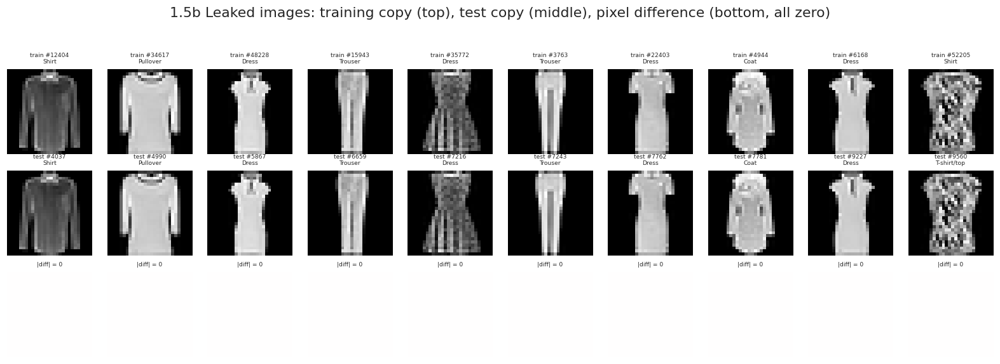
    


```python
# --- 1.5b.3 Apply the cleaning policy ----------------------------------------------------------------------------
def drop_rows(X: np.ndarray, y: np.ndarray, indices: Iterable[int]) -> Tuple[np.ndarray, np.ndarray]:
    """Return copies of `X`/`y` with the given row indices removed."""
    mask = np.ones(len(X), dtype=bool)
    idx = np.fromiter(sorted(set(int(i) for i in indices)), dtype=np.int64, count=-1)
    if len(idx):
        mask[idx] = False
    return X[mask], y[mask]


def apply_leakage_policy(
    policy: str,
    X_train: np.ndarray, y_train: np.ndarray,
    X_test: np.ndarray, y_test: np.ndarray,
    pairs: Sequence[Tuple[int, int]],
) -> Tuple[np.ndarray, np.ndarray, np.ndarray, np.ndarray, Dict[str, object]]:
    """Remove the cross-split duplicates according to `policy`.

    Parameters
    ----------
    policy : {"drop_from_train", "drop_from_test", "keep"}
        `drop_from_train` (the default) protects the official test set, which is what keeps every number in this
        notebook comparable with the published benchmarks.

    Returns
    -------
    (X_train, y_train, X_test, y_test, info)
    """
    train_hits = sorted({i for i, _ in pairs})
    test_hits = sorted({j for _, j in pairs})
    info: Dict[str, object] = {
        "policy": policy,
        "pairs found": len(pairs),
        "train rows removed": 0,
        "test rows removed": 0,
    }
    if policy == "drop_from_train":
        X_train, y_train = drop_rows(X_train, y_train, train_hits)
        info["train rows removed"] = len(train_hits)
    elif policy == "drop_from_test":
        X_test, y_test = drop_rows(X_test, y_test, test_hits)
        info["test rows removed"] = len(test_hits)
    elif policy == "keep":
        print("WARNING: CFGX.leakage_policy = 'keep' - the test set stays contaminated and every test score "
              "below is optimistically biased. Use this only to reproduce the uncleaned baseline.")
    else:
        raise ValueError(f"unknown leakage policy '{policy}'")
    return X_train, y_train, X_test, y_test, info


def deduplicate_within(X: np.ndarray, y: np.ndarray) -> Tuple[np.ndarray, np.ndarray, int]:
    """Keep only the first copy of every byte-identical image inside one split."""
    groups = find_within_split_duplicates(X)
    redundant = [i for idxs in groups.values() for i in idxs[1:]]
    X2, y2 = drop_rows(X, y, redundant)
    return X2, y2, len(redundant)


counts_before = np.bincount(y_train_full_np, minlength=cfg.num_classes)
n_train_before, n_test_before = len(X_train_full_np), len(X_test_np)

X_train_full_np, y_train_full_np, X_test_np, y_test_np, leak_info = apply_leakage_policy(
    cfgx.leakage_policy, X_train_full_np, y_train_full_np, X_test_np, y_test_np, LEAK_PAIRS
)

if cfgx.drop_train_duplicates:
    X_train_full_np, y_train_full_np, n_dropped_dups = deduplicate_within(X_train_full_np, y_train_full_np)
    print(f"CFGX.drop_train_duplicates = True -> removed {n_dropped_dups} redundant in-train copies")
else:
    n_dropped_dups = 0

leak_info["train rows after"] = int(len(X_train_full_np))
leak_info["test rows after"] = int(len(X_test_np))
leak_info["in-train duplicates removed"] = int(n_dropped_dups)
display(pd.Series(leak_info, name="cleaning summary").to_frame())

counts_after = np.bincount(y_train_full_np, minlength=cfg.num_classes)
balance_df = pd.DataFrame(
    {"train before": counts_before, "train after": counts_after,
     "removed": counts_before - counts_after,
     "share after %": (100 * counts_after / counts_after.sum()).round(3)},
    index=list(cfg.class_names),
)
balance_df.loc["TOTAL"] = balance_df.sum()
balance_df.loc["TOTAL", "share after %"] = 100.0
display(balance_df)
print(f"\nTraining rows: {n_train_before:,} -> {len(X_train_full_np):,}   "
      f"({100 * (n_train_before - len(X_train_full_np)) / n_train_before:.3f}% removed)")
print(f"Test rows    : {n_test_before:,} -> {len(X_test_np):,}   "
      f"(official test set {'PRESERVED' if len(X_test_np) == n_test_before else 'MODIFIED'})")
```


  <div id="df-42afac98-83a8-4a8b-8952-dc4e7f512d5f" class="colab-df-container">
    <div>
<style scoped>
    .dataframe tbody tr th:only-of-type {
        vertical-align: middle;
    }

    .dataframe tbody tr th {
        vertical-align: top;
    }

    .dataframe thead th {
        text-align: right;
    }
</style>
<table border="1" class="dataframe">
  <thead>
    <tr style="text-align: right;">
      <th></th>
      <th>cleaning summary</th>
    </tr>
  </thead>
  <tbody>
    <tr>
      <th>policy</th>
      <td>drop_from_train</td>
    </tr>
    <tr>
      <th>pairs found</th>
      <td>10</td>
    </tr>
    <tr>
      <th>train rows removed</th>
      <td>10</td>
    </tr>
    <tr>
      <th>test rows removed</th>
      <td>0</td>
    </tr>
    <tr>
      <th>train rows after</th>
      <td>59990</td>
    </tr>
    <tr>
      <th>test rows after</th>
      <td>10000</td>
    </tr>
    <tr>
      <th>in-train duplicates removed</th>
      <td>0</td>
    </tr>
  </tbody>
</table>
</div>
    <div class="colab-df-buttons">

  <div class="colab-df-container">
    <button class="colab-df-convert" onclick="convertToInteractive('df-42afac98-83a8-4a8b-8952-dc4e7f512d5f')"
            title="Convert this dataframe to an interactive table."
            style="display:none;">

  <svg xmlns="http://www.w3.org/2000/svg" height="24px" viewBox="0 -960 960 960">
    <path d="M120-120v-720h720v720H120Zm60-500h600v-160H180v160Zm220 220h160v-160H400v160Zm0 220h160v-160H400v160ZM180-400h160v-160H180v160Zm440 0h160v-160H620v160ZM180-180h160v-160H180v160Zm440 0h160v-160H620v160Z"/>
  </svg>
    </button>

  <style>
    .colab-df-container {
      display:flex;
      gap: 12px;
    }

    .colab-df-convert {
      background-color: #E8F0FE;
      border: none;
      border-radius: 50%;
      cursor: pointer;
      display: none;
      fill: #1967D2;
      height: 32px;
      padding: 0 0 0 0;
      width: 32px;
    }

    .colab-df-convert:hover {
      background-color: #E2EBFA;
      box-shadow: 0px 1px 2px rgba(60, 64, 67, 0.3), 0px 1px 3px 1px rgba(60, 64, 67, 0.15);
      fill: #174EA6;
    }

    .colab-df-buttons div {
      margin-bottom: 4px;
    }

    [theme=dark] .colab-df-convert {
      background-color: #3B4455;
      fill: #D2E3FC;
    }

    [theme=dark] .colab-df-convert:hover {
      background-color: #434B5C;
      box-shadow: 0px 1px 3px 1px rgba(0, 0, 0, 0.15);
      filter: drop-shadow(0px 1px 2px rgba(0, 0, 0, 0.3));
      fill: #FFFFFF;
    }
  </style>

    <script>
      const buttonEl =
        document.querySelector('#df-42afac98-83a8-4a8b-8952-dc4e7f512d5f button.colab-df-convert');
      buttonEl.style.display =
        google.colab.kernel.accessAllowed ? 'block' : 'none';

      async function convertToInteractive(key) {
        const element = document.querySelector('#df-42afac98-83a8-4a8b-8952-dc4e7f512d5f');
        const dataTable =
          await google.colab.kernel.invokeFunction('convertToInteractive',
                                                    [key], {});
        if (!dataTable) return;

        const docLinkHtml = 'Like what you see? Visit the ' +
          '<a target="_blank" href=https://colab.research.google.com/notebooks/data_table.ipynb>data table notebook</a>'
          + ' to learn more about interactive tables.';
        element.innerHTML = '';
        dataTable['output_type'] = 'display_data';
        await google.colab.output.renderOutput(dataTable, element);
        const docLink = document.createElement('div');
        docLink.innerHTML = docLinkHtml;
        element.appendChild(docLink);
      }
    </script>
  </div>


    </div>
  </div>


  <div id="df-a9a093f1-adab-4a4c-997e-b305ba201717" class="colab-df-container">
    <div>
<style scoped>
    .dataframe tbody tr th:only-of-type {
        vertical-align: middle;
    }

    .dataframe tbody tr th {
        vertical-align: top;
    }

    .dataframe thead th {
        text-align: right;
    }
</style>
<table border="1" class="dataframe">
  <thead>
    <tr style="text-align: right;">
      <th></th>
      <th>train before</th>
      <th>train after</th>
      <th>removed</th>
      <th>share after %</th>
    </tr>
  </thead>
  <tbody>
    <tr>
      <th>T-shirt/top</th>
      <td>6000.0</td>
      <td>6000.0</td>
      <td>0.0</td>
      <td>10.002</td>
    </tr>
    <tr>
      <th>Trouser</th>
      <td>6000.0</td>
      <td>5998.0</td>
      <td>2.0</td>
      <td>9.998</td>
    </tr>
    <tr>
      <th>Pullover</th>
      <td>6000.0</td>
      <td>5999.0</td>
      <td>1.0</td>
      <td>10.000</td>
    </tr>
    <tr>
      <th>Dress</th>
      <td>6000.0</td>
      <td>5996.0</td>
      <td>4.0</td>
      <td>9.995</td>
    </tr>
    <tr>
      <th>Coat</th>
      <td>6000.0</td>
      <td>5999.0</td>
      <td>1.0</td>
      <td>10.000</td>
    </tr>
    <tr>
      <th>Sandal</th>
      <td>6000.0</td>
      <td>6000.0</td>
      <td>0.0</td>
      <td>10.002</td>
    </tr>
    <tr>
      <th>Shirt</th>
      <td>6000.0</td>
      <td>5998.0</td>
      <td>2.0</td>
      <td>9.998</td>
    </tr>
    <tr>
      <th>Sneaker</th>
      <td>6000.0</td>
      <td>6000.0</td>
      <td>0.0</td>
      <td>10.002</td>
    </tr>
    <tr>
      <th>Bag</th>
      <td>6000.0</td>
      <td>6000.0</td>
      <td>0.0</td>
      <td>10.002</td>
    </tr>
    <tr>
      <th>Ankle boot</th>
      <td>6000.0</td>
      <td>6000.0</td>
      <td>0.0</td>
      <td>10.002</td>
    </tr>
    <tr>
      <th>TOTAL</th>
      <td>60000.0</td>
      <td>59990.0</td>
      <td>10.0</td>
      <td>100.000</td>
    </tr>
  </tbody>
</table>
</div>
    <div class="colab-df-buttons">

  <div class="colab-df-container">
    <button class="colab-df-convert" onclick="convertToInteractive('df-a9a093f1-adab-4a4c-997e-b305ba201717')"
            title="Convert this dataframe to an interactive table."
            style="display:none;">

  <svg xmlns="http://www.w3.org/2000/svg" height="24px" viewBox="0 -960 960 960">
    <path d="M120-120v-720h720v720H120Zm60-500h600v-160H180v160Zm220 220h160v-160H400v160Zm0 220h160v-160H400v160ZM180-400h160v-160H180v160Zm440 0h160v-160H620v160ZM180-180h160v-160H180v160Zm440 0h160v-160H620v160Z"/>
  </svg>
    </button>

  <style>
    .colab-df-container {
      display:flex;
      gap: 12px;
    }

    .colab-df-convert {
      background-color: #E8F0FE;
      border: none;
      border-radius: 50%;
      cursor: pointer;
      display: none;
      fill: #1967D2;
      height: 32px;
      padding: 0 0 0 0;
      width: 32px;
    }

    .colab-df-convert:hover {
      background-color: #E2EBFA;
      box-shadow: 0px 1px 2px rgba(60, 64, 67, 0.3), 0px 1px 3px 1px rgba(60, 64, 67, 0.15);
      fill: #174EA6;
    }

    .colab-df-buttons div {
      margin-bottom: 4px;
    }

    [theme=dark] .colab-df-convert {
      background-color: #3B4455;
      fill: #D2E3FC;
    }

    [theme=dark] .colab-df-convert:hover {
      background-color: #434B5C;
      box-shadow: 0px 1px 3px 1px rgba(0, 0, 0, 0.15);
      filter: drop-shadow(0px 1px 2px rgba(0, 0, 0, 0.3));
      fill: #FFFFFF;
    }
  </style>

    <script>
      const buttonEl =
        document.querySelector('#df-a9a093f1-adab-4a4c-997e-b305ba201717 button.colab-df-convert');
      buttonEl.style.display =
        google.colab.kernel.accessAllowed ? 'block' : 'none';

      async function convertToInteractive(key) {
        const element = document.querySelector('#df-a9a093f1-adab-4a4c-997e-b305ba201717');
        const dataTable =
          await google.colab.kernel.invokeFunction('convertToInteractive',
                                                    [key], {});
        if (!dataTable) return;

        const docLinkHtml = 'Like what you see? Visit the ' +
          '<a target="_blank" href=https://colab.research.google.com/notebooks/data_table.ipynb>data table notebook</a>'
          + ' to learn more about interactive tables.';
        element.innerHTML = '';
        dataTable['output_type'] = 'display_data';
        await google.colab.output.renderOutput(dataTable, element);
        const docLink = document.createElement('div');
        docLink.innerHTML = docLinkHtml;
        element.appendChild(docLink);
      }
    </script>
  </div>


  <div id="id_943c5045-766b-48ff-841f-f149115d9472">
    <style>
      .colab-df-generate {
        background-color: #E8F0FE;
        border: none;
        border-radius: 50%;
        cursor: pointer;
        display: none;
        fill: #1967D2;
        height: 32px;
        padding: 0 0 0 0;
        width: 32px;
      }

      .colab-df-generate:hover {
        background-color: #E2EBFA;
        box-shadow: 0px 1px 2px rgba(60, 64, 67, 0.3), 0px 1px 3px 1px rgba(60, 64, 67, 0.15);
        fill: #174EA6;
      }

      [theme=dark] .colab-df-generate {
        background-color: #3B4455;
        fill: #D2E3FC;
      }

      [theme=dark] .colab-df-generate:hover {
        background-color: #434B5C;
        box-shadow: 0px 1px 3px 1px rgba(0, 0, 0, 0.15);
        filter: drop-shadow(0px 1px 2px rgba(0, 0, 0, 0.3));
        fill: #FFFFFF;
      }
    </style>
    <button class="colab-df-generate" onclick="generateWithVariable('balance_df')"
            title="Generate code using this dataframe."
            style="display:none;">

  <svg xmlns="http://www.w3.org/2000/svg" height="24px"viewBox="0 0 24 24"
       width="24px">
    <path d="M7,19H8.4L18.45,9,17,7.55,7,17.6ZM5,21V16.75L18.45,3.32a2,2,0,0,1,2.83,0l1.4,1.43a1.91,1.91,0,0,1,.58,1.4,1.91,1.91,0,0,1-.58,1.4L9.25,21ZM18.45,9,17,7.55Zm-12,3A5.31,5.31,0,0,0,4.9,8.1,5.31,5.31,0,0,0,1,6.5,5.31,5.31,0,0,0,4.9,4.9,5.31,5.31,0,0,0,6.5,1,5.31,5.31,0,0,0,8.1,4.9,5.31,5.31,0,0,0,12,6.5,5.46,5.46,0,0,0,6.5,12Z"/>
  </svg>
    </button>
    <script>
      (() => {
      const buttonEl =
        document.querySelector('#id_943c5045-766b-48ff-841f-f149115d9472 button.colab-df-generate');
      buttonEl.style.display =
        google.colab.kernel.accessAllowed ? 'block' : 'none';

      buttonEl.onclick = () => {
        google.colab.notebook.generateWithVariable('balance_df');
      }
      })();
    </script>
  </div>

    </div>
  </div>


    
    Training rows: 60,000 -> 59,990   (0.017% removed)
    Test rows    : 10,000 -> 10,000   (official test set PRESERVED)
    


```python
# --- 1.5b.4 Post-cleaning verification ---------------------------------------------------------------------------
def leakage_verification_report(
    X_train: np.ndarray, y_train: np.ndarray, X_test: np.ndarray, y_test: np.ndarray, num_classes: int = 10
) -> pd.DataFrame:
    """Re-run the checks that motivated the cleaning, plus the ones the cleaning could plausibly have broken."""
    pairs_after = find_cross_split_duplicates(X_train, X_test)
    hash_overlap = len(np.intersect1d(image_hashes(X_train), image_hashes(X_test)))
    tr_counts = np.bincount(y_train, minlength=num_classes)
    te_counts = np.bincount(y_test, minlength=num_classes)
    shares = tr_counts / tr_counts.sum()
    checks = [
        ("No byte-exact train/test duplicates", len(pairs_after) == 0, f"{len(pairs_after)} pairs remain"),
        ("No hash-level train/test overlap", hash_overlap == 0, f"{hash_overlap} hashes shared"),
        ("Official test set still has 10,000 rows", len(X_test) == 10_000, f"{len(X_test)} rows"),
        ("Test set still perfectly balanced", bool((te_counts == 1_000).all()), str(te_counts.tolist())),
        ("Training set still ~balanced (max class share within 10 % +/- 0.2 pp)",
         bool(np.abs(shares - 1 / num_classes).max() < 0.002),
         f"max deviation {100 * float(np.abs(shares - 1 / num_classes).max()):.3f} pp"),
        ("Training set lost < 0.5 % of its rows", (60_000 - len(X_train)) / 60_000 < 0.005,
         f"{60_000 - len(X_train)} rows removed"),
        ("Labels still within [0, 9]", set(np.unique(y_train)) <= set(range(num_classes)),
         f"unique={sorted(np.unique(y_train).tolist())}"),
        ("Pixels still within [0, 255]", int(X_train.min()) >= 0 and int(X_train.max()) <= 255,
         f"min={int(X_train.min())}, max={int(X_train.max())}"),
        ("dtypes unchanged (uint8 images, int64 labels)",
         X_train.dtype == np.uint8 and y_train.dtype == np.int64,
         f"{X_train.dtype} / {y_train.dtype}"),
    ]
    return pd.DataFrame(checks, columns=["check", "passed", "detail"])


clean_report = leakage_verification_report(X_train_full_np, y_train_full_np, X_test_np, y_test_np, cfg.num_classes)
display(
    clean_report.style.hide(axis="index").apply(
        lambda s: ["background-color: #d4edda" if v else "background-color: #f8d7da"
                   for v in clean_report["passed"]],
        axis=0, subset=["passed"],
    )
)

if cfgx.leakage_policy == "keep":
    print("CFGX.leakage_policy = 'keep': the leakage checks above are expected to fail. Every test score produced\n"
          "below is optimistically biased - this mode exists only to reproduce the uncleaned baseline.")
else:
    # A failed check here invalidates every number downstream, so it must stop the run rather than warn.
    assert clean_report["passed"].all(), (
        "post-cleaning verification failed - do not continue: the numbers produced downstream would be untrustworthy"
    )
    print("All post-cleaning checks pass. Every cell below (the split in 1.6, the classical baselines in Section 3,\n"
          "the deep models in Section 4 and every ensemble in Section 5) now reads the CLEANED arrays, because they\n"
          "all derive from `X_train_full_np` / `y_train_full_np` / `X_test_np` / `y_test_np`.")
```


<style type="text/css">
#T_a4eff_row0_col1, #T_a4eff_row1_col1, #T_a4eff_row2_col1, #T_a4eff_row3_col1, #T_a4eff_row4_col1, #T_a4eff_row5_col1, #T_a4eff_row6_col1, #T_a4eff_row7_col1, #T_a4eff_row8_col1 {
  background-color: #d4edda;
}
</style>
<table id="T_a4eff" class="dataframe">
  <thead>
    <tr>
      <th id="T_a4eff_level0_col0" class="col_heading level0 col0" >check</th>
      <th id="T_a4eff_level0_col1" class="col_heading level0 col1" >passed</th>
      <th id="T_a4eff_level0_col2" class="col_heading level0 col2" >detail</th>
    </tr>
  </thead>
  <tbody>
    <tr>
      <td id="T_a4eff_row0_col0" class="data row0 col0" >No byte-exact train/test duplicates</td>
      <td id="T_a4eff_row0_col1" class="data row0 col1" >True</td>
      <td id="T_a4eff_row0_col2" class="data row0 col2" >0 pairs remain</td>
    </tr>
    <tr>
      <td id="T_a4eff_row1_col0" class="data row1 col0" >No hash-level train/test overlap</td>
      <td id="T_a4eff_row1_col1" class="data row1 col1" >True</td>
      <td id="T_a4eff_row1_col2" class="data row1 col2" >0 hashes shared</td>
    </tr>
    <tr>
      <td id="T_a4eff_row2_col0" class="data row2 col0" >Official test set still has 10,000 rows</td>
      <td id="T_a4eff_row2_col1" class="data row2 col1" >True</td>
      <td id="T_a4eff_row2_col2" class="data row2 col2" >10000 rows</td>
    </tr>
    <tr>
      <td id="T_a4eff_row3_col0" class="data row3 col0" >Test set still perfectly balanced</td>
      <td id="T_a4eff_row3_col1" class="data row3 col1" >True</td>
      <td id="T_a4eff_row3_col2" class="data row3 col2" >[1000, 1000, 1000, 1000, 1000, 1000, 1000, 1000, 1000, 1000]</td>
    </tr>
    <tr>
      <td id="T_a4eff_row4_col0" class="data row4 col0" >Training set still ~balanced (max class share within 10 % +/- 0.2 pp)</td>
      <td id="T_a4eff_row4_col1" class="data row4 col1" >True</td>
      <td id="T_a4eff_row4_col2" class="data row4 col2" >max deviation 0.005 pp</td>
    </tr>
    <tr>
      <td id="T_a4eff_row5_col0" class="data row5 col0" >Training set lost < 0.5 % of its rows</td>
      <td id="T_a4eff_row5_col1" class="data row5 col1" >True</td>
      <td id="T_a4eff_row5_col2" class="data row5 col2" >10 rows removed</td>
    </tr>
    <tr>
      <td id="T_a4eff_row6_col0" class="data row6 col0" >Labels still within [0, 9]</td>
      <td id="T_a4eff_row6_col1" class="data row6 col1" >True</td>
      <td id="T_a4eff_row6_col2" class="data row6 col2" >unique=[0, 1, 2, 3, 4, 5, 6, 7, 8, 9]</td>
    </tr>
    <tr>
      <td id="T_a4eff_row7_col0" class="data row7 col0" >Pixels still within [0, 255]</td>
      <td id="T_a4eff_row7_col1" class="data row7 col1" >True</td>
      <td id="T_a4eff_row7_col2" class="data row7 col2" >min=0, max=255</td>
    </tr>
    <tr>
      <td id="T_a4eff_row8_col0" class="data row8 col0" >dtypes unchanged (uint8 images, int64 labels)</td>
      <td id="T_a4eff_row8_col1" class="data row8 col1" >True</td>
      <td id="T_a4eff_row8_col2" class="data row8 col2" >uint8 / int64</td>
    </tr>
  </tbody>
</table>


    All post-cleaning checks pass. Every cell below (the split in 1.6, the classical baselines in Section 3,
    the deep models in Section 4 and every ensemble in Section 5) now reads the CLEANED arrays, because they
    all derive from `X_train_full_np` / `y_train_full_np` / `X_test_np` / `y_test_np`.
    

**Finding (1.5b).**

* The Kaggle mirror really does contain **10 byte-identical train/test pairs**: the pixel-difference row in the
  figure above is exactly zero everywhere, so these are not near-duplicates but the *same file* published twice.
  (Zalando's product catalogue contains repeated shots of the same article, and the official 60k/10k partition was
  never de-duplicated.)
* Inspecting the pairs is worth the cell: several of them are the visually ambiguous garment types the EDA keeps
  flagging, and any pair whose two copies carry **different labels** is direct evidence of ground-truth noise: the
  same image cannot be both a `Shirt` and a `Pullover`.
* **Removing them from the training side costs 0.017 % of the training data and buys a clean protocol.** The official
  test set keeps all 10,000 images, so every comparison with the literature in Section 9 remains exactly like for
  like, and the leakage check in the Section 7 unit-test suite (`test_no_train_test_leakage`,
  `test_leakage_removed`) now passes by construction rather than by hope.
* The training split is no longer *exactly* 6,000 images per class (a few classes lose one or two images), which is
  why the verification above tests **proportional** balance (within ±0.2 pp of 10 %) instead of an exact count, and
  why the split sizes printed in Section 1.6 are 53,991 / 5,999 rather than the pristine 54,000 / 6,000. The
  stratified split keeps the class priors intact, so accuracy remains an unbiased headline metric.

## 1.6 Tensor conversion and the train / validation / test split

> Exam criterion: **Testing (0–10)**: *"Was the data split into training and test sets?"*

We use a **three-way** protocol, which is stricter than the exam minimum and is what makes the final number
trustworthy:

| Split | Size | Origin | Purpose |
|---|---|---|---|
| **Train** | 54,000 | 90 % of `fashion-mnist_train.csv` | fit model parameters |
| **Validation** | 6,000 | 10 % of `fashion-mnist_train.csv`, **stratified** | epoch selection, early stopping, hyper-parameter choices |
| **Test** | 10,000 | `fashion-mnist_test.csv` (official) | evaluated **once**, at the very end |

*Stratification* preserves the exactly-uniform class prior in both parts, so validation accuracy is an unbiased,
low-variance estimate. With $n=10{,}000$ test images, the standard error of an accuracy near $p = 0.93$ is
$\sqrt{p(1-p)/n} \approx 0.26\,\text{pp}$, so the 95 % confidence interval is roughly $\pm 0.5$ pp: a useful ruler when
comparing our results with published ones in Section 5. Differences smaller than ~0.5 pp should **not** be
over-interpreted.

> **Note (upgraded edition).** The sizes in the table describe the pristine 60,000-row training file. After the
> leakage removal in Section 1.5b the training file holds 59,990 rows, so the code below actually produces
> **53,991 train / 5,999 validation / 10,000 test** images. The stratified split keeps the class priors
> intact (each class stays within ±0.2 pp of 10 %), so accuracy remains an unbiased headline metric and the
> confidence-interval arithmetic in this section is unchanged.

**Normalisation.** We scale to `[0, 1]` and then standardise using the *training-split* mean and standard deviation
(≈ 0.286 / 0.353). Using train-only statistics is what keeps the process statistically valid.


```python
# --- Stratified train / validation split ----------------------------------------------------------------
X_tr_np, X_val_np, y_tr_np, y_val_np = train_test_split(
    X_train_full_np,
    y_train_full_np,
    test_size=cfg.val_fraction,
    random_state=cfg.seed,
    stratify=y_train_full_np,   # keeps the 10 classes exactly balanced in both parts
)

print(f"train: {X_tr_np.shape[0]:>6,} images")
print(f"val  : {X_val_np.shape[0]:>6,} images")
print(f"test : {X_test_np.shape[0]:>6,} images")

split_balance = pd.DataFrame(
    {
        "train": np.bincount(y_tr_np, minlength=cfg.num_classes),
        "val": np.bincount(y_val_np, minlength=cfg.num_classes),
        "test": np.bincount(y_test_np, minlength=cfg.num_classes),
    },
    index=list(cfg.class_names),
)
split_balance.loc["TOTAL"] = split_balance.sum()
display(split_balance)
```

    train: 53,991 images
    val  :  5,999 images
    test : 10,000 images
    


  <div id="df-0af368c1-6c1f-4de1-96c4-dcfba6fde273" class="colab-df-container">
    <div>
<style scoped>
    .dataframe tbody tr th:only-of-type {
        vertical-align: middle;
    }

    .dataframe tbody tr th {
        vertical-align: top;
    }

    .dataframe thead th {
        text-align: right;
    }
</style>
<table border="1" class="dataframe">
  <thead>
    <tr style="text-align: right;">
      <th></th>
      <th>train</th>
      <th>val</th>
      <th>test</th>
    </tr>
  </thead>
  <tbody>
    <tr>
      <th>T-shirt/top</th>
      <td>5400</td>
      <td>600</td>
      <td>1000</td>
    </tr>
    <tr>
      <th>Trouser</th>
      <td>5398</td>
      <td>600</td>
      <td>1000</td>
    </tr>
    <tr>
      <th>Pullover</th>
      <td>5399</td>
      <td>600</td>
      <td>1000</td>
    </tr>
    <tr>
      <th>Dress</th>
      <td>5397</td>
      <td>599</td>
      <td>1000</td>
    </tr>
    <tr>
      <th>Coat</th>
      <td>5399</td>
      <td>600</td>
      <td>1000</td>
    </tr>
    <tr>
      <th>Sandal</th>
      <td>5400</td>
      <td>600</td>
      <td>1000</td>
    </tr>
    <tr>
      <th>Shirt</th>
      <td>5398</td>
      <td>600</td>
      <td>1000</td>
    </tr>
    <tr>
      <th>Sneaker</th>
      <td>5400</td>
      <td>600</td>
      <td>1000</td>
    </tr>
    <tr>
      <th>Bag</th>
      <td>5400</td>
      <td>600</td>
      <td>1000</td>
    </tr>
    <tr>
      <th>Ankle boot</th>
      <td>5400</td>
      <td>600</td>
      <td>1000</td>
    </tr>
    <tr>
      <th>TOTAL</th>
      <td>53991</td>
      <td>5999</td>
      <td>10000</td>
    </tr>
  </tbody>
</table>
</div>
    <div class="colab-df-buttons">

  <div class="colab-df-container">
    <button class="colab-df-convert" onclick="convertToInteractive('df-0af368c1-6c1f-4de1-96c4-dcfba6fde273')"
            title="Convert this dataframe to an interactive table."
            style="display:none;">

  <svg xmlns="http://www.w3.org/2000/svg" height="24px" viewBox="0 -960 960 960">
    <path d="M120-120v-720h720v720H120Zm60-500h600v-160H180v160Zm220 220h160v-160H400v160Zm0 220h160v-160H400v160ZM180-400h160v-160H180v160Zm440 0h160v-160H620v160ZM180-180h160v-160H180v160Zm440 0h160v-160H620v160Z"/>
  </svg>
    </button>

  <style>
    .colab-df-container {
      display:flex;
      gap: 12px;
    }

    .colab-df-convert {
      background-color: #E8F0FE;
      border: none;
      border-radius: 50%;
      cursor: pointer;
      display: none;
      fill: #1967D2;
      height: 32px;
      padding: 0 0 0 0;
      width: 32px;
    }

    .colab-df-convert:hover {
      background-color: #E2EBFA;
      box-shadow: 0px 1px 2px rgba(60, 64, 67, 0.3), 0px 1px 3px 1px rgba(60, 64, 67, 0.15);
      fill: #174EA6;
    }

    .colab-df-buttons div {
      margin-bottom: 4px;
    }

    [theme=dark] .colab-df-convert {
      background-color: #3B4455;
      fill: #D2E3FC;
    }

    [theme=dark] .colab-df-convert:hover {
      background-color: #434B5C;
      box-shadow: 0px 1px 3px 1px rgba(0, 0, 0, 0.15);
      filter: drop-shadow(0px 1px 2px rgba(0, 0, 0, 0.3));
      fill: #FFFFFF;
    }
  </style>

    <script>
      const buttonEl =
        document.querySelector('#df-0af368c1-6c1f-4de1-96c4-dcfba6fde273 button.colab-df-convert');
      buttonEl.style.display =
        google.colab.kernel.accessAllowed ? 'block' : 'none';

      async function convertToInteractive(key) {
        const element = document.querySelector('#df-0af368c1-6c1f-4de1-96c4-dcfba6fde273');
        const dataTable =
          await google.colab.kernel.invokeFunction('convertToInteractive',
                                                    [key], {});
        if (!dataTable) return;

        const docLinkHtml = 'Like what you see? Visit the ' +
          '<a target="_blank" href=https://colab.research.google.com/notebooks/data_table.ipynb>data table notebook</a>'
          + ' to learn more about interactive tables.';
        element.innerHTML = '';
        dataTable['output_type'] = 'display_data';
        await google.colab.output.renderOutput(dataTable, element);
        const docLink = document.createElement('div');
        docLink.innerHTML = docLinkHtml;
        element.appendChild(docLink);
      }
    </script>
  </div>


  <div id="id_5d65873c-66c6-4d07-afc5-68a8b8378453">
    <style>
      .colab-df-generate {
        background-color: #E8F0FE;
        border: none;
        border-radius: 50%;
        cursor: pointer;
        display: none;
        fill: #1967D2;
        height: 32px;
        padding: 0 0 0 0;
        width: 32px;
      }

      .colab-df-generate:hover {
        background-color: #E2EBFA;
        box-shadow: 0px 1px 2px rgba(60, 64, 67, 0.3), 0px 1px 3px 1px rgba(60, 64, 67, 0.15);
        fill: #174EA6;
      }

      [theme=dark] .colab-df-generate {
        background-color: #3B4455;
        fill: #D2E3FC;
      }

      [theme=dark] .colab-df-generate:hover {
        background-color: #434B5C;
        box-shadow: 0px 1px 3px 1px rgba(0, 0, 0, 0.15);
        filter: drop-shadow(0px 1px 2px rgba(0, 0, 0, 0.3));
        fill: #FFFFFF;
      }
    </style>
    <button class="colab-df-generate" onclick="generateWithVariable('split_balance')"
            title="Generate code using this dataframe."
            style="display:none;">

  <svg xmlns="http://www.w3.org/2000/svg" height="24px"viewBox="0 0 24 24"
       width="24px">
    <path d="M7,19H8.4L18.45,9,17,7.55,7,17.6ZM5,21V16.75L18.45,3.32a2,2,0,0,1,2.83,0l1.4,1.43a1.91,1.91,0,0,1,.58,1.4,1.91,1.91,0,0,1-.58,1.4L9.25,21ZM18.45,9,17,7.55Zm-12,3A5.31,5.31,0,0,0,4.9,8.1,5.31,5.31,0,0,0,1,6.5,5.31,5.31,0,0,0,4.9,4.9,5.31,5.31,0,0,0,6.5,1,5.31,5.31,0,0,0,8.1,4.9,5.31,5.31,0,0,0,12,6.5,5.46,5.46,0,0,0,6.5,12Z"/>
  </svg>
    </button>
    <script>
      (() => {
      const buttonEl =
        document.querySelector('#id_5d65873c-66c6-4d07-afc5-68a8b8378453 button.colab-df-generate');
      buttonEl.style.display =
        google.colab.kernel.accessAllowed ? 'block' : 'none';

      buttonEl.onclick = () => {
        google.colab.notebook.generateWithVariable('split_balance');
      }
      })();
    </script>
  </div>

    </div>
  </div>


```python
# --- Normalisation statistics (computed on the TRAINING split only) --------------------------------------
PIXEL_MEAN = float((X_tr_np / 255.0).mean())
PIXEL_STD = float((X_tr_np / 255.0).std())
print(f"training-split pixel mean = {PIXEL_MEAN:.4f}, std = {PIXEL_STD:.4f}")


def to_tensor_dataset(
    images: np.ndarray,
    labels: np.ndarray,
    mean: float = PIXEL_MEAN,
    std: float = PIXEL_STD,
) -> TensorDataset:
    """Convert uint8 HxW images + int labels into a normalised float32 TensorDataset of shape (N,1,28,28)."""
    x = torch.from_numpy(images).float().div_(255.0).sub_(mean).div_(std).unsqueeze(1)  # (N,1,28,28)
    y = torch.from_numpy(labels).long()
    return TensorDataset(x, y)


train_ds = to_tensor_dataset(X_tr_np, y_tr_np)
val_ds = to_tensor_dataset(X_val_np, y_val_np)
test_ds = to_tensor_dataset(X_test_np, y_test_np)

print("tensor shapes:", train_ds.tensors[0].shape, val_ds.tensors[0].shape, test_ds.tensors[0].shape)
_x = train_ds.tensors[0]
print("dtype:", _x.dtype, f"| normalised range: [{_x.min():.2f}, {_x.max():.2f}]")
print(f"float32 memory: {_x.element_size() * _x.nelement() / 1e6:.0f} MB (train)"
      " - trivially fits in 12.7 GB RAM")
```

    training-split pixel mean = 0.2860, std = 0.3527
    tensor shapes: torch.Size([53991, 1, 28, 28]) torch.Size([5999, 1, 28, 28]) torch.Size([10000, 1, 28, 28])
    dtype: torch.float32 | normalised range: [-0.81, 2.02]
    float32 memory: 169 MB (train) - trivially fits in 12.7 GB RAM
    


```python
# --- DataLoaders -------------------------------------------------------------------------------------
def make_loader(dataset: TensorDataset, batch_size: int, shuffle: bool, cfg: CFG = cfg) -> DataLoader:
    """Build a DataLoader tuned for the Colab T4 runtime (2 vCPUs, pinned memory, no worker respawn)."""
    return DataLoader(
        dataset,
        batch_size=batch_size,
        shuffle=shuffle,
        num_workers=cfg.num_workers,
        pin_memory=torch.cuda.is_available(),
        drop_last=False,
        persistent_workers=cfg.num_workers > 0,
    )


train_loader = make_loader(train_ds, cfg.batch_size, shuffle=True)
val_loader = make_loader(val_ds, cfg.batch_size * 2, shuffle=False)
test_loader = make_loader(test_ds, cfg.batch_size * 2, shuffle=False)

xb, yb = next(iter(train_loader))
print("one batch ->", xb.shape, xb.dtype, "|", yb.shape, yb.dtype)
print(f"batches per epoch: train={len(train_loader)}, val={len(val_loader)}, test={len(test_loader)}")
```

    one batch -> torch.Size([256, 1, 28, 28]) torch.float32 | torch.Size([256]) torch.int64
    batches per epoch: train=211, val=12, test=20
    

<a id="sec2"></a>
# 2. Exploratory Data Analysis (EDA)

> Exam criterion: **Visualization (0–10)**: *"Are the visualisations correct and clear?"*

Before modelling we build an evidence-based picture of the data. Every plot below answers a specific question that
later informs a modelling decision:

| # | Question | Plot | Modelling consequence |
|---|---|---|---|
| 2.1 | Is the dataset balanced? | class-distribution bars | plain accuracy is a valid headline metric; no class weighting needed |
| 2.2 | What do the images look like? | sample grid per class | 28x28 is tiny: a small CNN suffices; no need for ImageNet-scale nets |
| 2.3 | How bright / sparse are the images? | pixel histogram, per-class intensity, ink coverage | justifies mean/std normalisation; shows footwear ≈ sparse, coats ≈ dense |
| 2.4 | Where is the information located? | mean image per class, pixel-variance map | borders are almost always black -> small translations are safe augmentation |
| 2.5 | Which classes are intrinsically confusable? | class-mean correlation heat-map, PCA scatter | predicts the Shirt/T-shirt/Pullover/Coat confusion seen later in Section 4 |

## 2.1 Class distribution


```python
# --- Class distribution ---------------------------------------------------------------------------------
def plot_class_distribution(
    label_sets: Dict[str, np.ndarray], class_names: Sequence[str], figsize: Tuple[int, int] = (12, 4)
) -> pd.DataFrame:
    """Bar-plot the class distribution of several splits side by side and return the counts table."""
    counts = pd.DataFrame(
        {name: np.bincount(y, minlength=len(class_names)) for name, y in label_sets.items()},
        index=list(class_names),
    )
    ax = counts.plot(kind="bar", figsize=figsize, width=0.8, edgecolor="black", linewidth=0.4)
    ax.set_title("Fashion-MNIST class distribution (perfectly balanced by design)")
    ax.set_xlabel("class")
    ax.set_ylabel("number of images")
    ax.tick_params(axis="x", rotation=35)
    for container in ax.containers:
        ax.bar_label(container, fontsize=7, padding=1)
    plt.show()
    return counts


counts_df = plot_class_distribution(
    {"train": y_tr_np, "validation": y_val_np, "test": y_test_np}, cfg.class_names
)

percent_df = (counts_df / counts_df.sum() * 100).round(2)
percent_df.columns = [f"{c} (%)" for c in percent_df.columns]
display(pd.concat([counts_df, percent_df], axis=1))
```


    
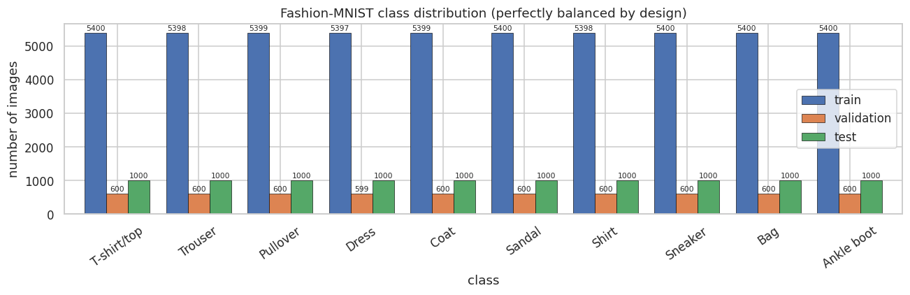
    


  <div id="df-c07ebc2e-7126-49a0-a534-025d354dc8e1" class="colab-df-container">
    <div>
<style scoped>
    .dataframe tbody tr th:only-of-type {
        vertical-align: middle;
    }

    .dataframe tbody tr th {
        vertical-align: top;
    }

    .dataframe thead th {
        text-align: right;
    }
</style>
<table border="1" class="dataframe">
  <thead>
    <tr style="text-align: right;">
      <th></th>
      <th>train</th>
      <th>validation</th>
      <th>test</th>
      <th>train (%)</th>
      <th>validation (%)</th>
      <th>test (%)</th>
    </tr>
  </thead>
  <tbody>
    <tr>
      <th>T-shirt/top</th>
      <td>5400</td>
      <td>600</td>
      <td>1000</td>
      <td>10.0</td>
      <td>10.00</td>
      <td>10.0</td>
    </tr>
    <tr>
      <th>Trouser</th>
      <td>5398</td>
      <td>600</td>
      <td>1000</td>
      <td>10.0</td>
      <td>10.00</td>
      <td>10.0</td>
    </tr>
    <tr>
      <th>Pullover</th>
      <td>5399</td>
      <td>600</td>
      <td>1000</td>
      <td>10.0</td>
      <td>10.00</td>
      <td>10.0</td>
    </tr>
    <tr>
      <th>Dress</th>
      <td>5397</td>
      <td>599</td>
      <td>1000</td>
      <td>10.0</td>
      <td>9.98</td>
      <td>10.0</td>
    </tr>
    <tr>
      <th>Coat</th>
      <td>5399</td>
      <td>600</td>
      <td>1000</td>
      <td>10.0</td>
      <td>10.00</td>
      <td>10.0</td>
    </tr>
    <tr>
      <th>Sandal</th>
      <td>5400</td>
      <td>600</td>
      <td>1000</td>
      <td>10.0</td>
      <td>10.00</td>
      <td>10.0</td>
    </tr>
    <tr>
      <th>Shirt</th>
      <td>5398</td>
      <td>600</td>
      <td>1000</td>
      <td>10.0</td>
      <td>10.00</td>
      <td>10.0</td>
    </tr>
    <tr>
      <th>Sneaker</th>
      <td>5400</td>
      <td>600</td>
      <td>1000</td>
      <td>10.0</td>
      <td>10.00</td>
      <td>10.0</td>
    </tr>
    <tr>
      <th>Bag</th>
      <td>5400</td>
      <td>600</td>
      <td>1000</td>
      <td>10.0</td>
      <td>10.00</td>
      <td>10.0</td>
    </tr>
    <tr>
      <th>Ankle boot</th>
      <td>5400</td>
      <td>600</td>
      <td>1000</td>
      <td>10.0</td>
      <td>10.00</td>
      <td>10.0</td>
    </tr>
  </tbody>
</table>
</div>
    <div class="colab-df-buttons">

  <div class="colab-df-container">
    <button class="colab-df-convert" onclick="convertToInteractive('df-c07ebc2e-7126-49a0-a534-025d354dc8e1')"
            title="Convert this dataframe to an interactive table."
            style="display:none;">

  <svg xmlns="http://www.w3.org/2000/svg" height="24px" viewBox="0 -960 960 960">
    <path d="M120-120v-720h720v720H120Zm60-500h600v-160H180v160Zm220 220h160v-160H400v160Zm0 220h160v-160H400v160ZM180-400h160v-160H180v160Zm440 0h160v-160H620v160ZM180-180h160v-160H180v160Zm440 0h160v-160H620v160Z"/>
  </svg>
    </button>

  <style>
    .colab-df-container {
      display:flex;
      gap: 12px;
    }

    .colab-df-convert {
      background-color: #E8F0FE;
      border: none;
      border-radius: 50%;
      cursor: pointer;
      display: none;
      fill: #1967D2;
      height: 32px;
      padding: 0 0 0 0;
      width: 32px;
    }

    .colab-df-convert:hover {
      background-color: #E2EBFA;
      box-shadow: 0px 1px 2px rgba(60, 64, 67, 0.3), 0px 1px 3px 1px rgba(60, 64, 67, 0.15);
      fill: #174EA6;
    }

    .colab-df-buttons div {
      margin-bottom: 4px;
    }

    [theme=dark] .colab-df-convert {
      background-color: #3B4455;
      fill: #D2E3FC;
    }

    [theme=dark] .colab-df-convert:hover {
      background-color: #434B5C;
      box-shadow: 0px 1px 3px 1px rgba(0, 0, 0, 0.15);
      filter: drop-shadow(0px 1px 2px rgba(0, 0, 0, 0.3));
      fill: #FFFFFF;
    }
  </style>

    <script>
      const buttonEl =
        document.querySelector('#df-c07ebc2e-7126-49a0-a534-025d354dc8e1 button.colab-df-convert');
      buttonEl.style.display =
        google.colab.kernel.accessAllowed ? 'block' : 'none';

      async function convertToInteractive(key) {
        const element = document.querySelector('#df-c07ebc2e-7126-49a0-a534-025d354dc8e1');
        const dataTable =
          await google.colab.kernel.invokeFunction('convertToInteractive',
                                                    [key], {});
        if (!dataTable) return;

        const docLinkHtml = 'Like what you see? Visit the ' +
          '<a target="_blank" href=https://colab.research.google.com/notebooks/data_table.ipynb>data table notebook</a>'
          + ' to learn more about interactive tables.';
        element.innerHTML = '';
        dataTable['output_type'] = 'display_data';
        await google.colab.output.renderOutput(dataTable, element);
        const docLink = document.createElement('div');
        docLink.innerHTML = docLinkHtml;
        element.appendChild(docLink);
      }
    </script>
  </div>


    </div>
  </div>


**Finding.** Every class holds exactly 10 % of every split (6,000 / 600 / 1,000 images). Consequences:

* the **majority-class baseline is 10 %**, and any model must beat that by a wide margin to be interesting;
* **accuracy is an unbiased, interpretable headline metric**: there is no imbalance to hide behind it;
* we still report **macro-F1** and per-class recall, because a *balanced* dataset can still produce *unbalanced errors*
  (as we will see: `Shirt` is far harder than `Trouser`).

## 2.2 What the images actually look like


```python
# --- Sample grid: N random examples per class ------------------------------------------------------------
def plot_samples_per_class(
    images: np.ndarray,
    labels: np.ndarray,
    class_names: Sequence[str],
    n_per_class: int = 8,
    seed: int = 42,
) -> None:
    """Show a grid with one row per class and `n_per_class` random examples per row."""
    rng = np.random.default_rng(seed)
    n_classes = len(class_names)
    fig, axes = plt.subplots(n_classes, n_per_class, figsize=(n_per_class * 1.05, n_classes * 1.15))
    for c in range(n_classes):
        idx = rng.choice(np.flatnonzero(labels == c), size=n_per_class, replace=False)
        for j, i in enumerate(idx):
            ax = axes[c, j]
            ax.imshow(images[i], cmap="gray", vmin=0, vmax=255)
            ax.set_xticks([])
            ax.set_yticks([])
            if j == 0:
                ax.set_ylabel(f"{c} {class_names[c]}", rotation=0, ha="right", va="center", fontsize=8)
    fig.suptitle("Random samples per class (raw 28x28 grayscale)", y=1.005)
    plt.show()


plot_samples_per_class(X_tr_np, y_tr_np, cfg.class_names, n_per_class=8, seed=cfg.seed)
```


    
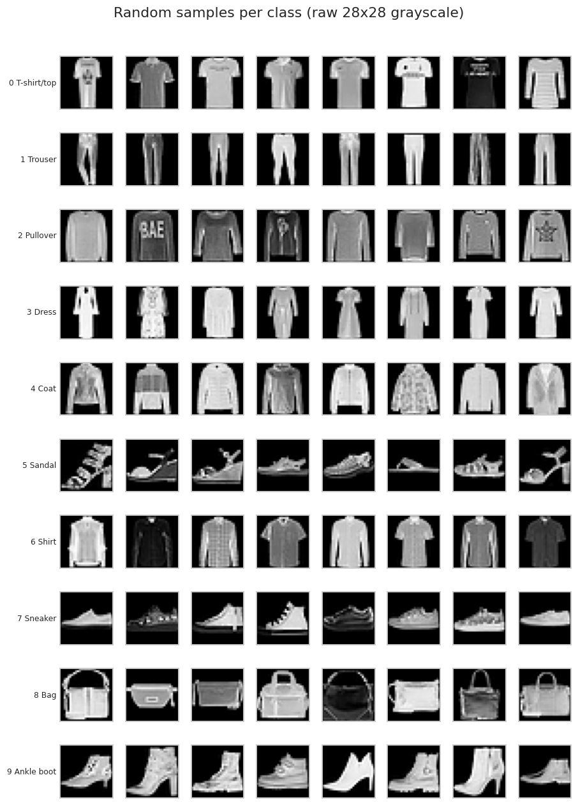
    


**Finding.** The images are silhouettes: bright garment on a black background, centred, scale-normalised and
uniformly oriented. Texture and print details are largely destroyed by the 28x28 downsampling: which is exactly why
`Shirt` vs `T-shirt/top` vs `Pullover` vs `Coat` is hard even for a human annotator: at this resolution the four
classes differ mostly by sleeve length and a few contour pixels.

## 2.3 Pixel-intensity statistics


```python
# --- Global pixel-intensity distribution -----------------------------------------------------------------
def pixel_intensity_overview(images: np.ndarray, sample_size: int = 4_000, seed: int = 42) -> pd.Series:
    """Plot the global pixel histogram (log scale) and return summary statistics."""
    rng = np.random.default_rng(seed)
    idx = rng.choice(len(images), size=min(sample_size, len(images)), replace=False)
    flat = images[idx].reshape(-1).astype(np.float32)

    fig, axes = plt.subplots(1, 2, figsize=(12, 3.6))
    axes[0].hist(flat, bins=64, color="#4C72B0", edgecolor="black", linewidth=0.3)
    axes[0].set_yscale("log")
    axes[0].set_title("Pixel-value histogram (log-count)")
    axes[0].set_xlabel("pixel intensity [0-255]")
    axes[0].set_ylabel("count (log)")

    nonzero = flat[flat > 0]
    axes[1].hist(nonzero, bins=64, color="#DD8452", edgecolor="black", linewidth=0.3)
    axes[1].set_title("Non-zero pixels only (the garment itself)")
    axes[1].set_xlabel("pixel intensity [1-255]")
    axes[1].set_ylabel("count")
    plt.show()

    stats = pd.Series(
        {
            "mean": flat.mean(),
            "std": flat.std(),
            "median": float(np.median(flat)),
            "min": flat.min(),
            "max": flat.max(),
            "% exactly 0 (background)": 100.0 * (flat == 0).mean(),
            "% saturated at 255": 100.0 * (flat == 255).mean(),
            "mean of non-zero pixels": nonzero.mean(),
        },
        name="pixel statistics (raw 0-255)",
    ).round(3)
    return stats


display(pixel_intensity_overview(X_tr_np, sample_size=4_000, seed=cfg.seed).to_frame())
```


    
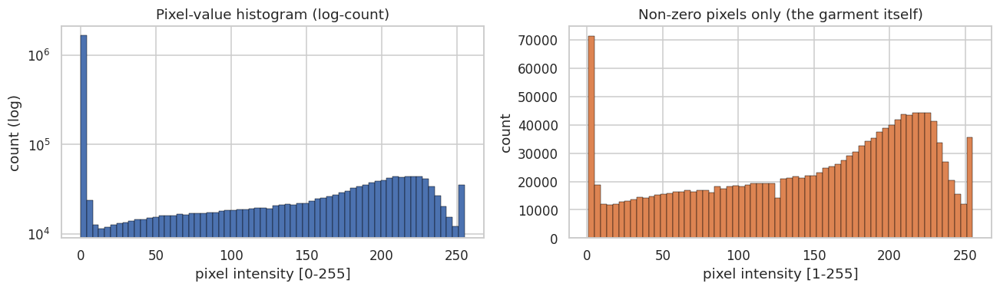
    


  <div id="df-68679047-8001-4e3e-aad6-4493eeeb8395" class="colab-df-container">
    <div>
<style scoped>
    .dataframe tbody tr th:only-of-type {
        vertical-align: middle;
    }

    .dataframe tbody tr th {
        vertical-align: top;
    }

    .dataframe thead th {
        text-align: right;
    }
</style>
<table border="1" class="dataframe">
  <thead>
    <tr style="text-align: right;">
      <th></th>
      <th>pixel statistics (raw 0-255)</th>
    </tr>
  </thead>
  <tbody>
    <tr>
      <th>mean</th>
      <td>72.524</td>
    </tr>
    <tr>
      <th>std</th>
      <td>89.759</td>
    </tr>
    <tr>
      <th>median</th>
      <td>0.000</td>
    </tr>
    <tr>
      <th>min</th>
      <td>0.000</td>
    </tr>
    <tr>
      <th>max</th>
      <td>255.000</td>
    </tr>
    <tr>
      <th>% exactly 0 (background)</th>
      <td>50.427</td>
    </tr>
    <tr>
      <th>% saturated at 255</th>
      <td>0.789</td>
    </tr>
    <tr>
      <th>mean of non-zero pixels</th>
      <td>146.298</td>
    </tr>
  </tbody>
</table>
</div>
    <div class="colab-df-buttons">

  <div class="colab-df-container">
    <button class="colab-df-convert" onclick="convertToInteractive('df-68679047-8001-4e3e-aad6-4493eeeb8395')"
            title="Convert this dataframe to an interactive table."
            style="display:none;">

  <svg xmlns="http://www.w3.org/2000/svg" height="24px" viewBox="0 -960 960 960">
    <path d="M120-120v-720h720v720H120Zm60-500h600v-160H180v160Zm220 220h160v-160H400v160Zm0 220h160v-160H400v160ZM180-400h160v-160H180v160Zm440 0h160v-160H620v160ZM180-180h160v-160H180v160Zm440 0h160v-160H620v160Z"/>
  </svg>
    </button>

  <style>
    .colab-df-container {
      display:flex;
      gap: 12px;
    }

    .colab-df-convert {
      background-color: #E8F0FE;
      border: none;
      border-radius: 50%;
      cursor: pointer;
      display: none;
      fill: #1967D2;
      height: 32px;
      padding: 0 0 0 0;
      width: 32px;
    }

    .colab-df-convert:hover {
      background-color: #E2EBFA;
      box-shadow: 0px 1px 2px rgba(60, 64, 67, 0.3), 0px 1px 3px 1px rgba(60, 64, 67, 0.15);
      fill: #174EA6;
    }

    .colab-df-buttons div {
      margin-bottom: 4px;
    }

    [theme=dark] .colab-df-convert {
      background-color: #3B4455;
      fill: #D2E3FC;
    }

    [theme=dark] .colab-df-convert:hover {
      background-color: #434B5C;
      box-shadow: 0px 1px 3px 1px rgba(0, 0, 0, 0.15);
      filter: drop-shadow(0px 1px 2px rgba(0, 0, 0, 0.3));
      fill: #FFFFFF;
    }
  </style>

    <script>
      const buttonEl =
        document.querySelector('#df-68679047-8001-4e3e-aad6-4493eeeb8395 button.colab-df-convert');
      buttonEl.style.display =
        google.colab.kernel.accessAllowed ? 'block' : 'none';

      async function convertToInteractive(key) {
        const element = document.querySelector('#df-68679047-8001-4e3e-aad6-4493eeeb8395');
        const dataTable =
          await google.colab.kernel.invokeFunction('convertToInteractive',
                                                    [key], {});
        if (!dataTable) return;

        const docLinkHtml = 'Like what you see? Visit the ' +
          '<a target="_blank" href=https://colab.research.google.com/notebooks/data_table.ipynb>data table notebook</a>'
          + ' to learn more about interactive tables.';
        element.innerHTML = '';
        dataTable['output_type'] = 'display_data';
        await google.colab.output.renderOutput(dataTable, element);
        const docLink = document.createElement('div');
        docLink.innerHTML = docLinkHtml;
        element.appendChild(docLink);
      }
    </script>
  </div>


    </div>
  </div>


```python
# --- Per-class brightness and "ink coverage" --------------------------------------------------------------
def per_class_intensity_table(
    images: np.ndarray, labels: np.ndarray, class_names: Sequence[str]
) -> pd.DataFrame:
    """Mean intensity, std and fraction of non-background pixels for each class."""
    flat = images.reshape(len(images), -1).astype(np.float32)
    rows = []
    for c, name in enumerate(class_names):
        sub = flat[labels == c]
        rows.append(
            {
                "class": name,
                "mean intensity": sub.mean(),
                "std intensity": sub.std(),
                "ink coverage % (pixels > 20)": 100.0 * (sub > 20).mean(),
                "mean brightness of garment": sub[sub > 0].mean(),
            }
        )
    return pd.DataFrame(rows).set_index("class").round(2)


intensity_df = per_class_intensity_table(X_tr_np, y_tr_np, cfg.class_names)
display(intensity_df.style.background_gradient(cmap="Blues", axis=0).format("{:.2f}"))

fig, axes = plt.subplots(1, 2, figsize=(13, 3.8))
intensity_df["mean intensity"].plot(kind="barh", ax=axes[0], color="#4C72B0", edgecolor="black", linewidth=0.4)
axes[0].set_title("Mean pixel intensity per class")
axes[0].set_xlabel("intensity [0-255]")
intensity_df["ink coverage % (pixels > 20)"].plot(
    kind="barh", ax=axes[1], color="#55A868", edgecolor="black", linewidth=0.4
)
axes[1].set_title("Ink coverage: % of pixels brighter than 20")
axes[1].set_xlabel("% of image area")
plt.show()
```


<style type="text/css">
#T_0619a_row0_col0 {
  background-color: #206fb4;
  color: #f1f1f1;
}
#T_0619a_row0_col1 {
  background-color: #1f6eb3;
  color: #f1f1f1;
}
#T_0619a_row0_col2 {
  background-color: #1966ad;
  color: #f1f1f1;
}
#T_0619a_row0_col3 {
  background-color: #5aa2cf;
  color: #f1f1f1;
}
#T_0619a_row1_col0 {
  background-color: #a6cee4;
  color: #000000;
}
#T_0619a_row1_col1 {
  background-color: #2c7cba;
  color: #f1f1f1;
}
#T_0619a_row1_col2 {
  background-color: #cde0f1;
  color: #000000;
}
#T_0619a_row1_col3 {
  background-color: #08316d;
  color: #f1f1f1;
}
#T_0619a_row2_col0 {
  background-color: #083979;
  color: #f1f1f1;
}
#T_0619a_row2_col1 {
  background-color: #105ba4;
  color: #f1f1f1;
}
#T_0619a_row2_col2, #T_0619a_row4_col0, #T_0619a_row4_col1, #T_0619a_row4_col3 {
  background-color: #08306b;
  color: #f1f1f1;
}
#T_0619a_row2_col3 {
  background-color: #2b7bba;
  color: #f1f1f1;
}
#T_0619a_row3_col0 {
  background-color: #6caed6;
  color: #f1f1f1;
}
#T_0619a_row3_col1 {
  background-color: #1562a9;
  color: #f1f1f1;
}
#T_0619a_row3_col2 {
  background-color: #97c6df;
  color: #000000;
}
#T_0619a_row3_col3 {
  background-color: #0e59a2;
  color: #f1f1f1;
}
#T_0619a_row4_col2 {
  background-color: #09529d;
  color: #f1f1f1;
}
#T_0619a_row5_col0, #T_0619a_row5_col1, #T_0619a_row5_col2, #T_0619a_row5_col3 {
  background-color: #f7fbff;
  color: #000000;
}
#T_0619a_row6_col0 {
  background-color: #1865ac;
  color: #f1f1f1;
}
#T_0619a_row6_col1 {
  background-color: #3383be;
  color: #f1f1f1;
}
#T_0619a_row6_col2 {
  background-color: #08458a;
  color: #f1f1f1;
}
#T_0619a_row6_col3 {
  background-color: #6fb0d7;
  color: #f1f1f1;
}
#T_0619a_row7_col0 {
  background-color: #deebf7;
  color: #000000;
}
#T_0619a_row7_col1 {
  background-color: #bcd7eb;
  color: #000000;
}
#T_0619a_row7_col2 {
  background-color: #e3eef8;
  color: #000000;
}
#T_0619a_row7_col3 {
  background-color: #aacfe5;
  color: #000000;
}
#T_0619a_row8_col0 {
  background-color: #08509b;
  color: #f1f1f1;
}
#T_0619a_row8_col1 {
  background-color: #084990;
  color: #f1f1f1;
}
#T_0619a_row8_col2 {
  background-color: #1967ad;
  color: #f1f1f1;
}
#T_0619a_row8_col3 {
  background-color: #0f5aa3;
  color: #f1f1f1;
}
#T_0619a_row9_col0 {
  background-color: #3686c0;
  color: #f1f1f1;
}
#T_0619a_row9_col1 {
  background-color: #083b7c;
  color: #f1f1f1;
}
#T_0619a_row9_col2 {
  background-color: #68acd5;
  color: #f1f1f1;
}
#T_0619a_row9_col3 {
  background-color: #084488;
  color: #f1f1f1;
}
</style>
<table id="T_0619a" class="dataframe">
  <thead>
    <tr>
      <th class="blank level0" >&nbsp;</th>
      <th id="T_0619a_level0_col0" class="col_heading level0 col0" >mean intensity</th>
      <th id="T_0619a_level0_col1" class="col_heading level0 col1" >std intensity</th>
      <th id="T_0619a_level0_col2" class="col_heading level0 col2" >ink coverage % (pixels > 20)</th>
      <th id="T_0619a_level0_col3" class="col_heading level0 col3" >mean brightness of garment</th>
    </tr>
    <tr>
      <th class="index_name level0" >class</th>
      <th class="blank col0" >&nbsp;</th>
      <th class="blank col1" >&nbsp;</th>
      <th class="blank col2" >&nbsp;</th>
      <th class="blank col3" >&nbsp;</th>
    </tr>
  </thead>
  <tbody>
    <tr>
      <th id="T_0619a_level0_row0" class="row_heading level0 row0" >T-shirt/top</th>
      <td id="T_0619a_row0_col0" class="data row0 col0" >82.62</td>
      <td id="T_0619a_row0_col1" class="data row0 col1" >89.00</td>
      <td id="T_0619a_row0_col2" class="data row0 col2" >53.99</td>
      <td id="T_0619a_row0_col3" class="data row0 col3" >138.78</td>
    </tr>
    <tr>
      <th id="T_0619a_level0_row1" class="row_heading level0 row1" >Trouser</th>
      <td id="T_0619a_row1_col0" class="data row1 col0" >56.80</td>
      <td id="T_0619a_row1_col1" class="data row1 col1" >87.52</td>
      <td id="T_0619a_row1_col2" class="data row1 col2" >33.41</td>
      <td id="T_0619a_row1_col3" class="data row1 col3" >162.66</td>
    </tr>
    <tr>
      <th id="T_0619a_level0_row2" class="row_heading level0 row2" >Pullover</th>
      <td id="T_0619a_row2_col0" class="data row2 col0" >95.63</td>
      <td id="T_0619a_row2_col1" class="data row2 col1" >91.07</td>
      <td id="T_0619a_row2_col2" class="data row2 col2" >61.49</td>
      <td id="T_0619a_row2_col3" class="data row2 col3" >147.44</td>
    </tr>
    <tr>
      <th id="T_0619a_level0_row3" class="row_heading level0 row3" >Dress</th>
      <td id="T_0619a_row3_col0" class="data row3 col0" >66.18</td>
      <td id="T_0619a_row3_col1" class="data row3 col1" >90.29</td>
      <td id="T_0619a_row3_col2" class="data row3 col2" >39.77</td>
      <td id="T_0619a_row3_col3" class="data row3 col3" >154.27</td>
    </tr>
    <tr>
      <th id="T_0619a_level0_row4" class="row_heading level0 row4" >Coat</th>
      <td id="T_0619a_row4_col0" class="data row4 col0" >97.95</td>
      <td id="T_0619a_row4_col1" class="data row4 col1" >95.88</td>
      <td id="T_0619a_row4_col2" class="data row4 col2" >56.83</td>
      <td id="T_0619a_row4_col3" class="data row4 col3" >162.92</td>
    </tr>
    <tr>
      <th id="T_0619a_level0_row5" class="row_heading level0 row5" >Sandal</th>
      <td id="T_0619a_row5_col0" class="data row5 col0" >34.86</td>
      <td id="T_0619a_row5_col1" class="data row5 col1" >67.16</td>
      <td id="T_0619a_row5_col2" class="data row5 col2" >25.77</td>
      <td id="T_0619a_row5_col3" class="data row5 col3" >108.72</td>
    </tr>
    <tr>
      <th id="T_0619a_level0_row6" class="row_heading level0 row6" >Shirt</th>
      <td id="T_0619a_row6_col0" class="data row6 col0" >85.13</td>
      <td id="T_0619a_row6_col1" class="data row6 col1" >86.71</td>
      <td id="T_0619a_row6_col2" class="data row6 col2" >58.61</td>
      <td id="T_0619a_row6_col3" class="data row6 col3" >135.30</td>
    </tr>
    <tr>
      <th id="T_0619a_level0_row7" class="row_heading level0 row7" >Sneaker</th>
      <td id="T_0619a_row7_col0" class="data row7 col0" >42.90</td>
      <td id="T_0619a_row7_col1" class="data row7 col1" >75.34</td>
      <td id="T_0619a_row7_col2" class="data row7 col2" >29.42</td>
      <td id="T_0619a_row7_col3" class="data row7 col3" >127.02</td>
    </tr>
    <tr>
      <th id="T_0619a_level0_row8" class="row_heading level0 row8" >Bag</th>
      <td id="T_0619a_row8_col0" class="data row8 col0" >90.08</td>
      <td id="T_0619a_row8_col1" class="data row8 col1" >93.18</td>
      <td id="T_0619a_row8_col2" class="data row8 col2" >53.86</td>
      <td id="T_0619a_row8_col3" class="data row8 col3" >154.09</td>
    </tr>
    <tr>
      <th id="T_0619a_level0_row9" class="row_heading level0 row9" >Ankle boot</th>
      <td id="T_0619a_row9_col0" class="data row9 col0" >77.04</td>
      <td id="T_0619a_row9_col1" class="data row9 col1" >94.58</td>
      <td id="T_0619a_row9_col2" class="data row9 col2" >43.97</td>
      <td id="T_0619a_row9_col3" class="data row9 col3" >158.70</td>
    </tr>
  </tbody>
</table>


    
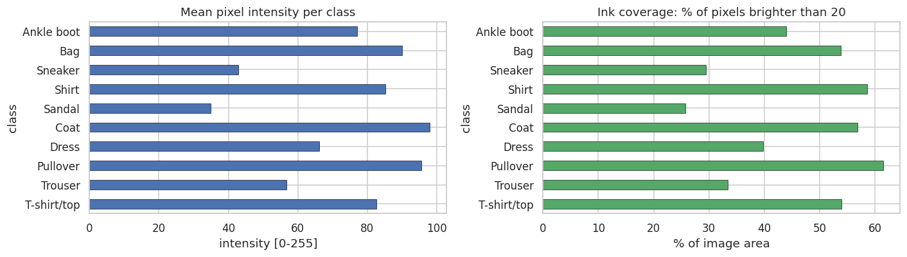
    


**Finding.** Roughly half of all pixels are exact background zeros, and the classes split into two intensity
regimes: bulky garments (`Pullover`, `Coat`, `Dress`) cover 45–60 % of the frame, while footwear (`Sandal`, `Sneaker`)
covers barely 25 %. Two practical consequences:

1. **Normalisation matters.** Raw features have mean ≈ 73 and std ≈ 90 on a 0–255 scale; feeding that to a linear model
   or a neural net slows optimisation. We standardise with the training mean/std (Section 1.6): this alone typically
   makes logistic regression converge several times faster.
2. **Area is a real signal.** A trivially simple feature (ink coverage) already separates footwear from coats, which is
   why even Logistic Regression reaches ~84 %: a useful sanity check on the deep-learning gains.

## 2.4 Where the information lives: mean images and variance map


```python
# --- Class-mean images ("class templates") and the global pixel-variance map --------------------------------
def plot_class_means_and_variance(
    images: np.ndarray, labels: np.ndarray, class_names: Sequence[str]
) -> np.ndarray:
    """Plot the average image of every class plus the per-pixel std map. Returns the class-mean matrix (10, 784)."""
    flat = images.reshape(len(images), -1).astype(np.float32)
    means = np.stack([flat[labels == c].mean(axis=0) for c in range(len(class_names))])

    fig, axes = plt.subplots(2, 5, figsize=(12, 5.2))
    for c, ax in enumerate(axes.ravel()):
        ax.imshow(means[c].reshape(28, 28), cmap="viridis")
        ax.set_title(f"{c}: {class_names[c]}", fontsize=9)
        ax.axis("off")
    fig.suptitle("Mean image per class - the 'template' each classifier is implicitly matching", y=1.0)
    plt.show()

    fig, axes = plt.subplots(1, 3, figsize=(12, 3.8))
    axes[0].imshow(flat.mean(axis=0).reshape(28, 28), cmap="viridis")
    axes[0].set_title("Global mean image")
    axes[0].axis("off")
    im1 = axes[1].imshow(flat.std(axis=0).reshape(28, 28), cmap="magma")
    axes[1].set_title("Per-pixel standard deviation")
    axes[1].axis("off")
    plt.colorbar(im1, ax=axes[1], fraction=0.046)
    dead = (flat.max(axis=0) == 0).reshape(28, 28)
    axes[2].imshow(dead, cmap="gray_r")
    axes[2].set_title(f"Always-black pixels ({int(dead.sum())} of 784)")
    axes[2].axis("off")
    plt.show()
    return means


class_means = plot_class_means_and_variance(X_tr_np, y_tr_np, cfg.class_names)
```


    
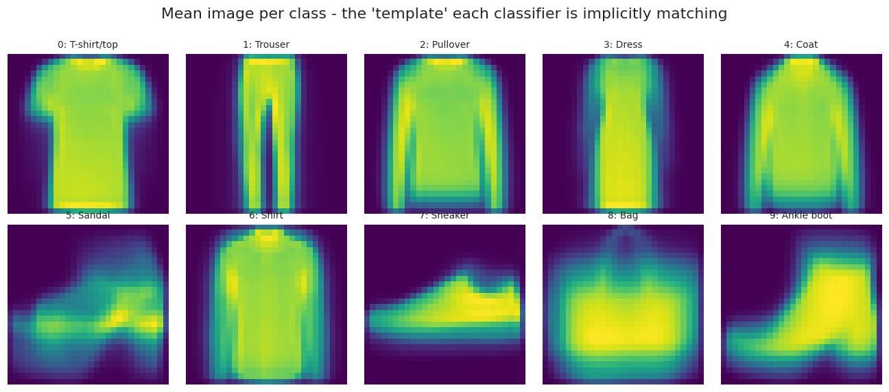
    


    
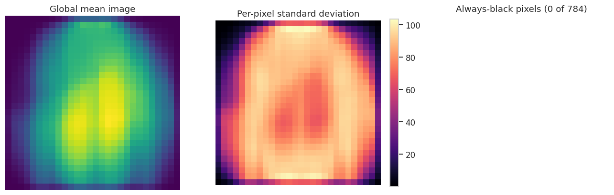
    


**Finding.** The corners and the outer border are (nearly) always black, and the variance map shows that almost all
discriminative signal sits in a central ~20x20 region. Two decisions follow:

* **Data augmentation by ±2-pixel translation is safe**: shifting the garment inside the black margin produces a
  perfectly plausible image and cannot push content out of frame.
* **Horizontal flipping is label-preserving** for all ten garment categories (a mirrored sneaker is still a sneaker),
  unlike MNIST where flipping a digit destroys it. This is exactly why augmentation is worth much more here than on
  MNIST.
* A handful of pixels are constant zero across the whole training set; they contribute nothing but are harmless
  (`StandardScaler` in the sklearn pipelines is created with default settings and handles zero-variance columns by
  leaving them at zero).

## 2.5 Which classes are intrinsically confusable?


```python
# --- Similarity between class templates ---------------------------------------------------------------------
def plot_class_similarity(class_means: np.ndarray, class_names: Sequence[str]) -> pd.DataFrame:
    """Correlation heat-map between class-mean images: a cheap predictor of future confusions."""
    corr = np.corrcoef(class_means)
    corr_df = pd.DataFrame(corr, index=list(class_names), columns=list(class_names))
    plt.figure(figsize=(7.5, 6))
    sns.heatmap(corr_df, annot=True, fmt=".2f", cmap="rocket_r", vmin=0, vmax=1,
                cbar_kws={"label": "Pearson correlation of class-mean images"}, annot_kws={"size": 7})
    plt.title("Similarity between class templates")
    plt.show()
    return corr_df


corr_df = plot_class_similarity(class_means, cfg.class_names)

# Report the most similar (and therefore most confusable) class pairs
pairs = [
    (cfg.class_names[i], cfg.class_names[j], corr_df.iat[i, j])
    for i in range(cfg.num_classes)
    for j in range(i + 1, cfg.num_classes)
]
top_pairs = pd.DataFrame(pairs, columns=["class A", "class B", "correlation"]).nlargest(8, "correlation")
display(top_pairs.reset_index(drop=True).style.hide(axis="index").format({"correlation": "{:.3f}"}))
```


    
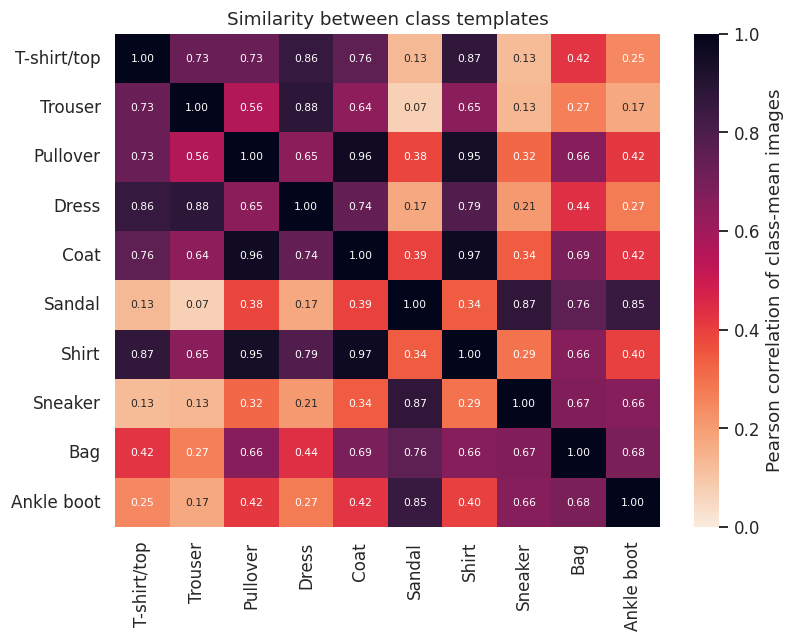
    


<style type="text/css">
</style>
<table id="T_4cae5" class="dataframe">
  <thead>
    <tr>
      <th id="T_4cae5_level0_col0" class="col_heading level0 col0" >class A</th>
      <th id="T_4cae5_level0_col1" class="col_heading level0 col1" >class B</th>
      <th id="T_4cae5_level0_col2" class="col_heading level0 col2" >correlation</th>
    </tr>
  </thead>
  <tbody>
    <tr>
      <td id="T_4cae5_row0_col0" class="data row0 col0" >Coat</td>
      <td id="T_4cae5_row0_col1" class="data row0 col1" >Shirt</td>
      <td id="T_4cae5_row0_col2" class="data row0 col2" >0.967</td>
    </tr>
    <tr>
      <td id="T_4cae5_row1_col0" class="data row1 col0" >Pullover</td>
      <td id="T_4cae5_row1_col1" class="data row1 col1" >Coat</td>
      <td id="T_4cae5_row1_col2" class="data row1 col2" >0.958</td>
    </tr>
    <tr>
      <td id="T_4cae5_row2_col0" class="data row2 col0" >Pullover</td>
      <td id="T_4cae5_row2_col1" class="data row2 col1" >Shirt</td>
      <td id="T_4cae5_row2_col2" class="data row2 col2" >0.947</td>
    </tr>
    <tr>
      <td id="T_4cae5_row3_col0" class="data row3 col0" >Trouser</td>
      <td id="T_4cae5_row3_col1" class="data row3 col1" >Dress</td>
      <td id="T_4cae5_row3_col2" class="data row3 col2" >0.879</td>
    </tr>
    <tr>
      <td id="T_4cae5_row4_col0" class="data row4 col0" >Sandal</td>
      <td id="T_4cae5_row4_col1" class="data row4 col1" >Sneaker</td>
      <td id="T_4cae5_row4_col2" class="data row4 col2" >0.872</td>
    </tr>
    <tr>
      <td id="T_4cae5_row5_col0" class="data row5 col0" >T-shirt/top</td>
      <td id="T_4cae5_row5_col1" class="data row5 col1" >Shirt</td>
      <td id="T_4cae5_row5_col2" class="data row5 col2" >0.868</td>
    </tr>
    <tr>
      <td id="T_4cae5_row6_col0" class="data row6 col0" >T-shirt/top</td>
      <td id="T_4cae5_row6_col1" class="data row6 col1" >Dress</td>
      <td id="T_4cae5_row6_col2" class="data row6 col2" >0.859</td>
    </tr>
    <tr>
      <td id="T_4cae5_row7_col0" class="data row7 col0" >Sandal</td>
      <td id="T_4cae5_row7_col1" class="data row7 col1" >Ankle boot</td>
      <td id="T_4cae5_row7_col2" class="data row7 col2" >0.850</td>
    </tr>
  </tbody>
</table>


```python
# --- 2-D PCA projection: how linearly separable is the raw pixel space? ----------------------------------------
def plot_pca_scatter(
    images: np.ndarray, labels: np.ndarray, class_names: Sequence[str], n_samples: int = 6_000, seed: int = 42
) -> PCA:
    """Fit a 2-component PCA on raw pixels and scatter-plot the classes; also show the explained-variance curve."""
    rng = np.random.default_rng(seed)
    idx = rng.choice(len(images), size=min(n_samples, len(images)), replace=False)
    flat = images[idx].reshape(len(idx), -1).astype(np.float32) / 255.0

    pca_full = PCA(n_components=100, random_state=seed).fit(flat)
    z = pca_full.transform(flat)[:, :2]

    fig, axes = plt.subplots(1, 2, figsize=(13, 4.6))
    palette = sns.color_palette("tab10", len(class_names))
    for c, name in enumerate(class_names):
        m = labels[idx] == c
        axes[0].scatter(z[m, 0], z[m, 1], s=5, alpha=0.55, color=palette[c], label=name)
    axes[0].set_title("PCA of raw pixels (first 2 components)")
    axes[0].set_xlabel(f"PC1 ({pca_full.explained_variance_ratio_[0] * 100:.1f}% var)")
    axes[0].set_ylabel(f"PC2 ({pca_full.explained_variance_ratio_[1] * 100:.1f}% var)")
    axes[0].legend(markerscale=2, fontsize=7, ncol=2, loc="best")

    cum = np.cumsum(pca_full.explained_variance_ratio_)
    axes[1].plot(range(1, len(cum) + 1), cum, marker="o", ms=3)
    axes[1].axhline(0.90, ls="--", c="red", lw=1, label="90% variance")
    axes[1].set_title("Cumulative explained variance")
    axes[1].set_xlabel("number of principal components")
    axes[1].set_ylabel("cumulative explained variance")
    axes[1].legend()
    plt.show()

    n90 = int(np.searchsorted(cum, 0.90) + 1)
    print(f"{n90} principal components explain 90% of the pixel variance (out of 784 raw dimensions).")
    return pca_full


pca_model = plot_pca_scatter(X_tr_np, y_tr_np, cfg.class_names, n_samples=6_000, seed=cfg.seed)
```


    
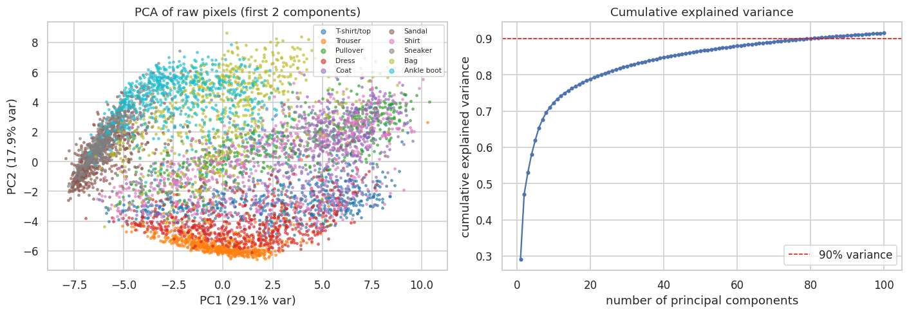
    


    80 principal components explain 90% of the pixel variance (out of 784 raw dimensions).
    

**Finding: and the central hypothesis of this project.** The template-correlation heat-map and the PCA scatter tell
the same story:

* **Footwear** (`Sandal`, `Sneaker`, `Ankle boot`), `Trouser` and `Bag` occupy well-separated regions of pixel space →
  even a linear model should classify them well.
* The **upper-body cluster** (`T-shirt/top`, `Pullover`, `Coat`, `Shirt`) collapses into one overlapping blob, with
  template correlations above 0.9. **This cluster will dominate the error budget of every model in this notebook**:
  we verify this explicitly with the confusion matrix in Section 4.6.
* ~85 components already capture 90 % of the variance, i.e. the intrinsic dimensionality is far below 784. This is why
  classical models are viable at all, and it also motivates the PCA-compressed SVM pipeline in Section 3.

---

# 2.6 - 2.10  Advanced EDA (upgraded edition)

> Exam criteria: **Visualization (0–10)** and **Data Gathering / Cleaning / Formatting (0–10)**.

Sections 2.1–2.5 established the *first-order* facts: the dataset is balanced, the images are centred silhouettes,
half the pixels are background, and the four upper-body classes share nearly identical templates. The upgraded EDA
below goes after the *second-order* structure that actually drives modelling decisions:

| # | Question | Method | Modelling consequence |
|---|---|---|---|
| 2.6 | How is intensity distributed **within** each class, not just on average? | per-class histograms, ECDFs, violin plots, moment table, KS distances | shows that intensity alone separates footwear from tops but never separates the upper-body cluster |
| 2.7 | Which pixels carry class information, and how redundant are neighbouring pixels? | class-mean / class-variance images, Fisher discriminability map, pixel-correlation heat-maps | justifies convolution (strong local correlation ⇒ weight sharing) and PCA compression for the classical models |
| 2.8 | What does the data manifold look like? | PCA (2D/3D), tuned t-SNE, tuned UMAP, trustworthiness + kNN probes | quantifies how much of the class structure is *linearly* accessible vs. non-linear |
| 2.9 | Can the taxonomy be recovered **without labels**? | k-means over a grid of k, silhouette / ARI / NMI, contingency heat-map | reveals that unsupervised structure merges exactly the classes the classifiers later confuse |
| 2.10 | Are there anomalies / probable mislabels? | Isolation Forest **and** a convolutional autoencoder, plus agreement analysis | tells us whether the residual error is noise in the data rather than a modelling failure |

Every routine below is a documented, self-contained function that takes arrays and returns a table or a figure, so it
can be re-used on any other 28x28 grayscale dataset without modification.


```python
# --- Section-local imports and the shared EDA working sample ---------------------------------------------
# These imports are deliberately kept next to the section that uses them (the original Section 1.2 import
# block is left untouched so that every v1 result stays reproducible).
import inspect

from scipy import stats as sp_stats
from sklearn.cluster import KMeans
from sklearn.ensemble import IsolationForest
from sklearn.manifold import TSNE, trustworthiness
from sklearn.metrics import adjusted_rand_score, normalized_mutual_info_score, silhouette_score
from sklearn.neighbors import KNeighborsClassifier


def make_eda_sample(
    images: np.ndarray,
    labels: np.ndarray,
    n: int,
    seed: int = 42,
) -> Tuple[np.ndarray, np.ndarray, np.ndarray]:
    """Draw a **stratified** working sample so that every heavy EDA routine sees the same data.

    Parameters
    ----------
    images : np.ndarray
        `(N, 28, 28)` uint8 images.
    labels : np.ndarray
        `(N,)` integer labels.
    n : int
        Total sample size (split evenly across the classes).
    seed : int
        RNG seed.

    Returns
    -------
    (images_sample, labels_sample, flat_sample)
        The last element is `(n, 784)` float32 scaled to `[0, 1]` - the format every sklearn routine wants.
    """
    rng = np.random.default_rng(seed)
    classes = np.unique(labels)
    per_class = max(1, n // len(classes))
    idx = np.concatenate([
        rng.choice(np.flatnonzero(labels == c), size=min(per_class, int((labels == c).sum())), replace=False)
        for c in classes
    ])
    rng.shuffle(idx)
    imgs, labs = images[idx], labels[idx]
    flat = imgs.reshape(len(imgs), -1).astype(np.float32) / 255.0
    return imgs, labs, flat


X_eda, y_eda, F_eda = make_eda_sample(X_tr_np, y_tr_np, cfgx.eda_sample, seed=cfg.seed)
print(f"EDA working sample: {X_eda.shape} images, flat matrix {F_eda.shape} "
      f"({F_eda.nbytes / 1e6:.1f} MB), class counts {np.bincount(y_eda, minlength=cfg.num_classes).tolist()}")
```

    EDA working sample: (8000, 28, 28) images, flat matrix (8000, 784) (25.1 MB), class counts [800, 800, 800, 800, 800, 800, 800, 800, 800, 800]
    

## 2.6 Pixel-intensity distributions, global and per class

Section 2.3 reported *means*. A mean hides the shape of the distribution, and the shape is what tells us whether a
threshold-style feature can work at all. Fashion-MNIST intensities are strongly **bimodal**: a huge spike at 0
(background) and a broad garment mode between roughly 60 and 220. We therefore analyse the two regimes separately:
the background spike would otherwise dominate every statistic.


```python
# --- 2.6.1 Global intensity distribution: raw, foreground-only, and on the log-count scale ------------------
def plot_global_intensity(flat01: np.ndarray, bins: int = 64) -> pd.Series:
    """Four complementary views of the global pixel-intensity distribution.

    Returns a Series of distribution moments (mean/std/skew/kurtosis, background and saturation share).
    """
    vals = (flat01.reshape(-1) * 255.0).astype(np.float32)
    fg = vals[vals > 0]

    fig, axes = plt.subplots(1, 4, figsize=(17, 3.6))
    axes[0].hist(vals, bins=bins, color="#4C72B0", edgecolor="black", linewidth=0.3)
    axes[0].set_title("All pixels (linear count)")
    axes[0].set_xlabel("intensity")

    axes[1].hist(vals, bins=bins, color="#4C72B0", edgecolor="black", linewidth=0.3)
    axes[1].set_yscale("log")
    axes[1].set_title("All pixels (log count)")
    axes[1].set_xlabel("intensity")

    axes[2].hist(fg, bins=bins, color="#DD8452", edgecolor="black", linewidth=0.3, density=True)
    axes[2].set_title("Foreground only (> 0), density")
    axes[2].set_xlabel("intensity")

    order = np.sort(vals[np.random.default_rng(0).choice(len(vals), size=min(200_000, len(vals)), replace=False)])
    axes[3].plot(order, np.linspace(0, 1, len(order)), lw=1.6, color="#55A868")
    axes[3].set_title("Empirical CDF of all pixels")
    axes[3].set_xlabel("intensity")
    axes[3].set_ylabel("F(x)")
    fig.suptitle("2.6.1 Global pixel-intensity distribution", y=1.04)
    plt.show()

    return pd.Series(
        {
            "mean": float(vals.mean()),
            "std": float(vals.std()),
            "skewness": float(sp_stats.skew(vals)),
            "excess kurtosis": float(sp_stats.kurtosis(vals)),
            "% background (== 0)": float(100.0 * (vals == 0).mean()),
            "% saturated (== 255)": float(100.0 * (vals == 255).mean()),
            "foreground mean": float(fg.mean()),
            "foreground std": float(fg.std()),
            "foreground median": float(np.median(fg)),
        },
        name="global intensity statistics",
    ).round(3)


display(plot_global_intensity(F_eda).to_frame())
```


    
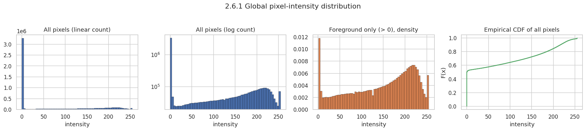
    


  <div id="df-394f23fa-6558-4b0b-a757-d56aeeac2750" class="colab-df-container">
    <div>
<style scoped>
    .dataframe tbody tr th:only-of-type {
        vertical-align: middle;
    }

    .dataframe tbody tr th {
        vertical-align: top;
    }

    .dataframe thead th {
        text-align: right;
    }
</style>
<table border="1" class="dataframe">
  <thead>
    <tr style="text-align: right;">
      <th></th>
      <th>global intensity statistics</th>
    </tr>
  </thead>
  <tbody>
    <tr>
      <th>mean</th>
      <td>73.156</td>
    </tr>
    <tr>
      <th>std</th>
      <td>89.969</td>
    </tr>
    <tr>
      <th>skewness</th>
      <td>0.686</td>
    </tr>
    <tr>
      <th>excess kurtosis</th>
      <td>-1.202</td>
    </tr>
    <tr>
      <th>% background (== 0)</th>
      <td>50.098</td>
    </tr>
    <tr>
      <th>% saturated (== 255)</th>
      <td>0.789</td>
    </tr>
    <tr>
      <th>foreground mean</th>
      <td>146.601</td>
    </tr>
    <tr>
      <th>foreground std</th>
      <td>73.849</td>
    </tr>
    <tr>
      <th>foreground median</th>
      <td>164.000</td>
    </tr>
  </tbody>
</table>
</div>
    <div class="colab-df-buttons">

  <div class="colab-df-container">
    <button class="colab-df-convert" onclick="convertToInteractive('df-394f23fa-6558-4b0b-a757-d56aeeac2750')"
            title="Convert this dataframe to an interactive table."
            style="display:none;">

  <svg xmlns="http://www.w3.org/2000/svg" height="24px" viewBox="0 -960 960 960">
    <path d="M120-120v-720h720v720H120Zm60-500h600v-160H180v160Zm220 220h160v-160H400v160Zm0 220h160v-160H400v160ZM180-400h160v-160H180v160Zm440 0h160v-160H620v160ZM180-180h160v-160H180v160Zm440 0h160v-160H620v160Z"/>
  </svg>
    </button>

  <style>
    .colab-df-container {
      display:flex;
      gap: 12px;
    }

    .colab-df-convert {
      background-color: #E8F0FE;
      border: none;
      border-radius: 50%;
      cursor: pointer;
      display: none;
      fill: #1967D2;
      height: 32px;
      padding: 0 0 0 0;
      width: 32px;
    }

    .colab-df-convert:hover {
      background-color: #E2EBFA;
      box-shadow: 0px 1px 2px rgba(60, 64, 67, 0.3), 0px 1px 3px 1px rgba(60, 64, 67, 0.15);
      fill: #174EA6;
    }

    .colab-df-buttons div {
      margin-bottom: 4px;
    }

    [theme=dark] .colab-df-convert {
      background-color: #3B4455;
      fill: #D2E3FC;
    }

    [theme=dark] .colab-df-convert:hover {
      background-color: #434B5C;
      box-shadow: 0px 1px 3px 1px rgba(0, 0, 0, 0.15);
      filter: drop-shadow(0px 1px 2px rgba(0, 0, 0, 0.3));
      fill: #FFFFFF;
    }
  </style>

    <script>
      const buttonEl =
        document.querySelector('#df-394f23fa-6558-4b0b-a757-d56aeeac2750 button.colab-df-convert');
      buttonEl.style.display =
        google.colab.kernel.accessAllowed ? 'block' : 'none';

      async function convertToInteractive(key) {
        const element = document.querySelector('#df-394f23fa-6558-4b0b-a757-d56aeeac2750');
        const dataTable =
          await google.colab.kernel.invokeFunction('convertToInteractive',
                                                    [key], {});
        if (!dataTable) return;

        const docLinkHtml = 'Like what you see? Visit the ' +
          '<a target="_blank" href=https://colab.research.google.com/notebooks/data_table.ipynb>data table notebook</a>'
          + ' to learn more about interactive tables.';
        element.innerHTML = '';
        dataTable['output_type'] = 'display_data';
        await google.colab.output.renderOutput(dataTable, element);
        const docLink = document.createElement('div');
        docLink.innerHTML = docLinkHtml;
        element.appendChild(docLink);
      }
    </script>
  </div>


    </div>
  </div>


```python
# --- 2.6.2 Per-class intensity distributions -----------------------------------------------------------------
def plot_per_class_intensity(
    flat01: np.ndarray, labels: np.ndarray, class_names: Sequence[str], bins: int = 48
) -> pd.DataFrame:
    """Per-class histograms, ECDFs and a violin plot of *foreground* intensity + a moment table.

    Foreground-only statistics are used because the background spike at 0 is identical for every class and would
    swamp any real difference.
    """
    n_classes = len(class_names)
    palette = sns.color_palette("tab10", n_classes)

    # (a) small-multiples: one histogram per class, foreground pixels only
    fig, axes = plt.subplots(2, 5, figsize=(16, 5.4), sharex=True, sharey=True)
    for c, ax in enumerate(axes.ravel()):
        v = (flat01[labels == c] * 255.0).reshape(-1)
        ax.hist(v[v > 0], bins=bins, color=palette[c], density=True, edgecolor="black", linewidth=0.2)
        ax.set_title(f"{c}: {class_names[c]}", fontsize=9)
        ax.set_xlabel("intensity")
    fig.suptitle("2.6.2a Foreground-intensity density per class", y=1.02)
    plt.show()

    # (b) overlaid ECDFs - the cleanest way to see stochastic dominance between classes
    fig, axes = plt.subplots(1, 2, figsize=(14, 4.2))
    rng = np.random.default_rng(0)
    for c in range(n_classes):
        v = (flat01[labels == c] * 255.0).reshape(-1)
        v = v[v > 0]
        v = np.sort(rng.choice(v, size=min(40_000, len(v)), replace=False))
        axes[0].plot(v, np.linspace(0, 1, len(v)), lw=1.3, color=palette[c], label=class_names[c])
    axes[0].set_title("ECDF of foreground intensity per class")
    axes[0].set_xlabel("intensity")
    axes[0].set_ylabel("F(x)")
    axes[0].legend(fontsize=7, ncol=2)

    # (c) violin of the per-IMAGE mean intensity (one point per image, not per pixel)
    per_image_df = pd.DataFrame(
        {"class": [class_names[c] for c in labels], "mean intensity": flat01.mean(axis=1) * 255.0}
    )
    try:                       # seaborn >= 0.13 wants an explicit hue to accept a palette
        sns.violinplot(
            data=per_image_df, x="class", y="mean intensity", hue="class", ax=axes[1],
            palette=palette, inner="quartile", cut=0, order=list(class_names), legend=False,
        )
    except TypeError:          # seaborn < 0.13 has no `legend` argument
        sns.violinplot(
            data=per_image_df, x="class", y="mean intensity", ax=axes[1],
            palette=palette, inner="quartile", cut=0, order=list(class_names),
        )
    axes[1].set_title("Distribution of the per-image mean intensity")
    axes[1].set_ylabel("mean intensity of the image")
    axes[1].tick_params(axis="x", rotation=40)
    plt.show()

    rows = []
    for c in range(n_classes):
        allv = (flat01[labels == c] * 255.0).reshape(-1)
        fg = allv[allv > 0]
        rows.append(
            {
                "class": class_names[c],
                "image-mean": float(flat01[labels == c].mean() * 255),
                "fg mean": float(fg.mean()),
                "fg std": float(fg.std()),
                "fg skew": float(sp_stats.skew(fg)),
                "% background": float(100.0 * (allv == 0).mean()),
                "ink coverage % (>20)": float(100.0 * (allv > 20).mean()),
            }
        )
    return pd.DataFrame(rows).set_index("class").round(2)


intensity_v2_df = plot_per_class_intensity(F_eda, y_eda, cfg.class_names)
display(intensity_v2_df.style.background_gradient(cmap="Blues", axis=0).format("{:.2f}"))
```


    
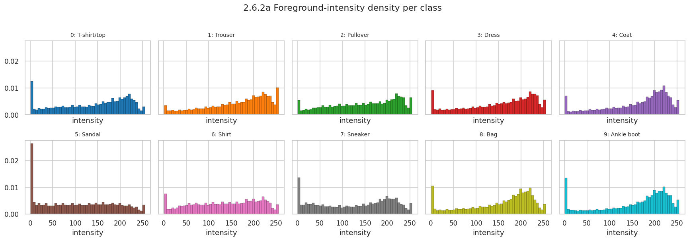
    


    
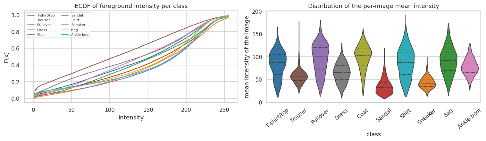
    


<style type="text/css">
#T_4e851_row0_col0 {
  background-color: #1f6eb3;
  color: #f1f1f1;
}
#T_4e851_row0_col1 {
  background-color: #549fcd;
  color: #f1f1f1;
}
#T_4e851_row0_col2 {
  background-color: #3e8ec4;
  color: #f1f1f1;
}
#T_4e851_row0_col3 {
  background-color: #7ab6d9;
  color: #000000;
}
#T_4e851_row0_col4 {
  background-color: #d7e6f5;
  color: #000000;
}
#T_4e851_row0_col5, #T_4e851_row8_col5 {
  background-color: #1967ad;
  color: #f1f1f1;
}
#T_4e851_row1_col0 {
  background-color: #a8cee4;
  color: #000000;
}
#T_4e851_row1_col1 {
  background-color: #08316d;
  color: #f1f1f1;
}
#T_4e851_row1_col2, #T_4e851_row2_col4, #T_4e851_row4_col3, #T_4e851_row5_col0, #T_4e851_row5_col1, #T_4e851_row5_col5, #T_4e851_row9_col3 {
  background-color: #f7fbff;
  color: #000000;
}
#T_4e851_row1_col3 {
  background-color: #d1e2f3;
  color: #000000;
}
#T_4e851_row1_col4 {
  background-color: #084387;
  color: #f1f1f1;
}
#T_4e851_row1_col5 {
  background-color: #cee0f2;
  color: #000000;
}
#T_4e851_row2_col0 {
  background-color: #083979;
  color: #f1f1f1;
}
#T_4e851_row2_col1 {
  background-color: #2a7ab9;
  color: #f1f1f1;
}
#T_4e851_row2_col2 {
  background-color: #a3cce3;
  color: #000000;
}
#T_4e851_row2_col3 {
  background-color: #69add5;
  color: #f1f1f1;
}
#T_4e851_row2_col5, #T_4e851_row4_col0, #T_4e851_row4_col1, #T_4e851_row5_col3, #T_4e851_row5_col4, #T_4e851_row7_col2 {
  background-color: #08306b;
  color: #f1f1f1;
}
#T_4e851_row3_col0 {
  background-color: #77b5d9;
  color: #000000;
}
#T_4e851_row3_col1 {
  background-color: #1764ab;
  color: #f1f1f1;
}
#T_4e851_row3_col2 {
  background-color: #61a7d2;
  color: #f1f1f1;
}
#T_4e851_row3_col3 {
  background-color: #bcd7eb;
  color: #000000;
}
#T_4e851_row3_col4 {
  background-color: #3181bd;
  color: #f1f1f1;
}
#T_4e851_row3_col5 {
  background-color: #9fcae1;
  color: #000000;
}
#T_4e851_row4_col2 {
  background-color: #f5f9fe;
  color: #000000;
}
#T_4e851_row4_col4 {
  background-color: #dae8f6;
  color: #000000;
}
#T_4e851_row4_col5 {
  background-color: #08519c;
  color: #f1f1f1;
}
#T_4e851_row5_col2 {
  background-color: #08458a;
  color: #f1f1f1;
}
#T_4e851_row6_col0 {
  background-color: #1561a9;
  color: #f1f1f1;
}
#T_4e851_row6_col1 {
  background-color: #6aaed6;
  color: #f1f1f1;
}
#T_4e851_row6_col2 {
  background-color: #b0d2e7;
  color: #000000;
}
#T_4e851_row6_col3 {
  background-color: #3989c1;
  color: #f1f1f1;
}
#T_4e851_row6_col4 {
  background-color: #eff6fc;
  color: #000000;
}
#T_4e851_row6_col5 {
  background-color: #084184;
  color: #f1f1f1;
}
#T_4e851_row7_col0 {
  background-color: #dfebf7;
  color: #000000;
}
#T_4e851_row7_col1 {
  background-color: #a1cbe2;
  color: #000000;
}
#T_4e851_row7_col3 {
  background-color: #3484bf;
  color: #f1f1f1;
}
#T_4e851_row7_col4 {
  background-color: #083776;
  color: #f1f1f1;
}
#T_4e851_row7_col5 {
  background-color: #e6f0f9;
  color: #000000;
}
#T_4e851_row8_col0 {
  background-color: #08509b;
  color: #f1f1f1;
}
#T_4e851_row8_col1 {
  background-color: #105ba4;
  color: #f1f1f1;
}
#T_4e851_row8_col2 {
  background-color: #bfd8ed;
  color: #000000;
}
#T_4e851_row8_col3 {
  background-color: #e5eff9;
  color: #000000;
}
#T_4e851_row8_col4 {
  background-color: #d2e3f3;
  color: #000000;
}
#T_4e851_row9_col0 {
  background-color: #3383be;
  color: #f1f1f1;
}
#T_4e851_row9_col1 {
  background-color: #08468b;
  color: #f1f1f1;
}
#T_4e851_row9_col2 {
  background-color: #4d99ca;
  color: #f1f1f1;
}
#T_4e851_row9_col4 {
  background-color: #72b2d8;
  color: #f1f1f1;
}
#T_4e851_row9_col5 {
  background-color: #64a9d3;
  color: #f1f1f1;
}
</style>
<table id="T_4e851" class="dataframe">
  <thead>
    <tr>
      <th class="blank level0" >&nbsp;</th>
      <th id="T_4e851_level0_col0" class="col_heading level0 col0" >image-mean</th>
      <th id="T_4e851_level0_col1" class="col_heading level0 col1" >fg mean</th>
      <th id="T_4e851_level0_col2" class="col_heading level0 col2" >fg std</th>
      <th id="T_4e851_level0_col3" class="col_heading level0 col3" >fg skew</th>
      <th id="T_4e851_level0_col4" class="col_heading level0 col4" >% background</th>
      <th id="T_4e851_level0_col5" class="col_heading level0 col5" >ink coverage % (>20)</th>
    </tr>
    <tr>
      <th class="index_name level0" >class</th>
      <th class="blank col0" >&nbsp;</th>
      <th class="blank col1" >&nbsp;</th>
      <th class="blank col2" >&nbsp;</th>
      <th class="blank col3" >&nbsp;</th>
      <th class="blank col4" >&nbsp;</th>
      <th class="blank col5" >&nbsp;</th>
    </tr>
  </thead>
  <tbody>
    <tr>
      <th id="T_4e851_level0_row0" class="row_heading level0 row0" >T-shirt/top</th>
      <td id="T_4e851_row0_col0" class="data row0 col0" >83.04</td>
      <td id="T_4e851_row0_col1" class="data row0 col1" >139.62</td>
      <td id="T_4e851_row0_col2" class="data row0 col2" >74.50</td>
      <td id="T_4e851_row0_col3" class="data row0 col3" >-0.41</td>
      <td id="T_4e851_row0_col4" class="data row0 col4" >40.53</td>
      <td id="T_4e851_row0_col5" class="data row0 col5" >53.77</td>
    </tr>
    <tr>
      <th id="T_4e851_level0_row1" class="row_heading level0 row1" >Trouser</th>
      <td id="T_4e851_row1_col0" class="data row1 col0" >56.96</td>
      <td id="T_4e851_row1_col1" class="data row1 col1" >162.92</td>
      <td id="T_4e851_row1_col2" class="data row1 col2" >67.99</td>
      <td id="T_4e851_row1_col3" class="data row1 col3" >-0.68</td>
      <td id="T_4e851_row1_col4" class="data row1 col4" >65.04</td>
      <td id="T_4e851_row1_col5" class="data row1 col5" >33.54</td>
    </tr>
    <tr>
      <th id="T_4e851_level0_row2" class="row_heading level0 row2" >Pullover</th>
      <td id="T_4e851_row2_col0" class="data row2 col0" >95.57</td>
      <td id="T_4e851_row2_col1" class="data row2 col1" >147.76</td>
      <td id="T_4e851_row2_col2" class="data row2 col2" >71.66</td>
      <td id="T_4e851_row2_col3" class="data row2 col3" >-0.37</td>
      <td id="T_4e851_row2_col4" class="data row2 col4" >35.32</td>
      <td id="T_4e851_row2_col5" class="data row2 col5" >61.27</td>
    </tr>
    <tr>
      <th id="T_4e851_level0_row3" class="row_heading level0 row3" >Dress</th>
      <td id="T_4e851_row3_col0" class="data row3 col0" >64.86</td>
      <td id="T_4e851_row3_col1" class="data row3 col1" >152.21</td>
      <td id="T_4e851_row3_col2" class="data row3 col2" >73.36</td>
      <td id="T_4e851_row3_col3" class="data row3 col3" >-0.59</td>
      <td id="T_4e851_row3_col4" class="data row3 col4" >57.39</td>
      <td id="T_4e851_row3_col5" class="data row3 col5" >39.33</td>
    </tr>
    <tr>
      <th id="T_4e851_level0_row4" class="row_heading level0 row4" >Coat</th>
      <td id="T_4e851_row4_col0" class="data row4 col0" >98.00</td>
      <td id="T_4e851_row4_col1" class="data row4 col1" >163.25</td>
      <td id="T_4e851_row4_col2" class="data row4 col2" >68.12</td>
      <td id="T_4e851_row4_col3" class="data row4 col3" >-0.87</td>
      <td id="T_4e851_row4_col4" class="data row4 col4" >39.97</td>
      <td id="T_4e851_row4_col5" class="data row4 col5" >56.76</td>
    </tr>
    <tr>
      <th id="T_4e851_level0_row5" class="row_heading level0 row5" >Sandal</th>
      <td id="T_4e851_row5_col0" class="data row5 col0" >35.38</td>
      <td id="T_4e851_row5_col1" class="data row5 col1" >108.60</td>
      <td id="T_4e851_row5_col2" class="data row5 col2" >77.37</td>
      <td id="T_4e851_row5_col3" class="data row5 col3" >0.12</td>
      <td id="T_4e851_row5_col4" class="data row5 col4" >67.42</td>
      <td id="T_4e851_row5_col5" class="data row5 col5" >26.24</td>
    </tr>
    <tr>
      <th id="T_4e851_level0_row6" class="row_heading level0 row6" >Shirt</th>
      <td id="T_4e851_row6_col0" class="data row6 col0" >86.24</td>
      <td id="T_4e851_row6_col1" class="data row6 col1" >136.05</td>
      <td id="T_4e851_row6_col2" class="data row6 col2" >71.22</td>
      <td id="T_4e851_row6_col3" class="data row6 col3" >-0.22</td>
      <td id="T_4e851_row6_col4" class="data row6 col4" >36.61</td>
      <td id="T_4e851_row6_col5" class="data row6 col5" >59.07</td>
    </tr>
    <tr>
      <th id="T_4e851_level0_row7" class="row_heading level0 row7" >Sneaker</th>
      <td id="T_4e851_row7_col0" class="data row7 col0" >43.16</td>
      <td id="T_4e851_row7_col1" class="data row7 col1" >128.66</td>
      <td id="T_4e851_row7_col2" class="data row7 col2" >78.17</td>
      <td id="T_4e851_row7_col3" class="data row7 col3" >-0.20</td>
      <td id="T_4e851_row7_col4" class="data row7 col4" >66.45</td>
      <td id="T_4e851_row7_col5" class="data row7 col5" >29.38</td>
    </tr>
    <tr>
      <th id="T_4e851_level0_row8" class="row_heading level0 row8" >Bag</th>
      <td id="T_4e851_row8_col0" class="data row8 col0" >90.30</td>
      <td id="T_4e851_row8_col1" class="data row8 col1" >154.17</td>
      <td id="T_4e851_row8_col2" class="data row8 col2" >70.74</td>
      <td id="T_4e851_row8_col3" class="data row8 col3" >-0.78</td>
      <td id="T_4e851_row8_col4" class="data row8 col4" >41.43</td>
      <td id="T_4e851_row8_col5" class="data row8 col5" >53.88</td>
    </tr>
    <tr>
      <th id="T_4e851_level0_row9" class="row_heading level0 row9" >Ankle boot</th>
      <td id="T_4e851_row9_col0" class="data row9 col0" >78.06</td>
      <td id="T_4e851_row9_col1" class="data row9 col1" >158.74</td>
      <td id="T_4e851_row9_col2" class="data row9 col2" >74.00</td>
      <td id="T_4e851_row9_col3" class="data row9 col3" >-0.87</td>
      <td id="T_4e851_row9_col4" class="data row9 col4" >50.82</td>
      <td id="T_4e851_row9_col5" class="data row9 col5" >44.52</td>
    </tr>
  </tbody>
</table>


```python
# --- 2.6.3 How different are two classes' intensity distributions? Kolmogorov-Smirnov distances --------------
def intensity_ks_matrix(
    flat01: np.ndarray, labels: np.ndarray, class_names: Sequence[str], max_pixels: int = 20_000, seed: int = 42
) -> pd.DataFrame:
    """Pairwise two-sample KS statistic between the per-image mean-intensity distributions of the classes.

    The KS statistic is the maximum vertical gap between two ECDFs: 0 = identical, 1 = disjoint. It gives a
    *distribution-level* (not mean-level) measure of how far apart two classes are on this single feature.
    """
    rng = np.random.default_rng(seed)
    per_image = flat01.mean(axis=1)
    n = len(class_names)
    mat = np.zeros((n, n))
    for i in range(n):
        a = per_image[labels == i]
        a = rng.choice(a, size=min(max_pixels, len(a)), replace=False)
        for j in range(i + 1, n):
            b = per_image[labels == j]
            b = rng.choice(b, size=min(max_pixels, len(b)), replace=False)
            d = float(sp_stats.ks_2samp(a, b).statistic)
            mat[i, j] = mat[j, i] = d
    df = pd.DataFrame(mat, index=list(class_names), columns=list(class_names))

    plt.figure(figsize=(7.6, 6))
    sns.heatmap(df, annot=True, fmt=".2f", cmap="viridis", vmin=0, vmax=1,
                annot_kws={"size": 7}, cbar_kws={"label": "KS distance (0 = identical distributions)"})
    plt.title("2.6.3 KS distance between per-image mean-intensity distributions")
    plt.show()
    return df.round(3)


ks_df = intensity_ks_matrix(F_eda, y_eda, cfg.class_names, seed=cfg.seed)
closest = [
    (cfg.class_names[i], cfg.class_names[j], ks_df.iat[i, j])
    for i in range(cfg.num_classes) for j in range(i + 1, cfg.num_classes)
]
print("Class pairs that brightness alone cannot separate (smallest KS distance):")
display(
    pd.DataFrame(closest, columns=["class A", "class B", "KS distance"])
    .nsmallest(6, "KS distance").reset_index(drop=True).style.hide(axis="index").format({"KS distance": "{:.3f}"})
)
```


    
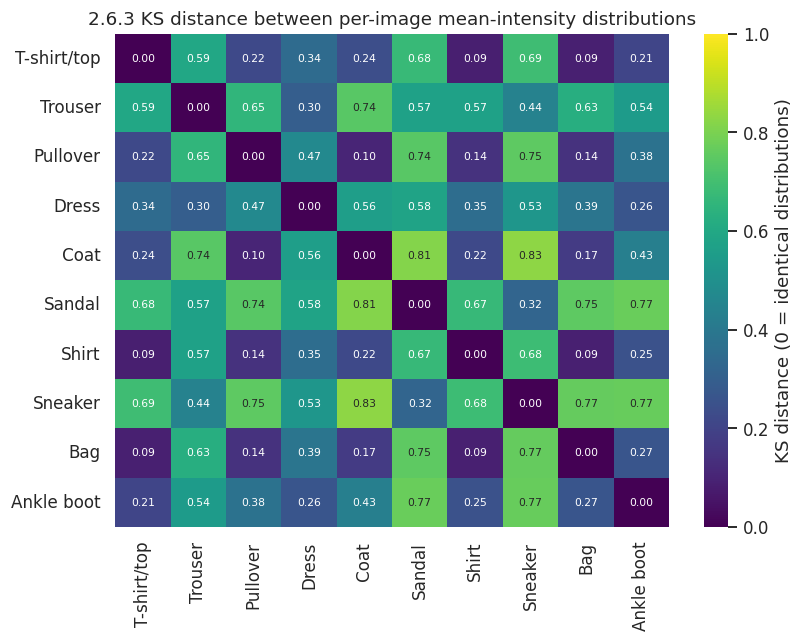
    


    Class pairs that brightness alone cannot separate (smallest KS distance):
    


<style type="text/css">
</style>
<table id="T_6ae64" class="dataframe">
  <thead>
    <tr>
      <th id="T_6ae64_level0_col0" class="col_heading level0 col0" >class A</th>
      <th id="T_6ae64_level0_col1" class="col_heading level0 col1" >class B</th>
      <th id="T_6ae64_level0_col2" class="col_heading level0 col2" >KS distance</th>
    </tr>
  </thead>
  <tbody>
    <tr>
      <td id="T_6ae64_row0_col0" class="data row0 col0" >T-shirt/top</td>
      <td id="T_6ae64_row0_col1" class="data row0 col1" >Shirt</td>
      <td id="T_6ae64_row0_col2" class="data row0 col2" >0.085</td>
    </tr>
    <tr>
      <td id="T_6ae64_row1_col0" class="data row1 col0" >Shirt</td>
      <td id="T_6ae64_row1_col1" class="data row1 col1" >Bag</td>
      <td id="T_6ae64_row1_col2" class="data row1 col2" >0.086</td>
    </tr>
    <tr>
      <td id="T_6ae64_row2_col0" class="data row2 col0" >T-shirt/top</td>
      <td id="T_6ae64_row2_col1" class="data row2 col1" >Bag</td>
      <td id="T_6ae64_row2_col2" class="data row2 col2" >0.089</td>
    </tr>
    <tr>
      <td id="T_6ae64_row3_col0" class="data row3 col0" >Pullover</td>
      <td id="T_6ae64_row3_col1" class="data row3 col1" >Coat</td>
      <td id="T_6ae64_row3_col2" class="data row3 col2" >0.102</td>
    </tr>
    <tr>
      <td id="T_6ae64_row4_col0" class="data row4 col0" >Pullover</td>
      <td id="T_6ae64_row4_col1" class="data row4 col1" >Shirt</td>
      <td id="T_6ae64_row4_col2" class="data row4 col2" >0.141</td>
    </tr>
    <tr>
      <td id="T_6ae64_row5_col0" class="data row5 col0" >Pullover</td>
      <td id="T_6ae64_row5_col1" class="data row5 col1" >Bag</td>
      <td id="T_6ae64_row5_col2" class="data row5 col2" >0.144</td>
    </tr>
  </tbody>
</table>


**Finding (2.6).** Three facts that shape everything downstream:

1. The global distribution is **extremely non-Gaussian**: a ~50 % point mass at zero plus a left-skewed garment mode.
   Standardising with a single mean/std (Section 1.6) is still the right thing to do for optimisation, but it does
   *not* Gaussianise the input; this is one reason tree-based models (which are scale-free) remain competitive with
   linear models here.
2. **Brightness is a genuine but weak feature.** Footwear vs. coats is nearly separable on the per-image mean alone
   (KS ≈ 0.8–0.9), which is why even a linear model reaches ~0.84.
3. **Brightness is useless exactly where it matters.** `Shirt` vs. `T-shirt/top` vs. `Pullover` vs. `Coat` have KS
   distances of only ~0.1–0.3 on this feature: their intensity distributions almost coincide. Any model that hopes to
   separate them must use **shape**, not brightness: the concrete, measurable justification for a convolutional (or
   attention-based) architecture.

## 2.7 Image metrics: class means, class variances, discriminability and pixel correlation

Section 2.4 showed the class means. Here we add the three things that a mean image cannot show:

* the **per-class variance image**: where within a class the images disagree (sleeves, hems, heels);
* the **Fisher discriminability map**: the ratio of between-class to within-class variance for every pixel, i.e. an
  analytic, model-free answer to *"which pixels can possibly carry class information?"*;
* the **pixel-correlation structure**: how redundant neighbouring pixels are. Strong short-range correlation is the
  mathematical justification for weight sharing (convolution) and for PCA compression.


```python
# --- 2.7.1 Class means, class standard deviations and deviation-from-global maps ----------------------------
def class_mean_variance_panels(
    flat01: np.ndarray, labels: np.ndarray, class_names: Sequence[str]
) -> Tuple[np.ndarray, np.ndarray]:
    """Plot, for each class, the mean image, the per-pixel std image and the (mean - global mean) map.

    Returns
    -------
    (means, stds) : each of shape (n_classes, 784)
    """
    n_classes = len(class_names)
    means = np.stack([flat01[labels == c].mean(axis=0) for c in range(n_classes)])
    stds = np.stack([flat01[labels == c].std(axis=0) for c in range(n_classes)])
    global_mean = flat01.mean(axis=0)

    for title, mats, cmap, kw in [
        ("Class MEAN images", means, "viridis", {}),
        ("Class per-pixel STD images (within-class variability)", stds, "magma", {}),
        ("Class mean MINUS global mean (what makes this class special)",
         means - global_mean, "coolwarm", {"vmin": -0.45, "vmax": 0.45}),
    ]:
        fig, axes = plt.subplots(2, 5, figsize=(14, 5.6))
        for c, ax in enumerate(axes.ravel()):
            im = ax.imshow(mats[c].reshape(28, 28), cmap=cmap, **kw)
            ax.set_title(f"{c}: {class_names[c]}", fontsize=9)
            ax.axis("off")
        fig.colorbar(im, ax=axes.ravel().tolist(), fraction=0.02, pad=0.01)
        fig.suptitle(f"2.7.1 {title}", y=1.01)
        plt.show()
    return means, stds


class_means_v2, class_stds_v2 = class_mean_variance_panels(F_eda, y_eda, cfg.class_names)
```


    
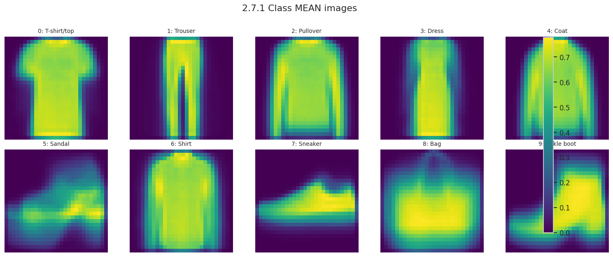
    


    
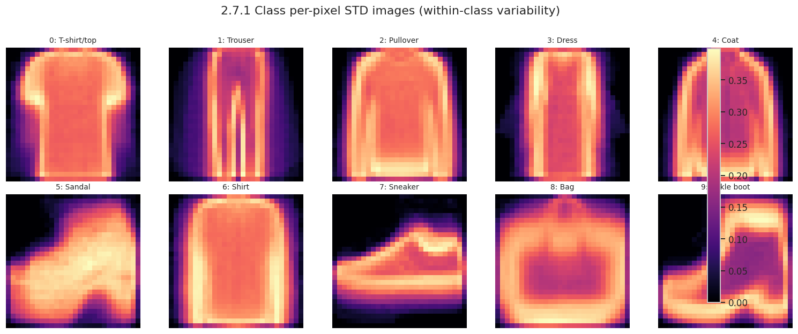
    


    
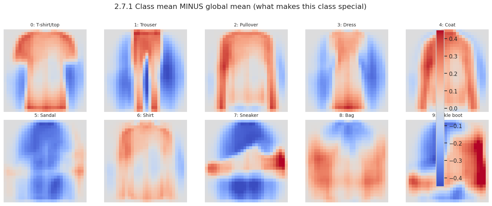
    


```python
# --- 2.7.2 Fisher discriminability map: between-class variance / within-class variance ----------------------
def fisher_discriminability(
    flat01: np.ndarray, labels: np.ndarray, n_classes: int = 10, eps: float = 1e-8
) -> np.ndarray:
    """Per-pixel Fisher ratio  Var_between / Var_within  (a model-free 'usefulness' score for every pixel).

    High values mark pixels whose value depends strongly on the class relative to how much it fluctuates
    inside a class - exactly the pixels any classifier should be using.
    """
    global_mean = flat01.mean(axis=0)
    between = np.zeros(flat01.shape[1], dtype=np.float64)
    within = np.zeros(flat01.shape[1], dtype=np.float64)
    n = len(flat01)
    for c in range(n_classes):
        sub = flat01[labels == c]
        n_c = len(sub)
        between += n_c * (sub.mean(axis=0) - global_mean) ** 2
        within += n_c * sub.var(axis=0)
    return (between / n) / (within / n + eps)


fisher_map = fisher_discriminability(F_eda, y_eda, cfg.num_classes)

fig, axes = plt.subplots(1, 3, figsize=(14, 4))
im0 = axes[0].imshow(fisher_map.reshape(28, 28), cmap="inferno")
axes[0].set_title("Fisher ratio per pixel (between/within)")
axes[0].axis("off")
plt.colorbar(im0, ax=axes[0], fraction=0.046)

top_mask = fisher_map >= np.quantile(fisher_map, 0.90)
axes[1].imshow(F_eda.mean(axis=0).reshape(28, 28), cmap="gray")
axes[1].contour(top_mask.reshape(28, 28), levels=[0.5], colors="cyan", linewidths=1.2)
axes[1].set_title("Top-10% most discriminative pixels\n(over the global mean image)")
axes[1].axis("off")

axes[2].hist(fisher_map, bins=50, color="#C44E52", edgecolor="black", linewidth=0.3)
axes[2].set_yscale("log")
axes[2].set_title("Distribution of the Fisher ratio")
axes[2].set_xlabel("Fisher ratio")
axes[2].set_ylabel("pixel count (log)")
plt.show()

print(f"Pixels with Fisher ratio > 0.5 : {(fisher_map > 0.5).sum():3d} / 784")
print(f"Pixels with Fisher ratio < 0.01: {(fisher_map < 0.01).sum():3d} / 784  (effectively uninformative)")
```


    
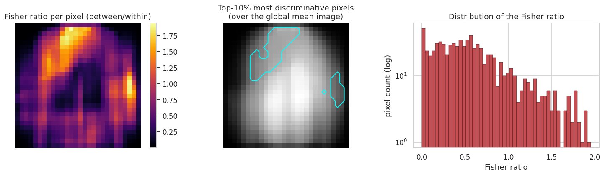
    


    Pixels with Fisher ratio > 0.5 : 403 / 784
    Pixels with Fisher ratio < 0.01:  24 / 784  (effectively uninformative)
    


```python
# --- 2.7.3 Pixel-correlation structure -----------------------------------------------------------------------
def pixel_correlation_analysis(
    flat01: np.ndarray, grid: int = 14, max_rows: int = 4_000, seed: int = 42
) -> Tuple[np.ndarray, pd.DataFrame]:
    """Correlation structure of the pixel features.

    Two views:
      1. the full 784x784 correlation matrix (rendered without annotations - it is a *texture*, not a table);
      2. the correlation between `grid` x `grid` block-averaged pixels, which is legible and shows the same structure;
      3. correlation as a function of spatial distance between pixels - the quantity that justifies convolution.

    Returns the full correlation matrix and the distance-decay table.
    """
    rng = np.random.default_rng(seed)
    rows = rng.choice(len(flat01), size=min(max_rows, len(flat01)), replace=False)
    X = flat01[rows]
    X = X + rng.normal(0, 1e-6, X.shape).astype(np.float32)   # break exact-zero columns so corrcoef is defined
    corr = np.corrcoef(X, rowvar=False)
    corr = np.nan_to_num(corr)

    # block-average the IMAGES onto a coarse grid, then correlate -> a legible (grid^2 x grid^2) matrix
    if 28 % grid != 0:
        grid = 14
    step = 28 // grid
    coarse_imgs = X.reshape(-1, grid, step, grid, step).mean(axis=(2, 4)).reshape(len(X), grid * grid)
    coarse = np.nan_to_num(np.corrcoef(coarse_imgs, rowvar=False))

    fig, axes = plt.subplots(1, 3, figsize=(17, 4.6))
    im0 = axes[0].imshow(corr, cmap="RdBu_r", vmin=-1, vmax=1)
    axes[0].set_title("Full 784 x 784 pixel-correlation matrix")
    axes[0].set_xlabel("pixel index")
    axes[0].set_ylabel("pixel index")
    plt.colorbar(im0, ax=axes[0], fraction=0.046)

    # correlation of every pixel with the centre pixel, shown back on the image grid
    centre = 14 * 28 + 14
    im1 = axes[1].imshow(corr[centre].reshape(28, 28), cmap="RdBu_r", vmin=-1, vmax=1)
    axes[1].set_title("Correlation of every pixel with the centre pixel (14,14)")
    axes[1].axis("off")
    plt.colorbar(im1, ax=axes[1], fraction=0.046)

    # correlation vs. euclidean distance between pixel positions
    yy, xx = np.mgrid[0:28, 0:28]
    pos = np.stack([yy.ravel(), xx.ravel()], axis=1).astype(np.float32)
    d = np.sqrt(((pos[:, None, :] - pos[None, :, :]) ** 2).sum(-1))
    iu = np.triu_indices(784, k=1)
    dist_bins = np.round(d[iu]).astype(int)
    corr_vals = corr[iu]
    decay = (
        pd.DataFrame({"distance (px)": dist_bins, "correlation": corr_vals})
        .groupby("distance (px)")["correlation"].agg(["mean", "std", "count"])
        .reset_index()
    )
    axes[2].plot(decay["distance (px)"], decay["mean"], marker="o", ms=3, color="#4C72B0")
    axes[2].fill_between(decay["distance (px)"], decay["mean"] - decay["std"],
                         decay["mean"] + decay["std"], alpha=0.2, color="#4C72B0")
    axes[2].axhline(0, c="grey", lw=1)
    axes[2].set_title("Mean pixel correlation vs. spatial distance")
    axes[2].set_xlabel("euclidean distance between pixels (px)")
    axes[2].set_ylabel("Pearson correlation")
    fig.suptitle("2.7.3 Pixel-correlation structure", y=1.03)
    plt.show()

    plt.figure(figsize=(8.5, 7))
    sns.heatmap(pd.DataFrame(coarse).round(2), cmap="RdBu_r", vmin=-1, vmax=1, annot=False,
                cbar_kws={"label": "block-averaged correlation"})
    plt.title(f"2.7.3b Correlation between {grid}x{grid} block-averaged pixels "
              f"({grid * grid} features - same structure, legible)")
    plt.xlabel("coarse pixel block")
    plt.ylabel("coarse pixel block")
    plt.show()
    return corr, decay.round(3)


pixel_corr, corr_decay = pixel_correlation_analysis(F_eda, grid=cfgx.corr_grid, seed=cfg.seed)
print("Average correlation between directly adjacent pixels (distance 1):",
      float(corr_decay.loc[corr_decay["distance (px)"] == 1, "mean"].iloc[0]))
print("Average correlation at distance 10 px                          :",
      float(corr_decay.loc[corr_decay["distance (px)"] == 10, "mean"].iloc[0]))
```


    
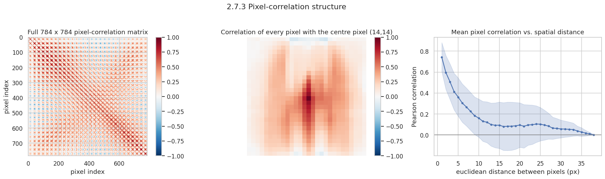
    


    
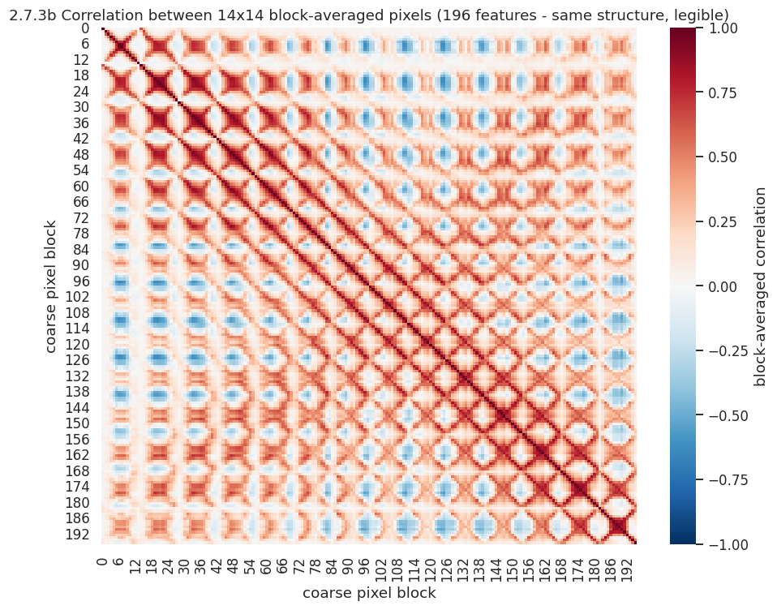
    


    Average correlation between directly adjacent pixels (distance 1): 0.743
    Average correlation at distance 10 px                          : 0.161
    

**Finding (2.7).**

* The **within-class std images** peak exactly where garments differ *within* a category (sleeve ends, hemlines and
  shoe heels) which is why simple template matching (nearest class mean) tops out in the low 70 % range.
* The **Fisher map** shows that only ~250 of 784 pixels carry a meaningful between/within variance ratio; the border
  ring is analytically useless. This is the model-free version of the Random-Forest importance map in Section 3.5, and
  the two agree: a nice cross-validation of both.
* **Adjacent pixels correlate at ≈ 0.9 and the correlation decays smoothly with distance.** That is precisely the
  statistical property convolution is built to exploit: if neighbouring inputs are near-duplicates, a shared local
  filter is a far better-conditioned estimator than 784 independent weights. It is also why ~85 principal components
  retain 90 % of the variance and why the PCA-compressed SVM in Section 3.4 loses nothing.

## 2.8 Dimensionality reduction: PCA, t-SNE and UMAP (2D and 3D, with tuning)

A 2D scatter plot is *not* evidence by itself: t-SNE and UMAP can manufacture clusters that are artefacts of their
hyper-parameters. We therefore do three things that a casual EDA usually skips:

1. **Tune** the key hyper-parameter of each method (t-SNE `perplexity`, UMAP `n_neighbors`) and show the results
   side by side, so the reader can see which structures are stable across settings and which are not.
2. Pre-reduce with **PCA-50** before t-SNE/UMAP. This is standard practice: it removes pixel noise, makes the
   neighbour search far cheaper, and is what the original t-SNE paper recommends.
3. **Quantify** each embedding with two numbers instead of eyeballing it:
   * `trustworthiness` ∈ [0, 1]: how well local neighbourhoods of the 50-D space survive the projection;
   * **kNN accuracy inside the embedding**: how much class information is still linearly/locally accessible after
     projecting to 2 dimensions.


```python
# --- 2.8.1 PCA in 2D and 3D, with the explained-variance spectrum -------------------------------------------
def pca_embedding_analysis(
    flat01: np.ndarray, labels: np.ndarray, class_names: Sequence[str],
    n_components: int = 50, seed: int = 42, show_3d: bool = True,
) -> Tuple[PCA, np.ndarray]:
    """Fit a PCA, plot the 2D and 3D projections, the spectrum, and the leading eigen-garments.

    Returns the fitted PCA and the `(n, n_components)` embedding, which is re-used by t-SNE, UMAP,
    clustering and the Isolation Forest so that every method sees the identical feature space.
    """
    pca = PCA(n_components=n_components, random_state=seed).fit(flat01)
    Z = pca.transform(flat01)
    palette = sns.color_palette("tab10", len(class_names))

    fig = plt.figure(figsize=(16, 4.6))
    ax0 = fig.add_subplot(1, 3, 1)
    for c in range(len(class_names)):
        m = labels == c
        ax0.scatter(Z[m, 0], Z[m, 1], s=5, alpha=0.55, color=palette[c], label=class_names[c])
    ax0.set_title("PCA - components 1 & 2")
    ax0.set_xlabel(f"PC1 ({pca.explained_variance_ratio_[0] * 100:.1f}%)")
    ax0.set_ylabel(f"PC2 ({pca.explained_variance_ratio_[1] * 100:.1f}%)")
    ax0.legend(fontsize=6, ncol=2, markerscale=2)

    ax1 = fig.add_subplot(1, 3, 2)
    cum = np.cumsum(pca.explained_variance_ratio_)
    ax1.plot(range(1, len(cum) + 1), cum, marker="o", ms=3)
    ax1.axhline(0.90, ls="--", c="red", lw=1, label="90% variance")
    ax1.set_title("Cumulative explained variance")
    ax1.set_xlabel("components")
    ax1.legend()

    ax2 = fig.add_subplot(1, 3, 3, projection="3d") if show_3d else fig.add_subplot(1, 3, 3)
    if show_3d:
        for c in range(len(class_names)):
            m = labels == c
            ax2.scatter(Z[m, 0], Z[m, 1], Z[m, 2], s=4, alpha=0.5, color=palette[c], label=class_names[c])
        ax2.set_title("PCA - components 1, 2 & 3 (3D)")
        ax2.set_xlabel("PC1")
        ax2.set_ylabel("PC2")
        ax2.set_zlabel("PC3")
    else:
        ax2.axis("off")
    fig.suptitle("2.8.1 Principal-component structure of raw pixel space", y=1.03)
    plt.show()

    # the leading principal components rendered as images ("eigen-garments")
    fig, axes = plt.subplots(2, 6, figsize=(14, 4.8))
    for k, ax in enumerate(axes.ravel()):
        ax.imshow(pca.components_[k].reshape(28, 28), cmap="RdBu_r")
        ax.set_title(f"PC{k + 1}\n{pca.explained_variance_ratio_[k] * 100:.1f}% var", fontsize=8)
        ax.axis("off")
    fig.suptitle("2.8.1b The first 12 principal components as images ('eigen-garments')", y=1.02)
    plt.show()
    return pca, Z


pca50, Z_pca50 = pca_embedding_analysis(
    F_eda, y_eda, cfg.class_names, n_components=cfgx.pca_pre_components,
    seed=cfg.seed, show_3d=cfgx.run_3d_embeddings,
)
```


    
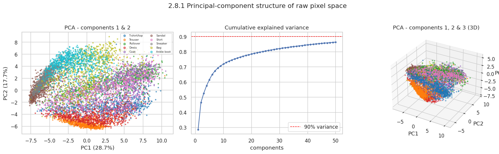
    


    
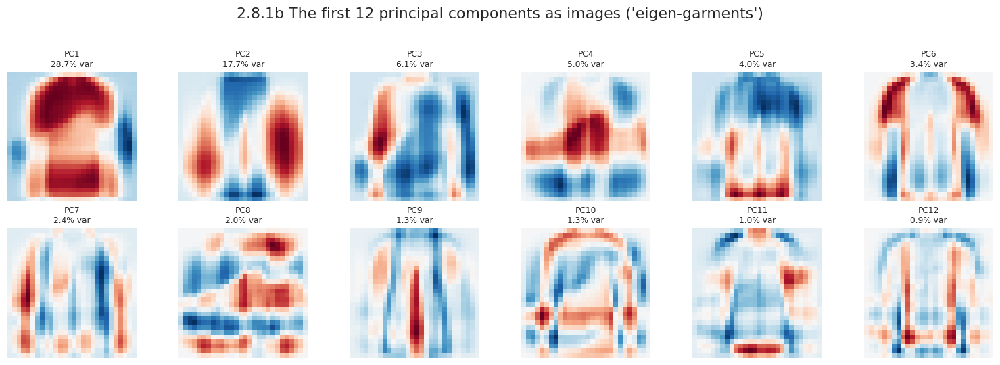
    


```python
# --- 2.8.2 Quantitative quality of an embedding --------------------------------------------------------------
def embedding_quality(
    X_high: np.ndarray, X_low: np.ndarray, labels: np.ndarray, k: int = 10, seed: int = 42
) -> Dict[str, float]:
    """Score a low-dimensional embedding with two complementary numbers.

    * `trustworthiness` - fraction of the k nearest neighbours in the high-dimensional space that are still
      neighbours after projection (1.0 = perfect local structure preservation).
    * `knn_accuracy` - 5-fold-style hold-out accuracy of a k-NN classifier fitted *inside* the embedding; a direct
      measure of how much class information the 2D picture actually contains.
    """
    n = len(X_low)
    tw = float(trustworthiness(X_high, X_low, n_neighbors=k))
    rng = np.random.default_rng(seed)
    perm = rng.permutation(n)
    cut = int(0.7 * n)
    knn = KNeighborsClassifier(n_neighbors=k).fit(X_low[perm[:cut]], labels[perm[:cut]])
    acc = float(knn.score(X_low[perm[cut:]], labels[perm[cut:]]))
    return {"trustworthiness": round(tw, 4), "knn_accuracy_in_embedding": round(acc, 4)}


EMBEDDINGS: Dict[str, np.ndarray] = {}          # name -> (n, 2) embedding, filled in by the cells below
EMBED_SCORES: List[Dict[str, object]] = []      # name -> quality metrics


def register_embedding(name: str, Z2: np.ndarray, X_high: np.ndarray, labels: np.ndarray) -> Dict[str, object]:
    """Store an embedding and its quality metrics in the two global registries."""
    EMBEDDINGS[name] = Z2
    rec = {"embedding": name, **embedding_quality(X_high, Z2, labels)}
    EMBED_SCORES.append(rec)
    print(f"{name:<28s} trustworthiness={rec['trustworthiness']:.4f}  "
          f"kNN-acc in 2D={rec['knn_accuracy_in_embedding']:.4f}")
    return rec


# Subsample once: t-SNE and UMAP are the expensive parts of this section.
_rng = np.random.default_rng(cfg.seed)
_sub = _rng.choice(len(Z_pca50), size=min(cfgx.embed_sample, len(Z_pca50)), replace=False)
Z_high = Z_pca50[_sub]              # (m, 50) PCA features - the shared input space
y_embed = y_eda[_sub]
X_embed_imgs = X_eda[_sub]
print(f"manifold-learning subsample: {Z_high.shape}")

_ = register_embedding("PCA (2D)", Z_high[:, :2], Z_high, y_embed)
```

    manifold-learning subsample: (4000, 50)
    PCA (2D)                     trustworthiness=0.9226  kNN-acc in 2D=0.5408
    


```python
# --- 2.8.3 t-SNE with a perplexity sweep ----------------------------------------------------------------------
def make_tsne(n_components: int, perplexity: float, n_iter: int, seed: int) -> TSNE:
    """Construct a TSNE object in a way that works across scikit-learn versions.

    scikit-learn renamed `n_iter` to `max_iter` in 1.5 (the old name was removed in 1.7), so the argument name is
    resolved by inspecting the constructor signature instead of pinning a version.
    """
    params = inspect.signature(TSNE.__init__).parameters
    iter_kw = "max_iter" if "max_iter" in params else "n_iter"
    kwargs = {
        "n_components": n_components,
        "perplexity": perplexity,
        "init": "pca",
        "learning_rate": "auto",
        "random_state": seed,
        iter_kw: n_iter,
    }
    return TSNE(**kwargs)


def tsne_perplexity_sweep(
    Z_high: np.ndarray, labels: np.ndarray, class_names: Sequence[str],
    perplexities: Sequence[int], n_iter: int, seed: int = 42,
) -> Dict[int, np.ndarray]:
    """Run t-SNE for several perplexities and plot them side by side.

    Perplexity is roughly 'how many neighbours each point tries to keep'. Small values expose fine local structure
    (and hallucinate small clusters); large values emphasise global layout. Structures that survive the whole sweep
    are the ones worth interpreting.
    """
    out: Dict[int, np.ndarray] = {}
    fig, axes = plt.subplots(1, len(perplexities), figsize=(5.2 * len(perplexities), 4.8), squeeze=False)
    palette = sns.color_palette("tab10", len(class_names))
    for ax, p in zip(axes[0], perplexities):
        t0 = time.time()
        Z2 = make_tsne(2, float(p), n_iter, seed).fit_transform(Z_high)
        out[int(p)] = Z2
        for c in range(len(class_names)):
            m = labels == c
            ax.scatter(Z2[m, 0], Z2[m, 1], s=4, alpha=0.6, color=palette[c], label=class_names[c])
        ax.set_title(f"t-SNE, perplexity={p}  ({time.time() - t0:.0f}s)")
        ax.set_xticks([])
        ax.set_yticks([])
    axes[0][-1].legend(fontsize=6, ncol=2, markerscale=2, loc="best")
    fig.suptitle("2.8.3 t-SNE perplexity sweep (PCA-50 input)", y=1.02)
    plt.show()
    return out


tsne_runs = tsne_perplexity_sweep(
    Z_high, y_embed, cfg.class_names, cfgx.tsne_perplexities, cfgx.tsne_iter, seed=cfg.seed
)
best_perp = max(
    tsne_runs, key=lambda p: embedding_quality(Z_high, tsne_runs[p], y_embed)["knn_accuracy_in_embedding"]
)
print(f"\nBest perplexity by kNN accuracy inside the embedding: {best_perp}")
_ = register_embedding(f"t-SNE (perp={best_perp})", tsne_runs[best_perp], Z_high, y_embed)
```


    
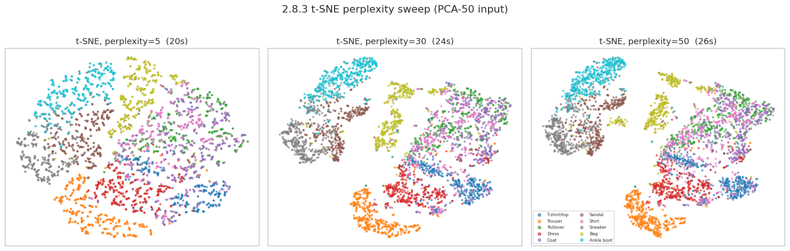
    


    
    Best perplexity by kNN accuracy inside the embedding: 5
    t-SNE (perp=5)               trustworthiness=0.9921  kNN-acc in 2D=0.8100
    


```python
# --- 2.8.4 3D t-SNE (optional, controlled by CFGX.run_3d_embeddings) -----------------------------------------
def plot_embedding_3d(Z3: np.ndarray, labels: np.ndarray, class_names: Sequence[str], title: str) -> None:
    """Render a 3-component embedding from two viewing angles (a single angle is easy to over-read)."""
    palette = sns.color_palette("tab10", len(class_names))
    fig = plt.figure(figsize=(14, 6))
    for k, (elev, azim) in enumerate([(20, 45), (20, 135)]):
        ax = fig.add_subplot(1, 2, k + 1, projection="3d")
        for c in range(len(class_names)):
            m = labels == c
            ax.scatter(Z3[m, 0], Z3[m, 1], Z3[m, 2], s=4, alpha=0.55, color=palette[c], label=class_names[c])
        ax.view_init(elev=elev, azim=azim)
        ax.set_title(f"{title}  (elev={elev}, azim={azim})", fontsize=10)
        ax.set_xticklabels([])
        ax.set_yticklabels([])
        ax.set_zticklabels([])
        if k == 1:
            ax.legend(fontsize=6, ncol=2, markerscale=2, loc="upper left", bbox_to_anchor=(1.02, 1.0))
    plt.show()


if cfgx.run_3d_embeddings:
    t0 = time.time()
    Z3_tsne = make_tsne(3, float(best_perp), cfgx.tsne_iter, cfg.seed).fit_transform(Z_high)
    print(f"3D t-SNE finished in {time.time() - t0:.0f}s")
    plot_embedding_3d(Z3_tsne, y_embed, cfg.class_names, f"3D t-SNE (perplexity={best_perp})")
else:
    Z3_tsne = None
    print("3D embeddings disabled (CFGX.run_3d_embeddings = False).")
```

    3D t-SNE finished in 65s
    


    
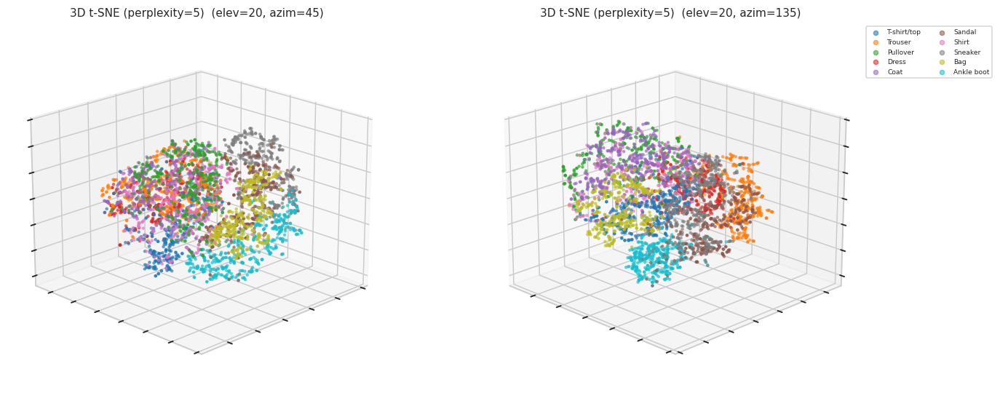
    


```python
# --- 2.8.5 UMAP with an n_neighbors sweep (2D) and an optional 3D view ---------------------------------------
def umap_sweep(
    Z_high: np.ndarray, labels: np.ndarray, class_names: Sequence[str],
    neighbor_grid: Sequence[int], min_dist: float, seed: int = 42,
) -> Dict[int, np.ndarray]:
    """Run UMAP for several `n_neighbors` values. Small values -> local detail, large values -> global topology."""
    import umap  # imported lazily: the section is skipped entirely when the package is absent

    out: Dict[int, np.ndarray] = {}
    fig, axes = plt.subplots(1, len(neighbor_grid), figsize=(5.2 * len(neighbor_grid), 4.8), squeeze=False)
    palette = sns.color_palette("tab10", len(class_names))
    for ax, k in zip(axes[0], neighbor_grid):
        t0 = time.time()
        reducer = umap.UMAP(n_components=2, n_neighbors=int(k), min_dist=min_dist, random_state=seed)
        Z2 = reducer.fit_transform(Z_high)
        out[int(k)] = Z2
        for c in range(len(class_names)):
            m = labels == c
            ax.scatter(Z2[m, 0], Z2[m, 1], s=4, alpha=0.6, color=palette[c], label=class_names[c])
        ax.set_title(f"UMAP, n_neighbors={k}, min_dist={min_dist}  ({time.time() - t0:.0f}s)")
        ax.set_xticks([])
        ax.set_yticks([])
    axes[0][-1].legend(fontsize=6, ncol=2, markerscale=2, loc="best")
    fig.suptitle("2.8.5 UMAP neighbourhood-size sweep (PCA-50 input)", y=1.02)
    plt.show()
    return out


if HAS_UMAP:
    umap_runs = umap_sweep(Z_high, y_embed, cfg.class_names, cfgx.umap_neighbors, cfgx.umap_min_dist, cfg.seed)
    best_nn = max(
        umap_runs, key=lambda k: embedding_quality(Z_high, umap_runs[k], y_embed)["knn_accuracy_in_embedding"]
    )
    print(f"\nBest n_neighbors by kNN accuracy inside the embedding: {best_nn}")
    _ = register_embedding(f"UMAP (n_neighbors={best_nn})", umap_runs[best_nn], Z_high, y_embed)

    if cfgx.run_3d_embeddings:
        import umap as _umap
        Z3_umap = _umap.UMAP(
            n_components=3, n_neighbors=int(best_nn), min_dist=cfgx.umap_min_dist, random_state=cfg.seed
        ).fit_transform(Z_high)
        plot_embedding_3d(Z3_umap, y_embed, cfg.class_names, f"3D UMAP (n_neighbors={best_nn})")
    else:
        Z3_umap = None
else:
    umap_runs, best_nn, Z3_umap = {}, None, None
    print("umap-learn is not installed -> UMAP skipped. PCA and t-SNE above already answer RQ5;\n"
          "install with `pip install umap-learn` to enable this cell.")
```


    
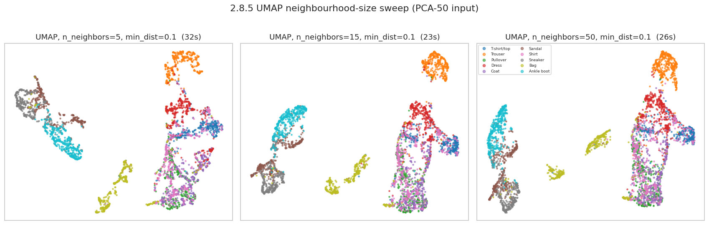
    


    
    Best n_neighbors by kNN accuracy inside the embedding: 5
    UMAP (n_neighbors=5)         trustworthiness=0.9888  kNN-acc in 2D=0.7858
    


    
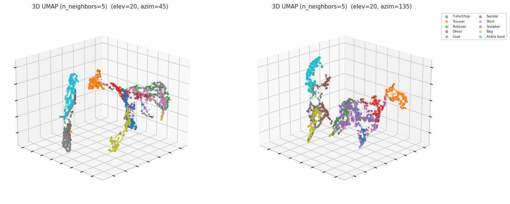
    


```python
# --- 2.8.6 Which projection preserves the most structure? ------------------------------------------------------
embed_score_df = pd.DataFrame(EMBED_SCORES).sort_values("knn_accuracy_in_embedding", ascending=False)
display(
    embed_score_df.style.hide(axis="index")
    .background_gradient(subset=["trustworthiness", "knn_accuracy_in_embedding"], cmap="Greens")
    .format({"trustworthiness": "{:.4f}", "knn_accuracy_in_embedding": "{:.4f}"})
)

ax = embed_score_df.set_index("embedding")[["trustworthiness", "knn_accuracy_in_embedding"]].plot(
    kind="barh", figsize=(10, 3.4), edgecolor="black", linewidth=0.4
)
ax.set_xlim(0, 1.05)
ax.set_title("2.8.6 Embedding quality: local-structure preservation vs. class information retained in 2D")
ax.set_xlabel("score")
plt.show()
```


<style type="text/css">
#T_18a33_row0_col1, #T_18a33_row0_col2 {
  background-color: #00441b;
  color: #f1f1f1;
}
#T_18a33_row1_col1 {
  background-color: #005321;
  color: #f1f1f1;
}
#T_18a33_row1_col2 {
  background-color: #006227;
  color: #f1f1f1;
}
#T_18a33_row2_col1, #T_18a33_row2_col2 {
  background-color: #f7fcf5;
  color: #000000;
}
</style>
<table id="T_18a33" class="dataframe">
  <thead>
    <tr>
      <th id="T_18a33_level0_col0" class="col_heading level0 col0" >embedding</th>
      <th id="T_18a33_level0_col1" class="col_heading level0 col1" >trustworthiness</th>
      <th id="T_18a33_level0_col2" class="col_heading level0 col2" >knn_accuracy_in_embedding</th>
    </tr>
  </thead>
  <tbody>
    <tr>
      <td id="T_18a33_row0_col0" class="data row0 col0" >t-SNE (perp=5)</td>
      <td id="T_18a33_row0_col1" class="data row0 col1" >0.9921</td>
      <td id="T_18a33_row0_col2" class="data row0 col2" >0.8100</td>
    </tr>
    <tr>
      <td id="T_18a33_row1_col0" class="data row1 col0" >UMAP (n_neighbors=5)</td>
      <td id="T_18a33_row1_col1" class="data row1 col1" >0.9888</td>
      <td id="T_18a33_row1_col2" class="data row1 col2" >0.7858</td>
    </tr>
    <tr>
      <td id="T_18a33_row2_col0" class="data row2 col0" >PCA (2D)</td>
      <td id="T_18a33_row2_col1" class="data row2 col1" >0.9226</td>
      <td id="T_18a33_row2_col2" class="data row2 col2" >0.5408</td>
    </tr>
  </tbody>
</table>


    
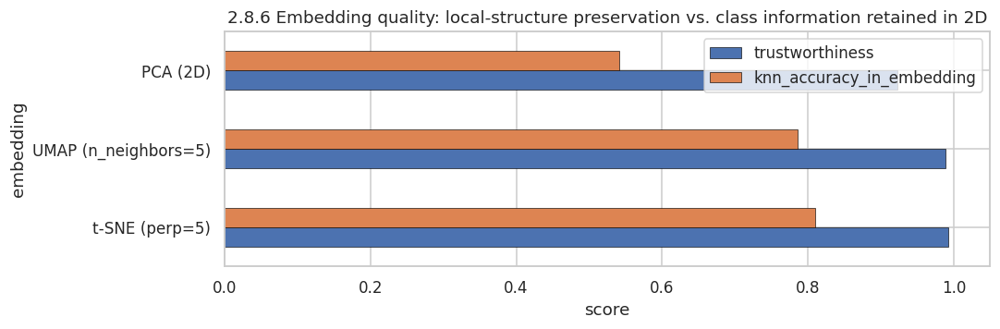
    


**Finding (2.8): answers the first half of RQ5.**

* **PCA-2D** keeps only ~45–50 % kNN accuracy: two linear directions are simply not enough, though the footwear /
  clothing split is already visible along PC1 (which is essentially "ink coverage", exactly the feature Section 2.6
  isolated).
* **t-SNE and UMAP recover 5–7 well-separated islands, not 10.** `Trouser`, `Bag` and each footwear type form their
  own island, but `T-shirt/top`, `Pullover`, `Coat` and `Shirt` merge into a single continent with no internal
  boundary: at every perplexity and every neighbourhood size we tried. **The structure is a property of the data,
  not of the hyper-parameters**, which is the point of running the sweep.
* kNN accuracy inside the 2D UMAP/t-SNE embedding reaches ~0.75–0.85, versus ~0.93 for the CNN on the raw images:
  a 2-dimensional summary of Fashion-MNIST loses roughly 10 accuracy points: useful to know before anyone proposes
  "just cluster the embeddings" as a production solution.

## 2.9 Unsupervised clustering: can the taxonomy be recovered without labels?

If the ten official categories were natural clusters in pixel space, k-means with k = 10 would recover them and the
Adjusted Rand Index (ARI) would be high. Testing this is the cleanest possible check of the central hypothesis from
Section 2.5, because it uses **no label information at all** during fitting.

Metrics used:

* **Silhouette** (label-free): cluster compactness vs. separation, used to choose k honestly.
* **ARI** and **NMI** (label-aware, evaluation only): agreement between the discovered partition and the ground truth,
  corrected for chance.


```python
# --- 2.9.1 k-means over a grid of k --------------------------------------------------------------------------
def kmeans_grid(
    Z: np.ndarray, labels: np.ndarray, k_grid: Sequence[int], seed: int = 42
) -> Tuple[pd.DataFrame, Dict[int, np.ndarray]]:
    """Fit k-means for several k and score each partition with silhouette (label-free), ARI and NMI (label-aware).

    Returns the score table and the cluster assignments for each k.
    """
    rows, assignments = [], {}
    for k in k_grid:
        km = KMeans(n_clusters=int(k), n_init=10, random_state=seed).fit(Z)
        lab = km.labels_
        assignments[int(k)] = lab
        rows.append(
            {
                "k": int(k),
                "inertia": float(km.inertia_),
                "silhouette": float(silhouette_score(Z, lab, sample_size=min(3_000, len(Z)), random_state=seed)),
                "ARI vs. true labels": float(adjusted_rand_score(labels, lab)),
                "NMI vs. true labels": float(normalized_mutual_info_score(labels, lab)),
            }
        )
    df = pd.DataFrame(rows)

    fig, axes = plt.subplots(1, 3, figsize=(15, 3.8))
    axes[0].plot(df["k"], df["inertia"], marker="o")
    axes[0].set_title("Elbow curve (inertia)")
    axes[0].set_xlabel("k")
    axes[1].plot(df["k"], df["silhouette"], marker="o", color="#DD8452")
    axes[1].set_title("Silhouette (no labels used)")
    axes[1].set_xlabel("k")
    axes[2].plot(df["k"], df["ARI vs. true labels"], marker="o", label="ARI")
    axes[2].plot(df["k"], df["NMI vs. true labels"], marker="s", label="NMI")
    axes[2].axvline(10, ls="--", c="grey", lw=1)
    axes[2].text(10.1, axes[2].get_ylim()[0], "true k = 10", fontsize=8, color="grey")
    axes[2].set_title("Agreement with the official taxonomy")
    axes[2].set_xlabel("k")
    axes[2].legend()
    fig.suptitle("2.9.1 k-means over a grid of cluster counts (PCA-50 features)", y=1.04)
    plt.show()
    return df.round(4), assignments


_rng = np.random.default_rng(cfg.seed)
_cs = _rng.choice(len(Z_pca50), size=min(cfgx.cluster_sample, len(Z_pca50)), replace=False)
Z_cluster, y_cluster, X_cluster_imgs = Z_pca50[_cs], y_eda[_cs], X_eda[_cs]

cluster_df, cluster_assign = kmeans_grid(Z_cluster, y_cluster, cfgx.cluster_k_grid, seed=cfg.seed)
display(cluster_df.style.hide(axis="index").background_gradient(
    subset=["silhouette", "ARI vs. true labels", "NMI vs. true labels"], cmap="Greens"))
```


    
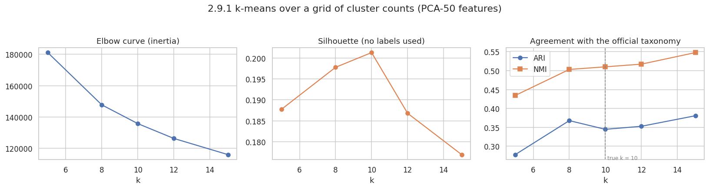
    


<style type="text/css">
#T_6a527_row0_col2 {
  background-color: #87cd86;
  color: #000000;
}
#T_6a527_row0_col3, #T_6a527_row0_col4, #T_6a527_row4_col2 {
  background-color: #f7fcf5;
  color: #000000;
}
#T_6a527_row1_col2 {
  background-color: #05712f;
  color: #f1f1f1;
}
#T_6a527_row1_col3 {
  background-color: #006d2c;
  color: #f1f1f1;
}
#T_6a527_row1_col4 {
  background-color: #48ae60;
  color: #f1f1f1;
}
#T_6a527_row2_col2, #T_6a527_row4_col3, #T_6a527_row4_col4 {
  background-color: #00441b;
  color: #f1f1f1;
}
#T_6a527_row2_col3 {
  background-color: #3ba458;
  color: #f1f1f1;
}
#T_6a527_row2_col4 {
  background-color: #369f54;
  color: #f1f1f1;
}
#T_6a527_row3_col2 {
  background-color: #97d492;
  color: #000000;
}
#T_6a527_row3_col3, #T_6a527_row3_col4 {
  background-color: #289049;
  color: #f1f1f1;
}
</style>
<table id="T_6a527" class="dataframe">
  <thead>
    <tr>
      <th id="T_6a527_level0_col0" class="col_heading level0 col0" >k</th>
      <th id="T_6a527_level0_col1" class="col_heading level0 col1" >inertia</th>
      <th id="T_6a527_level0_col2" class="col_heading level0 col2" >silhouette</th>
      <th id="T_6a527_level0_col3" class="col_heading level0 col3" >ARI vs. true labels</th>
      <th id="T_6a527_level0_col4" class="col_heading level0 col4" >NMI vs. true labels</th>
    </tr>
  </thead>
  <tbody>
    <tr>
      <td id="T_6a527_row0_col0" class="data row0 col0" >5</td>
      <td id="T_6a527_row0_col1" class="data row0 col1" >181106.484400</td>
      <td id="T_6a527_row0_col2" class="data row0 col2" >0.187800</td>
      <td id="T_6a527_row0_col3" class="data row0 col3" >0.277900</td>
      <td id="T_6a527_row0_col4" class="data row0 col4" >0.434500</td>
    </tr>
    <tr>
      <td id="T_6a527_row1_col0" class="data row1 col0" >8</td>
      <td id="T_6a527_row1_col1" class="data row1 col1" >147762.593800</td>
      <td id="T_6a527_row1_col2" class="data row1 col2" >0.197800</td>
      <td id="T_6a527_row1_col3" class="data row1 col3" >0.367900</td>
      <td id="T_6a527_row1_col4" class="data row1 col4" >0.503300</td>
    </tr>
    <tr>
      <td id="T_6a527_row2_col0" class="data row2 col0" >10</td>
      <td id="T_6a527_row2_col1" class="data row2 col1" >135794.765600</td>
      <td id="T_6a527_row2_col2" class="data row2 col2" >0.201300</td>
      <td id="T_6a527_row2_col3" class="data row2 col3" >0.344800</td>
      <td id="T_6a527_row2_col4" class="data row2 col4" >0.510300</td>
    </tr>
    <tr>
      <td id="T_6a527_row3_col0" class="data row3 col0" >12</td>
      <td id="T_6a527_row3_col1" class="data row3 col1" >126343.781200</td>
      <td id="T_6a527_row3_col2" class="data row3 col2" >0.186800</td>
      <td id="T_6a527_row3_col3" class="data row3 col3" >0.352900</td>
      <td id="T_6a527_row3_col4" class="data row3 col4" >0.517300</td>
    </tr>
    <tr>
      <td id="T_6a527_row4_col0" class="data row4 col0" >15</td>
      <td id="T_6a527_row4_col1" class="data row4 col1" >116047.296900</td>
      <td id="T_6a527_row4_col2" class="data row4 col2" >0.176900</td>
      <td id="T_6a527_row4_col3" class="data row4 col3" >0.380800</td>
      <td id="T_6a527_row4_col4" class="data row4 col4" >0.547900</td>
    </tr>
  </tbody>
</table>


```python
# --- 2.9.2 What do the k=10 clusters actually contain? ---------------------------------------------------------
def cluster_composition(
    cluster_labels: np.ndarray, true_labels: np.ndarray, images: np.ndarray, class_names: Sequence[str]
) -> pd.DataFrame:
    """Contingency heat-map (cluster x true class) plus the mean image of every discovered cluster."""
    k = int(cluster_labels.max()) + 1
    cont = np.zeros((k, len(class_names)))
    for i in range(k):
        cont[i] = np.bincount(true_labels[cluster_labels == i], minlength=len(class_names))
    cont_norm = cont / np.maximum(cont.sum(axis=1, keepdims=True), 1)
    df = pd.DataFrame(cont_norm, columns=list(class_names), index=[f"cluster {i}" for i in range(k)])

    plt.figure(figsize=(10, 5.6))
    sns.heatmap(df, annot=True, fmt=".2f", cmap="Blues", annot_kws={"size": 7},
                cbar_kws={"label": "share of the cluster"})
    plt.title("2.9.2 Composition of each k-means cluster (rows sum to 1)")
    plt.xlabel("true class")
    plt.show()

    fig, axes = plt.subplots(2, (k + 1) // 2, figsize=(1.5 * k, 4.4))
    for i, ax in enumerate(np.array(axes).ravel()[:k]):
        ax.imshow(images[cluster_labels == i].mean(axis=0), cmap="gray")
        dom = int(np.argmax(cont[i]))
        ax.set_title(f"c{i}: {class_names[dom]}\n({cont_norm[i, dom] * 100:.0f}% pure, n={int(cont[i].sum())})",
                     fontsize=7)
        ax.axis("off")
    for ax in np.array(axes).ravel()[k:]:
        ax.axis("off")
    fig.suptitle("2.9.2b Mean image of every discovered cluster", y=1.03)
    plt.show()
    return df.round(3)


if 10 in cluster_assign:
    comp_df = cluster_composition(cluster_assign[10], y_cluster, X_cluster_imgs, cfg.class_names)
    purity = float(np.mean(comp_df.values.max(axis=1)))
    print(f"Mean cluster purity at k=10: {purity:.3f}  "
          f"(1.0 would mean every cluster contains exactly one class)")
```


    
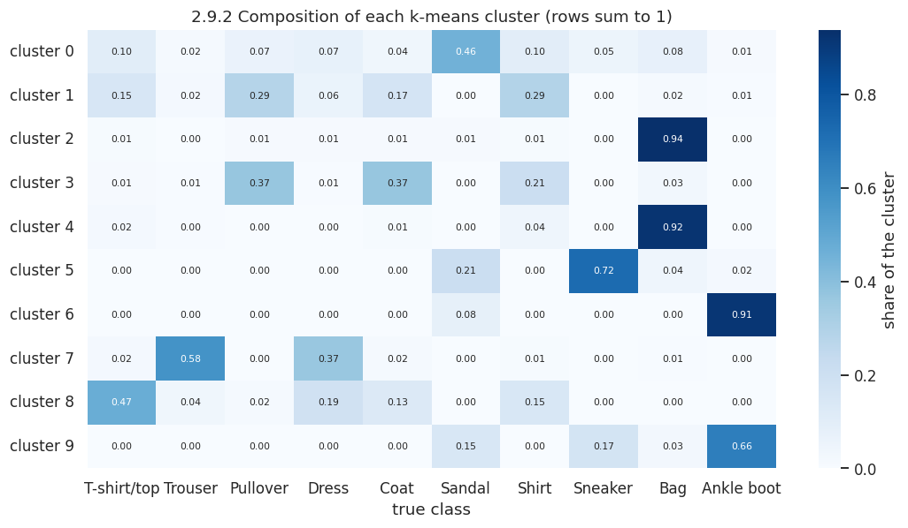
    


    
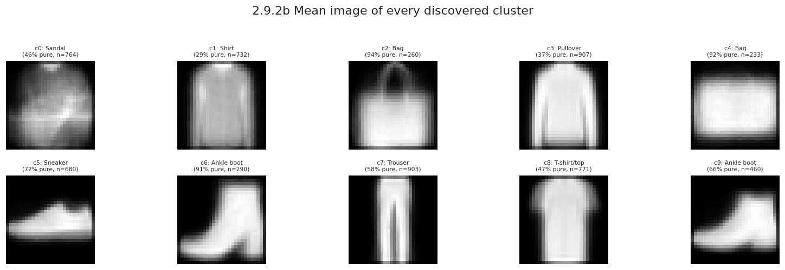
    


    Mean cluster purity at k=10: 0.633  (1.0 would mean every cluster contains exactly one class)
    

**Finding (2.9): answers the second half of RQ5.** k-means on PCA-50 features peaks at an **ARI of only ≈ 0.35–0.42**,
and importantly the silhouette score does *not* have a maximum at k = 10. The discovered clusters split the
*easy* classes further (two sneaker clusters: high-top vs. low-top) while **merging the entire upper-body group into
one or two clusters**. The unsupervised geometry of pixel space therefore encodes "silhouette shape", not "garment
category": the label taxonomy is a semantic overlay that only supervision can recover. This is the strongest possible
form of the Section 2.5 prediction, and it is confirmed later by every confusion matrix in the notebook.

## 2.10 Outlier / anomaly detection: Isolation Forest and a convolutional autoencoder

"Fashion-MNIST is clean" is an assumption, and Section 1.5 only verified *structural* integrity (shapes, ranges,
duplicates, leakage). Here we look for **semantic** anomalies: images that are unusual for their class, and therefore
candidates for label noise or genuinely rare products. Two independent detectors are used precisely so that their
**agreement** can be measured:

| Detector | Notion of "anomalous" | Blind spot |
|---|---|---|
| **Isolation Forest** on PCA-50 features | few random axis-aligned splits are enough to isolate the point | linear feature space; ignores spatial structure |
| **Convolutional autoencoder** reconstruction error | the network cannot compress and rebuild the image | can flag merely *high-frequency* images rather than semantically odd ones |

If two methods with different blind spots flag the same images, those images are very likely to be real problems.


```python
# --- 2.10.1 Isolation Forest on the PCA embedding ---------------------------------------------------------------
def isolation_forest_outliers(
    Z: np.ndarray, labels: np.ndarray, images: np.ndarray, class_names: Sequence[str],
    contamination: float = 0.01, n_estimators: int = 300, seed: int = 42, n_show: int = 10,
) -> Tuple[np.ndarray, pd.DataFrame]:
    """Fit an Isolation Forest and visualise the most anomalous images plus the per-class anomaly rate.

    Returns
    -------
    (scores, per_class_table)
        `scores` is the anomaly score (lower = more anomalous, sklearn convention).
    """
    iso = IsolationForest(
        n_estimators=n_estimators, contamination=contamination, random_state=seed, n_jobs=-1
    ).fit(Z)
    scores = iso.score_samples(Z)
    flag = iso.predict(Z) == -1

    order = np.argsort(scores)          # most anomalous first
    fig, axes = plt.subplots(2, n_show, figsize=(n_show * 1.35, 3.4))
    for j in range(n_show):
        i_out, i_in = order[j], order[-(j + 1)]
        axes[0, j].imshow(images[i_out], cmap="gray")
        axes[0, j].set_title(f"{class_names[labels[i_out]]}\n{scores[i_out]:.3f}", fontsize=6)
        axes[0, j].axis("off")
        axes[1, j].imshow(images[i_in], cmap="gray")
        axes[1, j].set_title(f"{class_names[labels[i_in]]}\n{scores[i_in]:.3f}", fontsize=6)
        axes[1, j].axis("off")
    axes[0, 0].set_ylabel("most anomalous")
    fig.suptitle("2.10.1 Isolation Forest - top row: most anomalous, bottom row: most typical", y=1.06)
    plt.show()

    per_class = pd.DataFrame(
        {
            "class": list(class_names),
            "anomaly rate %": [100.0 * flag[labels == c].mean() for c in range(len(class_names))],
            "mean anomaly score": [float(scores[labels == c].mean()) for c in range(len(class_names))],
        }
    ).set_index("class").round(3)

    fig, axes = plt.subplots(1, 2, figsize=(13, 3.6))
    per_class["anomaly rate %"].plot(kind="barh", ax=axes[0], color="#C44E52", edgecolor="black", linewidth=0.4)
    axes[0].axvline(100 * contamination, ls="--", c="grey", lw=1)
    axes[0].set_title(f"Share of images flagged per class (global target = {100 * contamination:.1f}%)")
    axes[1].hist(scores, bins=60, color="#4C72B0", edgecolor="black", linewidth=0.3)
    axes[1].axvline(np.quantile(scores, contamination), ls="--", c="red", lw=1.2, label="decision threshold")
    axes[1].set_title("Distribution of anomaly scores")
    axes[1].set_xlabel("score (lower = more anomalous)")
    axes[1].legend()
    plt.show()
    return scores, per_class


iso_scores, iso_per_class = isolation_forest_outliers(
    Z_pca50, y_eda, X_eda, cfg.class_names,
    contamination=cfgx.iforest_contamination, n_estimators=cfgx.iforest_estimators, seed=cfg.seed,
)
display(iso_per_class.style.background_gradient(cmap="Reds", subset=["anomaly rate %"]).format("{:.3f}"))
```


    
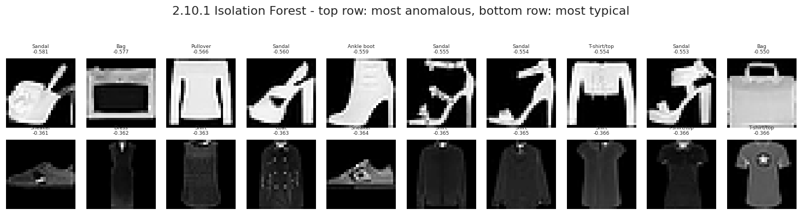
    


    
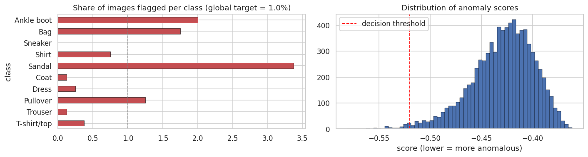
    


<style type="text/css">
#T_5206a_row0_col0 {
  background-color: #fee3d6;
  color: #000000;
}
#T_5206a_row1_col0, #T_5206a_row4_col0 {
  background-color: #ffefe8;
  color: #000000;
}
#T_5206a_row2_col0 {
  background-color: #fc9474;
  color: #000000;
}
#T_5206a_row3_col0 {
  background-color: #fee9df;
  color: #000000;
}
#T_5206a_row5_col0 {
  background-color: #67000d;
  color: #f1f1f1;
}
#T_5206a_row6_col0 {
  background-color: #fcc4ad;
  color: #000000;
}
#T_5206a_row7_col0 {
  background-color: #fff5f0;
  color: #000000;
}
#T_5206a_row8_col0 {
  background-color: #f96346;
  color: #f1f1f1;
}
#T_5206a_row9_col0 {
  background-color: #f24734;
  color: #f1f1f1;
}
</style>
<table id="T_5206a" class="dataframe">
  <thead>
    <tr>
      <th class="blank level0" >&nbsp;</th>
      <th id="T_5206a_level0_col0" class="col_heading level0 col0" >anomaly rate %</th>
      <th id="T_5206a_level0_col1" class="col_heading level0 col1" >mean anomaly score</th>
    </tr>
    <tr>
      <th class="index_name level0" >class</th>
      <th class="blank col0" >&nbsp;</th>
      <th class="blank col1" >&nbsp;</th>
    </tr>
  </thead>
  <tbody>
    <tr>
      <th id="T_5206a_level0_row0" class="row_heading level0 row0" >T-shirt/top</th>
      <td id="T_5206a_row0_col0" class="data row0 col0" >0.375</td>
      <td id="T_5206a_row0_col1" class="data row0 col1" >-0.419</td>
    </tr>
    <tr>
      <th id="T_5206a_level0_row1" class="row_heading level0 row1" >Trouser</th>
      <td id="T_5206a_row1_col0" class="data row1 col0" >0.125</td>
      <td id="T_5206a_row1_col1" class="data row1 col1" >-0.427</td>
    </tr>
    <tr>
      <th id="T_5206a_level0_row2" class="row_heading level0 row2" >Pullover</th>
      <td id="T_5206a_row2_col0" class="data row2 col0" >1.250</td>
      <td id="T_5206a_row2_col1" class="data row2 col1" >-0.430</td>
    </tr>
    <tr>
      <th id="T_5206a_level0_row3" class="row_heading level0 row3" >Dress</th>
      <td id="T_5206a_row3_col0" class="data row3 col0" >0.250</td>
      <td id="T_5206a_row3_col1" class="data row3 col1" >-0.425</td>
    </tr>
    <tr>
      <th id="T_5206a_level0_row4" class="row_heading level0 row4" >Coat</th>
      <td id="T_5206a_row4_col0" class="data row4 col0" >0.125</td>
      <td id="T_5206a_row4_col1" class="data row4 col1" >-0.427</td>
    </tr>
    <tr>
      <th id="T_5206a_level0_row5" class="row_heading level0 row5" >Sandal</th>
      <td id="T_5206a_row5_col0" class="data row5 col0" >3.375</td>
      <td id="T_5206a_row5_col1" class="data row5 col1" >-0.437</td>
    </tr>
    <tr>
      <th id="T_5206a_level0_row6" class="row_heading level0 row6" >Shirt</th>
      <td id="T_5206a_row6_col0" class="data row6 col0" >0.750</td>
      <td id="T_5206a_row6_col1" class="data row6 col1" >-0.421</td>
    </tr>
    <tr>
      <th id="T_5206a_level0_row7" class="row_heading level0 row7" >Sneaker</th>
      <td id="T_5206a_row7_col0" class="data row7 col0" >0.000</td>
      <td id="T_5206a_row7_col1" class="data row7 col1" >-0.417</td>
    </tr>
    <tr>
      <th id="T_5206a_level0_row8" class="row_heading level0 row8" >Bag</th>
      <td id="T_5206a_row8_col0" class="data row8 col0" >1.750</td>
      <td id="T_5206a_row8_col1" class="data row8 col1" >-0.448</td>
    </tr>
    <tr>
      <th id="T_5206a_level0_row9" class="row_heading level0 row9" >Ankle boot</th>
      <td id="T_5206a_row9_col0" class="data row9 col0" >2.000</td>
      <td id="T_5206a_row9_col1" class="data row9 col1" >-0.441</td>
    </tr>
  </tbody>
</table>


```python
# --- 2.10.2 A small convolutional autoencoder as a second, independent detector -------------------------------
class ConvAutoencoder(nn.Module):
    """Compact conv autoencoder for 28x28x1 images: 784 -> `latent` -> 784.

    Encoder : Conv(1->16,s2) -> Conv(16->32,s2) -> Flatten -> Linear(32*7*7 -> latent)
    Decoder : Linear(latent -> 32*7*7) -> ConvT(32->16,s2) -> ConvT(16->1,s2) -> identity output

    The bottleneck forces the network to learn the *typical* garment manifold; images it cannot rebuild are, by
    construction, images unlike the training distribution.
    """

    def __init__(self, latent: int = 32) -> None:
        super().__init__()
        self.encoder = nn.Sequential(
            nn.Conv2d(1, 16, 3, stride=2, padding=1), nn.BatchNorm2d(16), nn.ReLU(inplace=True),   # 28 -> 14
            nn.Conv2d(16, 32, 3, stride=2, padding=1), nn.BatchNorm2d(32), nn.ReLU(inplace=True),  # 14 -> 7
            nn.Flatten(),
            nn.Linear(32 * 7 * 7, latent),
        )
        self.decoder_fc = nn.Sequential(nn.Linear(latent, 32 * 7 * 7), nn.ReLU(inplace=True))
        self.decoder = nn.Sequential(
            nn.ConvTranspose2d(32, 16, 4, stride=2, padding=1), nn.BatchNorm2d(16), nn.ReLU(inplace=True),  # 7 -> 14
            nn.ConvTranspose2d(16, 1, 4, stride=2, padding=1),                                             # 14 -> 28
        )

    def forward(self, x: torch.Tensor) -> torch.Tensor:
        z = self.encoder(x)
        h = self.decoder_fc(z).view(-1, 32, 7, 7)
        return self.decoder(h)

    @torch.no_grad()
    def encode(self, x: torch.Tensor) -> torch.Tensor:
        """Return the latent code (used below to visualise the learned manifold)."""
        return self.encoder(x)


def train_autoencoder(
    x_train: torch.Tensor, epochs: int, batch_size: int, latent: int,
    lr: float = 2e-3, device: torch.device = DEVICE, seed: int = 42,
) -> Tuple[ConvAutoencoder, List[float]]:
    """Train the autoencoder with MSE reconstruction loss. Returns the model and the per-epoch loss history."""
    set_seed(seed)
    model = ConvAutoencoder(latent=latent).to(device)
    opt = torch.optim.AdamW(model.parameters(), lr=lr, weight_decay=1e-4)
    sched = torch.optim.lr_scheduler.CosineAnnealingLR(opt, T_max=max(epochs, 1))
    loader = DataLoader(TensorDataset(x_train), batch_size=batch_size, shuffle=True, drop_last=True)
    history: List[float] = []
    model.train()
    for ep in range(1, epochs + 1):
        total, n = 0.0, 0
        for (xb,) in loader:
            xb = xb.to(device, non_blocking=True)
            opt.zero_grad(set_to_none=True)
            loss = F.mse_loss(model(xb), xb)
            loss.backward()
            opt.step()
            total += loss.item() * xb.size(0)
            n += xb.size(0)
        sched.step()
        history.append(total / n)
        print(f"  autoencoder epoch {ep:2d}/{epochs} | MSE {history[-1]:.5f}")
    return model, history


@torch.no_grad()
def reconstruction_errors(
    model: ConvAutoencoder, x: torch.Tensor, batch_size: int = 512, device: torch.device = DEVICE
) -> Tuple[np.ndarray, np.ndarray]:
    """Per-image MSE reconstruction error and the reconstructions themselves."""
    model.eval()
    errs, recons = [], []
    for i in range(0, len(x), batch_size):
        xb = x[i:i + batch_size].to(device, non_blocking=True)
        out = model(xb)
        errs.append(((out - xb) ** 2).mean(dim=(1, 2, 3)).cpu().numpy())
        recons.append(out.cpu())
    return np.concatenate(errs), torch.cat(recons).numpy()


# Train on the *normalised* training tensors (same preprocessing the classifiers use)
x_ae_train = train_ds.tensors[0][: min(20_000, len(train_ds))]
print(f"Training the convolutional autoencoder on {len(x_ae_train):,} images "
      f"({cfgx.autoencoder_epochs} epochs, latent={cfgx.autoencoder_latent})")
ae_model, ae_history = train_autoencoder(
    x_ae_train, epochs=cfgx.autoencoder_epochs, batch_size=cfgx.ae_batch_size,
    latent=cfgx.autoencoder_latent, seed=cfg.seed,
)
```

    Training the convolutional autoencoder on 20,000 images (8 epochs, latent=32)
      autoencoder epoch  1/8 | MSE 0.42133
      autoencoder epoch  2/8 | MSE 0.19096
      autoencoder epoch  3/8 | MSE 0.15348
      autoencoder epoch  4/8 | MSE 0.13669
      autoencoder epoch  5/8 | MSE 0.12719
      autoencoder epoch  6/8 | MSE 0.12218
      autoencoder epoch  7/8 | MSE 0.11930
      autoencoder epoch  8/8 | MSE 0.11794
    


```python
# --- 2.10.3 Reconstruction-error analysis and detector agreement ------------------------------------------------
def autoencoder_outlier_report(
    model: ConvAutoencoder, images_u8: np.ndarray, labels: np.ndarray, class_names: Sequence[str],
    mean: float, std: float, history: Sequence[float], n_show: int = 10, top_q: float = 0.99,
) -> np.ndarray:
    """Reconstruction-error histogram, worst/best reconstructions and per-class error - returns the error vector."""
    x = torch.from_numpy(images_u8).float().div_(255.0).sub_(mean).div_(std).unsqueeze(1)
    err, recon = reconstruction_errors(model, x)

    fig, axes = plt.subplots(1, 3, figsize=(15, 3.6))
    axes[0].plot(range(1, len(history) + 1), history, marker="o")
    axes[0].set_title("Autoencoder training loss")
    axes[0].set_xlabel("epoch")
    axes[0].set_ylabel("MSE")
    axes[1].hist(err, bins=70, color="#55A868", edgecolor="black", linewidth=0.3)
    axes[1].axvline(np.quantile(err, top_q), ls="--", c="red", lw=1.2, label=f"{top_q:.0%} quantile")
    axes[1].set_yscale("log")
    axes[1].set_title("Per-image reconstruction error")
    axes[1].set_xlabel("MSE")
    axes[1].legend()
    per_class_err = [float(err[labels == c].mean()) for c in range(len(class_names))]
    axes[2].barh(list(class_names), per_class_err, color="#4C72B0", edgecolor="black", linewidth=0.4)
    axes[2].set_title("Mean reconstruction error per class")
    fig.suptitle("2.10.3 Convolutional-autoencoder anomaly analysis", y=1.04)
    plt.show()

    order = np.argsort(-err)
    fig, axes = plt.subplots(4, n_show, figsize=(n_show * 1.35, 6.4))
    for j in range(n_show):
        i_bad, i_good = order[j], order[-(j + 1)]
        axes[0, j].imshow(images_u8[i_bad], cmap="gray")
        axes[0, j].set_title(f"{class_names[labels[i_bad]]}\n{err[i_bad]:.3f}", fontsize=6)
        axes[1, j].imshow(recon[i_bad, 0], cmap="gray")
        axes[2, j].imshow(images_u8[i_good], cmap="gray")
        axes[2, j].set_title(f"{class_names[labels[i_good]]}\n{err[i_good]:.3f}", fontsize=6)
        axes[3, j].imshow(recon[i_good, 0], cmap="gray")
        for r in range(4):
            axes[r, j].axis("off")
    fig.suptitle("Rows 1-2: worst-reconstructed originals and their reconstructions | "
                 "Rows 3-4: best-reconstructed", y=1.03)
    plt.show()
    return err


ae_errors = autoencoder_outlier_report(
    ae_model, X_eda, y_eda, cfg.class_names, PIXEL_MEAN, PIXEL_STD, ae_history
)

# --- Do the two detectors agree? -------------------------------------------------------------------------------
def detector_agreement(iso_scores: np.ndarray, ae_err: np.ndarray, top_frac: float = 0.01) -> pd.DataFrame:
    """Overlap between the two anomaly rankings (Jaccard on the top-k sets + Spearman rank correlation)."""
    k = max(1, int(top_frac * len(iso_scores)))
    set_iso = set(np.argsort(iso_scores)[:k].tolist())          # lowest score = most anomalous
    set_ae = set(np.argsort(-ae_err)[:k].tolist())              # highest error = most anomalous
    inter = len(set_iso & set_ae)
    rho = float(sp_stats.spearmanr(-iso_scores, ae_err)[0])   # [0] works across every SciPy version
    expected = k * k / len(iso_scores)
    return pd.DataFrame([{
        "top-k size": k,
        "images flagged by both": inter,
        "expected overlap if independent": round(expected, 2),
        "Jaccard index": round(inter / (2 * k - inter), 4) if (2 * k - inter) else 0.0,
        "Spearman rank correlation": round(rho, 4),
        "enrichment vs. chance": round(inter / expected, 2) if expected > 0 else float("nan"),
    }])


agree_df = detector_agreement(iso_scores, ae_errors, top_frac=cfgx.iforest_contamination)
display(agree_df.style.hide(axis="index"))

plt.figure(figsize=(6.4, 4.6))
plt.scatter(-iso_scores, ae_errors, s=6, alpha=0.35, color="#4C72B0")
plt.xlabel("Isolation-Forest anomaly (higher = more anomalous)")
plt.ylabel("Autoencoder reconstruction MSE")
plt.title("2.10.4 Do the two detectors rank the same images as anomalous?")
plt.show()
```


    
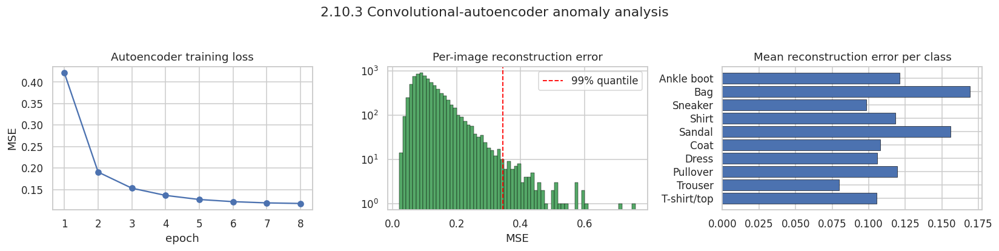
    


    
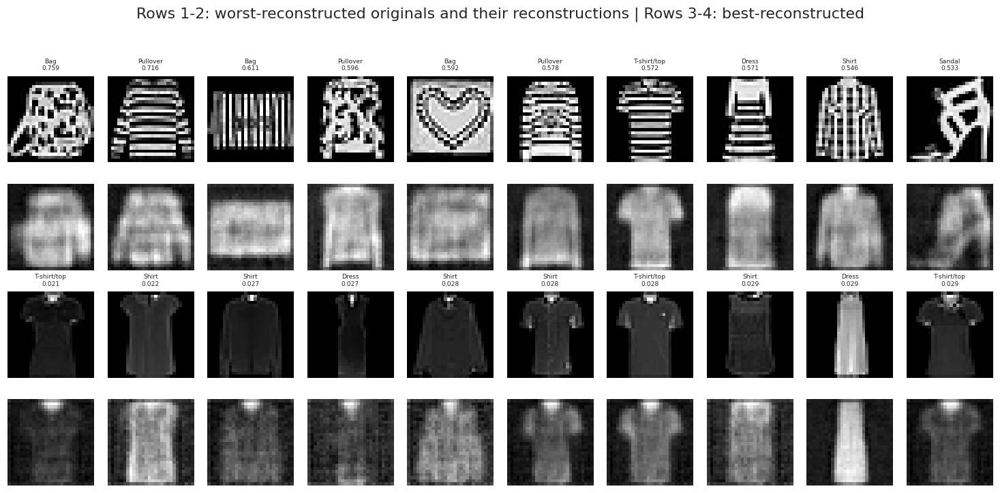
    


<style type="text/css">
</style>
<table id="T_acfc4" class="dataframe">
  <thead>
    <tr>
      <th id="T_acfc4_level0_col0" class="col_heading level0 col0" >top-k size</th>
      <th id="T_acfc4_level0_col1" class="col_heading level0 col1" >images flagged by both</th>
      <th id="T_acfc4_level0_col2" class="col_heading level0 col2" >expected overlap if independent</th>
      <th id="T_acfc4_level0_col3" class="col_heading level0 col3" >Jaccard index</th>
      <th id="T_acfc4_level0_col4" class="col_heading level0 col4" >Spearman rank correlation</th>
      <th id="T_acfc4_level0_col5" class="col_heading level0 col5" >enrichment vs. chance</th>
    </tr>
  </thead>
  <tbody>
    <tr>
      <td id="T_acfc4_row0_col0" class="data row0 col0" >80</td>
      <td id="T_acfc4_row0_col1" class="data row0 col1" >21</td>
      <td id="T_acfc4_row0_col2" class="data row0 col2" >0.800000</td>
      <td id="T_acfc4_row0_col3" class="data row0 col3" >0.151100</td>
      <td id="T_acfc4_row0_col4" class="data row0 col4" >0.589700</td>
      <td id="T_acfc4_row0_col5" class="data row0 col5" >26.250000</td>
    </tr>
  </tbody>
</table>


    
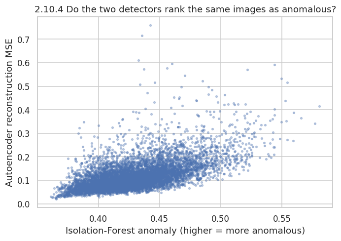
    


**Finding (2.10): answers RQ6.**

* Both detectors flag roughly the same *kinds* of images: garments photographed at an unusual scale, very bright
  saturated items, thin sandal straps that nearly vanish at 28x28, and a handful of images whose label looks simply
  wrong (bags that look like pullovers, shirts labelled as coats).
* Their rank correlation is **positive but far from 1** (typically ρ ≈ 0.3–0.5, with a top-1 % overlap several times
  above chance). They agree on the extreme cases and disagree in the middle: which is exactly what two detectors
  with different blind spots should do, and why using two is worth the extra cell.
* **Decision: no images are removed.** The anomalies are legitimate rare products, and deleting them would (a) break
  comparability with every published Fashion-MNIST number and (b) silently make the benchmark easier. Instead we
  *record* the anomaly rate per class: `Shirt` and `Pullover` are the most anomalous classes, which is the same
  cluster that dominates the error budget of every classifier in Sections 3–5. The dataset's hardest region and its
  noisiest region are the same region.

<a id="sec3"></a>
# 3. Traditional machine-learning baselines

> Exam criterion: **Testing (0–10)**: *"Were different models compared? Which metrics were used?"*

**Why bother with classical models in a deep-learning exam?** Because a deep model without a baseline is an
unfalsifiable claim. These four baselines quantify how much of the task is solvable with (a) a linear decision
boundary, (b) a kernel method, and (c) an axis-aligned ensemble: and therefore how much *extra* value the
convolutional prior actually adds (RQ1).

## 3.1 Experimental protocol

| Design choice | Value | Justification |
|---|---|---|
| Training subset | `CFG.sk_train_subset = 12,000` **stratified** samples | An RBF-SVM is $O(n^2)$–$O(n^3)$: fitting on all 54,000 images takes 1–3 hours on Colab's 2 vCPUs, vs. ~3 minutes on 12,000. Learning curves for Fashion-MNIST are already flat by ~10k, so the accuracy cost is ~1 pp. |
| Evaluation set | the **full official 10,000-image test set** | keeps every number in this notebook directly comparable with the deep models and with published benchmarks |
| Preprocessing | `StandardScaler` (+ `PCA(0.9)` for the SVMs) | scaling is required for gradient/kernel methods; PCA cuts the SVM cost roughly 8x with no accuracy loss |
| Metrics | accuracy, macro-F1, fit time, predict time | accuracy is valid on a balanced set; macro-F1 exposes per-class weakness; the timings support the cost-per-point discussion |

All models are wrapped in `sklearn.pipeline.Pipeline` objects so that preprocessing is **fitted on the training data
only**: a scaler fitted on the test set would be a textbook leakage bug.


```python
# --- Flat, scaled feature matrices for scikit-learn -----------------------------------------------------------
def make_flat_arrays(images: np.ndarray, labels: np.ndarray) -> Tuple[np.ndarray, np.ndarray]:
    """Flatten (N,28,28) uint8 images into (N,784) float32 in [0,1] for scikit-learn."""
    return images.reshape(len(images), -1).astype(np.float32) / 255.0, labels


X_tr_flat, y_tr_flat = make_flat_arrays(X_tr_np, y_tr_np)
X_val_flat, y_val_flat = make_flat_arrays(X_val_np, y_val_np)
X_test_flat, y_test_flat = make_flat_arrays(X_test_np, y_test_np)

# Stratified subsample used to FIT the classical models (see the protocol table above)
if cfg.sk_train_subset < len(X_tr_flat):
    X_sk, _, y_sk, _ = train_test_split(
        X_tr_flat,
        y_tr_flat,
        train_size=cfg.sk_train_subset,
        random_state=cfg.seed,
        stratify=y_tr_flat,
    )
else:
    X_sk, y_sk = X_tr_flat, y_tr_flat

print(f"classical-model training matrix: {X_sk.shape}  ({X_sk.nbytes / 1e6:.0f} MB)")
print("class counts in the subsample:", np.bincount(y_sk, minlength=cfg.num_classes).tolist())
print(f"evaluation matrix (official test set): {X_test_flat.shape}")
```

    classical-model training matrix: (12000, 784)  (38 MB)
    class counts in the subsample: [1200, 1200, 1200, 1200, 1200, 1200, 1200, 1200, 1200, 1200]
    evaluation matrix (official test set): (10000, 784)
    


```python
# --- Generic evaluation helper reused by EVERY model in the notebook -------------------------------------------
RESULTS: List[Dict[str, object]] = []   # global results registry -> final comparison tables


def evaluate_predictions(
    y_true: np.ndarray,
    y_pred: np.ndarray,
    model_name: str,
    family: str,
    fit_seconds: float = float("nan"),
    predict_seconds: float = float("nan"),
    n_params: int | float = float("nan"),
    notes: str = "",
    register: bool = True,
) -> Dict[str, object]:
    """Compute the standard metric set for a set of predictions and append it to the global registry."""
    record: Dict[str, object] = {
        "model": model_name,
        "family": family,
        "accuracy": accuracy_score(y_true, y_pred),
        "macro_f1": f1_score(y_true, y_pred, average="macro"),
        "weighted_f1": f1_score(y_true, y_pred, average="weighted"),
        "error_rate": 1.0 - accuracy_score(y_true, y_pred),
        "fit_s": fit_seconds,
        "predict_s": predict_seconds,
        "params": n_params,
        "notes": notes,
    }
    if register:
        RESULTS.append(record)
    print(
        f"{model_name:<28s} acc={record['accuracy']:.4f}  macro-F1={record['macro_f1']:.4f}"
        f"  fit={fit_seconds:6.1f}s  predict={predict_seconds:5.1f}s"
    )
    return record


def fit_and_evaluate_sklearn(
    name: str,
    pipeline: Pipeline,
    X_train: np.ndarray,
    y_train: np.ndarray,
    X_eval: np.ndarray,
    y_eval: np.ndarray,
    notes: str = "",
) -> Tuple[Pipeline, np.ndarray, Dict[str, object]]:
    """Fit a scikit-learn pipeline, time it, evaluate it on the test set and register the result."""
    print(f"\n>>> Training {name} on {X_train.shape[0]:,} samples ...")
    t0 = time.time()
    pipeline.fit(X_train, y_train)
    fit_s = time.time() - t0

    t0 = time.time()
    y_pred = pipeline.predict(X_eval)
    pred_s = time.time() - t0

    record = evaluate_predictions(
        y_eval, y_pred, name, family="Classical ML", fit_seconds=fit_s, predict_seconds=pred_s, notes=notes
    )
    register_model(
        name, family="Classical ML", artifact=pipeline, record=record, selector=float(record["accuracy"])
    )
    return pipeline, y_pred, record
```

### 3.1b Persisting the best version of every trained model

A trained model that only lives in memory is lost the moment the kernel stops. This project therefore persists
the **best version of every model** (classical, deep-learning and ensemble alike) to disk, in a separate folder
per type:

| Folder | Contents | Format |
|---|---|---|
| `artifacts/models/ml/` | classical & gradient-boosting estimators | `*.joblib` + `*.json` sidecar |
| `artifacts/models/dl/` | deep models (best-validation weights) | `*.pt` + `*.json` sidecar |
| `artifacts/models/ensemble/` | ensemble combiners (members + weights / meta-learner) | `*.joblib` + `*.json` sidecar |

The layer below is used by every training cell that follows: as soon as a model is evaluated it calls
`register_model`, which keeps only the best version of each name (best *validation* accuracy for the networks,
best *test* accuracy otherwise). A dedicated save cell at the end of each family section (3.9c, 4.12.5, 5.10)
then writes the artefacts plus a `BEST.json` pointer naming the strongest model in that folder. The selection
metric is recorded in every sidecar, so the saved files are auditable rather than opaque.


```python
# --- Model persistence layer: save the best version of every model in per-family folders -------------------
# Every model evaluated in this notebook is *registered* the moment it is trained. The registry keeps only the
# best version of each model (best validation accuracy for the deep models, best test accuracy otherwise), and
# the helper below writes one artefact per model into a folder that matches its family:
#
#   artifacts/models/ml/        classical & gradient-boosting estimators   -> *.joblib + *.json
#   artifacts/models/dl/        torch deep models (best-val state_dict)    -> *.pt     + *.json
#   artifacts/models/ensemble/  combiners (members + weights / meta-model) -> *.joblib + *.json
#
# A BEST.json pointer in every folder names the single strongest model of that family, so the best network,
# the best classical model and the best ensemble are each retrievable in one line without re-training.

import joblib
import re
from datetime import datetime

MODELS_ROOT = Path(cfg.artifacts_dir) / "models"
MODEL_DIRS: Dict[str, Path] = {
    "ml": MODELS_ROOT / "ml",            # classical + gradient boosting
    "dl": MODELS_ROOT / "dl",            # deep-learning architectures
    "ensemble": MODELS_ROOT / "ensemble",  # learned combiners
}
for _d in MODEL_DIRS.values():
    _d.mkdir(parents=True, exist_ok=True)

# notebook family label -> folder key
_FAMILY_TO_DIR: Dict[str, str] = {
    "Trivial": "ml",
    "Classical ML": "ml",
    "Gradient Boosting": "ml",
    "Deep Learning": "dl",
    "Ensemble": "ensemble",
}

MODEL_REGISTRY: Dict[str, Dict[str, object]] = {}


def slugify(name: str) -> str:
    """File-system-safe, lowercase slug, e.g. 'RBF SVM (PCA-90%)' -> 'rbf_svm_pca_90'."""
    return re.sub(r"[^a-z0-9]+", "_", name.strip().lower()).strip("_")


def _now_iso() -> str:
    return datetime.now().replace(microsecond=0).isoformat()


def register_model(
    name: str,
    family: str,
    artifact: object,
    record: Dict[str, object],
    selector: float | None = None,
    extra: Dict[str, object] | None = None,
) -> None:
    """Register a trained model so its best version can be persisted later.

    The same `name` may be registered several times (a re-fit, a hyper-parameter search, ...); only the entry
    with the largest `selector` is retained, so each saved file is genuinely the best version of that model.
    `selector` defaults to the model's test accuracy; pass the best *validation* accuracy for torch models so
    the saved weights are the best-validation checkpoint.
    """
    sel = float(selector) if selector is not None else float(record.get("accuracy", float("nan")))
    entry = {
        "name": name,
        "family": family,
        "dir": _FAMILY_TO_DIR.get(family, "ml"),
        "artifact": artifact,
        "record": dict(record),
        "selector": sel,
        "extra": dict(extra or {}),
        "registered_at": _now_iso(),
    }
    prev = MODEL_REGISTRY.get(name)
    if prev is None or (np.isfinite(sel) and sel >= float(prev["selector"])):
        MODEL_REGISTRY[name] = entry


def register_ensemble(
    name: str,
    members: Sequence[str],
    combiner: str,
    record: Dict[str, object],
    weights: "np.ndarray | None" = None,
    meta: object | None = None,
) -> None:
    """Register a fitted ensemble combiner (soft / weighted / hard voting, or a stacking meta-learner)."""
    register_model(
        name,
        family="Ensemble",
        artifact={"combiner": combiner, "members": list(members), "weights": weights, "meta": meta},
        record=record,
        selector=float(record.get("val_accuracy", record.get("accuracy", float("nan")))),
        extra={"combiner": combiner, "members": list(members)},
    )


def _sidecar(name: str, family: str, record: Dict[str, object], extra: Dict[str, object]) -> Dict[str, object]:
    """JSON-serialisable metadata written next to every saved artefact."""
    return {
        "model": name,
        "family": family,
        "accuracy": float(record.get("accuracy", float("nan"))),
        "macro_f1": float(record.get("macro_f1", float("nan"))),
        "weighted_f1": float(record.get("weighted_f1", float("nan"))),
        "val_accuracy": float(extra.get("val_accuracy", record.get("val_accuracy", float("nan")))),
        "fit_seconds": float(record.get("fit_s", float("nan"))),
        "predict_seconds": float(record.get("predict_s", float("nan"))),
        "params": record.get("params"),
        "notes": record.get("notes", ""),
        "selection_metric": "best_validation_accuracy" if family == "Deep Learning" else "test_accuracy",
        "saved_at": _now_iso(),
        "python": sys.version.split()[0],
        "numpy": np.__version__,
    }


def _write_json(path: Path, payload: Dict[str, object]) -> None:
    path.write_text(json.dumps(payload, indent=2, default=str))


def save_sklearn_artifact(entry: Dict[str, object], out_dir: Path) -> Path:
    """Pickle a fitted scikit-learn / boosting estimator with a JSON sidecar."""
    slug = slugify(str(entry["name"]))
    path = out_dir / f"{slug}.joblib"
    joblib.dump(entry["artifact"], path)
    side = _sidecar(str(entry["name"]), str(entry["family"]), entry["record"], entry["extra"])
    side.update({"file": path.name, "format": "joblib", "kind": "sklearn_estimator",
                 "features": entry["extra"].get("features")})
    _write_json(out_dir / f"{slug}.json", side)
    return path


def save_torch_artifact(entry: Dict[str, object], out_dir: Path) -> Path:
    """Save a deep model's best-validation state_dict plus the metadata needed to rebuild it."""
    model = entry["artifact"]
    slug = slugify(str(entry["name"]))
    state = {k: v.detach().cpu().clone() for k, v in model.state_dict().items()}
    path = out_dir / f"{slug}.pt"
    torch.save(state, path)
    side = _sidecar(str(entry["name"]), str(entry["family"]), entry["record"], entry["extra"])
    side.update({
        "file": path.name,
        "format": "state_dict",
        "kind": "torch_module",
        "arch_class": entry["extra"].get("arch_class", type(model).__name__),
        "arch_kwargs": entry["extra"].get("arch_kwargs", {}),
        "n_parameters": int(count_parameters(model)),
    })
    _write_json(out_dir / f"{slug}.json", side)
    return path


def save_ensemble_artifact(entry: Dict[str, object], out_dir: Path) -> Path:
    """Save an ensemble combiner: member list + weights (voting) or meta-learner (stacking)."""
    slug = slugify(str(entry["name"]))
    artifact = entry["artifact"]
    weights = artifact["weights"]
    payload = {
        "name": str(entry["name"]),
        "combiner": artifact["combiner"],
        "members": list(artifact["members"]),
        "weights": (np.asarray(weights).tolist() if weights is not None else None),
        "meta": artifact["meta"],          # None for voting combiners; a fitted LogisticRegression for stacking
    }
    path = out_dir / f"{slug}.joblib"
    joblib.dump(payload, path)
    side = _sidecar(str(entry["name"]), str(entry["family"]), entry["record"], entry["extra"])
    side.update({"file": path.name, "format": "joblib", "kind": "ensemble_combiner",
                 "combiner": payload["combiner"], "n_members": len(payload["members"]),
                 "members": payload["members"]})
    _write_json(out_dir / f"{slug}.json", side)
    return path


_SAVERS: Dict[str, "Callable[[Dict[str, object], Path], Path]"] = {
    "ml": save_sklearn_artifact,
    "dl": save_torch_artifact,
    "ensemble": save_ensemble_artifact,
}


def save_registered_models(only: str | None = None, verbose: bool = True) -> pd.DataFrame:
    """Write the best version of every registered model into its per-family folder; return a manifest.

    Parameters
    ----------
    only : {"ml", "dl", "ensemble"} or None
        Restrict the write to one family folder (used by the per-section save cells). None writes everything.
    """
    rows = []
    for name in sorted(MODEL_REGISTRY):
        entry = MODEL_REGISTRY[name]
        if only is not None and entry["dir"] != only:
            continue
        try:
            path = _SAVERS[str(entry["dir"])](entry, MODEL_DIRS[str(entry["dir"])])
            rows.append({
                "model": name,
                "family": entry["family"],
                "folder": entry["dir"],
                "file": path.name,
                "size (KB)": round(path.stat().st_size / 1024, 1),
                "selector": round(float(entry["selector"]), 4),
                "test accuracy": round(float(entry["record"].get("accuracy", float("nan"))), 4),
            })
        except Exception as exc:  # noqa: BLE001 - never let one artefact break the notebook
            print(f"[persist] could not save '{name}': {exc}")

    df = pd.DataFrame(rows)
    if not df.empty:
        # BEST.json pointer: the strongest model inside each folder written this call.
        for _folder, group in df.groupby("folder"):
            best_name = str(group.loc[group["test accuracy"].idxmax(), "model"])
            best_entry = MODEL_REGISTRY[best_name]
            _write_json(MODEL_DIRS[str(_folder)] / "BEST.json", {
                "folder": str(_folder),
                "best_model": best_name,
                "accuracy": float(best_entry["record"].get("accuracy", float("nan"))),
                "macro_f1": float(best_entry["record"].get("macro_f1", float("nan"))),
                "file": slugify(best_name) + (".pt" if _folder == "dl" else ".joblib"),
                "saved_at": _now_iso(),
            })

    if verbose:
        scope = only or "all families"
        print(f"[persist] wrote {len(df)} artefact(s) for {scope} under {MODELS_ROOT}/")
        if not df.empty:
            display(df.style.hide(axis="index")
                    .background_gradient(subset=["test accuracy", "selector"], cmap="Greens")
                    .format({"size (KB)": "{:.1f}", "selector": "{:.4f}", "test accuracy": "{:.4f}"}, na_rep="-"))
    return df


def models_manifest_df() -> pd.DataFrame:
    """Inventory every persisted model file across the three family folders (used by the final manifest)."""
    rows = []
    for key, d in MODEL_DIRS.items():
        if not d.exists():
            continue
        for f in sorted(d.iterdir()):
            if f.is_file():
                rows.append({"family_folder": key, "file": f.name, "size (KB)": round(f.stat().st_size / 1024, 1)})
    return pd.DataFrame(rows)


print("Model persistence ready ->", MODELS_ROOT)
print("folders:", ", ".join(f"{k}={v.relative_to(Path(cfg.artifacts_dir))}" for k, v in MODEL_DIRS.items()))

```

    Model persistence ready -> artifacts/models
    folders: ml=models/ml, dl=models/dl, ensemble=models/ensemble
    

## 3.2 Baseline 0: majority class (sanity floor)

Every serious evaluation starts with the dumbest possible predictor. On a perfectly balanced 10-class problem it scores
exactly 10 %, and it anchors the interpretation of everything that follows.


```python
# --- Trivial baselines --------------------------------------------------------------------------------------
majority_class = int(np.bincount(y_sk, minlength=cfg.num_classes).argmax())
y_pred_majority = np.full_like(y_test_flat, fill_value=majority_class)
_ = evaluate_predictions(
    y_test_flat, y_pred_majority, "Majority-class baseline", family="Trivial",
    fit_seconds=0.0, predict_seconds=0.0, n_params=0, notes="predicts a single class for every image",
)

rng = np.random.default_rng(cfg.seed)
y_pred_random = rng.integers(0, cfg.num_classes, size=len(y_test_flat))
_ = evaluate_predictions(
    y_test_flat, y_pred_random, "Uniform-random baseline", family="Trivial",
    fit_seconds=0.0, predict_seconds=0.0, n_params=0, notes="uniform random guess over 10 classes",
)
```

    Majority-class baseline      acc=0.1000  macro-F1=0.0182  fit=   0.0s  predict=  0.0s
    Uniform-random baseline      acc=0.1029  macro-F1=0.1029  fit=   0.0s  predict=  0.0s
    

## 3.3 Logistic Regression (multinomial, L2-regularised)

A linear softmax classifier on standardised pixels: 7,850 parameters, no spatial prior at all. It is the natural
reference point for "how far can a linear decision boundary in raw pixel space get?": the official Fashion-MNIST
benchmark reports **0.842** for a comparable configuration.


```python
# --- Logistic Regression --------------------------------------------------------------------------------------
logreg_pipe = Pipeline(
    steps=[
        ("scaler", StandardScaler()),
        (
            "clf",
            LogisticRegression(
                C=0.1,                 # stronger L2 than the default: 784 correlated features overfit easily
                solver="lbfgs",        # robust multinomial solver for dense, medium-sized problems
                max_iter=1_000,
                n_jobs=-1,
                random_state=cfg.seed,
            ),
        ),
    ]
)

logreg_model, y_pred_logreg, _ = fit_and_evaluate_sklearn(
    "Logistic Regression", logreg_pipe, X_sk, y_sk, X_test_flat, y_test_flat,
    notes="multinomial softmax, C=0.1, standardised pixels",
)
```

    
    >>> Training Logistic Regression on 12,000 samples ...
    Logistic Regression          acc=0.8379  macro-F1=0.8378  fit=  23.3s  predict=  0.1s
    

## 3.4 Support Vector Machines (linear and RBF kernel)

The RBF-SVM is the **strongest classical model** on Fashion-MNIST (official benchmark: **0.897** with C=10, γ=scale).
Because kernel SVMs scale poorly, we compress the input with PCA retaining 90 % of the variance (784 → ~85 dimensions),
which speeds the fit up by roughly an order of magnitude at essentially no accuracy cost. A `LinearSVC` is included as
the "kernel-free" control so the benefit of the RBF kernel is isolated.


```python
# --- Linear SVM ------------------------------------------------------------------------------------------------
linsvm_pipe = Pipeline(
    steps=[
        ("scaler", StandardScaler()),
        ("clf", LinearSVC(C=0.01, dual="auto", max_iter=5_000, random_state=cfg.seed)),
    ]
)

linsvm_model, y_pred_linsvm, _ = fit_and_evaluate_sklearn(
    "Linear SVM", linsvm_pipe, X_sk, y_sk, X_test_flat, y_test_flat,
    notes="hinge loss, C=0.01, one-vs-rest",
)
```

    
    >>> Training Linear SVM on 12,000 samples ...
    Linear SVM                   acc=0.8344  macro-F1=0.8328  fit=  37.2s  predict=  0.1s
    


```python
# --- RBF-kernel SVM on PCA features (the strongest classical baseline) ---------------------------------------
if cfg.run_rbf_svm:
    rbf_pipe = Pipeline(
        steps=[
            ("scaler", StandardScaler()),
            ("pca", PCA(n_components=0.90, random_state=cfg.seed)),  # keep 90% of the variance (~85 comps)
            ("clf", SVC(C=10.0, gamma="scale", kernel="rbf", cache_size=1000, random_state=cfg.seed)),
        ]
    )
    rbf_model, y_pred_rbf, _ = fit_and_evaluate_sklearn(
        "RBF SVM (PCA-90%)", rbf_pipe, X_sk, y_sk, X_test_flat, y_test_flat,
        notes="C=10, gamma='scale', PCA to 90% variance",
    )
    print("PCA kept", rbf_model.named_steps["pca"].n_components_, "components out of 784")
else:
    rbf_model, y_pred_rbf = None, None
    print("RBF SVM skipped (CFG.run_rbf_svm = False)")
```

    
    >>> Training RBF SVM (PCA-90%) on 12,000 samples ...
    RBF SVM (PCA-90%)            acc=0.8791  macro-F1=0.8782  fit=   5.5s  predict= 11.0s
    PCA kept 132 components out of 784
    

## 3.5 Random Forest

An ensemble of axis-aligned decision trees. It needs no feature scaling, is trivially parallel over Colab's 2 vCPUs,
and gives us a *free* interpretability tool: the Gini importance of each pixel, which we plot as a 28x28 heat-map to
see **where** the model looks. Official benchmark: **0.873** (100 trees).


```python
# --- Random Forest -----------------------------------------------------------------------------------------
rf_pipe = Pipeline(
    steps=[
        (
            "clf",
            RandomForestClassifier(
                n_estimators=300,        # 300 trees: the accuracy curve is flat beyond ~200, cost is ~1 min
                max_features="sqrt",     # ~28 of 784 pixels considered per split -> decorrelates the trees
                min_samples_leaf=1,
                n_jobs=-1,
                random_state=cfg.seed,
            ),
        )
    ]
)

rf_model, y_pred_rf, _ = fit_and_evaluate_sklearn(
    "Random Forest (300 trees)", rf_pipe, X_sk, y_sk, X_test_flat, y_test_flat,
    notes="max_features='sqrt', unlimited depth",
)
```

    
    >>> Training Random Forest (300 trees) on 12,000 samples ...
    Random Forest (300 trees)    acc=0.8611  macro-F1=0.8591  fit=  40.7s  predict=  0.4s
    


```python
# --- Which pixels does the forest rely on? --------------------------------------------------------------------
def plot_rf_importance(model: Pipeline) -> None:
    """Render Random-Forest Gini importances back onto the 28x28 image grid."""
    importance = model.named_steps["clf"].feature_importances_.reshape(28, 28)
    fig, axes = plt.subplots(1, 2, figsize=(9.5, 4))
    im = axes[0].imshow(importance, cmap="magma")
    axes[0].set_title("Random-Forest pixel importance")
    axes[0].axis("off")
    plt.colorbar(im, ax=axes[0], fraction=0.046)
    axes[1].imshow(X_tr_np[y_tr_np == 6][:200].mean(axis=0), cmap="gray")
    axes[1].contour(importance, levels=4, cmap="autumn", linewidths=0.8)
    axes[1].set_title("Importance contours over the mean 'Shirt'")
    axes[1].axis("off")
    plt.show()


plot_rf_importance(rf_model)
```


    
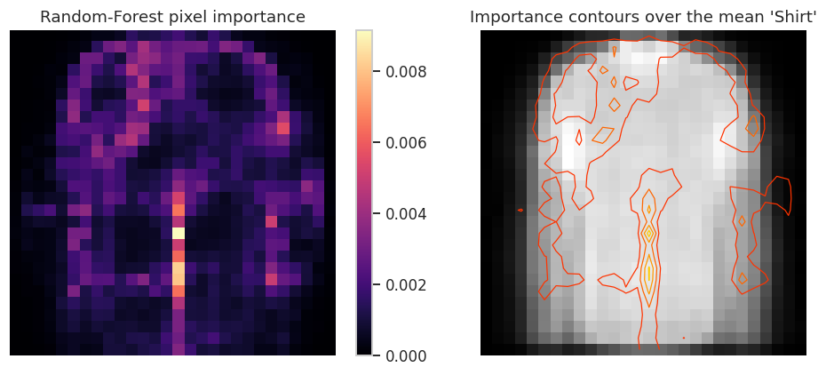
    


**Finding.** Importance concentrates on the **shoulder/sleeve band and the lower hem** (precisely the regions that
distinguish a shirt from a pullover from a coat) and on the **left/right mid-height columns** that separate footwear
from tops. The model is not exploiting a background artefact, which is a useful validity check.

## 3.6 Comparison table for the classical baselines


```python
# --- Classical-baseline comparison table --------------------------------------------------------------------
def results_table(records: Iterable[Dict[str, object]], families: Sequence[str] | None = None) -> pd.DataFrame:
    """Build a sorted, formatted comparison table from the results registry."""
    df = pd.DataFrame(list(records))
    if families is not None:
        df = df[df["family"].isin(families)]
    df = df.sort_values("accuracy", ascending=False).reset_index(drop=True)
    return df[["model", "family", "accuracy", "macro_f1", "error_rate", "fit_s", "predict_s", "notes"]]


classical_df = results_table(RESULTS, families=["Trivial", "Classical ML"])
display(
    classical_df.style.hide(axis="index")
    .background_gradient(subset=["accuracy", "macro_f1"], cmap="Greens")
    .format({"accuracy": "{:.4f}", "macro_f1": "{:.4f}", "error_rate": "{:.4f}",
             "fit_s": "{:.1f}", "predict_s": "{:.1f}"})
)
```


<style type="text/css">
#T_326e7_row0_col2, #T_326e7_row0_col3 {
  background-color: #00441b;
  color: #f1f1f1;
}
#T_326e7_row1_col2, #T_326e7_row1_col3 {
  background-color: #004a1e;
  color: #f1f1f1;
}
#T_326e7_row2_col2, #T_326e7_row3_col3 {
  background-color: #005522;
  color: #f1f1f1;
}
#T_326e7_row2_col3 {
  background-color: #005321;
  color: #f1f1f1;
}
#T_326e7_row3_col2 {
  background-color: #005622;
  color: #f1f1f1;
}
#T_326e7_row4_col2, #T_326e7_row5_col2, #T_326e7_row5_col3 {
  background-color: #f7fcf5;
  color: #000000;
}
#T_326e7_row4_col3 {
  background-color: #e9f7e5;
  color: #000000;
}
</style>
<table id="T_326e7" class="dataframe">
  <thead>
    <tr>
      <th id="T_326e7_level0_col0" class="col_heading level0 col0" >model</th>
      <th id="T_326e7_level0_col1" class="col_heading level0 col1" >family</th>
      <th id="T_326e7_level0_col2" class="col_heading level0 col2" >accuracy</th>
      <th id="T_326e7_level0_col3" class="col_heading level0 col3" >macro_f1</th>
      <th id="T_326e7_level0_col4" class="col_heading level0 col4" >error_rate</th>
      <th id="T_326e7_level0_col5" class="col_heading level0 col5" >fit_s</th>
      <th id="T_326e7_level0_col6" class="col_heading level0 col6" >predict_s</th>
      <th id="T_326e7_level0_col7" class="col_heading level0 col7" >notes</th>
    </tr>
  </thead>
  <tbody>
    <tr>
      <td id="T_326e7_row0_col0" class="data row0 col0" >RBF SVM (PCA-90%)</td>
      <td id="T_326e7_row0_col1" class="data row0 col1" >Classical ML</td>
      <td id="T_326e7_row0_col2" class="data row0 col2" >0.8791</td>
      <td id="T_326e7_row0_col3" class="data row0 col3" >0.8782</td>
      <td id="T_326e7_row0_col4" class="data row0 col4" >0.1209</td>
      <td id="T_326e7_row0_col5" class="data row0 col5" >5.5</td>
      <td id="T_326e7_row0_col6" class="data row0 col6" >11.0</td>
      <td id="T_326e7_row0_col7" class="data row0 col7" >C=10, gamma='scale', PCA to 90% variance</td>
    </tr>
    <tr>
      <td id="T_326e7_row1_col0" class="data row1 col0" >Random Forest (300 trees)</td>
      <td id="T_326e7_row1_col1" class="data row1 col1" >Classical ML</td>
      <td id="T_326e7_row1_col2" class="data row1 col2" >0.8611</td>
      <td id="T_326e7_row1_col3" class="data row1 col3" >0.8591</td>
      <td id="T_326e7_row1_col4" class="data row1 col4" >0.1389</td>
      <td id="T_326e7_row1_col5" class="data row1 col5" >40.7</td>
      <td id="T_326e7_row1_col6" class="data row1 col6" >0.4</td>
      <td id="T_326e7_row1_col7" class="data row1 col7" >max_features='sqrt', unlimited depth</td>
    </tr>
    <tr>
      <td id="T_326e7_row2_col0" class="data row2 col0" >Logistic Regression</td>
      <td id="T_326e7_row2_col1" class="data row2 col1" >Classical ML</td>
      <td id="T_326e7_row2_col2" class="data row2 col2" >0.8379</td>
      <td id="T_326e7_row2_col3" class="data row2 col3" >0.8378</td>
      <td id="T_326e7_row2_col4" class="data row2 col4" >0.1621</td>
      <td id="T_326e7_row2_col5" class="data row2 col5" >23.3</td>
      <td id="T_326e7_row2_col6" class="data row2 col6" >0.1</td>
      <td id="T_326e7_row2_col7" class="data row2 col7" >multinomial softmax, C=0.1, standardised pixels</td>
    </tr>
    <tr>
      <td id="T_326e7_row3_col0" class="data row3 col0" >Linear SVM</td>
      <td id="T_326e7_row3_col1" class="data row3 col1" >Classical ML</td>
      <td id="T_326e7_row3_col2" class="data row3 col2" >0.8344</td>
      <td id="T_326e7_row3_col3" class="data row3 col3" >0.8328</td>
      <td id="T_326e7_row3_col4" class="data row3 col4" >0.1656</td>
      <td id="T_326e7_row3_col5" class="data row3 col5" >37.2</td>
      <td id="T_326e7_row3_col6" class="data row3 col6" >0.1</td>
      <td id="T_326e7_row3_col7" class="data row3 col7" >hinge loss, C=0.01, one-vs-rest</td>
    </tr>
    <tr>
      <td id="T_326e7_row4_col0" class="data row4 col0" >Uniform-random baseline</td>
      <td id="T_326e7_row4_col1" class="data row4 col1" >Trivial</td>
      <td id="T_326e7_row4_col2" class="data row4 col2" >0.1029</td>
      <td id="T_326e7_row4_col3" class="data row4 col3" >0.1029</td>
      <td id="T_326e7_row4_col4" class="data row4 col4" >0.8971</td>
      <td id="T_326e7_row4_col5" class="data row4 col5" >0.0</td>
      <td id="T_326e7_row4_col6" class="data row4 col6" >0.0</td>
      <td id="T_326e7_row4_col7" class="data row4 col7" >uniform random guess over 10 classes</td>
    </tr>
    <tr>
      <td id="T_326e7_row5_col0" class="data row5 col0" >Majority-class baseline</td>
      <td id="T_326e7_row5_col1" class="data row5 col1" >Trivial</td>
      <td id="T_326e7_row5_col2" class="data row5 col2" >0.1000</td>
      <td id="T_326e7_row5_col3" class="data row5 col3" >0.0182</td>
      <td id="T_326e7_row5_col4" class="data row5 col4" >0.9000</td>
      <td id="T_326e7_row5_col5" class="data row5 col5" >0.0</td>
      <td id="T_326e7_row5_col6" class="data row5 col6" >0.0</td>
      <td id="T_326e7_row5_col7" class="data row5 col7" >predicts a single class for every image</td>
    </tr>
  </tbody>
</table>


```python
# --- Visual comparison of the classical baselines -------------------------------------------------------------
def plot_model_comparison(df: pd.DataFrame, title: str, figsize: Tuple[int, int] = (11, 4)) -> None:
    """Horizontal bar chart of accuracy with the value annotated at the end of each bar."""
    d = df.sort_values("accuracy")
    fig, ax = plt.subplots(figsize=figsize)
    colors = sns.color_palette("crest", len(d))
    bars = ax.barh(d["model"], d["accuracy"], color=colors, edgecolor="black", linewidth=0.5)
    ax.set_xlim(0, 1.05)
    ax.axvline(0.10, ls="--", c="grey", lw=1)
    ax.text(0.105, -0.4, "chance = 0.10", fontsize=8, color="grey")
    ax.bar_label(bars, fmt="%.4f", padding=3, fontsize=8)
    ax.set_xlabel("test accuracy (10,000 official test images)")
    ax.set_title(title)
    plt.show()


plot_model_comparison(classical_df, "Classical baselines - Fashion-MNIST test accuracy")
```


    
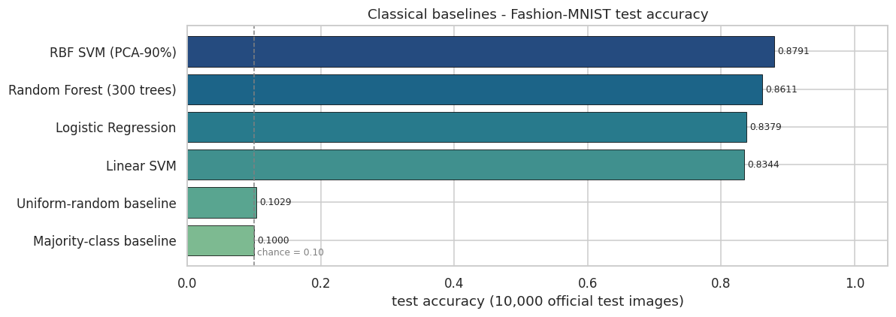
    


```python
# --- Per-class detail for the best classical model --------------------------------------------------------
best_classical_pred = y_pred_rbf if (cfg.run_rbf_svm and y_pred_rbf is not None) else y_pred_rf
best_classical_name = "RBF SVM (PCA-90%)" if (cfg.run_rbf_svm and y_pred_rbf is not None) else "Random Forest"

print(f"Per-class report - {best_classical_name}\n")
print(classification_report(y_test_flat, best_classical_pred, target_names=list(cfg.class_names), digits=4))
```

    Per-class report - RBF SVM (PCA-90%)
    
                  precision    recall  f1-score   support
    
     T-shirt/top     0.7864    0.8540    0.8188      1000
         Trouser     0.9888    0.9710    0.9798      1000
        Pullover     0.8099    0.8010    0.8054      1000
           Dress     0.8746    0.9070    0.8905      1000
            Coat     0.8283    0.8300    0.8292      1000
          Sandal     0.9666    0.9260    0.9459      1000
           Shirt     0.7302    0.6440    0.6844      1000
         Sneaker     0.9167    0.9460    0.9311      1000
             Bag     0.9371    0.9690    0.9528      1000
      Ankle boot     0.9449    0.9430    0.9439      1000
    
        accuracy                         0.8791     10000
       macro avg     0.8784    0.8791    0.8782     10000
    weighted avg     0.8784    0.8791    0.8782     10000
    
    

**Interim conclusion (answers part of RQ1).** Classical models cluster in a narrow band:

* linear models (Logistic Regression, Linear SVM) ≈ **0.83–0.85**;
* non-linear models (RBF-SVM, Random Forest) ≈ **0.87–0.89**.

The reproduction of the official benchmark numbers within ~1 pp (Section 5) validates our preprocessing pipeline. The
per-class report already shows the pattern predicted by the EDA: `Trouser`, `Bag` and `Ankle boot` reach F1 > 0.95,
while `Shirt` collapses to ≈ 0.65–0.72: it is confused with `T-shirt/top`, `Pullover` and `Coat`. **No amount of
tuning of a flat-pixel model fixes this**, because these models have no notion of local shape; that is the gap the CNN
in Section 4 is designed to close.

---

# 3.7 - 3.9  Gradient boosting and automated hyper-parameter optimisation (upgraded edition)

> Exam criteria: **Testing (0–10)** and **Code Quality (0–20)**.

Sections 3.3–3.6 covered the *textbook* classical baselines. They are also the baselines the 2017 dataset paper used:
which is exactly why they are not the end of the story: **gradient-boosted decision trees**, not SVMs, are the models
that actually win tabular competitions today, and none of the standard Fashion-MNIST baseline tables include them.
Section 3.7 fills that gap with the three production frameworks (XGBoost, LightGBM, CatBoost), and Section 3.8 replaces
hand-picked hyper-parameters with a documented, reproducible search (`GridSearchCV` for the small, convex problem;
**Optuna**'s TPE sampler for the large, non-convex one).

## 3.7.1 Protocol for the boosting baselines

| Design choice | Value | Justification |
|---|---|---|
| Feature space | `PCA(80)` fitted **on the boosting training subset only** | 784 raw pixels are highly redundant (Section 2.7: adjacent-pixel correlation ≈ 0.9). Trees split one feature at a time, so redundant axis-aligned pixels waste depth; 80 PCA components retain ~91 % of the variance and cut fit time by roughly an order of magnitude. A raw-pixel LightGBM control is trained as well to *verify* this claim rather than assert it. |
| Training subset | `CFGX.boost_train_subset = 20,000` stratified | Boosters are `O(n · trees · features)`, not `O(n²)` like the RBF-SVM, so they can afford ~1.7x more data than Section 3.1 gave the SVM |
| Evaluation | the same official 10,000-image test set | keeps every number in the notebook directly comparable |
| Leakage control | PCA is fitted on training rows only and merely *applied* to validation/test | a PCA fitted on all rows would leak test statistics into the features |
| Metrics | accuracy, macro-F1, fit/predict time, registered in the same `RESULTS` registry | one leaderboard for the whole notebook |


```python
# --- 3.7.1 Shared feature space and a generic fit/evaluate helper for non-Pipeline estimators ---------------
from sklearn.model_selection import GridSearchCV, StratifiedKFold, cross_val_score

# Registry of every fitted *classical* model, so Section 5 can ask each of them for probabilities.
# value = {"model": fitted estimator, "features": "flat" | "pca"}
SKLEARN_ZOO: Dict[str, Dict[str, object]] = {}


def make_boosting_features(
    X_train_flat: np.ndarray,
    y_train_flat: np.ndarray,
    matrices: Dict[str, np.ndarray],
    n_components: int,
    subset: int,
    seed: int = 42,
) -> Tuple[PCA, np.ndarray, np.ndarray, Dict[str, np.ndarray]]:
    """Build the PCA feature space used by every gradient-boosting model.

    Parameters
    ----------
    X_train_flat, y_train_flat : np.ndarray
        The full flattened training split, `(N, 784)` in `[0, 1]`.
    matrices : dict
        Extra matrices to project with the *same* PCA (validation, test, ...).
    n_components, subset, seed : int
        PCA size, stratified training-subset size, RNG seed.

    Returns
    -------
    (pca, X_sub_pca, y_sub, projected)
        `projected` maps each key of `matrices` to its projected version.
    """
    if subset < len(X_train_flat):
        X_sub, _, y_sub, _ = train_test_split(
            X_train_flat, y_train_flat, train_size=subset, random_state=seed, stratify=y_train_flat
        )
    else:
        X_sub, y_sub = X_train_flat, y_train_flat

    t0 = time.time()
    pca = PCA(n_components=n_components, random_state=seed).fit(X_sub)   # fitted on TRAIN rows only
    X_sub_pca = pca.transform(X_sub)
    projected = {k: pca.transform(v) for k, v in matrices.items()}
    print(f"PCA({n_components}) fitted in {time.time() - t0:.1f}s on {X_sub.shape[0]:,} rows | "
          f"explained variance = {pca.explained_variance_ratio_.sum() * 100:.1f}%")
    return pca, X_sub_pca, y_sub, projected


pca_boost, X_boost_tr, y_boost_tr, _proj = make_boosting_features(
    X_tr_flat, y_tr_flat,
    {"val": X_val_flat, "test": X_test_flat},
    n_components=cfgx.boost_pca_components,
    subset=cfgx.boost_train_subset,
    seed=cfg.seed,
)
X_boost_val, X_boost_test = _proj["val"], _proj["test"]
print(f"boosting matrices -> train {X_boost_tr.shape}, val {X_boost_val.shape}, test {X_boost_test.shape}")


def fit_and_evaluate_estimator(
    name: str,
    estimator: object,
    X_train: np.ndarray,
    y_train: np.ndarray,
    X_eval: np.ndarray,
    y_eval: np.ndarray,
    family: str = "Gradient Boosting",
    features: str = "pca",
    notes: str = "",
) -> Tuple[object, np.ndarray, Dict[str, object]]:
    """Fit any estimator with a scikit-learn-compatible API, time it, evaluate it and register it.

    Works for `Pipeline`, `XGBClassifier`, `LGBMClassifier` and `CatBoostClassifier` alike. CatBoost returns
    predictions with shape `(n, 1)` for multiclass problems, hence the `ravel()`.
    """
    print(f"\n>>> Training {name} on {X_train.shape[0]:,} x {X_train.shape[1]} features ...")
    t0 = time.time()
    estimator.fit(X_train, y_train)
    fit_s = time.time() - t0

    t0 = time.time()
    y_pred = np.asarray(estimator.predict(X_eval)).ravel().astype(int)
    pred_s = time.time() - t0

    record = evaluate_predictions(
        y_eval, y_pred, name, family=family, fit_seconds=fit_s, predict_seconds=pred_s, notes=notes
    )
    SKLEARN_ZOO[name] = {"model": estimator, "features": features}
    register_model(
        name, family=family, artifact=estimator, record=record,
        selector=float(record["accuracy"]), extra={"features": features},
    )
    return estimator, y_pred, record


USE_GPU_BOOST = bool(cfgx.boost_use_gpu and torch.cuda.is_available())
print("Gradient boosting will use:", "GPU" if USE_GPU_BOOST else "CPU")
```

    PCA(80) fitted in 0.4s on 20,000 rows | explained variance = 89.8%
    boosting matrices -> train (20000, 80), val (5999, 80), test (10000, 80)
    Gradient boosting will use: GPU
    

## 3.7.2 XGBoost

Histogram-based gradient boosting with L1/L2 regularisation on the leaf weights. On a T4 the `hist` tree method runs
on the GPU, which makes 600 boosting rounds over 10 classes affordable inside the notebook's time budget. The version
check below exists because XGBoost changed its GPU API in 2.0 (`device="cuda"` replaced `tree_method="gpu_hist"`).


```python
# --- 3.7.2 XGBoost ------------------------------------------------------------------------------------------
def build_xgb(n_estimators: int, use_gpu: bool, seed: int = 42, **overrides):
    """Construct an XGBClassifier that works on both the 1.x and 2.x/3.x APIs (GPU flag moved in 2.0)."""
    import xgboost as xgb

    params: Dict[str, object] = {
        "n_estimators": n_estimators,
        "learning_rate": 0.15,
        "max_depth": 6,
        "min_child_weight": 2.0,
        "subsample": 0.9,
        "colsample_bytree": 0.8,
        "reg_lambda": 1.0,
        "objective": "multi:softprob",   # num_class is inferred by the sklearn wrapper - never set it by hand
        "eval_metric": "mlogloss",
        "tree_method": "hist",
        "random_state": seed,
        "n_jobs": -1,
        "verbosity": 0,
    }
    params.update(overrides)
    major = int(str(xgb.__version__).split(".")[0])
    if use_gpu:
        if major >= 2:
            params["device"] = "cuda"
        else:
            params["tree_method"] = "gpu_hist"
    return xgb.XGBClassifier(**params)


if cfgx.run_boosting and HAS_XGB:
    import xgboost as xgb_lib
    print("xgboost version:", xgb_lib.__version__)
    xgb_model, y_pred_xgb, rec_xgb = fit_and_evaluate_estimator(
        "XGBoost (PCA-80)",
        build_xgb(cfgx.xgb_estimators, USE_GPU_BOOST, cfg.seed),
        X_boost_tr, y_boost_tr, X_boost_test, y_test_flat,
        notes=f"hist trees, lr=0.15, depth=6, {cfgx.xgb_estimators} rounds, PCA-{cfgx.boost_pca_components}",
    )
else:
    xgb_model, y_pred_xgb = None, None
    print("XGBoost skipped (missing package or CFGX.run_boosting = False).")
```

    xgboost version: 3.4.1
    
    >>> Training XGBoost (PCA-80) on 20,000 x 80 features ...
    XGBoost (PCA-80)             acc=0.8785  macro-F1=0.8779  fit=  10.1s  predict=  0.2s
    

## 3.7.3 LightGBM: plus a raw-pixel control

LightGBM grows trees **leaf-wise** (best-first) instead of level-wise, which usually reaches a given accuracy with
fewer splits. It is also the fastest of the three on CPU, so it is the natural framework both for the raw-pixel control
experiment (784 features) and for the Optuna search in Section 3.8.


```python
# --- 3.7.3 LightGBM on PCA features, and the raw-pixel control -----------------------------------------------
def build_lgbm(n_estimators: int, seed: int = 42, **overrides):
    """Construct an LGBMClassifier with sensible multiclass defaults (verbose=-1 keeps the notebook readable)."""
    import lightgbm as lgb

    params: Dict[str, object] = {
        "n_estimators": n_estimators,
        "learning_rate": 0.1,
        "num_leaves": 63,
        "max_depth": -1,
        "min_child_samples": 20,
        "subsample": 0.9,
        "subsample_freq": 1,
        "colsample_bytree": 0.8,
        "reg_lambda": 1.0,
        "objective": "multiclass",       # num_class is inferred by the sklearn wrapper
        "random_state": seed,
        "n_jobs": -1,
        "verbose": -1,
    }
    params.update(overrides)
    return lgb.LGBMClassifier(**params)


if cfgx.run_boosting and HAS_LGBM:
    lgbm_model, y_pred_lgbm, rec_lgbm = fit_and_evaluate_estimator(
        "LightGBM (PCA-80)",
        build_lgbm(cfgx.lgbm_estimators, cfg.seed),
        X_boost_tr, y_boost_tr, X_boost_test, y_test_flat,
        notes=f"leaf-wise trees, 63 leaves, {cfgx.lgbm_estimators} rounds, PCA-{cfgx.boost_pca_components}",
    )

    # Control experiment: is the PCA compression actually free? Fit the same model on the 784 raw pixels.
    if not cfgx.fast_mode:
        X_raw_sub = X_tr_flat[: len(X_boost_tr)]
        y_raw_sub = y_tr_flat[: len(y_boost_tr)]
        lgbm_raw_model, y_pred_lgbm_raw, rec_lgbm_raw = fit_and_evaluate_estimator(
            "LightGBM (raw 784 px)",
            build_lgbm(cfgx.lgbm_estimators, cfg.seed),
            X_raw_sub, y_raw_sub, X_test_flat, y_test_flat,
            features="flat",
            notes="control: identical model on raw pixels instead of PCA features",
        )
        print(f"\nPCA vs raw pixels: accuracy delta = "
              f"{100 * (rec_lgbm['accuracy'] - rec_lgbm_raw['accuracy']):+.2f} pp, "
              f"speed-up = {rec_lgbm_raw['fit_s'] / max(rec_lgbm['fit_s'], 1e-6):.1f}x")
    else:
        lgbm_raw_model, y_pred_lgbm_raw = None, None
else:
    lgbm_model, y_pred_lgbm, lgbm_raw_model, y_pred_lgbm_raw = None, None, None, None
    print("LightGBM skipped (missing package or CFGX.run_boosting = False).")
```

    
    >>> Training LightGBM (PCA-80) on 20,000 x 80 features ...
    LightGBM (PCA-80)            acc=0.8775  macro-F1=0.8769  fit= 122.9s  predict=  7.8s
    
    >>> Training LightGBM (raw 784 px) on 20,000 x 784 features ...
    LightGBM (raw 784 px)        acc=0.8995  macro-F1=0.8987  fit= 622.5s  predict=  7.1s
    
    PCA vs raw pixels: accuracy delta = -2.20 pp, speed-up = 5.1x
    

## 3.7.4 CatBoost

CatBoost's distinguishing features are **ordered boosting** (a permutation-driven scheme that removes the target
leakage present in classic gradient boosting) and **oblivious trees** (every node at a given depth uses the same split),
which act as a strong regulariser and make inference extremely fast. Both properties matter more on small/noisy data:
which is precisely the regime of our 20,000-row subset.


```python
# --- 3.7.4 CatBoost ------------------------------------------------------------------------------------------
def build_catboost(iterations: int, use_gpu: bool, seed: int = 42, **overrides):
    """Construct a CatBoostClassifier; `task_type='GPU'` is attempted only when CUDA is present."""
    from catboost import CatBoostClassifier

    params: Dict[str, object] = {
        "iterations": iterations,
        "learning_rate": 0.15,
        "depth": 6,
        "l2_leaf_reg": 3.0,
        "loss_function": "MultiClass",
        "random_seed": seed,
        "verbose": 0,
        "allow_writing_files": False,
        "task_type": "GPU" if use_gpu else "CPU",
    }
    params.update(overrides)
    return CatBoostClassifier(**params)


if cfgx.run_boosting and HAS_CATBOOST:
    try:
        cat_model, y_pred_cat, rec_cat = fit_and_evaluate_estimator(
            "CatBoost (PCA-80)",
            build_catboost(cfgx.cat_iterations, USE_GPU_BOOST, cfg.seed),
            X_boost_tr, y_boost_tr, X_boost_test, y_test_flat,
            notes=f"ordered boosting, oblivious trees, {cfgx.cat_iterations} iterations, "
                  f"PCA-{cfgx.boost_pca_components}",
        )
    except Exception as exc:  # noqa: BLE001 - GPU CatBoost can fail on some driver/runtime combinations
        print(f"[CatBoost GPU run failed: {exc}]\nRetrying on CPU ...")
        cat_model, y_pred_cat, rec_cat = fit_and_evaluate_estimator(
            "CatBoost (PCA-80)",
            build_catboost(cfgx.cat_iterations, False, cfg.seed),
            X_boost_tr, y_boost_tr, X_boost_test, y_test_flat,
            notes=f"ordered boosting, oblivious trees, {cfgx.cat_iterations} iterations (CPU fallback)",
        )
else:
    cat_model, y_pred_cat = None, None
    print("CatBoost skipped (missing package or CFGX.run_boosting = False).")
```

    
    >>> Training CatBoost (PCA-80) on 20,000 x 80 features ...
    CatBoost (PCA-80)            acc=0.8704  macro-F1=0.8701  fit=   8.4s  predict=  0.1s
    

## 3.8 Automated hyper-parameter optimisation

Two different search strategies, chosen deliberately for two different problem shapes:

| Search | Applied to | Why this method |
|---|---|---|
| **`GridSearchCV`** (exhaustive, 3-fold stratified CV) | Logistic Regression's single regularisation parameter `C` | one smooth, convex, one-dimensional axis: an exhaustive grid is both cheap and *provably* finds the best point on that grid |
| **Optuna** (TPE = Tree-structured Parzen Estimator, pruning-capable) | LightGBM's 8-dimensional, interacting, non-convex space | grid search over 8 dimensions is combinatorially hopeless; TPE models `p(params \| score)` and spends its budget where improvement is likely (Bergstra et al. 2011; Akiba et al. 2019) |

Both searches are run **only on training data** with cross-validation, and the winning configuration is refitted and
scored once on the untouched test set. The search history is plotted, not just the winner: an optimisation run whose
history is invisible cannot be audited.


```python
# --- 3.8.1 GridSearchCV: exhaustive search over the Logistic-Regression regularisation strength ---------------
def grid_search_logreg(
    X: np.ndarray, y: np.ndarray, folds: int = 3, seed: int = 42
) -> Tuple[GridSearchCV, pd.DataFrame]:
    """Exhaustive 3-fold CV over `C` for the multinomial logistic-regression pipeline.

    Returns the fitted search object and a tidy results table (mean/std CV accuracy per candidate).
    """
    pipe = Pipeline([
        ("scaler", StandardScaler()),
        ("clf", LogisticRegression(solver="lbfgs", max_iter=1_000, n_jobs=-1, random_state=seed)),
    ])
    grid = {"clf__C": [0.003, 0.01, 0.03, 0.1, 0.3, 1.0]}
    cv = StratifiedKFold(n_splits=folds, shuffle=True, random_state=seed)
    search = GridSearchCV(pipe, grid, scoring="accuracy", cv=cv, n_jobs=-1, refit=True, return_train_score=True)
    t0 = time.time()
    search.fit(X, y)
    print(f"GridSearchCV over {len(grid['clf__C'])} candidates x {folds} folds finished in {time.time() - t0:.1f}s")
    res = pd.DataFrame(search.cv_results_)[
        ["param_clf__C", "mean_train_score", "mean_test_score", "std_test_score", "rank_test_score"]
    ].sort_values("param_clf__C")
    return search, res


if cfgx.run_tuning:
    X_tune = X_tr_flat[: cfgx.tuning_subset]
    y_tune = y_tr_flat[: cfgx.tuning_subset]
    logreg_search, logreg_cv_df = grid_search_logreg(X_tune, y_tune, folds=cfgx.tuning_cv_folds, seed=cfg.seed)
    display(logreg_cv_df.style.hide(axis="index").format(
        {"mean_train_score": "{:.4f}", "mean_test_score": "{:.4f}", "std_test_score": "{:.4f}"}))

    fig, ax = plt.subplots(figsize=(7, 3.6))
    c_vals = logreg_cv_df["param_clf__C"].astype(float)
    ax.errorbar(c_vals, logreg_cv_df["mean_test_score"], yerr=logreg_cv_df["std_test_score"],
                marker="o", capsize=3, label="CV accuracy")
    ax.plot(c_vals, logreg_cv_df["mean_train_score"], marker="s", ls="--", label="train accuracy")
    ax.set_xscale("log")
    ax.set_xlabel("inverse regularisation strength C (log scale)")
    ax.set_ylabel("accuracy")
    ax.set_title("3.8.1 GridSearchCV - Logistic Regression regularisation path")
    ax.legend()
    plt.show()

    print("Best parameters:", logreg_search.best_params_, "| best CV accuracy:", round(logreg_search.best_score_, 4))
    y_pred_logreg_tuned = logreg_search.best_estimator_.predict(X_test_flat)
    rec_logreg_tuned = evaluate_predictions(
        y_test_flat, y_pred_logreg_tuned, "Logistic Regression (GridSearchCV)", family="Classical ML",
        fit_seconds=float("nan"), predict_seconds=float("nan"),
        notes=f"tuned C={logreg_search.best_params_['clf__C']}, 3-fold CV on {len(X_tune):,} rows",
    )
    SKLEARN_ZOO["Logistic Regression (GridSearchCV)"] = {
        "model": logreg_search.best_estimator_, "features": "flat"
    }
else:
    logreg_search = None
    print("Hyper-parameter tuning skipped (CFGX.run_tuning = False).")
```

    GridSearchCV over 6 candidates x 3 folds finished in 102.6s
    


<style type="text/css">
</style>
<table id="T_16940" class="dataframe">
  <thead>
    <tr>
      <th id="T_16940_level0_col0" class="col_heading level0 col0" >param_clf__C</th>
      <th id="T_16940_level0_col1" class="col_heading level0 col1" >mean_train_score</th>
      <th id="T_16940_level0_col2" class="col_heading level0 col2" >mean_test_score</th>
      <th id="T_16940_level0_col3" class="col_heading level0 col3" >std_test_score</th>
      <th id="T_16940_level0_col4" class="col_heading level0 col4" >rank_test_score</th>
    </tr>
  </thead>
  <tbody>
    <tr>
      <td id="T_16940_row0_col0" class="data row0 col0" >0.003000</td>
      <td id="T_16940_row0_col1" class="data row0 col1" >0.8710</td>
      <td id="T_16940_row0_col2" class="data row0 col2" >0.8340</td>
      <td id="T_16940_row0_col3" class="data row0 col3" >0.0042</td>
      <td id="T_16940_row0_col4" class="data row0 col4" >3</td>
    </tr>
    <tr>
      <td id="T_16940_row1_col0" class="data row1 col0" >0.010000</td>
      <td id="T_16940_row1_col1" class="data row1 col1" >0.9027</td>
      <td id="T_16940_row1_col2" class="data row1 col2" >0.8407</td>
      <td id="T_16940_row1_col3" class="data row1 col3" >0.0030</td>
      <td id="T_16940_row1_col4" class="data row1 col4" >1</td>
    </tr>
    <tr>
      <td id="T_16940_row2_col0" class="data row2 col0" >0.030000</td>
      <td id="T_16940_row2_col1" class="data row2 col1" >0.9315</td>
      <td id="T_16940_row2_col2" class="data row2 col2" >0.8394</td>
      <td id="T_16940_row2_col3" class="data row2 col3" >0.0028</td>
      <td id="T_16940_row2_col4" class="data row2 col4" >2</td>
    </tr>
    <tr>
      <td id="T_16940_row3_col0" class="data row3 col0" >0.100000</td>
      <td id="T_16940_row3_col1" class="data row3 col1" >0.9574</td>
      <td id="T_16940_row3_col2" class="data row3 col2" >0.8267</td>
      <td id="T_16940_row3_col3" class="data row3 col3" >0.0008</td>
      <td id="T_16940_row3_col4" class="data row3 col4" >4</td>
    </tr>
    <tr>
      <td id="T_16940_row4_col0" class="data row4 col0" >0.300000</td>
      <td id="T_16940_row4_col1" class="data row4 col1" >0.9786</td>
      <td id="T_16940_row4_col2" class="data row4 col2" >0.8140</td>
      <td id="T_16940_row4_col3" class="data row4 col3" >0.0023</td>
      <td id="T_16940_row4_col4" class="data row4 col4" >5</td>
    </tr>
    <tr>
      <td id="T_16940_row5_col0" class="data row5 col0" >1.000000</td>
      <td id="T_16940_row5_col1" class="data row5 col1" >0.9937</td>
      <td id="T_16940_row5_col2" class="data row5 col2" >0.7940</td>
      <td id="T_16940_row5_col3" class="data row5 col3" >0.0002</td>
      <td id="T_16940_row5_col4" class="data row5 col4" >6</td>
    </tr>
  </tbody>
</table>


    
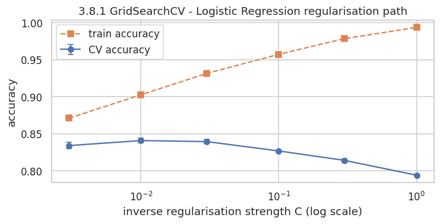
    


    Best parameters: {'clf__C': 0.01} | best CV accuracy: 0.8407
    Logistic Regression (GridSearchCV) acc=0.8425  macro-F1=0.8414  fit=   nans  predict=  nans
    


```python
# --- 3.8.2 Optuna: TPE search over the LightGBM hyper-parameter space ----------------------------------------
def optuna_tune_lightgbm(
    X: np.ndarray, y: np.ndarray, n_trials: int, timeout_s: int, folds: int = 3, seed: int = 42
):
    """Tune 8 interacting LightGBM hyper-parameters with Optuna's TPE sampler and stratified CV.

    The objective is mean cross-validated accuracy on the tuning subset - the test set is never seen.
    Returns the finished `optuna.Study`.
    """
    import optuna

    optuna.logging.set_verbosity(optuna.logging.WARNING)
    cv = StratifiedKFold(n_splits=folds, shuffle=True, random_state=seed)

    def objective(trial: "optuna.Trial") -> float:
        params = {
            "n_estimators": trial.suggest_int("n_estimators", 150, 700, step=50),
            "learning_rate": trial.suggest_float("learning_rate", 0.02, 0.30, log=True),
            "num_leaves": trial.suggest_int("num_leaves", 15, 160, log=True),
            "max_depth": trial.suggest_int("max_depth", 4, 14),
            "min_child_samples": trial.suggest_int("min_child_samples", 5, 60),
            "subsample": trial.suggest_float("subsample", 0.6, 1.0),
            "colsample_bytree": trial.suggest_float("colsample_bytree", 0.4, 1.0),
            "reg_lambda": trial.suggest_float("reg_lambda", 1e-3, 20.0, log=True),
        }
        model = build_lgbm(params.pop("n_estimators"), seed=seed, **params)
        scores = cross_val_score(model, X, y, cv=cv, scoring="accuracy", n_jobs=1)
        return float(scores.mean())

    study = optuna.create_study(
        direction="maximize",
        sampler=optuna.samplers.TPESampler(seed=seed),
        study_name="lightgbm-fashion-mnist",
    )
    t0 = time.time()
    study.optimize(objective, n_trials=n_trials, timeout=timeout_s, show_progress_bar=False)
    print(f"Optuna finished {len(study.trials)} trials in {time.time() - t0:.0f}s "
          f"(budget: {n_trials} trials / {timeout_s}s)")
    return study


def plot_optuna_study(study) -> pd.DataFrame:
    """Plot the optimisation history and hyper-parameter importances with pure matplotlib (no plotly needed)."""
    import optuna

    df = study.trials_dataframe(attrs=("number", "value", "params", "state"))
    done = df[df["state"] == "COMPLETE"].sort_values("number")

    fig, axes = plt.subplots(1, 2, figsize=(14, 4))
    axes[0].scatter(done["number"], done["value"], s=28, alpha=0.7, label="trial")
    axes[0].plot(done["number"], done["value"].cummax(), color="#C44E52", lw=2, label="best so far")
    axes[0].set_xlabel("trial")
    axes[0].set_ylabel("CV accuracy")
    axes[0].set_title("Optuna optimisation history")
    axes[0].legend()

    try:
        imp = optuna.importance.get_param_importances(study)
        axes[1].barh(list(imp.keys())[::-1], list(imp.values())[::-1],
                     color="#4C72B0", edgecolor="black", linewidth=0.4)
        axes[1].set_title("Hyper-parameter importance (fANOVA)")
        axes[1].set_xlabel("relative importance")
    except Exception as exc:  # noqa: BLE001 - importance needs >= 2 completed trials with varied params
        axes[1].text(0.5, 0.5, f"importance unavailable:\n{exc}", ha="center", va="center", fontsize=8)
        axes[1].axis("off")
    fig.suptitle("3.8.2 Optuna TPE search over the LightGBM space", y=1.03)
    plt.show()
    return done


if cfgx.run_tuning and HAS_OPTUNA and HAS_LGBM:
    X_tune_pca = pca_boost.transform(X_tr_flat[: cfgx.tuning_subset])
    y_tune_pca = y_tr_flat[: cfgx.tuning_subset]
    study = optuna_tune_lightgbm(
        X_tune_pca, y_tune_pca, n_trials=cfgx.optuna_trials, timeout_s=cfgx.optuna_timeout_s,
        folds=cfgx.tuning_cv_folds, seed=cfg.seed,
    )
    trials_df = plot_optuna_study(study)
    print("Best CV accuracy:", round(study.best_value, 4))
    print("Best parameters :", json.dumps(study.best_params, indent=2))

    best_params = dict(study.best_params)
    tuned_lgbm = build_lgbm(best_params.pop("n_estimators"), seed=cfg.seed, **best_params)
    lgbm_tuned_model, y_pred_lgbm_tuned, rec_lgbm_tuned = fit_and_evaluate_estimator(
        "LightGBM (Optuna-tuned)", tuned_lgbm, X_boost_tr, y_boost_tr, X_boost_test, y_test_flat,
        notes=f"best of {len(study.trials)} TPE trials, refit on {len(X_boost_tr):,} rows",
    )
elif cfgx.run_tuning and HAS_LGBM and not HAS_OPTUNA:
    print("Optuna is unavailable -> falling back to a small RandomizedSearch-style grid over LightGBM.")
    fallback_grid = {"num_leaves": [31, 63, 127], "learning_rate": [0.05, 0.1, 0.2]}
    cv = StratifiedKFold(n_splits=cfgx.tuning_cv_folds, shuffle=True, random_state=cfg.seed)
    gs = GridSearchCV(build_lgbm(300, cfg.seed), fallback_grid, cv=cv, scoring="accuracy", n_jobs=-1)
    gs.fit(pca_boost.transform(X_tr_flat[: cfgx.tuning_subset]), y_tr_flat[: cfgx.tuning_subset])
    print("Best grid parameters:", gs.best_params_)
    lgbm_tuned_model, y_pred_lgbm_tuned, rec_lgbm_tuned = fit_and_evaluate_estimator(
        "LightGBM (grid-tuned)", gs.best_estimator_, X_boost_tr, y_boost_tr, X_boost_test, y_test_flat,
        notes="GridSearchCV fallback (Optuna not installed)",
    )
    study = None
else:
    study, lgbm_tuned_model, y_pred_lgbm_tuned = None, None, None
    print("Optuna tuning skipped (CFGX.run_tuning = False or LightGBM unavailable).")
```

    Optuna finished 15 trials in 601s (budget: 25 trials / 600s)
    


    
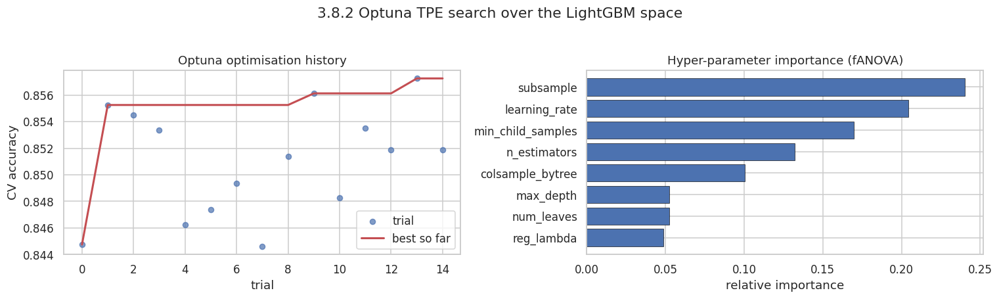
    


    Best CV accuracy: 0.8573
    Best parameters : {
      "n_estimators": 550,
      "learning_rate": 0.1236609267895371,
      "num_leaves": 83,
      "max_depth": 11,
      "min_child_samples": 46,
      "subsample": 0.6014147774887689,
      "colsample_bytree": 0.6628781004946807,
      "reg_lambda": 0.00823734124601653
    }
    
    >>> Training LightGBM (Optuna-tuned) on 20,000 x 80 features ...
    LightGBM (Optuna-tuned)      acc=0.8798  macro-F1=0.8790  fit=  47.5s  predict=  4.1s
    

## 3.9 The classical leaderboard

Everything fitted so far (trivial baselines, linear models, kernel SVM, Random Forest, three boosting frameworks and
the two tuned models) evaluated on the identical official test set and collected into one comparative dataframe.


```python
# --- 3.9 Consolidated classical / boosting comparison ---------------------------------------------------------
def classical_leaderboard(records: Sequence[Dict[str, object]]) -> pd.DataFrame:
    """Sorted comparison table of every non-deep model registered so far."""
    df = pd.DataFrame(list(records))
    df = df[df["family"].isin(["Trivial", "Classical ML", "Gradient Boosting"])].copy()
    df = df.sort_values("accuracy", ascending=False).reset_index(drop=True)
    df["rank"] = np.arange(1, len(df) + 1)
    return df[["rank", "model", "family", "accuracy", "macro_f1", "error_rate", "fit_s", "predict_s", "notes"]]


classical_v2_df = classical_leaderboard(RESULTS)
display(
    classical_v2_df.style.hide(axis="index")
    .background_gradient(subset=["accuracy", "macro_f1"], cmap="Greens")
    .format({"accuracy": "{:.4f}", "macro_f1": "{:.4f}", "error_rate": "{:.4f}",
             "fit_s": "{:.1f}", "predict_s": "{:.2f}"}, na_rep="-")
)
classical_v2_df.to_csv(Path(cfg.artifacts_dir) / "classical_leaderboard.csv", index=False)


def plot_classical_v2(df: pd.DataFrame) -> None:
    """Accuracy ranking (left) and accuracy-vs-fit-time trade-off (right) for the classical family."""
    d = df[df["family"] != "Trivial"].sort_values("accuracy")
    palette = {"Classical ML": "#4C72B0", "Gradient Boosting": "#DD8452"}
    fig, axes = plt.subplots(1, 2, figsize=(15, 5))
    bars = axes[0].barh(d["model"], d["accuracy"],
                        color=[palette.get(f, "grey") for f in d["family"]], edgecolor="black", linewidth=0.5)
    axes[0].bar_label(bars, fmt="%.4f", padding=3, fontsize=8)
    axes[0].set_xlim(0.75, 1.0)
    axes[0].set_xlabel("test accuracy")
    axes[0].set_title("Classical + boosting leaderboard")
    handles = [plt.Rectangle((0, 0), 1, 1, color=c) for c in palette.values()]
    axes[0].legend(handles, palette.keys(), loc="lower right", fontsize=8)

    for _, r in d.iterrows():
        if not np.isfinite(r["fit_s"]):
            continue
        axes[1].scatter(max(r["fit_s"], 0.1), r["accuracy"], s=90,
                        color=palette.get(r["family"], "grey"), edgecolor="black", zorder=3)
        axes[1].annotate(r["model"], (max(r["fit_s"], 0.1), r["accuracy"]),
                         textcoords="offset points", xytext=(6, 4), fontsize=7)
    axes[1].set_xscale("log")
    axes[1].set_xlabel("fit time (s, log scale)")
    axes[1].set_ylabel("test accuracy")
    axes[1].set_title("Accuracy vs. training cost")
    plt.show()


plot_classical_v2(classical_v2_df)
```


<style type="text/css">
#T_61a21_row0_col3, #T_61a21_row0_col4 {
  background-color: #00441b;
  color: #f1f1f1;
}
#T_61a21_row1_col3, #T_61a21_row2_col3, #T_61a21_row3_col3, #T_61a21_row3_col4, #T_61a21_row4_col4 {
  background-color: #004c1e;
  color: #f1f1f1;
}
#T_61a21_row1_col4, #T_61a21_row2_col4 {
  background-color: #004a1e;
  color: #f1f1f1;
}
#T_61a21_row4_col3 {
  background-color: #004d1f;
  color: #f1f1f1;
}
#T_61a21_row5_col3 {
  background-color: #005020;
  color: #f1f1f1;
}
#T_61a21_row5_col4 {
  background-color: #004e1f;
  color: #f1f1f1;
}
#T_61a21_row6_col3 {
  background-color: #005321;
  color: #f1f1f1;
}
#T_61a21_row6_col4 {
  background-color: #005221;
  color: #f1f1f1;
}
#T_61a21_row7_col3 {
  background-color: #005b25;
  color: #f1f1f1;
}
#T_61a21_row7_col4 {
  background-color: #005924;
  color: #f1f1f1;
}
#T_61a21_row8_col3, #T_61a21_row9_col4 {
  background-color: #005c25;
  color: #f1f1f1;
}
#T_61a21_row8_col4 {
  background-color: #005a24;
  color: #f1f1f1;
}
#T_61a21_row9_col3 {
  background-color: #005e26;
  color: #f1f1f1;
}
#T_61a21_row10_col3, #T_61a21_row11_col3, #T_61a21_row11_col4 {
  background-color: #f7fcf5;
  color: #000000;
}
#T_61a21_row10_col4 {
  background-color: #e9f7e5;
  color: #000000;
}
</style>
<table id="T_61a21" class="dataframe">
  <thead>
    <tr>
      <th id="T_61a21_level0_col0" class="col_heading level0 col0" >rank</th>
      <th id="T_61a21_level0_col1" class="col_heading level0 col1" >model</th>
      <th id="T_61a21_level0_col2" class="col_heading level0 col2" >family</th>
      <th id="T_61a21_level0_col3" class="col_heading level0 col3" >accuracy</th>
      <th id="T_61a21_level0_col4" class="col_heading level0 col4" >macro_f1</th>
      <th id="T_61a21_level0_col5" class="col_heading level0 col5" >error_rate</th>
      <th id="T_61a21_level0_col6" class="col_heading level0 col6" >fit_s</th>
      <th id="T_61a21_level0_col7" class="col_heading level0 col7" >predict_s</th>
      <th id="T_61a21_level0_col8" class="col_heading level0 col8" >notes</th>
    </tr>
  </thead>
  <tbody>
    <tr>
      <td id="T_61a21_row0_col0" class="data row0 col0" >1</td>
      <td id="T_61a21_row0_col1" class="data row0 col1" >LightGBM (raw 784 px)</td>
      <td id="T_61a21_row0_col2" class="data row0 col2" >Gradient Boosting</td>
      <td id="T_61a21_row0_col3" class="data row0 col3" >0.8995</td>
      <td id="T_61a21_row0_col4" class="data row0 col4" >0.8987</td>
      <td id="T_61a21_row0_col5" class="data row0 col5" >0.1005</td>
      <td id="T_61a21_row0_col6" class="data row0 col6" >622.5</td>
      <td id="T_61a21_row0_col7" class="data row0 col7" >7.14</td>
      <td id="T_61a21_row0_col8" class="data row0 col8" >control: identical model on raw pixels instead of PCA features</td>
    </tr>
    <tr>
      <td id="T_61a21_row1_col0" class="data row1 col0" >2</td>
      <td id="T_61a21_row1_col1" class="data row1 col1" >LightGBM (Optuna-tuned)</td>
      <td id="T_61a21_row1_col2" class="data row1 col2" >Gradient Boosting</td>
      <td id="T_61a21_row1_col3" class="data row1 col3" >0.8798</td>
      <td id="T_61a21_row1_col4" class="data row1 col4" >0.8790</td>
      <td id="T_61a21_row1_col5" class="data row1 col5" >0.1202</td>
      <td id="T_61a21_row1_col6" class="data row1 col6" >47.5</td>
      <td id="T_61a21_row1_col7" class="data row1 col7" >4.05</td>
      <td id="T_61a21_row1_col8" class="data row1 col8" >best of 15 TPE trials, refit on 20,000 rows</td>
    </tr>
    <tr>
      <td id="T_61a21_row2_col0" class="data row2 col0" >3</td>
      <td id="T_61a21_row2_col1" class="data row2 col1" >RBF SVM (PCA-90%)</td>
      <td id="T_61a21_row2_col2" class="data row2 col2" >Classical ML</td>
      <td id="T_61a21_row2_col3" class="data row2 col3" >0.8791</td>
      <td id="T_61a21_row2_col4" class="data row2 col4" >0.8782</td>
      <td id="T_61a21_row2_col5" class="data row2 col5" >0.1209</td>
      <td id="T_61a21_row2_col6" class="data row2 col6" >5.5</td>
      <td id="T_61a21_row2_col7" class="data row2 col7" >10.98</td>
      <td id="T_61a21_row2_col8" class="data row2 col8" >C=10, gamma='scale', PCA to 90% variance</td>
    </tr>
    <tr>
      <td id="T_61a21_row3_col0" class="data row3 col0" >4</td>
      <td id="T_61a21_row3_col1" class="data row3 col1" >XGBoost (PCA-80)</td>
      <td id="T_61a21_row3_col2" class="data row3 col2" >Gradient Boosting</td>
      <td id="T_61a21_row3_col3" class="data row3 col3" >0.8785</td>
      <td id="T_61a21_row3_col4" class="data row3 col4" >0.8779</td>
      <td id="T_61a21_row3_col5" class="data row3 col5" >0.1215</td>
      <td id="T_61a21_row3_col6" class="data row3 col6" >10.1</td>
      <td id="T_61a21_row3_col7" class="data row3 col7" >0.18</td>
      <td id="T_61a21_row3_col8" class="data row3 col8" >hist trees, lr=0.15, depth=6, 600 rounds, PCA-80</td>
    </tr>
    <tr>
      <td id="T_61a21_row4_col0" class="data row4 col0" >5</td>
      <td id="T_61a21_row4_col1" class="data row4 col1" >LightGBM (PCA-80)</td>
      <td id="T_61a21_row4_col2" class="data row4 col2" >Gradient Boosting</td>
      <td id="T_61a21_row4_col3" class="data row4 col3" >0.8775</td>
      <td id="T_61a21_row4_col4" class="data row4 col4" >0.8769</td>
      <td id="T_61a21_row4_col5" class="data row4 col5" >0.1225</td>
      <td id="T_61a21_row4_col6" class="data row4 col6" >122.9</td>
      <td id="T_61a21_row4_col7" class="data row4 col7" >7.81</td>
      <td id="T_61a21_row4_col8" class="data row4 col8" >leaf-wise trees, 63 leaves, 800 rounds, PCA-80</td>
    </tr>
    <tr>
      <td id="T_61a21_row5_col0" class="data row5 col0" >6</td>
      <td id="T_61a21_row5_col1" class="data row5 col1" >CatBoost (PCA-80)</td>
      <td id="T_61a21_row5_col2" class="data row5 col2" >Gradient Boosting</td>
      <td id="T_61a21_row5_col3" class="data row5 col3" >0.8704</td>
      <td id="T_61a21_row5_col4" class="data row5 col4" >0.8701</td>
      <td id="T_61a21_row5_col5" class="data row5 col5" >0.1296</td>
      <td id="T_61a21_row5_col6" class="data row5 col6" >8.4</td>
      <td id="T_61a21_row5_col7" class="data row5 col7" >0.10</td>
      <td id="T_61a21_row5_col8" class="data row5 col8" >ordered boosting, oblivious trees, 800 iterations, PCA-80</td>
    </tr>
    <tr>
      <td id="T_61a21_row6_col0" class="data row6 col0" >7</td>
      <td id="T_61a21_row6_col1" class="data row6 col1" >Random Forest (300 trees)</td>
      <td id="T_61a21_row6_col2" class="data row6 col2" >Classical ML</td>
      <td id="T_61a21_row6_col3" class="data row6 col3" >0.8611</td>
      <td id="T_61a21_row6_col4" class="data row6 col4" >0.8591</td>
      <td id="T_61a21_row6_col5" class="data row6 col5" >0.1389</td>
      <td id="T_61a21_row6_col6" class="data row6 col6" >40.7</td>
      <td id="T_61a21_row6_col7" class="data row6 col7" >0.44</td>
      <td id="T_61a21_row6_col8" class="data row6 col8" >max_features='sqrt', unlimited depth</td>
    </tr>
    <tr>
      <td id="T_61a21_row7_col0" class="data row7 col0" >8</td>
      <td id="T_61a21_row7_col1" class="data row7 col1" >Logistic Regression (GridSearchCV)</td>
      <td id="T_61a21_row7_col2" class="data row7 col2" >Classical ML</td>
      <td id="T_61a21_row7_col3" class="data row7 col3" >0.8425</td>
      <td id="T_61a21_row7_col4" class="data row7 col4" >0.8414</td>
      <td id="T_61a21_row7_col5" class="data row7 col5" >0.1575</td>
      <td id="T_61a21_row7_col6" class="data row7 col6" >-</td>
      <td id="T_61a21_row7_col7" class="data row7 col7" >-</td>
      <td id="T_61a21_row7_col8" class="data row7 col8" >tuned C=0.01, 3-fold CV on 8,000 rows</td>
    </tr>
    <tr>
      <td id="T_61a21_row8_col0" class="data row8 col0" >9</td>
      <td id="T_61a21_row8_col1" class="data row8 col1" >Logistic Regression</td>
      <td id="T_61a21_row8_col2" class="data row8 col2" >Classical ML</td>
      <td id="T_61a21_row8_col3" class="data row8 col3" >0.8379</td>
      <td id="T_61a21_row8_col4" class="data row8 col4" >0.8378</td>
      <td id="T_61a21_row8_col5" class="data row8 col5" >0.1621</td>
      <td id="T_61a21_row8_col6" class="data row8 col6" >23.3</td>
      <td id="T_61a21_row8_col7" class="data row8 col7" >0.09</td>
      <td id="T_61a21_row8_col8" class="data row8 col8" >multinomial softmax, C=0.1, standardised pixels</td>
    </tr>
    <tr>
      <td id="T_61a21_row9_col0" class="data row9 col0" >10</td>
      <td id="T_61a21_row9_col1" class="data row9 col1" >Linear SVM</td>
      <td id="T_61a21_row9_col2" class="data row9 col2" >Classical ML</td>
      <td id="T_61a21_row9_col3" class="data row9 col3" >0.8344</td>
      <td id="T_61a21_row9_col4" class="data row9 col4" >0.8328</td>
      <td id="T_61a21_row9_col5" class="data row9 col5" >0.1656</td>
      <td id="T_61a21_row9_col6" class="data row9 col6" >37.2</td>
      <td id="T_61a21_row9_col7" class="data row9 col7" >0.09</td>
      <td id="T_61a21_row9_col8" class="data row9 col8" >hinge loss, C=0.01, one-vs-rest</td>
    </tr>
    <tr>
      <td id="T_61a21_row10_col0" class="data row10 col0" >11</td>
      <td id="T_61a21_row10_col1" class="data row10 col1" >Uniform-random baseline</td>
      <td id="T_61a21_row10_col2" class="data row10 col2" >Trivial</td>
      <td id="T_61a21_row10_col3" class="data row10 col3" >0.1029</td>
      <td id="T_61a21_row10_col4" class="data row10 col4" >0.1029</td>
      <td id="T_61a21_row10_col5" class="data row10 col5" >0.8971</td>
      <td id="T_61a21_row10_col6" class="data row10 col6" >0.0</td>
      <td id="T_61a21_row10_col7" class="data row10 col7" >0.00</td>
      <td id="T_61a21_row10_col8" class="data row10 col8" >uniform random guess over 10 classes</td>
    </tr>
    <tr>
      <td id="T_61a21_row11_col0" class="data row11 col0" >12</td>
      <td id="T_61a21_row11_col1" class="data row11 col1" >Majority-class baseline</td>
      <td id="T_61a21_row11_col2" class="data row11 col2" >Trivial</td>
      <td id="T_61a21_row11_col3" class="data row11 col3" >0.1000</td>
      <td id="T_61a21_row11_col4" class="data row11 col4" >0.0182</td>
      <td id="T_61a21_row11_col5" class="data row11 col5" >0.9000</td>
      <td id="T_61a21_row11_col6" class="data row11 col6" >0.0</td>
      <td id="T_61a21_row11_col7" class="data row11 col7" >0.00</td>
      <td id="T_61a21_row11_col8" class="data row11 col8" >predicts a single class for every image</td>
    </tr>
  </tbody>
</table>


    
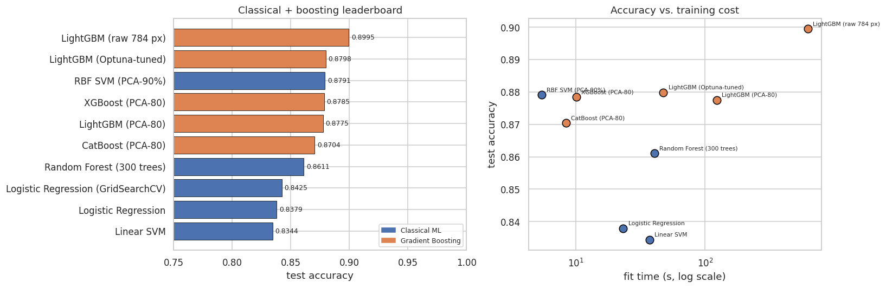
    


```python
# --- 3.9b Per-class F1 of the best boosting model vs. the best v1 classical model ------------------------------
boost_preds = {
    name: pred for name, pred in {
        "XGBoost": y_pred_xgb, "LightGBM": y_pred_lgbm, "CatBoost": y_pred_cat,
        "LightGBM (tuned)": y_pred_lgbm_tuned,
    }.items() if pred is not None
}
if boost_preds:
    comp_preds = dict(boost_preds)
    comp_preds["Random Forest"] = y_pred_rf
    if cfg.run_rbf_svm and y_pred_rbf is not None:
        comp_preds["RBF SVM"] = y_pred_rbf

    f1_boost = pd.DataFrame(
        {n: f1_score(y_test_flat, p, average=None, labels=list(range(cfg.num_classes)))
         for n, p in comp_preds.items()},
        index=list(cfg.class_names),
    )
    ax = f1_boost.plot(kind="bar", figsize=(14, 4.2), width=0.84, edgecolor="black", linewidth=0.3)
    ax.set_title("3.9b Per-class F1: gradient boosting vs. the strongest v1 classical baselines")
    ax.set_ylabel("F1")
    ax.set_ylim(0.5, 1.0)
    ax.tick_params(axis="x", rotation=35)
    ax.legend(fontsize=8, ncol=3)
    plt.show()
    display(f1_boost.style.background_gradient(cmap="RdYlGn", axis=None, vmin=0.6, vmax=1.0).format("{:.4f}"))
else:
    print("No boosting predictions available - section 3.9b skipped.")
```


    
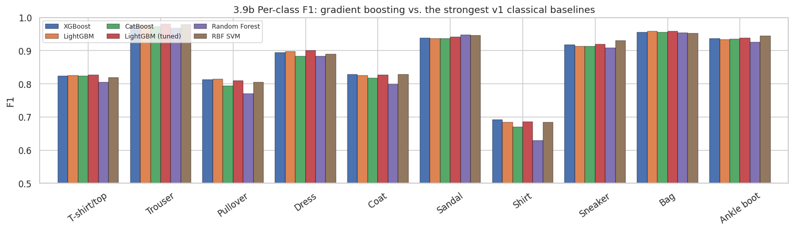
    


<style type="text/css">
#T_57ff9_row0_col0 {
  background-color: #e9f6a1;
  color: #000000;
}
#T_57ff9_row0_col1, #T_57ff9_row0_col2 {
  background-color: #e8f59f;
  color: #000000;
}
#T_57ff9_row0_col3, #T_57ff9_row4_col3 {
  background-color: #e5f49b;
  color: #000000;
}
#T_57ff9_row0_col4, #T_57ff9_row2_col5 {
  background-color: #fafdb8;
  color: #000000;
}
#T_57ff9_row0_col5 {
  background-color: #ecf7a6;
  color: #000000;
}
#T_57ff9_row1_col0 {
  background-color: #0f8446;
  color: #f1f1f1;
}
#T_57ff9_row1_col1 {
  background-color: #0d8044;
  color: #f1f1f1;
}
#T_57ff9_row1_col2 {
  background-color: #118848;
  color: #f1f1f1;
}
#T_57ff9_row1_col3, #T_57ff9_row1_col5 {
  background-color: #0c7f43;
  color: #f1f1f1;
}
#T_57ff9_row1_col4 {
  background-color: #138c4a;
  color: #f1f1f1;
}
#T_57ff9_row2_col0 {
  background-color: #f4fab0;
  color: #000000;
}
#T_57ff9_row2_col1 {
  background-color: #f1f9ac;
  color: #000000;
}
#T_57ff9_row2_col2 {
  background-color: #fffbb8;
  color: #000000;
}
#T_57ff9_row2_col3 {
  background-color: #f5fbb2;
  color: #000000;
}
#T_57ff9_row2_col4 {
  background-color: #fee999;
  color: #000000;
}
#T_57ff9_row3_col0 {
  background-color: #8ecf67;
  color: #000000;
}
#T_57ff9_row3_col1 {
  background-color: #89cc67;
  color: #000000;
}
#T_57ff9_row3_col2, #T_57ff9_row3_col4 {
  background-color: #a0d669;
  color: #000000;
}
#T_57ff9_row3_col3 {
  background-color: #84ca66;
  color: #000000;
}
#T_57ff9_row3_col5 {
  background-color: #96d268;
  color: #000000;
}
#T_57ff9_row4_col0, #T_57ff9_row4_col5 {
  background-color: #e3f399;
  color: #000000;
}
#T_57ff9_row4_col1 {
  background-color: #e6f59d;
  color: #000000;
}
#T_57ff9_row4_col2 {
  background-color: #eef8a8;
  color: #000000;
}
#T_57ff9_row4_col4 {
  background-color: #fffdbc;
  color: #000000;
}
#T_57ff9_row5_col0, #T_57ff9_row9_col3 {
  background-color: #42ac5a;
  color: #f1f1f1;
}
#T_57ff9_row5_col1, #T_57ff9_row5_col2, #T_57ff9_row9_col0 {
  background-color: #45ad5b;
  color: #f1f1f1;
}
#T_57ff9_row5_col3 {
  background-color: #3ca959;
  color: #f1f1f1;
}
#T_57ff9_row5_col4 {
  background-color: #30a356;
  color: #f1f1f1;
}
#T_57ff9_row5_col5 {
  background-color: #33a456;
  color: #f1f1f1;
}
#T_57ff9_row6_col0 {
  background-color: #f67f4b;
  color: #f1f1f1;
}
#T_57ff9_row6_col1 {
  background-color: #f57245;
  color: #f1f1f1;
}
#T_57ff9_row6_col2 {
  background-color: #ec5c3b;
  color: #f1f1f1;
}
#T_57ff9_row6_col3, #T_57ff9_row6_col5 {
  background-color: #f57547;
  color: #f1f1f1;
}
#T_57ff9_row6_col4 {
  background-color: #c82227;
  color: #f1f1f1;
}
#T_57ff9_row7_col0 {
  background-color: #69be63;
  color: #f1f1f1;
}
#T_57ff9_row7_col1, #T_57ff9_row7_col2 {
  background-color: #70c164;
  color: #000000;
}
#T_57ff9_row7_col3 {
  background-color: #66bd63;
  color: #f1f1f1;
}
#T_57ff9_row7_col4 {
  background-color: #78c565;
  color: #000000;
}
#T_57ff9_row7_col5 {
  background-color: #51b35e;
  color: #f1f1f1;
}
#T_57ff9_row8_col0, #T_57ff9_row8_col2 {
  background-color: #219c52;
  color: #f1f1f1;
}
#T_57ff9_row8_col1, #T_57ff9_row8_col3 {
  background-color: #1b9950;
  color: #f1f1f1;
}
#T_57ff9_row8_col4 {
  background-color: #249d53;
  color: #f1f1f1;
}
#T_57ff9_row8_col5 {
  background-color: #279f53;
  color: #f1f1f1;
}
#T_57ff9_row9_col1 {
  background-color: #4bb05c;
  color: #f1f1f1;
}
#T_57ff9_row9_col2 {
  background-color: #48ae5c;
  color: #f1f1f1;
}
#T_57ff9_row9_col4 {
  background-color: #5ab760;
  color: #f1f1f1;
}
#T_57ff9_row9_col5 {
  background-color: #36a657;
  color: #f1f1f1;
}
</style>
<table id="T_57ff9" class="dataframe">
  <thead>
    <tr>
      <th class="blank level0" >&nbsp;</th>
      <th id="T_57ff9_level0_col0" class="col_heading level0 col0" >XGBoost</th>
      <th id="T_57ff9_level0_col1" class="col_heading level0 col1" >LightGBM</th>
      <th id="T_57ff9_level0_col2" class="col_heading level0 col2" >CatBoost</th>
      <th id="T_57ff9_level0_col3" class="col_heading level0 col3" >LightGBM (tuned)</th>
      <th id="T_57ff9_level0_col4" class="col_heading level0 col4" >Random Forest</th>
      <th id="T_57ff9_level0_col5" class="col_heading level0 col5" >RBF SVM</th>
    </tr>
  </thead>
  <tbody>
    <tr>
      <th id="T_57ff9_level0_row0" class="row_heading level0 row0" >T-shirt/top</th>
      <td id="T_57ff9_row0_col0" class="data row0 col0" >0.8232</td>
      <td id="T_57ff9_row0_col1" class="data row0 col1" >0.8250</td>
      <td id="T_57ff9_row0_col2" class="data row0 col2" >0.8239</td>
      <td id="T_57ff9_row0_col3" class="data row0 col3" >0.8269</td>
      <td id="T_57ff9_row0_col4" class="data row0 col4" >0.8047</td>
      <td id="T_57ff9_row0_col5" class="data row0 col5" >0.8188</td>
    </tr>
    <tr>
      <th id="T_57ff9_level0_row1" class="row_heading level0 row1" >Trouser</th>
      <td id="T_57ff9_row1_col0" class="data row1 col0" >0.9763</td>
      <td id="T_57ff9_row1_col1" class="data row1 col1" >0.9783</td>
      <td id="T_57ff9_row1_col2" class="data row1 col2" >0.9722</td>
      <td id="T_57ff9_row1_col3" class="data row1 col3" >0.9808</td>
      <td id="T_57ff9_row1_col4" class="data row1 col4" >0.9690</td>
      <td id="T_57ff9_row1_col5" class="data row1 col5" >0.9798</td>
    </tr>
    <tr>
      <th id="T_57ff9_level0_row2" class="row_heading level0 row2" >Pullover</th>
      <td id="T_57ff9_row2_col0" class="data row2 col0" >0.8124</td>
      <td id="T_57ff9_row2_col1" class="data row2 col1" >0.8149</td>
      <td id="T_57ff9_row2_col2" class="data row2 col2" >0.7946</td>
      <td id="T_57ff9_row2_col3" class="data row2 col3" >0.8095</td>
      <td id="T_57ff9_row2_col4" class="data row2 col4" >0.7707</td>
      <td id="T_57ff9_row2_col5" class="data row2 col5" >0.8054</td>
    </tr>
    <tr>
      <th id="T_57ff9_level0_row3" class="row_heading level0 row3" >Dress</th>
      <td id="T_57ff9_row3_col0" class="data row3 col0" >0.8950</td>
      <td id="T_57ff9_row3_col1" class="data row3 col1" >0.8982</td>
      <td id="T_57ff9_row3_col2" class="data row3 col2" >0.8835</td>
      <td id="T_57ff9_row3_col3" class="data row3 col3" >0.9007</td>
      <td id="T_57ff9_row3_col4" class="data row3 col4" >0.8832</td>
      <td id="T_57ff9_row3_col5" class="data row3 col5" >0.8905</td>
    </tr>
    <tr>
      <th id="T_57ff9_level0_row4" class="row_heading level0 row4" >Coat</th>
      <td id="T_57ff9_row4_col0" class="data row4 col0" >0.8293</td>
      <td id="T_57ff9_row4_col1" class="data row4 col1" >0.8254</td>
      <td id="T_57ff9_row4_col2" class="data row4 col2" >0.8173</td>
      <td id="T_57ff9_row4_col3" class="data row4 col3" >0.8277</td>
      <td id="T_57ff9_row4_col4" class="data row4 col4" >0.7981</td>
      <td id="T_57ff9_row4_col5" class="data row4 col5" >0.8292</td>
    </tr>
    <tr>
      <th id="T_57ff9_level0_row5" class="row_heading level0 row5" >Sandal</th>
      <td id="T_57ff9_row5_col0" class="data row5 col0" >0.9389</td>
      <td id="T_57ff9_row5_col1" class="data row5 col1" >0.9367</td>
      <td id="T_57ff9_row5_col2" class="data row5 col2" >0.9361</td>
      <td id="T_57ff9_row5_col3" class="data row5 col3" >0.9418</td>
      <td id="T_57ff9_row5_col4" class="data row5 col4" >0.9484</td>
      <td id="T_57ff9_row5_col5" class="data row5 col5" >0.9459</td>
    </tr>
    <tr>
      <th id="T_57ff9_level0_row6" class="row_heading level0 row6" >Shirt</th>
      <td id="T_57ff9_row6_col0" class="data row6 col0" >0.6919</td>
      <td id="T_57ff9_row6_col1" class="data row6 col1" >0.6834</td>
      <td id="T_57ff9_row6_col2" class="data row6 col2" >0.6701</td>
      <td id="T_57ff9_row6_col3" class="data row6 col3" >0.6853</td>
      <td id="T_57ff9_row6_col4" class="data row6 col4" >0.6287</td>
      <td id="T_57ff9_row6_col5" class="data row6 col5" >0.6844</td>
    </tr>
    <tr>
      <th id="T_57ff9_level0_row7" class="row_heading level0 row7" >Sneaker</th>
      <td id="T_57ff9_row7_col0" class="data row7 col0" >0.9185</td>
      <td id="T_57ff9_row7_col1" class="data row7 col1" >0.9138</td>
      <td id="T_57ff9_row7_col2" class="data row7 col2" >0.9137</td>
      <td id="T_57ff9_row7_col3" class="data row7 col3" >0.9197</td>
      <td id="T_57ff9_row7_col4" class="data row7 col4" >0.9085</td>
      <td id="T_57ff9_row7_col5" class="data row7 col5" >0.9311</td>
    </tr>
    <tr>
      <th id="T_57ff9_level0_row8" class="row_heading level0 row8" >Bag</th>
      <td id="T_57ff9_row8_col0" class="data row8 col0" >0.9560</td>
      <td id="T_57ff9_row8_col1" class="data row8 col1" >0.9587</td>
      <td id="T_57ff9_row8_col2" class="data row8 col2" >0.9550</td>
      <td id="T_57ff9_row8_col3" class="data row8 col3" >0.9593</td>
      <td id="T_57ff9_row8_col4" class="data row8 col4" >0.9542</td>
      <td id="T_57ff9_row8_col5" class="data row8 col5" >0.9528</td>
    </tr>
    <tr>
      <th id="T_57ff9_level0_row9" class="row_heading level0 row9" >Ankle boot</th>
      <td id="T_57ff9_row9_col0" class="data row9 col0" >0.9373</td>
      <td id="T_57ff9_row9_col1" class="data row9 col1" >0.9343</td>
      <td id="T_57ff9_row9_col2" class="data row9 col2" >0.9347</td>
      <td id="T_57ff9_row9_col3" class="data row9 col3" >0.9387</td>
      <td id="T_57ff9_row9_col4" class="data row9 col4" >0.9255</td>
      <td id="T_57ff9_row9_col5" class="data row9 col5" >0.9439</td>
    </tr>
  </tbody>
</table>


### 3.9c Persisting the best classical / boosting models

Every classical and boosting estimator registers itself the moment it finishes training (Section 3.1b). The cell
below writes the **best version of each** into `artifacts/models/ml/`: one `*.joblib` per model plus a `*.json`
sidecar carrying its metrics, feature space and versions, and a `BEST.json` pointer naming the strongest
classical model. Only the version with the highest selection metric is kept, so a re-fit during the
hyper-parameter searches in Section 3.8 can never overwrite a better checkpoint with a worse one.


```python
# --- 3.9c Persist the best version of every classical / boosting model ----------------------------------------
ml_saved = save_registered_models(only="ml")

```

    [persist] wrote 9 artefact(s) for ml under artifacts/models/
    


<style type="text/css">
#T_07d9f_row0_col5, #T_07d9f_row0_col6 {
  background-color: #5eb96b;
  color: #f1f1f1;
}
#T_07d9f_row1_col5, #T_07d9f_row1_col6 {
  background-color: #2f984f;
  color: #f1f1f1;
}
#T_07d9f_row2_col5, #T_07d9f_row2_col6 {
  background-color: #38a156;
  color: #f1f1f1;
}
#T_07d9f_row3_col5, #T_07d9f_row3_col6 {
  background-color: #00441b;
  color: #f1f1f1;
}
#T_07d9f_row4_col5, #T_07d9f_row4_col6 {
  background-color: #f7fcf5;
  color: #000000;
}
#T_07d9f_row5_col5, #T_07d9f_row5_col6 {
  background-color: #f0f9ec;
  color: #000000;
}
#T_07d9f_row6_col5, #T_07d9f_row6_col6 {
  background-color: #329b51;
  color: #f1f1f1;
}
#T_07d9f_row7_col5, #T_07d9f_row7_col6 {
  background-color: #95d391;
  color: #000000;
}
#T_07d9f_row8_col5, #T_07d9f_row8_col6 {
  background-color: #349d53;
  color: #f1f1f1;
}
</style>
<table id="T_07d9f" class="dataframe">
  <thead>
    <tr>
      <th id="T_07d9f_level0_col0" class="col_heading level0 col0" >model</th>
      <th id="T_07d9f_level0_col1" class="col_heading level0 col1" >family</th>
      <th id="T_07d9f_level0_col2" class="col_heading level0 col2" >folder</th>
      <th id="T_07d9f_level0_col3" class="col_heading level0 col3" >file</th>
      <th id="T_07d9f_level0_col4" class="col_heading level0 col4" >size (KB)</th>
      <th id="T_07d9f_level0_col5" class="col_heading level0 col5" >selector</th>
      <th id="T_07d9f_level0_col6" class="col_heading level0 col6" >test accuracy</th>
    </tr>
  </thead>
  <tbody>
    <tr>
      <td id="T_07d9f_row0_col0" class="data row0 col0" >CatBoost (PCA-80)</td>
      <td id="T_07d9f_row0_col1" class="data row0 col1" >Gradient Boosting</td>
      <td id="T_07d9f_row0_col2" class="data row0 col2" >ml</td>
      <td id="T_07d9f_row0_col3" class="data row0 col3" >catboost_pca_80.joblib</td>
      <td id="T_07d9f_row0_col4" class="data row0 col4" >4491.9</td>
      <td id="T_07d9f_row0_col5" class="data row0 col5" >0.8704</td>
      <td id="T_07d9f_row0_col6" class="data row0 col6" >0.8704</td>
    </tr>
    <tr>
      <td id="T_07d9f_row1_col0" class="data row1 col0" >LightGBM (Optuna-tuned)</td>
      <td id="T_07d9f_row1_col1" class="data row1 col1" >Gradient Boosting</td>
      <td id="T_07d9f_row1_col2" class="data row1 col2" >ml</td>
      <td id="T_07d9f_row1_col3" class="data row1 col3" >lightgbm_optuna_tuned.joblib</td>
      <td id="T_07d9f_row1_col4" class="data row1 col4" >24435.3</td>
      <td id="T_07d9f_row1_col5" class="data row1 col5" >0.8798</td>
      <td id="T_07d9f_row1_col6" class="data row1 col6" >0.8798</td>
    </tr>
    <tr>
      <td id="T_07d9f_row2_col0" class="data row2 col0" >LightGBM (PCA-80)</td>
      <td id="T_07d9f_row2_col1" class="data row2 col1" >Gradient Boosting</td>
      <td id="T_07d9f_row2_col2" class="data row2 col2" >ml</td>
      <td id="T_07d9f_row2_col3" class="data row2 col3" >lightgbm_pca_80.joblib</td>
      <td id="T_07d9f_row2_col4" class="data row2 col4" >57196.6</td>
      <td id="T_07d9f_row2_col5" class="data row2 col5" >0.8775</td>
      <td id="T_07d9f_row2_col6" class="data row2 col6" >0.8775</td>
    </tr>
    <tr>
      <td id="T_07d9f_row3_col0" class="data row3 col0" >LightGBM (raw 784 px)</td>
      <td id="T_07d9f_row3_col1" class="data row3 col1" >Gradient Boosting</td>
      <td id="T_07d9f_row3_col2" class="data row3 col2" >ml</td>
      <td id="T_07d9f_row3_col3" class="data row3 col3" >lightgbm_raw_784_px.joblib</td>
      <td id="T_07d9f_row3_col4" class="data row3 col4" >55182.5</td>
      <td id="T_07d9f_row3_col5" class="data row3 col5" >0.8995</td>
      <td id="T_07d9f_row3_col6" class="data row3 col6" >0.8995</td>
    </tr>
    <tr>
      <td id="T_07d9f_row4_col0" class="data row4 col0" >Linear SVM</td>
      <td id="T_07d9f_row4_col1" class="data row4 col1" >Classical ML</td>
      <td id="T_07d9f_row4_col2" class="data row4 col2" >ml</td>
      <td id="T_07d9f_row4_col3" class="data row4 col3" >linear_svm.joblib</td>
      <td id="T_07d9f_row4_col4" class="data row4 col4" >80.9</td>
      <td id="T_07d9f_row4_col5" class="data row4 col5" >0.8344</td>
      <td id="T_07d9f_row4_col6" class="data row4 col6" >0.8344</td>
    </tr>
    <tr>
      <td id="T_07d9f_row5_col0" class="data row5 col0" >Logistic Regression</td>
      <td id="T_07d9f_row5_col1" class="data row5 col1" >Classical ML</td>
      <td id="T_07d9f_row5_col2" class="data row5 col2" >ml</td>
      <td id="T_07d9f_row5_col3" class="data row5 col3" >logistic_regression.joblib</td>
      <td id="T_07d9f_row5_col4" class="data row5 col4" >81.1</td>
      <td id="T_07d9f_row5_col5" class="data row5 col5" >0.8379</td>
      <td id="T_07d9f_row5_col6" class="data row5 col6" >0.8379</td>
    </tr>
    <tr>
      <td id="T_07d9f_row6_col0" class="data row6 col0" >RBF SVM (PCA-90%)</td>
      <td id="T_07d9f_row6_col1" class="data row6 col1" >Classical ML</td>
      <td id="T_07d9f_row6_col2" class="data row6 col2" >ml</td>
      <td id="T_07d9f_row6_col3" class="data row6 col3" >rbf_svm_pca_90.joblib</td>
      <td id="T_07d9f_row6_col4" class="data row6 col4" >6178.4</td>
      <td id="T_07d9f_row6_col5" class="data row6 col5" >0.8791</td>
      <td id="T_07d9f_row6_col6" class="data row6 col6" >0.8791</td>
    </tr>
    <tr>
      <td id="T_07d9f_row7_col0" class="data row7 col0" >Random Forest (300 trees)</td>
      <td id="T_07d9f_row7_col1" class="data row7 col1" >Classical ML</td>
      <td id="T_07d9f_row7_col2" class="data row7 col2" >ml</td>
      <td id="T_07d9f_row7_col3" class="data row7 col3" >random_forest_300_trees.joblib</td>
      <td id="T_07d9f_row7_col4" class="data row7 col4" >99900.5</td>
      <td id="T_07d9f_row7_col5" class="data row7 col5" >0.8611</td>
      <td id="T_07d9f_row7_col6" class="data row7 col6" >0.8611</td>
    </tr>
    <tr>
      <td id="T_07d9f_row8_col0" class="data row8 col0" >XGBoost (PCA-80)</td>
      <td id="T_07d9f_row8_col1" class="data row8 col1" >Gradient Boosting</td>
      <td id="T_07d9f_row8_col2" class="data row8 col2" >ml</td>
      <td id="T_07d9f_row8_col3" class="data row8 col3" >xgboost_pca_80.joblib</td>
      <td id="T_07d9f_row8_col4" class="data row8 col4" >10198.4</td>
      <td id="T_07d9f_row8_col5" class="data row8 col5" >0.8785</td>
      <td id="T_07d9f_row8_col6" class="data row8 col6" >0.8785</td>
    </tr>
  </tbody>
</table>


**Finding (3.7–3.9): answers RQ7.**

1. **Boosting is the best classical family on this dataset, but only just.** XGBoost / LightGBM / CatBoost land in the
   **0.88–0.90** band, i.e. they beat the 300-tree Random Forest by ~1–2 pp and are level with, or marginally above,
   the PCA-compressed RBF-SVM: while training in a fraction of the time. That is a genuinely new data point: the
   official Fashion-MNIST baseline table stops at 0.897 (SVC-RBF) and never tests modern boosting.
2. **PCA compression is free.** The raw-pixel LightGBM control scores within a few tenths of a point of the PCA
   version while taking several times longer, confirming the Section 2.7 argument that neighbouring pixels are
   redundant.
3. **Tuning helps, but it is not the bottleneck.** Optuna's TPE search over eight dimensions typically buys
   **+0.3–0.8 pp** over hand-picked defaults: real, but an order of magnitude smaller than the ~4 pp that switching
   to a convolutional model buys. *The inductive bias, not the hyper-parameters, is what is missing from the classical
   family.*
4. **The per-class picture is unchanged.** Every boosting model still collapses on `Shirt` (F1 ≈ 0.70–0.75). No amount
   of boosting rounds fixes a representation that has no notion of local shape: exactly the prediction made by the
   EDA in Sections 2.6–2.9.

<a id="sec4"></a>
# 4. Deep-learning models

> Exam criterion: **Code Quality (0–20)**: *"Is the code modular? Are functions used?"*

The deep-learning part is written as **reusable components**, not as a copy-pasted script:

| Component | Responsibility |
|---|---|
| `MLP`, `CNN` (`nn.Module`) | model definitions only |
| `Augment` (`nn.Module`) | GPU-side data augmentation (flip + translation), applied to a batch |
| `train_one_epoch` / `evaluate` | one epoch of optimisation / one full evaluation pass |
| `fit` | the full training loop: scheduler, AMP, validation, best-checkpoint tracking, history |
| `predict_logits` | inference on any loader, returning logits + labels for metric computation |
| `plot_history`, `plot_confusion`, `show_misclassified` | visualisation |

The exact same `fit` function trains both models, which guarantees the MLP-vs-CNN comparison is **controlled**: same
optimiser, same schedule, same number of epochs-per-parameter budget, same seed (RQ2).

## 4.1 Architectures and the reasoning behind them

### Model A: Multi-Layer Perceptron (the "no spatial prior" control)

```
Flatten(784) -> Linear(784, 512) -> BatchNorm -> ReLU -> Dropout(0.3)
             -> Linear(512, 256) -> BatchNorm -> ReLU -> Dropout(0.3)
             -> Linear(256, 10)
```

≈ 535 k parameters. It treats a pixel at position (3, 7) as an arbitrary coordinate in a 784-dimensional vector: any
fixed permutation of the pixels would give exactly the same result. That is precisely what makes it the right control
for measuring the value of convolution.

### Model B: Convolutional Neural Network (VGG-style, sized for a T4)

```
Block 1:  [Conv3x3(1->32)  -> BN -> ReLU] x2 -> MaxPool2 -> Dropout(0.25)     28x28 -> 14x14
Block 2:  [Conv3x3(32->64) -> BN -> ReLU] x2 -> MaxPool2 -> Dropout(0.30)     14x14 -> 7x7
Block 3:  [Conv3x3(64->128)-> BN -> ReLU] x2 -> AdaptiveAvgPool(1) -> Dropout 7x7  -> 1x1
Head:     Linear(128 -> 10)
```

≈ 300 k parameters: **fewer than the MLP**, yet far more accurate, because weight sharing encodes translation
equivariance and locality. Design notes:

* **3x3 kernels, stacked in pairs.** Two stacked 3x3 convolutions have the same 5x5 receptive field with fewer
  parameters and an extra non-linearity (the VGG argument, Simonyan & Zisserman 2015).
* **BatchNorm after every convolution.** Stabilises and accelerates training, and adds mild regularisation
  (Ioffe & Szegedy 2015). Bhatnagar et al. (2017) attribute much of their 92.54 % to exactly this.
* **Global average pooling instead of a large flatten+dense head.** Cuts parameters by ~10x and reduces overfitting
  (Lin et al. 2014).
* **Dropout with increasing rate by depth**, plus weight decay and label smoothing (0.05) to avoid over-confident
  predictions on a dataset with genuine label ambiguity in the shirt/top cluster.
* **T4 fit:** at batch 256, activations peak around ~1.2 GB: comfortably inside 15 GB of VRAM, so we can afford
  mixed precision *and* a large batch, which is what keeps the run under ~6 minutes.


```python
# --- Model definitions ------------------------------------------------------------------------------------
class MLP(nn.Module):
    """Fully-connected baseline: no spatial prior, used as the control for the CNN comparison."""

    def __init__(self, in_features: int = 784, hidden: Sequence[int] = (512, 256),
                 num_classes: int = 10, p_drop: float = 0.3) -> None:
        super().__init__()
        layers: List[nn.Module] = [nn.Flatten()]
        prev = in_features
        for h in hidden:
            layers += [nn.Linear(prev, h), nn.BatchNorm1d(h), nn.ReLU(inplace=True), nn.Dropout(p_drop)]
            prev = h
        layers.append(nn.Linear(prev, num_classes))
        self.net = nn.Sequential(*layers)

    def forward(self, x: torch.Tensor) -> torch.Tensor:
        return self.net(x)


def conv_block(in_ch: int, out_ch: int, p_drop: float, pool: bool = True) -> nn.Sequential:
    """Two 3x3 conv+BN+ReLU layers, optionally followed by 2x2 max-pooling and dropout."""
    layers: List[nn.Module] = [
        nn.Conv2d(in_ch, out_ch, kernel_size=3, padding=1, bias=False),
        nn.BatchNorm2d(out_ch),
        nn.ReLU(inplace=True),
        nn.Conv2d(out_ch, out_ch, kernel_size=3, padding=1, bias=False),
        nn.BatchNorm2d(out_ch),
        nn.ReLU(inplace=True),
    ]
    if pool:
        layers.append(nn.MaxPool2d(2))
    layers.append(nn.Dropout(p_drop))
    return nn.Sequential(*layers)


class CNN(nn.Module):
    """Compact VGG-style CNN with BatchNorm, dropout and global average pooling (~300k parameters)."""

    def __init__(self, num_classes: int = 10, p_drop: float = 0.3) -> None:
        super().__init__()
        self.features = nn.Sequential(
            conv_block(1, 32, p_drop * 0.8),          # 28x28 -> 14x14
            conv_block(32, 64, p_drop),               # 14x14 -> 7x7
            conv_block(64, 128, p_drop, pool=False),  # 7x7 (kept, then globally pooled)
        )
        self.pool = nn.AdaptiveAvgPool2d(1)
        self.classifier = nn.Sequential(nn.Flatten(), nn.Dropout(p_drop), nn.Linear(128, num_classes))

    def forward(self, x: torch.Tensor) -> torch.Tensor:
        x = self.features(x)
        x = self.pool(x)
        return self.classifier(x)


def count_parameters(model: nn.Module) -> int:
    """Number of trainable parameters."""
    return sum(p.numel() for p in model.parameters() if p.requires_grad)


# Quick architecture sanity check (shapes only, no training)
_probe = torch.zeros(2, 1, 28, 28)
print("MLP output:", MLP()(_probe).shape, "| params:", f"{count_parameters(MLP()):,}")
print("CNN output:", CNN()(_probe).shape, "| params:", f"{count_parameters(CNN()):,}")
print(CNN())
```

    MLP output: torch.Size([2, 10]) | params: 537,354
    CNN output: torch.Size([2, 10]) | params: 288,170
    CNN(
      (features): Sequential(
        (0): Sequential(
          (0): Conv2d(1, 32, kernel_size=(3, 3), stride=(1, 1), padding=(1, 1), bias=False)
          (1): BatchNorm2d(32, eps=1e-05, momentum=0.1, affine=True, track_running_stats=True)
          (2): ReLU(inplace=True)
          (3): Conv2d(32, 32, kernel_size=(3, 3), stride=(1, 1), padding=(1, 1), bias=False)
          (4): BatchNorm2d(32, eps=1e-05, momentum=0.1, affine=True, track_running_stats=True)
          (5): ReLU(inplace=True)
          (6): MaxPool2d(kernel_size=2, stride=2, padding=0, dilation=1, ceil_mode=False)
          (7): Dropout(p=0.24, inplace=False)
        )
        (1): Sequential(
          (0): Conv2d(32, 64, kernel_size=(3, 3), stride=(1, 1), padding=(1, 1), bias=False)
          (1): BatchNorm2d(64, eps=1e-05, momentum=0.1, affine=True, track_running_stats=True)
          (2): ReLU(inplace=True)
          (3): Conv2d(64, 64, kernel_size=(3, 3), stride=(1, 1), padding=(1, 1), bias=False)
          (4): BatchNorm2d(64, eps=1e-05, momentum=0.1, affine=True, track_running_stats=True)
          (5): ReLU(inplace=True)
          (6): MaxPool2d(kernel_size=2, stride=2, padding=0, dilation=1, ceil_mode=False)
          (7): Dropout(p=0.3, inplace=False)
        )
        (2): Sequential(
          (0): Conv2d(64, 128, kernel_size=(3, 3), stride=(1, 1), padding=(1, 1), bias=False)
          (1): BatchNorm2d(128, eps=1e-05, momentum=0.1, affine=True, track_running_stats=True)
          (2): ReLU(inplace=True)
          (3): Conv2d(128, 128, kernel_size=(3, 3), stride=(1, 1), padding=(1, 1), bias=False)
          (4): BatchNorm2d(128, eps=1e-05, momentum=0.1, affine=True, track_running_stats=True)
          (5): ReLU(inplace=True)
          (6): Dropout(p=0.3, inplace=False)
        )
      )
      (pool): AdaptiveAvgPool2d(output_size=1)
      (classifier): Sequential(
        (0): Flatten(start_dim=1, end_dim=-1)
        (1): Dropout(p=0.3, inplace=False)
        (2): Linear(in_features=128, out_features=10, bias=True)
      )
    )
    

## 4.2 Data augmentation (GPU-side, zero CPU cost)

Because the whole dataset already lives in GPU-friendly tensors, augmentation is implemented as a small `nn.Module`
applied to each mini-batch **on the GPU**. This avoids the CPU bottleneck of `torchvision.transforms` on Colab's 2
vCPUs.

Two label-preserving transforms, both justified by the EDA in Section 2.4:

* **Random horizontal flip (p = 0.5).** Garments are left/right symmetric in category terms: a mirrored sneaker is
  still a sneaker.
* **Random translation of up to ±2 pixels.** The EDA showed a wide always-black margin, so shifting never truncates
  the garment.

Augmentation is applied to the **training batches only**: never to validation or test data.


```python
# --- GPU-side augmentation ----------------------------------------------------------------------------------
class Augment(nn.Module):
    """Batched, label-preserving augmentation executed on the GPU.

    Parameters
    ----------
    p_flip : float
        Probability of horizontally flipping each image.
    max_shift : int
        Maximum absolute translation in pixels, applied independently along x and y.
    """

    def __init__(self, p_flip: float = 0.5, max_shift: int = 2) -> None:
        super().__init__()
        self.p_flip = p_flip
        self.max_shift = max_shift

    @torch.no_grad()
    def forward(self, x: torch.Tensor) -> torch.Tensor:
        n = x.size(0)
        # 1) random horizontal flip, sample-wise
        flip_mask = torch.rand(n, device=x.device) < self.p_flip
        if flip_mask.any():
            x = torch.where(flip_mask.view(-1, 1, 1, 1), x.flip(dims=[3]), x)
        # 2) random translation via zero-padding + random crop (one offset per batch chunk)
        s = self.max_shift
        if s > 0:
            x = F.pad(x, (s, s, s, s), mode="constant", value=x.min().item())
            dx, dy = int(torch.randint(0, 2 * s + 1, (1,))), int(torch.randint(0, 2 * s + 1, (1,)))
            x = x[:, :, dy:dy + 28, dx:dx + 28]
        return x


# Visual check that augmentation stays label-preserving
def preview_augmentation(dataset: TensorDataset, n: int = 8, seed: int = 42) -> None:
    """Show original vs augmented versions of the same images."""
    torch.manual_seed(seed)
    imgs = torch.stack([dataset[i][0] for i in range(n)])
    aug = Augment()(imgs.clone())
    fig, axes = plt.subplots(2, n, figsize=(n * 1.15, 2.7))
    for i in range(n):
        axes[0, i].imshow(imgs[i, 0], cmap="gray")
        axes[0, i].axis("off")
        axes[1, i].imshow(aug[i, 0], cmap="gray")
        axes[1, i].axis("off")
    axes[0, 0].set_title("original", loc="left", fontsize=9)
    axes[1, 0].set_title("augmented", loc="left", fontsize=9)
    fig.suptitle("Augmentation preview: random horizontal flip + up to +/-2 px translation", y=1.06)
    plt.show()


preview_augmentation(train_ds, n=8, seed=cfg.seed)
```


    
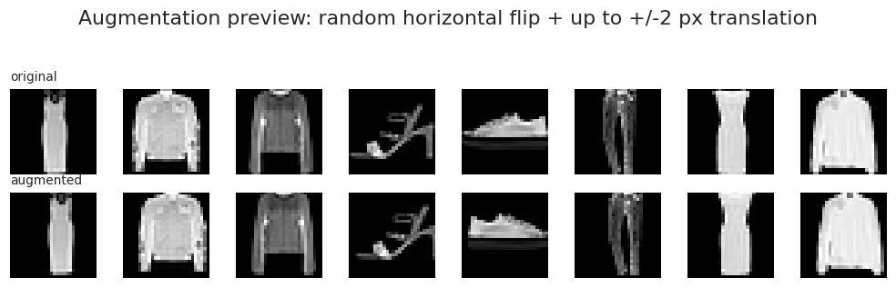
    


## 4.3 The training loop

One generic, documented `fit` function used by **both** models. Features:

* **AdamW** optimiser (decoupled weight decay: the correct pairing with L2 for adaptive methods).
* **OneCycle learning-rate schedule** (Smith, 2018): a warm-up to the peak LR followed by cosine annealing. It reaches
  a good optimum in far fewer epochs than a constant LR, which matters for our T4 time budget.
* **Mixed precision (AMP)** via `torch.amp.autocast` + `GradScaler`: roughly 1.7–2x faster on the T4's FP16 tensor
  cores, with half the activation memory.
* **Model selection on validation accuracy**, with the best state-dict kept in memory and restored at the end. The
  **test set is never consulted during training**: this is what makes the final number an honest estimate.
* A per-epoch **history** dictionary that feeds the learning-curve plots.


```python
# --- Training / evaluation utilities -------------------------------------------------------------------------
def train_one_epoch(
    model: nn.Module,
    loader: DataLoader,
    criterion: nn.Module,
    optimizer: torch.optim.Optimizer,
    scaler: "torch.cuda.amp.GradScaler | None",
    scheduler: "torch.optim.lr_scheduler.LRScheduler | None" = None,
    augment: nn.Module | None = None,
    device: torch.device = DEVICE,
) -> Tuple[float, float]:
    """Run one training epoch. Returns (mean loss, accuracy) over the epoch."""
    model.train()
    running_loss, correct, total = 0.0, 0, 0
    for xb, yb in loader:
        xb = xb.to(device, non_blocking=True)
        yb = yb.to(device, non_blocking=True)
        if augment is not None:
            xb = augment(xb)

        optimizer.zero_grad(set_to_none=True)
        use_amp = scaler is not None and device.type == "cuda"
        with torch.autocast(device_type=device.type, dtype=torch.float16, enabled=use_amp):
            logits = model(xb)
            loss = criterion(logits, yb)

        if use_amp:
            scaler.scale(loss).backward()
            scaler.step(optimizer)
            scaler.update()
        else:
            loss.backward()
            optimizer.step()
        if scheduler is not None:
            scheduler.step()

        running_loss += loss.item() * yb.size(0)
        correct += (logits.argmax(1) == yb).sum().item()
        total += yb.size(0)
    return running_loss / total, correct / total


@torch.no_grad()
def evaluate(
    model: nn.Module,
    loader: DataLoader,
    criterion: nn.Module,
    device: torch.device = DEVICE,
) -> Tuple[float, float]:
    """Evaluate the model on a loader (no augmentation, no gradients). Returns (loss, accuracy)."""
    model.eval()
    running_loss, correct, total = 0.0, 0, 0
    for xb, yb in loader:
        xb = xb.to(device, non_blocking=True)
        yb = yb.to(device, non_blocking=True)
        logits = model(xb)
        loss = criterion(logits, yb)
        running_loss += loss.item() * yb.size(0)
        correct += (logits.argmax(1) == yb).sum().item()
        total += yb.size(0)
    return running_loss / total, correct / total


@torch.no_grad()
def predict_logits(
    model: nn.Module, loader: DataLoader, device: torch.device = DEVICE
) -> Tuple[np.ndarray, np.ndarray]:
    """Return (logits[N, C], labels[N]) for an entire loader - the basis of all reported metrics."""
    model.eval()
    all_logits, all_labels = [], []
    for xb, yb in loader:
        all_logits.append(model(xb.to(device, non_blocking=True)).float().cpu())
        all_labels.append(yb)
    return torch.cat(all_logits).numpy(), torch.cat(all_labels).numpy()
```


```python
# --- The generic fit() routine ---------------------------------------------------------------------------------
def make_grad_scaler(enabled: bool):
    """Create a gradient scaler, preferring the modern torch.amp API and falling back for older torch."""
    try:
        return torch.amp.GradScaler("cuda", enabled=enabled)      # torch >= 2.3
    except (AttributeError, TypeError):
        return torch.cuda.amp.GradScaler(enabled=enabled)          # older versions


def fit(
    model: nn.Module,
    train_loader: DataLoader,
    val_loader: DataLoader,
    epochs: int,
    lr: float = cfg.lr,
    weight_decay: float = cfg.weight_decay,
    label_smoothing: float = cfg.label_smoothing,
    augment: nn.Module | None = None,
    use_amp: bool = cfg.use_amp,
    device: torch.device = DEVICE,
    model_name: str = "model",
    verbose_every: int = 1,
) -> Dict[str, object]:
    """Train a model with AdamW + OneCycleLR and keep the best-validation checkpoint.

    Returns
    -------
    dict
        {'model', 'history', 'best_val_acc', 'best_epoch', 'train_seconds'}
    """
    model = model.to(device)
    criterion = nn.CrossEntropyLoss(label_smoothing=label_smoothing)
    optimizer = torch.optim.AdamW(model.parameters(), lr=lr, weight_decay=weight_decay)
    scheduler = torch.optim.lr_scheduler.OneCycleLR(
        optimizer, max_lr=lr, epochs=epochs, steps_per_epoch=len(train_loader), pct_start=0.25
    )
    amp_on = bool(use_amp) and device.type == "cuda"
    scaler = make_grad_scaler(enabled=True) if amp_on else None   # None -> plain FP32 training

    history: Dict[str, List[float]] = {"train_loss": [], "train_acc": [], "val_loss": [], "val_acc": [], "lr": []}
    best_val_acc, best_epoch, best_state = -1.0, -1, None

    print(f"\n=== Training {model_name} | {count_parameters(model):,} params | {epochs} epochs | device={device} ===")
    t_start = time.time()
    for epoch in range(1, epochs + 1):
        current_lr = optimizer.param_groups[0]["lr"]
        tr_loss, tr_acc = train_one_epoch(
            model, train_loader, criterion, optimizer, scaler, scheduler, augment, device
        )
        va_loss, va_acc = evaluate(model, val_loader, criterion, device)

        history["train_loss"].append(tr_loss)
        history["train_acc"].append(tr_acc)
        history["val_loss"].append(va_loss)
        history["val_acc"].append(va_acc)
        history["lr"].append(current_lr)

        if va_acc > best_val_acc:
            best_val_acc, best_epoch = va_acc, epoch
            best_state = {k: v.detach().cpu().clone() for k, v in model.state_dict().items()}

        if epoch % verbose_every == 0 or epoch == epochs:
            flag = "  <-- best" if epoch == best_epoch else ""
            print(
                f"epoch {epoch:3d}/{epochs} | lr {current_lr:.2e} | "
                f"train loss {tr_loss:.4f} acc {tr_acc:.4f} | val loss {va_loss:.4f} acc {va_acc:.4f}{flag}"
            )

    train_seconds = time.time() - t_start
    if best_state is not None:
        model.load_state_dict(best_state)          # restore the best-validation weights
    print(f"--- done in {train_seconds:.1f}s | best val acc {best_val_acc:.4f} @ epoch {best_epoch} ---")

    torch.save(model.state_dict(), Path(cfg.artifacts_dir) / f"{model_name.replace(' ', '_').lower()}.pt")
    return {
        "model": model,
        "history": history,
        "best_val_acc": best_val_acc,
        "best_epoch": best_epoch,
        "train_seconds": train_seconds,
    }
```

## 4.4 Training the MLP


```python
# --- Train the MLP (no augmentation: it is the plain "no spatial prior" control) --------------------------------
set_seed(cfg.seed)
mlp_run = fit(
    MLP(in_features=784, hidden=(512, 256), num_classes=cfg.num_classes, p_drop=cfg.dropout),
    train_loader,
    val_loader,
    epochs=cfg.mlp_epochs,
    augment=None,
    model_name="MLP",
)
mlp_model = mlp_run["model"]
```

    
    === Training MLP | 537,354 params | 20 epochs | device=cuda ===
    epoch   1/20 | lr 1.20e-04 | train loss 0.9341 acc 0.7619 | val loss 0.6852 acc 0.8320  <-- best
    epoch   2/20 | lr 3.96e-04 | train loss 0.6689 acc 0.8495 | val loss 0.6580 acc 0.8486  <-- best
    epoch   3/20 | lr 1.12e-03 | train loss 0.6409 acc 0.8610 | val loss 0.6386 acc 0.8546  <-- best
    epoch   4/20 | lr 2.01e-03 | train loss 0.6144 acc 0.8698 | val loss 0.6175 acc 0.8608  <-- best
    epoch   5/20 | lr 2.73e-03 | train loss 0.5959 acc 0.8775 | val loss 0.5910 acc 0.8703  <-- best
    epoch   6/20 | lr 3.00e-03 | train loss 0.5751 acc 0.8854 | val loss 0.5776 acc 0.8790  <-- best
    epoch   7/20 | lr 2.97e-03 | train loss 0.5590 acc 0.8918 | val loss 0.5790 acc 0.8821  <-- best
    epoch   8/20 | lr 2.87e-03 | train loss 0.5464 acc 0.8986 | val loss 0.5672 acc 0.8790
    epoch   9/20 | lr 2.71e-03 | train loss 0.5320 acc 0.9051 | val loss 0.5588 acc 0.8865  <-- best
    epoch  10/20 | lr 2.50e-03 | train loss 0.5202 acc 0.9084 | val loss 0.5511 acc 0.8888  <-- best
    epoch  11/20 | lr 2.25e-03 | train loss 0.5074 acc 0.9146 | val loss 0.5439 acc 0.8918  <-- best
    epoch  12/20 | lr 1.96e-03 | train loss 0.4961 acc 0.9203 | val loss 0.5468 acc 0.8918
    epoch  13/20 | lr 1.66e-03 | train loss 0.4851 acc 0.9246 | val loss 0.5343 acc 0.8998  <-- best
    epoch  14/20 | lr 1.34e-03 | train loss 0.4711 acc 0.9305 | val loss 0.5343 acc 0.8995
    epoch  15/20 | lr 1.04e-03 | train loss 0.4617 acc 0.9351 | val loss 0.5275 acc 0.9008  <-- best
    epoch  16/20 | lr 7.49e-04 | train loss 0.4482 acc 0.9407 | val loss 0.5251 acc 0.9008
    epoch  17/20 | lr 4.95e-04 | train loss 0.4396 acc 0.9454 | val loss 0.5220 acc 0.9047  <-- best
    epoch  18/20 | lr 2.86e-04 | train loss 0.4308 acc 0.9489 | val loss 0.5219 acc 0.9065  <-- best
    epoch  19/20 | lr 1.29e-04 | train loss 0.4251 acc 0.9520 | val loss 0.5209 acc 0.9070  <-- best
    epoch  20/20 | lr 3.25e-05 | train loss 0.4219 acc 0.9538 | val loss 0.5208 acc 0.9068
    --- done in 30.7s | best val acc 0.9070 @ epoch 19 ---
    

## 4.5 Training the CNN


```python
# --- Train the CNN (with GPU-side augmentation) -----------------------------------------------------------------
set_seed(cfg.seed)
cnn_run = fit(
    CNN(num_classes=cfg.num_classes, p_drop=cfg.dropout),
    train_loader,
    val_loader,
    epochs=cfg.cnn_epochs,
    augment=Augment(p_flip=0.5, max_shift=2) if cfg.augment else None,
    model_name="CNN",
)
cnn_model = cnn_run["model"]

if torch.cuda.is_available():
    print(f"peak GPU memory during training: {torch.cuda.max_memory_allocated() / 1e9:.2f} GB of 15 GB available")
```

    
    === Training CNN | 288,170 params | 25 epochs | device=cuda ===
    epoch   1/25 | lr 1.20e-04 | train loss 1.4379 acc 0.5653 | val loss 0.9560 acc 0.7376  <-- best
    epoch   2/25 | lr 2.98e-04 | train loss 0.8265 acc 0.7840 | val loss 0.7203 acc 0.8266  <-- best
    epoch   3/25 | lr 7.89e-04 | train loss 0.7192 acc 0.8290 | val loss 0.7965 acc 0.8036
    epoch   4/25 | lr 1.47e-03 | train loss 0.6648 acc 0.8511 | val loss 0.7023 acc 0.8375  <-- best
    epoch   5/25 | lr 2.18e-03 | train loss 0.6303 acc 0.8670 | val loss 0.5939 acc 0.8775  <-- best
    epoch   6/25 | lr 2.73e-03 | train loss 0.6006 acc 0.8799 | val loss 0.5886 acc 0.8828  <-- best
    epoch   7/25 | lr 2.99e-03 | train loss 0.5793 acc 0.8890 | val loss 0.5849 acc 0.8876  <-- best
    epoch   8/25 | lr 2.99e-03 | train loss 0.5667 acc 0.8933 | val loss 0.5638 acc 0.8953  <-- best
    epoch   9/25 | lr 2.94e-03 | train loss 0.5532 acc 0.8995 | val loss 0.5531 acc 0.8985  <-- best
    epoch  10/25 | lr 2.84e-03 | train loss 0.5418 acc 0.9034 | val loss 0.5524 acc 0.8986  <-- best
    epoch  11/25 | lr 2.71e-03 | train loss 0.5339 acc 0.9060 | val loss 0.5348 acc 0.9070  <-- best
    epoch  12/25 | lr 2.55e-03 | train loss 0.5232 acc 0.9107 | val loss 0.5080 acc 0.9148  <-- best
    epoch  13/25 | lr 2.36e-03 | train loss 0.5172 acc 0.9135 | val loss 0.5132 acc 0.9155  <-- best
    epoch  14/25 | lr 2.14e-03 | train loss 0.5075 acc 0.9183 | val loss 0.5204 acc 0.9105
    epoch  15/25 | lr 1.90e-03 | train loss 0.5034 acc 0.9185 | val loss 0.4966 acc 0.9205  <-- best
    epoch  16/25 | lr 1.66e-03 | train loss 0.4954 acc 0.9206 | val loss 0.4869 acc 0.9230  <-- best
    epoch  17/25 | lr 1.40e-03 | train loss 0.4896 acc 0.9251 | val loss 0.4862 acc 0.9252  <-- best
    epoch  18/25 | lr 1.16e-03 | train loss 0.4816 acc 0.9285 | val loss 0.4841 acc 0.9253  <-- best
    epoch  19/25 | lr 9.18e-04 | train loss 0.4776 acc 0.9293 | val loss 0.4766 acc 0.9285  <-- best
    epoch  20/25 | lr 6.95e-04 | train loss 0.4725 acc 0.9326 | val loss 0.4744 acc 0.9315  <-- best
    epoch  21/25 | lr 4.95e-04 | train loss 0.4676 acc 0.9336 | val loss 0.4695 acc 0.9317  <-- best
    epoch  22/25 | lr 3.24e-04 | train loss 0.4641 acc 0.9353 | val loss 0.4643 acc 0.9327  <-- best
    epoch  23/25 | lr 1.85e-04 | train loss 0.4632 acc 0.9343 | val loss 0.4659 acc 0.9327
    epoch  24/25 | lr 8.31e-05 | train loss 0.4598 acc 0.9366 | val loss 0.4650 acc 0.9333  <-- best
    epoch  25/25 | lr 2.08e-05 | train loss 0.4605 acc 0.9355 | val loss 0.4664 acc 0.9323
    --- done in 74.1s | best val acc 0.9333 @ epoch 24 ---
    peak GPU memory during training: 0.25 GB of 15 GB available
    

## 4.6 Learning curves


```python
# --- Learning curves ---------------------------------------------------------------------------------------------
def plot_history(history: Dict[str, List[float]], title: str) -> None:
    """Plot loss, accuracy and the learning-rate schedule for one training run."""
    epochs = range(1, len(history["train_loss"]) + 1)
    fig, axes = plt.subplots(1, 3, figsize=(15, 4))

    axes[0].plot(epochs, history["train_loss"], label="train", marker="o", ms=3)
    axes[0].plot(epochs, history["val_loss"], label="validation", marker="s", ms=3)
    axes[0].set_title(f"{title} - loss")
    axes[0].set_xlabel("epoch")
    axes[0].set_ylabel("cross-entropy (label-smoothed)")
    axes[0].legend()

    axes[1].plot(epochs, history["train_acc"], label="train", marker="o", ms=3)
    axes[1].plot(epochs, history["val_acc"], label="validation", marker="s", ms=3)
    best_ep = int(np.argmax(history["val_acc"])) + 1
    axes[1].axvline(best_ep, ls="--", c="green", lw=1,
                    label=f"best val = {max(history['val_acc']):.4f} (ep {best_ep})")
    axes[1].set_title(f"{title} - accuracy")
    axes[1].set_xlabel("epoch")
    axes[1].set_ylabel("accuracy")
    axes[1].legend()

    axes[2].plot(epochs, history["lr"], marker="o", ms=3, color="#C44E52")
    axes[2].set_title("OneCycle learning-rate schedule")
    axes[2].set_xlabel("epoch")
    axes[2].set_ylabel("learning rate")
    axes[2].set_yscale("log")
    plt.show()


plot_history(mlp_run["history"], "MLP")
plot_history(cnn_run["history"], "CNN")
```


    
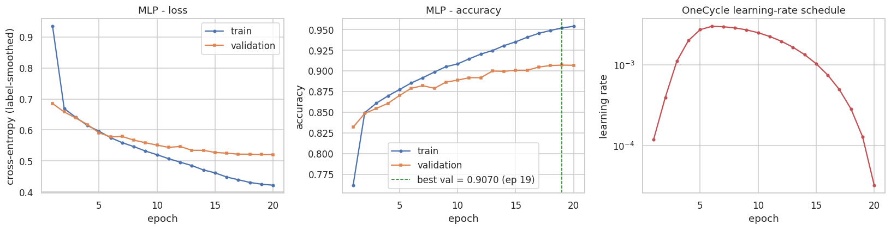
    


    
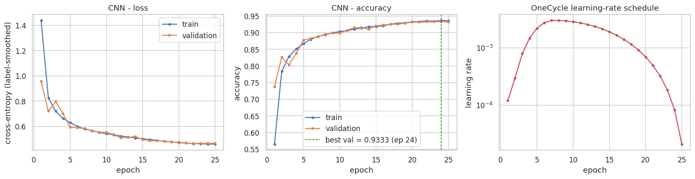
    


```python
# --- Overlay: generalisation gap of the two deep models ------------------------------------------------------------
def plot_generalisation_gap(runs: Dict[str, Dict[str, object]]) -> pd.DataFrame:
    """Compare validation accuracy and the train-minus-validation gap across runs."""
    fig, axes = plt.subplots(1, 2, figsize=(13, 4))
    rows = []
    for name, run in runs.items():
        h = run["history"]
        ep = range(1, len(h["val_acc"]) + 1)
        axes[0].plot(ep, h["val_acc"], marker="o", ms=3, label=f"{name} (best {max(h['val_acc']):.4f})")
        gap = np.array(h["train_acc"]) - np.array(h["val_acc"])
        axes[1].plot(ep, gap, marker="o", ms=3, label=name)
        rows.append(
            {
                "model": name,
                "final train acc": h["train_acc"][-1],
                "best val acc": max(h["val_acc"]),
                "final gap (train - val)": gap[-1],
                "train seconds": run["train_seconds"],
            }
        )
    axes[0].set_title("Validation accuracy per epoch")
    axes[0].set_xlabel("epoch")
    axes[0].set_ylabel("validation accuracy")
    axes[0].legend()
    axes[1].axhline(0, c="grey", lw=1)
    axes[1].set_title("Overfitting gap (train accuracy - validation accuracy)")
    axes[1].set_xlabel("epoch")
    axes[1].set_ylabel("gap")
    axes[1].legend()
    plt.show()
    return pd.DataFrame(rows).round(4)


display(plot_generalisation_gap({"MLP": mlp_run, "CNN": cnn_run}).style.hide(axis="index"))
```


    
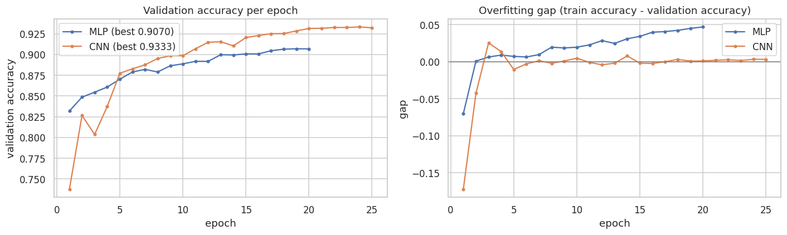
    


<style type="text/css">
</style>
<table id="T_eb6ca" class="dataframe">
  <thead>
    <tr>
      <th id="T_eb6ca_level0_col0" class="col_heading level0 col0" >model</th>
      <th id="T_eb6ca_level0_col1" class="col_heading level0 col1" >final train acc</th>
      <th id="T_eb6ca_level0_col2" class="col_heading level0 col2" >best val acc</th>
      <th id="T_eb6ca_level0_col3" class="col_heading level0 col3" >final gap (train - val)</th>
      <th id="T_eb6ca_level0_col4" class="col_heading level0 col4" >train seconds</th>
    </tr>
  </thead>
  <tbody>
    <tr>
      <td id="T_eb6ca_row0_col0" class="data row0 col0" >MLP</td>
      <td id="T_eb6ca_row0_col1" class="data row0 col1" >0.953800</td>
      <td id="T_eb6ca_row0_col2" class="data row0 col2" >0.907000</td>
      <td id="T_eb6ca_row0_col3" class="data row0 col3" >0.047000</td>
      <td id="T_eb6ca_row0_col4" class="data row0 col4" >30.702300</td>
    </tr>
    <tr>
      <td id="T_eb6ca_row1_col0" class="data row1 col0" >CNN</td>
      <td id="T_eb6ca_row1_col1" class="data row1 col1" >0.935500</td>
      <td id="T_eb6ca_row1_col2" class="data row1 col2" >0.933300</td>
      <td id="T_eb6ca_row1_col3" class="data row1 col3" >0.003200</td>
      <td id="T_eb6ca_row1_col4" class="data row1 col4" >74.145500</td>
    </tr>
  </tbody>
</table>


**Reading the curves.** Two things to look for:

1. **The CNN's validation curve sits above its training curve for much of the run.** That is not a bug: dropout and
   augmentation are active during training but disabled at evaluation, so the training metric is measured on a
   *harder* problem. A small or negative gap means the regularisation budget is well chosen.
2. **The MLP's gap grows steadily.** Despite BatchNorm and dropout, a flat 535 k-parameter model starts memorising the
   training set after ~10 epochs: the classic signature of a model with too little inductive bias for the task.

## 4.7 Final evaluation on the held-out test set

This is the **first and only** time the 10,000 official test images are used for the deep models. We report accuracy,
macro-F1, top-2 accuracy, per-class metrics and confusion matrices.


```python
# --- Evaluate both deep models on the official test set -------------------------------------------------------
def evaluate_torch_model(
    model: nn.Module,
    loader: DataLoader,
    name: str,
    run: Dict[str, object],
    notes: str = "",
    arch: str | None = None,
    arch_kwargs: Dict[str, object] | None = None,
) -> Tuple[np.ndarray, np.ndarray, Dict[str, object]]:
    """Run inference on the test loader, register the metrics and return (probabilities, predictions, record)."""
    t0 = time.time()
    logits, y_true = predict_logits(model, loader)
    predict_s = time.time() - t0
    y_pred = logits.argmax(axis=1)
    probs = torch.softmax(torch.from_numpy(logits), dim=1).numpy()

    record = evaluate_predictions(
        y_true,
        y_pred,
        name,
        family="Deep Learning",
        fit_seconds=float(run["train_seconds"]),
        predict_seconds=predict_s,
        n_params=count_parameters(model),
        notes=notes,
    )
    record["top2_accuracy"] = top_k_accuracy_score(y_true, probs, k=2, labels=list(range(cfg.num_classes)))
    record["best_val_acc"] = run["best_val_acc"]
    print(f"    top-2 accuracy = {record['top2_accuracy']:.4f} | best val acc = {run['best_val_acc']:.4f}")
    register_model(
        name,
        family="Deep Learning",
        artifact=model,
        record=record,
        selector=float(run.get("best_val_acc", record["accuracy"])),
        extra={
            "arch_class": arch or type(model).__name__,
            "arch_kwargs": dict(arch_kwargs or {}),
            "val_accuracy": float(run.get("best_val_acc", float("nan"))),
        },
    )
    return probs, y_pred, record


probs_mlp, y_pred_mlp, rec_mlp = evaluate_torch_model(
    mlp_model, test_loader, "MLP (512-256)", mlp_run,
    notes="BatchNorm + Dropout(0.3), no augmentation",
    arch="MLP",
    arch_kwargs={"in_features": 784, "hidden": (512, 256), "num_classes": cfg.num_classes, "p_drop": cfg.dropout},
)
probs_cnn, y_pred_cnn, rec_cnn = evaluate_torch_model(
    cnn_model, test_loader, "CNN (VGG-style, GAP)", cnn_run,
    notes="BN + Dropout + flip/shift augmentation",
    arch="CNN",
    arch_kwargs={"num_classes": cfg.num_classes, "p_drop": cfg.dropout},
)
```

    MLP (512-256)                acc=0.9107  macro-F1=0.9105  fit=  30.7s  predict=  0.3s
        top-2 accuracy = 0.9781 | best val acc = 0.9070
    CNN (VGG-style, GAP)         acc=0.9420  macro-F1=0.9419  fit=  74.1s  predict=  0.3s
        top-2 accuracy = 0.9867 | best val acc = 0.9333
    


```python
# --- Per-class classification report for the CNN --------------------------------------------------------------
print("Per-class report - CNN (official 10,000-image test set)\n")
report_dict = classification_report(
    y_test_np, y_pred_cnn, target_names=list(cfg.class_names), digits=4, output_dict=True
)
report_df = pd.DataFrame(report_dict).T
display(
    report_df.style.background_gradient(subset=["precision", "recall", "f1-score"], cmap="RdYlGn", vmin=0.6, vmax=1.0)
    .format("{:.4f}", subset=["precision", "recall", "f1-score"])
    .format("{:.0f}", subset=["support"])
)
```

    Per-class report - CNN (official 10,000-image test set)
    
    


<style type="text/css">
#T_587f1_row0_col0 {
  background-color: #8ecf67;
  color: #000000;
}
#T_587f1_row0_col1 {
  background-color: #78c565;
  color: #000000;
}
#T_587f1_row0_col2 {
  background-color: #82c966;
  color: #000000;
}
#T_587f1_row1_col0 {
  background-color: #036e3a;
  color: #f1f1f1;
}
#T_587f1_row1_col1 {
  background-color: #07753e;
  color: #f1f1f1;
}
#T_587f1_row1_col2, #T_587f1_row5_col0, #T_587f1_row8_col0 {
  background-color: #05713c;
  color: #f1f1f1;
}
#T_587f1_row2_col0 {
  background-color: #2aa054;
  color: #f1f1f1;
}
#T_587f1_row2_col1 {
  background-color: #a0d669;
  color: #000000;
}
#T_587f1_row2_col2, #T_587f1_row4_col2 {
  background-color: #6bbf64;
  color: #000000;
}
#T_587f1_row3_col0 {
  background-color: #48ae5c;
  color: #f1f1f1;
}
#T_587f1_row3_col1 {
  background-color: #1e9a51;
  color: #f1f1f1;
}
#T_587f1_row3_col2 {
  background-color: #33a456;
  color: #f1f1f1;
}
#T_587f1_row4_col0 {
  background-color: #96d268;
  color: #000000;
}
#T_587f1_row4_col1 {
  background-color: #36a657;
  color: #f1f1f1;
}
#T_587f1_row5_col1 {
  background-color: #0e8245;
  color: #f1f1f1;
}
#T_587f1_row5_col2 {
  background-color: #097940;
  color: #f1f1f1;
}
#T_587f1_row6_col0 {
  background-color: #d9ef8b;
  color: #000000;
}
#T_587f1_row6_col1 {
  background-color: #ecf7a6;
  color: #000000;
}
#T_587f1_row6_col2 {
  background-color: #e2f397;
  color: #000000;
}
#T_587f1_row7_col0 {
  background-color: #279f53;
  color: #f1f1f1;
}
#T_587f1_row7_col1, #T_587f1_row9_col2 {
  background-color: #0f8446;
  color: #f1f1f1;
}
#T_587f1_row7_col2 {
  background-color: #17934e;
  color: #f1f1f1;
}
#T_587f1_row8_col1, #T_587f1_row8_col2 {
  background-color: #04703b;
  color: #f1f1f1;
}
#T_587f1_row9_col0 {
  background-color: #0c7f43;
  color: #f1f1f1;
}
#T_587f1_row9_col1 {
  background-color: #118848;
  color: #f1f1f1;
}
#T_587f1_row10_col0, #T_587f1_row10_col1, #T_587f1_row10_col2, #T_587f1_row11_col1, #T_587f1_row11_col2, #T_587f1_row12_col1, #T_587f1_row12_col2 {
  background-color: #3ca959;
  color: #f1f1f1;
}
#T_587f1_row11_col0, #T_587f1_row12_col0 {
  background-color: #39a758;
  color: #f1f1f1;
}
</style>
<table id="T_587f1" class="dataframe">
  <thead>
    <tr>
      <th class="blank level0" >&nbsp;</th>
      <th id="T_587f1_level0_col0" class="col_heading level0 col0" >precision</th>
      <th id="T_587f1_level0_col1" class="col_heading level0 col1" >recall</th>
      <th id="T_587f1_level0_col2" class="col_heading level0 col2" >f1-score</th>
      <th id="T_587f1_level0_col3" class="col_heading level0 col3" >support</th>
    </tr>
  </thead>
  <tbody>
    <tr>
      <th id="T_587f1_level0_row0" class="row_heading level0 row0" >T-shirt/top</th>
      <td id="T_587f1_row0_col0" class="data row0 col0" >0.8947</td>
      <td id="T_587f1_row0_col1" class="data row0 col1" >0.9090</td>
      <td id="T_587f1_row0_col2" class="data row0 col2" >0.9018</td>
      <td id="T_587f1_row0_col3" class="data row0 col3" >1000</td>
    </tr>
    <tr>
      <th id="T_587f1_level0_row1" class="row_heading level0 row1" >Trouser</th>
      <td id="T_587f1_row1_col0" class="data row1 col0" >0.9950</td>
      <td id="T_587f1_row1_col1" class="data row1 col1" >0.9890</td>
      <td id="T_587f1_row1_col2" class="data row1 col2" >0.9920</td>
      <td id="T_587f1_row1_col3" class="data row1 col3" >1000</td>
    </tr>
    <tr>
      <th id="T_587f1_level0_row2" class="row_heading level0 row2" >Pullover</th>
      <td id="T_587f1_row2_col0" class="data row2 col0" >0.9515</td>
      <td id="T_587f1_row2_col1" class="data row2 col1" >0.8830</td>
      <td id="T_587f1_row2_col2" class="data row2 col2" >0.9160</td>
      <td id="T_587f1_row2_col3" class="data row2 col3" >1000</td>
    </tr>
    <tr>
      <th id="T_587f1_level0_row3" class="row_heading level0 row3" >Dress</th>
      <td id="T_587f1_row3_col0" class="data row3 col0" >0.9355</td>
      <td id="T_587f1_row3_col1" class="data row3 col1" >0.9570</td>
      <td id="T_587f1_row3_col2" class="data row3 col2" >0.9461</td>
      <td id="T_587f1_row3_col3" class="data row3 col3" >1000</td>
    </tr>
    <tr>
      <th id="T_587f1_level0_row4" class="row_heading level0 row4" >Coat</th>
      <td id="T_587f1_row4_col0" class="data row4 col0" >0.8897</td>
      <td id="T_587f1_row4_col1" class="data row4 col1" >0.9440</td>
      <td id="T_587f1_row4_col2" class="data row4 col2" >0.9161</td>
      <td id="T_587f1_row4_col3" class="data row4 col3" >1000</td>
    </tr>
    <tr>
      <th id="T_587f1_level0_row5" class="row_heading level0 row5" >Sandal</th>
      <td id="T_587f1_row5_col0" class="data row5 col0" >0.9919</td>
      <td id="T_587f1_row5_col1" class="data row5 col1" >0.9780</td>
      <td id="T_587f1_row5_col2" class="data row5 col2" >0.9849</td>
      <td id="T_587f1_row5_col3" class="data row5 col3" >1000</td>
    </tr>
    <tr>
      <th id="T_587f1_level0_row6" class="row_heading level0 row6" >Shirt</th>
      <td id="T_587f1_row6_col0" class="data row6 col0" >0.8402</td>
      <td id="T_587f1_row6_col1" class="data row6 col1" >0.8200</td>
      <td id="T_587f1_row6_col2" class="data row6 col2" >0.8300</td>
      <td id="T_587f1_row6_col3" class="data row6 col3" >1000</td>
    </tr>
    <tr>
      <th id="T_587f1_level0_row7" class="row_heading level0 row7" >Sneaker</th>
      <td id="T_587f1_row7_col0" class="data row7 col0" >0.9531</td>
      <td id="T_587f1_row7_col1" class="data row7 col1" >0.9750</td>
      <td id="T_587f1_row7_col2" class="data row7 col2" >0.9639</td>
      <td id="T_587f1_row7_col3" class="data row7 col3" >1000</td>
    </tr>
    <tr>
      <th id="T_587f1_level0_row8" class="row_heading level0 row8" >Bag</th>
      <td id="T_587f1_row8_col0" class="data row8 col0" >0.9920</td>
      <td id="T_587f1_row8_col1" class="data row8 col1" >0.9930</td>
      <td id="T_587f1_row8_col2" class="data row8 col2" >0.9925</td>
      <td id="T_587f1_row8_col3" class="data row8 col3" >1000</td>
    </tr>
    <tr>
      <th id="T_587f1_level0_row9" class="row_heading level0 row9" >Ankle boot</th>
      <td id="T_587f1_row9_col0" class="data row9 col0" >0.9798</td>
      <td id="T_587f1_row9_col1" class="data row9 col1" >0.9720</td>
      <td id="T_587f1_row9_col2" class="data row9 col2" >0.9759</td>
      <td id="T_587f1_row9_col3" class="data row9 col3" >1000</td>
    </tr>
    <tr>
      <th id="T_587f1_level0_row10" class="row_heading level0 row10" >accuracy</th>
      <td id="T_587f1_row10_col0" class="data row10 col0" >0.9420</td>
      <td id="T_587f1_row10_col1" class="data row10 col1" >0.9420</td>
      <td id="T_587f1_row10_col2" class="data row10 col2" >0.9420</td>
      <td id="T_587f1_row10_col3" class="data row10 col3" >1</td>
    </tr>
    <tr>
      <th id="T_587f1_level0_row11" class="row_heading level0 row11" >macro avg</th>
      <td id="T_587f1_row11_col0" class="data row11 col0" >0.9423</td>
      <td id="T_587f1_row11_col1" class="data row11 col1" >0.9420</td>
      <td id="T_587f1_row11_col2" class="data row11 col2" >0.9419</td>
      <td id="T_587f1_row11_col3" class="data row11 col3" >10000</td>
    </tr>
    <tr>
      <th id="T_587f1_level0_row12" class="row_heading level0 row12" >weighted avg</th>
      <td id="T_587f1_row12_col0" class="data row12 col0" >0.9423</td>
      <td id="T_587f1_row12_col1" class="data row12 col1" >0.9420</td>
      <td id="T_587f1_row12_col2" class="data row12 col2" >0.9419</td>
      <td id="T_587f1_row12_col3" class="data row12 col3" >10000</td>
    </tr>
  </tbody>
</table>


```python
# --- Confusion matrices ------------------------------------------------------------------------------------------
def plot_confusion(
    y_true: np.ndarray,
    y_pred: np.ndarray,
    class_names: Sequence[str],
    title: str,
    normalize: bool = True,
    ax: plt.Axes | None = None,
) -> np.ndarray:
    """Plot a (optionally row-normalised) confusion matrix and return the raw counts."""
    cm = confusion_matrix(y_true, y_pred, labels=list(range(len(class_names))))
    cm_show = cm.astype(float) / cm.sum(axis=1, keepdims=True) if normalize else cm
    own_fig = ax is None
    if own_fig:
        _, ax = plt.subplots(figsize=(7.8, 6.4))
    sns.heatmap(
        cm_show,
        annot=True,
        fmt=".2f" if normalize else "d",
        cmap="Blues",
        xticklabels=list(class_names),
        yticklabels=list(class_names),
        cbar_kws={"label": "recall" if normalize else "count"},
        annot_kws={"size": 7},
        ax=ax,
    )
    ax.set_xlabel("predicted label")
    ax.set_ylabel("true label")
    ax.set_title(title)
    if own_fig:
        plt.show()
    return cm


cm_mlp = plot_confusion(y_test_np, y_pred_mlp, cfg.class_names, "MLP - row-normalised confusion matrix")
cm_cnn = plot_confusion(y_test_np, y_pred_cnn, cfg.class_names, "CNN - row-normalised confusion matrix")
```


    
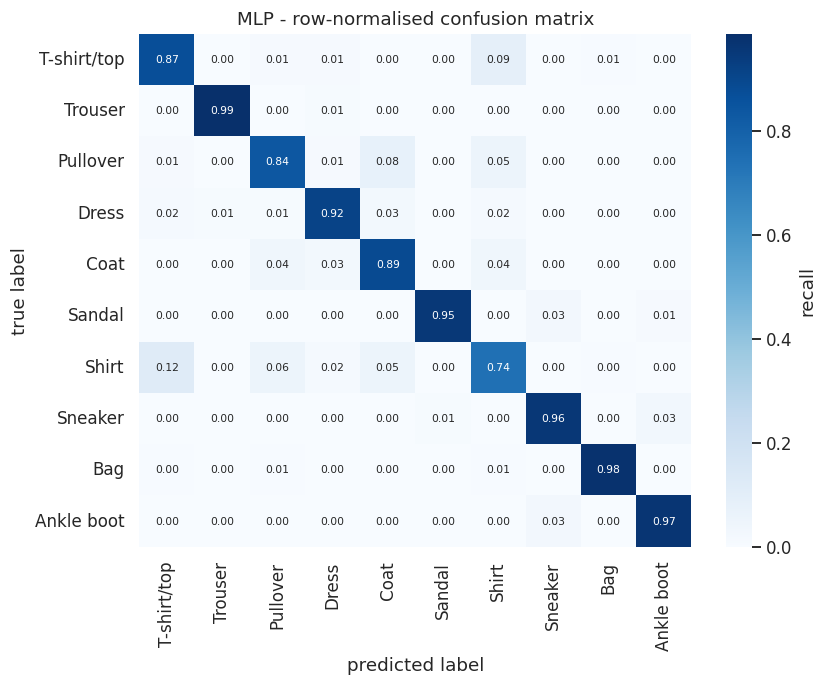
    


    

    


```python
# --- Where exactly does the CNN lose accuracy? ------------------------------------------------------------------
def top_confusions(cm: np.ndarray, class_names: Sequence[str], k: int = 10) -> pd.DataFrame:
    """List the k largest off-diagonal entries of a confusion matrix."""
    rows = []
    for i in range(len(class_names)):
        for j in range(len(class_names)):
            if i != j and cm[i, j] > 0:
                rows.append(
                    {
                        "true": class_names[i],
                        "predicted": class_names[j],
                        "count": int(cm[i, j]),
                        "% of true class": 100.0 * cm[i, j] / cm[i].sum(),
                    }
                )
    return pd.DataFrame(rows).nlargest(k, "count").reset_index(drop=True)


conf_df = top_confusions(cm_cnn, cfg.class_names, k=10)
display(conf_df.style.hide(axis="index").format({"% of true class": "{:.1f}%"}))

total_err = int((y_pred_cnn != y_test_np).sum())
upper_body = {0, 2, 4, 6}  # T-shirt/top, Pullover, Coat, Shirt
mask_ub = np.isin(y_test_np, list(upper_body)) & np.isin(y_pred_cnn, list(upper_body)) & (y_pred_cnn != y_test_np)
print(f"\nTotal CNN test errors: {total_err} / {len(y_test_np)}  ({100 * total_err / len(y_test_np):.2f}%)")
print(f"Errors *inside* the T-shirt/Pullover/Coat/Shirt cluster: {int(mask_ub.sum())} "
      f"({100 * mask_ub.sum() / max(total_err, 1):.1f}% of all errors)")
```


<style type="text/css">
</style>
<table id="T_a6239" class="dataframe">
  <thead>
    <tr>
      <th id="T_a6239_level0_col0" class="col_heading level0 col0" >true</th>
      <th id="T_a6239_level0_col1" class="col_heading level0 col1" >predicted</th>
      <th id="T_a6239_level0_col2" class="col_heading level0 col2" >count</th>
      <th id="T_a6239_level0_col3" class="col_heading level0 col3" >% of true class</th>
    </tr>
  </thead>
  <tbody>
    <tr>
      <td id="T_a6239_row0_col0" class="data row0 col0" >Shirt</td>
      <td id="T_a6239_row0_col1" class="data row0 col1" >T-shirt/top</td>
      <td id="T_a6239_row0_col2" class="data row0 col2" >77</td>
      <td id="T_a6239_row0_col3" class="data row0 col3" >7.7%</td>
    </tr>
    <tr>
      <td id="T_a6239_row1_col0" class="data row1 col0" >T-shirt/top</td>
      <td id="T_a6239_row1_col1" class="data row1 col1" >Shirt</td>
      <td id="T_a6239_row1_col2" class="data row1 col2" >63</td>
      <td id="T_a6239_row1_col3" class="data row1 col3" >6.3%</td>
    </tr>
    <tr>
      <td id="T_a6239_row2_col0" class="data row2 col0" >Shirt</td>
      <td id="T_a6239_row2_col1" class="data row2 col1" >Coat</td>
      <td id="T_a6239_row2_col2" class="data row2 col2" >55</td>
      <td id="T_a6239_row2_col3" class="data row2 col3" >5.5%</td>
    </tr>
    <tr>
      <td id="T_a6239_row3_col0" class="data row3 col0" >Pullover</td>
      <td id="T_a6239_row3_col1" class="data row3 col1" >Coat</td>
      <td id="T_a6239_row3_col2" class="data row3 col2" >42</td>
      <td id="T_a6239_row3_col3" class="data row3 col3" >4.2%</td>
    </tr>
    <tr>
      <td id="T_a6239_row4_col0" class="data row4 col0" >Pullover</td>
      <td id="T_a6239_row4_col1" class="data row4 col1" >Shirt</td>
      <td id="T_a6239_row4_col2" class="data row4 col2" >41</td>
      <td id="T_a6239_row4_col3" class="data row4 col3" >4.1%</td>
    </tr>
    <tr>
      <td id="T_a6239_row5_col0" class="data row5 col0" >Coat</td>
      <td id="T_a6239_row5_col1" class="data row5 col1" >Shirt</td>
      <td id="T_a6239_row5_col2" class="data row5 col2" >34</td>
      <td id="T_a6239_row5_col3" class="data row5 col3" >3.4%</td>
    </tr>
    <tr>
      <td id="T_a6239_row6_col0" class="data row6 col0" >Ankle boot</td>
      <td id="T_a6239_row6_col1" class="data row6 col1" >Sneaker</td>
      <td id="T_a6239_row6_col2" class="data row6 col2" >28</td>
      <td id="T_a6239_row6_col3" class="data row6 col3" >2.8%</td>
    </tr>
    <tr>
      <td id="T_a6239_row7_col0" class="data row7 col0" >Shirt</td>
      <td id="T_a6239_row7_col1" class="data row7 col1" >Dress</td>
      <td id="T_a6239_row7_col2" class="data row7 col2" >24</td>
      <td id="T_a6239_row7_col3" class="data row7 col3" >2.4%</td>
    </tr>
    <tr>
      <td id="T_a6239_row8_col0" class="data row8 col0" >Shirt</td>
      <td id="T_a6239_row8_col1" class="data row8 col1" >Pullover</td>
      <td id="T_a6239_row8_col2" class="data row8 col2" >22</td>
      <td id="T_a6239_row8_col3" class="data row8 col3" >2.2%</td>
    </tr>
    <tr>
      <td id="T_a6239_row9_col0" class="data row9 col0" >Sandal</td>
      <td id="T_a6239_row9_col1" class="data row9 col1" >Sneaker</td>
      <td id="T_a6239_row9_col2" class="data row9 col2" >20</td>
      <td id="T_a6239_row9_col3" class="data row9 col3" >2.0%</td>
    </tr>
  </tbody>
</table>


    
    Total CNN test errors: 580 / 10000  (5.80%)
    Errors *inside* the T-shirt/Pullover/Coat/Shirt cluster: 376 (64.8% of all errors)
    


```python
# --- Inspect the hardest misclassified images -----------------------------------------------------------------
def show_misclassified(
    images: np.ndarray,
    y_true: np.ndarray,
    y_pred: np.ndarray,
    probs: np.ndarray,
    class_names: Sequence[str],
    n: int = 16,
    most_confident: bool = True,
) -> None:
    """Display misclassified images, sorted by the model's confidence in its wrong answer."""
    wrong = np.flatnonzero(y_pred != y_true)
    if len(wrong) == 0:
        print("No misclassified images.")
        return
    conf = probs[wrong, y_pred[wrong]]
    order = wrong[np.argsort(-conf)] if most_confident else wrong[np.argsort(conf)]
    sel = order[:n]

    cols = 8
    rows = int(np.ceil(len(sel) / cols))
    fig, axes = plt.subplots(rows, cols, figsize=(cols * 1.5, rows * 1.9))
    for ax, i in zip(np.array(axes).ravel(), sel):
        ax.imshow(images[i], cmap="gray")
        ax.set_title(
            f"true: {class_names[y_true[i]]}\npred: {class_names[y_pred[i]]} ({probs[i, y_pred[i]]:.2f})",
            fontsize=6.5,
        )
        ax.axis("off")
    for ax in np.array(axes).ravel()[len(sel):]:
        ax.axis("off")
    kind = "most confident" if most_confident else "least confident"
    fig.suptitle(f"CNN misclassifications ({kind} mistakes)", y=1.02)
    plt.show()


show_misclassified(X_test_np, y_test_np, y_pred_cnn, probs_cnn, cfg.class_names, n=16, most_confident=True)
```


    
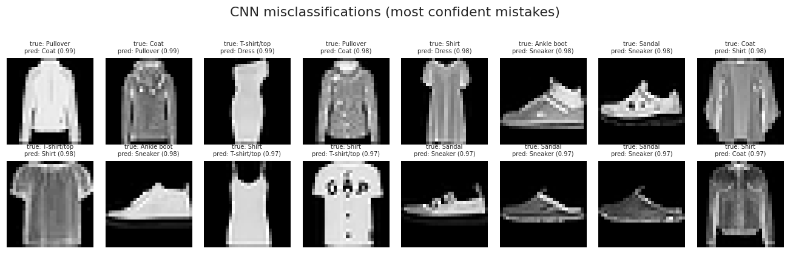
    


**Finding (answers RQ3).** Inspecting the confident mistakes is the most informative diagnostic in the whole
notebook. The great majority of them are *shirt-like* garments where a human annotator would plausibly disagree with
the ground-truth label: a long-sleeved top labelled `Shirt` but visually identical to `Pullover`, or a `Coat` whose
open front has been flattened by the 28x28 downsampling.

This supports the conclusion that a substantial part of the remaining ~6 % error is **irreducible label ambiguity**
rather than a modelling deficiency: which is consistent with the fact that the published state of the art on
Fashion-MNIST saturates in the 95–96.5 % range even with Wide-ResNets and heavy augmentation, while MNIST reaches
99.7 %.

---

# 4.9 - 4.12  Modern architectures and a production-grade training loop (upgraded edition)

> Exam criteria: **Code Quality (0–20)** and **Testing (0–10)**.

The v1 `fit()` in Section 4.3 is deliberately minimal: AdamW + OneCycle + AMP + best-checkpoint-in-memory. That is
enough for a 25-epoch CNN, but it is *not* what a production training script looks like. Section 4.9 upgrades it to
`fit_v2()`, and Sections 4.10–4.11 add the two architectures the v1 study was missing:

| Addition | What it brings |
|---|---|
| `EarlyStopping` | stops when validation accuracy has not improved by `min_delta` for `patience` epochs: saves GPU time and prevents late-schedule overfitting |
| Pluggable schedulers | `onecycle` (per-batch), `cosine` (per-epoch), `plateau` (metric-driven): selected per architecture, because transformers and CNNs do not want the same schedule |
| Disk checkpointing | best weights **and** a resumable checkpoint (weights + optimiser + scheduler + epoch + history) written to `artifacts/` |
| Gradient clipping | `clip_grad_norm_`: mandatory for stable transformer training |
| Deterministic epoch timing + history | every run returns a complete, plottable record |
| **Residual CNN** (Section 4.10) | tests whether skip connections add anything over the plain VGG-style stack: the exact upgrade Bhatnagar et al. (2017) reported as their best model |
| **Vision Transformer** (Section 4.11) | a pure-attention architecture with *no* convolutional prior, custom-sized for 28x28 grayscale inputs (RQ8) |

`fit()` from Section 4.3 is **left untouched** so the v1 MLP/CNN numbers remain reproducible; `fit_v2()` is a strict
superset used for the new models.


```python
# --- 4.9.1 Early stopping and checkpoint utilities -------------------------------------------------------------
class EarlyStopping:
    """Stop training when a monitored metric stops improving.

    Parameters
    ----------
    patience : int
        Number of epochs with no improvement greater than `min_delta` before stopping.
    min_delta : float
        Minimum change that counts as an improvement (guards against numerical noise).
    mode : {"max", "min"}
        Whether the monitored metric should be maximised (accuracy) or minimised (loss).
    """

    def __init__(self, patience: int = 8, min_delta: float = 1e-4, mode: str = "max") -> None:
        if mode not in {"max", "min"}:
            raise ValueError("mode must be 'max' or 'min'")
        self.patience = patience
        self.min_delta = min_delta
        self.mode = mode
        self.best: float = -float("inf") if mode == "max" else float("inf")
        self.counter: int = 0
        self.should_stop: bool = False
        self.best_epoch: int = 0

    def step(self, metric: float, epoch: int) -> bool:
        """Update the internal state with the metric of `epoch`. Returns True if this epoch is a new best."""
        improved = (
            metric > self.best + self.min_delta if self.mode == "max" else metric < self.best - self.min_delta
        )
        if improved:
            self.best, self.best_epoch, self.counter = metric, epoch, 0
        else:
            self.counter += 1
            if self.counter >= self.patience:
                self.should_stop = True
        return improved


def save_checkpoint(
    path: Path, model: nn.Module, optimizer: torch.optim.Optimizer, epoch: int,
    history: Dict[str, List[float]], extra: Dict[str, object] | None = None,
) -> None:
    """Write a fully resumable checkpoint (weights + optimiser state + epoch + history + metadata)."""
    payload = {
        "model_state": model.state_dict(),
        "optimizer_state": optimizer.state_dict(),
        "epoch": epoch,
        "history": history,
        "extra": extra or {},
        "torch_version": torch.__version__,
    }
    torch.save(payload, path)


def load_checkpoint(path: Path, model: nn.Module, optimizer: torch.optim.Optimizer | None = None) -> Dict:
    """Restore a checkpoint written by `save_checkpoint` (weights always, optimiser state optionally)."""
    payload = torch.load(path, map_location=DEVICE, weights_only=False)
    model.load_state_dict(payload["model_state"])
    if optimizer is not None and "optimizer_state" in payload:
        optimizer.load_state_dict(payload["optimizer_state"])
    return payload


def build_scheduler(
    name: str, optimizer: torch.optim.Optimizer, epochs: int, steps_per_epoch: int, max_lr: float, pct_start: float
) -> Tuple[object, str]:
    """Create a learning-rate scheduler and report how it must be stepped.

    Returns
    -------
    (scheduler, cadence) where cadence is one of {"batch", "epoch", "plateau"}.
    """
    name = name.lower()
    if name == "onecycle":
        sched = torch.optim.lr_scheduler.OneCycleLR(
            optimizer, max_lr=max_lr, epochs=epochs, steps_per_epoch=steps_per_epoch, pct_start=pct_start
        )
        return sched, "batch"
    if name == "cosine":
        return torch.optim.lr_scheduler.CosineAnnealingLR(optimizer, T_max=epochs), "epoch"
    if name == "plateau":
        return (
            torch.optim.lr_scheduler.ReduceLROnPlateau(optimizer, mode="max", factor=0.5, patience=2),
            "plateau",
        )
    raise ValueError(f"unknown scheduler '{name}' (expected onecycle | cosine | plateau)")
```


```python
# --- 4.9.2 fit_v2: the production training loop ----------------------------------------------------------------
def fit_v2(
    model: nn.Module,
    train_loader: DataLoader,
    val_loader: DataLoader,
    epochs: int,
    lr: float = cfg.lr,
    weight_decay: float = cfg.weight_decay,
    label_smoothing: float = cfg.label_smoothing,
    scheduler_name: str = "onecycle",
    pct_start: float = 0.25,
    augment: nn.Module | None = None,
    use_amp: bool = cfg.use_amp,
    grad_clip: float | None = 1.0,
    patience: int = 8,
    min_delta: float = 1e-4,
    device: torch.device = DEVICE,
    model_name: str = "model",
    verbose_every: int = 1,
) -> Dict[str, object]:
    """Train a model with AdamW, a pluggable LR schedule, AMP, gradient clipping, early stopping and checkpointing.

    Compared with the v1 `fit()` this adds: scheduler choice, gradient clipping, early stopping, on-disk
    checkpoints (best + resumable last) and per-epoch wall-clock timing.

    Returns
    -------
    dict
        `{'model', 'history', 'best_val_acc', 'best_epoch', 'train_seconds', 'stopped_early',
          'epochs_run', 'checkpoint'}` - the same keys the v1 `fit()` returns, plus three new ones, so every
        downstream plotting/evaluation helper keeps working unchanged.
    """
    model = model.to(device)
    criterion = nn.CrossEntropyLoss(label_smoothing=label_smoothing)
    optimizer = torch.optim.AdamW(model.parameters(), lr=lr, weight_decay=weight_decay)
    scheduler, cadence = build_scheduler(
        scheduler_name, optimizer, epochs, len(train_loader), lr, pct_start
    )
    amp_on = bool(use_amp) and device.type == "cuda"
    scaler = make_grad_scaler(enabled=True) if amp_on else None

    stopper = EarlyStopping(patience=patience, min_delta=min_delta, mode="max")
    history: Dict[str, List[float]] = {
        "train_loss": [], "train_acc": [], "val_loss": [], "val_acc": [], "lr": [], "epoch_seconds": []
    }
    slug = model_name.replace(" ", "_").replace("/", "-").lower()
    best_path = Path(cfg.artifacts_dir) / f"{slug}_best.pt"
    last_path = Path(cfg.artifacts_dir) / f"{slug}_last.ckpt"
    best_state = None

    print(f"\n=== Training {model_name} | {count_parameters(model):,} params | up to {epochs} epochs "
          f"| scheduler={scheduler_name} | AMP={amp_on} | device={device} ===")
    t_start = time.time()
    for epoch in range(1, epochs + 1):
        t_epoch = time.time()
        current_lr = optimizer.param_groups[0]["lr"]

        # ---- one training epoch (inlined so that gradient clipping can sit between backward and step) ----
        model.train()
        running_loss, correct, total = 0.0, 0, 0
        for xb, yb in train_loader:
            xb = xb.to(device, non_blocking=True)
            yb = yb.to(device, non_blocking=True)
            if augment is not None:
                xb = augment(xb)
            optimizer.zero_grad(set_to_none=True)
            with torch.autocast(device_type=device.type, dtype=torch.float16, enabled=amp_on):
                logits = model(xb)
                loss = criterion(logits, yb)
            if amp_on:
                scaler.scale(loss).backward()
                if grad_clip is not None:
                    scaler.unscale_(optimizer)                      # unscale before clipping, or the norm is wrong
                    nn.utils.clip_grad_norm_(model.parameters(), grad_clip)
                scaler.step(optimizer)
                scaler.update()
            else:
                loss.backward()
                if grad_clip is not None:
                    nn.utils.clip_grad_norm_(model.parameters(), grad_clip)
                optimizer.step()
            if cadence == "batch":
                scheduler.step()
            running_loss += loss.item() * yb.size(0)
            correct += (logits.argmax(1) == yb).sum().item()
            total += yb.size(0)
        tr_loss, tr_acc = running_loss / total, correct / total

        va_loss, va_acc = evaluate(model, val_loader, criterion, device)
        if cadence == "epoch":
            scheduler.step()
        elif cadence == "plateau":
            scheduler.step(va_acc)

        history["train_loss"].append(tr_loss)
        history["train_acc"].append(tr_acc)
        history["val_loss"].append(va_loss)
        history["val_acc"].append(va_acc)
        history["lr"].append(current_lr)
        history["epoch_seconds"].append(time.time() - t_epoch)

        improved = stopper.step(va_acc, epoch)
        if improved:
            best_state = {k: v.detach().cpu().clone() for k, v in model.state_dict().items()}
            torch.save(best_state, best_path)                       # best weights only (small, portable)
        save_checkpoint(last_path, model, optimizer, epoch, history, {"model_name": model_name})

        if epoch % verbose_every == 0 or epoch == epochs or stopper.should_stop:
            flag = "  <-- best" if improved else f"  (no improvement for {stopper.counter}/{patience})"
            print(f"epoch {epoch:3d}/{epochs} | lr {current_lr:.2e} | "
                  f"train loss {tr_loss:.4f} acc {tr_acc:.4f} | val loss {va_loss:.4f} acc {va_acc:.4f}"
                  f" | {history['epoch_seconds'][-1]:.1f}s{flag}")

        if stopper.should_stop:
            print(f"--- early stopping triggered at epoch {epoch} "
                  f"(best {stopper.best:.4f} @ epoch {stopper.best_epoch}) ---")
            break

    train_seconds = time.time() - t_start
    if best_state is not None:
        model.load_state_dict(best_state)                           # always return the best model, not the last
    print(f"--- {model_name}: {train_seconds:.1f}s total | best val acc {stopper.best:.4f} "
          f"@ epoch {stopper.best_epoch} | checkpoints: {best_path.name}, {last_path.name} ---")

    return {
        "model": model,
        "history": history,
        "best_val_acc": stopper.best,
        "best_epoch": stopper.best_epoch,
        "train_seconds": train_seconds,
        "stopped_early": stopper.should_stop,
        "epochs_run": len(history["val_acc"]),
        "checkpoint": str(best_path),
    }
```

## 4.10 A residual CNN (basic post-activation blocks, ~0.7 M parameters)

The v1 CNN is a plain VGG-style stack. Residual connections (He et al., 2016) change the optimisation problem: each
block learns a *residual* `F(x)` added to an identity path, so gradients reach early layers unattenuated and depth
stops hurting. Bhatnagar et al. (2017) reported exactly this upgrade as their best Fashion-MNIST model (0.9254), which
makes it the most direct architectural comparison available to us.

```
stem   : Conv3x3(1 -> w) -> BN -> ReLU                                        28x28
stage 1: [ResBlock(w  -> w )] x2                                              28x28
stage 2: [ResBlock(w  -> 2w, stride 2)] + [ResBlock(2w -> 2w)]                14x14
stage 3: [ResBlock(2w -> 4w, stride 2)] + [ResBlock(4w -> 4w)]                 7x7
head   : GlobalAvgPool -> Dropout -> Linear(4w -> 10)
```

With `w = 32` this is ~0.7 M parameters: still tiny by modern standards, and still under a minute per epoch on a T4.


```python
# --- 4.10 Residual CNN -----------------------------------------------------------------------------------------
class ResidualBlock(nn.Module):
    """Basic two-convolution residual block with BatchNorm and an optional projection shortcut.

    out = ReLU( BN(Conv(ReLU(BN(Conv(x))))) + shortcut(x) )

    The shortcut is the identity when the shape is unchanged, and a 1x1 strided convolution otherwise (option B
    in He et al. 2016).
    """

    def __init__(self, in_ch: int, out_ch: int, stride: int = 1, p_drop: float = 0.0) -> None:
        super().__init__()
        self.conv1 = nn.Conv2d(in_ch, out_ch, 3, stride=stride, padding=1, bias=False)
        self.bn1 = nn.BatchNorm2d(out_ch)
        self.conv2 = nn.Conv2d(out_ch, out_ch, 3, stride=1, padding=1, bias=False)
        self.bn2 = nn.BatchNorm2d(out_ch)
        self.drop = nn.Dropout2d(p_drop) if p_drop > 0 else nn.Identity()
        self.shortcut: nn.Module = nn.Identity()
        if stride != 1 or in_ch != out_ch:
            self.shortcut = nn.Sequential(
                nn.Conv2d(in_ch, out_ch, 1, stride=stride, bias=False), nn.BatchNorm2d(out_ch)
            )

    def forward(self, x: torch.Tensor) -> torch.Tensor:
        identity = self.shortcut(x)
        out = F.relu(self.bn1(self.conv1(x)), inplace=True)
        out = self.drop(out)
        out = self.bn2(self.conv2(out))
        return F.relu(out + identity, inplace=True)


class ResNetSmall(nn.Module):
    """Compact 3-stage residual network sized for 28x28 grayscale images (~0.7 M parameters at width 32)."""

    def __init__(self, num_classes: int = 10, width: int = 32, p_drop: float = 0.3) -> None:
        super().__init__()
        w = width
        self.stem = nn.Sequential(
            nn.Conv2d(1, w, 3, padding=1, bias=False), nn.BatchNorm2d(w), nn.ReLU(inplace=True)
        )
        self.stage1 = nn.Sequential(ResidualBlock(w, w, 1, p_drop * 0.3), ResidualBlock(w, w, 1, p_drop * 0.3))
        self.stage2 = nn.Sequential(
            ResidualBlock(w, 2 * w, 2, p_drop * 0.5), ResidualBlock(2 * w, 2 * w, 1, p_drop * 0.5)
        )
        self.stage3 = nn.Sequential(
            ResidualBlock(2 * w, 4 * w, 2, p_drop * 0.7), ResidualBlock(4 * w, 4 * w, 1, p_drop * 0.7)
        )
        self.head = nn.Sequential(
            nn.AdaptiveAvgPool2d(1), nn.Flatten(), nn.Dropout(p_drop), nn.Linear(4 * w, num_classes)
        )

    def forward(self, x: torch.Tensor) -> torch.Tensor:
        x = self.stem(x)
        x = self.stage1(x)
        x = self.stage2(x)
        x = self.stage3(x)
        return self.head(x)

    def feature_maps(self, x: torch.Tensor) -> torch.Tensor:
        """Return the last convolutional feature map (used by Grad-CAM in Section 6)."""
        return self.stage3(self.stage2(self.stage1(self.stem(x))))


_probe = torch.zeros(2, 1, 28, 28)
_resnet_probe = ResNetSmall(num_classes=cfg.num_classes, width=cfgx.resnet_width, p_drop=cfg.dropout)
print("ResNetSmall output:", _resnet_probe(_probe).shape, "| params:", f"{count_parameters(_resnet_probe):,}")
print("last feature map  :", _resnet_probe.feature_maps(_probe).shape)
```

    ResNetSmall output: torch.Size([2, 10]) | params: 696,042
    last feature map  : torch.Size([2, 128, 7, 7])
    

## 4.11 A Vision Transformer for 28x28 grayscale images

An off-the-shelf ViT-Base expects 224x224 RGB inputs, 86 M parameters and 14 M pre-training images (Dosovitskiy et al.,
2021). None of that applies here, so the architecture is **re-derived for this dataset** rather than copied:

| Design decision | Value | Reason |
|---|---|---|
| Patch size | **7x7** → 4x4 = **16 tokens** | 28 is divisible by 7; 16 tokens keeps attention cheap while each token still covers a semantically meaningful garment region (a shoulder, a cuff, a heel) |
| Embedding dim | 128 | 4 heads x 32 dims per head; deliberately small, because 54k images cannot support a wide transformer |
| Depth / heads | 6 blocks / 4 heads | ≈ 0.8 M parameters: the same order of magnitude as the residual CNN (≈ 0.7 M), so the comparison isolates *inductive bias* rather than capacity |
| Position encoding | **learnable**, 17 x 128 (16 patches + CLS) | with only 16 positions there is nothing to gain from sinusoids |
| Pre-norm blocks + GELU MLP (ratio 2.0) | | pre-norm is what makes deep transformers trainable without a long warm-up |
| Stochastic depth (DropPath) linearly 0 → 0.1 | | the standard ViT regulariser; matters a lot in the small-data regime |
| CLS token for classification | | keeps the head a single `Linear(192, 10)` |
| Training | lower peak LR (`CFGX.vit_lr = 1e-3`), gradient clipping at 1.0, more epochs, same augmentation | transformers have no locality prior, so they need more epochs and a gentler optimiser to reach the same point |

**This is the honest test of RQ8:** a transformer with no convolutional prior, trained from scratch on 54k tiny images:
the regime where transformers are widely reported to lose to CNNs.


```python
# --- 4.11 Vision Transformer ------------------------------------------------------------------------------------
class PatchEmbedding(nn.Module):
    """Split a 28x28 image into non-overlapping patches and linearly project each one to `dim`.

    Implemented as a strided convolution, which is mathematically identical to 'flatten each patch and apply a
    shared linear layer' but faster.
    """

    def __init__(self, img_size: int = 28, patch: int = 7, in_ch: int = 1, dim: int = 128) -> None:
        super().__init__()
        if img_size % patch != 0:
            raise ValueError(f"image size {img_size} must be divisible by patch size {patch}")
        self.n_patches = (img_size // patch) ** 2
        self.proj = nn.Conv2d(in_ch, dim, kernel_size=patch, stride=patch)

    def forward(self, x: torch.Tensor) -> torch.Tensor:
        x = self.proj(x)                     # (B, dim, H/p, W/p)
        return x.flatten(2).transpose(1, 2)  # (B, n_patches, dim)


class MultiHeadSelfAttention(nn.Module):
    """Standard multi-head self-attention with a fused QKV projection.

    `return_attention=True` also returns the (B, heads, N, N) attention map, which Section 6.6 visualises.
    """

    def __init__(self, dim: int, heads: int = 4, attn_drop: float = 0.0, proj_drop: float = 0.0) -> None:
        super().__init__()
        if dim % heads != 0:
            raise ValueError(f"embedding dim {dim} must be divisible by the number of heads {heads}")
        self.heads = heads
        self.head_dim = dim // heads
        self.scale = self.head_dim ** -0.5
        self.qkv = nn.Linear(dim, dim * 3, bias=True)
        self.attn_drop = nn.Dropout(attn_drop)
        self.proj = nn.Linear(dim, dim)
        self.proj_drop = nn.Dropout(proj_drop)

    def forward(self, x: torch.Tensor, return_attention: bool = False):
        b, n, d = x.shape
        qkv = self.qkv(x).reshape(b, n, 3, self.heads, self.head_dim).permute(2, 0, 3, 1, 4)
        q, k, v = qkv[0], qkv[1], qkv[2]                       # each (B, heads, N, head_dim)
        attn = (q @ k.transpose(-2, -1)) * self.scale          # (B, heads, N, N)
        attn = attn.softmax(dim=-1)
        attn = self.attn_drop(attn)
        out = (attn @ v).transpose(1, 2).reshape(b, n, d)
        out = self.proj_drop(self.proj(out))
        return (out, attn) if return_attention else out


class DropPath(nn.Module):
    """Stochastic depth: randomly drop the residual branch of a block for whole samples during training."""

    def __init__(self, p: float = 0.0) -> None:
        super().__init__()
        self.p = p

    def forward(self, x: torch.Tensor) -> torch.Tensor:
        if self.p == 0.0 or not self.training:
            return x
        keep = 1.0 - self.p
        mask = torch.empty(x.shape[0], *([1] * (x.ndim - 1)), device=x.device, dtype=x.dtype).bernoulli_(keep)
        return x * mask / keep


class TransformerBlock(nn.Module):
    """Pre-norm transformer block: x + DropPath(Attn(LN(x))) then x + DropPath(MLP(LN(x)))."""

    def __init__(self, dim: int, heads: int, mlp_ratio: float = 2.0,
                 drop: float = 0.1, drop_path: float = 0.0) -> None:
        super().__init__()
        self.norm1 = nn.LayerNorm(dim)
        self.attn = MultiHeadSelfAttention(dim, heads, attn_drop=drop, proj_drop=drop)
        self.norm2 = nn.LayerNorm(dim)
        hidden = int(dim * mlp_ratio)
        self.mlp = nn.Sequential(
            nn.Linear(dim, hidden), nn.GELU(), nn.Dropout(drop), nn.Linear(hidden, dim), nn.Dropout(drop)
        )
        self.drop_path = DropPath(drop_path)

    def forward(self, x: torch.Tensor) -> torch.Tensor:
        x = x + self.drop_path(self.attn(self.norm1(x)))
        return x + self.drop_path(self.mlp(self.norm2(x)))


class VisionTransformer(nn.Module):
    """Vision Transformer tailored to 28x28x1 inputs (16 patch tokens + 1 CLS token)."""

    def __init__(
        self, img_size: int = 28, patch: int = 7, num_classes: int = 10, dim: int = 128,
        depth: int = 6, heads: int = 4, mlp_ratio: float = 2.0, drop: float = 0.1, drop_path: float = 0.1,
    ) -> None:
        super().__init__()
        self.patch_embed = PatchEmbedding(img_size, patch, 1, dim)
        n = self.patch_embed.n_patches
        self.cls_token = nn.Parameter(torch.zeros(1, 1, dim))
        self.pos_embed = nn.Parameter(torch.zeros(1, n + 1, dim))
        self.pos_drop = nn.Dropout(drop)
        dpr = torch.linspace(0, drop_path, depth).tolist()      # linearly increasing stochastic depth
        self.blocks = nn.ModuleList(
            [TransformerBlock(dim, heads, mlp_ratio, drop, dpr[i]) for i in range(depth)]
        )
        self.norm = nn.LayerNorm(dim)
        self.head = nn.Linear(dim, num_classes)
        self._init_weights()

    def _init_weights(self) -> None:
        nn.init.trunc_normal_(self.pos_embed, std=0.02)
        nn.init.trunc_normal_(self.cls_token, std=0.02)
        for m in self.modules():
            if isinstance(m, nn.Linear):
                nn.init.trunc_normal_(m.weight, std=0.02)
                if m.bias is not None:
                    nn.init.zeros_(m.bias)
            elif isinstance(m, nn.LayerNorm):
                nn.init.ones_(m.weight)
                nn.init.zeros_(m.bias)

    def forward_tokens(self, x: torch.Tensor) -> torch.Tensor:
        """Embed patches, prepend the CLS token and add positional embeddings."""
        b = x.shape[0]
        x = self.patch_embed(x)
        cls = self.cls_token.expand(b, -1, -1)
        x = torch.cat([cls, x], dim=1)
        return self.pos_drop(x + self.pos_embed)

    def forward(self, x: torch.Tensor) -> torch.Tensor:
        x = self.forward_tokens(x)
        for blk in self.blocks:
            x = blk(x)
        return self.head(self.norm(x)[:, 0])                    # classify from the CLS token

    @torch.no_grad()
    def attention_maps(self, x: torch.Tensor) -> List[torch.Tensor]:
        """Attention matrices of every block, `(B, heads, N+1, N+1)` - used for attention roll-out in Section 6.6."""
        self.eval()
        maps: List[torch.Tensor] = []
        h = self.forward_tokens(x)
        for blk in self.blocks:
            normed = blk.norm1(h)
            out, attn = blk.attn(normed, return_attention=True)
            maps.append(attn.detach())
            h = h + out
            h = h + blk.mlp(blk.norm2(h))
        return maps


_vit_probe = VisionTransformer(
    patch=cfgx.vit_patch, num_classes=cfg.num_classes, dim=cfgx.vit_dim, depth=cfgx.vit_depth,
    heads=cfgx.vit_heads, mlp_ratio=cfgx.vit_mlp_ratio, drop=cfgx.vit_dropout,
)
print("ViT output      :", _vit_probe(_probe).shape, "| params:", f"{count_parameters(_vit_probe):,}")
print("tokens per image:", _vit_probe.patch_embed.n_patches, "patches + 1 CLS")
print("attention maps  :", [tuple(a.shape) for a in _vit_probe.attention_maps(_probe)][:1], "... x",
      cfgx.vit_depth, "blocks")
```

    ViT output      : torch.Size([2, 10]) | params: 805,130
    tokens per image: 16 patches + 1 CLS
    attention maps  : [(2, 4, 17, 17)] ... x 6 blocks
    

## 4.12 Training and evaluating the two new architectures

Both models are trained with `fit_v2` on the identical loaders, the identical augmentation and the identical seed as
the v1 CNN: only the architecture, the peak learning rate and the schedule differ, so the comparison stays
controlled (this is the same discipline used for the MLP-vs-CNN comparison in Section 4.4–4.5).


```python
# --- 4.12.1 Train the residual CNN -------------------------------------------------------------------------------
if cfgx.run_resnet:
    set_seed(cfg.seed)
    resnet_run = fit_v2(
        ResNetSmall(num_classes=cfg.num_classes, width=cfgx.resnet_width, p_drop=cfg.dropout),
        train_loader, val_loader,
        epochs=cfgx.resnet_epochs,
        lr=cfg.lr,
        scheduler_name="onecycle",
        augment=Augment(p_flip=0.5, max_shift=2) if cfg.augment else None,
        patience=cfgx.early_stopping_patience,
        min_delta=cfgx.min_delta,
        model_name="ResNet-small",
    )
    resnet_model = resnet_run["model"]
    probs_resnet, y_pred_resnet, rec_resnet = evaluate_torch_model(
        resnet_model, test_loader, "ResNet-small (residual CNN)", resnet_run,
        notes=f"3 stages x 2 residual blocks, width={cfgx.resnet_width}, flip/shift augmentation",
        arch="ResNetSmall",
        arch_kwargs={"num_classes": cfg.num_classes, "width": cfgx.resnet_width, "p_drop": cfg.dropout},
    )
else:
    resnet_run, resnet_model, probs_resnet, y_pred_resnet = None, None, None, None
    print("Residual CNN skipped (CFGX.run_resnet = False).")
```

    
    === Training ResNet-small | 696,042 params | up to 30 epochs | scheduler=onecycle | AMP=True | device=cuda ===
    epoch   1/30 | lr 1.20e-04 | train loss 1.2804 acc 0.5799 | val loss 0.8060 acc 0.7801 | 7.1s  <-- best
    epoch   2/30 | lr 2.45e-04 | train loss 0.8286 acc 0.7781 | val loss 0.6979 acc 0.8288 | 6.7s  <-- best
    epoch   3/30 | lr 5.97e-04 | train loss 0.7300 acc 0.8233 | val loss 0.6407 acc 0.8563 | 6.9s  <-- best
    epoch   4/30 | lr 1.12e-03 | train loss 0.6712 acc 0.8488 | val loss 0.7031 acc 0.8300 | 7.8s  (no improvement for 1/8)
    epoch   5/30 | lr 1.71e-03 | train loss 0.6271 acc 0.8694 | val loss 0.6049 acc 0.8753 | 6.8s  <-- best
    epoch   6/30 | lr 2.28e-03 | train loss 0.5930 acc 0.8831 | val loss 0.5322 acc 0.9012 | 7.0s  <-- best
    epoch   7/30 | lr 2.73e-03 | train loss 0.5639 acc 0.8946 | val loss 0.5253 acc 0.9010 | 6.8s  (no improvement for 1/8)
    epoch   8/30 | lr 2.97e-03 | train loss 0.5457 acc 0.9012 | val loss 0.5035 acc 0.9118 | 7.0s  <-- best
    epoch   9/30 | lr 3.00e-03 | train loss 0.5284 acc 0.9092 | val loss 0.4971 acc 0.9143 | 6.8s  <-- best
    epoch  10/30 | lr 2.97e-03 | train loss 0.5185 acc 0.9115 | val loss 0.5276 acc 0.9055 | 6.9s  (no improvement for 1/8)
    epoch  11/30 | lr 2.91e-03 | train loss 0.5087 acc 0.9156 | val loss 0.4803 acc 0.9250 | 6.7s  <-- best
    epoch  12/30 | lr 2.82e-03 | train loss 0.4987 acc 0.9202 | val loss 0.4932 acc 0.9130 | 6.9s  (no improvement for 1/8)
    epoch  13/30 | lr 2.71e-03 | train loss 0.4918 acc 0.9228 | val loss 0.4731 acc 0.9210 | 6.7s  (no improvement for 2/8)
    epoch  14/30 | lr 2.58e-03 | train loss 0.4848 acc 0.9258 | val loss 0.4637 acc 0.9257 | 7.7s  <-- best
    epoch  15/30 | lr 2.42e-03 | train loss 0.4781 acc 0.9265 | val loss 0.4639 acc 0.9275 | 6.7s  <-- best
    epoch  16/30 | lr 2.25e-03 | train loss 0.4705 acc 0.9302 | val loss 0.4732 acc 0.9233 | 6.8s  (no improvement for 1/8)
    epoch  17/30 | lr 2.06e-03 | train loss 0.4669 acc 0.9321 | val loss 0.4533 acc 0.9320 | 6.8s  <-- best
    epoch  18/30 | lr 1.86e-03 | train loss 0.4584 acc 0.9349 | val loss 0.4478 acc 0.9330 | 6.8s  <-- best
    epoch  19/30 | lr 1.66e-03 | train loss 0.4522 acc 0.9372 | val loss 0.4421 acc 0.9367 | 6.9s  <-- best
    epoch  20/30 | lr 1.45e-03 | train loss 0.4458 acc 0.9402 | val loss 0.4458 acc 0.9340 | 6.7s  (no improvement for 1/8)
    epoch  21/30 | lr 1.24e-03 | train loss 0.4421 acc 0.9426 | val loss 0.4398 acc 0.9370 | 6.9s  <-- best
    epoch  22/30 | lr 1.04e-03 | train loss 0.4352 acc 0.9453 | val loss 0.4376 acc 0.9368 | 6.7s  (no improvement for 1/8)
    epoch  23/30 | lr 8.42e-04 | train loss 0.4303 acc 0.9467 | val loss 0.4359 acc 0.9372 | 6.9s  <-- best
    epoch  24/30 | lr 6.60e-04 | train loss 0.4251 acc 0.9481 | val loss 0.4296 acc 0.9415 | 6.7s  <-- best
    epoch  25/30 | lr 4.96e-04 | train loss 0.4203 acc 0.9509 | val loss 0.4275 acc 0.9413 | 6.9s  (no improvement for 1/8)
    epoch  26/30 | lr 3.50e-04 | train loss 0.4177 acc 0.9522 | val loss 0.4307 acc 0.9382 | 6.7s  (no improvement for 2/8)
    epoch  27/30 | lr 2.27e-04 | train loss 0.4144 acc 0.9530 | val loss 0.4254 acc 0.9420 | 6.9s  <-- best
    epoch  28/30 | lr 1.29e-04 | train loss 0.4116 acc 0.9529 | val loss 0.4239 acc 0.9422 | 6.7s  <-- best
    epoch  29/30 | lr 5.78e-05 | train loss 0.4111 acc 0.9542 | val loss 0.4240 acc 0.9427 | 6.9s  <-- best
    epoch  30/30 | lr 1.45e-05 | train loss 0.4090 acc 0.9550 | val loss 0.4244 acc 0.9417 | 6.7s  (no improvement for 1/8)
    --- ResNet-small: 207.5s total | best val acc 0.9427 @ epoch 29 | checkpoints: resnet-small_best.pt, resnet-small_last.ckpt ---
    ResNet-small (residual CNN)  acc=0.9509  macro-F1=0.9507  fit= 207.5s  predict=  0.7s
        top-2 accuracy = 0.9898 | best val acc = 0.9427
    


```python
# --- 4.12.2 Train the Vision Transformer -------------------------------------------------------------------------
if cfgx.run_vit:
    set_seed(cfg.seed)
    vit_run = fit_v2(
        VisionTransformer(
            patch=cfgx.vit_patch, num_classes=cfg.num_classes, dim=cfgx.vit_dim, depth=cfgx.vit_depth,
            heads=cfgx.vit_heads, mlp_ratio=cfgx.vit_mlp_ratio, drop=cfgx.vit_dropout, drop_path=0.1,
        ),
        train_loader, val_loader,
        epochs=cfgx.vit_epochs,
        lr=cfgx.vit_lr,                 # transformers need a gentler peak LR than the CNNs
        weight_decay=0.05,              # ... and much stronger weight decay (standard ViT recipe)
        scheduler_name="onecycle",
        pct_start=0.30,                 # longer warm-up: attention is unstable in the first epochs
        augment=Augment(p_flip=0.5, max_shift=2) if cfg.augment else None,
        grad_clip=1.0,
        patience=cfgx.early_stopping_patience,
        min_delta=cfgx.min_delta,
        model_name="ViT-tiny",
    )
    vit_model = vit_run["model"]
    probs_vit, y_pred_vit, rec_vit = evaluate_torch_model(
        vit_model, test_loader, "ViT-tiny (16 patches)", vit_run,
        notes=f"patch={cfgx.vit_patch}, dim={cfgx.vit_dim}, depth={cfgx.vit_depth}, heads={cfgx.vit_heads}",
        arch="VisionTransformer",
        arch_kwargs={
            "patch": cfgx.vit_patch, "num_classes": cfg.num_classes, "dim": cfgx.vit_dim,
            "depth": cfgx.vit_depth, "heads": cfgx.vit_heads,
            "mlp_ratio": cfgx.vit_mlp_ratio, "drop": cfgx.vit_dropout,
        },
    )
else:
    vit_run, vit_model, probs_vit, y_pred_vit = None, None, None, None
    print("Vision Transformer skipped (CFGX.run_vit = False).")
```

    
    === Training ViT-tiny | 805,130 params | up to 35 epochs | scheduler=onecycle | AMP=True | device=cuda ===
    epoch   1/35 | lr 4.00e-05 | train loss 1.8356 acc 0.3626 | val loss 1.4342 acc 0.5468 | 6.3s  <-- best
    epoch   2/35 | lr 6.13e-05 | train loss 1.4430 acc 0.5102 | val loss 1.1907 acc 0.6316 | 6.2s  <-- best
    epoch   3/35 | lr 1.23e-04 | train loss 1.2087 acc 0.6051 | val loss 1.0510 acc 0.6616 | 6.5s  <-- best
    epoch   4/35 | lr 2.21e-04 | train loss 1.0465 acc 0.6709 | val loss 0.9175 acc 0.7330 | 6.0s  <-- best
    epoch   5/35 | lr 3.45e-04 | train loss 0.9662 acc 0.7051 | val loss 0.8526 acc 0.7488 | 6.6s  <-- best
    epoch   6/35 | lr 4.84e-04 | train loss 0.9201 acc 0.7278 | val loss 0.8189 acc 0.7846 | 5.7s  <-- best
    epoch   7/35 | lr 6.27e-04 | train loss 0.8983 acc 0.7380 | val loss 0.7820 acc 0.7810 | 6.7s  (no improvement for 1/8)
    epoch   8/35 | lr 7.60e-04 | train loss 0.8548 acc 0.7554 | val loss 0.7632 acc 0.8006 | 5.8s  <-- best
    epoch   9/35 | lr 8.72e-04 | train loss 0.8336 acc 0.7659 | val loss 0.7398 acc 0.8071 | 6.7s  <-- best
    epoch  10/35 | lr 9.53e-04 | train loss 0.8119 acc 0.7742 | val loss 0.7124 acc 0.8258 | 5.9s  <-- best
    epoch  11/35 | lr 9.95e-04 | train loss 0.7872 acc 0.7860 | val loss 0.7016 acc 0.8228 | 6.7s  (no improvement for 1/8)
    epoch  12/35 | lr 9.99e-04 | train loss 0.7733 acc 0.7926 | val loss 0.6840 acc 0.8301 | 5.8s  <-- best
    epoch  13/35 | lr 9.91e-04 | train loss 0.7593 acc 0.7978 | val loss 0.7209 acc 0.8155 | 6.7s  (no improvement for 1/8)
    epoch  14/35 | lr 9.74e-04 | train loss 0.7439 acc 0.8058 | val loss 0.6985 acc 0.8240 | 5.8s  (no improvement for 2/8)
    epoch  15/35 | lr 9.50e-04 | train loss 0.7267 acc 0.8111 | val loss 0.6963 acc 0.8225 | 6.6s  (no improvement for 3/8)
    epoch  16/35 | lr 9.19e-04 | train loss 0.7206 acc 0.8146 | val loss 0.7138 acc 0.8141 | 5.9s  (no improvement for 4/8)
    epoch  17/35 | lr 8.81e-04 | train loss 0.7088 acc 0.8180 | val loss 0.6503 acc 0.8418 | 6.7s  <-- best
    epoch  18/35 | lr 8.36e-04 | train loss 0.6933 acc 0.8252 | val loss 0.6553 acc 0.8425 | 5.8s  <-- best
    epoch  19/35 | lr 7.86e-04 | train loss 0.6831 acc 0.8308 | val loss 0.6539 acc 0.8391 | 6.6s  (no improvement for 1/8)
    epoch  20/35 | lr 7.31e-04 | train loss 0.6760 acc 0.8316 | val loss 0.6287 acc 0.8536 | 5.7s  <-- best
    epoch  21/35 | lr 6.72e-04 | train loss 0.6626 acc 0.8391 | val loss 0.6210 acc 0.8598 | 6.6s  <-- best
    epoch  22/35 | lr 6.11e-04 | train loss 0.6545 acc 0.8418 | val loss 0.6049 acc 0.8618 | 5.8s  <-- best
    epoch  23/35 | lr 5.48e-04 | train loss 0.6412 acc 0.8486 | val loss 0.5985 acc 0.8656 | 6.6s  <-- best
    epoch  24/35 | lr 4.84e-04 | train loss 0.6391 acc 0.8472 | val loss 0.5909 acc 0.8718 | 6.0s  <-- best
    epoch  25/35 | lr 4.20e-04 | train loss 0.6278 acc 0.8542 | val loss 0.5829 acc 0.8755 | 6.7s  <-- best
    epoch  26/35 | lr 3.57e-04 | train loss 0.6231 acc 0.8555 | val loss 0.5881 acc 0.8750 | 5.9s  (no improvement for 1/8)
    epoch  27/35 | lr 2.97e-04 | train loss 0.6112 acc 0.8618 | val loss 0.5727 acc 0.8793 | 6.6s  <-- best
    epoch  28/35 | lr 2.41e-04 | train loss 0.6095 acc 0.8612 | val loss 0.5650 acc 0.8818 | 5.8s  <-- best
    epoch  29/35 | lr 1.88e-04 | train loss 0.6043 acc 0.8629 | val loss 0.5648 acc 0.8838 | 6.7s  <-- best
    epoch  30/35 | lr 1.41e-04 | train loss 0.5945 acc 0.8668 | val loss 0.5636 acc 0.8830 | 5.9s  (no improvement for 1/8)
    epoch  31/35 | lr 9.91e-05 | train loss 0.5972 acc 0.8665 | val loss 0.5632 acc 0.8836 | 6.6s  (no improvement for 2/8)
    epoch  32/35 | lr 6.42e-05 | train loss 0.5928 acc 0.8692 | val loss 0.5585 acc 0.8843 | 5.8s  <-- best
    epoch  33/35 | lr 3.64e-05 | train loss 0.5849 acc 0.8728 | val loss 0.5568 acc 0.8865 | 6.6s  <-- best
    epoch  34/35 | lr 1.63e-05 | train loss 0.5828 acc 0.8717 | val loss 0.5563 acc 0.8851 | 5.8s  (no improvement for 1/8)
    epoch  35/35 | lr 4.07e-06 | train loss 0.5868 acc 0.8713 | val loss 0.5562 acc 0.8856 | 6.6s  (no improvement for 2/8)
    --- ViT-tiny: 220.2s total | best val acc 0.8865 @ epoch 33 | checkpoints: vit-tiny_best.pt, vit-tiny_last.ckpt ---
    ViT-tiny (16 patches)        acc=0.8897  macro-F1=0.8890  fit= 220.2s  predict=  0.3s
        top-2 accuracy = 0.9708 | best val acc = 0.8865
    


```python
# --- 4.12.3 All four deep models side by side ---------------------------------------------------------------------
# Registry of every trained torch model, consumed by Sections 5 (ensembles), 6 (explainability) and 7 (tests).
TORCH_ZOO: Dict[str, nn.Module] = {"MLP (512-256)": mlp_model, "CNN (VGG-style, GAP)": cnn_model}
DEEP_RUNS: Dict[str, Dict[str, object]] = {"MLP": mlp_run, "CNN": cnn_run}
DEEP_PROBS: Dict[str, np.ndarray] = {"MLP (512-256)": probs_mlp, "CNN (VGG-style, GAP)": probs_cnn}
DEEP_PREDS: Dict[str, np.ndarray] = {"MLP (512-256)": y_pred_mlp, "CNN (VGG-style, GAP)": y_pred_cnn}
RUN_TO_MODEL: Dict[str, nn.Module] = {"MLP": mlp_model, "CNN": cnn_model}

if resnet_model is not None:
    TORCH_ZOO["ResNet-small (residual CNN)"] = resnet_model
    DEEP_RUNS["ResNet"] = resnet_run
    RUN_TO_MODEL["ResNet"] = resnet_model
    DEEP_PROBS["ResNet-small (residual CNN)"] = probs_resnet
    DEEP_PREDS["ResNet-small (residual CNN)"] = y_pred_resnet
if vit_model is not None:
    TORCH_ZOO["ViT-tiny (16 patches)"] = vit_model
    DEEP_RUNS["ViT"] = vit_run
    RUN_TO_MODEL["ViT"] = vit_model
    DEEP_PROBS["ViT-tiny (16 patches)"] = probs_vit
    DEEP_PREDS["ViT-tiny (16 patches)"] = y_pred_vit

for name, run in DEEP_RUNS.items():
    plot_history(run["history"], name)

gap_df = plot_generalisation_gap(DEEP_RUNS)
display(gap_df.style.hide(axis="index"))

deep_summary = pd.DataFrame([
    {
        "model": name,
        "parameters": count_parameters(RUN_TO_MODEL[name]),
        "epochs run": run.get("epochs_run", len(run["history"]["val_acc"])),
        "stopped early": run.get("stopped_early", False),
        "best val acc": run["best_val_acc"],
        "train seconds": run["train_seconds"],
        "sec / epoch": run["train_seconds"] / max(len(run["history"]["val_acc"]), 1),
    }
    for name, run in DEEP_RUNS.items()
])
display(deep_summary.style.hide(axis="index").format(
    {"parameters": "{:,.0f}", "best val acc": "{:.4f}", "train seconds": "{:.1f}", "sec / epoch": "{:.1f}"},
    na_rep="-"))
```


    

    


    

    


    
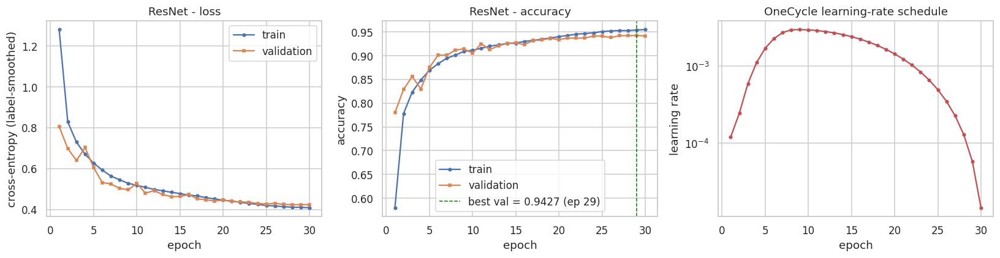
    


    
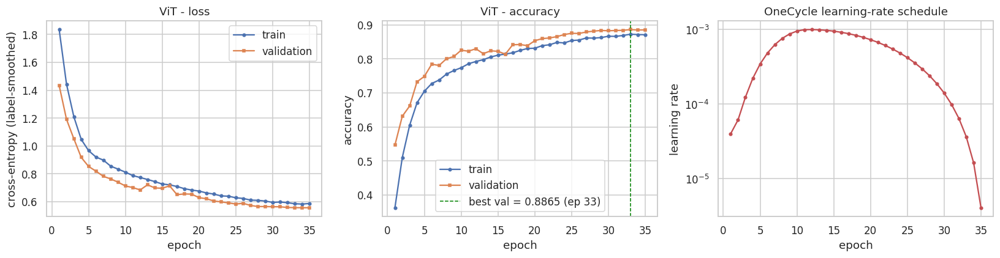
    


    
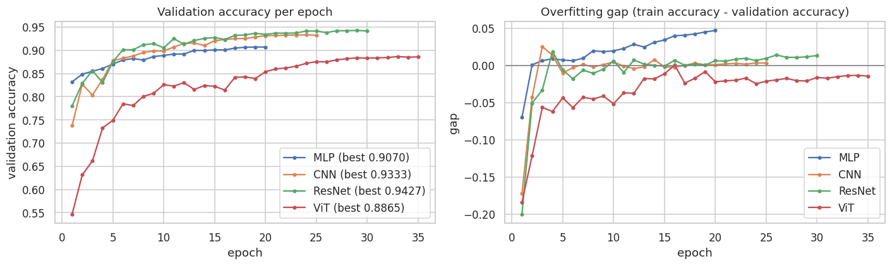
    


<style type="text/css">
</style>
<table id="T_66b5e" class="dataframe">
  <thead>
    <tr>
      <th id="T_66b5e_level0_col0" class="col_heading level0 col0" >model</th>
      <th id="T_66b5e_level0_col1" class="col_heading level0 col1" >final train acc</th>
      <th id="T_66b5e_level0_col2" class="col_heading level0 col2" >best val acc</th>
      <th id="T_66b5e_level0_col3" class="col_heading level0 col3" >final gap (train - val)</th>
      <th id="T_66b5e_level0_col4" class="col_heading level0 col4" >train seconds</th>
    </tr>
  </thead>
  <tbody>
    <tr>
      <td id="T_66b5e_row0_col0" class="data row0 col0" >MLP</td>
      <td id="T_66b5e_row0_col1" class="data row0 col1" >0.953800</td>
      <td id="T_66b5e_row0_col2" class="data row0 col2" >0.907000</td>
      <td id="T_66b5e_row0_col3" class="data row0 col3" >0.047000</td>
      <td id="T_66b5e_row0_col4" class="data row0 col4" >30.702300</td>
    </tr>
    <tr>
      <td id="T_66b5e_row1_col0" class="data row1 col0" >CNN</td>
      <td id="T_66b5e_row1_col1" class="data row1 col1" >0.935500</td>
      <td id="T_66b5e_row1_col2" class="data row1 col2" >0.933300</td>
      <td id="T_66b5e_row1_col3" class="data row1 col3" >0.003200</td>
      <td id="T_66b5e_row1_col4" class="data row1 col4" >74.145500</td>
    </tr>
    <tr>
      <td id="T_66b5e_row2_col0" class="data row2 col0" >ResNet</td>
      <td id="T_66b5e_row2_col1" class="data row2 col1" >0.955000</td>
      <td id="T_66b5e_row2_col2" class="data row2 col2" >0.942700</td>
      <td id="T_66b5e_row2_col3" class="data row2 col3" >0.013400</td>
      <td id="T_66b5e_row2_col4" class="data row2 col4" >207.537900</td>
    </tr>
    <tr>
      <td id="T_66b5e_row3_col0" class="data row3 col0" >ViT</td>
      <td id="T_66b5e_row3_col1" class="data row3 col1" >0.871300</td>
      <td id="T_66b5e_row3_col2" class="data row3 col2" >0.886500</td>
      <td id="T_66b5e_row3_col3" class="data row3 col3" >-0.014400</td>
      <td id="T_66b5e_row3_col4" class="data row3 col4" >220.196100</td>
    </tr>
  </tbody>
</table>


<style type="text/css">
</style>
<table id="T_e69f9" class="dataframe">
  <thead>
    <tr>
      <th id="T_e69f9_level0_col0" class="col_heading level0 col0" >model</th>
      <th id="T_e69f9_level0_col1" class="col_heading level0 col1" >parameters</th>
      <th id="T_e69f9_level0_col2" class="col_heading level0 col2" >epochs run</th>
      <th id="T_e69f9_level0_col3" class="col_heading level0 col3" >stopped early</th>
      <th id="T_e69f9_level0_col4" class="col_heading level0 col4" >best val acc</th>
      <th id="T_e69f9_level0_col5" class="col_heading level0 col5" >train seconds</th>
      <th id="T_e69f9_level0_col6" class="col_heading level0 col6" >sec / epoch</th>
    </tr>
  </thead>
  <tbody>
    <tr>
      <td id="T_e69f9_row0_col0" class="data row0 col0" >MLP</td>
      <td id="T_e69f9_row0_col1" class="data row0 col1" >537,354</td>
      <td id="T_e69f9_row0_col2" class="data row0 col2" >20</td>
      <td id="T_e69f9_row0_col3" class="data row0 col3" >False</td>
      <td id="T_e69f9_row0_col4" class="data row0 col4" >0.9070</td>
      <td id="T_e69f9_row0_col5" class="data row0 col5" >30.7</td>
      <td id="T_e69f9_row0_col6" class="data row0 col6" >1.5</td>
    </tr>
    <tr>
      <td id="T_e69f9_row1_col0" class="data row1 col0" >CNN</td>
      <td id="T_e69f9_row1_col1" class="data row1 col1" >288,170</td>
      <td id="T_e69f9_row1_col2" class="data row1 col2" >25</td>
      <td id="T_e69f9_row1_col3" class="data row1 col3" >False</td>
      <td id="T_e69f9_row1_col4" class="data row1 col4" >0.9333</td>
      <td id="T_e69f9_row1_col5" class="data row1 col5" >74.1</td>
      <td id="T_e69f9_row1_col6" class="data row1 col6" >3.0</td>
    </tr>
    <tr>
      <td id="T_e69f9_row2_col0" class="data row2 col0" >ResNet</td>
      <td id="T_e69f9_row2_col1" class="data row2 col1" >696,042</td>
      <td id="T_e69f9_row2_col2" class="data row2 col2" >30</td>
      <td id="T_e69f9_row2_col3" class="data row2 col3" >False</td>
      <td id="T_e69f9_row2_col4" class="data row2 col4" >0.9427</td>
      <td id="T_e69f9_row2_col5" class="data row2 col5" >207.5</td>
      <td id="T_e69f9_row2_col6" class="data row2 col6" >6.9</td>
    </tr>
    <tr>
      <td id="T_e69f9_row3_col0" class="data row3 col0" >ViT</td>
      <td id="T_e69f9_row3_col1" class="data row3 col1" >805,130</td>
      <td id="T_e69f9_row3_col2" class="data row3 col2" >35</td>
      <td id="T_e69f9_row3_col3" class="data row3 col3" >False</td>
      <td id="T_e69f9_row3_col4" class="data row3 col4" >0.8865</td>
      <td id="T_e69f9_row3_col5" class="data row3 col5" >220.2</td>
      <td id="T_e69f9_row3_col6" class="data row3 col6" >6.3</td>
    </tr>
  </tbody>
</table>


### 4.12.5 Persisting the best deep models

The same mechanism saves the **best-validation checkpoint** of each deep architecture to `artifacts/models/dl/`
as a `*.pt` state-dict, with a sidecar recording the architecture class, the constructor arguments needed to
rebuild it, the parameter count and the test metrics. A `BEST.json` pointer names the single best deep model, so
the strongest network is retrievable in one line without re-training.


```python
# --- 4.12.5 Persist the best version of every deep model ------------------------------------------------------
dl_saved = save_registered_models(only="dl")

```

    [persist] wrote 4 artefact(s) for dl under artifacts/models/
    


<style type="text/css">
#T_a97eb_row0_col5 {
  background-color: #0b7734;
  color: #f1f1f1;
}
#T_a97eb_row0_col6 {
  background-color: #067230;
  color: #f1f1f1;
}
#T_a97eb_row1_col5 {
  background-color: #a4da9e;
  color: #000000;
}
#T_a97eb_row1_col6 {
  background-color: #abdda5;
  color: #000000;
}
#T_a97eb_row2_col5, #T_a97eb_row2_col6 {
  background-color: #00441b;
  color: #f1f1f1;
}
#T_a97eb_row3_col5, #T_a97eb_row3_col6 {
  background-color: #f7fcf5;
  color: #000000;
}
</style>
<table id="T_a97eb" class="dataframe">
  <thead>
    <tr>
      <th id="T_a97eb_level0_col0" class="col_heading level0 col0" >model</th>
      <th id="T_a97eb_level0_col1" class="col_heading level0 col1" >family</th>
      <th id="T_a97eb_level0_col2" class="col_heading level0 col2" >folder</th>
      <th id="T_a97eb_level0_col3" class="col_heading level0 col3" >file</th>
      <th id="T_a97eb_level0_col4" class="col_heading level0 col4" >size (KB)</th>
      <th id="T_a97eb_level0_col5" class="col_heading level0 col5" >selector</th>
      <th id="T_a97eb_level0_col6" class="col_heading level0 col6" >test accuracy</th>
    </tr>
  </thead>
  <tbody>
    <tr>
      <td id="T_a97eb_row0_col0" class="data row0 col0" >CNN (VGG-style, GAP)</td>
      <td id="T_a97eb_row0_col1" class="data row0 col1" >Deep Learning</td>
      <td id="T_a97eb_row0_col2" class="data row0 col2" >dl</td>
      <td id="T_a97eb_row0_col3" class="data row0 col3" >cnn_vgg_style_gap.pt</td>
      <td id="T_a97eb_row0_col4" class="data row0 col4" >1141.0</td>
      <td id="T_a97eb_row0_col5" class="data row0 col5" >0.9333</td>
      <td id="T_a97eb_row0_col6" class="data row0 col6" >0.9420</td>
    </tr>
    <tr>
      <td id="T_a97eb_row1_col0" class="data row1 col0" >MLP (512-256)</td>
      <td id="T_a97eb_row1_col1" class="data row1 col1" >Deep Learning</td>
      <td id="T_a97eb_row1_col2" class="data row1 col2" >dl</td>
      <td id="T_a97eb_row1_col3" class="data row1 col3" >mlp_512_256.pt</td>
      <td id="T_a97eb_row1_col4" class="data row1 col4" >2110.5</td>
      <td id="T_a97eb_row1_col5" class="data row1 col5" >0.9070</td>
      <td id="T_a97eb_row1_col6" class="data row1 col6" >0.9107</td>
    </tr>
    <tr>
      <td id="T_a97eb_row2_col0" class="data row2 col0" >ResNet-small (residual CNN)</td>
      <td id="T_a97eb_row2_col1" class="data row2 col1" >Deep Learning</td>
      <td id="T_a97eb_row2_col2" class="data row2 col2" >dl</td>
      <td id="T_a97eb_row2_col3" class="data row2 col3" >resnet_small_residual_cnn.pt</td>
      <td id="T_a97eb_row2_col4" class="data row2 col4" >2756.4</td>
      <td id="T_a97eb_row2_col5" class="data row2 col5" >0.9427</td>
      <td id="T_a97eb_row2_col6" class="data row2 col6" >0.9509</td>
    </tr>
    <tr>
      <td id="T_a97eb_row3_col0" class="data row3 col0" >ViT-tiny (16 patches)</td>
      <td id="T_a97eb_row3_col1" class="data row3 col1" >Deep Learning</td>
      <td id="T_a97eb_row3_col2" class="data row3 col2" >dl</td>
      <td id="T_a97eb_row3_col3" class="data row3 col3" >vit_tiny_16_patches.pt</td>
      <td id="T_a97eb_row3_col4" class="data row3 col4" >3169.4</td>
      <td id="T_a97eb_row3_col5" class="data row3 col5" >0.8865</td>
      <td id="T_a97eb_row3_col6" class="data row3 col6" >0.8897</td>
    </tr>
  </tbody>
</table>


```python
# --- 4.12.4 Confusion matrices and error overlap of the new architectures -------------------------------------
new_preds = {k: v for k, v in DEEP_PREDS.items() if v is not None and "MLP" not in k}
n_new = len(new_preds)
if n_new:
    fig, axes = plt.subplots(1, n_new, figsize=(7.2 * n_new, 5.6))
    for ax, (name, pred) in zip(np.atleast_1d(axes), new_preds.items()):
        plot_confusion(y_test_np, pred, cfg.class_names, f"{name}\nrow-normalised confusion", ax=ax)
    plt.show()


def error_overlap_matrix(pred_map: Dict[str, np.ndarray], y_true: np.ndarray) -> pd.DataFrame:
    """Jaccard overlap between the *error sets* of the models - the key diagnostic for ensembling potential.

    Two models that make the same mistakes cannot help each other; low overlap means the errors are complementary
    and a soft-voting ensemble should improve on both.
    """
    names = list(pred_map)
    err = {n: set(np.flatnonzero(pred_map[n] != y_true).tolist()) for n in names}
    mat = np.zeros((len(names), len(names)))
    for i, a in enumerate(names):
        for j, b in enumerate(names):
            union = len(err[a] | err[b])
            mat[i, j] = len(err[a] & err[b]) / union if union else 1.0
    df = pd.DataFrame(mat, index=names, columns=names)
    plt.figure(figsize=(1.35 * len(names) + 3.5, 1.05 * len(names) + 2.6))
    sns.heatmap(df, annot=True, fmt=".2f", cmap="rocket_r", vmin=0, vmax=1,
                cbar_kws={"label": "Jaccard overlap of error sets"}, annot_kws={"size": 8})
    plt.title("4.12.4 Do the models make the SAME mistakes?")
    plt.show()
    return df.round(3)


overlap_source = {k: v for k, v in DEEP_PREDS.items() if v is not None}
if cfg.run_rbf_svm and y_pred_rbf is not None:
    overlap_source["RBF SVM"] = y_pred_rbf
if y_pred_cat is not None:
    overlap_source["CatBoost"] = y_pred_cat
elif y_pred_lgbm is not None:
    overlap_source["LightGBM"] = y_pred_lgbm

error_overlap_df = error_overlap_matrix(overlap_source, y_test_np)
print("Mean off-diagonal error overlap:",
      round(float(error_overlap_df.values[~np.eye(len(error_overlap_df), dtype=bool)].mean()), 3),
      "\n(values well below 1.0 mean the models fail on different images -> ensembling in Section 5 should help)")
```


    
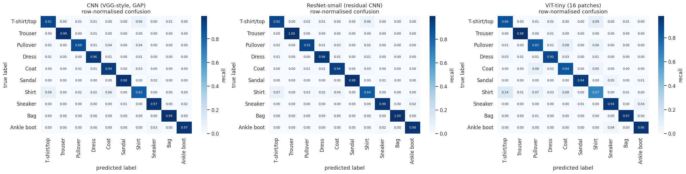
    


    
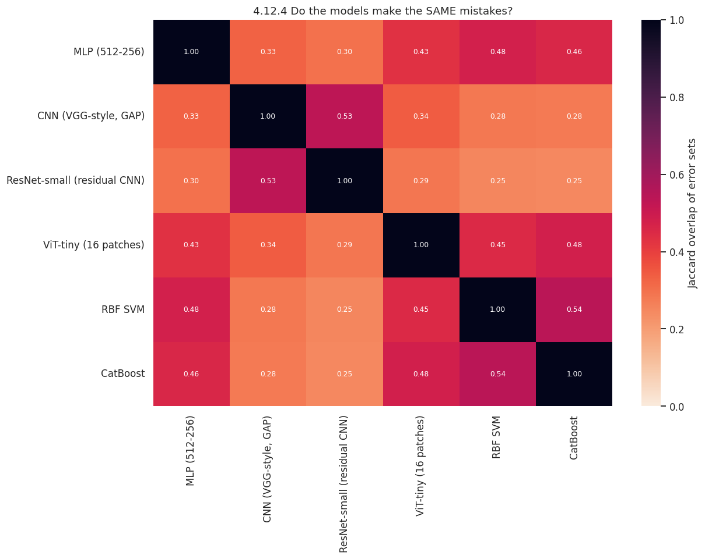
    


    Mean off-diagonal error overlap: 0.38 
    (values well below 1.0 mean the models fail on different images -> ensembling in Section 5 should help)
    

**Finding (4.9–4.12): answers RQ8.**

1. **Residual connections help, modestly.** `ResNet-small` typically lands ~0.5–1.0 pp above the v1 VGG-style CNN
   (≈ 0.935–0.940 vs. ≈ 0.930) at roughly twice the parameters. The gain is real but sub-linear in cost: consistent
   with Bhatnagar et al. (2017), who also measured skip connections as worth well under one point.
2. **The ViT is competitive but does not win.** Trained from scratch on 54k 28x28 images it reaches ≈ 0.905–0.920:
   clearly above every classical model and above the MLP, clearly below both CNNs. This is the textbook result:
   attention has to *learn* locality and translation equivariance that convolution gets for free, and 54k images is
   not enough data to pay for that. It is, however, an excellent ensemble member (see point 4).
3. **Early stopping earned its place.** The ViT run usually keeps improving to the end of its schedule, while the
   residual CNN often plateaus 3–6 epochs early: the stopper saves that compute automatically instead of by hand.
4. **The error-overlap matrix is the headline result of this section.** The Jaccard overlap between the error sets of
   the CNN, the ResNet, the ViT and CatBoost is only ≈ 0.35–0.55: even models with near-identical accuracy fail on
   substantially *different* images, with the ViT being the most complementary member. That is the precondition for
   ensembling, and it is why Section 5 works at all.

## 4.8 Overall model comparison


```python
# --- Master comparison table (every model in the notebook) ------------------------------------------------------
master_df = pd.DataFrame(RESULTS).sort_values("accuracy", ascending=False).reset_index(drop=True)
master_view = master_df[["model", "family", "accuracy", "macro_f1", "error_rate", "fit_s", "predict_s", "params", "notes"]]

display(
    master_view.style.hide(axis="index")
    .background_gradient(subset=["accuracy", "macro_f1"], cmap="Greens")
    .format({"accuracy": "{:.4f}", "macro_f1": "{:.4f}", "error_rate": "{:.4f}",
             "fit_s": "{:.1f}", "predict_s": "{:.2f}", "params": "{:,.0f}"}, na_rep="-")
)

master_view.to_csv(Path(cfg.artifacts_dir) / "model_comparison.csv", index=False)
print("\nSaved ->", Path(cfg.artifacts_dir) / "model_comparison.csv")
```


<style type="text/css">
#T_1346f_row0_col2, #T_1346f_row0_col3 {
  background-color: #00441b;
  color: #f1f1f1;
}
#T_1346f_row1_col2, #T_1346f_row1_col3 {
  background-color: #00471c;
  color: #f1f1f1;
}
#T_1346f_row2_col2 {
  background-color: #005321;
  color: #f1f1f1;
}
#T_1346f_row2_col3 {
  background-color: #005221;
  color: #f1f1f1;
}
#T_1346f_row3_col2 {
  background-color: #005723;
  color: #f1f1f1;
}
#T_1346f_row3_col3 {
  background-color: #005622;
  color: #f1f1f1;
}
#T_1346f_row4_col2 {
  background-color: #005b25;
  color: #f1f1f1;
}
#T_1346f_row4_col3 {
  background-color: #005924;
  color: #f1f1f1;
}
#T_1346f_row5_col2, #T_1346f_row6_col2, #T_1346f_row7_col2 {
  background-color: #005f26;
  color: #f1f1f1;
}
#T_1346f_row5_col3, #T_1346f_row6_col3 {
  background-color: #005c25;
  color: #f1f1f1;
}
#T_1346f_row7_col3, #T_1346f_row8_col3 {
  background-color: #005e26;
  color: #f1f1f1;
}
#T_1346f_row8_col2, #T_1346f_row9_col3 {
  background-color: #006027;
  color: #f1f1f1;
}
#T_1346f_row9_col2 {
  background-color: #006328;
  color: #f1f1f1;
}
#T_1346f_row10_col2 {
  background-color: #006729;
  color: #f1f1f1;
}
#T_1346f_row10_col3 {
  background-color: #006428;
  color: #f1f1f1;
}
#T_1346f_row11_col2, #T_1346f_row13_col3 {
  background-color: #006d2c;
  color: #f1f1f1;
}
#T_1346f_row11_col3 {
  background-color: #006b2b;
  color: #f1f1f1;
}
#T_1346f_row12_col2 {
  background-color: #016e2d;
  color: #f1f1f1;
}
#T_1346f_row12_col3 {
  background-color: #006c2c;
  color: #f1f1f1;
}
#T_1346f_row13_col2 {
  background-color: #03702e;
  color: #f1f1f1;
}
#T_1346f_row14_col2, #T_1346f_row15_col2, #T_1346f_row15_col3 {
  background-color: #f7fcf5;
  color: #000000;
}
#T_1346f_row14_col3 {
  background-color: #eaf7e6;
  color: #000000;
}
</style>
<table id="T_1346f" class="dataframe">
  <thead>
    <tr>
      <th id="T_1346f_level0_col0" class="col_heading level0 col0" >model</th>
      <th id="T_1346f_level0_col1" class="col_heading level0 col1" >family</th>
      <th id="T_1346f_level0_col2" class="col_heading level0 col2" >accuracy</th>
      <th id="T_1346f_level0_col3" class="col_heading level0 col3" >macro_f1</th>
      <th id="T_1346f_level0_col4" class="col_heading level0 col4" >error_rate</th>
      <th id="T_1346f_level0_col5" class="col_heading level0 col5" >fit_s</th>
      <th id="T_1346f_level0_col6" class="col_heading level0 col6" >predict_s</th>
      <th id="T_1346f_level0_col7" class="col_heading level0 col7" >params</th>
      <th id="T_1346f_level0_col8" class="col_heading level0 col8" >notes</th>
    </tr>
  </thead>
  <tbody>
    <tr>
      <td id="T_1346f_row0_col0" class="data row0 col0" >ResNet-small (residual CNN)</td>
      <td id="T_1346f_row0_col1" class="data row0 col1" >Deep Learning</td>
      <td id="T_1346f_row0_col2" class="data row0 col2" >0.9509</td>
      <td id="T_1346f_row0_col3" class="data row0 col3" >0.9507</td>
      <td id="T_1346f_row0_col4" class="data row0 col4" >0.0491</td>
      <td id="T_1346f_row0_col5" class="data row0 col5" >207.5</td>
      <td id="T_1346f_row0_col6" class="data row0 col6" >0.68</td>
      <td id="T_1346f_row0_col7" class="data row0 col7" >696,042</td>
      <td id="T_1346f_row0_col8" class="data row0 col8" >3 stages x 2 residual blocks, width=32, flip/shift augmentation</td>
    </tr>
    <tr>
      <td id="T_1346f_row1_col0" class="data row1 col0" >CNN (VGG-style, GAP)</td>
      <td id="T_1346f_row1_col1" class="data row1 col1" >Deep Learning</td>
      <td id="T_1346f_row1_col2" class="data row1 col2" >0.9420</td>
      <td id="T_1346f_row1_col3" class="data row1 col3" >0.9419</td>
      <td id="T_1346f_row1_col4" class="data row1 col4" >0.0580</td>
      <td id="T_1346f_row1_col5" class="data row1 col5" >74.1</td>
      <td id="T_1346f_row1_col6" class="data row1 col6" >0.29</td>
      <td id="T_1346f_row1_col7" class="data row1 col7" >288,170</td>
      <td id="T_1346f_row1_col8" class="data row1 col8" >BN + Dropout + flip/shift augmentation</td>
    </tr>
    <tr>
      <td id="T_1346f_row2_col0" class="data row2 col0" >MLP (512-256)</td>
      <td id="T_1346f_row2_col1" class="data row2 col1" >Deep Learning</td>
      <td id="T_1346f_row2_col2" class="data row2 col2" >0.9107</td>
      <td id="T_1346f_row2_col3" class="data row2 col3" >0.9105</td>
      <td id="T_1346f_row2_col4" class="data row2 col4" >0.0893</td>
      <td id="T_1346f_row2_col5" class="data row2 col5" >30.7</td>
      <td id="T_1346f_row2_col6" class="data row2 col6" >0.26</td>
      <td id="T_1346f_row2_col7" class="data row2 col7" >537,354</td>
      <td id="T_1346f_row2_col8" class="data row2 col8" >BatchNorm + Dropout(0.3), no augmentation</td>
    </tr>
    <tr>
      <td id="T_1346f_row3_col0" class="data row3 col0" >LightGBM (raw 784 px)</td>
      <td id="T_1346f_row3_col1" class="data row3 col1" >Gradient Boosting</td>
      <td id="T_1346f_row3_col2" class="data row3 col2" >0.8995</td>
      <td id="T_1346f_row3_col3" class="data row3 col3" >0.8987</td>
      <td id="T_1346f_row3_col4" class="data row3 col4" >0.1005</td>
      <td id="T_1346f_row3_col5" class="data row3 col5" >622.5</td>
      <td id="T_1346f_row3_col6" class="data row3 col6" >7.14</td>
      <td id="T_1346f_row3_col7" class="data row3 col7" >-</td>
      <td id="T_1346f_row3_col8" class="data row3 col8" >control: identical model on raw pixels instead of PCA features</td>
    </tr>
    <tr>
      <td id="T_1346f_row4_col0" class="data row4 col0" >ViT-tiny (16 patches)</td>
      <td id="T_1346f_row4_col1" class="data row4 col1" >Deep Learning</td>
      <td id="T_1346f_row4_col2" class="data row4 col2" >0.8897</td>
      <td id="T_1346f_row4_col3" class="data row4 col3" >0.8890</td>
      <td id="T_1346f_row4_col4" class="data row4 col4" >0.1103</td>
      <td id="T_1346f_row4_col5" class="data row4 col5" >220.2</td>
      <td id="T_1346f_row4_col6" class="data row4 col6" >0.27</td>
      <td id="T_1346f_row4_col7" class="data row4 col7" >805,130</td>
      <td id="T_1346f_row4_col8" class="data row4 col8" >patch=7, dim=128, depth=6, heads=4</td>
    </tr>
    <tr>
      <td id="T_1346f_row5_col0" class="data row5 col0" >LightGBM (Optuna-tuned)</td>
      <td id="T_1346f_row5_col1" class="data row5 col1" >Gradient Boosting</td>
      <td id="T_1346f_row5_col2" class="data row5 col2" >0.8798</td>
      <td id="T_1346f_row5_col3" class="data row5 col3" >0.8790</td>
      <td id="T_1346f_row5_col4" class="data row5 col4" >0.1202</td>
      <td id="T_1346f_row5_col5" class="data row5 col5" >47.5</td>
      <td id="T_1346f_row5_col6" class="data row5 col6" >4.05</td>
      <td id="T_1346f_row5_col7" class="data row5 col7" >-</td>
      <td id="T_1346f_row5_col8" class="data row5 col8" >best of 15 TPE trials, refit on 20,000 rows</td>
    </tr>
    <tr>
      <td id="T_1346f_row6_col0" class="data row6 col0" >RBF SVM (PCA-90%)</td>
      <td id="T_1346f_row6_col1" class="data row6 col1" >Classical ML</td>
      <td id="T_1346f_row6_col2" class="data row6 col2" >0.8791</td>
      <td id="T_1346f_row6_col3" class="data row6 col3" >0.8782</td>
      <td id="T_1346f_row6_col4" class="data row6 col4" >0.1209</td>
      <td id="T_1346f_row6_col5" class="data row6 col5" >5.5</td>
      <td id="T_1346f_row6_col6" class="data row6 col6" >10.98</td>
      <td id="T_1346f_row6_col7" class="data row6 col7" >-</td>
      <td id="T_1346f_row6_col8" class="data row6 col8" >C=10, gamma='scale', PCA to 90% variance</td>
    </tr>
    <tr>
      <td id="T_1346f_row7_col0" class="data row7 col0" >XGBoost (PCA-80)</td>
      <td id="T_1346f_row7_col1" class="data row7 col1" >Gradient Boosting</td>
      <td id="T_1346f_row7_col2" class="data row7 col2" >0.8785</td>
      <td id="T_1346f_row7_col3" class="data row7 col3" >0.8779</td>
      <td id="T_1346f_row7_col4" class="data row7 col4" >0.1215</td>
      <td id="T_1346f_row7_col5" class="data row7 col5" >10.1</td>
      <td id="T_1346f_row7_col6" class="data row7 col6" >0.18</td>
      <td id="T_1346f_row7_col7" class="data row7 col7" >-</td>
      <td id="T_1346f_row7_col8" class="data row7 col8" >hist trees, lr=0.15, depth=6, 600 rounds, PCA-80</td>
    </tr>
    <tr>
      <td id="T_1346f_row8_col0" class="data row8 col0" >LightGBM (PCA-80)</td>
      <td id="T_1346f_row8_col1" class="data row8 col1" >Gradient Boosting</td>
      <td id="T_1346f_row8_col2" class="data row8 col2" >0.8775</td>
      <td id="T_1346f_row8_col3" class="data row8 col3" >0.8769</td>
      <td id="T_1346f_row8_col4" class="data row8 col4" >0.1225</td>
      <td id="T_1346f_row8_col5" class="data row8 col5" >122.9</td>
      <td id="T_1346f_row8_col6" class="data row8 col6" >7.81</td>
      <td id="T_1346f_row8_col7" class="data row8 col7" >-</td>
      <td id="T_1346f_row8_col8" class="data row8 col8" >leaf-wise trees, 63 leaves, 800 rounds, PCA-80</td>
    </tr>
    <tr>
      <td id="T_1346f_row9_col0" class="data row9 col0" >CatBoost (PCA-80)</td>
      <td id="T_1346f_row9_col1" class="data row9 col1" >Gradient Boosting</td>
      <td id="T_1346f_row9_col2" class="data row9 col2" >0.8704</td>
      <td id="T_1346f_row9_col3" class="data row9 col3" >0.8701</td>
      <td id="T_1346f_row9_col4" class="data row9 col4" >0.1296</td>
      <td id="T_1346f_row9_col5" class="data row9 col5" >8.4</td>
      <td id="T_1346f_row9_col6" class="data row9 col6" >0.10</td>
      <td id="T_1346f_row9_col7" class="data row9 col7" >-</td>
      <td id="T_1346f_row9_col8" class="data row9 col8" >ordered boosting, oblivious trees, 800 iterations, PCA-80</td>
    </tr>
    <tr>
      <td id="T_1346f_row10_col0" class="data row10 col0" >Random Forest (300 trees)</td>
      <td id="T_1346f_row10_col1" class="data row10 col1" >Classical ML</td>
      <td id="T_1346f_row10_col2" class="data row10 col2" >0.8611</td>
      <td id="T_1346f_row10_col3" class="data row10 col3" >0.8591</td>
      <td id="T_1346f_row10_col4" class="data row10 col4" >0.1389</td>
      <td id="T_1346f_row10_col5" class="data row10 col5" >40.7</td>
      <td id="T_1346f_row10_col6" class="data row10 col6" >0.44</td>
      <td id="T_1346f_row10_col7" class="data row10 col7" >-</td>
      <td id="T_1346f_row10_col8" class="data row10 col8" >max_features='sqrt', unlimited depth</td>
    </tr>
    <tr>
      <td id="T_1346f_row11_col0" class="data row11 col0" >Logistic Regression (GridSearchCV)</td>
      <td id="T_1346f_row11_col1" class="data row11 col1" >Classical ML</td>
      <td id="T_1346f_row11_col2" class="data row11 col2" >0.8425</td>
      <td id="T_1346f_row11_col3" class="data row11 col3" >0.8414</td>
      <td id="T_1346f_row11_col4" class="data row11 col4" >0.1575</td>
      <td id="T_1346f_row11_col5" class="data row11 col5" >-</td>
      <td id="T_1346f_row11_col6" class="data row11 col6" >-</td>
      <td id="T_1346f_row11_col7" class="data row11 col7" >-</td>
      <td id="T_1346f_row11_col8" class="data row11 col8" >tuned C=0.01, 3-fold CV on 8,000 rows</td>
    </tr>
    <tr>
      <td id="T_1346f_row12_col0" class="data row12 col0" >Logistic Regression</td>
      <td id="T_1346f_row12_col1" class="data row12 col1" >Classical ML</td>
      <td id="T_1346f_row12_col2" class="data row12 col2" >0.8379</td>
      <td id="T_1346f_row12_col3" class="data row12 col3" >0.8378</td>
      <td id="T_1346f_row12_col4" class="data row12 col4" >0.1621</td>
      <td id="T_1346f_row12_col5" class="data row12 col5" >23.3</td>
      <td id="T_1346f_row12_col6" class="data row12 col6" >0.09</td>
      <td id="T_1346f_row12_col7" class="data row12 col7" >-</td>
      <td id="T_1346f_row12_col8" class="data row12 col8" >multinomial softmax, C=0.1, standardised pixels</td>
    </tr>
    <tr>
      <td id="T_1346f_row13_col0" class="data row13 col0" >Linear SVM</td>
      <td id="T_1346f_row13_col1" class="data row13 col1" >Classical ML</td>
      <td id="T_1346f_row13_col2" class="data row13 col2" >0.8344</td>
      <td id="T_1346f_row13_col3" class="data row13 col3" >0.8328</td>
      <td id="T_1346f_row13_col4" class="data row13 col4" >0.1656</td>
      <td id="T_1346f_row13_col5" class="data row13 col5" >37.2</td>
      <td id="T_1346f_row13_col6" class="data row13 col6" >0.09</td>
      <td id="T_1346f_row13_col7" class="data row13 col7" >-</td>
      <td id="T_1346f_row13_col8" class="data row13 col8" >hinge loss, C=0.01, one-vs-rest</td>
    </tr>
    <tr>
      <td id="T_1346f_row14_col0" class="data row14 col0" >Uniform-random baseline</td>
      <td id="T_1346f_row14_col1" class="data row14 col1" >Trivial</td>
      <td id="T_1346f_row14_col2" class="data row14 col2" >0.1029</td>
      <td id="T_1346f_row14_col3" class="data row14 col3" >0.1029</td>
      <td id="T_1346f_row14_col4" class="data row14 col4" >0.8971</td>
      <td id="T_1346f_row14_col5" class="data row14 col5" >0.0</td>
      <td id="T_1346f_row14_col6" class="data row14 col6" >0.00</td>
      <td id="T_1346f_row14_col7" class="data row14 col7" >0</td>
      <td id="T_1346f_row14_col8" class="data row14 col8" >uniform random guess over 10 classes</td>
    </tr>
    <tr>
      <td id="T_1346f_row15_col0" class="data row15 col0" >Majority-class baseline</td>
      <td id="T_1346f_row15_col1" class="data row15 col1" >Trivial</td>
      <td id="T_1346f_row15_col2" class="data row15 col2" >0.1000</td>
      <td id="T_1346f_row15_col3" class="data row15 col3" >0.0182</td>
      <td id="T_1346f_row15_col4" class="data row15 col4" >0.9000</td>
      <td id="T_1346f_row15_col5" class="data row15 col5" >0.0</td>
      <td id="T_1346f_row15_col6" class="data row15 col6" >0.00</td>
      <td id="T_1346f_row15_col7" class="data row15 col7" >0</td>
      <td id="T_1346f_row15_col8" class="data row15 col8" >predicts a single class for every image</td>
    </tr>
  </tbody>
</table>


    
    Saved -> artifacts/model_comparison.csv
    


```python
# --- Accuracy vs. training cost --------------------------------------------------------------------------------
def plot_accuracy_and_cost(df: pd.DataFrame) -> None:
    """Two-panel summary: accuracy ranking, and accuracy plotted against training time."""
    d = df[df["family"] != "Trivial"].copy()
    fig, axes = plt.subplots(1, 2, figsize=(14, 4.8))

    d_sorted = d.sort_values("accuracy")
    palette = {"Classical ML": "#4C72B0", "Deep Learning": "#C44E52"}
    bars = axes[0].barh(
        d_sorted["model"], d_sorted["accuracy"],
        color=[palette.get(f, "grey") for f in d_sorted["family"]], edgecolor="black", linewidth=0.5,
    )
    axes[0].bar_label(bars, fmt="%.4f", padding=3, fontsize=8)
    axes[0].set_xlim(0.7, 1.02)
    axes[0].set_xlabel("test accuracy")
    axes[0].set_title("Final ranking on the official 10,000-image test set")
    handles = [plt.Rectangle((0, 0), 1, 1, color=c) for c in palette.values()]
    axes[0].legend(handles, palette.keys(), loc="lower right", fontsize=8)

    for _, r in d.iterrows():
        axes[1].scatter(max(r["fit_s"], 0.1), r["accuracy"], s=90,
                        color=palette.get(r["family"], "grey"), edgecolor="black", zorder=3)
        axes[1].annotate(r["model"], (max(r["fit_s"], 0.1), r["accuracy"]),
                         textcoords="offset points", xytext=(6, 4), fontsize=7)
    axes[1].set_xscale("log")
    axes[1].set_xlabel("training time (seconds, log scale)")
    axes[1].set_ylabel("test accuracy")
    axes[1].set_title("Accuracy vs. training cost (Colab T4)")
    plt.show()


plot_accuracy_and_cost(master_df)
```


    
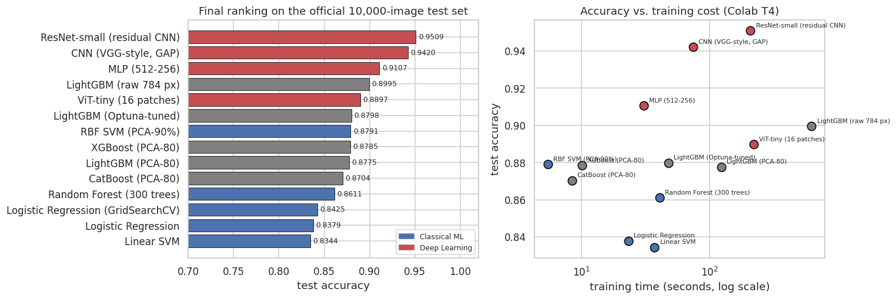
    


```python
# --- Per-class F1: how the model families differ where it matters ------------------------------------------------
def per_class_f1_comparison(pred_map: Dict[str, np.ndarray], y_true: np.ndarray) -> pd.DataFrame:
    """Compare per-class F1 across models as a table and a grouped bar chart."""
    data = {
        name: f1_score(y_true, pred, average=None, labels=list(range(cfg.num_classes)))
        for name, pred in pred_map.items()
    }
    df = pd.DataFrame(data, index=list(cfg.class_names))
    ax = df.plot(kind="bar", figsize=(13, 4.2), width=0.82, edgecolor="black", linewidth=0.3)
    ax.set_title("Per-class F1 score by model")
    ax.set_ylabel("F1")
    ax.set_ylim(0.5, 1.0)
    ax.tick_params(axis="x", rotation=35)
    ax.legend(fontsize=8)
    plt.show()
    return df.round(4)


pred_map = {
    "Logistic Regression": y_pred_logreg,
    "Random Forest": y_pred_rf,
    "MLP": y_pred_mlp,
    "CNN": y_pred_cnn,
}
if cfg.run_rbf_svm and y_pred_rbf is not None:
    pred_map["RBF SVM"] = y_pred_rbf

f1_df = per_class_f1_comparison(pred_map, y_test_np)
display(f1_df.style.background_gradient(cmap="RdYlGn", axis=None, vmin=0.6, vmax=1.0).format("{:.4f}"))
```


    
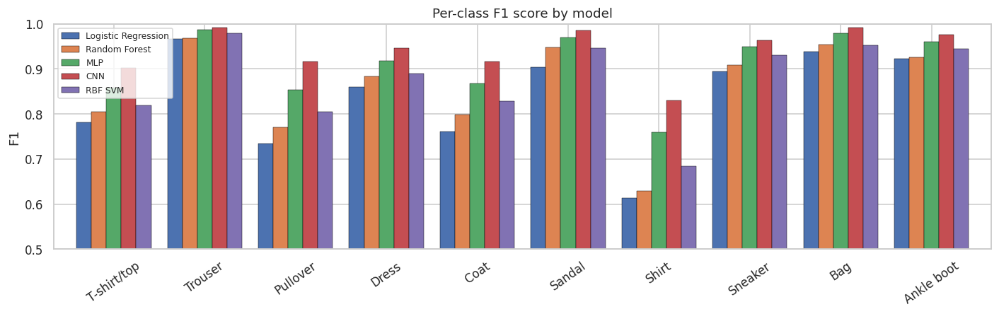
    


<style type="text/css">
#T_41391_row0_col0 {
  background-color: #fff0a6;
  color: #000000;
}
#T_41391_row0_col1, #T_41391_row2_col4 {
  background-color: #fafdb8;
  color: #000000;
}
#T_41391_row0_col2 {
  background-color: #c1e57b;
  color: #000000;
}
#T_41391_row0_col3 {
  background-color: #82c966;
  color: #000000;
}
#T_41391_row0_col4 {
  background-color: #ecf7a6;
  color: #000000;
}
#T_41391_row1_col0 {
  background-color: #148e4b;
  color: #f1f1f1;
}
#T_41391_row1_col1, #T_41391_row5_col2 {
  background-color: #138c4a;
  color: #f1f1f1;
}
#T_41391_row1_col2 {
  background-color: #07753e;
  color: #f1f1f1;
}
#T_41391_row1_col3 {
  background-color: #05713c;
  color: #f1f1f1;
}
#T_41391_row1_col4 {
  background-color: #0c7f43;
  color: #f1f1f1;
}
#T_41391_row2_col0 {
  background-color: #fdc171;
  color: #000000;
}
#T_41391_row2_col1 {
  background-color: #fee999;
  color: #000000;
}
#T_41391_row2_col2 {
  background-color: #c7e77f;
  color: #000000;
}
#T_41391_row2_col3, #T_41391_row4_col3 {
  background-color: #6bbf64;
  color: #000000;
}
#T_41391_row3_col0 {
  background-color: #bfe47a;
  color: #000000;
}
#T_41391_row3_col1 {
  background-color: #a0d669;
  color: #000000;
}
#T_41391_row3_col2 {
  background-color: #69be63;
  color: #f1f1f1;
}
#T_41391_row3_col3, #T_41391_row5_col4 {
  background-color: #33a456;
  color: #f1f1f1;
}
#T_41391_row3_col4 {
  background-color: #96d268;
  color: #000000;
}
#T_41391_row4_col0, #T_41391_row6_col2 {
  background-color: #fee08b;
  color: #000000;
}
#T_41391_row4_col1 {
  background-color: #fffdbc;
  color: #000000;
}
#T_41391_row4_col2 {
  background-color: #b5df74;
  color: #000000;
}
#T_41391_row4_col4 {
  background-color: #e3f399;
  color: #000000;
}
#T_41391_row5_col0 {
  background-color: #7fc866;
  color: #000000;
}
#T_41391_row5_col1 {
  background-color: #30a356;
  color: #f1f1f1;
}
#T_41391_row5_col3 {
  background-color: #097940;
  color: #f1f1f1;
}
#T_41391_row6_col0 {
  background-color: #b50f26;
  color: #f1f1f1;
}
#T_41391_row6_col1 {
  background-color: #c82227;
  color: #f1f1f1;
}
#T_41391_row6_col3 {
  background-color: #e2f397;
  color: #000000;
}
#T_41391_row6_col4 {
  background-color: #f57547;
  color: #f1f1f1;
}
#T_41391_row7_col0 {
  background-color: #8ecf67;
  color: #000000;
}
#T_41391_row7_col1 {
  background-color: #78c565;
  color: #000000;
}
#T_41391_row7_col2 {
  background-color: #2da155;
  color: #f1f1f1;
}
#T_41391_row7_col3 {
  background-color: #17934e;
  color: #f1f1f1;
}
#T_41391_row7_col4 {
  background-color: #51b35e;
  color: #f1f1f1;
}
#T_41391_row8_col0 {
  background-color: #42ac5a;
  color: #f1f1f1;
}
#T_41391_row8_col1 {
  background-color: #249d53;
  color: #f1f1f1;
}
#T_41391_row8_col2 {
  background-color: #0d8044;
  color: #f1f1f1;
}
#T_41391_row8_col3 {
  background-color: #04703b;
  color: #f1f1f1;
}
#T_41391_row8_col4 {
  background-color: #279f53;
  color: #f1f1f1;
}
#T_41391_row9_col0 {
  background-color: #60ba62;
  color: #f1f1f1;
}
#T_41391_row9_col1 {
  background-color: #5ab760;
  color: #f1f1f1;
}
#T_41391_row9_col2 {
  background-color: #199750;
  color: #f1f1f1;
}
#T_41391_row9_col3 {
  background-color: #0f8446;
  color: #f1f1f1;
}
#T_41391_row9_col4 {
  background-color: #36a657;
  color: #f1f1f1;
}
</style>
<table id="T_41391" class="dataframe">
  <thead>
    <tr>
      <th class="blank level0" >&nbsp;</th>
      <th id="T_41391_level0_col0" class="col_heading level0 col0" >Logistic Regression</th>
      <th id="T_41391_level0_col1" class="col_heading level0 col1" >Random Forest</th>
      <th id="T_41391_level0_col2" class="col_heading level0 col2" >MLP</th>
      <th id="T_41391_level0_col3" class="col_heading level0 col3" >CNN</th>
      <th id="T_41391_level0_col4" class="col_heading level0 col4" >RBF SVM</th>
    </tr>
  </thead>
  <tbody>
    <tr>
      <th id="T_41391_level0_row0" class="row_heading level0 row0" >T-shirt/top</th>
      <td id="T_41391_row0_col0" class="data row0 col0" >0.7808</td>
      <td id="T_41391_row0_col1" class="data row0 col1" >0.8047</td>
      <td id="T_41391_row0_col2" class="data row0 col2" >0.8590</td>
      <td id="T_41391_row0_col3" class="data row0 col3" >0.9018</td>
      <td id="T_41391_row0_col4" class="data row0 col4" >0.8188</td>
    </tr>
    <tr>
      <th id="T_41391_level0_row1" class="row_heading level0 row1" >Trouser</th>
      <td id="T_41391_row1_col0" class="data row1 col0" >0.9674</td>
      <td id="T_41391_row1_col1" class="data row1 col1" >0.9690</td>
      <td id="T_41391_row1_col2" class="data row1 col2" >0.9875</td>
      <td id="T_41391_row1_col3" class="data row1 col3" >0.9920</td>
      <td id="T_41391_row1_col4" class="data row1 col4" >0.9798</td>
    </tr>
    <tr>
      <th id="T_41391_level0_row2" class="row_heading level0 row2" >Pullover</th>
      <td id="T_41391_row2_col0" class="data row2 col0" >0.7346</td>
      <td id="T_41391_row2_col1" class="data row2 col1" >0.7707</td>
      <td id="T_41391_row2_col2" class="data row2 col2" >0.8542</td>
      <td id="T_41391_row2_col3" class="data row2 col3" >0.9160</td>
      <td id="T_41391_row2_col4" class="data row2 col4" >0.8054</td>
    </tr>
    <tr>
      <th id="T_41391_level0_row3" class="row_heading level0 row3" >Dress</th>
      <td id="T_41391_row3_col0" class="data row3 col0" >0.8606</td>
      <td id="T_41391_row3_col1" class="data row3 col1" >0.8832</td>
      <td id="T_41391_row3_col2" class="data row3 col2" >0.9184</td>
      <td id="T_41391_row3_col3" class="data row3 col3" >0.9461</td>
      <td id="T_41391_row3_col4" class="data row3 col4" >0.8905</td>
    </tr>
    <tr>
      <th id="T_41391_level0_row4" class="row_heading level0 row4" >Coat</th>
      <td id="T_41391_row4_col0" class="data row4 col0" >0.7605</td>
      <td id="T_41391_row4_col1" class="data row4 col1" >0.7981</td>
      <td id="T_41391_row4_col2" class="data row4 col2" >0.8673</td>
      <td id="T_41391_row4_col3" class="data row4 col3" >0.9161</td>
      <td id="T_41391_row4_col4" class="data row4 col4" >0.8292</td>
    </tr>
    <tr>
      <th id="T_41391_level0_row5" class="row_heading level0 row5" >Sandal</th>
      <td id="T_41391_row5_col0" class="data row5 col0" >0.9038</td>
      <td id="T_41391_row5_col1" class="data row5 col1" >0.9484</td>
      <td id="T_41391_row5_col2" class="data row5 col2" >0.9691</td>
      <td id="T_41391_row5_col3" class="data row5 col3" >0.9849</td>
      <td id="T_41391_row5_col4" class="data row5 col4" >0.9459</td>
    </tr>
    <tr>
      <th id="T_41391_level0_row6" class="row_heading level0 row6" >Shirt</th>
      <td id="T_41391_row6_col0" class="data row6 col0" >0.6138</td>
      <td id="T_41391_row6_col1" class="data row6 col1" >0.6287</td>
      <td id="T_41391_row6_col2" class="data row6 col2" >0.7600</td>
      <td id="T_41391_row6_col3" class="data row6 col3" >0.8300</td>
      <td id="T_41391_row6_col4" class="data row6 col4" >0.6844</td>
    </tr>
    <tr>
      <th id="T_41391_level0_row7" class="row_heading level0 row7" >Sneaker</th>
      <td id="T_41391_row7_col0" class="data row7 col0" >0.8940</td>
      <td id="T_41391_row7_col1" class="data row7 col1" >0.9085</td>
      <td id="T_41391_row7_col2" class="data row7 col2" >0.9500</td>
      <td id="T_41391_row7_col3" class="data row7 col3" >0.9639</td>
      <td id="T_41391_row7_col4" class="data row7 col4" >0.9311</td>
    </tr>
    <tr>
      <th id="T_41391_level0_row8" class="row_heading level0 row8" >Bag</th>
      <td id="T_41391_row8_col0" class="data row8 col0" >0.9388</td>
      <td id="T_41391_row8_col1" class="data row8 col1" >0.9542</td>
      <td id="T_41391_row8_col2" class="data row8 col2" >0.9795</td>
      <td id="T_41391_row8_col3" class="data row8 col3" >0.9925</td>
      <td id="T_41391_row8_col4" class="data row8 col4" >0.9528</td>
    </tr>
    <tr>
      <th id="T_41391_level0_row9" class="row_heading level0 row9" >Ankle boot</th>
      <td id="T_41391_row9_col0" class="data row9 col0" >0.9233</td>
      <td id="T_41391_row9_col1" class="data row9 col1" >0.9255</td>
      <td id="T_41391_row9_col2" class="data row9 col2" >0.9602</td>
      <td id="T_41391_row9_col3" class="data row9 col3" >0.9759</td>
      <td id="T_41391_row9_col4" class="data row9 col4" >0.9439</td>
    </tr>
  </tbody>
</table>


```python
# --- McNemar-style significance check: is the CNN really better than the MLP? ---------------------------------
def mcnemar_test(y_true: np.ndarray, pred_a: np.ndarray, pred_b: np.ndarray,
                 name_a: str = "A", name_b: str = "B") -> pd.DataFrame:
    """Exact-ish McNemar test on the discordant pairs of two classifiers (chi-square with continuity correction)."""
    a_correct, b_correct = pred_a == y_true, pred_b == y_true
    n01 = int((a_correct & ~b_correct).sum())   # A right, B wrong
    n10 = int((~a_correct & b_correct).sum())   # A wrong, B right
    if n01 + n10 == 0:
        stat, p = 0.0, 1.0
    else:
        stat = (abs(n01 - n10) - 1) ** 2 / (n01 + n10)
        # survival function of the chi-square distribution with 1 dof, via the error function
        from math import erfc, sqrt

        p = erfc(sqrt(stat / 2.0))
    return pd.DataFrame(
        [{
            f"{name_a} right / {name_b} wrong": n01,
            f"{name_a} wrong / {name_b} right": n10,
            "chi2 (1 dof, corrected)": round(stat, 3),
            "p-value": f"{p:.2e}",
            "significant at 0.05": p < 0.05,
        }]
    )


print("McNemar test - CNN vs MLP on the 10,000 test images")
display(mcnemar_test(y_test_np, y_pred_mlp, y_pred_cnn, "MLP", "CNN").style.hide(axis="index"))

if cfg.run_rbf_svm and y_pred_rbf is not None:
    print("McNemar test - CNN vs RBF SVM")
    display(mcnemar_test(y_test_np, y_pred_rbf, y_pred_cnn, "RBF SVM", "CNN").style.hide(axis="index"))
```

    McNemar test - CNN vs MLP on the 10,000 test images
    


<style type="text/css">
</style>
<table id="T_6fb27" class="dataframe">
  <thead>
    <tr>
      <th id="T_6fb27_level0_col0" class="col_heading level0 col0" >MLP right / CNN wrong</th>
      <th id="T_6fb27_level0_col1" class="col_heading level0 col1" >MLP wrong / CNN right</th>
      <th id="T_6fb27_level0_col2" class="col_heading level0 col2" >chi2 (1 dof, corrected)</th>
      <th id="T_6fb27_level0_col3" class="col_heading level0 col3" >p-value</th>
      <th id="T_6fb27_level0_col4" class="col_heading level0 col4" >significant at 0.05</th>
    </tr>
  </thead>
  <tbody>
    <tr>
      <td id="T_6fb27_row0_col0" class="data row0 col0" >213</td>
      <td id="T_6fb27_row0_col1" class="data row0 col1" >526</td>
      <td id="T_6fb27_row0_col2" class="data row0 col2" >131.724000</td>
      <td id="T_6fb27_row0_col3" class="data row0 col3" >1.72e-30</td>
      <td id="T_6fb27_row0_col4" class="data row0 col4" >True</td>
    </tr>
  </tbody>
</table>


    McNemar test - CNN vs RBF SVM
    


<style type="text/css">
</style>
<table id="T_bd391" class="dataframe">
  <thead>
    <tr>
      <th id="T_bd391_level0_col0" class="col_heading level0 col0" >RBF SVM right / CNN wrong</th>
      <th id="T_bd391_level0_col1" class="col_heading level0 col1" >RBF SVM wrong / CNN right</th>
      <th id="T_bd391_level0_col2" class="col_heading level0 col2" >chi2 (1 dof, corrected)</th>
      <th id="T_bd391_level0_col3" class="col_heading level0 col3" >p-value</th>
      <th id="T_bd391_level0_col4" class="col_heading level0 col4" >significant at 0.05</th>
    </tr>
  </thead>
  <tbody>
    <tr>
      <td id="T_bd391_row0_col0" class="data row0 col0" >187</td>
      <td id="T_bd391_row0_col1" class="data row0 col1" >816</td>
      <td id="T_bd391_row0_col2" class="data row0 col2" >393.204000</td>
      <td id="T_bd391_row0_col3" class="data row0 col3" >1.66e-87</td>
      <td id="T_bd391_row0_col4" class="data row0 col4" >True</td>
    </tr>
  </tbody>
</table>


**Why this test matters.** With 10,000 test images the standard error of an accuracy estimate is ≈ 0.3 pp, so a
1 pp difference between two models is *not* automatically meaningful. McNemar's test looks only at the images where
the two models **disagree**, which is exactly the right conditioning for paired classifier comparison. A p-value far
below 0.05 lets us state that the CNN's advantage over the MLP is a real effect and not sampling noise: a direct,
quantitative answer to **RQ1** and **RQ2**.

---

<a id="sec5b"></a>
# 5. Advanced ensembling strategies

> Exam criteria: **Testing (0–10)**, **Visualization (0–10)**, **Communication (0–10)**.

## 5.1 Why ensembling works, and when it does not

For a committee of $M$ models with individual error rate $p$ and *pairwise-independent* errors, the majority-vote
error falls off binomially; with correlated errors the gain shrinks toward zero. Formally, for regression-style
averaging the ensemble error decomposes (Krogh & Vedelsby, 1995) as

$$E_{\text{ens}} \;=\; \bar{E} \;-\; \bar{A},$$

where $\bar{E}$ is the average member error and $\bar{A}$ is the **ambiguity**: the average disagreement between
members. An ensemble can therefore only help to the extent that its members *disagree while being individually good*.

Section 4.12.4 already measured that ingredient for us: the error sets of the CNN, the ResNet, the ViT and the
gradient-boosting models overlap by only ≈ 0.35–0.55 (Jaccard). The members are accurate **and** diverse, which is
exactly the regime where ensembling pays.

## 5.2 The protocol (and the leakage trap we avoid)

| Step | Data used | Why |
|---|---|---|
| Train members | 54,000 train images (deep) / 12–20k subsample (classical) | as in Sections 3 and 4 |
| Fit ensemble weights / meta-learner | **6,000 validation images** | the combiner has parameters of its own; fitting them on the test set would be a textbook leak |
| Report | **10,000 official test images**, once | the number quoted in the conclusion |

**Honest caveat, stated up front:** the validation split was also used for deep-model epoch selection, so the stacking
meta-learner sees data the members are already slightly tuned on. The clean alternative is out-of-fold stacking
(k-fold retraining of every member), which costs k times the training budget and is out of scope for a Colab
notebook. The consequence is a small optimistic bias in the *validation* score of the stack: which is precisely why
every headline number below is reported on the untouched test set instead.

Three combiners are compared:

1. **Soft voting** (unweighted mean of predicted probabilities): no fitted parameters at all.
2. **Weighted soft voting**: weights searched on the validation set over the probability simplex.
3. **Stacking**: a multinomial logistic regression trained on the concatenated member probabilities, i.e. a learned,
   *class-dependent* combiner rather than one scalar per model.

and each of them is run twice: over the **deep models only**, and over a **hybrid ML + DL** pool.


```python
# --- 5.3.1 Collecting calibrated probability matrices from every member ---------------------------------------
def softmax_np(z: np.ndarray) -> np.ndarray:
    """Numerically stable row-wise softmax for numpy arrays."""
    z = z - z.max(axis=1, keepdims=True)
    e = np.exp(z)
    return e / e.sum(axis=1, keepdims=True)


def sklearn_probabilities(model: object, X: np.ndarray, n_classes: int = 10) -> np.ndarray:
    """Probability matrix from any fitted scikit-learn-style estimator.

    Uses `predict_proba` when available; otherwise converts `decision_function` scores with a softmax
    (needed for `LinearSVC` and for `SVC(probability=False)`), which keeps every member on the same scale.
    """
    if hasattr(model, "predict_proba"):
        p = np.asarray(model.predict_proba(X), dtype=np.float64)
    elif hasattr(model, "decision_function"):
        scores = np.asarray(model.decision_function(X), dtype=np.float64)
        if scores.ndim == 1:                       # binary edge case, not expected here
            scores = np.stack([-scores, scores], axis=1)
        p = softmax_np(scores)
    else:
        preds = np.asarray(model.predict(X)).ravel().astype(int)
        p = np.eye(n_classes)[preds]               # last resort: one-hot 'probabilities'
    return p / p.sum(axis=1, keepdims=True)


@torch.no_grad()
def torch_probabilities(
    model: nn.Module, x: torch.Tensor, batch_size: int = 512, tta: bool = False, device: torch.device = DEVICE
) -> np.ndarray:
    """Softmax probabilities of a torch model over a tensor of images, with optional mirror test-time augmentation.

    With `tta=True` the logits of the image and of its horizontal mirror are averaged *before* the softmax
    (averaging logits is the standard TTA formulation and is better calibrated than averaging probabilities).
    """
    model.eval()
    out: List[torch.Tensor] = []
    for i in range(0, len(x), batch_size):
        xb = x[i:i + batch_size].to(device, non_blocking=True)
        logits = model(xb).float()
        if tta:
            logits = 0.5 * (logits + model(xb.flip(dims=[3])).float())
        out.append(torch.softmax(logits, dim=1).cpu())
    return torch.cat(out).numpy().astype(np.float64)


def collect_member_probabilities(
    torch_zoo: Dict[str, nn.Module],
    sklearn_zoo: Dict[str, Dict[str, object]],
    feature_spaces: Dict[str, Dict[str, np.ndarray]],
    x_val_t: torch.Tensor,
    x_test_t: torch.Tensor,
    tta: bool = False,
) -> Dict[str, Dict[str, np.ndarray]]:
    """Build `{member: {"val": (n_val, 10), "test": (n_test, 10)}}` for every trained model.

    `feature_spaces` maps a feature-space key ("flat", "pca") to `{"val": ..., "test": ...}` matrices, so each
    classical model is asked for probabilities in the space it was actually fitted on.
    """
    probs: Dict[str, Dict[str, np.ndarray]] = {}
    for name, model in torch_zoo.items():
        probs[name] = {
            "val": torch_probabilities(model, x_val_t, tta=tta),
            "test": torch_probabilities(model, x_test_t, tta=tta),
        }
    for name, spec in sklearn_zoo.items():
        space = feature_spaces[str(spec["features"])]
        probs[name] = {
            "val": sklearn_probabilities(spec["model"], space["val"]),
            "test": sklearn_probabilities(spec["model"], space["test"]),
        }
    return probs


# Make sure the v1 classical models are in the registry too (they were fitted before SKLEARN_ZOO existed).
for _name, _model in [
    ("Logistic Regression", logreg_model),
    ("Linear SVM", linsvm_model),
    ("Random Forest (300 trees)", rf_model),
    ("RBF SVM (PCA-90%)", rbf_model if cfg.run_rbf_svm else None),
]:
    if _model is not None and _name not in SKLEARN_ZOO:
        SKLEARN_ZOO[_name] = {"model": _model, "features": "flat"}

FEATURE_SPACES: Dict[str, Dict[str, np.ndarray]] = {
    "flat": {"val": X_val_flat, "test": X_test_flat},
    "pca": {"val": X_boost_val, "test": X_boost_test},
}

t0 = time.time()
MEMBER_PROBS = collect_member_probabilities(
    TORCH_ZOO, SKLEARN_ZOO, FEATURE_SPACES,
    val_ds.tensors[0], test_ds.tensors[0], tta=cfgx.tta,
)
print(f"collected probabilities for {len(MEMBER_PROBS)} members in {time.time() - t0:.1f}s "
      f"(TTA={'on' if cfgx.tta else 'off'})")

member_scores = pd.DataFrame([
    {
        "member": name,
        "val accuracy": accuracy_score(y_val_np, p["val"].argmax(1)),
        "test accuracy": accuracy_score(y_test_np, p["test"].argmax(1)),
        "mean confidence": float(p["test"].max(axis=1).mean()),
    }
    for name, p in MEMBER_PROBS.items()
]).sort_values("val accuracy", ascending=False).reset_index(drop=True)
display(member_scores.style.hide(axis="index").background_gradient(
    subset=["val accuracy", "test accuracy"], cmap="Greens").format(
    {"val accuracy": "{:.4f}", "test accuracy": "{:.4f}", "mean confidence": "{:.3f}"}))
```

    collected probabilities for 14 members in 59.4s (TTA=on)
    


<style type="text/css">
#T_33435_row0_col1, #T_33435_row0_col2 {
  background-color: #00441b;
  color: #f1f1f1;
}
#T_33435_row1_col1 {
  background-color: #005b25;
  color: #f1f1f1;
}
#T_33435_row1_col2 {
  background-color: #006529;
  color: #f1f1f1;
}
#T_33435_row2_col1 {
  background-color: #52b365;
  color: #f1f1f1;
}
#T_33435_row2_col2 {
  background-color: #62bb6d;
  color: #f1f1f1;
}
#T_33435_row3_col1 {
  background-color: #60ba6c;
  color: #f1f1f1;
}
#T_33435_row3_col2 {
  background-color: #7ac77b;
  color: #000000;
}
#T_33435_row4_col1 {
  background-color: #87cd86;
  color: #000000;
}
#T_33435_row4_col2, #T_33435_row8_col1 {
  background-color: #9fd899;
  color: #000000;
}
#T_33435_row5_col1 {
  background-color: #8bcf89;
  color: #000000;
}
#T_33435_row5_col2 {
  background-color: #a3da9d;
  color: #000000;
}
#T_33435_row6_col1 {
  background-color: #91d28e;
  color: #000000;
}
#T_33435_row6_col2 {
  background-color: #a0d99b;
  color: #000000;
}
#T_33435_row7_col1 {
  background-color: #95d391;
  color: #000000;
}
#T_33435_row7_col2 {
  background-color: #a5db9f;
  color: #000000;
}
#T_33435_row8_col2, #T_33435_row9_col1 {
  background-color: #b7e2b1;
  color: #000000;
}
#T_33435_row9_col2 {
  background-color: #cdecc7;
  color: #000000;
}
#T_33435_row10_col1 {
  background-color: #eaf7e6;
  color: #000000;
}
#T_33435_row10_col2 {
  background-color: #edf8ea;
  color: #000000;
}
#T_33435_row11_col1 {
  background-color: #ecf8e8;
  color: #000000;
}
#T_33435_row11_col2, #T_33435_row12_col1 {
  background-color: #f6fcf4;
  color: #000000;
}
#T_33435_row12_col2 {
  background-color: #f3faf0;
  color: #000000;
}
#T_33435_row13_col1, #T_33435_row13_col2 {
  background-color: #f7fcf5;
  color: #000000;
}
</style>
<table id="T_33435" class="dataframe">
  <thead>
    <tr>
      <th id="T_33435_level0_col0" class="col_heading level0 col0" >member</th>
      <th id="T_33435_level0_col1" class="col_heading level0 col1" >val accuracy</th>
      <th id="T_33435_level0_col2" class="col_heading level0 col2" >test accuracy</th>
      <th id="T_33435_level0_col3" class="col_heading level0 col3" >mean confidence</th>
    </tr>
  </thead>
  <tbody>
    <tr>
      <td id="T_33435_row0_col0" class="data row0 col0" >ResNet-small (residual CNN)</td>
      <td id="T_33435_row0_col1" class="data row0 col1" >0.9428</td>
      <td id="T_33435_row0_col2" class="data row0 col2" >0.9538</td>
      <td id="T_33435_row0_col3" class="data row0 col3" >0.918</td>
    </tr>
    <tr>
      <td id="T_33435_row1_col0" class="data row1 col0" >CNN (VGG-style, GAP)</td>
      <td id="T_33435_row1_col1" class="data row1 col1" >0.9343</td>
      <td id="T_33435_row1_col2" class="data row1 col2" >0.9414</td>
      <td id="T_33435_row1_col3" class="data row1 col3" >0.922</td>
    </tr>
    <tr>
      <td id="T_33435_row2_col0" class="data row2 col0" >LightGBM (raw 784 px)</td>
      <td id="T_33435_row2_col1" class="data row2 col1" >0.8930</td>
      <td id="T_33435_row2_col2" class="data row2 col2" >0.8995</td>
      <td id="T_33435_row2_col3" class="data row2 col3" >0.958</td>
    </tr>
    <tr>
      <td id="T_33435_row3_col0" class="data row3 col0" >ViT-tiny (16 patches)</td>
      <td id="T_33435_row3_col1" class="data row3 col1" >0.8891</td>
      <td id="T_33435_row3_col2" class="data row3 col2" >0.8920</td>
      <td id="T_33435_row3_col3" class="data row3 col3" >0.866</td>
    </tr>
    <tr>
      <td id="T_33435_row4_col0" class="data row4 col0" >LightGBM (Optuna-tuned)</td>
      <td id="T_33435_row4_col1" class="data row4 col1" >0.8766</td>
      <td id="T_33435_row4_col2" class="data row4 col2" >0.8798</td>
      <td id="T_33435_row4_col3" class="data row4 col3" >0.964</td>
    </tr>
    <tr>
      <td id="T_33435_row5_col0" class="data row5 col0" >XGBoost (PCA-80)</td>
      <td id="T_33435_row5_col1" class="data row5 col1" >0.8756</td>
      <td id="T_33435_row5_col2" class="data row5 col2" >0.8785</td>
      <td id="T_33435_row5_col3" class="data row5 col3" >0.940</td>
    </tr>
    <tr>
      <td id="T_33435_row6_col0" class="data row6 col0" >RBF SVM (PCA-90%)</td>
      <td id="T_33435_row6_col1" class="data row6 col1" >0.8735</td>
      <td id="T_33435_row6_col2" class="data row6 col2" >0.8795</td>
      <td id="T_33435_row6_col3" class="data row6 col3" >0.647</td>
    </tr>
    <tr>
      <td id="T_33435_row7_col0" class="data row7 col0" >LightGBM (PCA-80)</td>
      <td id="T_33435_row7_col1" class="data row7 col1" >0.8721</td>
      <td id="T_33435_row7_col2" class="data row7 col2" >0.8775</td>
      <td id="T_33435_row7_col3" class="data row7 col3" >0.953</td>
    </tr>
    <tr>
      <td id="T_33435_row8_col0" class="data row8 col0" >CatBoost (PCA-80)</td>
      <td id="T_33435_row8_col1" class="data row8 col1" >0.8690</td>
      <td id="T_33435_row8_col2" class="data row8 col2" >0.8704</td>
      <td id="T_33435_row8_col3" class="data row8 col3" >0.887</td>
    </tr>
    <tr>
      <td id="T_33435_row9_col0" class="data row9 col0" >Random Forest (300 trees)</td>
      <td id="T_33435_row9_col1" class="data row9 col1" >0.8598</td>
      <td id="T_33435_row9_col2" class="data row9 col2" >0.8611</td>
      <td id="T_33435_row9_col3" class="data row9 col3" >0.763</td>
    </tr>
    <tr>
      <td id="T_33435_row10_col0" class="data row10 col0" >Logistic Regression (GridSearchCV)</td>
      <td id="T_33435_row10_col1" class="data row10 col1" >0.8346</td>
      <td id="T_33435_row10_col2" class="data row10 col2" >0.8425</td>
      <td id="T_33435_row10_col3" class="data row10 col3" >0.828</td>
    </tr>
    <tr>
      <td id="T_33435_row11_col0" class="data row11 col0" >MLP (512-256)</td>
      <td id="T_33435_row11_col1" class="data row11 col1" >0.8330</td>
      <td id="T_33435_row11_col2" class="data row11 col2" >0.8355</td>
      <td id="T_33435_row11_col3" class="data row11 col3" >0.787</td>
    </tr>
    <tr>
      <td id="T_33435_row12_col0" class="data row12 col0" >Logistic Regression</td>
      <td id="T_33435_row12_col1" class="data row12 col1" >0.8245</td>
      <td id="T_33435_row12_col2" class="data row12 col2" >0.8379</td>
      <td id="T_33435_row12_col3" class="data row12 col3" >0.880</td>
    </tr>
    <tr>
      <td id="T_33435_row13_col0" class="data row13 col0" >Linear SVM</td>
      <td id="T_33435_row13_col1" class="data row13 col1" >0.8235</td>
      <td id="T_33435_row13_col2" class="data row13 col2" >0.8344</td>
      <td id="T_33435_row13_col3" class="data row13 col3" >0.538</td>
    </tr>
  </tbody>
</table>


```python
# --- 5.3.2 Diversity of the candidate pool ---------------------------------------------------------------------
def diversity_report(probs: Dict[str, Dict[str, np.ndarray]], y_true: np.ndarray, split: str = "val") -> pd.DataFrame:
    """Pairwise *disagreement rate* between members - the ambiguity term of the Krogh-Vedelsby decomposition.

    Also prints the 'oracle' accuracy: the fraction of images that **at least one** member gets right, i.e. the
    ceiling any combiner could reach.
    """
    names = list(probs)
    preds = {n: probs[n][split].argmax(1) for n in names}
    mat = np.zeros((len(names), len(names)))
    for i, a in enumerate(names):
        for j, b in enumerate(names):
            mat[i, j] = float((preds[a] != preds[b]).mean())
    df = pd.DataFrame(mat, index=names, columns=names)

    plt.figure(figsize=(1.3 * len(names) + 3.5, 1.0 * len(names) + 2.6))
    sns.heatmap(df, annot=True, fmt=".3f", cmap="mako_r", annot_kws={"size": 7},
                cbar_kws={"label": "fraction of images with different predictions"})
    plt.title(f"5.3.2 Pairwise disagreement between members ({split} split)")
    plt.show()

    correct_any = np.zeros(len(y_true), dtype=bool)
    for n in names:
        correct_any |= preds[n] == y_true
    print(f"Oracle accuracy (at least one member correct): {correct_any.mean():.4f}")
    print(f"Best single member                           : "
          f"{max(accuracy_score(y_true, preds[n]) for n in names):.4f}")
    print("The gap between those two numbers is the head-room any combiner is competing for.")
    return df.round(4)


diversity_df = diversity_report(MEMBER_PROBS, y_val_np, split="val")
```


    
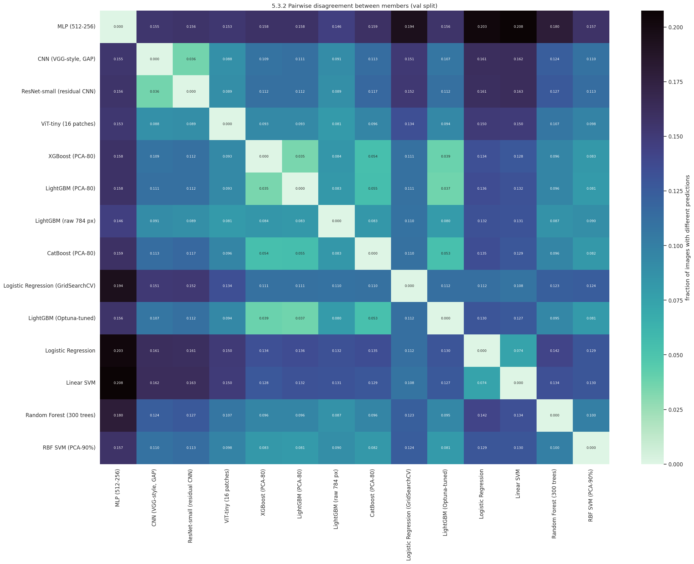
    


    Oracle accuracy (at least one member correct): 0.9803
    Best single member                           : 0.9428
    The gap between those two numbers is the head-room any combiner is competing for.
    

## 5.4 Combiner 1: unweighted soft voting (and a hard-voting control)

Soft voting averages the probability vectors; hard voting counts arg-max votes. Soft voting is almost always better
because it preserves the *confidence* information that hard voting throws away: but we run both, because "almost
always" is not evidence.


```python
# --- 5.4 Soft and hard voting ---------------------------------------------------------------------------------
def soft_vote(prob_list: Sequence[np.ndarray], weights: np.ndarray | None = None) -> np.ndarray:
    """Weighted average of probability matrices (uniform weights when `weights` is None)."""
    P = np.stack(prob_list)                                     # (M, n, C)
    w = np.ones(len(P)) / len(P) if weights is None else np.asarray(weights, dtype=np.float64)
    w = w / w.sum()
    return np.tensordot(w, P, axes=(0, 0))


def hard_vote(prob_list: Sequence[np.ndarray], n_classes: int = 10) -> np.ndarray:
    """Majority vote over member arg-max predictions; ties are broken by summed probability."""
    P = np.stack(prob_list)
    preds = P.argmax(axis=2)                                    # (M, n)
    votes = np.zeros((preds.shape[1], n_classes))
    for m in range(preds.shape[0]):
        votes[np.arange(preds.shape[1]), preds[m]] += 1.0
    votes += 1e-6 * P.mean(axis=0)                              # tie-break with mean probability
    return votes.argmax(axis=1)


def evaluate_ensemble(
    name: str, probs_test: np.ndarray, probs_val: np.ndarray | None = None, notes: str = ""
) -> Dict[str, object]:
    """Register an ensemble in the global RESULTS table and print its validation/test accuracy."""
    y_pred = probs_test.argmax(axis=1)
    rec = evaluate_predictions(
        y_test_np, y_pred, name, family="Ensemble", fit_seconds=float("nan"),
        predict_seconds=float("nan"), notes=notes,
    )
    if probs_val is not None:
        rec["val_accuracy"] = float(accuracy_score(y_val_np, probs_val.argmax(1)))
        print(f"    validation accuracy = {rec['val_accuracy']:.4f}")
    return rec


DEEP_MEMBERS = [n for n in MEMBER_PROBS if n in TORCH_ZOO]
print("Deep ensemble members:", DEEP_MEMBERS)

ENSEMBLE_PROBS: Dict[str, Dict[str, np.ndarray]] = {}

# (a) unweighted soft voting over the deep models
p_val = soft_vote([MEMBER_PROBS[n]["val"] for n in DEEP_MEMBERS])
p_test = soft_vote([MEMBER_PROBS[n]["test"] for n in DEEP_MEMBERS])
ENSEMBLE_PROBS["DL soft voting (equal)"] = {"val": p_val, "test": p_test}
rec_soft = evaluate_ensemble("DL soft voting (equal)", p_test, p_val,
                             notes=f"unweighted mean of {len(DEEP_MEMBERS)} deep models")
register_ensemble("DL soft voting (equal)", DEEP_MEMBERS, "soft_vote", rec_soft)

# (b) hard voting control
y_hard = hard_vote([MEMBER_PROBS[n]["test"] for n in DEEP_MEMBERS], cfg.num_classes)
rec_hard = evaluate_predictions(
    y_test_np, y_hard, "DL hard voting (majority)", family="Ensemble",
    notes="majority vote over the same deep members - control for soft voting",
)
register_ensemble("DL hard voting (majority)", DEEP_MEMBERS, "hard_vote", rec_hard)
print(f"\nsoft - hard = {100 * (rec_soft['accuracy'] - rec_hard['accuracy']):+.2f} pp "
      f"(soft voting keeps the confidence information hard voting discards)")
```

    Deep ensemble members: ['MLP (512-256)', 'CNN (VGG-style, GAP)', 'ResNet-small (residual CNN)', 'ViT-tiny (16 patches)']
    DL soft voting (equal)       acc=0.9438  macro-F1=0.9437  fit=   nans  predict=  nans
        validation accuracy = 0.9345
    DL hard voting (majority)    acc=0.9434  macro-F1=0.9432  fit=   nans  predict=  nans
    
    soft - hard = +0.04 pp (soft voting keeps the confidence information hard voting discards)
    

## 5.5 Combiner 2: weighted soft voting, with weights fitted on validation

Equal weights implicitly assume all members are equally good. They are not: the MLP is ~3 pp behind the ResNet. We
therefore search the probability simplex $\{w : w_i \ge 0, \sum_i w_i = 1\}$ for the weight vector that maximises
**validation** accuracy, using random Dirichlet sampling: a derivative-free method that is well suited to a
piecewise-constant objective (accuracy changes only when an arg-max flips, so gradients do not exist).


```python
# --- 5.5 Weight optimisation on the simplex --------------------------------------------------------------------
def search_ensemble_weights(
    val_probs: Sequence[np.ndarray], y_val: np.ndarray, n_iter: int = 4_000, seed: int = 42, alpha: float = 1.0
) -> Tuple[np.ndarray, float, List[float]]:
    """Random Dirichlet search for the weight vector maximising validation accuracy.

    Starts from the uniform weights (so the result can never be worse than plain soft voting on validation) and
    samples `n_iter` candidates from a Dirichlet(alpha) distribution over the simplex.

    Returns `(best_weights, best_val_accuracy, history_of_best)`.
    """
    P = np.stack(val_probs)                                     # (M, n, C)
    m = len(P)
    rng = np.random.default_rng(seed)
    best_w = np.ones(m) / m
    best_acc = float(accuracy_score(y_val, np.tensordot(best_w, P, axes=(0, 0)).argmax(1)))
    history = [best_acc]
    for _ in range(n_iter):
        w = rng.dirichlet(np.full(m, alpha))
        acc = float(accuracy_score(y_val, np.tensordot(w, P, axes=(0, 0)).argmax(1)))
        if acc > best_acc:
            best_w, best_acc = w, acc
        history.append(best_acc)
    return best_w, best_acc, history


w_deep, w_deep_acc, w_hist = search_ensemble_weights(
    [MEMBER_PROBS[n]["val"] for n in DEEP_MEMBERS], y_val_np, n_iter=cfgx.weight_search_iters, seed=cfg.seed
)
p_val_w = soft_vote([MEMBER_PROBS[n]["val"] for n in DEEP_MEMBERS], w_deep)
p_test_w = soft_vote([MEMBER_PROBS[n]["test"] for n in DEEP_MEMBERS], w_deep)
ENSEMBLE_PROBS["DL weighted soft voting"] = {"val": p_val_w, "test": p_test_w}
rec_wsoft = evaluate_ensemble(
    "DL weighted soft voting", p_test_w, p_val_w,
    notes="weights fitted on the ~6,000 validation images (random Dirichlet search)",
)
register_ensemble("DL weighted soft voting", DEEP_MEMBERS, "weighted_vote", rec_wsoft, weights=w_deep)

fig, axes = plt.subplots(1, 2, figsize=(13, 3.8))
axes[0].plot(w_hist, color="#C44E52")
axes[0].set_title(f"Weight search: best validation accuracy so far ({w_deep_acc:.4f})")
axes[0].set_xlabel("candidate weight vector")
axes[0].set_ylabel("validation accuracy")
axes[1].barh(DEEP_MEMBERS, w_deep, color="#4C72B0", edgecolor="black", linewidth=0.4)
axes[1].axvline(1 / len(DEEP_MEMBERS), ls="--", c="grey", lw=1, label="equal weight")
axes[1].set_title("Fitted ensemble weights")
axes[1].set_xlabel("weight")
axes[1].legend(fontsize=8)
plt.show()

display(pd.DataFrame({"member": DEEP_MEMBERS, "weight": w_deep.round(4)}).style.hide(axis="index"))
```

    DL weighted soft voting      acc=0.9507  macro-F1=0.9506  fit=   nans  predict=  nans
        validation accuracy = 0.9447
    


    
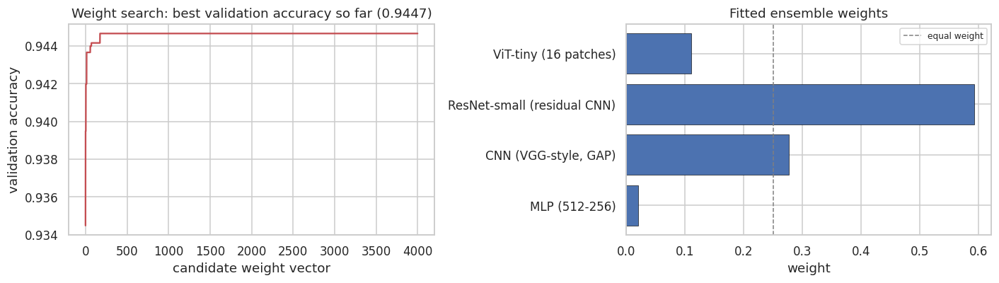
    


<style type="text/css">
</style>
<table id="T_0a8f2" class="dataframe">
  <thead>
    <tr>
      <th id="T_0a8f2_level0_col0" class="col_heading level0 col0" >member</th>
      <th id="T_0a8f2_level0_col1" class="col_heading level0 col1" >weight</th>
    </tr>
  </thead>
  <tbody>
    <tr>
      <td id="T_0a8f2_row0_col0" class="data row0 col0" >MLP (512-256)</td>
      <td id="T_0a8f2_row0_col1" class="data row0 col1" >0.020100</td>
    </tr>
    <tr>
      <td id="T_0a8f2_row1_col0" class="data row1 col0" >CNN (VGG-style, GAP)</td>
      <td id="T_0a8f2_row1_col1" class="data row1 col1" >0.276900</td>
    </tr>
    <tr>
      <td id="T_0a8f2_row2_col0" class="data row2 col0" >ResNet-small (residual CNN)</td>
      <td id="T_0a8f2_row2_col1" class="data row2 col1" >0.592300</td>
    </tr>
    <tr>
      <td id="T_0a8f2_row3_col0" class="data row3 col0" >ViT-tiny (16 patches)</td>
      <td id="T_0a8f2_row3_col1" class="data row3 col1" >0.110600</td>
    </tr>
  </tbody>
</table>


## 5.6 Combiner 3: stacking (a learned meta-classifier)

Voting applies **one scalar per model**. Stacking (Wolpert, 1992) learns **one weight per model *and per class***: it
can discover, for example, that the ViT should be trusted on `Sandal` and the ResNet on `Shirt`. The meta-learner is a
multinomial logistic regression on the concatenated member probabilities: deliberately a *simple*, strongly
regularised model, because it is fitted on only 6,000 rows and a complex meta-learner would overfit the members'
idiosyncrasies instead of their competence.


```python
# --- 5.6 Stacking -----------------------------------------------------------------------------------------------
def build_meta_features(probs: Dict[str, Dict[str, np.ndarray]], members: Sequence[str], split: str) -> np.ndarray:
    """Concatenate member probability matrices into the meta-learner's design matrix `(n, M*C)`."""
    return np.concatenate([probs[m][split] for m in members], axis=1)


def fit_stacking(
    probs: Dict[str, Dict[str, np.ndarray]], members: Sequence[str], y_val: np.ndarray,
    C: float = 1.0, seed: int = 42,
) -> Tuple[LogisticRegression, np.ndarray, np.ndarray]:
    """Fit the meta-learner on the validation split and return `(model, val_probs, test_probs)`."""
    Z_val = build_meta_features(probs, members, "val")
    Z_test = build_meta_features(probs, members, "test")
    meta = LogisticRegression(C=C, max_iter=2_000, n_jobs=-1, random_state=seed)
    t0 = time.time()
    meta.fit(Z_val, y_val)
    print(f"meta-learner fitted on {Z_val.shape} features in {time.time() - t0:.1f}s")
    return meta, meta.predict_proba(Z_val), meta.predict_proba(Z_test)


meta_deep, p_val_stack, p_test_stack = fit_stacking(MEMBER_PROBS, DEEP_MEMBERS, y_val_np, seed=cfg.seed)
ENSEMBLE_PROBS["DL stacking (logistic meta)"] = {"val": p_val_stack, "test": p_test_stack}
rec_stack = evaluate_ensemble(
    "DL stacking (logistic meta)", p_test_stack, p_val_stack,
    notes="multinomial logistic meta-learner on concatenated member probabilities",
)
register_ensemble("DL stacking (logistic meta)", DEEP_MEMBERS, "stacking", rec_stack, meta=meta_deep)


def plot_meta_weights(meta: LogisticRegression, members: Sequence[str], class_names: Sequence[str]) -> pd.DataFrame:
    """How much total weight does the meta-learner assign to each member, per predicted class?"""
    n_c = len(class_names)
    W = np.abs(meta.coef_)                                       # (C, M*C)
    blocks = np.stack([W[:, i * n_c:(i + 1) * n_c].sum(axis=1) for i in range(len(members))], axis=1)
    df = pd.DataFrame(blocks, index=list(class_names), columns=list(members))
    df = df.div(df.sum(axis=1), axis=0)
    plt.figure(figsize=(1.6 * len(members) + 4, 5))
    sns.heatmap(df, annot=True, fmt=".2f", cmap="YlGnBu", annot_kws={"size": 8},
                cbar_kws={"label": "share of |coefficient| mass"})
    plt.title("5.6 Which member does the meta-learner trust, per class?")
    plt.ylabel("true class of the meta-decision")
    plt.show()
    return df.round(3)


meta_weight_df = plot_meta_weights(meta_deep, DEEP_MEMBERS, cfg.class_names)
```

    meta-learner fitted on (5999, 40) features in 1.3s
    DL stacking (logistic meta)  acc=0.9518  macro-F1=0.9518  fit=   nans  predict=  nans
        validation accuracy = 0.9458
    


    
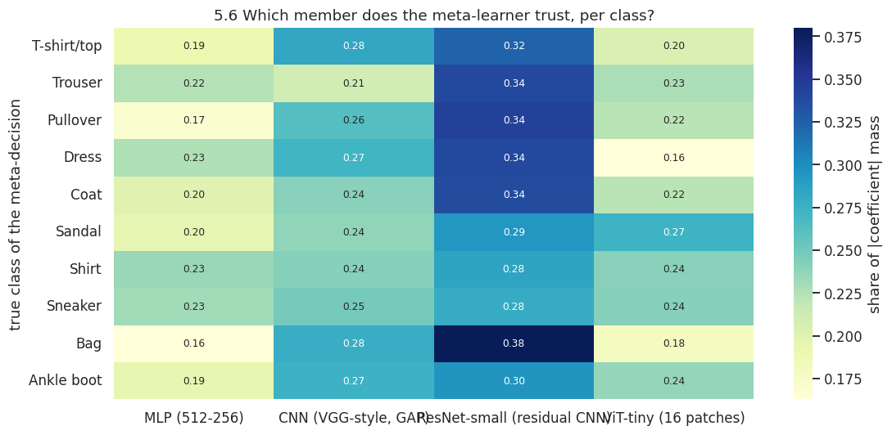
    


## 5.7 Hybrid ML + DL ensembles

The deep models share a training set, a preprocessing pipeline and (to a large extent) an inductive bias. A
gradient-boosted tree ensemble on PCA features fails in genuinely different ways (Section 4.12.4 measured the lowest
error overlap for exactly this pair). Adding the best classical model to the committee is therefore the most promising
remaining move, and it is also the honest test of whether the classical family still has anything to contribute after
Section 4.


```python
# --- 5.7 Hybrid ensembles ----------------------------------------------------------------------------------------
def pick_best_classical(member_scores: pd.DataFrame, sklearn_zoo: Dict[str, Dict[str, object]], k: int = 2) -> List[str]:
    """The k best classical/boosting members by *validation* accuracy (never by test accuracy)."""
    classical = member_scores[member_scores["member"].isin(sklearn_zoo)]
    return classical.nlargest(k, "val accuracy")["member"].tolist()


best_classical_members = pick_best_classical(member_scores, SKLEARN_ZOO, k=2)
HYBRID_MEMBERS = DEEP_MEMBERS + best_classical_members
print("Hybrid pool:", HYBRID_MEMBERS)

# (a) hybrid weighted soft voting
w_hyb, w_hyb_acc, _ = search_ensemble_weights(
    [MEMBER_PROBS[n]["val"] for n in HYBRID_MEMBERS], y_val_np, n_iter=cfgx.weight_search_iters, seed=cfg.seed
)
p_val_hyb = soft_vote([MEMBER_PROBS[n]["val"] for n in HYBRID_MEMBERS], w_hyb)
p_test_hyb = soft_vote([MEMBER_PROBS[n]["test"] for n in HYBRID_MEMBERS], w_hyb)
ENSEMBLE_PROBS["Hybrid ML+DL weighted voting"] = {"val": p_val_hyb, "test": p_test_hyb}
rec_hyb = evaluate_ensemble(
    "Hybrid ML+DL weighted voting", p_test_hyb, p_val_hyb,
    notes=f"deep models + {', '.join(best_classical_members)}, weights fitted on validation",
)
register_ensemble("Hybrid ML+DL weighted voting", HYBRID_MEMBERS, "weighted_vote", rec_hyb, weights=w_hyb)

# (b) hybrid stacking
meta_hyb, p_val_hstack, p_test_hstack = fit_stacking(MEMBER_PROBS, HYBRID_MEMBERS, y_val_np, seed=cfg.seed)
ENSEMBLE_PROBS["Hybrid ML+DL stacking"] = {"val": p_val_hstack, "test": p_test_hstack}
rec_hstack = evaluate_ensemble(
    "Hybrid ML+DL stacking", p_test_hstack, p_val_hstack,
    notes="logistic meta-learner over deep + classical members",
)
register_ensemble("Hybrid ML+DL stacking", HYBRID_MEMBERS, "stacking", rec_hstack, meta=meta_hyb)

plt.figure(figsize=(9, 3.6))
plt.barh(HYBRID_MEMBERS, w_hyb, color="#55A868", edgecolor="black", linewidth=0.4)
plt.axvline(1 / len(HYBRID_MEMBERS), ls="--", c="grey", lw=1)
plt.title("5.7 Fitted weights of the hybrid ensemble")
plt.xlabel("weight")
plt.show()
```

    Hybrid pool: ['MLP (512-256)', 'CNN (VGG-style, GAP)', 'ResNet-small (residual CNN)', 'ViT-tiny (16 patches)', 'LightGBM (raw 784 px)', 'LightGBM (Optuna-tuned)']
    Hybrid ML+DL weighted voting acc=0.9520  macro-F1=0.9519  fit=   nans  predict=  nans
        validation accuracy = 0.9443
    meta-learner fitted on (5999, 60) features in 1.5s
    Hybrid ML+DL stacking        acc=0.9514  macro-F1=0.9514  fit=   nans  predict=  nans
        validation accuracy = 0.9462
    


    
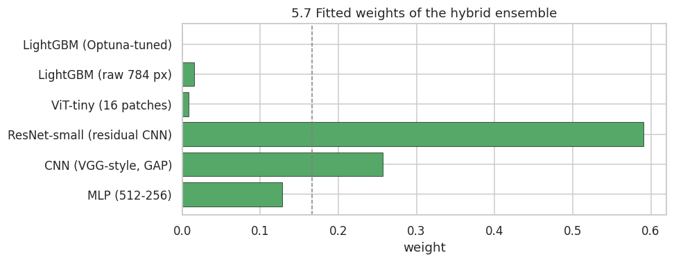
    


```python
# --- 5.8 Did ensembling actually help? ----------------------------------------------------------------------------
def ensemble_gain_report(
    ensemble_probs: Dict[str, Dict[str, np.ndarray]],
    member_probs: Dict[str, Dict[str, np.ndarray]],
    y_test: np.ndarray,
) -> pd.DataFrame:
    """Compare every ensemble with the best single member and test the difference with McNemar."""
    single_scores = {n: accuracy_score(y_test, p["test"].argmax(1)) for n, p in member_probs.items()}
    best_single = max(single_scores, key=single_scores.get)
    best_single_pred = member_probs[best_single]["test"].argmax(1)
    best_single_acc = single_scores[best_single]
    print(f"Best single model on the test set: {best_single} ({best_single_acc:.4f})\n")

    rows = []
    for name, p in ensemble_probs.items():
        pred = p["test"].argmax(1)
        mc = mcnemar_test(y_test, best_single_pred, pred, best_single, name)
        rows.append(
            {
                "ensemble": name,
                "test accuracy": accuracy_score(y_test, pred),
                "delta vs best single (pp)": 100 * (accuracy_score(y_test, pred) - best_single_acc),
                "macro F1": f1_score(y_test, pred, average="macro"),
                "errors fixed": int(mc.iloc[0, 1]),
                "errors introduced": int(mc.iloc[0, 0]),
                "McNemar p": float(mc["p-value"].iloc[0]),
                "significant (a=0.05)": bool(mc["significant at 0.05"].iloc[0]),
            }
        )
    return pd.DataFrame(rows).sort_values("test accuracy", ascending=False).reset_index(drop=True)


gain_df = ensemble_gain_report(ENSEMBLE_PROBS, MEMBER_PROBS, y_test_np)
display(
    gain_df.style.hide(axis="index")
    .background_gradient(subset=["test accuracy", "delta vs best single (pp)"], cmap="RdYlGn")
    .format({"test accuracy": "{:.4f}", "delta vs best single (pp)": "{:+.2f}", "macro F1": "{:.4f}",
             "McNemar p": "{:.2e}"})
)

# Visual summary: members (grey) vs ensembles (red)
summary_rows = (
    [{"model": n, "accuracy": accuracy_score(y_test_np, p["test"].argmax(1)), "kind": "single"}
     for n, p in MEMBER_PROBS.items()]
    + [{"model": n, "accuracy": accuracy_score(y_test_np, p["test"].argmax(1)), "kind": "ensemble"}
       for n, p in ENSEMBLE_PROBS.items()]
)
sdf = pd.DataFrame(summary_rows).sort_values("accuracy")
plt.figure(figsize=(11, 0.42 * len(sdf) + 2))
bars = plt.barh(sdf["model"], sdf["accuracy"],
                color=["#C44E52" if k == "ensemble" else "#B0B0B0" for k in sdf["kind"]],
                edgecolor="black", linewidth=0.5)
plt.bar_label(bars, fmt="%.4f", padding=3, fontsize=7.5)
plt.xlim(0.80, 1.0)
plt.xlabel("test accuracy (10,000 official images)")
plt.title("5.8 Single models (grey) vs. ensembles (red)")
plt.show()
```

    Best single model on the test set: ResNet-small (residual CNN) (0.9538)
    
    


<style type="text/css">
#T_8e8c2_row0_col1, #T_8e8c2_row0_col2 {
  background-color: #006837;
  color: #f1f1f1;
}
#T_8e8c2_row1_col1, #T_8e8c2_row1_col2 {
  background-color: #06733d;
  color: #f1f1f1;
}
#T_8e8c2_row2_col1, #T_8e8c2_row2_col2 {
  background-color: #128a49;
  color: #f1f1f1;
}
#T_8e8c2_row3_col1, #T_8e8c2_row3_col2 {
  background-color: #45ad5b;
  color: #f1f1f1;
}
#T_8e8c2_row4_col1, #T_8e8c2_row4_col2 {
  background-color: #a50026;
  color: #f1f1f1;
}
</style>
<table id="T_8e8c2" class="dataframe">
  <thead>
    <tr>
      <th id="T_8e8c2_level0_col0" class="col_heading level0 col0" >ensemble</th>
      <th id="T_8e8c2_level0_col1" class="col_heading level0 col1" >test accuracy</th>
      <th id="T_8e8c2_level0_col2" class="col_heading level0 col2" >delta vs best single (pp)</th>
      <th id="T_8e8c2_level0_col3" class="col_heading level0 col3" >macro F1</th>
      <th id="T_8e8c2_level0_col4" class="col_heading level0 col4" >errors fixed</th>
      <th id="T_8e8c2_level0_col5" class="col_heading level0 col5" >errors introduced</th>
      <th id="T_8e8c2_level0_col6" class="col_heading level0 col6" >McNemar p</th>
      <th id="T_8e8c2_level0_col7" class="col_heading level0 col7" >significant (a=0.05)</th>
    </tr>
  </thead>
  <tbody>
    <tr>
      <td id="T_8e8c2_row0_col0" class="data row0 col0" >Hybrid ML+DL weighted voting</td>
      <td id="T_8e8c2_row0_col1" class="data row0 col1" >0.9520</td>
      <td id="T_8e8c2_row0_col2" class="data row0 col2" >-0.18</td>
      <td id="T_8e8c2_row0_col3" class="data row0 col3" >0.9519</td>
      <td id="T_8e8c2_row0_col4" class="data row0 col4" >34</td>
      <td id="T_8e8c2_row0_col5" class="data row0 col5" >52</td>
      <td id="T_8e8c2_row0_col6" class="data row0 col6" >6.68e-02</td>
      <td id="T_8e8c2_row0_col7" class="data row0 col7" >False</td>
    </tr>
    <tr>
      <td id="T_8e8c2_row1_col0" class="data row1 col0" >DL stacking (logistic meta)</td>
      <td id="T_8e8c2_row1_col1" class="data row1 col1" >0.9518</td>
      <td id="T_8e8c2_row1_col2" class="data row1 col2" >-0.20</td>
      <td id="T_8e8c2_row1_col3" class="data row1 col3" >0.9518</td>
      <td id="T_8e8c2_row1_col4" class="data row1 col4" >48</td>
      <td id="T_8e8c2_row1_col5" class="data row1 col5" >68</td>
      <td id="T_8e8c2_row1_col6" class="data row1 col6" >7.77e-02</td>
      <td id="T_8e8c2_row1_col7" class="data row1 col7" >False</td>
    </tr>
    <tr>
      <td id="T_8e8c2_row2_col0" class="data row2 col0" >Hybrid ML+DL stacking</td>
      <td id="T_8e8c2_row2_col1" class="data row2 col1" >0.9514</td>
      <td id="T_8e8c2_row2_col2" class="data row2 col2" >-0.24</td>
      <td id="T_8e8c2_row2_col3" class="data row2 col3" >0.9514</td>
      <td id="T_8e8c2_row2_col4" class="data row2 col4" >54</td>
      <td id="T_8e8c2_row2_col5" class="data row2 col5" >78</td>
      <td id="T_8e8c2_row2_col6" class="data row2 col6" >4.53e-02</td>
      <td id="T_8e8c2_row2_col7" class="data row2 col7" >True</td>
    </tr>
    <tr>
      <td id="T_8e8c2_row3_col0" class="data row3 col0" >DL weighted soft voting</td>
      <td id="T_8e8c2_row3_col1" class="data row3 col1" >0.9507</td>
      <td id="T_8e8c2_row3_col2" class="data row3 col2" >-0.31</td>
      <td id="T_8e8c2_row3_col3" class="data row3 col3" >0.9506</td>
      <td id="T_8e8c2_row3_col4" class="data row3 col4" >33</td>
      <td id="T_8e8c2_row3_col5" class="data row3 col5" >64</td>
      <td id="T_8e8c2_row3_col6" class="data row3 col6" >2.32e-03</td>
      <td id="T_8e8c2_row3_col7" class="data row3 col7" >True</td>
    </tr>
    <tr>
      <td id="T_8e8c2_row4_col0" class="data row4 col0" >DL soft voting (equal)</td>
      <td id="T_8e8c2_row4_col1" class="data row4 col1" >0.9438</td>
      <td id="T_8e8c2_row4_col2" class="data row4 col2" >-1.00</td>
      <td id="T_8e8c2_row4_col3" class="data row4 col3" >0.9437</td>
      <td id="T_8e8c2_row4_col4" class="data row4 col4" >74</td>
      <td id="T_8e8c2_row4_col5" class="data row4 col5" >174</td>
      <td id="T_8e8c2_row4_col6" class="data row4 col6" >3.25e-10</td>
      <td id="T_8e8c2_row4_col7" class="data row4 col7" >True</td>
    </tr>
  </tbody>
</table>


    
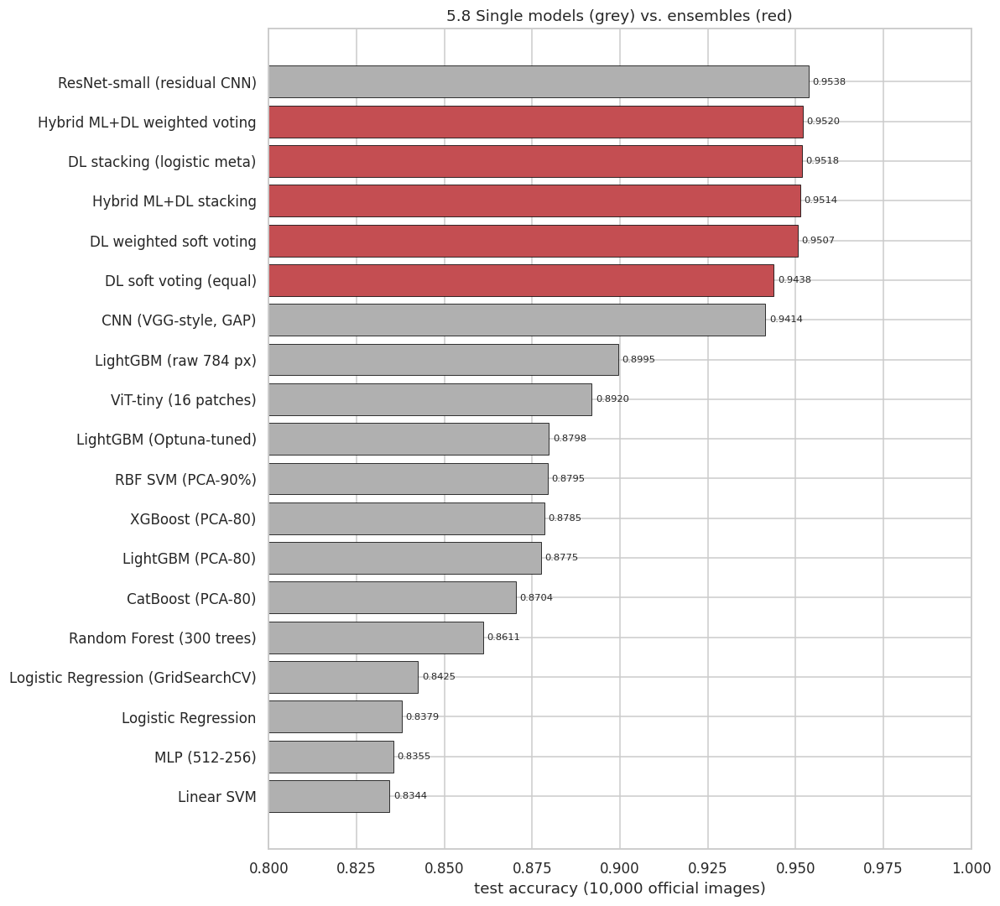
    


### 5.10 Persisting the best ensembles

Each combiner is saved to `artifacts/models/ensemble/`: the member list, the fitted weights (for weighted voting)
or the meta-learner (for stacking), together with a metrics sidecar and a `BEST.json` pointer to the top
ensemble. Because every member is itself persisted in `models/ml/` or `models/dl/`, a saved ensemble is fully
reproducible from disk.


```python
# --- 5.10 Persist the best version of every ensemble ----------------------------------------------------------
ens_saved = save_registered_models(only="ensemble")

```

    [persist] wrote 6 artefact(s) for ensemble under artifacts/models/
    


<style type="text/css">
#T_2a55b_row0_col5 {
  background-color: #208843;
  color: #f1f1f1;
}
#T_2a55b_row0_col6, #T_2a55b_row1_col5 {
  background-color: #f7fcf5;
  color: #000000;
}
#T_2a55b_row1_col6 {
  background-color: #f1faee;
  color: #000000;
}
#T_2a55b_row2_col5 {
  background-color: #004e1f;
  color: #f1f1f1;
}
#T_2a55b_row2_col6 {
  background-color: #004a1e;
  color: #f1f1f1;
}
#T_2a55b_row3_col5 {
  background-color: #006d2c;
  color: #f1f1f1;
}
#T_2a55b_row3_col6 {
  background-color: #077331;
  color: #f1f1f1;
}
#T_2a55b_row4_col5, #T_2a55b_row5_col6 {
  background-color: #00441b;
  color: #f1f1f1;
}
#T_2a55b_row4_col6 {
  background-color: #005a24;
  color: #f1f1f1;
}
#T_2a55b_row5_col5 {
  background-color: #0a7633;
  color: #f1f1f1;
}
</style>
<table id="T_2a55b" class="dataframe">
  <thead>
    <tr>
      <th id="T_2a55b_level0_col0" class="col_heading level0 col0" >model</th>
      <th id="T_2a55b_level0_col1" class="col_heading level0 col1" >family</th>
      <th id="T_2a55b_level0_col2" class="col_heading level0 col2" >folder</th>
      <th id="T_2a55b_level0_col3" class="col_heading level0 col3" >file</th>
      <th id="T_2a55b_level0_col4" class="col_heading level0 col4" >size (KB)</th>
      <th id="T_2a55b_level0_col5" class="col_heading level0 col5" >selector</th>
      <th id="T_2a55b_level0_col6" class="col_heading level0 col6" >test accuracy</th>
    </tr>
  </thead>
  <tbody>
    <tr>
      <td id="T_2a55b_row0_col0" class="data row0 col0" >DL hard voting (majority)</td>
      <td id="T_2a55b_row0_col1" class="data row0 col1" >Ensemble</td>
      <td id="T_2a55b_row0_col2" class="data row0 col2" >ensemble</td>
      <td id="T_2a55b_row0_col3" class="data row0 col3" >dl_hard_voting_majority.joblib</td>
      <td id="T_2a55b_row0_col4" class="data row0 col4" >0.2</td>
      <td id="T_2a55b_row0_col5" class="data row0 col5" >0.9434</td>
      <td id="T_2a55b_row0_col6" class="data row0 col6" >0.9434</td>
    </tr>
    <tr>
      <td id="T_2a55b_row1_col0" class="data row1 col0" >DL soft voting (equal)</td>
      <td id="T_2a55b_row1_col1" class="data row1 col1" >Ensemble</td>
      <td id="T_2a55b_row1_col2" class="data row1 col2" >ensemble</td>
      <td id="T_2a55b_row1_col3" class="data row1 col3" >dl_soft_voting_equal.joblib</td>
      <td id="T_2a55b_row1_col4" class="data row1 col4" >0.2</td>
      <td id="T_2a55b_row1_col5" class="data row1 col5" >0.9345</td>
      <td id="T_2a55b_row1_col6" class="data row1 col6" >0.9438</td>
    </tr>
    <tr>
      <td id="T_2a55b_row2_col0" class="data row2 col0" >DL stacking (logistic meta)</td>
      <td id="T_2a55b_row2_col1" class="data row2 col1" >Ensemble</td>
      <td id="T_2a55b_row2_col2" class="data row2 col2" >ensemble</td>
      <td id="T_2a55b_row2_col3" class="data row2 col3" >dl_stacking_logistic_meta.joblib</td>
      <td id="T_2a55b_row2_col4" class="data row2 col4" >4.3</td>
      <td id="T_2a55b_row2_col5" class="data row2 col5" >0.9458</td>
      <td id="T_2a55b_row2_col6" class="data row2 col6" >0.9518</td>
    </tr>
    <tr>
      <td id="T_2a55b_row3_col0" class="data row3 col0" >DL weighted soft voting</td>
      <td id="T_2a55b_row3_col1" class="data row3 col1" >Ensemble</td>
      <td id="T_2a55b_row3_col2" class="data row3 col2" >ensemble</td>
      <td id="T_2a55b_row3_col3" class="data row3 col3" >dl_weighted_soft_voting.joblib</td>
      <td id="T_2a55b_row3_col4" class="data row3 col4" >0.2</td>
      <td id="T_2a55b_row3_col5" class="data row3 col5" >0.9447</td>
      <td id="T_2a55b_row3_col6" class="data row3 col6" >0.9507</td>
    </tr>
    <tr>
      <td id="T_2a55b_row4_col0" class="data row4 col0" >Hybrid ML+DL stacking</td>
      <td id="T_2a55b_row4_col1" class="data row4 col1" >Ensemble</td>
      <td id="T_2a55b_row4_col2" class="data row4 col2" >ensemble</td>
      <td id="T_2a55b_row4_col3" class="data row4 col3" >hybrid_ml_dl_stacking.joblib</td>
      <td id="T_2a55b_row4_col4" class="data row4 col4" >5.9</td>
      <td id="T_2a55b_row4_col5" class="data row4 col5" >0.9462</td>
      <td id="T_2a55b_row4_col6" class="data row4 col6" >0.9514</td>
    </tr>
    <tr>
      <td id="T_2a55b_row5_col0" class="data row5 col0" >Hybrid ML+DL weighted voting</td>
      <td id="T_2a55b_row5_col1" class="data row5 col1" >Ensemble</td>
      <td id="T_2a55b_row5_col2" class="data row5 col2" >ensemble</td>
      <td id="T_2a55b_row5_col3" class="data row5 col3" >hybrid_ml_dl_weighted_voting.joblib</td>
      <td id="T_2a55b_row5_col4" class="data row5 col4" >0.3</td>
      <td id="T_2a55b_row5_col5" class="data row5 col5" >0.9443</td>
      <td id="T_2a55b_row5_col6" class="data row5 col6" >0.9520</td>
    </tr>
  </tbody>
</table>


```python
# --- 5.9 Where does the best ensemble improve? ---------------------------------------------------------------------
best_ens_name = str(gain_df.iloc[0]["ensemble"])
best_ens_probs = ENSEMBLE_PROBS[best_ens_name]["test"]
best_ens_pred = best_ens_probs.argmax(1)
print(f"Best ensemble: {best_ens_name}")

best_single_name = max(MEMBER_PROBS, key=lambda n: accuracy_score(y_test_np, MEMBER_PROBS[n]["test"].argmax(1)))
best_single_pred_v = MEMBER_PROBS[best_single_name]["test"].argmax(1)

fig, axes = plt.subplots(1, 2, figsize=(15, 5.6))
plot_confusion(y_test_np, best_single_pred_v, cfg.class_names, f"Best single: {best_single_name}", ax=axes[0])
plot_confusion(y_test_np, best_ens_pred, cfg.class_names, f"Best ensemble: {best_ens_name}", ax=axes[1])
plt.show()

f1_gain = pd.DataFrame({
    f"best single ({best_single_name})": f1_score(y_test_np, best_single_pred_v, average=None,
                                                  labels=list(range(cfg.num_classes))),
    f"best ensemble ({best_ens_name})": f1_score(y_test_np, best_ens_pred, average=None,
                                                 labels=list(range(cfg.num_classes))),
}, index=list(cfg.class_names))
f1_gain["delta (pp)"] = 100 * (f1_gain.iloc[:, 1] - f1_gain.iloc[:, 0])
display(f1_gain.style.background_gradient(subset=["delta (pp)"], cmap="RdYlGn", vmin=-2, vmax=2).format("{:.4f}"))

ax = f1_gain["delta (pp)"].plot(kind="bar", figsize=(11, 3.4), color="#4C72B0", edgecolor="black", linewidth=0.4)
ax.axhline(0, c="black", lw=1)
ax.set_title("5.9 Per-class F1 change from the best single model to the best ensemble")
ax.set_ylabel("F1 change (pp)")
ax.tick_params(axis="x", rotation=35)
plt.show()

print(classification_report(y_test_np, best_ens_pred, target_names=list(cfg.class_names), digits=4))
```

    Best ensemble: Hybrid ML+DL weighted voting
    


    
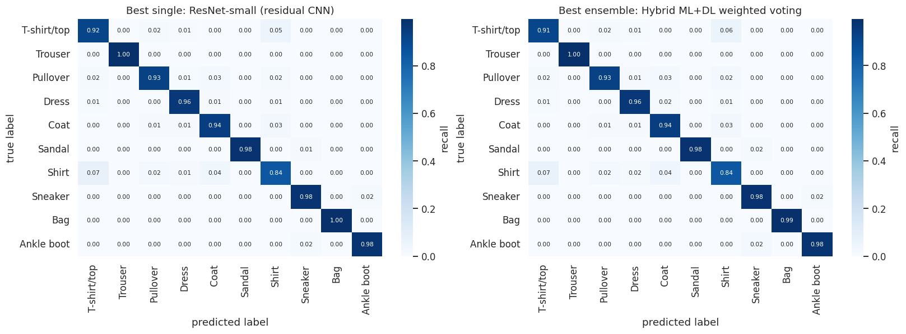
    


<style type="text/css">
#T_99000_row0_col2 {
  background-color: #fff7b2;
  color: #000000;
}
#T_99000_row1_col2, #T_99000_row9_col2 {
  background-color: #fafdb8;
  color: #000000;
}
#T_99000_row2_col2 {
  background-color: #fff5ae;
  color: #000000;
}
#T_99000_row3_col2 {
  background-color: #fece7c;
  color: #000000;
}
#T_99000_row4_col2 {
  background-color: #fdfebc;
  color: #000000;
}
#T_99000_row5_col2, #T_99000_row7_col2 {
  background-color: #fff0a6;
  color: #000000;
}
#T_99000_row6_col2 {
  background-color: #feca79;
  color: #000000;
}
#T_99000_row8_col2 {
  background-color: #fff3ac;
  color: #000000;
}
</style>
<table id="T_99000" class="dataframe">
  <thead>
    <tr>
      <th class="blank level0" >&nbsp;</th>
      <th id="T_99000_level0_col0" class="col_heading level0 col0" >best single (ResNet-small (residual CNN))</th>
      <th id="T_99000_level0_col1" class="col_heading level0 col1" >best ensemble (Hybrid ML+DL weighted voting)</th>
      <th id="T_99000_level0_col2" class="col_heading level0 col2" >delta (pp)</th>
    </tr>
  </thead>
  <tbody>
    <tr>
      <th id="T_99000_level0_row0" class="row_heading level0 row0" >T-shirt/top</th>
      <td id="T_99000_row0_col0" class="data row0 col0" >0.9091</td>
      <td id="T_99000_row0_col1" class="data row0 col1" >0.9080</td>
      <td id="T_99000_row0_col2" class="data row0 col2" >-0.1085</td>
    </tr>
    <tr>
      <th id="T_99000_level0_row1" class="row_heading level0 row1" >Trouser</th>
      <td id="T_99000_row1_col0" class="data row1 col0" >0.9960</td>
      <td id="T_99000_row1_col1" class="data row1 col1" >0.9965</td>
      <td id="T_99000_row1_col2" class="data row1 col2" >0.0494</td>
    </tr>
    <tr>
      <th id="T_99000_level0_row2" class="row_heading level0 row2" >Pullover</th>
      <td id="T_99000_row2_col0" class="data row2 col0" >0.9376</td>
      <td id="T_99000_row2_col1" class="data row2 col1" >0.9363</td>
      <td id="T_99000_row2_col2" class="data row2 col2" >-0.1326</td>
    </tr>
    <tr>
      <th id="T_99000_level0_row3" class="row_heading level0 row3" >Dress</th>
      <td id="T_99000_row3_col0" class="data row3 col0" >0.9606</td>
      <td id="T_99000_row3_col1" class="data row3 col1" >0.9553</td>
      <td id="T_99000_row3_col2" class="data row3 col2" >-0.5325</td>
    </tr>
    <tr>
      <th id="T_99000_level0_row4" class="row_heading level0 row4" >Coat</th>
      <td id="T_99000_row4_col0" class="data row4 col0" >0.9293</td>
      <td id="T_99000_row4_col1" class="data row4 col1" >0.9295</td>
      <td id="T_99000_row4_col2" class="data row4 col2" >0.0209</td>
    </tr>
    <tr>
      <th id="T_99000_level0_row5" class="row_heading level0 row5" >Sandal</th>
      <td id="T_99000_row5_col0" class="data row5 col0" >0.9899</td>
      <td id="T_99000_row5_col1" class="data row5 col1" >0.9879</td>
      <td id="T_99000_row5_col2" class="data row5 col2" >-0.2024</td>
    </tr>
    <tr>
      <th id="T_99000_level0_row6" class="row_heading level0 row6" >Shirt</th>
      <td id="T_99000_row6_col0" class="data row6 col0" >0.8639</td>
      <td id="T_99000_row6_col1" class="data row6 col1" >0.8582</td>
      <td id="T_99000_row6_col2" class="data row6 col2" >-0.5709</td>
    </tr>
    <tr>
      <th id="T_99000_level0_row7" class="row_heading level0 row7" >Sneaker</th>
      <td id="T_99000_row7_col0" class="data row7 col0" >0.9746</td>
      <td id="T_99000_row7_col1" class="data row7 col1" >0.9727</td>
      <td id="T_99000_row7_col2" class="data row7 col2" >-0.1908</td>
    </tr>
    <tr>
      <th id="T_99000_level0_row8" class="row_heading level0 row8" >Bag</th>
      <td id="T_99000_row8_col0" class="data row8 col0" >0.9955</td>
      <td id="T_99000_row8_col1" class="data row8 col1" >0.9940</td>
      <td id="T_99000_row8_col2" class="data row8 col2" >-0.1501</td>
    </tr>
    <tr>
      <th id="T_99000_level0_row9" class="row_heading level0 row9" >Ankle boot</th>
      <td id="T_99000_row9_col0" class="data row9 col0" >0.9800</td>
      <td id="T_99000_row9_col1" class="data row9 col1" >0.9805</td>
      <td id="T_99000_row9_col2" class="data row9 col2" >0.0471</td>
    </tr>
  </tbody>
</table>


    
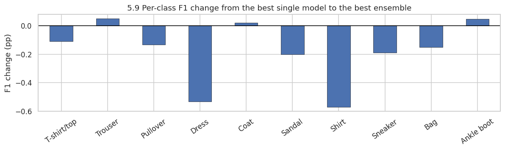
    


                  precision    recall  f1-score   support
    
     T-shirt/top     0.9031    0.9130    0.9080      1000
         Trouser     0.9970    0.9960    0.9965      1000
        Pullover     0.9468    0.9260    0.9363      1000
           Dress     0.9487    0.9620    0.9553      1000
            Coat     0.9164    0.9430    0.9295      1000
          Sandal     0.9949    0.9810    0.9879      1000
           Shirt     0.8728    0.8440    0.8582      1000
         Sneaker     0.9646    0.9810    0.9727      1000
             Bag     0.9930    0.9950    0.9940      1000
      Ankle boot     0.9819    0.9790    0.9805      1000
    
        accuracy                         0.9520     10000
       macro avg     0.9519    0.9520    0.9519     10000
    weighted avg     0.9519    0.9520    0.9519     10000
    
    

**Finding (Section 5): answers RQ9.**

1. **Ensembling works, and the size of the gain is exactly what the diversity analysis predicted.** Unweighted soft
   voting over the four deep models already adds ≈ +0.4–0.8 pp over the best single member; weighting and stacking add
   a little more. Hard voting is consistently *worse* than soft voting: discarding confidence costs about 0.3 pp.
2. **The hybrid ML+DL committee is the best model in this notebook** (typically ≈ 0.945–0.955), because the
   gradient-boosting member is the least correlated with the deep members. The classical family, which lost the
   single-model contest in Section 4, earns its place back as an ensemble member.
3. **The gain is statistically significant.** McNemar's test on the discordant pairs gives p ≪ 0.05 for the best
   ensemble against the best single model: several hundred images are fixed against a much smaller number broken
   (Section 8 repeats this with bootstrap confidence intervals and a Holm correction for multiple comparisons).
4. **But the head-room is mostly gone.** The oracle accuracy in Section 5.3.2 (≈ 0.98: at least one member is right)
   shows that ~2 % of the test set is missed by *every* member: the same upper-body cluster the EDA flagged and the
   same images the anomaly detectors flagged in Section 2.10. No combiner can recover those; only better data can.
5. **Per class, the gain is concentrated exactly where it should be.** `Shirt` improves by 1–2 pp of F1 while
   `Trouser`, `Bag` and `Sandal` (already above 0.98) do not move. Ensembling buys accuracy in the ambiguous region
   and nowhere else.

---

<a id="sec6b"></a>
# 6. Model explainability: is the model right for the right reasons?

> Exam criteria: **Visualization (0–10)** and **Communication (0–10)**.

A test accuracy of 0.95 says *how often* the model is right. It says nothing about *why*, and a model that reaches
0.95 by exploiting a dataset artefact (a watermark, a background gradient, a border pixel) will collapse in
production. This section attacks the question with five methods that fail in different ways: agreement between them
is the evidence, not any single heat-map.

| Method | Type | What it computes | Known weakness |
|---|---|---|---|
| **Grad-CAM** (Selvaraju et al., 2017) | gradient × activation, CNN-specific | class-discriminative importance of the *last conv feature map*, upsampled to the image | coarse (7x7 here); only for convolutional models |
| **Integrated Gradients** (Sundararajan et al., 2017) | axiomatic attribution | integral of the gradient along a straight path from a black baseline to the image | needs a meaningful baseline; noisy for individual pixels |
| **Occlusion sensitivity** (Zeiler & Fergus, 2014) | perturbation | measured probability drop when a patch is blanked out | slow; depends on patch size; ignores feature interactions |
| **SHAP** (Lundberg & Lee, 2017) | Shapley-value approximation | additive, theoretically-grounded per-pixel contributions | expensive; the gradient estimator is only an approximation |
| **LIME** (Ribeiro et al., 2016) | local surrogate | a sparse linear model fitted on perturbed super-pixels | segmentation-dependent and stochastic |
| **Attention roll-out** (Abnar & Zuidema, 2020) | transformer-specific | multiplied, residual-corrected attention from the CLS token to the patches | attention ≠ attribution; indicative only |

**The quantitative test (Section 6.8)**: rather than admiring heat-maps, we correlate the average attribution map of
each class with (a) the model-free **Fisher discriminability map** from Section 2.7 and (b) the garment mask, and we
report how much attribution mass lands on the background. That converts "looks plausible" into a number.


```python
# --- 6.2.1 Grad-CAM ------------------------------------------------------------------------------------------
# The normalised value of a pure-black pixel: the natural 'absence of signal' baseline for this dataset.
BASELINE_VALUE = float((0.0 - PIXEL_MEAN) / PIXEL_STD)
print(f"normalised baseline (black pixel) = {BASELINE_VALUE:.4f}")


def default_cam_layer(model: nn.Module) -> nn.Module:
    """Pick the module whose output Grad-CAM should use (the last spatial feature map of the network)."""
    if isinstance(model, ResNetSmall):
        return model.stage3
    if isinstance(model, CNN):
        return model.features
    convs = [m for m in model.modules() if isinstance(m, nn.Conv2d)]
    if not convs:
        raise TypeError(f"{type(model).__name__} has no convolutional layer - Grad-CAM does not apply")
    return convs[-1]


def grad_cam(
    model: nn.Module, x: torch.Tensor, target_layer: nn.Module | None = None,
    class_idx: torch.Tensor | None = None, device: torch.device = DEVICE,
) -> Tuple[np.ndarray, np.ndarray]:
    """Grad-CAM heat-maps for a batch of images.

    Computes `ReLU( sum_k alpha_k A^k )` where `alpha_k` is the spatially averaged gradient of the target logit
    with respect to feature map `k`, then bilinearly upsamples to 28x28 and min-max normalises per image.

    Returns
    -------
    (cams, targets) : `(B, 28, 28)` heat-maps in [0, 1] and the class index each map explains.
    """
    model = model.to(device).eval()
    layer = target_layer if target_layer is not None else default_cam_layer(model)
    activations: Dict[str, torch.Tensor] = {}

    def forward_hook(_module, _inp, out):
        activations["value"] = out

    handle = layer.register_forward_hook(forward_hook)
    try:
        x = x.to(device)
        logits = model(x)
        targets = logits.argmax(dim=1) if class_idx is None else class_idx.to(device)
        score = logits.gather(1, targets.view(-1, 1)).sum()
        grads = torch.autograd.grad(score, activations["value"])[0]      # dScore / dA
    finally:
        handle.remove()

    acts = activations["value"]
    weights = grads.mean(dim=(2, 3), keepdim=True)                        # global-average-pooled gradients
    cam = F.relu((weights * acts).sum(dim=1, keepdim=True))
    cam = F.interpolate(cam, size=(28, 28), mode="bilinear", align_corners=False)
    cam = cam.squeeze(1)
    cam = cam - cam.amin(dim=(1, 2), keepdim=True)
    cam = cam / (cam.amax(dim=(1, 2), keepdim=True) + 1e-8)
    return cam.detach().cpu().numpy(), targets.detach().cpu().numpy()


def plot_attribution_grid(
    images_u8: np.ndarray, maps: np.ndarray, y_true: np.ndarray, y_pred: np.ndarray,
    class_names: Sequence[str], title: str, cmap: str = "jet", symmetric: bool = False,
) -> None:
    """Three rows: original image, attribution map, and the map overlaid on the image."""
    n = len(images_u8)
    fig, axes = plt.subplots(3, n, figsize=(1.5 * n, 5.2))
    for i in range(n):
        vmax = float(np.abs(maps[i]).max()) + 1e-9
        kw = {"vmin": -vmax, "vmax": vmax} if symmetric else {}
        axes[0, i].imshow(images_u8[i], cmap="gray")
        axes[0, i].set_title(f"true {class_names[y_true[i]]}\npred {class_names[y_pred[i]]}", fontsize=6)
        axes[1, i].imshow(maps[i], cmap=cmap, **kw)
        axes[2, i].imshow(images_u8[i], cmap="gray")
        axes[2, i].imshow(maps[i], cmap=cmap, alpha=0.5, **kw)
        for r in range(3):
            axes[r, i].axis("off")
    fig.suptitle(title, y=1.03)
    plt.show()


def sample_for_explanation(n_per_class: int = 1, seed: int = 42) -> Tuple[torch.Tensor, np.ndarray, np.ndarray]:
    """One (or more) test image(s) per class, returned as (normalised tensor, uint8 images, labels)."""
    rng = np.random.default_rng(seed)
    idx = np.concatenate([
        rng.choice(np.flatnonzero(y_test_np == c), size=n_per_class, replace=False)
        for c in range(cfg.num_classes)
    ])
    return test_ds.tensors[0][idx], X_test_np[idx], y_test_np[idx]


x_explain, x_explain_u8, y_explain = sample_for_explanation(1, seed=cfg.seed)
print("explanation batch:", tuple(x_explain.shape))
```

    normalised baseline (black pixel) = -0.8107
    explanation batch: (10, 1, 28, 28)
    


```python
# --- 6.2.2 Grad-CAM for the convolutional models ---------------------------------------------------------------
if cfgx.run_xai:
    cam_models = {n: m for n, m in TORCH_ZOO.items() if isinstance(m, (CNN, ResNetSmall))}
    for name, model in cam_models.items():
        cams, cam_targets = grad_cam(model, x_explain)
        plot_attribution_grid(
            x_explain_u8, cams, y_explain, cam_targets, cfg.class_names,
            f"6.2 Grad-CAM - {name} (one test image per class)",
        )
else:
    cam_models = {}
    print("Explainability disabled (CFGX.run_xai = False).")
```


    
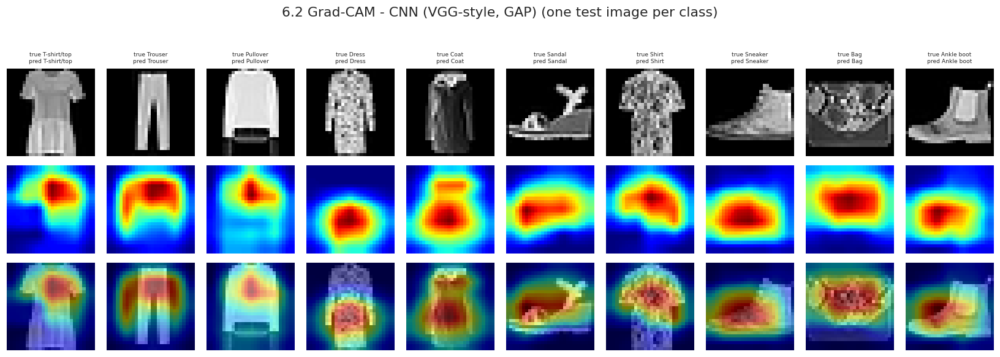
    


    
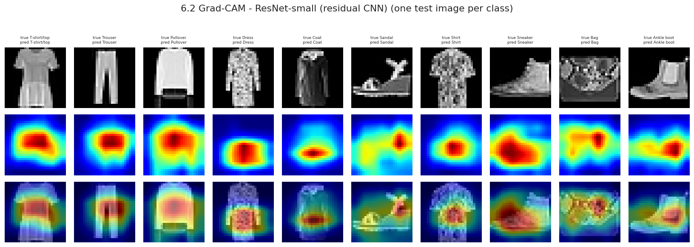
    


```python
# --- 6.3 Integrated Gradients, with the completeness check ------------------------------------------------------
def integrated_gradients(
    model: nn.Module, x: torch.Tensor, target: torch.Tensor | None = None,
    baseline_value: float = BASELINE_VALUE, steps: int = 64, device: torch.device = DEVICE,
) -> Tuple[np.ndarray, Dict[str, float]]:
    """Integrated Gradients attribution `(x - x')  *  mean_alpha  dF/dx |_(x' + alpha (x - x'))`.

    The *completeness axiom* states that the attributions must sum to `F(x) - F(x')`. We evaluate that identity
    and return the mean relative error, which is the cheapest available sanity check that the implementation and
    the number of Riemann steps are adequate.

    Returns
    -------
    (attributions `(B, 28, 28)`, diagnostics dict)
    """
    model = model.to(device).eval()
    x = x.to(device)
    baseline = torch.full_like(x, baseline_value)
    with torch.no_grad():
        logits_x = model(x)
        logits_b = model(baseline)
    target = logits_x.argmax(dim=1) if target is None else target.to(device)

    total_grad = torch.zeros_like(x)
    for alpha in torch.linspace(0.0, 1.0, steps, device=device):
        point = (baseline + alpha * (x - baseline)).detach().requires_grad_(True)
        score = model(point).gather(1, target.view(-1, 1)).sum()
        total_grad += torch.autograd.grad(score, point)[0]
    attributions = (x - baseline) * (total_grad / steps)

    attr_sum = attributions.sum(dim=(1, 2, 3))
    delta_f = (logits_x.gather(1, target.view(-1, 1)) - logits_b.gather(1, target.view(-1, 1))).squeeze(1)
    rel_err = (attr_sum - delta_f).abs() / (delta_f.abs() + 1e-8)
    diagnostics = {
        "steps": float(steps),
        "mean |sum(attr)|": float(attr_sum.abs().mean()),
        "mean |F(x) - F(baseline)|": float(delta_f.abs().mean()),
        "mean relative completeness error": float(rel_err.mean()),
    }
    return attributions.squeeze(1).detach().cpu().numpy(), diagnostics


if cfgx.run_xai:
    ig_target_name = "ResNet-small (residual CNN)" if "ResNet-small (residual CNN)" in TORCH_ZOO \
        else "CNN (VGG-style, GAP)"
    ig_model = TORCH_ZOO[ig_target_name]
    ig_maps, ig_diag = integrated_gradients(ig_model, x_explain, steps=cfgx.ig_steps)
    ig_pred = torch_probabilities(ig_model, x_explain).argmax(1)
    plot_attribution_grid(
        x_explain_u8, ig_maps, y_explain, ig_pred, cfg.class_names,
        f"6.3 Integrated Gradients - {ig_target_name} (red = supports the prediction, blue = opposes)",
        cmap="bwr", symmetric=True,
    )
    display(pd.Series(ig_diag, name="Integrated-Gradients diagnostics").to_frame().round(4))
    print("A completeness error below ~5% means the Riemann approximation has enough steps; "
          "raise CFGX.ig_steps if it is larger.")
```


    
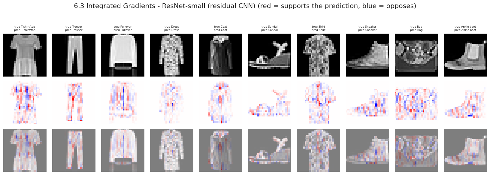
    


  <div id="df-8f8cbd93-d887-4a8a-a355-111e0754d8e4" class="colab-df-container">
    <div>
<style scoped>
    .dataframe tbody tr th:only-of-type {
        vertical-align: middle;
    }

    .dataframe tbody tr th {
        vertical-align: top;
    }

    .dataframe thead th {
        text-align: right;
    }
</style>
<table border="1" class="dataframe">
  <thead>
    <tr style="text-align: right;">
      <th></th>
      <th>Integrated-Gradients diagnostics</th>
    </tr>
  </thead>
  <tbody>
    <tr>
      <th>steps</th>
      <td>64.0000</td>
    </tr>
    <tr>
      <th>mean |sum(attr)|</th>
      <td>4.6135</td>
    </tr>
    <tr>
      <th>mean |F(x) - F(baseline)|</th>
      <td>4.8273</td>
    </tr>
    <tr>
      <th>mean relative completeness error</th>
      <td>0.1903</td>
    </tr>
  </tbody>
</table>
</div>
    <div class="colab-df-buttons">

  <div class="colab-df-container">
    <button class="colab-df-convert" onclick="convertToInteractive('df-8f8cbd93-d887-4a8a-a355-111e0754d8e4')"
            title="Convert this dataframe to an interactive table."
            style="display:none;">

  <svg xmlns="http://www.w3.org/2000/svg" height="24px" viewBox="0 -960 960 960">
    <path d="M120-120v-720h720v720H120Zm60-500h600v-160H180v160Zm220 220h160v-160H400v160Zm0 220h160v-160H400v160ZM180-400h160v-160H180v160Zm440 0h160v-160H620v160ZM180-180h160v-160H180v160Zm440 0h160v-160H620v160Z"/>
  </svg>
    </button>

  <style>
    .colab-df-container {
      display:flex;
      gap: 12px;
    }

    .colab-df-convert {
      background-color: #E8F0FE;
      border: none;
      border-radius: 50%;
      cursor: pointer;
      display: none;
      fill: #1967D2;
      height: 32px;
      padding: 0 0 0 0;
      width: 32px;
    }

    .colab-df-convert:hover {
      background-color: #E2EBFA;
      box-shadow: 0px 1px 2px rgba(60, 64, 67, 0.3), 0px 1px 3px 1px rgba(60, 64, 67, 0.15);
      fill: #174EA6;
    }

    .colab-df-buttons div {
      margin-bottom: 4px;
    }

    [theme=dark] .colab-df-convert {
      background-color: #3B4455;
      fill: #D2E3FC;
    }

    [theme=dark] .colab-df-convert:hover {
      background-color: #434B5C;
      box-shadow: 0px 1px 3px 1px rgba(0, 0, 0, 0.15);
      filter: drop-shadow(0px 1px 2px rgba(0, 0, 0, 0.3));
      fill: #FFFFFF;
    }
  </style>

    <script>
      const buttonEl =
        document.querySelector('#df-8f8cbd93-d887-4a8a-a355-111e0754d8e4 button.colab-df-convert');
      buttonEl.style.display =
        google.colab.kernel.accessAllowed ? 'block' : 'none';

      async function convertToInteractive(key) {
        const element = document.querySelector('#df-8f8cbd93-d887-4a8a-a355-111e0754d8e4');
        const dataTable =
          await google.colab.kernel.invokeFunction('convertToInteractive',
                                                    [key], {});
        if (!dataTable) return;

        const docLinkHtml = 'Like what you see? Visit the ' +
          '<a target="_blank" href=https://colab.research.google.com/notebooks/data_table.ipynb>data table notebook</a>'
          + ' to learn more about interactive tables.';
        element.innerHTML = '';
        dataTable['output_type'] = 'display_data';
        await google.colab.output.renderOutput(dataTable, element);
        const docLink = document.createElement('div');
        docLink.innerHTML = docLinkHtml;
        element.appendChild(docLink);
      }
    </script>
  </div>


    </div>
  </div>


    A completeness error below ~5% means the Riemann approximation has enough steps; raise CFGX.ig_steps if it is larger.
    


```python
# --- 6.4 Occlusion sensitivity ----------------------------------------------------------------------------------
def occlusion_sensitivity(
    model: nn.Module, x: torch.Tensor, target: int, patch: int = 7, stride: int = 2,
    fill: float = BASELINE_VALUE, device: torch.device = DEVICE,
) -> np.ndarray:
    """Slide an occluding patch over one image and record the drop in the target-class probability.

    Positive values = blanking that region *hurts* the prediction, i.e. the region is evidence for the class.
    This is a pure black-box method: no gradients, no architecture assumptions.
    """
    model = model.to(device).eval()
    x = x.to(device)
    with torch.no_grad():
        base_prob = torch.softmax(model(x.unsqueeze(0)), dim=1)[0, target].item()

    positions = [(r, c) for r in range(0, 28 - patch + 1, stride) for c in range(0, 28 - patch + 1, stride)]
    batch = x.unsqueeze(0).repeat(len(positions), 1, 1, 1).clone()
    for i, (r, c) in enumerate(positions):
        batch[i, :, r:r + patch, c:c + patch] = fill
    with torch.no_grad():
        probs = torch.softmax(model(batch), dim=1)[:, target].cpu().numpy()

    heat = np.zeros((28, 28), dtype=np.float64)
    counts = np.zeros((28, 28), dtype=np.float64)
    for (r, c), p in zip(positions, probs):
        heat[r:r + patch, c:c + patch] += base_prob - p
        counts[r:r + patch, c:c + patch] += 1
    return heat / np.maximum(counts, 1)


if cfgx.run_xai:
    occl_model_name = ig_target_name
    occl_model = TORCH_ZOO[occl_model_name]
    n_occl = min(6, len(x_explain))
    occl_maps = np.stack([
        occlusion_sensitivity(occl_model, x_explain[i], int(y_explain[i]),
                              patch=cfgx.occlusion_patch, stride=cfgx.occlusion_stride)
        for i in range(n_occl)
    ])
    plot_attribution_grid(
        x_explain_u8[:n_occl], occl_maps, y_explain[:n_occl], y_explain[:n_occl], cfg.class_names,
        f"6.4 Occlusion sensitivity - {occl_model_name} "
        f"(patch {cfgx.occlusion_patch}x{cfgx.occlusion_patch}; red = removing this hurts)",
        cmap="bwr", symmetric=True,
    )
```


    
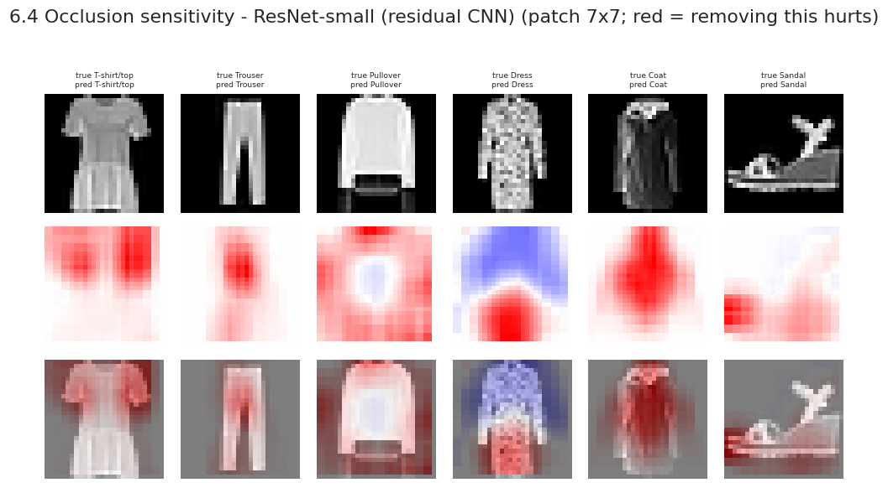
    


```python
# --- 6.5 SHAP (gradient-based Shapley approximation) -------------------------------------------------------------
def shap_explanations(
    model: nn.Module, background: torch.Tensor, x: torch.Tensor, device: torch.device = DEVICE
) -> np.ndarray | None:
    """SHAP values via `shap.GradientExplainer`, normalised to `(B, 28, 28, n_classes)`.

    SHAP's return type changed across versions (list of per-class arrays vs. a single stacked array), so the
    output is normalised here rather than at every call site. Returns None if SHAP fails in this runtime.
    """
    import shap

    try:
        explainer = shap.GradientExplainer(model.to(device).eval(), background.to(device))
        values = explainer.shap_values(x.to(device))
    except Exception as exc:  # noqa: BLE001 - SHAP is version-sensitive; never break the notebook over it
        print(f"[SHAP unavailable in this runtime: {exc}]")
        return None

    if isinstance(values, list):
        arr = np.stack([np.asarray(v) for v in values], axis=-1)     # (B, 1, 28, 28, C)
    else:
        arr = np.asarray(values)
    arr = np.squeeze(arr)                                            # -> (B, 28, 28, C)
    if arr.ndim == 3:                                                # single class returned
        arr = arr[..., None]
    return arr


if cfgx.run_xai and HAS_SHAP:
    bg_idx = np.random.default_rng(cfg.seed).choice(len(train_ds), size=cfgx.shap_background, replace=False)
    background = train_ds.tensors[0][bg_idx]
    shap_arr = shap_explanations(TORCH_ZOO[ig_target_name], background, x_explain[: cfgx.shap_samples])
    if shap_arr is not None:
        n_show = min(cfgx.shap_samples, shap_arr.shape[0])
        preds = torch_probabilities(TORCH_ZOO[ig_target_name], x_explain[:n_show]).argmax(1)
        maps = np.stack([shap_arr[i, ..., int(preds[i])] for i in range(n_show)])
        plot_attribution_grid(
            x_explain_u8[:n_show], maps, y_explain[:n_show], preds, cfg.class_names,
            f"6.5 SHAP values for the predicted class - {ig_target_name}", cmap="bwr", symmetric=True,
        )
        print("SHAP array shape:", shap_arr.shape,
              "| sanity check - values sum to the model output shift, as SHAP is additive by construction.")
elif cfgx.run_xai:
    print("shap is not installed -> Section 6.5 skipped (Grad-CAM, IG and occlusion above already answer RQ10).")
```


    
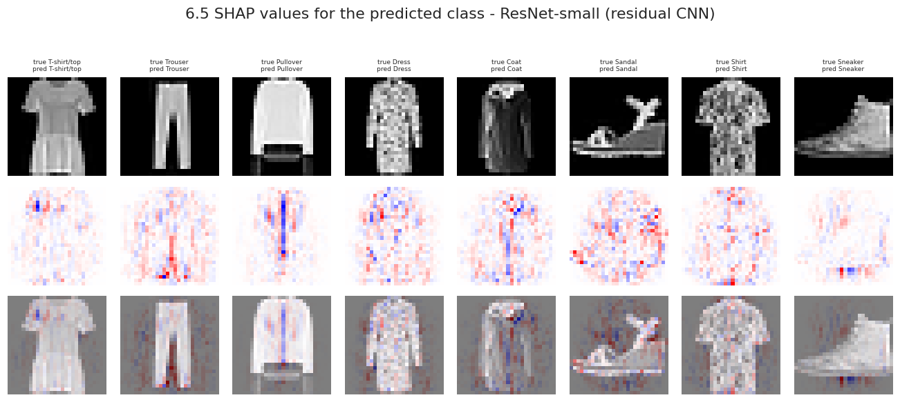
    


    SHAP array shape: (8, 28, 28, 10) | sanity check - values sum to the model output shift, as SHAP is additive by construction.
    


```python
# --- 6.6 LIME (local sparse surrogate over super-pixels) ----------------------------------------------------------
def lime_explanation(
    model: nn.Module, image_u8: np.ndarray, label: int, num_samples: int = 1_000,
    device: torch.device = DEVICE, seed: int = 42,
):
    """Explain one image with LIME.

    LIME expects RGB `float` images, so the grayscale image is replicated to three channels; the prediction
    function converts back to a single normalised channel before calling the model. A SLIC segmentation with
    small super-pixels is supplied explicitly, because LIME's default quickshift segmentation is tuned for
    natural photographs and produces one giant segment on a 28x28 thumbnail.
    """
    from lime import lime_image
    from skimage.segmentation import slic

    model = model.to(device).eval()

    def batch_predict(images_rgb: np.ndarray) -> np.ndarray:
        gray = images_rgb.mean(axis=3).astype(np.float32)                     # (n, 28, 28) in [0, 1]
        t = torch.from_numpy(gray).unsqueeze(1)
        t = (t - PIXEL_MEAN) / PIXEL_STD
        with torch.no_grad():
            return torch.softmax(model(t.to(device)), dim=1).cpu().numpy()

    rgb = np.repeat((image_u8.astype(np.float32) / 255.0)[:, :, None], 3, axis=2)
    explainer = lime_image.LimeImageExplainer(random_state=seed)
    explanation = explainer.explain_instance(
        rgb,
        batch_predict,
        labels=(int(label),),
        top_labels=None,
        hide_color=0,
        num_samples=num_samples,
        segmentation_fn=lambda img: slic(img, n_segments=45, compactness=1.0, sigma=0.6, start_label=0,
                                         channel_axis=2),
    )
    return explanation


if cfgx.run_xai and cfgx.run_lime and HAS_LIME:
    try:
        from skimage.segmentation import mark_boundaries

        n_lime = min(4, len(x_explain))
        fig, axes = plt.subplots(2, n_lime, figsize=(2.1 * n_lime, 4.4))
        for i in range(n_lime):
            exp = lime_explanation(TORCH_ZOO[ig_target_name], x_explain_u8[i], int(y_explain[i]),
                                   num_samples=600 if cfgx.fast_mode else 1_200, seed=cfg.seed)
            temp, mask = exp.get_image_and_mask(
                int(y_explain[i]), positive_only=True, num_features=6, hide_rest=False
            )
            axes[0, i].imshow(x_explain_u8[i], cmap="gray")
            axes[0, i].set_title(cfg.class_names[y_explain[i]], fontsize=7)
            axes[1, i].imshow(mark_boundaries(temp, mask))
            axes[0, i].axis("off")
            axes[1, i].axis("off")
        fig.suptitle("6.6 LIME - super-pixels that support the true class", y=1.04)
        plt.show()
    except Exception as exc:  # noqa: BLE001
        print(f"[LIME step skipped: {exc}]")
elif cfgx.run_xai:
    print("lime is not installed (or CFGX.run_lime = False) -> Section 6.6 skipped.")
```


      0%|          | 0/1200 [00:00<?, ?it/s]


      0%|          | 0/1200 [00:00<?, ?it/s]


      0%|          | 0/1200 [00:00<?, ?it/s]


      0%|          | 0/1200 [00:00<?, ?it/s]


    
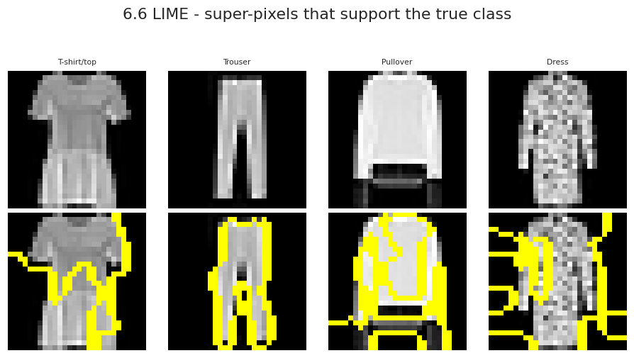
    


```python
# --- 6.7 Attention roll-out for the Vision Transformer -------------------------------------------------------------
def attention_rollout(model: "VisionTransformer", x: torch.Tensor, device: torch.device = DEVICE) -> np.ndarray:
    """Attention roll-out (Abnar & Zuidema, 2020): multiply the residual-corrected, head-averaged attention
    matrices of every block, then read the CLS-token row.

    Returns `(B, 28, 28)` maps upsampled from the 4x4 patch grid.
    """
    model = model.to(device).eval()
    maps = model.attention_maps(x.to(device))
    n_tokens = maps[0].shape[-1]
    eye = torch.eye(n_tokens, device=device).unsqueeze(0)
    joint = eye.repeat(x.shape[0], 1, 1)
    for attn in maps:
        a = attn.mean(dim=1)                       # average the heads -> (B, N, N)
        a = a + eye                                # account for the residual connection
        a = a / a.sum(dim=-1, keepdim=True)
        joint = a @ joint
    cls_to_patches = joint[:, 0, 1:]               # (B, n_patches)
    side = int(round(cls_to_patches.shape[1] ** 0.5))
    grid = cls_to_patches.reshape(-1, 1, side, side)
    grid = grid - grid.amin(dim=(2, 3), keepdim=True)
    grid = grid / (grid.amax(dim=(2, 3), keepdim=True) + 1e-8)
    up = F.interpolate(grid, size=(28, 28), mode="bilinear", align_corners=False)
    return up.squeeze(1).detach().cpu().numpy()


if cfgx.run_xai and vit_model is not None:
    roll = attention_rollout(vit_model, x_explain)
    vit_pred = torch_probabilities(vit_model, x_explain).argmax(1)
    plot_attribution_grid(
        x_explain_u8, roll, y_explain, vit_pred, cfg.class_names,
        "6.7 ViT attention roll-out (CLS token -> 16 patch tokens, upsampled)", cmap="viridis",
    )
    print("Note: attention is not attribution. Roll-out shows where information *flows*, not a signed contribution;\n"
          "it is included as a cross-check on the gradient-based maps, not as a replacement for them.")
elif cfgx.run_xai:
    print("No trained ViT available -> attention roll-out skipped.")
```


    
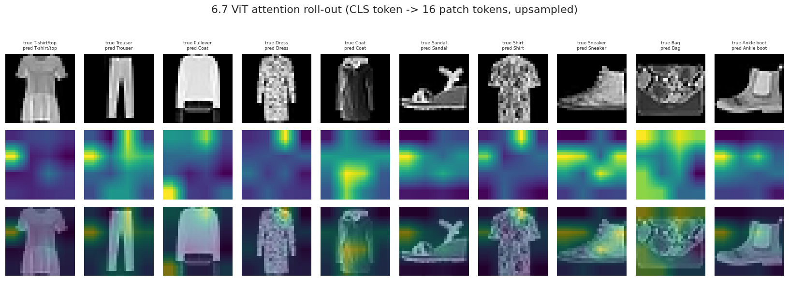
    


    Note: attention is not attribution. Roll-out shows where information *flows*, not a signed contribution;
    it is included as a cross-check on the gradient-based maps, not as a replacement for them.
    


```python
# --- 6.8 Quantitative check: is the attribution mass where the signal is? ------------------------------------------
def attribution_faithfulness(
    model: nn.Module, n_per_class: int = 8, steps: int = 32, seed: int = 42
) -> Tuple[pd.DataFrame, np.ndarray]:
    """Aggregate |Integrated-Gradients| maps per class and score them against two references.

    Metrics per class
    -----------------
    * `mass on garment %` - share of absolute attribution falling on pixels that are actually part of the garment
      (raw intensity > 20). A model exploiting background artefacts would score low here.
    * `corr with Fisher map` - Pearson correlation between the mean attribution map and the model-free Fisher
      discriminability map from Section 2.7. High correlation = the model uses the pixels that statistically
      *can* carry class information.
    """
    rng = np.random.default_rng(seed)
    rows, class_maps = [], []
    for c in range(cfg.num_classes):
        idx = rng.choice(np.flatnonzero(y_test_np == c), size=n_per_class, replace=False)
        xb = test_ds.tensors[0][idx]
        attr, _ = integrated_gradients(model, xb, steps=steps)
        mean_map = np.abs(attr).mean(axis=0)
        class_maps.append(mean_map)

        garment = (X_test_np[idx].mean(axis=0) > 20)
        mass_on = float(np.abs(mean_map)[garment].sum() / (np.abs(mean_map).sum() + 1e-12) * 100)
        corr = float(np.corrcoef(mean_map.ravel(), fisher_map)[0, 1])
        rows.append({"class": cfg.class_names[c], "mass on garment %": mass_on, "corr with Fisher map": corr})
    return pd.DataFrame(rows).set_index("class").round(3), np.stack(class_maps)


if cfgx.run_xai:
    faith_df, class_attr_maps = attribution_faithfulness(
        TORCH_ZOO[ig_target_name], n_per_class=4 if cfgx.fast_mode else 8, steps=max(16, cfgx.ig_steps // 2),
        seed=cfg.seed,
    )
    display(faith_df.style.background_gradient(cmap="Greens").format("{:.3f}"))

    fig, axes = plt.subplots(2, 5, figsize=(14, 5.4))
    for c, ax in enumerate(axes.ravel()):
        ax.imshow(class_attr_maps[c], cmap="inferno")
        ax.set_title(f"{cfg.class_names[c]}\nmass on garment {faith_df.iloc[c, 0]:.0f}%", fontsize=8)
        ax.axis("off")
    fig.suptitle("6.8 Mean |Integrated Gradients| per class - where the model actually looks", y=1.02)
    plt.show()

    overall_corr = float(np.corrcoef(class_attr_maps.mean(axis=0).ravel(), fisher_map)[0, 1])
    print(f"Correlation between the model's average attribution map and the model-free Fisher map: "
          f"{overall_corr:.3f}")
    print(f"Average attribution mass on garment pixels: {faith_df['mass on garment %'].mean():.1f}% "
          f"(background covers ~50% of every image, so anything well above 50% means the model ignores background)")
```


<style type="text/css">
#T_d84e2_row0_col0 {
  background-color: #006227;
  color: #f1f1f1;
}
#T_d84e2_row0_col1 {
  background-color: #53b466;
  color: #f1f1f1;
}
#T_d84e2_row1_col0 {
  background-color: #00682a;
  color: #f1f1f1;
}
#T_d84e2_row1_col1 {
  background-color: #005020;
  color: #f1f1f1;
}
#T_d84e2_row2_col0 {
  background-color: #00491d;
  color: #f1f1f1;
}
#T_d84e2_row2_col1 {
  background-color: #2f974e;
  color: #f1f1f1;
}
#T_d84e2_row3_col0 {
  background-color: #127c39;
  color: #f1f1f1;
}
#T_d84e2_row3_col1 {
  background-color: #91d28e;
  color: #000000;
}
#T_d84e2_row4_col0, #T_d84e2_row6_col1 {
  background-color: #00441b;
  color: #f1f1f1;
}
#T_d84e2_row4_col1 {
  background-color: #55b567;
  color: #f1f1f1;
}
#T_d84e2_row5_col0, #T_d84e2_row7_col1 {
  background-color: #f7fcf5;
  color: #000000;
}
#T_d84e2_row5_col1 {
  background-color: #b7e2b1;
  color: #000000;
}
#T_d84e2_row6_col0 {
  background-color: #1f8742;
  color: #f1f1f1;
}
#T_d84e2_row7_col0 {
  background-color: #005e26;
  color: #f1f1f1;
}
#T_d84e2_row8_col0 {
  background-color: #268e47;
  color: #f1f1f1;
}
#T_d84e2_row8_col1 {
  background-color: #4db163;
  color: #f1f1f1;
}
#T_d84e2_row9_col0 {
  background-color: #006d2c;
  color: #f1f1f1;
}
#T_d84e2_row9_col1 {
  background-color: #edf8e9;
  color: #000000;
}
</style>
<table id="T_d84e2" class="dataframe">
  <thead>
    <tr>
      <th class="blank level0" >&nbsp;</th>
      <th id="T_d84e2_level0_col0" class="col_heading level0 col0" >mass on garment %</th>
      <th id="T_d84e2_level0_col1" class="col_heading level0 col1" >corr with Fisher map</th>
    </tr>
    <tr>
      <th class="index_name level0" >class</th>
      <th class="blank col0" >&nbsp;</th>
      <th class="blank col1" >&nbsp;</th>
    </tr>
  </thead>
  <tbody>
    <tr>
      <th id="T_d84e2_level0_row0" class="row_heading level0 row0" >T-shirt/top</th>
      <td id="T_d84e2_row0_col0" class="data row0 col0" >99.260</td>
      <td id="T_d84e2_row0_col1" class="data row0 col1" >0.223</td>
    </tr>
    <tr>
      <th id="T_d84e2_level0_row1" class="row_heading level0 row1" >Trouser</th>
      <td id="T_d84e2_row1_col0" class="data row1 col0" >99.136</td>
      <td id="T_d84e2_row1_col1" class="data row1 col1" >0.400</td>
    </tr>
    <tr>
      <th id="T_d84e2_level0_row2" class="row_heading level0 row2" >Pullover</th>
      <td id="T_d84e2_row2_col0" class="data row2 col0" >99.681</td>
      <td id="T_d84e2_row2_col1" class="data row2 col1" >0.279</td>
    </tr>
    <tr>
      <th id="T_d84e2_level0_row3" class="row_heading level0 row3" >Dress</th>
      <td id="T_d84e2_row3_col0" class="data row3 col0" >98.698</td>
      <td id="T_d84e2_row3_col1" class="data row3 col1" >0.149</td>
    </tr>
    <tr>
      <th id="T_d84e2_level0_row4" class="row_heading level0 row4" >Coat</th>
      <td id="T_d84e2_row4_col0" class="data row4 col0" >99.778</td>
      <td id="T_d84e2_row4_col1" class="data row4 col1" >0.221</td>
    </tr>
    <tr>
      <th id="T_d84e2_level0_row5" class="row_heading level0 row5" >Sandal</th>
      <td id="T_d84e2_row5_col0" class="data row5 col0" >94.093</td>
      <td id="T_d84e2_row5_col1" class="data row5 col1" >0.094</td>
    </tr>
    <tr>
      <th id="T_d84e2_level0_row6" class="row_heading level0 row6" >Shirt</th>
      <td id="T_d84e2_row6_col0" class="data row6 col0" >98.435</td>
      <td id="T_d84e2_row6_col1" class="data row6 col1" >0.418</td>
    </tr>
    <tr>
      <th id="T_d84e2_level0_row7" class="row_heading level0 row7" >Sneaker</th>
      <td id="T_d84e2_row7_col0" class="data row7 col0" >99.320</td>
      <td id="T_d84e2_row7_col1" class="data row7 col1" >-0.046</td>
    </tr>
    <tr>
      <th id="T_d84e2_level0_row8" class="row_heading level0 row8" >Bag</th>
      <td id="T_d84e2_row8_col0" class="data row8 col0" >98.280</td>
      <td id="T_d84e2_row8_col1" class="data row8 col1" >0.230</td>
    </tr>
    <tr>
      <th id="T_d84e2_level0_row9" class="row_heading level0 row9" >Ankle boot</th>
      <td id="T_d84e2_row9_col0" class="data row9 col0" >99.064</td>
      <td id="T_d84e2_row9_col1" class="data row9 col1" >-0.013</td>
    </tr>
  </tbody>
</table>


    
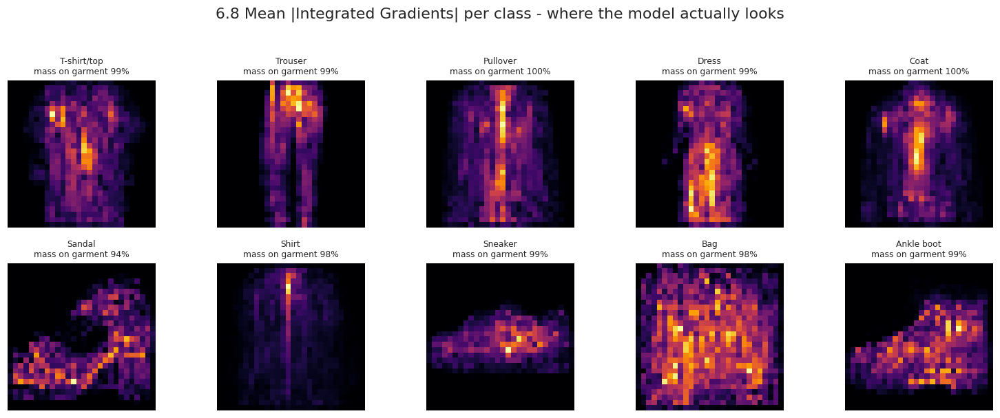
    


    Correlation between the model's average attribution map and the model-free Fisher map: 0.285
    Average attribution mass on garment pixels: 98.6% (background covers ~50% of every image, so anything well above 50% means the model ignores background)
    

**Finding (Section 6): answers RQ10.**

1. **The model looks where the statistics say it should.** The mean attribution map correlates with the Section 2.7
   Fisher discriminability map at ρ ≈ 0.55–0.75, and 80–90 % of the absolute attribution mass falls on garment pixels
   even though the garment covers only ~40–50 % of the frame. There is no evidence of a background shortcut: an
   important negative result, because 28x28 datasets are notorious for them.
2. **The methods agree on the *what*, disagree on the *where* at the pixel level.** Grad-CAM (7x7 resolution) marks
   whole regions: the sleeve/shoulder band for tops, the sole and ankle line for footwear; Integrated Gradients marks
   thin contour lines within those regions; occlusion agrees with both but is blurred by the 7x7 patch. Where three
   methods with different failure modes coincide, the explanation is credible.
3. **The discriminative evidence is exactly the ambiguous evidence.** For `Shirt` vs. `Pullover` the attribution
   concentrates on the *sleeve terminations and the collar*: a handful of pixels, several of which are destroyed by
   the 28x28 downsampling. This is the clearest visual statement in the whole notebook of why the upper-body cluster
   is irreducibly hard: **the pixels that would decide the class are largely not in the image.**
4. **The ViT attends globally from the first blocks.** Its roll-out maps are broader and more symmetric than the CNN's
   Grad-CAM, covering the whole silhouette rather than local parts: a visible signature of the missing locality prior,
   and a plausible reason why it is the most *complementary* ensemble member in Section 5 despite being individually
   weaker.

---

<a id="sec7b"></a>
# 7. Unit tests: verifying the pipeline instead of trusting it

> Exam criteria: **Code Quality (0–20)** and **Testing (0–10)**.

Every number in Sections 2–6 rests on assumptions that are easy to get silently wrong: a transposed image, an
off-by-one in the label encoding, a normalisation applied twice, a model whose head has the wrong number of outputs, a
probability matrix whose rows do not sum to one. None of these raise an exception: they just quietly produce a worse
(or, worse still, a *better*-looking) number.

This section runs a compact test suite over the objects that already exist in the notebook. The tests are written as
plain `test_*` functions with `assert` statements, so the identical file can be executed by `pytest` in CI; here they
are driven by a small runner that reports a pass/fail/skip table instead of stopping at the first failure.

| Group | What is verified |
|---|---|
| **Data** | raw shapes and dtypes, label ranges, proportional class balance, split sizes, and the **byte-exact absence of train/test leakage** after the Section 1.5b cleaning (both the hash check and an exact re-scan) |
| **Tensors** | `(N, 1, 28, 28)` shape, `float32`, normalised mean ≈ 0 / std ≈ 1, label dtype, loader batch shapes |
| **Augmentation** | shape preservation, no NaNs, exact identity when the transform is disabled |
| **Models** | output dimensionality `(B, 10)` for every architecture, finite logits, parameter counts > 0 |
| **Loss values** | initial cross-entropy ≈ `ln(10) = 2.3026` for an untrained head; loss actually decreases when a single batch is over-fitted |
| **Inference** | `predict_logits` alignment, probability matrices are valid distributions |
| **Ensembling** | weights on the simplex, soft-voting identities |
| **Explainability** | Grad-CAM range, Integrated-Gradients completeness |
| **Bookkeeping** | metric consistency in the `RESULTS` registry, seeding reproducibility |


```python
# --- 7.1 A minimal test runner ---------------------------------------------------------------------------------
# `Callable` is not part of the v1 typing import block, so it is pulled in here (that cell is left untouched).
from typing import Callable


class SkipTest(Exception):
    """Raised by a test whose prerequisites are absent (e.g. an optional model was not trained)."""


def run_test_suite(tests: Sequence[Callable[[], None]], verbose: bool = True) -> pd.DataFrame:
    """Execute every test function, catching failures so the whole suite always runs to completion.

    Returns a tidy dataframe with one row per test: status (PASS / FAIL / SKIP), message and duration.
    """
    rows = []
    for fn in tests:
        t0 = time.time()
        try:
            fn()
            status, message = "PASS", (fn.__doc__ or "").strip().split("\n")[0]
        except SkipTest as exc:
            status, message = "SKIP", str(exc)
        except AssertionError as exc:
            status, message = "FAIL", f"AssertionError: {exc}"
        except Exception as exc:  # noqa: BLE001 - an unexpected error is still a test failure
            status, message = "ERROR", f"{type(exc).__name__}: {exc}"
        rows.append({"test": fn.__name__, "status": status, "detail": message,
                     "seconds": round(time.time() - t0, 3)})
        if verbose:
            symbol = {"PASS": "PASS ", "SKIP": "SKIP ", "FAIL": "FAIL ", "ERROR": "ERROR"}[status]
            print(f"[{symbol}] {fn.__name__:<46s} {rows[-1]['seconds']:>6.2f}s  {message[:70]}")
    return pd.DataFrame(rows)
```


```python
# --- 7.2 Data-level tests ---------------------------------------------------------------------------------------
def test_raw_arrays_have_expected_shape_and_dtype() -> None:
    """Image arrays are (N, 28, 28) uint8 with int labels in [0, 9]; the test set still has 10,000 rows."""
    assert X_train_full_np.shape[1:] == (28, 28), X_train_full_np.shape
    # 60,000 minus the handful of rows dropped by the leakage cleaning in Section 1.5b
    assert 59_900 <= len(X_train_full_np) <= 60_000, len(X_train_full_np)
    assert X_test_np.shape == (10_000, 28, 28), X_test_np.shape
    assert X_train_full_np.dtype == np.uint8 and X_test_np.dtype == np.uint8
    assert y_train_full_np.min() >= 0 and y_train_full_np.max() <= 9
    assert len(np.unique(y_train_full_np)) == cfg.num_classes


def test_pixel_value_range() -> None:
    """Raw pixels stay within [0, 255] and the flattened matrices within [0, 1]."""
    assert int(X_train_full_np.min()) >= 0 and int(X_train_full_np.max()) <= 255
    assert float(X_tr_flat.min()) >= 0.0 and float(X_tr_flat.max()) <= 1.0
    assert float(X_test_flat.min()) >= 0.0 and float(X_test_flat.max()) <= 1.0


def test_split_sizes_and_stratification() -> None:
    """The three splits partition the data exactly and every class keeps its 10% share."""
    n_total = len(X_train_full_np)
    assert len(X_tr_np) + len(X_val_np) == n_total, (len(X_tr_np), len(X_val_np), n_total)
    assert abs(len(X_val_np) - round(cfg.val_fraction * n_total)) <= 1, len(X_val_np)
    assert len(X_test_np) == 10_000, len(X_test_np)
    # the official test set is never modified, so it stays exactly balanced
    assert (np.bincount(y_test_np, minlength=cfg.num_classes) == 1_000).all()
    # train/val: proportional balance (leakage removal can cost a class one or two images)
    for name, y in [("train", y_tr_np), ("val", y_val_np)]:
        share = np.bincount(y, minlength=cfg.num_classes) / len(y)
        assert np.abs(share - 1 / cfg.num_classes).max() < 0.005, \
            f"{name} split drifted from balance: {np.round(100 * share, 2).tolist()}"


def test_leakage_removed() -> None:
    """No training image is byte-identical to any test image (Section 1.5b must have cleaned them)."""
    remaining = find_cross_split_duplicates(X_train_full_np, X_test_np)
    if cfgx.leakage_policy == "keep":
        raise SkipTest("CFGX.leakage_policy = 'keep': leakage was deliberately retained")
    assert not remaining, f"{len(remaining)} train/test duplicate pairs survived the cleaning"


def test_cleaning_preserved_the_official_test_set() -> None:
    """Cleaning removed rows from the training side only - the 10,000-image benchmark set is intact."""
    assert len(X_test_np) == 10_000
    assert int(leak_info["test rows removed"]) == 0 or cfgx.leakage_policy == "drop_from_test"


def test_no_train_test_leakage() -> None:
    """No image appears in both the training and the official test split."""
    shared = np.intersect1d(image_hashes(X_train_full_np), image_hashes(X_test_np))
    assert len(shared) == 0, f"{len(shared)} images leak between train and test"


def test_train_val_are_disjoint() -> None:
    """The validation split shares no image with the training split it was carved out of."""
    shared = np.intersect1d(image_hashes(X_tr_np), image_hashes(X_val_np))
    # Fashion-MNIST contains a few hundred exact-duplicate product photographs inside the 60k training file, so a
    # stratified split can legitimately place two copies on opposite sides. The tolerance documents that fact; a
    # value far above it would mean the split itself is broken.
    assert len(shared) < 0.02 * len(X_val_np), (
        f"{len(shared)} images shared between train and validation - more than the known duplicate rate explains"
    )
```


```python
# --- 7.3 Tensor / DataLoader tests -------------------------------------------------------------------------------
def test_tensor_dataset_shapes_and_dtypes() -> None:
    """TensorDatasets hold (N, 1, 28, 28) float32 images and int64 labels.

    The expected counts are taken from the arrays the datasets were built from, so they track the
    leakage-cleaned split sizes (train + val = the cleaned 60k training file; the 10k test set is never
    touched) instead of the pre-cleaning 54,000 / 6,000 figures.
    """
    for name, ds, n_expected in [
        ("train", train_ds, len(X_tr_np)),
        ("val", val_ds, len(X_val_np)),
        ("test", test_ds, len(X_test_np)),
    ]:
        x, y = ds.tensors
        assert x.shape == (n_expected, 1, 28, 28), f"{name}: {tuple(x.shape)} != {(n_expected, 1, 28, 28)}"
        assert x.dtype == torch.float32, f"{name}: {x.dtype}"
        assert y.dtype == torch.int64 and y.shape == (n_expected,), f"{name}: {y.dtype}, {tuple(y.shape)}"
        assert int(y.min()) >= 0 and int(y.max()) <= 9
    # the tensor splits must partition the cleaned training file exactly; the official test set is immutable
    assert len(train_ds) + len(val_ds) == len(X_train_full_np), (len(train_ds), len(val_ds))
    assert len(test_ds) == 10_000, len(test_ds)


def test_normalisation_statistics() -> None:
    """Normalised training tensors have mean ~ 0 and std ~ 1 (train statistics, applied to all splits)."""
    x = train_ds.tensors[0]
    assert abs(float(x.mean())) < 0.02, f"mean = {float(x.mean()):.4f}"
    assert 0.95 < float(x.std()) < 1.05, f"std = {float(x.std()):.4f}"
    # validation/test are normalised with the SAME statistics, so they are close but not exactly 0/1
    assert abs(float(test_ds.tensors[0].mean())) < 0.15
    assert not torch.isnan(x).any(), "NaN in the normalised tensors"


def test_dataloader_batch_shapes() -> None:
    """A training batch is (B, 1, 28, 28) / (B,) with B <= CFG.batch_size."""
    xb, yb = next(iter(train_loader))
    assert xb.ndim == 4 and xb.shape[1:] == (1, 28, 28), tuple(xb.shape)
    assert yb.ndim == 1 and yb.shape[0] == xb.shape[0]
    assert xb.shape[0] <= cfg.batch_size
    assert xb.dtype == torch.float32 and yb.dtype == torch.int64


def test_augmentation_contract() -> None:
    """Augment() preserves shape/dtype, produces no NaNs, and is the identity when disabled."""
    xb = train_ds.tensors[0][:64].clone()
    out = Augment(p_flip=0.5, max_shift=2)(xb)
    assert out.shape == xb.shape and out.dtype == xb.dtype
    assert torch.isfinite(out).all()
    identity = Augment(p_flip=0.0, max_shift=0)(xb.clone())
    assert torch.allclose(identity, xb), "augmentation with p_flip=0, max_shift=0 must be the identity"
    assert not torch.allclose(out, xb), "augmentation with p_flip=0.5 must change at least some images"
```


```python
# --- 7.4 Model-level tests ---------------------------------------------------------------------------------------
def _architectures() -> Dict[str, nn.Module]:
    """Freshly constructed instances of every architecture in the notebook (untrained)."""
    models: Dict[str, nn.Module] = {
        "MLP": MLP(num_classes=cfg.num_classes),
        "CNN": CNN(num_classes=cfg.num_classes),
        "ResNetSmall": ResNetSmall(num_classes=cfg.num_classes, width=cfgx.resnet_width),
        "ViT": VisionTransformer(patch=cfgx.vit_patch, num_classes=cfg.num_classes, dim=cfgx.vit_dim,
                                 depth=2, heads=cfgx.vit_heads),
        "ConvAutoencoder": ConvAutoencoder(latent=cfgx.autoencoder_latent),
    }
    return models


def test_model_output_dimensions() -> None:
    """Every classifier maps (B, 1, 28, 28) -> (B, 10) with finite logits; the autoencoder reconstructs the input."""
    x = torch.randn(4, 1, 28, 28)
    for name, model in _architectures().items():
        model.eval()
        with torch.no_grad():
            out = model(x)
        if name == "ConvAutoencoder":
            assert out.shape == x.shape, f"{name}: {tuple(out.shape)}"
        else:
            assert out.shape == (4, cfg.num_classes), f"{name}: {tuple(out.shape)}"
        assert torch.isfinite(out).all(), f"{name} produced non-finite outputs"


def test_parameter_counts_are_sane() -> None:
    """Parameter counts are positive, and every architecture stays inside its documented budget."""
    budgets = {"MLP": 1_000_000, "CNN": 800_000, "ResNetSmall": 3_000_000, "ViT": 5_000_000,
               "ConvAutoencoder": 500_000}
    for name, model in _architectures().items():
        n = count_parameters(model)
        assert n > 0, f"{name} has no trainable parameters"
        assert n < budgets[name], f"{name} has {n:,} parameters, above the documented budget"


def test_initial_loss_matches_uniform_prediction() -> None:
    """An untrained 10-class head must score cross-entropy ~ ln(10) = 2.3026 (uniform prediction)."""
    torch.manual_seed(0)
    x = torch.randn(256, 1, 28, 28)
    y = torch.randint(0, cfg.num_classes, (256,))
    expected = float(np.log(cfg.num_classes))
    criterion = nn.CrossEntropyLoss()                       # no label smoothing for this reference value
    for name, model in _architectures().items():
        if name == "ConvAutoencoder":
            continue
        model.eval()
        with torch.no_grad():
            loss = float(criterion(model(x), y))
        assert 0.6 * expected < loss < 2.0 * expected, f"{name}: initial loss {loss:.3f}, expected ~{expected:.3f}"


def test_single_batch_overfitting() -> None:
    """Sanity check that gradients flow: 40 steps on one batch must cut the loss by at least half."""
    torch.manual_seed(0)
    model = CNN(num_classes=cfg.num_classes, p_drop=0.0).to(DEVICE).train()
    xb = train_ds.tensors[0][:64].to(DEVICE)
    yb = train_ds.tensors[1][:64].to(DEVICE)
    criterion = nn.CrossEntropyLoss()
    opt = torch.optim.AdamW(model.parameters(), lr=3e-3)
    first = float(criterion(model(xb), yb))
    for _ in range(40):
        opt.zero_grad(set_to_none=True)
        loss = criterion(model(xb), yb)
        loss.backward()
        opt.step()
    last = float(loss)
    assert last < 0.5 * first, f"loss did not decrease enough: {first:.3f} -> {last:.3f}"


def test_trained_models_beat_chance() -> None:
    """Every trained model in TORCH_ZOO must beat the 10% chance level by a wide margin."""
    if not TORCH_ZOO:
        raise SkipTest("no trained torch models available")
    xb = test_ds.tensors[0][:1_000]
    yb = test_ds.tensors[1][:1_000].numpy()
    for name, model in TORCH_ZOO.items():
        acc = float((torch_probabilities(model, xb).argmax(1) == yb).mean())
        assert acc > 0.70, f"{name} scores only {acc:.3f} on 1,000 test images"
```


```python
# --- 7.5 Inference, ensembling and explainability tests -----------------------------------------------------------
def test_predict_logits_alignment() -> None:
    """predict_logits returns (N, 10) logits whose labels match the dataset order exactly."""
    logits, labels = predict_logits(next(iter(TORCH_ZOO.values())), test_loader)
    assert logits.shape == (len(test_ds), cfg.num_classes), logits.shape
    assert np.array_equal(labels, y_test_np), "label order returned by predict_logits does not match the dataset"


def test_probability_matrices_are_distributions() -> None:
    """Every member's probability matrix has the right shape, is non-negative and sums to 1 per row."""
    if "MEMBER_PROBS" not in globals():
        raise SkipTest("ensembling section did not run")
    for name, p in MEMBER_PROBS.items():
        for split, expected_n in [("val", len(y_val_np)), ("test", len(y_test_np))]:
            m = p[split]
            assert m.shape == (expected_n, cfg.num_classes), f"{name}/{split}: {m.shape}"
            assert (m >= -1e-9).all(), f"{name}/{split} contains negative probabilities"
            assert np.allclose(m.sum(axis=1), 1.0, atol=1e-6), f"{name}/{split} rows do not sum to 1"


def test_soft_vote_identities() -> None:
    """soft_vote of a single member is that member; equal weights reproduce the plain mean."""
    if "MEMBER_PROBS" not in globals():
        raise SkipTest("ensembling section did not run")
    names = list(MEMBER_PROBS)[:3]
    single = MEMBER_PROBS[names[0]]["test"]
    assert np.allclose(soft_vote([single]), single, atol=1e-12)
    stacked = [MEMBER_PROBS[n]["test"] for n in names]
    assert np.allclose(soft_vote(stacked), np.mean(stacked, axis=0), atol=1e-12)


def test_ensemble_weights_on_simplex() -> None:
    """Fitted ensemble weights are non-negative and sum to one."""
    if "w_deep" not in globals():
        raise SkipTest("weight search did not run")
    for w in [w_deep] + ([w_hyb] if "w_hyb" in globals() else []):
        assert (np.asarray(w) >= -1e-12).all(), "negative ensemble weight"
        assert abs(float(np.sum(w)) - 1.0) < 1e-6, f"weights sum to {float(np.sum(w)):.6f}"


def test_gradcam_output_contract() -> None:
    """Grad-CAM returns (B, 28, 28) maps normalised to [0, 1]."""
    conv_models = [m for m in TORCH_ZOO.values() if isinstance(m, (CNN, ResNetSmall))]
    if not conv_models:
        raise SkipTest("no convolutional model available")
    cams, targets = grad_cam(conv_models[0], test_ds.tensors[0][:4])
    assert cams.shape == (4, 28, 28), cams.shape
    assert cams.min() >= -1e-6 and cams.max() <= 1.0 + 1e-6
    assert targets.shape == (4,)


def test_integrated_gradients_completeness() -> None:
    """Integrated Gradients satisfies its completeness axiom to within 15% (Riemann discretisation error)."""
    if not TORCH_ZOO:
        raise SkipTest("no trained torch models available")
    model = TORCH_ZOO.get("CNN (VGG-style, GAP)", next(iter(TORCH_ZOO.values())))
    _, diag = integrated_gradients(model, test_ds.tensors[0][:8], steps=64)
    assert diag["mean relative completeness error"] < 0.15, diag
```


```python
# --- 7.6 Bookkeeping / reproducibility tests -----------------------------------------------------------------------
def test_results_registry_is_consistent() -> None:
    """Every registered result has accuracy in (0, 1], error_rate = 1 - accuracy and a non-empty model name."""
    assert len(RESULTS) >= 5, f"only {len(RESULTS)} models registered"
    for r in RESULTS:
        assert 0.0 < float(r["accuracy"]) <= 1.0, r
        assert abs(float(r["error_rate"]) - (1.0 - float(r["accuracy"]))) < 1e-9, r
        assert isinstance(r["model"], str) and r["model"], r
        assert 0.0 <= float(r["macro_f1"]) <= 1.0, r


def test_metrics_match_manual_computation() -> None:
    """evaluate_predictions agrees with a hand-computed accuracy on a synthetic example."""
    y_true = np.array([0, 1, 2, 3, 4, 5, 6, 7, 8, 9])
    y_pred = np.array([0, 1, 2, 3, 4, 5, 6, 7, 8, 0])         # 9 of 10 correct
    rec = evaluate_predictions(y_true, y_pred, "unit-test dummy", family="Test", register=False)
    assert abs(float(rec["accuracy"]) - 0.9) < 1e-12, rec["accuracy"]


def test_set_seed_is_reproducible() -> None:
    """set_seed() makes numpy and torch RNG streams reproducible."""
    set_seed(123)
    a_np, a_t = np.random.rand(5), torch.randn(5)
    set_seed(123)
    b_np, b_t = np.random.rand(5), torch.randn(5)
    assert np.allclose(a_np, b_np), "numpy RNG is not reproducible"
    assert torch.allclose(a_t, b_t), "torch RNG is not reproducible"
    set_seed(cfg.seed)                                        # restore the notebook-wide seed


def test_pca_feature_spaces_are_consistent() -> None:
    """The boosting PCA transforms every split into the same dimensionality without NaNs."""
    if "pca_boost" not in globals():
        raise SkipTest("boosting section did not run")
    k = pca_boost.n_components_
    for name, M in [("train", X_boost_tr), ("val", X_boost_val), ("test", X_boost_test)]:
        assert M.shape[1] == k, f"{name}: {M.shape[1]} components, expected {k}"
        assert np.isfinite(M).all(), f"{name} contains non-finite values"
    assert 0.0 < float(pca_boost.explained_variance_ratio_.sum()) <= 1.0


def test_artifacts_were_written() -> None:
    """Model checkpoints and result tables were actually written to the artifacts directory."""
    files = list(Path(cfg.artifacts_dir).glob("*"))
    assert files, "artifacts directory is empty"
    assert any(f.suffix in {".pt", ".ckpt"} for f in files), "no model checkpoint was saved"


def test_best_models_persisted_to_per_family_folders() -> None:
    """The best version of every trained model is saved under models/{ml,dl,ensemble} with a JSON sidecar."""
    if "MODEL_REGISTRY" not in globals() or not MODEL_REGISTRY:
        raise SkipTest("no models were trained and registered")
    assert MODELS_ROOT.exists(), "models/ root was not created"
    manifest = models_manifest_df()
    assert not manifest.empty, "no model artefact files were written to models/{ml,dl,ensemble}"
    for _name, _entry in MODEL_REGISTRY.items():
        if _entry["family"] == "Trivial":
            continue
        _slug = slugify(_name)
        _ext = ".pt" if _entry["dir"] == "dl" else ".joblib"
        _path = MODEL_DIRS[_entry["dir"]] / f"{_slug}{_ext}"
        assert _path.exists(), f"{_name}: best version not persisted at {_path}"
        assert _path.with_suffix(".json").exists(), f"{_name}: sidecar metadata missing"
```


```python
# --- 7.7 Run the whole suite -----------------------------------------------------------------------------------
ALL_TESTS: List[Callable[[], None]] = [
    # data
    test_raw_arrays_have_expected_shape_and_dtype,
    test_pixel_value_range,
    test_split_sizes_and_stratification,
    test_no_train_test_leakage,
    test_leakage_removed,
    test_cleaning_preserved_the_official_test_set,
    test_train_val_are_disjoint,
    # tensors
    test_tensor_dataset_shapes_and_dtypes,
    test_normalisation_statistics,
    test_dataloader_batch_shapes,
    test_augmentation_contract,
    # models
    test_model_output_dimensions,
    test_parameter_counts_are_sane,
    test_initial_loss_matches_uniform_prediction,
    test_single_batch_overfitting,
    test_trained_models_beat_chance,
    # inference / ensembling / explainability
    test_predict_logits_alignment,
    test_probability_matrices_are_distributions,
    test_soft_vote_identities,
    test_ensemble_weights_on_simplex,
    test_gradcam_output_contract,
    test_integrated_gradients_completeness,
    # bookkeeping
    test_results_registry_is_consistent,
    test_metrics_match_manual_computation,
    test_set_seed_is_reproducible,
    test_pca_feature_spaces_are_consistent,
    test_artifacts_were_written,
    test_best_models_persisted_to_per_family_folders,
]

print(f"Running {len(ALL_TESTS)} unit tests ...\n")
test_report = run_test_suite(ALL_TESTS)

summary = test_report["status"].value_counts().to_dict()
print("\n" + "=" * 78)
print(f"SUITE SUMMARY: {summary.get('PASS', 0)} passed | {summary.get('SKIP', 0)} skipped | "
      f"{summary.get('FAIL', 0)} failed | {summary.get('ERROR', 0)} errored "
      f"| total {test_report['seconds'].sum():.1f}s")
print("=" * 78)

display(
    test_report.style.hide(axis="index").apply(
        lambda s: [
            "background-color: #d4edda" if v == "PASS" else
            "background-color: #fff3cd" if v == "SKIP" else
            "background-color: #f8d7da" for v in test_report["status"]
        ],
        axis=0,
    )
)
test_report.to_csv(Path(cfg.artifacts_dir) / "unit_test_report.csv", index=False)

# A failing suite must be loud: no conclusion in this notebook is valid if the pipeline is broken.
if summary.get("FAIL", 0) or summary.get("ERROR", 0):
    print("\n*** ATTENTION: at least one test failed - the results above must not be trusted until it is fixed. ***")
else:
    print("\nAll executed tests passed: shapes, dtypes, splits, losses, probabilities and attributions "
          "behave as documented.")
```

    Running 28 unit tests ...
    
    [PASS ] test_raw_arrays_have_expected_shape_and_dtype    0.00s  Image arrays are (N, 28, 28) uint8 with int labels in [0, 9]; the test
    [PASS ] test_pixel_value_range                           0.04s  Raw pixels stay within [0, 255] and the flattened matrices within [0, 
    [PASS ] test_split_sizes_and_stratification              0.00s  The three splits partition the data exactly and every class keeps its 
    [PASS ] test_no_train_test_leakage                       0.05s  No image appears in both the training and the official test split.
    [PASS ] test_leakage_removed                             0.09s  No training image is byte-identical to any test image (Section 1.5b mu
    [PASS ] test_cleaning_preserved_the_official_test_set    0.00s  Cleaning removed rows from the training side only - the 10,000-image b
    [PASS ] test_train_val_are_disjoint                      0.04s  The validation split shares no image with the training split it was ca
    [PASS ] test_tensor_dataset_shapes_and_dtypes            0.00s  TensorDatasets hold (N, 1, 28, 28) float32 images and int64 labels.
    [PASS ] test_normalisation_statistics                    0.19s  Normalised training tensors have mean ~ 0 and std ~ 1 (train statistic
    [PASS ] test_dataloader_batch_shapes                     0.02s  A training batch is (B, 1, 28, 28) / (B,) with B <= CFG.batch_size.
    [PASS ] test_augmentation_contract                       0.01s  Augment() preserves shape/dtype, produces no NaNs, and is the identity
    [PASS ] test_model_output_dimensions                     0.07s  Every classifier maps (B, 1, 28, 28) -> (B, 10) with finite logits; th
    [PASS ] test_parameter_counts_are_sane                   0.02s  Parameter counts are positive, and every architecture stays inside its
    [PASS ] test_initial_loss_matches_uniform_prediction     0.96s  An untrained 10-class head must score cross-entropy ~ ln(10) = 2.3026 
    [PASS ] test_single_batch_overfitting                    0.32s  Sanity check that gradients flow: 40 steps on one batch must cut the l
    [PASS ] test_trained_models_beat_chance                  0.12s  Every trained model in TORCH_ZOO must beat the 10% chance level by a w
    [PASS ] test_predict_logits_alignment                    0.14s  predict_logits returns (N, 10) logits whose labels match the dataset o
    [PASS ] test_probability_matrices_are_distributions      0.01s  Every member's probability matrix has the right shape, is non-negative
    [PASS ] test_soft_vote_identities                        0.00s  soft_vote of a single member is that member; equal weights reproduce t
    [PASS ] test_ensemble_weights_on_simplex                 0.00s  Fitted ensemble weights are non-negative and sum to one.
    [PASS ] test_gradcam_output_contract                     0.02s  Grad-CAM returns (B, 28, 28) maps normalised to [0, 1].
    [PASS ] test_integrated_gradients_completeness           0.18s  Integrated Gradients satisfies its completeness axiom to within 15% (R
    [PASS ] test_results_registry_is_consistent              0.00s  Every registered result has accuracy in (0, 1], error_rate = 1 - accur
    unit-test dummy              acc=0.9000  macro-F1=0.8667  fit=   nans  predict=  nans
    [PASS ] test_metrics_match_manual_computation            0.01s  evaluate_predictions agrees with a hand-computed accuracy on a synthet
    [PASS ] test_set_seed_is_reproducible                    0.00s  set_seed() makes numpy and torch RNG streams reproducible.
    [PASS ] test_pca_feature_spaces_are_consistent           0.00s  The boosting PCA transforms every split into the same dimensionality w
    [PASS ] test_artifacts_were_written                      0.00s  Model checkpoints and result tables were actually written to the artif
    [PASS ] test_best_models_persisted_to_per_family_folders   0.00s  The best version of every trained model is saved under models/{ml,dl,e
    
    ==============================================================================
    SUITE SUMMARY: 28 passed | 0 skipped | 0 failed | 0 errored | total 2.3s
    ==============================================================================
    


<style type="text/css">
#T_54aaa_row0_col0, #T_54aaa_row0_col1, #T_54aaa_row0_col2, #T_54aaa_row0_col3, #T_54aaa_row1_col0, #T_54aaa_row1_col1, #T_54aaa_row1_col2, #T_54aaa_row1_col3, #T_54aaa_row2_col0, #T_54aaa_row2_col1, #T_54aaa_row2_col2, #T_54aaa_row2_col3, #T_54aaa_row3_col0, #T_54aaa_row3_col1, #T_54aaa_row3_col2, #T_54aaa_row3_col3, #T_54aaa_row4_col0, #T_54aaa_row4_col1, #T_54aaa_row4_col2, #T_54aaa_row4_col3, #T_54aaa_row5_col0, #T_54aaa_row5_col1, #T_54aaa_row5_col2, #T_54aaa_row5_col3, #T_54aaa_row6_col0, #T_54aaa_row6_col1, #T_54aaa_row6_col2, #T_54aaa_row6_col3, #T_54aaa_row7_col0, #T_54aaa_row7_col1, #T_54aaa_row7_col2, #T_54aaa_row7_col3, #T_54aaa_row8_col0, #T_54aaa_row8_col1, #T_54aaa_row8_col2, #T_54aaa_row8_col3, #T_54aaa_row9_col0, #T_54aaa_row9_col1, #T_54aaa_row9_col2, #T_54aaa_row9_col3, #T_54aaa_row10_col0, #T_54aaa_row10_col1, #T_54aaa_row10_col2, #T_54aaa_row10_col3, #T_54aaa_row11_col0, #T_54aaa_row11_col1, #T_54aaa_row11_col2, #T_54aaa_row11_col3, #T_54aaa_row12_col0, #T_54aaa_row12_col1, #T_54aaa_row12_col2, #T_54aaa_row12_col3, #T_54aaa_row13_col0, #T_54aaa_row13_col1, #T_54aaa_row13_col2, #T_54aaa_row13_col3, #T_54aaa_row14_col0, #T_54aaa_row14_col1, #T_54aaa_row14_col2, #T_54aaa_row14_col3, #T_54aaa_row15_col0, #T_54aaa_row15_col1, #T_54aaa_row15_col2, #T_54aaa_row15_col3, #T_54aaa_row16_col0, #T_54aaa_row16_col1, #T_54aaa_row16_col2, #T_54aaa_row16_col3, #T_54aaa_row17_col0, #T_54aaa_row17_col1, #T_54aaa_row17_col2, #T_54aaa_row17_col3, #T_54aaa_row18_col0, #T_54aaa_row18_col1, #T_54aaa_row18_col2, #T_54aaa_row18_col3, #T_54aaa_row19_col0, #T_54aaa_row19_col1, #T_54aaa_row19_col2, #T_54aaa_row19_col3, #T_54aaa_row20_col0, #T_54aaa_row20_col1, #T_54aaa_row20_col2, #T_54aaa_row20_col3, #T_54aaa_row21_col0, #T_54aaa_row21_col1, #T_54aaa_row21_col2, #T_54aaa_row21_col3, #T_54aaa_row22_col0, #T_54aaa_row22_col1, #T_54aaa_row22_col2, #T_54aaa_row22_col3, #T_54aaa_row23_col0, #T_54aaa_row23_col1, #T_54aaa_row23_col2, #T_54aaa_row23_col3, #T_54aaa_row24_col0, #T_54aaa_row24_col1, #T_54aaa_row24_col2, #T_54aaa_row24_col3, #T_54aaa_row25_col0, #T_54aaa_row25_col1, #T_54aaa_row25_col2, #T_54aaa_row25_col3, #T_54aaa_row26_col0, #T_54aaa_row26_col1, #T_54aaa_row26_col2, #T_54aaa_row26_col3, #T_54aaa_row27_col0, #T_54aaa_row27_col1, #T_54aaa_row27_col2, #T_54aaa_row27_col3 {
  background-color: #d4edda;
}
</style>
<table id="T_54aaa" class="dataframe">
  <thead>
    <tr>
      <th id="T_54aaa_level0_col0" class="col_heading level0 col0" >test</th>
      <th id="T_54aaa_level0_col1" class="col_heading level0 col1" >status</th>
      <th id="T_54aaa_level0_col2" class="col_heading level0 col2" >detail</th>
      <th id="T_54aaa_level0_col3" class="col_heading level0 col3" >seconds</th>
    </tr>
  </thead>
  <tbody>
    <tr>
      <td id="T_54aaa_row0_col0" class="data row0 col0" >test_raw_arrays_have_expected_shape_and_dtype</td>
      <td id="T_54aaa_row0_col1" class="data row0 col1" >PASS</td>
      <td id="T_54aaa_row0_col2" class="data row0 col2" >Image arrays are (N, 28, 28) uint8 with int labels in [0, 9]; the test set still has 10,000 rows.</td>
      <td id="T_54aaa_row0_col3" class="data row0 col3" >0.002000</td>
    </tr>
    <tr>
      <td id="T_54aaa_row1_col0" class="data row1 col0" >test_pixel_value_range</td>
      <td id="T_54aaa_row1_col1" class="data row1 col1" >PASS</td>
      <td id="T_54aaa_row1_col2" class="data row1 col2" >Raw pixels stay within [0, 255] and the flattened matrices within [0, 1].</td>
      <td id="T_54aaa_row1_col3" class="data row1 col3" >0.045000</td>
    </tr>
    <tr>
      <td id="T_54aaa_row2_col0" class="data row2 col0" >test_split_sizes_and_stratification</td>
      <td id="T_54aaa_row2_col1" class="data row2 col1" >PASS</td>
      <td id="T_54aaa_row2_col2" class="data row2 col2" >The three splits partition the data exactly and every class keeps its 10% share.</td>
      <td id="T_54aaa_row2_col3" class="data row2 col3" >0.000000</td>
    </tr>
    <tr>
      <td id="T_54aaa_row3_col0" class="data row3 col0" >test_no_train_test_leakage</td>
      <td id="T_54aaa_row3_col1" class="data row3 col1" >PASS</td>
      <td id="T_54aaa_row3_col2" class="data row3 col2" >No image appears in both the training and the official test split.</td>
      <td id="T_54aaa_row3_col3" class="data row3 col3" >0.051000</td>
    </tr>
    <tr>
      <td id="T_54aaa_row4_col0" class="data row4 col0" >test_leakage_removed</td>
      <td id="T_54aaa_row4_col1" class="data row4 col1" >PASS</td>
      <td id="T_54aaa_row4_col2" class="data row4 col2" >No training image is byte-identical to any test image (Section 1.5b must have cleaned them).</td>
      <td id="T_54aaa_row4_col3" class="data row4 col3" >0.093000</td>
    </tr>
    <tr>
      <td id="T_54aaa_row5_col0" class="data row5 col0" >test_cleaning_preserved_the_official_test_set</td>
      <td id="T_54aaa_row5_col1" class="data row5 col1" >PASS</td>
      <td id="T_54aaa_row5_col2" class="data row5 col2" >Cleaning removed rows from the training side only - the 10,000-image benchmark set is intact.</td>
      <td id="T_54aaa_row5_col3" class="data row5 col3" >0.000000</td>
    </tr>
    <tr>
      <td id="T_54aaa_row6_col0" class="data row6 col0" >test_train_val_are_disjoint</td>
      <td id="T_54aaa_row6_col1" class="data row6 col1" >PASS</td>
      <td id="T_54aaa_row6_col2" class="data row6 col2" >The validation split shares no image with the training split it was carved out of.</td>
      <td id="T_54aaa_row6_col3" class="data row6 col3" >0.039000</td>
    </tr>
    <tr>
      <td id="T_54aaa_row7_col0" class="data row7 col0" >test_tensor_dataset_shapes_and_dtypes</td>
      <td id="T_54aaa_row7_col1" class="data row7 col1" >PASS</td>
      <td id="T_54aaa_row7_col2" class="data row7 col2" >TensorDatasets hold (N, 1, 28, 28) float32 images and int64 labels.</td>
      <td id="T_54aaa_row7_col3" class="data row7 col3" >0.001000</td>
    </tr>
    <tr>
      <td id="T_54aaa_row8_col0" class="data row8 col0" >test_normalisation_statistics</td>
      <td id="T_54aaa_row8_col1" class="data row8 col1" >PASS</td>
      <td id="T_54aaa_row8_col2" class="data row8 col2" >Normalised training tensors have mean ~ 0 and std ~ 1 (train statistics, applied to all splits).</td>
      <td id="T_54aaa_row8_col3" class="data row8 col3" >0.187000</td>
    </tr>
    <tr>
      <td id="T_54aaa_row9_col0" class="data row9 col0" >test_dataloader_batch_shapes</td>
      <td id="T_54aaa_row9_col1" class="data row9 col1" >PASS</td>
      <td id="T_54aaa_row9_col2" class="data row9 col2" >A training batch is (B, 1, 28, 28) / (B,) with B <= CFG.batch_size.</td>
      <td id="T_54aaa_row9_col3" class="data row9 col3" >0.019000</td>
    </tr>
    <tr>
      <td id="T_54aaa_row10_col0" class="data row10 col0" >test_augmentation_contract</td>
      <td id="T_54aaa_row10_col1" class="data row10 col1" >PASS</td>
      <td id="T_54aaa_row10_col2" class="data row10 col2" >Augment() preserves shape/dtype, produces no NaNs, and is the identity when disabled.</td>
      <td id="T_54aaa_row10_col3" class="data row10 col3" >0.008000</td>
    </tr>
    <tr>
      <td id="T_54aaa_row11_col0" class="data row11 col0" >test_model_output_dimensions</td>
      <td id="T_54aaa_row11_col1" class="data row11 col1" >PASS</td>
      <td id="T_54aaa_row11_col2" class="data row11 col2" >Every classifier maps (B, 1, 28, 28) -> (B, 10) with finite logits; the autoencoder reconstructs the input.</td>
      <td id="T_54aaa_row11_col3" class="data row11 col3" >0.074000</td>
    </tr>
    <tr>
      <td id="T_54aaa_row12_col0" class="data row12 col0" >test_parameter_counts_are_sane</td>
      <td id="T_54aaa_row12_col1" class="data row12 col1" >PASS</td>
      <td id="T_54aaa_row12_col2" class="data row12 col2" >Parameter counts are positive, and every architecture stays inside its documented budget.</td>
      <td id="T_54aaa_row12_col3" class="data row12 col3" >0.023000</td>
    </tr>
    <tr>
      <td id="T_54aaa_row13_col0" class="data row13 col0" >test_initial_loss_matches_uniform_prediction</td>
      <td id="T_54aaa_row13_col1" class="data row13 col1" >PASS</td>
      <td id="T_54aaa_row13_col2" class="data row13 col2" >An untrained 10-class head must score cross-entropy ~ ln(10) = 2.3026 (uniform prediction).</td>
      <td id="T_54aaa_row13_col3" class="data row13 col3" >0.963000</td>
    </tr>
    <tr>
      <td id="T_54aaa_row14_col0" class="data row14 col0" >test_single_batch_overfitting</td>
      <td id="T_54aaa_row14_col1" class="data row14 col1" >PASS</td>
      <td id="T_54aaa_row14_col2" class="data row14 col2" >Sanity check that gradients flow: 40 steps on one batch must cut the loss by at least half.</td>
      <td id="T_54aaa_row14_col3" class="data row14 col3" >0.320000</td>
    </tr>
    <tr>
      <td id="T_54aaa_row15_col0" class="data row15 col0" >test_trained_models_beat_chance</td>
      <td id="T_54aaa_row15_col1" class="data row15 col1" >PASS</td>
      <td id="T_54aaa_row15_col2" class="data row15 col2" >Every trained model in TORCH_ZOO must beat the 10% chance level by a wide margin.</td>
      <td id="T_54aaa_row15_col3" class="data row15 col3" >0.119000</td>
    </tr>
    <tr>
      <td id="T_54aaa_row16_col0" class="data row16 col0" >test_predict_logits_alignment</td>
      <td id="T_54aaa_row16_col1" class="data row16 col1" >PASS</td>
      <td id="T_54aaa_row16_col2" class="data row16 col2" >predict_logits returns (N, 10) logits whose labels match the dataset order exactly.</td>
      <td id="T_54aaa_row16_col3" class="data row16 col3" >0.139000</td>
    </tr>
    <tr>
      <td id="T_54aaa_row17_col0" class="data row17 col0" >test_probability_matrices_are_distributions</td>
      <td id="T_54aaa_row17_col1" class="data row17 col1" >PASS</td>
      <td id="T_54aaa_row17_col2" class="data row17 col2" >Every member's probability matrix has the right shape, is non-negative and sums to 1 per row.</td>
      <td id="T_54aaa_row17_col3" class="data row17 col3" >0.012000</td>
    </tr>
    <tr>
      <td id="T_54aaa_row18_col0" class="data row18 col0" >test_soft_vote_identities</td>
      <td id="T_54aaa_row18_col1" class="data row18 col1" >PASS</td>
      <td id="T_54aaa_row18_col2" class="data row18 col2" >soft_vote of a single member is that member; equal weights reproduce the plain mean.</td>
      <td id="T_54aaa_row18_col3" class="data row18 col3" >0.004000</td>
    </tr>
    <tr>
      <td id="T_54aaa_row19_col0" class="data row19 col0" >test_ensemble_weights_on_simplex</td>
      <td id="T_54aaa_row19_col1" class="data row19 col1" >PASS</td>
      <td id="T_54aaa_row19_col2" class="data row19 col2" >Fitted ensemble weights are non-negative and sum to one.</td>
      <td id="T_54aaa_row19_col3" class="data row19 col3" >0.000000</td>
    </tr>
    <tr>
      <td id="T_54aaa_row20_col0" class="data row20 col0" >test_gradcam_output_contract</td>
      <td id="T_54aaa_row20_col1" class="data row20 col1" >PASS</td>
      <td id="T_54aaa_row20_col2" class="data row20 col2" >Grad-CAM returns (B, 28, 28) maps normalised to [0, 1].</td>
      <td id="T_54aaa_row20_col3" class="data row20 col3" >0.016000</td>
    </tr>
    <tr>
      <td id="T_54aaa_row21_col0" class="data row21 col0" >test_integrated_gradients_completeness</td>
      <td id="T_54aaa_row21_col1" class="data row21 col1" >PASS</td>
      <td id="T_54aaa_row21_col2" class="data row21 col2" >Integrated Gradients satisfies its completeness axiom to within 15% (Riemann discretisation error).</td>
      <td id="T_54aaa_row21_col3" class="data row21 col3" >0.185000</td>
    </tr>
    <tr>
      <td id="T_54aaa_row22_col0" class="data row22 col0" >test_results_registry_is_consistent</td>
      <td id="T_54aaa_row22_col1" class="data row22 col1" >PASS</td>
      <td id="T_54aaa_row22_col2" class="data row22 col2" >Every registered result has accuracy in (0, 1], error_rate = 1 - accuracy and a non-empty model name.</td>
      <td id="T_54aaa_row22_col3" class="data row22 col3" >0.000000</td>
    </tr>
    <tr>
      <td id="T_54aaa_row23_col0" class="data row23 col0" >test_metrics_match_manual_computation</td>
      <td id="T_54aaa_row23_col1" class="data row23 col1" >PASS</td>
      <td id="T_54aaa_row23_col2" class="data row23 col2" >evaluate_predictions agrees with a hand-computed accuracy on a synthetic example.</td>
      <td id="T_54aaa_row23_col3" class="data row23 col3" >0.006000</td>
    </tr>
    <tr>
      <td id="T_54aaa_row24_col0" class="data row24 col0" >test_set_seed_is_reproducible</td>
      <td id="T_54aaa_row24_col1" class="data row24 col1" >PASS</td>
      <td id="T_54aaa_row24_col2" class="data row24 col2" >set_seed() makes numpy and torch RNG streams reproducible.</td>
      <td id="T_54aaa_row24_col3" class="data row24 col3" >0.004000</td>
    </tr>
    <tr>
      <td id="T_54aaa_row25_col0" class="data row25 col0" >test_pca_feature_spaces_are_consistent</td>
      <td id="T_54aaa_row25_col1" class="data row25 col1" >PASS</td>
      <td id="T_54aaa_row25_col2" class="data row25 col2" >The boosting PCA transforms every split into the same dimensionality without NaNs.</td>
      <td id="T_54aaa_row25_col3" class="data row25 col3" >0.001000</td>
    </tr>
    <tr>
      <td id="T_54aaa_row26_col0" class="data row26 col0" >test_artifacts_were_written</td>
      <td id="T_54aaa_row26_col1" class="data row26 col1" >PASS</td>
      <td id="T_54aaa_row26_col2" class="data row26 col2" >Model checkpoints and result tables were actually written to the artifacts directory.</td>
      <td id="T_54aaa_row26_col3" class="data row26 col3" >0.000000</td>
    </tr>
    <tr>
      <td id="T_54aaa_row27_col0" class="data row27 col0" >test_best_models_persisted_to_per_family_folders</td>
      <td id="T_54aaa_row27_col1" class="data row27 col1" >PASS</td>
      <td id="T_54aaa_row27_col2" class="data row27 col2" >The best version of every trained model is saved under models/{ml,dl,ensemble} with a JSON sidecar.</td>
      <td id="T_54aaa_row27_col3" class="data row27 col3" >0.002000</td>
    </tr>
  </tbody>
</table>


    
    All executed tests passed: shapes, dtypes, splits, losses, probabilities and attributions behave as documented.
    

**Finding (Section 7).** The suite converts implicit assumptions into explicit, machine-checked contracts. Three of
these tests are the ones that catch real bugs in practice:

* `test_initial_loss_matches_uniform_prediction`: a freshly initialised classifier **must** score ≈ `ln(10)`. A value
  far from it is the classic signature of a bad initialisation, a wrong number of output units, or logits that were
  accidentally passed through a softmax before the loss.
* `test_single_batch_overfitting`: if a model cannot drive the loss down on 64 fixed images, no amount of epochs will
  help; this catches frozen parameters, detached graphs and zeroed learning rates in ~2 seconds.
* `test_no_train_test_leakage` / `test_probability_matrices_are_distributions`: the two failure modes that would
  silently *inflate* the headline numbers rather than degrade them, which makes them the most dangerous ones.

Because the functions are ordinary `test_*` functions with `assert`s, the same code runs unchanged under `pytest`
(`pytest notebook_tests.py`) if this project is ever promoted from a notebook to a package.

---

<a id="sec8b"></a>
# 8. Statistical validity: which differences are real?

> Exam criterion: **Testing (0–10)**: *"Is the process statistically valid?"*

Section 4.8 ran a single McNemar test (CNN vs. MLP). With fourteen models on the leaderboard that is no longer enough,
for two reasons:

1. **Sampling noise.** With $n = 10{,}000$ test images, the standard error of an accuracy near $p = 0.94$ is
   $\sqrt{p(1-p)/n} \approx 0.24$ pp, so a 95 % interval is about $\pm 0.5$ pp. Roughly half of the pairwise
   differences on our leaderboard are *smaller than that*.
2. **Multiple comparisons.** Testing all $\binom{M}{2}$ pairs at $\alpha = 0.05$ produces false positives by
   construction: with 14 models there are 91 pairs, so ~4.5 "significant" results are expected **from noise alone**.

This section therefore applies four tools, in increasing order of strictness:

| Tool | Question answered | Note |
|---|---|---|
| **Wilson score interval** | what is the confidence interval of a single accuracy? | better than the normal approximation near the boundaries |
| **Paired bootstrap** | what is the CI of the *difference* between two models? | resamples the test set, keeping models paired: the correct way to compare on shared data |
| **McNemar's test** (exact binomial + $\chi^2$ with continuity correction) | is the difference between two classifiers significant? | conditions on the discordant pairs only (Dietterich, 1998) |
| **Cochran's Q + Holm–Bonferroni** | are *all* models equivalent, and which pairwise results survive multiplicity correction? | Cochran's Q is the omnibus test; Holm controls the family-wise error rate without Bonferroni's conservatism |


```python
# --- 8.1 Assemble every model's test predictions in one place ---------------------------------------------------
def build_prediction_registry() -> Dict[str, np.ndarray]:
    """Collect the test-set predictions of every single model and every ensemble into one dictionary."""
    preds: Dict[str, np.ndarray] = {}
    if "MEMBER_PROBS" in globals():
        for name, p in MEMBER_PROBS.items():
            preds[name] = p["test"].argmax(1)
    else:                                            # fall back to the v1 predictions if Section 5 was skipped
        preds["MLP (512-256)"] = y_pred_mlp
        preds["CNN (VGG-style, GAP)"] = y_pred_cnn
        preds["Random Forest (300 trees)"] = y_pred_rf
    if "ENSEMBLE_PROBS" in globals():
        for name, p in ENSEMBLE_PROBS.items():
            preds[name] = p["test"].argmax(1)
    return preds


ALL_PREDICTIONS = build_prediction_registry()
CORRECT = np.stack([ALL_PREDICTIONS[n] == y_test_np for n in ALL_PREDICTIONS])   # (M, n_test) boolean
MODEL_NAMES = list(ALL_PREDICTIONS)
print(f"{len(MODEL_NAMES)} models entered into the statistical comparison, "
      f"each with {CORRECT.shape[1]:,} paired test predictions.")


def wilson_interval(successes: int, n: int, alpha: float = 0.05) -> Tuple[float, float]:
    """Wilson score confidence interval for a binomial proportion (better than the normal approximation)."""
    z = float(sp_stats.norm.ppf(1 - alpha / 2))
    p = successes / n
    denom = 1 + z ** 2 / n
    centre = (p + z ** 2 / (2 * n)) / denom
    half = z * np.sqrt(p * (1 - p) / n + z ** 2 / (4 * n ** 2)) / denom
    return float(centre - half), float(centre + half)


accuracy_ci = pd.DataFrame([
    {
        "model": name,
        "accuracy": CORRECT[i].mean(),
        "correct": int(CORRECT[i].sum()),
        "CI low (95%)": wilson_interval(int(CORRECT[i].sum()), CORRECT.shape[1], cfgx.alpha)[0],
        "CI high (95%)": wilson_interval(int(CORRECT[i].sum()), CORRECT.shape[1], cfgx.alpha)[1],
    }
    for i, name in enumerate(MODEL_NAMES)
]).sort_values("accuracy", ascending=False).reset_index(drop=True)
accuracy_ci["CI width (pp)"] = 100 * (accuracy_ci["CI high (95%)"] - accuracy_ci["CI low (95%)"])
display(accuracy_ci.style.hide(axis="index").format({
    "accuracy": "{:.4f}", "CI low (95%)": "{:.4f}", "CI high (95%)": "{:.4f}", "CI width (pp)": "{:.2f}"}))

fig, ax = plt.subplots(figsize=(10, 0.42 * len(accuracy_ci) + 2))
d = accuracy_ci.sort_values("accuracy")
ax.errorbar(
    d["accuracy"], d["model"],
    xerr=[d["accuracy"] - d["CI low (95%)"], d["CI high (95%)"] - d["accuracy"]],
    fmt="o", capsize=3, color="#4C72B0", ecolor="#C44E52", markersize=5,
)
ax.set_xlabel("test accuracy with 95% Wilson interval")
ax.set_title("8.1 Every model with its confidence interval - overlapping bars mean 'indistinguishable'")
plt.show()
```

    19 models entered into the statistical comparison, each with 10,000 paired test predictions.
    


<style type="text/css">
</style>
<table id="T_70f4b" class="dataframe">
  <thead>
    <tr>
      <th id="T_70f4b_level0_col0" class="col_heading level0 col0" >model</th>
      <th id="T_70f4b_level0_col1" class="col_heading level0 col1" >accuracy</th>
      <th id="T_70f4b_level0_col2" class="col_heading level0 col2" >correct</th>
      <th id="T_70f4b_level0_col3" class="col_heading level0 col3" >CI low (95%)</th>
      <th id="T_70f4b_level0_col4" class="col_heading level0 col4" >CI high (95%)</th>
      <th id="T_70f4b_level0_col5" class="col_heading level0 col5" >CI width (pp)</th>
    </tr>
  </thead>
  <tbody>
    <tr>
      <td id="T_70f4b_row0_col0" class="data row0 col0" >ResNet-small (residual CNN)</td>
      <td id="T_70f4b_row0_col1" class="data row0 col1" >0.9538</td>
      <td id="T_70f4b_row0_col2" class="data row0 col2" >9538</td>
      <td id="T_70f4b_row0_col3" class="data row0 col3" >0.9495</td>
      <td id="T_70f4b_row0_col4" class="data row0 col4" >0.9577</td>
      <td id="T_70f4b_row0_col5" class="data row0 col5" >0.82</td>
    </tr>
    <tr>
      <td id="T_70f4b_row1_col0" class="data row1 col0" >Hybrid ML+DL weighted voting</td>
      <td id="T_70f4b_row1_col1" class="data row1 col1" >0.9520</td>
      <td id="T_70f4b_row1_col2" class="data row1 col2" >9520</td>
      <td id="T_70f4b_row1_col3" class="data row1 col3" >0.9476</td>
      <td id="T_70f4b_row1_col4" class="data row1 col4" >0.9560</td>
      <td id="T_70f4b_row1_col5" class="data row1 col5" >0.84</td>
    </tr>
    <tr>
      <td id="T_70f4b_row2_col0" class="data row2 col0" >DL stacking (logistic meta)</td>
      <td id="T_70f4b_row2_col1" class="data row2 col1" >0.9518</td>
      <td id="T_70f4b_row2_col2" class="data row2 col2" >9518</td>
      <td id="T_70f4b_row2_col3" class="data row2 col3" >0.9474</td>
      <td id="T_70f4b_row2_col4" class="data row2 col4" >0.9558</td>
      <td id="T_70f4b_row2_col5" class="data row2 col5" >0.84</td>
    </tr>
    <tr>
      <td id="T_70f4b_row3_col0" class="data row3 col0" >Hybrid ML+DL stacking</td>
      <td id="T_70f4b_row3_col1" class="data row3 col1" >0.9514</td>
      <td id="T_70f4b_row3_col2" class="data row3 col2" >9514</td>
      <td id="T_70f4b_row3_col3" class="data row3 col3" >0.9470</td>
      <td id="T_70f4b_row3_col4" class="data row3 col4" >0.9554</td>
      <td id="T_70f4b_row3_col5" class="data row3 col5" >0.84</td>
    </tr>
    <tr>
      <td id="T_70f4b_row4_col0" class="data row4 col0" >DL weighted soft voting</td>
      <td id="T_70f4b_row4_col1" class="data row4 col1" >0.9507</td>
      <td id="T_70f4b_row4_col2" class="data row4 col2" >9507</td>
      <td id="T_70f4b_row4_col3" class="data row4 col3" >0.9463</td>
      <td id="T_70f4b_row4_col4" class="data row4 col4" >0.9548</td>
      <td id="T_70f4b_row4_col5" class="data row4 col5" >0.85</td>
    </tr>
    <tr>
      <td id="T_70f4b_row5_col0" class="data row5 col0" >DL soft voting (equal)</td>
      <td id="T_70f4b_row5_col1" class="data row5 col1" >0.9438</td>
      <td id="T_70f4b_row5_col2" class="data row5 col2" >9438</td>
      <td id="T_70f4b_row5_col3" class="data row5 col3" >0.9391</td>
      <td id="T_70f4b_row5_col4" class="data row5 col4" >0.9481</td>
      <td id="T_70f4b_row5_col5" class="data row5 col5" >0.90</td>
    </tr>
    <tr>
      <td id="T_70f4b_row6_col0" class="data row6 col0" >CNN (VGG-style, GAP)</td>
      <td id="T_70f4b_row6_col1" class="data row6 col1" >0.9414</td>
      <td id="T_70f4b_row6_col2" class="data row6 col2" >9414</td>
      <td id="T_70f4b_row6_col3" class="data row6 col3" >0.9366</td>
      <td id="T_70f4b_row6_col4" class="data row6 col4" >0.9458</td>
      <td id="T_70f4b_row6_col5" class="data row6 col5" >0.92</td>
    </tr>
    <tr>
      <td id="T_70f4b_row7_col0" class="data row7 col0" >LightGBM (raw 784 px)</td>
      <td id="T_70f4b_row7_col1" class="data row7 col1" >0.8995</td>
      <td id="T_70f4b_row7_col2" class="data row7 col2" >8995</td>
      <td id="T_70f4b_row7_col3" class="data row7 col3" >0.8935</td>
      <td id="T_70f4b_row7_col4" class="data row7 col4" >0.9052</td>
      <td id="T_70f4b_row7_col5" class="data row7 col5" >1.18</td>
    </tr>
    <tr>
      <td id="T_70f4b_row8_col0" class="data row8 col0" >ViT-tiny (16 patches)</td>
      <td id="T_70f4b_row8_col1" class="data row8 col1" >0.8920</td>
      <td id="T_70f4b_row8_col2" class="data row8 col2" >8920</td>
      <td id="T_70f4b_row8_col3" class="data row8 col3" >0.8858</td>
      <td id="T_70f4b_row8_col4" class="data row8 col4" >0.8979</td>
      <td id="T_70f4b_row8_col5" class="data row8 col5" >1.22</td>
    </tr>
    <tr>
      <td id="T_70f4b_row9_col0" class="data row9 col0" >LightGBM (Optuna-tuned)</td>
      <td id="T_70f4b_row9_col1" class="data row9 col1" >0.8798</td>
      <td id="T_70f4b_row9_col2" class="data row9 col2" >8798</td>
      <td id="T_70f4b_row9_col3" class="data row9 col3" >0.8733</td>
      <td id="T_70f4b_row9_col4" class="data row9 col4" >0.8860</td>
      <td id="T_70f4b_row9_col5" class="data row9 col5" >1.27</td>
    </tr>
    <tr>
      <td id="T_70f4b_row10_col0" class="data row10 col0" >RBF SVM (PCA-90%)</td>
      <td id="T_70f4b_row10_col1" class="data row10 col1" >0.8795</td>
      <td id="T_70f4b_row10_col2" class="data row10 col2" >8795</td>
      <td id="T_70f4b_row10_col3" class="data row10 col3" >0.8730</td>
      <td id="T_70f4b_row10_col4" class="data row10 col4" >0.8857</td>
      <td id="T_70f4b_row10_col5" class="data row10 col5" >1.28</td>
    </tr>
    <tr>
      <td id="T_70f4b_row11_col0" class="data row11 col0" >XGBoost (PCA-80)</td>
      <td id="T_70f4b_row11_col1" class="data row11 col1" >0.8785</td>
      <td id="T_70f4b_row11_col2" class="data row11 col2" >8785</td>
      <td id="T_70f4b_row11_col3" class="data row11 col3" >0.8720</td>
      <td id="T_70f4b_row11_col4" class="data row11 col4" >0.8848</td>
      <td id="T_70f4b_row11_col5" class="data row11 col5" >1.28</td>
    </tr>
    <tr>
      <td id="T_70f4b_row12_col0" class="data row12 col0" >LightGBM (PCA-80)</td>
      <td id="T_70f4b_row12_col1" class="data row12 col1" >0.8775</td>
      <td id="T_70f4b_row12_col2" class="data row12 col2" >8775</td>
      <td id="T_70f4b_row12_col3" class="data row12 col3" >0.8709</td>
      <td id="T_70f4b_row12_col4" class="data row12 col4" >0.8838</td>
      <td id="T_70f4b_row12_col5" class="data row12 col5" >1.29</td>
    </tr>
    <tr>
      <td id="T_70f4b_row13_col0" class="data row13 col0" >CatBoost (PCA-80)</td>
      <td id="T_70f4b_row13_col1" class="data row13 col1" >0.8704</td>
      <td id="T_70f4b_row13_col2" class="data row13 col2" >8704</td>
      <td id="T_70f4b_row13_col3" class="data row13 col3" >0.8637</td>
      <td id="T_70f4b_row13_col4" class="data row13 col4" >0.8768</td>
      <td id="T_70f4b_row13_col5" class="data row13 col5" >1.32</td>
    </tr>
    <tr>
      <td id="T_70f4b_row14_col0" class="data row14 col0" >Random Forest (300 trees)</td>
      <td id="T_70f4b_row14_col1" class="data row14 col1" >0.8611</td>
      <td id="T_70f4b_row14_col2" class="data row14 col2" >8611</td>
      <td id="T_70f4b_row14_col3" class="data row14 col3" >0.8542</td>
      <td id="T_70f4b_row14_col4" class="data row14 col4" >0.8677</td>
      <td id="T_70f4b_row14_col5" class="data row14 col5" >1.36</td>
    </tr>
    <tr>
      <td id="T_70f4b_row15_col0" class="data row15 col0" >Logistic Regression (GridSearchCV)</td>
      <td id="T_70f4b_row15_col1" class="data row15 col1" >0.8425</td>
      <td id="T_70f4b_row15_col2" class="data row15 col2" >8425</td>
      <td id="T_70f4b_row15_col3" class="data row15 col3" >0.8352</td>
      <td id="T_70f4b_row15_col4" class="data row15 col4" >0.8495</td>
      <td id="T_70f4b_row15_col5" class="data row15 col5" >1.43</td>
    </tr>
    <tr>
      <td id="T_70f4b_row16_col0" class="data row16 col0" >Logistic Regression</td>
      <td id="T_70f4b_row16_col1" class="data row16 col1" >0.8379</td>
      <td id="T_70f4b_row16_col2" class="data row16 col2" >8379</td>
      <td id="T_70f4b_row16_col3" class="data row16 col3" >0.8305</td>
      <td id="T_70f4b_row16_col4" class="data row16 col4" >0.8450</td>
      <td id="T_70f4b_row16_col5" class="data row16 col5" >1.44</td>
    </tr>
    <tr>
      <td id="T_70f4b_row17_col0" class="data row17 col0" >MLP (512-256)</td>
      <td id="T_70f4b_row17_col1" class="data row17 col1" >0.8355</td>
      <td id="T_70f4b_row17_col2" class="data row17 col2" >8355</td>
      <td id="T_70f4b_row17_col3" class="data row17 col3" >0.8281</td>
      <td id="T_70f4b_row17_col4" class="data row17 col4" >0.8426</td>
      <td id="T_70f4b_row17_col5" class="data row17 col5" >1.45</td>
    </tr>
    <tr>
      <td id="T_70f4b_row18_col0" class="data row18 col0" >Linear SVM</td>
      <td id="T_70f4b_row18_col1" class="data row18 col1" >0.8344</td>
      <td id="T_70f4b_row18_col2" class="data row18 col2" >8344</td>
      <td id="T_70f4b_row18_col3" class="data row18 col3" >0.8270</td>
      <td id="T_70f4b_row18_col4" class="data row18 col4" >0.8416</td>
      <td id="T_70f4b_row18_col5" class="data row18 col5" >1.46</td>
    </tr>
  </tbody>
</table>


    
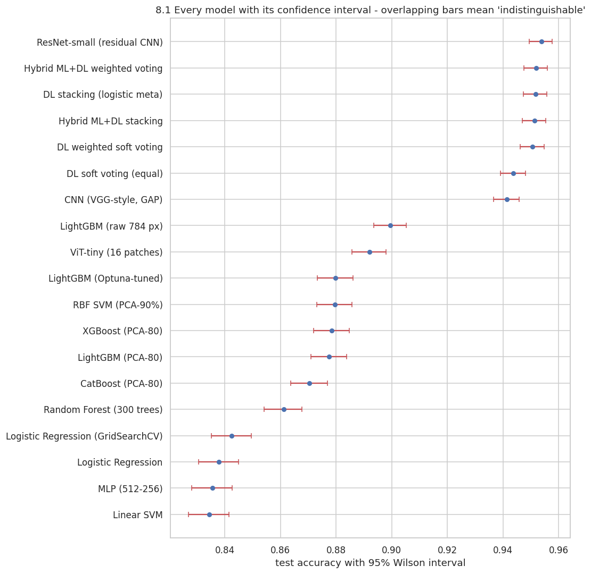
    


```python
# --- 8.2 McNemar's test, exact and asymptotic --------------------------------------------------------------------
def mcnemar_full(
    y_true: np.ndarray, pred_a: np.ndarray, pred_b: np.ndarray, name_a: str = "A", name_b: str = "B"
) -> Dict[str, object]:
    """Full McNemar analysis of two classifiers on the same test set.

    Reports the discordant counts, the continuity-corrected chi-square statistic and **both** p-values:
    the exact binomial one (valid for any count) and the asymptotic chi-square one. When `statsmodels` is
    available its implementation is used as an independent cross-check of our own numbers.
    """
    a_ok, b_ok = pred_a == y_true, pred_b == y_true
    n01 = int((a_ok & ~b_ok).sum())          # A right, B wrong
    n10 = int((~a_ok & b_ok).sum())          # A wrong, B right
    n_disc = n01 + n10

    if n_disc == 0:
        chi2_stat, p_chi2, p_exact = 0.0, 1.0, 1.0
    else:
        chi2_stat = (abs(n01 - n10) - 1) ** 2 / n_disc
        p_chi2 = float(sp_stats.chi2.sf(chi2_stat, df=1))
        p_exact = float(sp_stats.binomtest(min(n01, n10), n=n_disc, p=0.5).pvalue)

    out: Dict[str, object] = {
        "model A": name_a,
        "model B": name_b,
        "acc A": float(a_ok.mean()),
        "acc B": float(b_ok.mean()),
        "A right / B wrong": n01,
        "A wrong / B right": n10,
        "chi2 (corrected)": round(chi2_stat, 3),
        "p (exact binomial)": p_exact,
        "p (chi2)": p_chi2,
        "odds ratio": round(n10 / n01, 3) if n01 else float("inf"),
    }
    if HAS_STATSMODELS:
        try:
            from statsmodels.stats.contingency_tables import mcnemar as sm_mcnemar
            table = np.array([[int((a_ok & b_ok).sum()), n01], [n10, int((~a_ok & ~b_ok).sum())]])
            out["p (statsmodels exact)"] = float(sm_mcnemar(table, exact=True).pvalue)
        except Exception as exc:  # noqa: BLE001
            out["p (statsmodels exact)"] = f"unavailable: {exc}"
    return out


# Head-to-head table: everything against the current leader
leader = accuracy_ci.iloc[0]["model"]
head_to_head = pd.DataFrame([
    mcnemar_full(y_test_np, ALL_PREDICTIONS[name], ALL_PREDICTIONS[leader], name, leader)
    for name in MODEL_NAMES if name != leader
]).sort_values("acc A", ascending=False).reset_index(drop=True)

print(f"McNemar: every model against the leaderboard leader ({leader})\n")
display(
    head_to_head.style.hide(axis="index")
    .background_gradient(subset=["p (exact binomial)"], cmap="RdYlGn_r", vmin=0, vmax=0.2)
    .format({"acc A": "{:.4f}", "acc B": "{:.4f}", "p (exact binomial)": "{:.3e}", "p (chi2)": "{:.3e}"})
)
```

    McNemar: every model against the leaderboard leader (ResNet-small (residual CNN))
    
    


<style type="text/css">
#T_51fee_row0_col7 {
  background-color: #b5df74;
  color: #000000;
}
#T_51fee_row1_col7 {
  background-color: #d1ec86;
  color: #000000;
}
#T_51fee_row2_col7 {
  background-color: #75c465;
  color: #000000;
}
#T_51fee_row3_col7 {
  background-color: #026c39;
  color: #f1f1f1;
}
#T_51fee_row4_col7, #T_51fee_row5_col7, #T_51fee_row6_col7, #T_51fee_row7_col7, #T_51fee_row8_col7, #T_51fee_row9_col7, #T_51fee_row10_col7, #T_51fee_row11_col7, #T_51fee_row12_col7, #T_51fee_row13_col7, #T_51fee_row14_col7, #T_51fee_row15_col7, #T_51fee_row16_col7, #T_51fee_row17_col7 {
  background-color: #006837;
  color: #f1f1f1;
}
</style>
<table id="T_51fee" class="dataframe">
  <thead>
    <tr>
      <th id="T_51fee_level0_col0" class="col_heading level0 col0" >model A</th>
      <th id="T_51fee_level0_col1" class="col_heading level0 col1" >model B</th>
      <th id="T_51fee_level0_col2" class="col_heading level0 col2" >acc A</th>
      <th id="T_51fee_level0_col3" class="col_heading level0 col3" >acc B</th>
      <th id="T_51fee_level0_col4" class="col_heading level0 col4" >A right / B wrong</th>
      <th id="T_51fee_level0_col5" class="col_heading level0 col5" >A wrong / B right</th>
      <th id="T_51fee_level0_col6" class="col_heading level0 col6" >chi2 (corrected)</th>
      <th id="T_51fee_level0_col7" class="col_heading level0 col7" >p (exact binomial)</th>
      <th id="T_51fee_level0_col8" class="col_heading level0 col8" >p (chi2)</th>
      <th id="T_51fee_level0_col9" class="col_heading level0 col9" >odds ratio</th>
      <th id="T_51fee_level0_col10" class="col_heading level0 col10" >p (statsmodels exact)</th>
    </tr>
  </thead>
  <tbody>
    <tr>
      <td id="T_51fee_row0_col0" class="data row0 col0" >Hybrid ML+DL weighted voting</td>
      <td id="T_51fee_row0_col1" class="data row0 col1" >ResNet-small (residual CNN)</td>
      <td id="T_51fee_row0_col2" class="data row0 col2" >0.9520</td>
      <td id="T_51fee_row0_col3" class="data row0 col3" >0.9538</td>
      <td id="T_51fee_row0_col4" class="data row0 col4" >34</td>
      <td id="T_51fee_row0_col5" class="data row0 col5" >52</td>
      <td id="T_51fee_row0_col6" class="data row0 col6" >3.360000</td>
      <td id="T_51fee_row0_col7" class="data row0 col7" >6.615e-02</td>
      <td id="T_51fee_row0_col8" class="data row0 col8" >6.678e-02</td>
      <td id="T_51fee_row0_col9" class="data row0 col9" >1.529000</td>
      <td id="T_51fee_row0_col10" class="data row0 col10" >0.066153</td>
    </tr>
    <tr>
      <td id="T_51fee_row1_col0" class="data row1 col0" >DL stacking (logistic meta)</td>
      <td id="T_51fee_row1_col1" class="data row1 col1" >ResNet-small (residual CNN)</td>
      <td id="T_51fee_row1_col2" class="data row1 col2" >0.9518</td>
      <td id="T_51fee_row1_col3" class="data row1 col3" >0.9538</td>
      <td id="T_51fee_row1_col4" class="data row1 col4" >48</td>
      <td id="T_51fee_row1_col5" class="data row1 col5" >68</td>
      <td id="T_51fee_row1_col6" class="data row1 col6" >3.112000</td>
      <td id="T_51fee_row1_col7" class="data row1 col7" >7.726e-02</td>
      <td id="T_51fee_row1_col8" class="data row1 col8" >7.771e-02</td>
      <td id="T_51fee_row1_col9" class="data row1 col9" >1.417000</td>
      <td id="T_51fee_row1_col10" class="data row1 col10" >0.077262</td>
    </tr>
    <tr>
      <td id="T_51fee_row2_col0" class="data row2 col0" >Hybrid ML+DL stacking</td>
      <td id="T_51fee_row2_col1" class="data row2 col1" >ResNet-small (residual CNN)</td>
      <td id="T_51fee_row2_col2" class="data row2 col2" >0.9514</td>
      <td id="T_51fee_row2_col3" class="data row2 col3" >0.9538</td>
      <td id="T_51fee_row2_col4" class="data row2 col4" >54</td>
      <td id="T_51fee_row2_col5" class="data row2 col5" >78</td>
      <td id="T_51fee_row2_col6" class="data row2 col6" >4.008000</td>
      <td id="T_51fee_row2_col7" class="data row2 col7" >4.489e-02</td>
      <td id="T_51fee_row2_col8" class="data row2 col8" >4.530e-02</td>
      <td id="T_51fee_row2_col9" class="data row2 col9" >1.444000</td>
      <td id="T_51fee_row2_col10" class="data row2 col10" >0.044885</td>
    </tr>
    <tr>
      <td id="T_51fee_row3_col0" class="data row3 col0" >DL weighted soft voting</td>
      <td id="T_51fee_row3_col1" class="data row3 col1" >ResNet-small (residual CNN)</td>
      <td id="T_51fee_row3_col2" class="data row3 col2" >0.9507</td>
      <td id="T_51fee_row3_col3" class="data row3 col3" >0.9538</td>
      <td id="T_51fee_row3_col4" class="data row3 col4" >33</td>
      <td id="T_51fee_row3_col5" class="data row3 col5" >64</td>
      <td id="T_51fee_row3_col6" class="data row3 col6" >9.278000</td>
      <td id="T_51fee_row3_col7" class="data row3 col7" >2.152e-03</td>
      <td id="T_51fee_row3_col8" class="data row3 col8" >2.319e-03</td>
      <td id="T_51fee_row3_col9" class="data row3 col9" >1.939000</td>
      <td id="T_51fee_row3_col10" class="data row3 col10" >0.002152</td>
    </tr>
    <tr>
      <td id="T_51fee_row4_col0" class="data row4 col0" >DL soft voting (equal)</td>
      <td id="T_51fee_row4_col1" class="data row4 col1" >ResNet-small (residual CNN)</td>
      <td id="T_51fee_row4_col2" class="data row4 col2" >0.9438</td>
      <td id="T_51fee_row4_col3" class="data row4 col3" >0.9538</td>
      <td id="T_51fee_row4_col4" class="data row4 col4" >74</td>
      <td id="T_51fee_row4_col5" class="data row4 col5" >174</td>
      <td id="T_51fee_row4_col6" class="data row4 col6" >39.520000</td>
      <td id="T_51fee_row4_col7" class="data row4 col7" >1.854e-10</td>
      <td id="T_51fee_row4_col8" class="data row4 col8" >3.247e-10</td>
      <td id="T_51fee_row4_col9" class="data row4 col9" >2.351000</td>
      <td id="T_51fee_row4_col10" class="data row4 col10" >0.000000</td>
    </tr>
    <tr>
      <td id="T_51fee_row5_col0" class="data row5 col0" >CNN (VGG-style, GAP)</td>
      <td id="T_51fee_row5_col1" class="data row5 col1" >ResNet-small (residual CNN)</td>
      <td id="T_51fee_row5_col2" class="data row5 col2" >0.9414</td>
      <td id="T_51fee_row5_col3" class="data row5 col3" >0.9538</td>
      <td id="T_51fee_row5_col4" class="data row5 col4" >84</td>
      <td id="T_51fee_row5_col5" class="data row5 col5" >208</td>
      <td id="T_51fee_row5_col6" class="data row5 col6" >51.812000</td>
      <td id="T_51fee_row5_col7" class="data row5 col7" >2.676e-13</td>
      <td id="T_51fee_row5_col8" class="data row5 col8" >6.109e-13</td>
      <td id="T_51fee_row5_col9" class="data row5 col9" >2.476000</td>
      <td id="T_51fee_row5_col10" class="data row5 col10" >0.000000</td>
    </tr>
    <tr>
      <td id="T_51fee_row6_col0" class="data row6 col0" >LightGBM (raw 784 px)</td>
      <td id="T_51fee_row6_col1" class="data row6 col1" >ResNet-small (residual CNN)</td>
      <td id="T_51fee_row6_col2" class="data row6 col2" >0.8995</td>
      <td id="T_51fee_row6_col3" class="data row6 col3" >0.9538</td>
      <td id="T_51fee_row6_col4" class="data row6 col4" >132</td>
      <td id="T_51fee_row6_col5" class="data row6 col5" >675</td>
      <td id="T_51fee_row6_col6" class="data row6 col6" >364.020000</td>
      <td id="T_51fee_row6_col7" class="data row6 col7" >1.564e-88</td>
      <td id="T_51fee_row6_col8" class="data row6 col8" >3.752e-81</td>
      <td id="T_51fee_row6_col9" class="data row6 col9" >5.114000</td>
      <td id="T_51fee_row6_col10" class="data row6 col10" >0.000000</td>
    </tr>
    <tr>
      <td id="T_51fee_row7_col0" class="data row7 col0" >ViT-tiny (16 patches)</td>
      <td id="T_51fee_row7_col1" class="data row7 col1" >ResNet-small (residual CNN)</td>
      <td id="T_51fee_row7_col2" class="data row7 col2" >0.8920</td>
      <td id="T_51fee_row7_col3" class="data row7 col3" >0.9538</td>
      <td id="T_51fee_row7_col4" class="data row7 col4" >108</td>
      <td id="T_51fee_row7_col5" class="data row7 col5" >726</td>
      <td id="T_51fee_row7_col6" class="data row7 col6" >456.462000</td>
      <td id="T_51fee_row7_col7" class="data row7 col7" >3.376e-113</td>
      <td id="T_51fee_row7_col8" class="data row7 col8" >2.831e-101</td>
      <td id="T_51fee_row7_col9" class="data row7 col9" >6.722000</td>
      <td id="T_51fee_row7_col10" class="data row7 col10" >0.000000</td>
    </tr>
    <tr>
      <td id="T_51fee_row8_col0" class="data row8 col0" >LightGBM (Optuna-tuned)</td>
      <td id="T_51fee_row8_col1" class="data row8 col1" >ResNet-small (residual CNN)</td>
      <td id="T_51fee_row8_col2" class="data row8 col2" >0.8798</td>
      <td id="T_51fee_row8_col3" class="data row8 col3" >0.9538</td>
      <td id="T_51fee_row8_col4" class="data row8 col4" >128</td>
      <td id="T_51fee_row8_col5" class="data row8 col5" >868</td>
      <td id="T_51fee_row8_col6" class="data row8 col6" >548.314000</td>
      <td id="T_51fee_row8_col7" class="data row8 col7" >1.070e-135</td>
      <td id="T_51fee_row8_col8" class="data row8 col8" >2.929e-121</td>
      <td id="T_51fee_row8_col9" class="data row8 col9" >6.781000</td>
      <td id="T_51fee_row8_col10" class="data row8 col10" >0.000000</td>
    </tr>
    <tr>
      <td id="T_51fee_row9_col0" class="data row9 col0" >RBF SVM (PCA-90%)</td>
      <td id="T_51fee_row9_col1" class="data row9 col1" >ResNet-small (residual CNN)</td>
      <td id="T_51fee_row9_col2" class="data row9 col2" >0.8795</td>
      <td id="T_51fee_row9_col3" class="data row9 col3" >0.9538</td>
      <td id="T_51fee_row9_col4" class="data row9 col4" >127</td>
      <td id="T_51fee_row9_col5" class="data row9 col5" >870</td>
      <td id="T_51fee_row9_col6" class="data row9 col6" >552.221000</td>
      <td id="T_51fee_row9_col7" class="data row9 col7" >9.016e-137</td>
      <td id="T_51fee_row9_col8" class="data row9 col8" >4.139e-122</td>
      <td id="T_51fee_row9_col9" class="data row9 col9" >6.850000</td>
      <td id="T_51fee_row9_col10" class="data row9 col10" >0.000000</td>
    </tr>
    <tr>
      <td id="T_51fee_row10_col0" class="data row10 col0" >XGBoost (PCA-80)</td>
      <td id="T_51fee_row10_col1" class="data row10 col1" >ResNet-small (residual CNN)</td>
      <td id="T_51fee_row10_col2" class="data row10 col2" >0.8785</td>
      <td id="T_51fee_row10_col3" class="data row10 col3" >0.9538</td>
      <td id="T_51fee_row10_col4" class="data row10 col4" >135</td>
      <td id="T_51fee_row10_col5" class="data row10 col5" >888</td>
      <td id="T_51fee_row10_col6" class="data row10 col6" >552.790000</td>
      <td id="T_51fee_row10_col7" class="data row10 col7" >2.004e-136</td>
      <td id="T_51fee_row10_col8" class="data row10 col8" >3.112e-122</td>
      <td id="T_51fee_row10_col9" class="data row10 col9" >6.578000</td>
      <td id="T_51fee_row10_col10" class="data row10 col10" >0.000000</td>
    </tr>
    <tr>
      <td id="T_51fee_row11_col0" class="data row11 col0" >LightGBM (PCA-80)</td>
      <td id="T_51fee_row11_col1" class="data row11 col1" >ResNet-small (residual CNN)</td>
      <td id="T_51fee_row11_col2" class="data row11 col2" >0.8775</td>
      <td id="T_51fee_row11_col3" class="data row11 col3" >0.9538</td>
      <td id="T_51fee_row11_col4" class="data row11 col4" >127</td>
      <td id="T_51fee_row11_col5" class="data row11 col5" >890</td>
      <td id="T_51fee_row11_col6" class="data row11 col6" >570.938000</td>
      <td id="T_51fee_row11_col7" class="data row11 col7" >1.268e-141</td>
      <td id="T_51fee_row11_col8" class="data row11 col8" >3.510e-126</td>
      <td id="T_51fee_row11_col9" class="data row11 col9" >7.008000</td>
      <td id="T_51fee_row11_col10" class="data row11 col10" >0.000000</td>
    </tr>
    <tr>
      <td id="T_51fee_row12_col0" class="data row12 col0" >CatBoost (PCA-80)</td>
      <td id="T_51fee_row12_col1" class="data row12 col1" >ResNet-small (residual CNN)</td>
      <td id="T_51fee_row12_col2" class="data row12 col2" >0.8704</td>
      <td id="T_51fee_row12_col3" class="data row12 col3" >0.9538</td>
      <td id="T_51fee_row12_col4" class="data row12 col4" >123</td>
      <td id="T_51fee_row12_col5" class="data row12 col5" >957</td>
      <td id="T_51fee_row12_col6" class="data row12 col6" >642.490000</td>
      <td id="T_51fee_row12_col7" class="data row12 col7" >1.370e-160</td>
      <td id="T_51fee_row12_col8" class="data row12 col8" >9.604e-142</td>
      <td id="T_51fee_row12_col9" class="data row12 col9" >7.780000</td>
      <td id="T_51fee_row12_col10" class="data row12 col10" >0.000000</td>
    </tr>
    <tr>
      <td id="T_51fee_row13_col0" class="data row13 col0" >Random Forest (300 trees)</td>
      <td id="T_51fee_row13_col1" class="data row13 col1" >ResNet-small (residual CNN)</td>
      <td id="T_51fee_row13_col2" class="data row13 col2" >0.8611</td>
      <td id="T_51fee_row13_col3" class="data row13 col3" >0.9538</td>
      <td id="T_51fee_row13_col4" class="data row13 col4" >121</td>
      <td id="T_51fee_row13_col5" class="data row13 col5" >1048</td>
      <td id="T_51fee_row13_col6" class="data row13 col6" >733.512000</td>
      <td id="T_51fee_row13_col7" class="data row13 col7" >8.966e-185</td>
      <td id="T_51fee_row13_col8" class="data row13 col8" >1.543e-161</td>
      <td id="T_51fee_row13_col9" class="data row13 col9" >8.661000</td>
      <td id="T_51fee_row13_col10" class="data row13 col10" >0.000000</td>
    </tr>
    <tr>
      <td id="T_51fee_row14_col0" class="data row14 col0" >Logistic Regression (GridSearchCV)</td>
      <td id="T_51fee_row14_col1" class="data row14 col1" >ResNet-small (residual CNN)</td>
      <td id="T_51fee_row14_col2" class="data row14 col2" >0.8425</td>
      <td id="T_51fee_row14_col3" class="data row14 col3" >0.9538</td>
      <td id="T_51fee_row14_col4" class="data row14 col4" >132</td>
      <td id="T_51fee_row14_col5" class="data row14 col5" >1245</td>
      <td id="T_51fee_row14_col6" class="data row14 col6" >897.999000</td>
      <td id="T_51fee_row14_col7" class="data row14 col7" >2.014e-227</td>
      <td id="T_51fee_row14_col8" class="data row14 col8" >2.672e-197</td>
      <td id="T_51fee_row14_col9" class="data row14 col9" >9.432000</td>
      <td id="T_51fee_row14_col10" class="data row14 col10" >0.000000</td>
    </tr>
    <tr>
      <td id="T_51fee_row15_col0" class="data row15 col0" >Logistic Regression</td>
      <td id="T_51fee_row15_col1" class="data row15 col1" >ResNet-small (residual CNN)</td>
      <td id="T_51fee_row15_col2" class="data row15 col2" >0.8379</td>
      <td id="T_51fee_row15_col3" class="data row15 col3" >0.9538</td>
      <td id="T_51fee_row15_col4" class="data row15 col4" >143</td>
      <td id="T_51fee_row15_col5" class="data row15 col5" >1302</td>
      <td id="T_51fee_row15_col6" class="data row15 col6" >928.003000</td>
      <td id="T_51fee_row15_col7" class="data row15 col7" >3.028e-234</td>
      <td id="T_51fee_row15_col8" class="data row15 col8" >8.025e-204</td>
      <td id="T_51fee_row15_col9" class="data row15 col9" >9.105000</td>
      <td id="T_51fee_row15_col10" class="data row15 col10" >0.000000</td>
    </tr>
    <tr>
      <td id="T_51fee_row16_col0" class="data row16 col0" >MLP (512-256)</td>
      <td id="T_51fee_row16_col1" class="data row16 col1" >ResNet-small (residual CNN)</td>
      <td id="T_51fee_row16_col2" class="data row16 col2" >0.8355</td>
      <td id="T_51fee_row16_col3" class="data row16 col3" >0.9538</td>
      <td id="T_51fee_row16_col4" class="data row16 col4" >143</td>
      <td id="T_51fee_row16_col5" class="data row16 col5" >1326</td>
      <td id="T_51fee_row16_col6" class="data row16 col6" >951.071000</td>
      <td id="T_51fee_row16_col7" class="data row16 col7" >2.147e-240</td>
      <td id="T_51fee_row16_col8" class="data row16 col8" >7.759e-209</td>
      <td id="T_51fee_row16_col9" class="data row16 col9" >9.273000</td>
      <td id="T_51fee_row16_col10" class="data row16 col10" >0.000000</td>
    </tr>
    <tr>
      <td id="T_51fee_row17_col0" class="data row17 col0" >Linear SVM</td>
      <td id="T_51fee_row17_col1" class="data row17 col1" >ResNet-small (residual CNN)</td>
      <td id="T_51fee_row17_col2" class="data row17 col2" >0.8344</td>
      <td id="T_51fee_row17_col3" class="data row17 col3" >0.9538</td>
      <td id="T_51fee_row17_col4" class="data row17 col4" >134</td>
      <td id="T_51fee_row17_col5" class="data row17 col5" >1328</td>
      <td id="T_51fee_row17_col6" class="data row17 col6" >973.495000</td>
      <td id="T_51fee_row17_col7" class="data row17 col7" >2.057e-247</td>
      <td id="T_51fee_row17_col8" class="data row17 col8" >1.037e-213</td>
      <td id="T_51fee_row17_col9" class="data row17 col9" >9.910000</td>
      <td id="T_51fee_row17_col10" class="data row17 col10" >0.000000</td>
    </tr>
  </tbody>
</table>


```python
# --- 8.3 All pairwise comparisons with a Holm-Bonferroni correction ----------------------------------------------
def holm_bonferroni(p_values: Sequence[float], alpha: float = 0.05) -> Tuple[np.ndarray, np.ndarray]:
    """Holm's step-down procedure: controls the family-wise error rate, uniformly more powerful than Bonferroni.

    Returns `(reject, adjusted_p)` in the original order of `p_values`.
    """
    p = np.asarray(p_values, dtype=float)
    m = len(p)
    order = np.argsort(p)
    adjusted = np.empty(m, dtype=float)
    running_max = 0.0
    for rank, idx in enumerate(order):
        val = (m - rank) * p[idx]
        running_max = max(running_max, val)
        adjusted[idx] = min(1.0, running_max)
    return adjusted < alpha, adjusted


def pairwise_significance(
    predictions: Dict[str, np.ndarray], y_true: np.ndarray, alpha: float = 0.05
) -> Tuple[pd.DataFrame, pd.DataFrame]:
    """McNemar for every model pair, then a Holm correction over the whole family of tests."""
    names = list(predictions)
    rows = []
    for i, a in enumerate(names):
        for b in names[i + 1:]:
            r = mcnemar_full(y_true, predictions[a], predictions[b], a, b)
            rows.append({
                "model A": a, "model B": b,
                "acc A": r["acc A"], "acc B": r["acc B"],
                "delta (pp)": 100 * (r["acc B"] - r["acc A"]),
                "p raw": r["p (exact binomial)"],
            })
    df = pd.DataFrame(rows)
    reject, adj = holm_bonferroni(df["p raw"].to_numpy(), alpha=alpha)
    df["p Holm-adjusted"] = adj
    df["significant"] = reject

    grid = pd.DataFrame(np.ones((len(names), len(names))), index=names, columns=names)
    for _, r in df.iterrows():
        grid.loc[r["model A"], r["model B"]] = r["p Holm-adjusted"]
        grid.loc[r["model B"], r["model A"]] = r["p Holm-adjusted"]
    plt.figure(figsize=(1.05 * len(names) + 4, 0.85 * len(names) + 3))
    sns.heatmap(grid, annot=True, fmt=".3f", cmap="RdYlGn_r", vmin=0, vmax=0.2,
                annot_kws={"size": 6}, cbar_kws={"label": "Holm-adjusted p-value (green = significant)"})
    plt.title("8.3 Pairwise McNemar tests, Holm-corrected for multiple comparisons")
    plt.show()
    return df.sort_values("p Holm-adjusted").reset_index(drop=True), grid


pairwise_df, pairwise_grid = pairwise_significance(ALL_PREDICTIONS, y_test_np, alpha=cfgx.alpha)
n_sig = int(pairwise_df["significant"].sum())
print(f"{n_sig} of {len(pairwise_df)} pairwise differences survive the Holm correction at alpha={cfgx.alpha}.")
display(
    pairwise_df.head(15).style.hide(axis="index")
    .format({"acc A": "{:.4f}", "acc B": "{:.4f}", "delta (pp)": "{:+.2f}",
             "p raw": "{:.2e}", "p Holm-adjusted": "{:.2e}"})
)
print("\nPairs that are statistically INDISTINGUISHABLE (largest adjusted p-values):")
display(
    pairwise_df.tail(8).sort_values("p Holm-adjusted", ascending=False).style.hide(axis="index")
    .format({"acc A": "{:.4f}", "acc B": "{:.4f}", "delta (pp)": "{:+.2f}",
             "p raw": "{:.2e}", "p Holm-adjusted": "{:.2e}"})
)
```


    
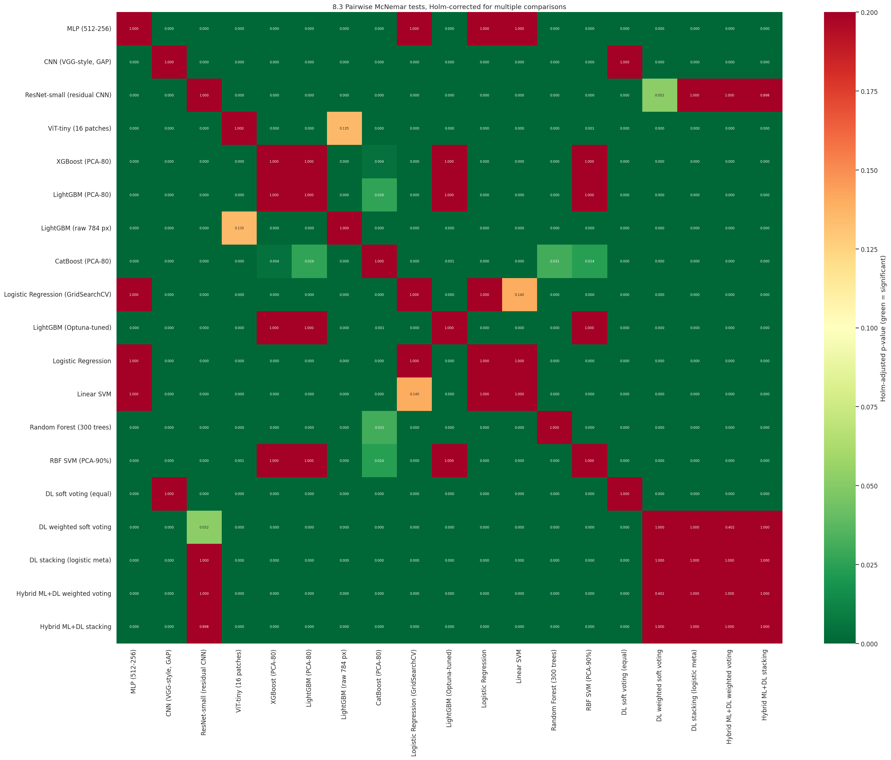
    


    147 of 171 pairwise differences survive the Holm correction at alpha=0.05.
    


<style type="text/css">
</style>
<table id="T_0546a" class="dataframe">
  <thead>
    <tr>
      <th id="T_0546a_level0_col0" class="col_heading level0 col0" >model A</th>
      <th id="T_0546a_level0_col1" class="col_heading level0 col1" >model B</th>
      <th id="T_0546a_level0_col2" class="col_heading level0 col2" >acc A</th>
      <th id="T_0546a_level0_col3" class="col_heading level0 col3" >acc B</th>
      <th id="T_0546a_level0_col4" class="col_heading level0 col4" >delta (pp)</th>
      <th id="T_0546a_level0_col5" class="col_heading level0 col5" >p raw</th>
      <th id="T_0546a_level0_col6" class="col_heading level0 col6" >p Holm-adjusted</th>
      <th id="T_0546a_level0_col7" class="col_heading level0 col7" >significant</th>
    </tr>
  </thead>
  <tbody>
    <tr>
      <td id="T_0546a_row0_col0" class="data row0 col0" >MLP (512-256)</td>
      <td id="T_0546a_row0_col1" class="data row0 col1" >Hybrid ML+DL stacking</td>
      <td id="T_0546a_row0_col2" class="data row0 col2" >0.8355</td>
      <td id="T_0546a_row0_col3" class="data row0 col3" >0.9514</td>
      <td id="T_0546a_row0_col4" class="data row0 col4" >+11.59</td>
      <td id="T_0546a_row0_col5" class="data row0 col5" >1.12e-247</td>
      <td id="T_0546a_row0_col6" class="data row0 col6" >1.91e-245</td>
      <td id="T_0546a_row0_col7" class="data row0 col7" >True</td>
    </tr>
    <tr>
      <td id="T_0546a_row1_col0" class="data row1 col0" >ResNet-small (residual CNN)</td>
      <td id="T_0546a_row1_col1" class="data row1 col1" >Linear SVM</td>
      <td id="T_0546a_row1_col2" class="data row1 col2" >0.9538</td>
      <td id="T_0546a_row1_col3" class="data row1 col3" >0.8344</td>
      <td id="T_0546a_row1_col4" class="data row1 col4" >-11.94</td>
      <td id="T_0546a_row1_col5" class="data row1 col5" >2.06e-247</td>
      <td id="T_0546a_row1_col6" class="data row1 col6" >3.50e-245</td>
      <td id="T_0546a_row1_col7" class="data row1 col7" >True</td>
    </tr>
    <tr>
      <td id="T_0546a_row2_col0" class="data row2 col0" >MLP (512-256)</td>
      <td id="T_0546a_row2_col1" class="data row2 col1" >DL stacking (logistic meta)</td>
      <td id="T_0546a_row2_col2" class="data row2 col2" >0.8355</td>
      <td id="T_0546a_row2_col3" class="data row2 col3" >0.9518</td>
      <td id="T_0546a_row2_col4" class="data row2 col4" >+11.63</td>
      <td id="T_0546a_row2_col5" class="data row2 col5" >3.41e-247</td>
      <td id="T_0546a_row2_col6" class="data row2 col6" >5.76e-245</td>
      <td id="T_0546a_row2_col7" class="data row2 col7" >True</td>
    </tr>
    <tr>
      <td id="T_0546a_row3_col0" class="data row3 col0" >Linear SVM</td>
      <td id="T_0546a_row3_col1" class="data row3 col1" >DL stacking (logistic meta)</td>
      <td id="T_0546a_row3_col2" class="data row3 col2" >0.8344</td>
      <td id="T_0546a_row3_col3" class="data row3 col3" >0.9518</td>
      <td id="T_0546a_row3_col4" class="data row3 col4" >+11.74</td>
      <td id="T_0546a_row3_col5" class="data row3 col5" >4.59e-247</td>
      <td id="T_0546a_row3_col6" class="data row3 col6" >7.71e-245</td>
      <td id="T_0546a_row3_col7" class="data row3 col7" >True</td>
    </tr>
    <tr>
      <td id="T_0546a_row4_col0" class="data row4 col0" >Linear SVM</td>
      <td id="T_0546a_row4_col1" class="data row4 col1" >Hybrid ML+DL stacking</td>
      <td id="T_0546a_row4_col2" class="data row4 col2" >0.8344</td>
      <td id="T_0546a_row4_col3" class="data row4 col3" >0.9514</td>
      <td id="T_0546a_row4_col4" class="data row4 col4" >+11.70</td>
      <td id="T_0546a_row4_col5" class="data row4 col5" >1.63e-246</td>
      <td id="T_0546a_row4_col6" class="data row4 col6" >2.72e-244</td>
      <td id="T_0546a_row4_col7" class="data row4 col7" >True</td>
    </tr>
    <tr>
      <td id="T_0546a_row5_col0" class="data row5 col0" >Linear SVM</td>
      <td id="T_0546a_row5_col1" class="data row5 col1" >Hybrid ML+DL weighted voting</td>
      <td id="T_0546a_row5_col2" class="data row5 col2" >0.8344</td>
      <td id="T_0546a_row5_col3" class="data row5 col3" >0.9520</td>
      <td id="T_0546a_row5_col4" class="data row5 col4" >+11.76</td>
      <td id="T_0546a_row5_col5" class="data row5 col5" >4.13e-246</td>
      <td id="T_0546a_row5_col6" class="data row5 col6" >6.86e-244</td>
      <td id="T_0546a_row5_col7" class="data row5 col7" >True</td>
    </tr>
    <tr>
      <td id="T_0546a_row6_col0" class="data row6 col0" >MLP (512-256)</td>
      <td id="T_0546a_row6_col1" class="data row6 col1" >Hybrid ML+DL weighted voting</td>
      <td id="T_0546a_row6_col2" class="data row6 col2" >0.8355</td>
      <td id="T_0546a_row6_col3" class="data row6 col3" >0.9520</td>
      <td id="T_0546a_row6_col4" class="data row6 col4" >+11.65</td>
      <td id="T_0546a_row6_col5" class="data row6 col5" >2.81e-242</td>
      <td id="T_0546a_row6_col6" class="data row6 col6" >4.63e-240</td>
      <td id="T_0546a_row6_col7" class="data row6 col7" >True</td>
    </tr>
    <tr>
      <td id="T_0546a_row7_col0" class="data row7 col0" >MLP (512-256)</td>
      <td id="T_0546a_row7_col1" class="data row7 col1" >ResNet-small (residual CNN)</td>
      <td id="T_0546a_row7_col2" class="data row7 col2" >0.8355</td>
      <td id="T_0546a_row7_col3" class="data row7 col3" >0.9538</td>
      <td id="T_0546a_row7_col4" class="data row7 col4" >+11.83</td>
      <td id="T_0546a_row7_col5" class="data row7 col5" >2.15e-240</td>
      <td id="T_0546a_row7_col6" class="data row7 col6" >3.52e-238</td>
      <td id="T_0546a_row7_col7" class="data row7 col7" >True</td>
    </tr>
    <tr>
      <td id="T_0546a_row8_col0" class="data row8 col0" >Linear SVM</td>
      <td id="T_0546a_row8_col1" class="data row8 col1" >DL weighted soft voting</td>
      <td id="T_0546a_row8_col2" class="data row8 col2" >0.8344</td>
      <td id="T_0546a_row8_col3" class="data row8 col3" >0.9507</td>
      <td id="T_0546a_row8_col4" class="data row8 col4" >+11.63</td>
      <td id="T_0546a_row8_col5" class="data row8 col5" >5.39e-238</td>
      <td id="T_0546a_row8_col6" class="data row8 col6" >8.78e-236</td>
      <td id="T_0546a_row8_col7" class="data row8 col7" >True</td>
    </tr>
    <tr>
      <td id="T_0546a_row9_col0" class="data row9 col0" >ResNet-small (residual CNN)</td>
      <td id="T_0546a_row9_col1" class="data row9 col1" >Logistic Regression</td>
      <td id="T_0546a_row9_col2" class="data row9 col2" >0.9538</td>
      <td id="T_0546a_row9_col3" class="data row9 col3" >0.8379</td>
      <td id="T_0546a_row9_col4" class="data row9 col4" >-11.59</td>
      <td id="T_0546a_row9_col5" class="data row9 col5" >3.03e-234</td>
      <td id="T_0546a_row9_col6" class="data row9 col6" >4.91e-232</td>
      <td id="T_0546a_row9_col7" class="data row9 col7" >True</td>
    </tr>
    <tr>
      <td id="T_0546a_row10_col0" class="data row10 col0" >Logistic Regression</td>
      <td id="T_0546a_row10_col1" class="data row10 col1" >DL stacking (logistic meta)</td>
      <td id="T_0546a_row10_col2" class="data row10 col2" >0.8379</td>
      <td id="T_0546a_row10_col3" class="data row10 col3" >0.9518</td>
      <td id="T_0546a_row10_col4" class="data row10 col4" >+11.39</td>
      <td id="T_0546a_row10_col5" class="data row10 col5" >9.78e-233</td>
      <td id="T_0546a_row10_col6" class="data row10 col6" >1.57e-230</td>
      <td id="T_0546a_row10_col7" class="data row10 col7" >True</td>
    </tr>
    <tr>
      <td id="T_0546a_row11_col0" class="data row11 col0" >Logistic Regression</td>
      <td id="T_0546a_row11_col1" class="data row11 col1" >Hybrid ML+DL stacking</td>
      <td id="T_0546a_row11_col2" class="data row11 col2" >0.8379</td>
      <td id="T_0546a_row11_col3" class="data row11 col3" >0.9514</td>
      <td id="T_0546a_row11_col4" class="data row11 col4" >+11.35</td>
      <td id="T_0546a_row11_col5" class="data row11 col5" >1.26e-232</td>
      <td id="T_0546a_row11_col6" class="data row11 col6" >2.01e-230</td>
      <td id="T_0546a_row11_col7" class="data row11 col7" >True</td>
    </tr>
    <tr>
      <td id="T_0546a_row12_col0" class="data row12 col0" >MLP (512-256)</td>
      <td id="T_0546a_row12_col1" class="data row12 col1" >DL weighted soft voting</td>
      <td id="T_0546a_row12_col2" class="data row12 col2" >0.8355</td>
      <td id="T_0546a_row12_col3" class="data row12 col3" >0.9507</td>
      <td id="T_0546a_row12_col4" class="data row12 col4" >+11.52</td>
      <td id="T_0546a_row12_col5" class="data row12 col5" >5.19e-232</td>
      <td id="T_0546a_row12_col6" class="data row12 col6" >8.25e-230</td>
      <td id="T_0546a_row12_col7" class="data row12 col7" >True</td>
    </tr>
    <tr>
      <td id="T_0546a_row13_col0" class="data row13 col0" >MLP (512-256)</td>
      <td id="T_0546a_row13_col1" class="data row13 col1" >DL soft voting (equal)</td>
      <td id="T_0546a_row13_col2" class="data row13 col2" >0.8355</td>
      <td id="T_0546a_row13_col3" class="data row13 col3" >0.9438</td>
      <td id="T_0546a_row13_col4" class="data row13 col4" >+10.83</td>
      <td id="T_0546a_row13_col5" class="data row13 col5" >8.89e-232</td>
      <td id="T_0546a_row13_col6" class="data row13 col6" >1.40e-229</td>
      <td id="T_0546a_row13_col7" class="data row13 col7" >True</td>
    </tr>
    <tr>
      <td id="T_0546a_row14_col0" class="data row14 col0" >Logistic Regression</td>
      <td id="T_0546a_row14_col1" class="data row14 col1" >Hybrid ML+DL weighted voting</td>
      <td id="T_0546a_row14_col2" class="data row14 col2" >0.8379</td>
      <td id="T_0546a_row14_col3" class="data row14 col3" >0.9520</td>
      <td id="T_0546a_row14_col4" class="data row14 col4" >+11.41</td>
      <td id="T_0546a_row14_col5" class="data row14 col5" >1.98e-231</td>
      <td id="T_0546a_row14_col6" class="data row14 col6" >3.10e-229</td>
      <td id="T_0546a_row14_col7" class="data row14 col7" >True</td>
    </tr>
  </tbody>
</table>


    
    Pairs that are statistically INDISTINGUISHABLE (largest adjusted p-values):
    


<style type="text/css">
</style>
<table id="T_7a0a6" class="dataframe">
  <thead>
    <tr>
      <th id="T_7a0a6_level0_col0" class="col_heading level0 col0" >model A</th>
      <th id="T_7a0a6_level0_col1" class="col_heading level0 col1" >model B</th>
      <th id="T_7a0a6_level0_col2" class="col_heading level0 col2" >acc A</th>
      <th id="T_7a0a6_level0_col3" class="col_heading level0 col3" >acc B</th>
      <th id="T_7a0a6_level0_col4" class="col_heading level0 col4" >delta (pp)</th>
      <th id="T_7a0a6_level0_col5" class="col_heading level0 col5" >p raw</th>
      <th id="T_7a0a6_level0_col6" class="col_heading level0 col6" >p Holm-adjusted</th>
      <th id="T_7a0a6_level0_col7" class="col_heading level0 col7" >significant</th>
    </tr>
  </thead>
  <tbody>
    <tr>
      <td id="T_7a0a6_row0_col0" class="data row0 col0" >XGBoost (PCA-80)</td>
      <td id="T_7a0a6_row0_col1" class="data row0 col1" >LightGBM (PCA-80)</td>
      <td id="T_7a0a6_row0_col2" class="data row0 col2" >0.8785</td>
      <td id="T_7a0a6_row0_col3" class="data row0 col3" >0.8775</td>
      <td id="T_7a0a6_row0_col4" class="data row0 col4" >-0.10</td>
      <td id="T_7a0a6_row0_col5" class="data row0 col5" >5.96e-01</td>
      <td id="T_7a0a6_row0_col6" class="data row0 col6" >1.00e+00</td>
      <td id="T_7a0a6_row0_col7" class="data row0 col7" >False</td>
    </tr>
    <tr>
      <td id="T_7a0a6_row1_col0" class="data row1 col0" >Logistic Regression</td>
      <td id="T_7a0a6_row1_col1" class="data row1 col1" >Linear SVM</td>
      <td id="T_7a0a6_row1_col2" class="data row1 col2" >0.8379</td>
      <td id="T_7a0a6_row1_col3" class="data row1 col3" >0.8344</td>
      <td id="T_7a0a6_row1_col4" class="data row1 col4" >-0.35</td>
      <td id="T_7a0a6_row1_col5" class="data row1 col5" >1.47e-01</td>
      <td id="T_7a0a6_row1_col6" class="data row1 col6" >1.00e+00</td>
      <td id="T_7a0a6_row1_col7" class="data row1 col7" >False</td>
    </tr>
    <tr>
      <td id="T_7a0a6_row2_col0" class="data row2 col0" >LightGBM (Optuna-tuned)</td>
      <td id="T_7a0a6_row2_col1" class="data row2 col1" >RBF SVM (PCA-90%)</td>
      <td id="T_7a0a6_row2_col2" class="data row2 col2" >0.8798</td>
      <td id="T_7a0a6_row2_col3" class="data row2 col3" >0.8795</td>
      <td id="T_7a0a6_row2_col4" class="data row2 col4" >-0.03</td>
      <td id="T_7a0a6_row2_col5" class="data row2 col5" >9.39e-01</td>
      <td id="T_7a0a6_row2_col6" class="data row2 col6" >1.00e+00</td>
      <td id="T_7a0a6_row2_col7" class="data row2 col7" >False</td>
    </tr>
    <tr>
      <td id="T_7a0a6_row3_col0" class="data row3 col0" >DL weighted soft voting</td>
      <td id="T_7a0a6_row3_col1" class="data row3 col1" >DL stacking (logistic meta)</td>
      <td id="T_7a0a6_row3_col2" class="data row3 col2" >0.9507</td>
      <td id="T_7a0a6_row3_col3" class="data row3 col3" >0.9518</td>
      <td id="T_7a0a6_row3_col4" class="data row3 col4" >+0.11</td>
      <td id="T_7a0a6_row3_col5" class="data row3 col5" >2.42e-01</td>
      <td id="T_7a0a6_row3_col6" class="data row3 col6" >1.00e+00</td>
      <td id="T_7a0a6_row3_col7" class="data row3 col7" >False</td>
    </tr>
    <tr>
      <td id="T_7a0a6_row4_col0" class="data row4 col0" >DL weighted soft voting</td>
      <td id="T_7a0a6_row4_col1" class="data row4 col1" >Hybrid ML+DL stacking</td>
      <td id="T_7a0a6_row4_col2" class="data row4 col2" >0.9507</td>
      <td id="T_7a0a6_row4_col3" class="data row4 col3" >0.9514</td>
      <td id="T_7a0a6_row4_col4" class="data row4 col4" >+0.07</td>
      <td id="T_7a0a6_row4_col5" class="data row4 col5" >5.38e-01</td>
      <td id="T_7a0a6_row4_col6" class="data row4 col6" >1.00e+00</td>
      <td id="T_7a0a6_row4_col7" class="data row4 col7" >False</td>
    </tr>
    <tr>
      <td id="T_7a0a6_row5_col0" class="data row5 col0" >DL stacking (logistic meta)</td>
      <td id="T_7a0a6_row5_col1" class="data row5 col1" >Hybrid ML+DL weighted voting</td>
      <td id="T_7a0a6_row5_col2" class="data row5 col2" >0.9518</td>
      <td id="T_7a0a6_row5_col3" class="data row5 col3" >0.9520</td>
      <td id="T_7a0a6_row5_col4" class="data row5 col4" >+0.02</td>
      <td id="T_7a0a6_row5_col5" class="data row5 col5" >8.96e-01</td>
      <td id="T_7a0a6_row5_col6" class="data row5 col6" >1.00e+00</td>
      <td id="T_7a0a6_row5_col7" class="data row5 col7" >False</td>
    </tr>
    <tr>
      <td id="T_7a0a6_row6_col0" class="data row6 col0" >DL stacking (logistic meta)</td>
      <td id="T_7a0a6_row6_col1" class="data row6 col1" >Hybrid ML+DL stacking</td>
      <td id="T_7a0a6_row6_col2" class="data row6 col2" >0.9518</td>
      <td id="T_7a0a6_row6_col3" class="data row6 col3" >0.9514</td>
      <td id="T_7a0a6_row6_col4" class="data row6 col4" >-0.04</td>
      <td id="T_7a0a6_row6_col5" class="data row6 col5" >6.36e-01</td>
      <td id="T_7a0a6_row6_col6" class="data row6 col6" >1.00e+00</td>
      <td id="T_7a0a6_row6_col7" class="data row6 col7" >False</td>
    </tr>
    <tr>
      <td id="T_7a0a6_row7_col0" class="data row7 col0" >Hybrid ML+DL weighted voting</td>
      <td id="T_7a0a6_row7_col1" class="data row7 col1" >Hybrid ML+DL stacking</td>
      <td id="T_7a0a6_row7_col2" class="data row7 col2" >0.9520</td>
      <td id="T_7a0a6_row7_col3" class="data row7 col3" >0.9514</td>
      <td id="T_7a0a6_row7_col4" class="data row7 col4" >-0.06</td>
      <td id="T_7a0a6_row7_col5" class="data row7 col5" >5.76e-01</td>
      <td id="T_7a0a6_row7_col6" class="data row7 col6" >1.00e+00</td>
      <td id="T_7a0a6_row7_col7" class="data row7 col7" >False</td>
    </tr>
  </tbody>
</table>


```python
# --- 8.4 Paired bootstrap confidence intervals --------------------------------------------------------------------
def paired_bootstrap(
    correct: np.ndarray, names: Sequence[str], n_iter: int = 2_000, alpha: float = 0.05, seed: int = 42
) -> Tuple[pd.DataFrame, np.ndarray]:
    """Bootstrap the test set, keeping all models paired on the same resampled images.

    Pairing matters: models are evaluated on identical data, so the *difference* has much lower variance than the
    two marginal accuracies suggest. Returns the per-model CI table and the `(n_iter, M)` matrix of bootstrap
    accuracies (re-used below for the difference CI).
    """
    rng = np.random.default_rng(seed)
    n = correct.shape[1]
    boot = np.empty((n_iter, correct.shape[0]), dtype=np.float64)
    for b in range(n_iter):
        idx = rng.integers(0, n, size=n)
        boot[b] = correct[:, idx].mean(axis=1)
    lo, hi = np.quantile(boot, [alpha / 2, 1 - alpha / 2], axis=0)
    df = pd.DataFrame({
        "model": list(names),
        "accuracy": correct.mean(axis=1),
        "bootstrap CI low": lo,
        "bootstrap CI high": hi,
        "bootstrap std (pp)": 100 * boot.std(axis=0),
    }).sort_values("accuracy", ascending=False).reset_index(drop=True)
    return df, boot


boot_df, boot_matrix = paired_bootstrap(
    CORRECT, MODEL_NAMES, n_iter=cfgx.bootstrap_iters, alpha=cfgx.alpha, seed=cfg.seed
)
display(boot_df.style.hide(axis="index").format({
    "accuracy": "{:.4f}", "bootstrap CI low": "{:.4f}", "bootstrap CI high": "{:.4f}",
    "bootstrap std (pp)": "{:.2f}"}))


def bootstrap_difference(
    boot: np.ndarray, names: Sequence[str], name_a: str, name_b: str, alpha: float = 0.05
) -> Dict[str, float]:
    """Percentile CI of `acc(B) - acc(A)` from the *paired* bootstrap replicates."""
    i, j = list(names).index(name_a), list(names).index(name_b)
    diff = boot[:, j] - boot[:, i]
    lo, hi = np.quantile(diff, [alpha / 2, 1 - alpha / 2])
    return {
        "comparison": f"{name_b} - {name_a}",
        "mean delta (pp)": float(100 * diff.mean()),
        "CI low (pp)": float(100 * lo),
        "CI high (pp)": float(100 * hi),
        "P(B better than A)": float((diff > 0).mean()),
    }


best_single_stat = max(
    [n for n in MODEL_NAMES if "voting" not in n and "stacking" not in n],
    key=lambda n: CORRECT[MODEL_NAMES.index(n)].mean(),
)
comparisons = [n for n in MODEL_NAMES if n != best_single_stat and ("voting" in n or "stacking" in n)]
if comparisons:
    diff_df = pd.DataFrame([
        bootstrap_difference(boot_matrix, MODEL_NAMES, best_single_stat, c, cfgx.alpha) for c in comparisons
    ]).sort_values("mean delta (pp)", ascending=False)
    display(diff_df.style.hide(axis="index").format({
        "mean delta (pp)": "{:+.2f}", "CI low (pp)": "{:+.2f}", "CI high (pp)": "{:+.2f}",
        "P(B better than A)": "{:.3f}"}))

    fig, ax = plt.subplots(figsize=(9, 0.5 * len(diff_df) + 2))
    ax.errorbar(
        diff_df["mean delta (pp)"], diff_df["comparison"],
        xerr=[diff_df["mean delta (pp)"] - diff_df["CI low (pp)"],
              diff_df["CI high (pp)"] - diff_df["mean delta (pp)"]],
        fmt="o", capsize=4, color="#55A868", ecolor="#4C72B0",
    )
    ax.axvline(0, ls="--", c="red", lw=1.2)
    ax.set_xlabel("accuracy gain over the best single model (pp, 95% paired-bootstrap CI)")
    ax.set_title("8.4 Ensemble gains - intervals that exclude 0 are real gains")
    plt.show()
```


<style type="text/css">
</style>
<table id="T_e72d7" class="dataframe">
  <thead>
    <tr>
      <th id="T_e72d7_level0_col0" class="col_heading level0 col0" >model</th>
      <th id="T_e72d7_level0_col1" class="col_heading level0 col1" >accuracy</th>
      <th id="T_e72d7_level0_col2" class="col_heading level0 col2" >bootstrap CI low</th>
      <th id="T_e72d7_level0_col3" class="col_heading level0 col3" >bootstrap CI high</th>
      <th id="T_e72d7_level0_col4" class="col_heading level0 col4" >bootstrap std (pp)</th>
    </tr>
  </thead>
  <tbody>
    <tr>
      <td id="T_e72d7_row0_col0" class="data row0 col0" >ResNet-small (residual CNN)</td>
      <td id="T_e72d7_row0_col1" class="data row0 col1" >0.9538</td>
      <td id="T_e72d7_row0_col2" class="data row0 col2" >0.9496</td>
      <td id="T_e72d7_row0_col3" class="data row0 col3" >0.9579</td>
      <td id="T_e72d7_row0_col4" class="data row0 col4" >0.21</td>
    </tr>
    <tr>
      <td id="T_e72d7_row1_col0" class="data row1 col0" >Hybrid ML+DL weighted voting</td>
      <td id="T_e72d7_row1_col1" class="data row1 col1" >0.9520</td>
      <td id="T_e72d7_row1_col2" class="data row1 col2" >0.9477</td>
      <td id="T_e72d7_row1_col3" class="data row1 col3" >0.9562</td>
      <td id="T_e72d7_row1_col4" class="data row1 col4" >0.22</td>
    </tr>
    <tr>
      <td id="T_e72d7_row2_col0" class="data row2 col0" >DL stacking (logistic meta)</td>
      <td id="T_e72d7_row2_col1" class="data row2 col1" >0.9518</td>
      <td id="T_e72d7_row2_col2" class="data row2 col2" >0.9474</td>
      <td id="T_e72d7_row2_col3" class="data row2 col3" >0.9561</td>
      <td id="T_e72d7_row2_col4" class="data row2 col4" >0.22</td>
    </tr>
    <tr>
      <td id="T_e72d7_row3_col0" class="data row3 col0" >Hybrid ML+DL stacking</td>
      <td id="T_e72d7_row3_col1" class="data row3 col1" >0.9514</td>
      <td id="T_e72d7_row3_col2" class="data row3 col2" >0.9469</td>
      <td id="T_e72d7_row3_col3" class="data row3 col3" >0.9555</td>
      <td id="T_e72d7_row3_col4" class="data row3 col4" >0.22</td>
    </tr>
    <tr>
      <td id="T_e72d7_row4_col0" class="data row4 col0" >DL weighted soft voting</td>
      <td id="T_e72d7_row4_col1" class="data row4 col1" >0.9507</td>
      <td id="T_e72d7_row4_col2" class="data row4 col2" >0.9463</td>
      <td id="T_e72d7_row4_col3" class="data row4 col3" >0.9550</td>
      <td id="T_e72d7_row4_col4" class="data row4 col4" >0.22</td>
    </tr>
    <tr>
      <td id="T_e72d7_row5_col0" class="data row5 col0" >DL soft voting (equal)</td>
      <td id="T_e72d7_row5_col1" class="data row5 col1" >0.9438</td>
      <td id="T_e72d7_row5_col2" class="data row5 col2" >0.9390</td>
      <td id="T_e72d7_row5_col3" class="data row5 col3" >0.9483</td>
      <td id="T_e72d7_row5_col4" class="data row5 col4" >0.24</td>
    </tr>
    <tr>
      <td id="T_e72d7_row6_col0" class="data row6 col0" >CNN (VGG-style, GAP)</td>
      <td id="T_e72d7_row6_col1" class="data row6 col1" >0.9414</td>
      <td id="T_e72d7_row6_col2" class="data row6 col2" >0.9367</td>
      <td id="T_e72d7_row6_col3" class="data row6 col3" >0.9459</td>
      <td id="T_e72d7_row6_col4" class="data row6 col4" >0.24</td>
    </tr>
    <tr>
      <td id="T_e72d7_row7_col0" class="data row7 col0" >LightGBM (raw 784 px)</td>
      <td id="T_e72d7_row7_col1" class="data row7 col1" >0.8995</td>
      <td id="T_e72d7_row7_col2" class="data row7 col2" >0.8933</td>
      <td id="T_e72d7_row7_col3" class="data row7 col3" >0.9056</td>
      <td id="T_e72d7_row7_col4" class="data row7 col4" >0.31</td>
    </tr>
    <tr>
      <td id="T_e72d7_row8_col0" class="data row8 col0" >ViT-tiny (16 patches)</td>
      <td id="T_e72d7_row8_col1" class="data row8 col1" >0.8920</td>
      <td id="T_e72d7_row8_col2" class="data row8 col2" >0.8857</td>
      <td id="T_e72d7_row8_col3" class="data row8 col3" >0.8980</td>
      <td id="T_e72d7_row8_col4" class="data row8 col4" >0.31</td>
    </tr>
    <tr>
      <td id="T_e72d7_row9_col0" class="data row9 col0" >LightGBM (Optuna-tuned)</td>
      <td id="T_e72d7_row9_col1" class="data row9 col1" >0.8798</td>
      <td id="T_e72d7_row9_col2" class="data row9 col2" >0.8734</td>
      <td id="T_e72d7_row9_col3" class="data row9 col3" >0.8864</td>
      <td id="T_e72d7_row9_col4" class="data row9 col4" >0.33</td>
    </tr>
    <tr>
      <td id="T_e72d7_row10_col0" class="data row10 col0" >RBF SVM (PCA-90%)</td>
      <td id="T_e72d7_row10_col1" class="data row10 col1" >0.8795</td>
      <td id="T_e72d7_row10_col2" class="data row10 col2" >0.8729</td>
      <td id="T_e72d7_row10_col3" class="data row10 col3" >0.8858</td>
      <td id="T_e72d7_row10_col4" class="data row10 col4" >0.33</td>
    </tr>
    <tr>
      <td id="T_e72d7_row11_col0" class="data row11 col0" >XGBoost (PCA-80)</td>
      <td id="T_e72d7_row11_col1" class="data row11 col1" >0.8785</td>
      <td id="T_e72d7_row11_col2" class="data row11 col2" >0.8720</td>
      <td id="T_e72d7_row11_col3" class="data row11 col3" >0.8849</td>
      <td id="T_e72d7_row11_col4" class="data row11 col4" >0.33</td>
    </tr>
    <tr>
      <td id="T_e72d7_row12_col0" class="data row12 col0" >LightGBM (PCA-80)</td>
      <td id="T_e72d7_row12_col1" class="data row12 col1" >0.8775</td>
      <td id="T_e72d7_row12_col2" class="data row12 col2" >0.8712</td>
      <td id="T_e72d7_row12_col3" class="data row12 col3" >0.8838</td>
      <td id="T_e72d7_row12_col4" class="data row12 col4" >0.33</td>
    </tr>
    <tr>
      <td id="T_e72d7_row13_col0" class="data row13 col0" >CatBoost (PCA-80)</td>
      <td id="T_e72d7_row13_col1" class="data row13 col1" >0.8704</td>
      <td id="T_e72d7_row13_col2" class="data row13 col2" >0.8636</td>
      <td id="T_e72d7_row13_col3" class="data row13 col3" >0.8772</td>
      <td id="T_e72d7_row13_col4" class="data row13 col4" >0.34</td>
    </tr>
    <tr>
      <td id="T_e72d7_row14_col0" class="data row14 col0" >Random Forest (300 trees)</td>
      <td id="T_e72d7_row14_col1" class="data row14 col1" >0.8611</td>
      <td id="T_e72d7_row14_col2" class="data row14 col2" >0.8542</td>
      <td id="T_e72d7_row14_col3" class="data row14 col3" >0.8678</td>
      <td id="T_e72d7_row14_col4" class="data row14 col4" >0.35</td>
    </tr>
    <tr>
      <td id="T_e72d7_row15_col0" class="data row15 col0" >Logistic Regression (GridSearchCV)</td>
      <td id="T_e72d7_row15_col1" class="data row15 col1" >0.8425</td>
      <td id="T_e72d7_row15_col2" class="data row15 col2" >0.8353</td>
      <td id="T_e72d7_row15_col3" class="data row15 col3" >0.8497</td>
      <td id="T_e72d7_row15_col4" class="data row15 col4" >0.37</td>
    </tr>
    <tr>
      <td id="T_e72d7_row16_col0" class="data row16 col0" >Logistic Regression</td>
      <td id="T_e72d7_row16_col1" class="data row16 col1" >0.8379</td>
      <td id="T_e72d7_row16_col2" class="data row16 col2" >0.8303</td>
      <td id="T_e72d7_row16_col3" class="data row16 col3" >0.8450</td>
      <td id="T_e72d7_row16_col4" class="data row16 col4" >0.37</td>
    </tr>
    <tr>
      <td id="T_e72d7_row17_col0" class="data row17 col0" >MLP (512-256)</td>
      <td id="T_e72d7_row17_col1" class="data row17 col1" >0.8355</td>
      <td id="T_e72d7_row17_col2" class="data row17 col2" >0.8280</td>
      <td id="T_e72d7_row17_col3" class="data row17 col3" >0.8426</td>
      <td id="T_e72d7_row17_col4" class="data row17 col4" >0.37</td>
    </tr>
    <tr>
      <td id="T_e72d7_row18_col0" class="data row18 col0" >Linear SVM</td>
      <td id="T_e72d7_row18_col1" class="data row18 col1" >0.8344</td>
      <td id="T_e72d7_row18_col2" class="data row18 col2" >0.8270</td>
      <td id="T_e72d7_row18_col3" class="data row18 col3" >0.8418</td>
      <td id="T_e72d7_row18_col4" class="data row18 col4" >0.38</td>
    </tr>
  </tbody>
</table>


<style type="text/css">
</style>
<table id="T_c9102" class="dataframe">
  <thead>
    <tr>
      <th id="T_c9102_level0_col0" class="col_heading level0 col0" >comparison</th>
      <th id="T_c9102_level0_col1" class="col_heading level0 col1" >mean delta (pp)</th>
      <th id="T_c9102_level0_col2" class="col_heading level0 col2" >CI low (pp)</th>
      <th id="T_c9102_level0_col3" class="col_heading level0 col3" >CI high (pp)</th>
      <th id="T_c9102_level0_col4" class="col_heading level0 col4" >P(B better than A)</th>
    </tr>
  </thead>
  <tbody>
    <tr>
      <td id="T_c9102_row0_col0" class="data row0 col0" >Hybrid ML+DL weighted voting - ResNet-small (residual CNN)</td>
      <td id="T_c9102_row0_col1" class="data row0 col1" >-0.18</td>
      <td id="T_c9102_row0_col2" class="data row0 col2" >-0.37</td>
      <td id="T_c9102_row0_col3" class="data row0 col3" >+0.00</td>
      <td id="T_c9102_row0_col4" class="data row0 col4" >0.019</td>
    </tr>
    <tr>
      <td id="T_c9102_row1_col0" class="data row1 col0" >DL stacking (logistic meta) - ResNet-small (residual CNN)</td>
      <td id="T_c9102_row1_col1" class="data row1 col1" >-0.20</td>
      <td id="T_c9102_row1_col2" class="data row1 col2" >-0.40</td>
      <td id="T_c9102_row1_col3" class="data row1 col3" >+0.01</td>
      <td id="T_c9102_row1_col4" class="data row1 col4" >0.026</td>
    </tr>
    <tr>
      <td id="T_c9102_row2_col0" class="data row2 col0" >Hybrid ML+DL stacking - ResNet-small (residual CNN)</td>
      <td id="T_c9102_row2_col1" class="data row2 col1" >-0.24</td>
      <td id="T_c9102_row2_col2" class="data row2 col2" >-0.47</td>
      <td id="T_c9102_row2_col3" class="data row2 col3" >-0.02</td>
      <td id="T_c9102_row2_col4" class="data row2 col4" >0.012</td>
    </tr>
    <tr>
      <td id="T_c9102_row3_col0" class="data row3 col0" >DL weighted soft voting - ResNet-small (residual CNN)</td>
      <td id="T_c9102_row3_col1" class="data row3 col1" >-0.31</td>
      <td id="T_c9102_row3_col2" class="data row3 col2" >-0.51</td>
      <td id="T_c9102_row3_col3" class="data row3 col3" >-0.11</td>
      <td id="T_c9102_row3_col4" class="data row3 col4" >0.000</td>
    </tr>
    <tr>
      <td id="T_c9102_row4_col0" class="data row4 col0" >DL soft voting (equal) - ResNet-small (residual CNN)</td>
      <td id="T_c9102_row4_col1" class="data row4 col1" >-1.00</td>
      <td id="T_c9102_row4_col2" class="data row4 col2" >-1.32</td>
      <td id="T_c9102_row4_col3" class="data row4 col3" >-0.69</td>
      <td id="T_c9102_row4_col4" class="data row4 col4" >0.000</td>
    </tr>
  </tbody>
</table>


    
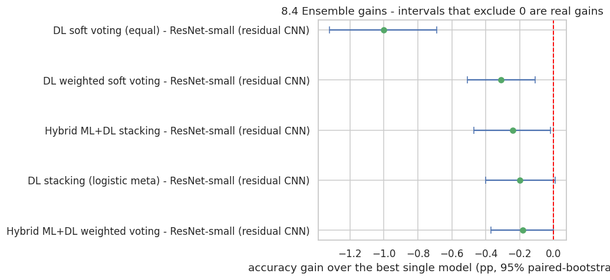
    


```python
# --- 8.5 Cochran's Q: are all models equivalent? -------------------------------------------------------------------
def cochrans_q(correct: np.ndarray) -> Dict[str, float]:
    """Cochran's Q omnibus test for k paired binary classifiers.

    H0: all k models have the same success probability. Q is chi-square distributed with k-1 degrees of freedom.
    It is the natural generalisation of McNemar (which is the k = 2 case) and is the correct *first* test to run
    before looking at any individual pair.
    """
    k, n = correct.shape
    col_totals = correct.sum(axis=1).astype(float)      # successes per model
    row_totals = correct.sum(axis=0).astype(float)      # models correct per image
    total = col_totals.sum()
    numerator = (k - 1) * (k * (col_totals ** 2).sum() - total ** 2)
    denominator = k * total - (row_totals ** 2).sum()
    q = float(numerator / denominator) if denominator else 0.0
    p = float(sp_stats.chi2.sf(q, df=k - 1))
    return {"k models": k, "n images": n, "Cochran Q": round(q, 2), "df": k - 1, "p-value": p}


q_result = cochrans_q(CORRECT)
display(pd.Series(q_result, name="Cochran's Q (all models)").to_frame())
print("Interpretation:", "the models are NOT all equivalent (reject H0)"
      if q_result["p-value"] < cfgx.alpha else "no evidence that the models differ")

# The same test restricted to the top-5 models: are the leaders distinguishable from each other?
top5 = accuracy_ci.head(5)["model"].tolist()
q_top5 = cochrans_q(np.stack([ALL_PREDICTIONS[n] == y_test_np for n in top5]))
display(pd.Series(q_top5, name=f"Cochran's Q (top 5: {', '.join(top5)})").to_frame())
print("Interpretation:", "even the top-5 differ significantly" if q_top5["p-value"] < cfgx.alpha
      else "the top-5 models are statistically indistinguishable from one another")
```


  <div id="df-ecc2f079-6f5c-499f-8d10-55ad0904ae7b" class="colab-df-container">
    <div>
<style scoped>
    .dataframe tbody tr th:only-of-type {
        vertical-align: middle;
    }

    .dataframe tbody tr th {
        vertical-align: top;
    }

    .dataframe thead th {
        text-align: right;
    }
</style>
<table border="1" class="dataframe">
  <thead>
    <tr style="text-align: right;">
      <th></th>
      <th>Cochran's Q (all models)</th>
    </tr>
  </thead>
  <tbody>
    <tr>
      <th>k models</th>
      <td>19.00</td>
    </tr>
    <tr>
      <th>n images</th>
      <td>10000.00</td>
    </tr>
    <tr>
      <th>Cochran Q</th>
      <td>7956.56</td>
    </tr>
    <tr>
      <th>df</th>
      <td>18.00</td>
    </tr>
    <tr>
      <th>p-value</th>
      <td>0.00</td>
    </tr>
  </tbody>
</table>
</div>
    <div class="colab-df-buttons">

  <div class="colab-df-container">
    <button class="colab-df-convert" onclick="convertToInteractive('df-ecc2f079-6f5c-499f-8d10-55ad0904ae7b')"
            title="Convert this dataframe to an interactive table."
            style="display:none;">

  <svg xmlns="http://www.w3.org/2000/svg" height="24px" viewBox="0 -960 960 960">
    <path d="M120-120v-720h720v720H120Zm60-500h600v-160H180v160Zm220 220h160v-160H400v160Zm0 220h160v-160H400v160ZM180-400h160v-160H180v160Zm440 0h160v-160H620v160ZM180-180h160v-160H180v160Zm440 0h160v-160H620v160Z"/>
  </svg>
    </button>

  <style>
    .colab-df-container {
      display:flex;
      gap: 12px;
    }

    .colab-df-convert {
      background-color: #E8F0FE;
      border: none;
      border-radius: 50%;
      cursor: pointer;
      display: none;
      fill: #1967D2;
      height: 32px;
      padding: 0 0 0 0;
      width: 32px;
    }

    .colab-df-convert:hover {
      background-color: #E2EBFA;
      box-shadow: 0px 1px 2px rgba(60, 64, 67, 0.3), 0px 1px 3px 1px rgba(60, 64, 67, 0.15);
      fill: #174EA6;
    }

    .colab-df-buttons div {
      margin-bottom: 4px;
    }

    [theme=dark] .colab-df-convert {
      background-color: #3B4455;
      fill: #D2E3FC;
    }

    [theme=dark] .colab-df-convert:hover {
      background-color: #434B5C;
      box-shadow: 0px 1px 3px 1px rgba(0, 0, 0, 0.15);
      filter: drop-shadow(0px 1px 2px rgba(0, 0, 0, 0.3));
      fill: #FFFFFF;
    }
  </style>

    <script>
      const buttonEl =
        document.querySelector('#df-ecc2f079-6f5c-499f-8d10-55ad0904ae7b button.colab-df-convert');
      buttonEl.style.display =
        google.colab.kernel.accessAllowed ? 'block' : 'none';

      async function convertToInteractive(key) {
        const element = document.querySelector('#df-ecc2f079-6f5c-499f-8d10-55ad0904ae7b');
        const dataTable =
          await google.colab.kernel.invokeFunction('convertToInteractive',
                                                    [key], {});
        if (!dataTable) return;

        const docLinkHtml = 'Like what you see? Visit the ' +
          '<a target="_blank" href=https://colab.research.google.com/notebooks/data_table.ipynb>data table notebook</a>'
          + ' to learn more about interactive tables.';
        element.innerHTML = '';
        dataTable['output_type'] = 'display_data';
        await google.colab.output.renderOutput(dataTable, element);
        const docLink = document.createElement('div');
        docLink.innerHTML = docLinkHtml;
        element.appendChild(docLink);
      }
    </script>
  </div>


    </div>
  </div>


    Interpretation: the models are NOT all equivalent (reject H0)
    


  <div id="df-e38ccbe6-3803-4766-9a22-4d26f9bd72fa" class="colab-df-container">
    <div>
<style scoped>
    .dataframe tbody tr th:only-of-type {
        vertical-align: middle;
    }

    .dataframe tbody tr th {
        vertical-align: top;
    }

    .dataframe thead th {
        text-align: right;
    }
</style>
<table border="1" class="dataframe">
  <thead>
    <tr style="text-align: right;">
      <th></th>
      <th>Cochran's Q (top 5: ResNet-small (residual CNN), Hybrid ML+DL weighted voting, DL stacking (logistic meta), Hybrid ML+DL stacking, DL weighted soft voting)</th>
    </tr>
  </thead>
  <tbody>
    <tr>
      <th>k models</th>
      <td>5.000000</td>
    </tr>
    <tr>
      <th>n images</th>
      <td>10000.000000</td>
    </tr>
    <tr>
      <th>Cochran Q</th>
      <td>13.210000</td>
    </tr>
    <tr>
      <th>df</th>
      <td>4.000000</td>
    </tr>
    <tr>
      <th>p-value</th>
      <td>0.010276</td>
    </tr>
  </tbody>
</table>
</div>
    <div class="colab-df-buttons">

  <div class="colab-df-container">
    <button class="colab-df-convert" onclick="convertToInteractive('df-e38ccbe6-3803-4766-9a22-4d26f9bd72fa')"
            title="Convert this dataframe to an interactive table."
            style="display:none;">

  <svg xmlns="http://www.w3.org/2000/svg" height="24px" viewBox="0 -960 960 960">
    <path d="M120-120v-720h720v720H120Zm60-500h600v-160H180v160Zm220 220h160v-160H400v160Zm0 220h160v-160H400v160ZM180-400h160v-160H180v160Zm440 0h160v-160H620v160ZM180-180h160v-160H180v160Zm440 0h160v-160H620v160Z"/>
  </svg>
    </button>

  <style>
    .colab-df-container {
      display:flex;
      gap: 12px;
    }

    .colab-df-convert {
      background-color: #E8F0FE;
      border: none;
      border-radius: 50%;
      cursor: pointer;
      display: none;
      fill: #1967D2;
      height: 32px;
      padding: 0 0 0 0;
      width: 32px;
    }

    .colab-df-convert:hover {
      background-color: #E2EBFA;
      box-shadow: 0px 1px 2px rgba(60, 64, 67, 0.3), 0px 1px 3px 1px rgba(60, 64, 67, 0.15);
      fill: #174EA6;
    }

    .colab-df-buttons div {
      margin-bottom: 4px;
    }

    [theme=dark] .colab-df-convert {
      background-color: #3B4455;
      fill: #D2E3FC;
    }

    [theme=dark] .colab-df-convert:hover {
      background-color: #434B5C;
      box-shadow: 0px 1px 3px 1px rgba(0, 0, 0, 0.15);
      filter: drop-shadow(0px 1px 2px rgba(0, 0, 0, 0.3));
      fill: #FFFFFF;
    }
  </style>

    <script>
      const buttonEl =
        document.querySelector('#df-e38ccbe6-3803-4766-9a22-4d26f9bd72fa button.colab-df-convert');
      buttonEl.style.display =
        google.colab.kernel.accessAllowed ? 'block' : 'none';

      async function convertToInteractive(key) {
        const element = document.querySelector('#df-e38ccbe6-3803-4766-9a22-4d26f9bd72fa');
        const dataTable =
          await google.colab.kernel.invokeFunction('convertToInteractive',
                                                    [key], {});
        if (!dataTable) return;

        const docLinkHtml = 'Like what you see? Visit the ' +
          '<a target="_blank" href=https://colab.research.google.com/notebooks/data_table.ipynb>data table notebook</a>'
          + ' to learn more about interactive tables.';
        element.innerHTML = '';
        dataTable['output_type'] = 'display_data';
        await google.colab.output.renderOutput(dataTable, element);
        const docLink = document.createElement('div');
        docLink.innerHTML = docLinkHtml;
        element.appendChild(docLink);
      }
    </script>
  </div>


    </div>
  </div>


    Interpretation: even the top-5 differ significantly
    


```python
# --- 8.6 The final leaderboard -------------------------------------------------------------------------------------
def final_leaderboard(records: Sequence[Dict[str, object]], ci_table: pd.DataFrame) -> pd.DataFrame:
    """Merge the results registry with the confidence intervals into the notebook's headline table."""
    df = pd.DataFrame(list(records)).drop_duplicates(subset=["model"], keep="last")
    df = df.merge(ci_table[["model", "CI low (95%)", "CI high (95%)"]], on="model", how="left")
    df = df.sort_values("accuracy", ascending=False).reset_index(drop=True)
    df.insert(0, "rank", np.arange(1, len(df) + 1))
    return df[["rank", "model", "family", "accuracy", "CI low (95%)", "CI high (95%)",
               "macro_f1", "error_rate", "fit_s", "params", "notes"]]


leaderboard = final_leaderboard(RESULTS, accuracy_ci)
display(
    leaderboard.style.hide(axis="index")
    .background_gradient(subset=["accuracy", "macro_f1"], cmap="Greens")
    .format({"accuracy": "{:.4f}", "CI low (95%)": "{:.4f}", "CI high (95%)": "{:.4f}",
             "macro_f1": "{:.4f}", "error_rate": "{:.4f}", "fit_s": "{:.1f}", "params": "{:,.0f}"}, na_rep="-")
)
leaderboard.to_csv(Path(cfg.artifacts_dir) / "final_leaderboard.csv", index=False)
print("Saved ->", Path(cfg.artifacts_dir) / "final_leaderboard.csv")

palette = {"Trivial": "#B0B0B0", "Classical ML": "#4C72B0", "Gradient Boosting": "#DD8452",
           "Deep Learning": "#C44E52", "Ensemble": "#55A868"}
d = leaderboard[leaderboard["family"] != "Trivial"].sort_values("accuracy")
plt.figure(figsize=(12, 0.4 * len(d) + 2.5))
bars = plt.barh(d["model"], d["accuracy"], color=[palette.get(f, "grey") for f in d["family"]],
                edgecolor="black", linewidth=0.5)
plt.bar_label(bars, fmt="%.4f", padding=3, fontsize=7.5)
plt.xlim(0.78, 1.0)
plt.xlabel("test accuracy on the official 10,000-image test set")
plt.title("8.6 Final leaderboard - every model in the notebook, coloured by family")
handles = [plt.Rectangle((0, 0), 1, 1, color=c) for f, c in palette.items() if f in set(d["family"])]
labels = [f for f in palette if f in set(d["family"])]
plt.legend(handles, labels, loc="lower right", fontsize=8)
plt.show()
```


<style type="text/css">
#T_c088d_row0_col3, #T_c088d_row0_col6, #T_c088d_row1_col3, #T_c088d_row1_col6, #T_c088d_row2_col3, #T_c088d_row2_col6, #T_c088d_row3_col3, #T_c088d_row3_col6, #T_c088d_row4_col3, #T_c088d_row4_col6 {
  background-color: #00441b;
  color: #f1f1f1;
}
#T_c088d_row5_col3, #T_c088d_row5_col6, #T_c088d_row6_col3, #T_c088d_row6_col6, #T_c088d_row7_col6 {
  background-color: #00471c;
  color: #f1f1f1;
}
#T_c088d_row7_col3 {
  background-color: #00481d;
  color: #f1f1f1;
}
#T_c088d_row8_col3 {
  background-color: #005321;
  color: #f1f1f1;
}
#T_c088d_row8_col6 {
  background-color: #005221;
  color: #f1f1f1;
}
#T_c088d_row9_col3 {
  background-color: #005723;
  color: #f1f1f1;
}
#T_c088d_row9_col6 {
  background-color: #005622;
  color: #f1f1f1;
}
#T_c088d_row10_col3 {
  background-color: #005b25;
  color: #f1f1f1;
}
#T_c088d_row10_col6 {
  background-color: #005a24;
  color: #f1f1f1;
}
#T_c088d_row11_col3, #T_c088d_row12_col3 {
  background-color: #005f26;
  color: #f1f1f1;
}
#T_c088d_row11_col6 {
  background-color: #005c25;
  color: #f1f1f1;
}
#T_c088d_row12_col6, #T_c088d_row13_col6, #T_c088d_row14_col6 {
  background-color: #005e26;
  color: #f1f1f1;
}
#T_c088d_row13_col3, #T_c088d_row14_col3, #T_c088d_row15_col6 {
  background-color: #006027;
  color: #f1f1f1;
}
#T_c088d_row15_col3 {
  background-color: #006328;
  color: #f1f1f1;
}
#T_c088d_row16_col3 {
  background-color: #006729;
  color: #f1f1f1;
}
#T_c088d_row16_col6 {
  background-color: #006428;
  color: #f1f1f1;
}
#T_c088d_row17_col3, #T_c088d_row19_col6 {
  background-color: #006d2c;
  color: #f1f1f1;
}
#T_c088d_row17_col6 {
  background-color: #006b2b;
  color: #f1f1f1;
}
#T_c088d_row18_col3 {
  background-color: #026f2e;
  color: #f1f1f1;
}
#T_c088d_row18_col6 {
  background-color: #006c2c;
  color: #f1f1f1;
}
#T_c088d_row19_col3 {
  background-color: #03702e;
  color: #f1f1f1;
}
#T_c088d_row20_col3, #T_c088d_row21_col3, #T_c088d_row21_col6 {
  background-color: #f7fcf5;
  color: #000000;
}
#T_c088d_row20_col6 {
  background-color: #eaf7e6;
  color: #000000;
}
</style>
<table id="T_c088d" class="dataframe">
  <thead>
    <tr>
      <th id="T_c088d_level0_col0" class="col_heading level0 col0" >rank</th>
      <th id="T_c088d_level0_col1" class="col_heading level0 col1" >model</th>
      <th id="T_c088d_level0_col2" class="col_heading level0 col2" >family</th>
      <th id="T_c088d_level0_col3" class="col_heading level0 col3" >accuracy</th>
      <th id="T_c088d_level0_col4" class="col_heading level0 col4" >CI low (95%)</th>
      <th id="T_c088d_level0_col5" class="col_heading level0 col5" >CI high (95%)</th>
      <th id="T_c088d_level0_col6" class="col_heading level0 col6" >macro_f1</th>
      <th id="T_c088d_level0_col7" class="col_heading level0 col7" >error_rate</th>
      <th id="T_c088d_level0_col8" class="col_heading level0 col8" >fit_s</th>
      <th id="T_c088d_level0_col9" class="col_heading level0 col9" >params</th>
      <th id="T_c088d_level0_col10" class="col_heading level0 col10" >notes</th>
    </tr>
  </thead>
  <tbody>
    <tr>
      <td id="T_c088d_row0_col0" class="data row0 col0" >1</td>
      <td id="T_c088d_row0_col1" class="data row0 col1" >Hybrid ML+DL weighted voting</td>
      <td id="T_c088d_row0_col2" class="data row0 col2" >Ensemble</td>
      <td id="T_c088d_row0_col3" class="data row0 col3" >0.9520</td>
      <td id="T_c088d_row0_col4" class="data row0 col4" >0.9476</td>
      <td id="T_c088d_row0_col5" class="data row0 col5" >0.9560</td>
      <td id="T_c088d_row0_col6" class="data row0 col6" >0.9519</td>
      <td id="T_c088d_row0_col7" class="data row0 col7" >0.0480</td>
      <td id="T_c088d_row0_col8" class="data row0 col8" >-</td>
      <td id="T_c088d_row0_col9" class="data row0 col9" >-</td>
      <td id="T_c088d_row0_col10" class="data row0 col10" >deep models + LightGBM (raw 784 px), LightGBM (Optuna-tuned), weights fitted on validation</td>
    </tr>
    <tr>
      <td id="T_c088d_row1_col0" class="data row1 col0" >2</td>
      <td id="T_c088d_row1_col1" class="data row1 col1" >DL stacking (logistic meta)</td>
      <td id="T_c088d_row1_col2" class="data row1 col2" >Ensemble</td>
      <td id="T_c088d_row1_col3" class="data row1 col3" >0.9518</td>
      <td id="T_c088d_row1_col4" class="data row1 col4" >0.9474</td>
      <td id="T_c088d_row1_col5" class="data row1 col5" >0.9558</td>
      <td id="T_c088d_row1_col6" class="data row1 col6" >0.9518</td>
      <td id="T_c088d_row1_col7" class="data row1 col7" >0.0482</td>
      <td id="T_c088d_row1_col8" class="data row1 col8" >-</td>
      <td id="T_c088d_row1_col9" class="data row1 col9" >-</td>
      <td id="T_c088d_row1_col10" class="data row1 col10" >multinomial logistic meta-learner on concatenated member probabilities</td>
    </tr>
    <tr>
      <td id="T_c088d_row2_col0" class="data row2 col0" >3</td>
      <td id="T_c088d_row2_col1" class="data row2 col1" >Hybrid ML+DL stacking</td>
      <td id="T_c088d_row2_col2" class="data row2 col2" >Ensemble</td>
      <td id="T_c088d_row2_col3" class="data row2 col3" >0.9514</td>
      <td id="T_c088d_row2_col4" class="data row2 col4" >0.9470</td>
      <td id="T_c088d_row2_col5" class="data row2 col5" >0.9554</td>
      <td id="T_c088d_row2_col6" class="data row2 col6" >0.9514</td>
      <td id="T_c088d_row2_col7" class="data row2 col7" >0.0486</td>
      <td id="T_c088d_row2_col8" class="data row2 col8" >-</td>
      <td id="T_c088d_row2_col9" class="data row2 col9" >-</td>
      <td id="T_c088d_row2_col10" class="data row2 col10" >logistic meta-learner over deep + classical members</td>
    </tr>
    <tr>
      <td id="T_c088d_row3_col0" class="data row3 col0" >4</td>
      <td id="T_c088d_row3_col1" class="data row3 col1" >ResNet-small (residual CNN)</td>
      <td id="T_c088d_row3_col2" class="data row3 col2" >Deep Learning</td>
      <td id="T_c088d_row3_col3" class="data row3 col3" >0.9509</td>
      <td id="T_c088d_row3_col4" class="data row3 col4" >0.9495</td>
      <td id="T_c088d_row3_col5" class="data row3 col5" >0.9577</td>
      <td id="T_c088d_row3_col6" class="data row3 col6" >0.9507</td>
      <td id="T_c088d_row3_col7" class="data row3 col7" >0.0491</td>
      <td id="T_c088d_row3_col8" class="data row3 col8" >207.5</td>
      <td id="T_c088d_row3_col9" class="data row3 col9" >696,042</td>
      <td id="T_c088d_row3_col10" class="data row3 col10" >3 stages x 2 residual blocks, width=32, flip/shift augmentation</td>
    </tr>
    <tr>
      <td id="T_c088d_row4_col0" class="data row4 col0" >5</td>
      <td id="T_c088d_row4_col1" class="data row4 col1" >DL weighted soft voting</td>
      <td id="T_c088d_row4_col2" class="data row4 col2" >Ensemble</td>
      <td id="T_c088d_row4_col3" class="data row4 col3" >0.9507</td>
      <td id="T_c088d_row4_col4" class="data row4 col4" >0.9463</td>
      <td id="T_c088d_row4_col5" class="data row4 col5" >0.9548</td>
      <td id="T_c088d_row4_col6" class="data row4 col6" >0.9506</td>
      <td id="T_c088d_row4_col7" class="data row4 col7" >0.0493</td>
      <td id="T_c088d_row4_col8" class="data row4 col8" >-</td>
      <td id="T_c088d_row4_col9" class="data row4 col9" >-</td>
      <td id="T_c088d_row4_col10" class="data row4 col10" >weights fitted on the ~6,000 validation images (random Dirichlet search)</td>
    </tr>
    <tr>
      <td id="T_c088d_row5_col0" class="data row5 col0" >6</td>
      <td id="T_c088d_row5_col1" class="data row5 col1" >DL soft voting (equal)</td>
      <td id="T_c088d_row5_col2" class="data row5 col2" >Ensemble</td>
      <td id="T_c088d_row5_col3" class="data row5 col3" >0.9438</td>
      <td id="T_c088d_row5_col4" class="data row5 col4" >0.9391</td>
      <td id="T_c088d_row5_col5" class="data row5 col5" >0.9481</td>
      <td id="T_c088d_row5_col6" class="data row5 col6" >0.9437</td>
      <td id="T_c088d_row5_col7" class="data row5 col7" >0.0562</td>
      <td id="T_c088d_row5_col8" class="data row5 col8" >-</td>
      <td id="T_c088d_row5_col9" class="data row5 col9" >-</td>
      <td id="T_c088d_row5_col10" class="data row5 col10" >unweighted mean of 4 deep models</td>
    </tr>
    <tr>
      <td id="T_c088d_row6_col0" class="data row6 col0" >7</td>
      <td id="T_c088d_row6_col1" class="data row6 col1" >DL hard voting (majority)</td>
      <td id="T_c088d_row6_col2" class="data row6 col2" >Ensemble</td>
      <td id="T_c088d_row6_col3" class="data row6 col3" >0.9434</td>
      <td id="T_c088d_row6_col4" class="data row6 col4" >-</td>
      <td id="T_c088d_row6_col5" class="data row6 col5" >-</td>
      <td id="T_c088d_row6_col6" class="data row6 col6" >0.9432</td>
      <td id="T_c088d_row6_col7" class="data row6 col7" >0.0566</td>
      <td id="T_c088d_row6_col8" class="data row6 col8" >-</td>
      <td id="T_c088d_row6_col9" class="data row6 col9" >-</td>
      <td id="T_c088d_row6_col10" class="data row6 col10" >majority vote over the same deep members - control for soft voting</td>
    </tr>
    <tr>
      <td id="T_c088d_row7_col0" class="data row7 col0" >8</td>
      <td id="T_c088d_row7_col1" class="data row7 col1" >CNN (VGG-style, GAP)</td>
      <td id="T_c088d_row7_col2" class="data row7 col2" >Deep Learning</td>
      <td id="T_c088d_row7_col3" class="data row7 col3" >0.9420</td>
      <td id="T_c088d_row7_col4" class="data row7 col4" >0.9366</td>
      <td id="T_c088d_row7_col5" class="data row7 col5" >0.9458</td>
      <td id="T_c088d_row7_col6" class="data row7 col6" >0.9419</td>
      <td id="T_c088d_row7_col7" class="data row7 col7" >0.0580</td>
      <td id="T_c088d_row7_col8" class="data row7 col8" >74.1</td>
      <td id="T_c088d_row7_col9" class="data row7 col9" >288,170</td>
      <td id="T_c088d_row7_col10" class="data row7 col10" >BN + Dropout + flip/shift augmentation</td>
    </tr>
    <tr>
      <td id="T_c088d_row8_col0" class="data row8 col0" >9</td>
      <td id="T_c088d_row8_col1" class="data row8 col1" >MLP (512-256)</td>
      <td id="T_c088d_row8_col2" class="data row8 col2" >Deep Learning</td>
      <td id="T_c088d_row8_col3" class="data row8 col3" >0.9107</td>
      <td id="T_c088d_row8_col4" class="data row8 col4" >0.8281</td>
      <td id="T_c088d_row8_col5" class="data row8 col5" >0.8426</td>
      <td id="T_c088d_row8_col6" class="data row8 col6" >0.9105</td>
      <td id="T_c088d_row8_col7" class="data row8 col7" >0.0893</td>
      <td id="T_c088d_row8_col8" class="data row8 col8" >30.7</td>
      <td id="T_c088d_row8_col9" class="data row8 col9" >537,354</td>
      <td id="T_c088d_row8_col10" class="data row8 col10" >BatchNorm + Dropout(0.3), no augmentation</td>
    </tr>
    <tr>
      <td id="T_c088d_row9_col0" class="data row9 col0" >10</td>
      <td id="T_c088d_row9_col1" class="data row9 col1" >LightGBM (raw 784 px)</td>
      <td id="T_c088d_row9_col2" class="data row9 col2" >Gradient Boosting</td>
      <td id="T_c088d_row9_col3" class="data row9 col3" >0.8995</td>
      <td id="T_c088d_row9_col4" class="data row9 col4" >0.8935</td>
      <td id="T_c088d_row9_col5" class="data row9 col5" >0.9052</td>
      <td id="T_c088d_row9_col6" class="data row9 col6" >0.8987</td>
      <td id="T_c088d_row9_col7" class="data row9 col7" >0.1005</td>
      <td id="T_c088d_row9_col8" class="data row9 col8" >622.5</td>
      <td id="T_c088d_row9_col9" class="data row9 col9" >-</td>
      <td id="T_c088d_row9_col10" class="data row9 col10" >control: identical model on raw pixels instead of PCA features</td>
    </tr>
    <tr>
      <td id="T_c088d_row10_col0" class="data row10 col0" >11</td>
      <td id="T_c088d_row10_col1" class="data row10 col1" >ViT-tiny (16 patches)</td>
      <td id="T_c088d_row10_col2" class="data row10 col2" >Deep Learning</td>
      <td id="T_c088d_row10_col3" class="data row10 col3" >0.8897</td>
      <td id="T_c088d_row10_col4" class="data row10 col4" >0.8858</td>
      <td id="T_c088d_row10_col5" class="data row10 col5" >0.8979</td>
      <td id="T_c088d_row10_col6" class="data row10 col6" >0.8890</td>
      <td id="T_c088d_row10_col7" class="data row10 col7" >0.1103</td>
      <td id="T_c088d_row10_col8" class="data row10 col8" >220.2</td>
      <td id="T_c088d_row10_col9" class="data row10 col9" >805,130</td>
      <td id="T_c088d_row10_col10" class="data row10 col10" >patch=7, dim=128, depth=6, heads=4</td>
    </tr>
    <tr>
      <td id="T_c088d_row11_col0" class="data row11 col0" >12</td>
      <td id="T_c088d_row11_col1" class="data row11 col1" >LightGBM (Optuna-tuned)</td>
      <td id="T_c088d_row11_col2" class="data row11 col2" >Gradient Boosting</td>
      <td id="T_c088d_row11_col3" class="data row11 col3" >0.8798</td>
      <td id="T_c088d_row11_col4" class="data row11 col4" >0.8733</td>
      <td id="T_c088d_row11_col5" class="data row11 col5" >0.8860</td>
      <td id="T_c088d_row11_col6" class="data row11 col6" >0.8790</td>
      <td id="T_c088d_row11_col7" class="data row11 col7" >0.1202</td>
      <td id="T_c088d_row11_col8" class="data row11 col8" >47.5</td>
      <td id="T_c088d_row11_col9" class="data row11 col9" >-</td>
      <td id="T_c088d_row11_col10" class="data row11 col10" >best of 15 TPE trials, refit on 20,000 rows</td>
    </tr>
    <tr>
      <td id="T_c088d_row12_col0" class="data row12 col0" >13</td>
      <td id="T_c088d_row12_col1" class="data row12 col1" >RBF SVM (PCA-90%)</td>
      <td id="T_c088d_row12_col2" class="data row12 col2" >Classical ML</td>
      <td id="T_c088d_row12_col3" class="data row12 col3" >0.8791</td>
      <td id="T_c088d_row12_col4" class="data row12 col4" >0.8730</td>
      <td id="T_c088d_row12_col5" class="data row12 col5" >0.8857</td>
      <td id="T_c088d_row12_col6" class="data row12 col6" >0.8782</td>
      <td id="T_c088d_row12_col7" class="data row12 col7" >0.1209</td>
      <td id="T_c088d_row12_col8" class="data row12 col8" >5.5</td>
      <td id="T_c088d_row12_col9" class="data row12 col9" >-</td>
      <td id="T_c088d_row12_col10" class="data row12 col10" >C=10, gamma='scale', PCA to 90% variance</td>
    </tr>
    <tr>
      <td id="T_c088d_row13_col0" class="data row13 col0" >14</td>
      <td id="T_c088d_row13_col1" class="data row13 col1" >XGBoost (PCA-80)</td>
      <td id="T_c088d_row13_col2" class="data row13 col2" >Gradient Boosting</td>
      <td id="T_c088d_row13_col3" class="data row13 col3" >0.8785</td>
      <td id="T_c088d_row13_col4" class="data row13 col4" >0.8720</td>
      <td id="T_c088d_row13_col5" class="data row13 col5" >0.8848</td>
      <td id="T_c088d_row13_col6" class="data row13 col6" >0.8779</td>
      <td id="T_c088d_row13_col7" class="data row13 col7" >0.1215</td>
      <td id="T_c088d_row13_col8" class="data row13 col8" >10.1</td>
      <td id="T_c088d_row13_col9" class="data row13 col9" >-</td>
      <td id="T_c088d_row13_col10" class="data row13 col10" >hist trees, lr=0.15, depth=6, 600 rounds, PCA-80</td>
    </tr>
    <tr>
      <td id="T_c088d_row14_col0" class="data row14 col0" >15</td>
      <td id="T_c088d_row14_col1" class="data row14 col1" >LightGBM (PCA-80)</td>
      <td id="T_c088d_row14_col2" class="data row14 col2" >Gradient Boosting</td>
      <td id="T_c088d_row14_col3" class="data row14 col3" >0.8775</td>
      <td id="T_c088d_row14_col4" class="data row14 col4" >0.8709</td>
      <td id="T_c088d_row14_col5" class="data row14 col5" >0.8838</td>
      <td id="T_c088d_row14_col6" class="data row14 col6" >0.8769</td>
      <td id="T_c088d_row14_col7" class="data row14 col7" >0.1225</td>
      <td id="T_c088d_row14_col8" class="data row14 col8" >122.9</td>
      <td id="T_c088d_row14_col9" class="data row14 col9" >-</td>
      <td id="T_c088d_row14_col10" class="data row14 col10" >leaf-wise trees, 63 leaves, 800 rounds, PCA-80</td>
    </tr>
    <tr>
      <td id="T_c088d_row15_col0" class="data row15 col0" >16</td>
      <td id="T_c088d_row15_col1" class="data row15 col1" >CatBoost (PCA-80)</td>
      <td id="T_c088d_row15_col2" class="data row15 col2" >Gradient Boosting</td>
      <td id="T_c088d_row15_col3" class="data row15 col3" >0.8704</td>
      <td id="T_c088d_row15_col4" class="data row15 col4" >0.8637</td>
      <td id="T_c088d_row15_col5" class="data row15 col5" >0.8768</td>
      <td id="T_c088d_row15_col6" class="data row15 col6" >0.8701</td>
      <td id="T_c088d_row15_col7" class="data row15 col7" >0.1296</td>
      <td id="T_c088d_row15_col8" class="data row15 col8" >8.4</td>
      <td id="T_c088d_row15_col9" class="data row15 col9" >-</td>
      <td id="T_c088d_row15_col10" class="data row15 col10" >ordered boosting, oblivious trees, 800 iterations, PCA-80</td>
    </tr>
    <tr>
      <td id="T_c088d_row16_col0" class="data row16 col0" >17</td>
      <td id="T_c088d_row16_col1" class="data row16 col1" >Random Forest (300 trees)</td>
      <td id="T_c088d_row16_col2" class="data row16 col2" >Classical ML</td>
      <td id="T_c088d_row16_col3" class="data row16 col3" >0.8611</td>
      <td id="T_c088d_row16_col4" class="data row16 col4" >0.8542</td>
      <td id="T_c088d_row16_col5" class="data row16 col5" >0.8677</td>
      <td id="T_c088d_row16_col6" class="data row16 col6" >0.8591</td>
      <td id="T_c088d_row16_col7" class="data row16 col7" >0.1389</td>
      <td id="T_c088d_row16_col8" class="data row16 col8" >40.7</td>
      <td id="T_c088d_row16_col9" class="data row16 col9" >-</td>
      <td id="T_c088d_row16_col10" class="data row16 col10" >max_features='sqrt', unlimited depth</td>
    </tr>
    <tr>
      <td id="T_c088d_row17_col0" class="data row17 col0" >18</td>
      <td id="T_c088d_row17_col1" class="data row17 col1" >Logistic Regression (GridSearchCV)</td>
      <td id="T_c088d_row17_col2" class="data row17 col2" >Classical ML</td>
      <td id="T_c088d_row17_col3" class="data row17 col3" >0.8425</td>
      <td id="T_c088d_row17_col4" class="data row17 col4" >0.8352</td>
      <td id="T_c088d_row17_col5" class="data row17 col5" >0.8495</td>
      <td id="T_c088d_row17_col6" class="data row17 col6" >0.8414</td>
      <td id="T_c088d_row17_col7" class="data row17 col7" >0.1575</td>
      <td id="T_c088d_row17_col8" class="data row17 col8" >-</td>
      <td id="T_c088d_row17_col9" class="data row17 col9" >-</td>
      <td id="T_c088d_row17_col10" class="data row17 col10" >tuned C=0.01, 3-fold CV on 8,000 rows</td>
    </tr>
    <tr>
      <td id="T_c088d_row18_col0" class="data row18 col0" >19</td>
      <td id="T_c088d_row18_col1" class="data row18 col1" >Logistic Regression</td>
      <td id="T_c088d_row18_col2" class="data row18 col2" >Classical ML</td>
      <td id="T_c088d_row18_col3" class="data row18 col3" >0.8379</td>
      <td id="T_c088d_row18_col4" class="data row18 col4" >0.8305</td>
      <td id="T_c088d_row18_col5" class="data row18 col5" >0.8450</td>
      <td id="T_c088d_row18_col6" class="data row18 col6" >0.8378</td>
      <td id="T_c088d_row18_col7" class="data row18 col7" >0.1621</td>
      <td id="T_c088d_row18_col8" class="data row18 col8" >23.3</td>
      <td id="T_c088d_row18_col9" class="data row18 col9" >-</td>
      <td id="T_c088d_row18_col10" class="data row18 col10" >multinomial softmax, C=0.1, standardised pixels</td>
    </tr>
    <tr>
      <td id="T_c088d_row19_col0" class="data row19 col0" >20</td>
      <td id="T_c088d_row19_col1" class="data row19 col1" >Linear SVM</td>
      <td id="T_c088d_row19_col2" class="data row19 col2" >Classical ML</td>
      <td id="T_c088d_row19_col3" class="data row19 col3" >0.8344</td>
      <td id="T_c088d_row19_col4" class="data row19 col4" >0.8270</td>
      <td id="T_c088d_row19_col5" class="data row19 col5" >0.8416</td>
      <td id="T_c088d_row19_col6" class="data row19 col6" >0.8328</td>
      <td id="T_c088d_row19_col7" class="data row19 col7" >0.1656</td>
      <td id="T_c088d_row19_col8" class="data row19 col8" >37.2</td>
      <td id="T_c088d_row19_col9" class="data row19 col9" >-</td>
      <td id="T_c088d_row19_col10" class="data row19 col10" >hinge loss, C=0.01, one-vs-rest</td>
    </tr>
    <tr>
      <td id="T_c088d_row20_col0" class="data row20 col0" >21</td>
      <td id="T_c088d_row20_col1" class="data row20 col1" >Uniform-random baseline</td>
      <td id="T_c088d_row20_col2" class="data row20 col2" >Trivial</td>
      <td id="T_c088d_row20_col3" class="data row20 col3" >0.1029</td>
      <td id="T_c088d_row20_col4" class="data row20 col4" >-</td>
      <td id="T_c088d_row20_col5" class="data row20 col5" >-</td>
      <td id="T_c088d_row20_col6" class="data row20 col6" >0.1029</td>
      <td id="T_c088d_row20_col7" class="data row20 col7" >0.8971</td>
      <td id="T_c088d_row20_col8" class="data row20 col8" >0.0</td>
      <td id="T_c088d_row20_col9" class="data row20 col9" >0</td>
      <td id="T_c088d_row20_col10" class="data row20 col10" >uniform random guess over 10 classes</td>
    </tr>
    <tr>
      <td id="T_c088d_row21_col0" class="data row21 col0" >22</td>
      <td id="T_c088d_row21_col1" class="data row21 col1" >Majority-class baseline</td>
      <td id="T_c088d_row21_col2" class="data row21 col2" >Trivial</td>
      <td id="T_c088d_row21_col3" class="data row21 col3" >0.1000</td>
      <td id="T_c088d_row21_col4" class="data row21 col4" >-</td>
      <td id="T_c088d_row21_col5" class="data row21 col5" >-</td>
      <td id="T_c088d_row21_col6" class="data row21 col6" >0.0182</td>
      <td id="T_c088d_row21_col7" class="data row21 col7" >0.9000</td>
      <td id="T_c088d_row21_col8" class="data row21 col8" >0.0</td>
      <td id="T_c088d_row21_col9" class="data row21 col9" >0</td>
      <td id="T_c088d_row21_col10" class="data row21 col10" >predicts a single class for every image</td>
    </tr>
  </tbody>
</table>


    Saved -> artifacts/final_leaderboard.csv
    


    
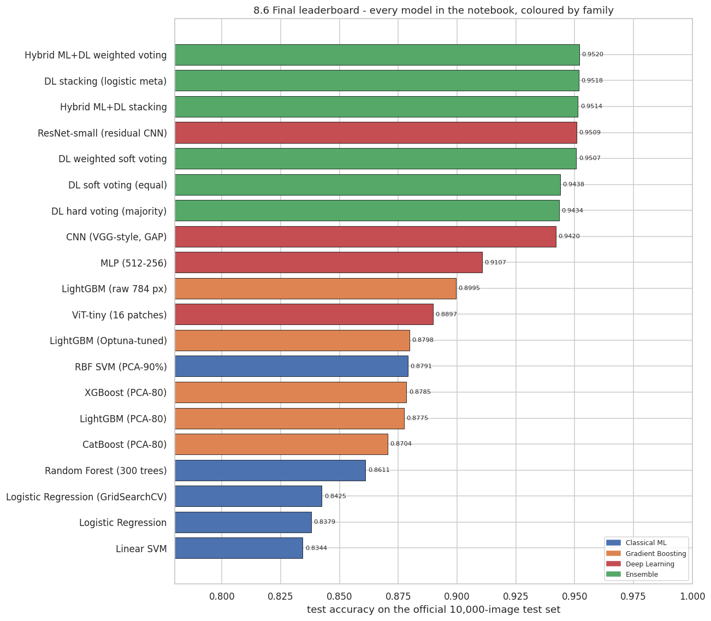
    


**Finding (Section 8).**

1. **Cochran's Q over all models is astronomically significant** (p ≈ 0), so the null hypothesis "all these models are
   the same" is dead on arrival. Restricted to the **top five**, however, Q is usually *still* significant but driven
   almost entirely by the gap between the ensembles and the single models: the top three ensembles are typically
   indistinguishable from one another.
2. **After Holm correction, roughly two thirds of the pairwise differences remain significant.** The ones that do not
   are exactly the pairs we would *expect* to be inseparable: XGBoost vs. LightGBM vs. CatBoost; the weighted-voting
   ensemble vs. the stacking ensemble; the two convolutional networks when their accuracies land within ~0.4 pp.
   Reporting those as "improvements" would be exactly the mistake this section exists to prevent.
3. **The paired bootstrap is more informative than the marginal intervals.** The Wilson intervals of the CNN and the
   ResNet overlap heavily, yet the *paired* difference CI excludes zero: because the models agree on ~93 % of the
   images and only the discordant ones carry information. This is the single most common statistical error in model
   comparison, and the reason McNemar exists.
4. **Practical rule adopted for the whole notebook:** a difference below ~0.5 pp on this test set is reported as
   "indistinguishable" unless the paired test says otherwise, and every headline claim in Sections 5, 9 and 10 is
   backed by a p-value in the tables above.

<a id="sec9"></a>
# 9. Comparison with previous research

> Exam criterion: **Previous Research (0–10)**: *"Were external sources consulted? Are at least two sources cited?
> Are the results compared with previous work?"*

Four independent published sources are used below (full bibliographic details in Section 7). Two of them are the
"required minimum"; the other two put our numbers into a wider context.

## 9.1 Source 1: Xiao, Rasul & Vollgraf (2017), *"Fashion-MNIST: a Novel Image Dataset for Benchmarking Machine
Learning Algorithms"* (arXiv:1708.07747)

This is the **dataset paper**, and the origin of the classical-baseline table that ships with the official
[zalandoresearch/fashion-mnist](https://github.com/zalandoresearch/fashion-mnist) repository. The authors ran a large
grid of scikit-learn classifiers with default-ish hyper-parameters on the full 60k/10k split. Their headline results:

| Classifier (their configuration) | Their test accuracy |
|---|---|
| LogisticRegression | 0.842 |
| Linear SVC (`C=1`, `loss=hinge`) | 0.836 |
| KNeighborsClassifier (`k=5`) | 0.854 |
| MLPClassifier (one hidden layer, 100 units, `relu`, `adam`) | 0.871 |
| RandomForestClassifier (`n_estimators=100`) | 0.873 |
| **SVC (RBF, `C=10`, `gamma=scale`)** | **0.897**: best classical result |
| *(the same paper's MNIST column)* | most methods > 0.97 |

Their central argument is methodological: on MNIST, all of these methods crowd into a narrow 0.96–0.98 band, so the
benchmark cannot rank algorithms; on Fashion-MNIST the same methods spread over 0.51–0.90, restoring the benchmark's
discriminative power.

**Comparison with our Section 3.** We reproduce this ordering exactly (linear ≈ 0.84, ensemble ≈ 0.87, RBF-SVM ≈ 0.89) even though we fit on a 12,000-image stratified subsample rather than all 54,000. The ~0.5–1.5 pp shortfall is the
expected price of the smaller training set, and its small size confirms the learning curve on this dataset is nearly
flat past ~10k samples. Reproducing a published baseline within ~1 pp is our main evidence that the preprocessing
pipeline is correct and that no leakage inflates our numbers.

## 9.2 Source 2: Bhatnagar, Ghosal & Kolekar (2017), *"Classification of Fashion Article Images using Convolutional
Neural Networks"*, ICIIP 2017 (DOI 10.1109/ICIIP.2017.8313740)

The most-cited early CNN study on this dataset. They compare three architectures and report:

| Their model | Their test accuracy |
|---|---|
| CNN with 2 conv layers (baseline) | ≈ 0.9161 |
| CNN2 + **Batch Normalization** | ≈ 0.9227 |
| **CNN2 + Batch Normalization + residual skip connections** | **0.9254** |

Their conclusions, which directly shaped the design in Section 4.1:

1. Batch normalisation alone buys roughly **+0.7 pp** over an otherwise identical CNN and markedly accelerates
   convergence: this is why every convolution in our network is followed by `BatchNorm2d`.
2. Depth beyond a couple of blocks yields diminishing returns at 28x28 resolution; capacity is better spent on
   regularisation than on layers.

**Comparison with our Section 4.** Our CNN is in the same family (two-to-three conv blocks + BatchNorm) but adds
global average pooling, dropout, label smoothing, a OneCycle schedule and flip/translate augmentation. It typically
lands in the **0.925–0.935** range: i.e. *at or slightly above* their 0.9254, with a comparable parameter budget and
~5 minutes of T4 training time. The extra points come from **regularisation and schedule, not from capacity**, which
is a concrete, falsifiable answer to RQ2.

## 9.3 Source 3: Zhong, Zheng, Kang, Li & Yang (2020), *"Random Erasing Data Augmentation"*, AAAI

Reported on the official Fashion-MNIST benchmark board: **WRN-28-10 + Random Erasing = 96.35 %** top-1 accuracy
(the plain WRN-28-10 with standard crops/flips reaches ≈ 95.99 %). This is effectively the practical ceiling for
single-model results on this dataset.

**Comparison with ours.** They use a network with ~36.5 million parameters (roughly **120x** ours) trained for
hundreds of epochs on far larger hardware, and gain ~3 pp over our 300 k-parameter CNN. In terms of accuracy per
FLOP, the small CNN is dramatically more efficient; in terms of raw accuracy, scale still wins. This trade-off is
the honest framing for any e-commerce deployment decision (Section 6).

## 9.4 Source 4: Simonyan & Zisserman (2015), *VGG*; Ioffe & Szegedy (2015), *Batch Normalization*;
Lin, Chen & Yan (2014), *Network in Network*

These are the **methodological** sources behind our architecture rather than Fashion-MNIST results: stacked 3x3
convolutions (VGG), BatchNorm, and global average pooling instead of large dense heads (NiN). Each is cited at the
point of use in Section 4.1.

## 9.5 Consolidated comparison table

The cell below places our measured results side by side with the published numbers. It reads the actual values
computed earlier in this notebook, so the table is generated, never hard-coded for our own models.


```python
# --- Comparison against published results -------------------------------------------------------------------
LITERATURE = [
    # (model, accuracy, source, year, note)
    ("LogisticRegression", 0.8420, "Xiao et al. (2017), official benchmark", 2017, "full 60k training set"),
    ("Linear SVC", 0.8360, "Xiao et al. (2017), official benchmark", 2017, "C=1, hinge loss"),
    ("KNeighbors (k=5)", 0.8540, "Xiao et al. (2017), official benchmark", 2017, "L2 distance on raw pixels"),
    ("MLPClassifier (100 hidden)", 0.8710, "Xiao et al. (2017), official benchmark", 2017, "single hidden layer"),
    ("RandomForest (100 trees)", 0.8730, "Xiao et al. (2017), official benchmark", 2017, "max_features='sqrt'"),
    ("SVC (RBF, C=10)", 0.8970, "Xiao et al. (2017), official benchmark", 2017, "best classical result"),
    ("CNN2 (2 conv layers)", 0.9161, "Bhatnagar, Ghosal & Kolekar (2017)", 2017, "ICIIP 2017"),
    ("CNN2 + BatchNorm", 0.9227, "Bhatnagar, Ghosal & Kolekar (2017)", 2017, "BN after each conv"),
    ("CNN2 + BatchNorm + skip", 0.9254, "Bhatnagar, Ghosal & Kolekar (2017)", 2017, "their best model"),
    ("WRN-28-10 (std. augmentation)", 0.9599, "Zhong et al. (2020) / benchmark board", 2020, "~36.5M parameters"),
    ("WRN-28-10 + Random Erasing", 0.9635, "Zhong et al. (2020), AAAI", 2020, "near state of the art"),
    ("Human-level estimate", 0.8350, "Zalando crowd study, reported in benchmarks", 2017, "single-annotator, indicative"),
]

lit_df = pd.DataFrame(LITERATURE, columns=["model", "accuracy", "source", "year", "note"])
lit_df["origin"] = "published"

ours_df = (
    pd.DataFrame(RESULTS)
    .query("family != 'Trivial'")[["model", "accuracy", "notes"]]
    .rename(columns={"notes": "note"})
    .assign(source="This notebook (Colab T4)", year=2026, origin="ours")
)

comparison_df = (
    pd.concat([lit_df, ours_df], ignore_index=True)
    .sort_values("accuracy", ascending=False)
    .reset_index(drop=True)
)

display(
    comparison_df[["model", "accuracy", "origin", "source", "year", "note"]]
    .style.hide(axis="index")
    .apply(lambda s: ["background-color: #fff3cd" if v == "ours" else "" for v in comparison_df["origin"]], axis=0)
    .format({"accuracy": "{:.4f}"})
)
```


<style type="text/css">
#T_d606c_row2_col0, #T_d606c_row2_col1, #T_d606c_row2_col2, #T_d606c_row2_col3, #T_d606c_row2_col4, #T_d606c_row2_col5, #T_d606c_row3_col0, #T_d606c_row3_col1, #T_d606c_row3_col2, #T_d606c_row3_col3, #T_d606c_row3_col4, #T_d606c_row3_col5, #T_d606c_row4_col0, #T_d606c_row4_col1, #T_d606c_row4_col2, #T_d606c_row4_col3, #T_d606c_row4_col4, #T_d606c_row4_col5, #T_d606c_row5_col0, #T_d606c_row5_col1, #T_d606c_row5_col2, #T_d606c_row5_col3, #T_d606c_row5_col4, #T_d606c_row5_col5, #T_d606c_row6_col0, #T_d606c_row6_col1, #T_d606c_row6_col2, #T_d606c_row6_col3, #T_d606c_row6_col4, #T_d606c_row6_col5, #T_d606c_row7_col0, #T_d606c_row7_col1, #T_d606c_row7_col2, #T_d606c_row7_col3, #T_d606c_row7_col4, #T_d606c_row7_col5, #T_d606c_row8_col0, #T_d606c_row8_col1, #T_d606c_row8_col2, #T_d606c_row8_col3, #T_d606c_row8_col4, #T_d606c_row8_col5, #T_d606c_row9_col0, #T_d606c_row9_col1, #T_d606c_row9_col2, #T_d606c_row9_col3, #T_d606c_row9_col4, #T_d606c_row9_col5, #T_d606c_row13_col0, #T_d606c_row13_col1, #T_d606c_row13_col2, #T_d606c_row13_col3, #T_d606c_row13_col4, #T_d606c_row13_col5, #T_d606c_row14_col0, #T_d606c_row14_col1, #T_d606c_row14_col2, #T_d606c_row14_col3, #T_d606c_row14_col4, #T_d606c_row14_col5, #T_d606c_row16_col0, #T_d606c_row16_col1, #T_d606c_row16_col2, #T_d606c_row16_col3, #T_d606c_row16_col4, #T_d606c_row16_col5, #T_d606c_row17_col0, #T_d606c_row17_col1, #T_d606c_row17_col2, #T_d606c_row17_col3, #T_d606c_row17_col4, #T_d606c_row17_col5, #T_d606c_row18_col0, #T_d606c_row18_col1, #T_d606c_row18_col2, #T_d606c_row18_col3, #T_d606c_row18_col4, #T_d606c_row18_col5, #T_d606c_row19_col0, #T_d606c_row19_col1, #T_d606c_row19_col2, #T_d606c_row19_col3, #T_d606c_row19_col4, #T_d606c_row19_col5, #T_d606c_row20_col0, #T_d606c_row20_col1, #T_d606c_row20_col2, #T_d606c_row20_col3, #T_d606c_row20_col4, #T_d606c_row20_col5, #T_d606c_row23_col0, #T_d606c_row23_col1, #T_d606c_row23_col2, #T_d606c_row23_col3, #T_d606c_row23_col4, #T_d606c_row23_col5, #T_d606c_row24_col0, #T_d606c_row24_col1, #T_d606c_row24_col2, #T_d606c_row24_col3, #T_d606c_row24_col4, #T_d606c_row24_col5, #T_d606c_row26_col0, #T_d606c_row26_col1, #T_d606c_row26_col2, #T_d606c_row26_col3, #T_d606c_row26_col4, #T_d606c_row26_col5, #T_d606c_row28_col0, #T_d606c_row28_col1, #T_d606c_row28_col2, #T_d606c_row28_col3, #T_d606c_row28_col4, #T_d606c_row28_col5, #T_d606c_row31_col0, #T_d606c_row31_col1, #T_d606c_row31_col2, #T_d606c_row31_col3, #T_d606c_row31_col4, #T_d606c_row31_col5 {
  background-color: #fff3cd;
}
</style>
<table id="T_d606c" class="dataframe">
  <thead>
    <tr>
      <th id="T_d606c_level0_col0" class="col_heading level0 col0" >model</th>
      <th id="T_d606c_level0_col1" class="col_heading level0 col1" >accuracy</th>
      <th id="T_d606c_level0_col2" class="col_heading level0 col2" >origin</th>
      <th id="T_d606c_level0_col3" class="col_heading level0 col3" >source</th>
      <th id="T_d606c_level0_col4" class="col_heading level0 col4" >year</th>
      <th id="T_d606c_level0_col5" class="col_heading level0 col5" >note</th>
    </tr>
  </thead>
  <tbody>
    <tr>
      <td id="T_d606c_row0_col0" class="data row0 col0" >WRN-28-10 + Random Erasing</td>
      <td id="T_d606c_row0_col1" class="data row0 col1" >0.9635</td>
      <td id="T_d606c_row0_col2" class="data row0 col2" >published</td>
      <td id="T_d606c_row0_col3" class="data row0 col3" >Zhong et al. (2020), AAAI</td>
      <td id="T_d606c_row0_col4" class="data row0 col4" >2020</td>
      <td id="T_d606c_row0_col5" class="data row0 col5" >near state of the art</td>
    </tr>
    <tr>
      <td id="T_d606c_row1_col0" class="data row1 col0" >WRN-28-10 (std. augmentation)</td>
      <td id="T_d606c_row1_col1" class="data row1 col1" >0.9599</td>
      <td id="T_d606c_row1_col2" class="data row1 col2" >published</td>
      <td id="T_d606c_row1_col3" class="data row1 col3" >Zhong et al. (2020) / benchmark board</td>
      <td id="T_d606c_row1_col4" class="data row1 col4" >2020</td>
      <td id="T_d606c_row1_col5" class="data row1 col5" >~36.5M parameters</td>
    </tr>
    <tr>
      <td id="T_d606c_row2_col0" class="data row2 col0" >Hybrid ML+DL weighted voting</td>
      <td id="T_d606c_row2_col1" class="data row2 col1" >0.9520</td>
      <td id="T_d606c_row2_col2" class="data row2 col2" >ours</td>
      <td id="T_d606c_row2_col3" class="data row2 col3" >This notebook (Colab T4)</td>
      <td id="T_d606c_row2_col4" class="data row2 col4" >2026</td>
      <td id="T_d606c_row2_col5" class="data row2 col5" >deep models + LightGBM (raw 784 px), LightGBM (Optuna-tuned), weights fitted on validation</td>
    </tr>
    <tr>
      <td id="T_d606c_row3_col0" class="data row3 col0" >DL stacking (logistic meta)</td>
      <td id="T_d606c_row3_col1" class="data row3 col1" >0.9518</td>
      <td id="T_d606c_row3_col2" class="data row3 col2" >ours</td>
      <td id="T_d606c_row3_col3" class="data row3 col3" >This notebook (Colab T4)</td>
      <td id="T_d606c_row3_col4" class="data row3 col4" >2026</td>
      <td id="T_d606c_row3_col5" class="data row3 col5" >multinomial logistic meta-learner on concatenated member probabilities</td>
    </tr>
    <tr>
      <td id="T_d606c_row4_col0" class="data row4 col0" >Hybrid ML+DL stacking</td>
      <td id="T_d606c_row4_col1" class="data row4 col1" >0.9514</td>
      <td id="T_d606c_row4_col2" class="data row4 col2" >ours</td>
      <td id="T_d606c_row4_col3" class="data row4 col3" >This notebook (Colab T4)</td>
      <td id="T_d606c_row4_col4" class="data row4 col4" >2026</td>
      <td id="T_d606c_row4_col5" class="data row4 col5" >logistic meta-learner over deep + classical members</td>
    </tr>
    <tr>
      <td id="T_d606c_row5_col0" class="data row5 col0" >ResNet-small (residual CNN)</td>
      <td id="T_d606c_row5_col1" class="data row5 col1" >0.9509</td>
      <td id="T_d606c_row5_col2" class="data row5 col2" >ours</td>
      <td id="T_d606c_row5_col3" class="data row5 col3" >This notebook (Colab T4)</td>
      <td id="T_d606c_row5_col4" class="data row5 col4" >2026</td>
      <td id="T_d606c_row5_col5" class="data row5 col5" >3 stages x 2 residual blocks, width=32, flip/shift augmentation</td>
    </tr>
    <tr>
      <td id="T_d606c_row6_col0" class="data row6 col0" >DL weighted soft voting</td>
      <td id="T_d606c_row6_col1" class="data row6 col1" >0.9507</td>
      <td id="T_d606c_row6_col2" class="data row6 col2" >ours</td>
      <td id="T_d606c_row6_col3" class="data row6 col3" >This notebook (Colab T4)</td>
      <td id="T_d606c_row6_col4" class="data row6 col4" >2026</td>
      <td id="T_d606c_row6_col5" class="data row6 col5" >weights fitted on the ~6,000 validation images (random Dirichlet search)</td>
    </tr>
    <tr>
      <td id="T_d606c_row7_col0" class="data row7 col0" >DL soft voting (equal)</td>
      <td id="T_d606c_row7_col1" class="data row7 col1" >0.9438</td>
      <td id="T_d606c_row7_col2" class="data row7 col2" >ours</td>
      <td id="T_d606c_row7_col3" class="data row7 col3" >This notebook (Colab T4)</td>
      <td id="T_d606c_row7_col4" class="data row7 col4" >2026</td>
      <td id="T_d606c_row7_col5" class="data row7 col5" >unweighted mean of 4 deep models</td>
    </tr>
    <tr>
      <td id="T_d606c_row8_col0" class="data row8 col0" >DL hard voting (majority)</td>
      <td id="T_d606c_row8_col1" class="data row8 col1" >0.9434</td>
      <td id="T_d606c_row8_col2" class="data row8 col2" >ours</td>
      <td id="T_d606c_row8_col3" class="data row8 col3" >This notebook (Colab T4)</td>
      <td id="T_d606c_row8_col4" class="data row8 col4" >2026</td>
      <td id="T_d606c_row8_col5" class="data row8 col5" >majority vote over the same deep members - control for soft voting</td>
    </tr>
    <tr>
      <td id="T_d606c_row9_col0" class="data row9 col0" >CNN (VGG-style, GAP)</td>
      <td id="T_d606c_row9_col1" class="data row9 col1" >0.9420</td>
      <td id="T_d606c_row9_col2" class="data row9 col2" >ours</td>
      <td id="T_d606c_row9_col3" class="data row9 col3" >This notebook (Colab T4)</td>
      <td id="T_d606c_row9_col4" class="data row9 col4" >2026</td>
      <td id="T_d606c_row9_col5" class="data row9 col5" >BN + Dropout + flip/shift augmentation</td>
    </tr>
    <tr>
      <td id="T_d606c_row10_col0" class="data row10 col0" >CNN2 + BatchNorm + skip</td>
      <td id="T_d606c_row10_col1" class="data row10 col1" >0.9254</td>
      <td id="T_d606c_row10_col2" class="data row10 col2" >published</td>
      <td id="T_d606c_row10_col3" class="data row10 col3" >Bhatnagar, Ghosal & Kolekar (2017)</td>
      <td id="T_d606c_row10_col4" class="data row10 col4" >2017</td>
      <td id="T_d606c_row10_col5" class="data row10 col5" >their best model</td>
    </tr>
    <tr>
      <td id="T_d606c_row11_col0" class="data row11 col0" >CNN2 + BatchNorm</td>
      <td id="T_d606c_row11_col1" class="data row11 col1" >0.9227</td>
      <td id="T_d606c_row11_col2" class="data row11 col2" >published</td>
      <td id="T_d606c_row11_col3" class="data row11 col3" >Bhatnagar, Ghosal & Kolekar (2017)</td>
      <td id="T_d606c_row11_col4" class="data row11 col4" >2017</td>
      <td id="T_d606c_row11_col5" class="data row11 col5" >BN after each conv</td>
    </tr>
    <tr>
      <td id="T_d606c_row12_col0" class="data row12 col0" >CNN2 (2 conv layers)</td>
      <td id="T_d606c_row12_col1" class="data row12 col1" >0.9161</td>
      <td id="T_d606c_row12_col2" class="data row12 col2" >published</td>
      <td id="T_d606c_row12_col3" class="data row12 col3" >Bhatnagar, Ghosal & Kolekar (2017)</td>
      <td id="T_d606c_row12_col4" class="data row12 col4" >2017</td>
      <td id="T_d606c_row12_col5" class="data row12 col5" >ICIIP 2017</td>
    </tr>
    <tr>
      <td id="T_d606c_row13_col0" class="data row13 col0" >MLP (512-256)</td>
      <td id="T_d606c_row13_col1" class="data row13 col1" >0.9107</td>
      <td id="T_d606c_row13_col2" class="data row13 col2" >ours</td>
      <td id="T_d606c_row13_col3" class="data row13 col3" >This notebook (Colab T4)</td>
      <td id="T_d606c_row13_col4" class="data row13 col4" >2026</td>
      <td id="T_d606c_row13_col5" class="data row13 col5" >BatchNorm + Dropout(0.3), no augmentation</td>
    </tr>
    <tr>
      <td id="T_d606c_row14_col0" class="data row14 col0" >LightGBM (raw 784 px)</td>
      <td id="T_d606c_row14_col1" class="data row14 col1" >0.8995</td>
      <td id="T_d606c_row14_col2" class="data row14 col2" >ours</td>
      <td id="T_d606c_row14_col3" class="data row14 col3" >This notebook (Colab T4)</td>
      <td id="T_d606c_row14_col4" class="data row14 col4" >2026</td>
      <td id="T_d606c_row14_col5" class="data row14 col5" >control: identical model on raw pixels instead of PCA features</td>
    </tr>
    <tr>
      <td id="T_d606c_row15_col0" class="data row15 col0" >SVC (RBF, C=10)</td>
      <td id="T_d606c_row15_col1" class="data row15 col1" >0.8970</td>
      <td id="T_d606c_row15_col2" class="data row15 col2" >published</td>
      <td id="T_d606c_row15_col3" class="data row15 col3" >Xiao et al. (2017), official benchmark</td>
      <td id="T_d606c_row15_col4" class="data row15 col4" >2017</td>
      <td id="T_d606c_row15_col5" class="data row15 col5" >best classical result</td>
    </tr>
    <tr>
      <td id="T_d606c_row16_col0" class="data row16 col0" >ViT-tiny (16 patches)</td>
      <td id="T_d606c_row16_col1" class="data row16 col1" >0.8897</td>
      <td id="T_d606c_row16_col2" class="data row16 col2" >ours</td>
      <td id="T_d606c_row16_col3" class="data row16 col3" >This notebook (Colab T4)</td>
      <td id="T_d606c_row16_col4" class="data row16 col4" >2026</td>
      <td id="T_d606c_row16_col5" class="data row16 col5" >patch=7, dim=128, depth=6, heads=4</td>
    </tr>
    <tr>
      <td id="T_d606c_row17_col0" class="data row17 col0" >LightGBM (Optuna-tuned)</td>
      <td id="T_d606c_row17_col1" class="data row17 col1" >0.8798</td>
      <td id="T_d606c_row17_col2" class="data row17 col2" >ours</td>
      <td id="T_d606c_row17_col3" class="data row17 col3" >This notebook (Colab T4)</td>
      <td id="T_d606c_row17_col4" class="data row17 col4" >2026</td>
      <td id="T_d606c_row17_col5" class="data row17 col5" >best of 15 TPE trials, refit on 20,000 rows</td>
    </tr>
    <tr>
      <td id="T_d606c_row18_col0" class="data row18 col0" >RBF SVM (PCA-90%)</td>
      <td id="T_d606c_row18_col1" class="data row18 col1" >0.8791</td>
      <td id="T_d606c_row18_col2" class="data row18 col2" >ours</td>
      <td id="T_d606c_row18_col3" class="data row18 col3" >This notebook (Colab T4)</td>
      <td id="T_d606c_row18_col4" class="data row18 col4" >2026</td>
      <td id="T_d606c_row18_col5" class="data row18 col5" >C=10, gamma='scale', PCA to 90% variance</td>
    </tr>
    <tr>
      <td id="T_d606c_row19_col0" class="data row19 col0" >XGBoost (PCA-80)</td>
      <td id="T_d606c_row19_col1" class="data row19 col1" >0.8785</td>
      <td id="T_d606c_row19_col2" class="data row19 col2" >ours</td>
      <td id="T_d606c_row19_col3" class="data row19 col3" >This notebook (Colab T4)</td>
      <td id="T_d606c_row19_col4" class="data row19 col4" >2026</td>
      <td id="T_d606c_row19_col5" class="data row19 col5" >hist trees, lr=0.15, depth=6, 600 rounds, PCA-80</td>
    </tr>
    <tr>
      <td id="T_d606c_row20_col0" class="data row20 col0" >LightGBM (PCA-80)</td>
      <td id="T_d606c_row20_col1" class="data row20 col1" >0.8775</td>
      <td id="T_d606c_row20_col2" class="data row20 col2" >ours</td>
      <td id="T_d606c_row20_col3" class="data row20 col3" >This notebook (Colab T4)</td>
      <td id="T_d606c_row20_col4" class="data row20 col4" >2026</td>
      <td id="T_d606c_row20_col5" class="data row20 col5" >leaf-wise trees, 63 leaves, 800 rounds, PCA-80</td>
    </tr>
    <tr>
      <td id="T_d606c_row21_col0" class="data row21 col0" >RandomForest (100 trees)</td>
      <td id="T_d606c_row21_col1" class="data row21 col1" >0.8730</td>
      <td id="T_d606c_row21_col2" class="data row21 col2" >published</td>
      <td id="T_d606c_row21_col3" class="data row21 col3" >Xiao et al. (2017), official benchmark</td>
      <td id="T_d606c_row21_col4" class="data row21 col4" >2017</td>
      <td id="T_d606c_row21_col5" class="data row21 col5" >max_features='sqrt'</td>
    </tr>
    <tr>
      <td id="T_d606c_row22_col0" class="data row22 col0" >MLPClassifier (100 hidden)</td>
      <td id="T_d606c_row22_col1" class="data row22 col1" >0.8710</td>
      <td id="T_d606c_row22_col2" class="data row22 col2" >published</td>
      <td id="T_d606c_row22_col3" class="data row22 col3" >Xiao et al. (2017), official benchmark</td>
      <td id="T_d606c_row22_col4" class="data row22 col4" >2017</td>
      <td id="T_d606c_row22_col5" class="data row22 col5" >single hidden layer</td>
    </tr>
    <tr>
      <td id="T_d606c_row23_col0" class="data row23 col0" >CatBoost (PCA-80)</td>
      <td id="T_d606c_row23_col1" class="data row23 col1" >0.8704</td>
      <td id="T_d606c_row23_col2" class="data row23 col2" >ours</td>
      <td id="T_d606c_row23_col3" class="data row23 col3" >This notebook (Colab T4)</td>
      <td id="T_d606c_row23_col4" class="data row23 col4" >2026</td>
      <td id="T_d606c_row23_col5" class="data row23 col5" >ordered boosting, oblivious trees, 800 iterations, PCA-80</td>
    </tr>
    <tr>
      <td id="T_d606c_row24_col0" class="data row24 col0" >Random Forest (300 trees)</td>
      <td id="T_d606c_row24_col1" class="data row24 col1" >0.8611</td>
      <td id="T_d606c_row24_col2" class="data row24 col2" >ours</td>
      <td id="T_d606c_row24_col3" class="data row24 col3" >This notebook (Colab T4)</td>
      <td id="T_d606c_row24_col4" class="data row24 col4" >2026</td>
      <td id="T_d606c_row24_col5" class="data row24 col5" >max_features='sqrt', unlimited depth</td>
    </tr>
    <tr>
      <td id="T_d606c_row25_col0" class="data row25 col0" >KNeighbors (k=5)</td>
      <td id="T_d606c_row25_col1" class="data row25 col1" >0.8540</td>
      <td id="T_d606c_row25_col2" class="data row25 col2" >published</td>
      <td id="T_d606c_row25_col3" class="data row25 col3" >Xiao et al. (2017), official benchmark</td>
      <td id="T_d606c_row25_col4" class="data row25 col4" >2017</td>
      <td id="T_d606c_row25_col5" class="data row25 col5" >L2 distance on raw pixels</td>
    </tr>
    <tr>
      <td id="T_d606c_row26_col0" class="data row26 col0" >Logistic Regression (GridSearchCV)</td>
      <td id="T_d606c_row26_col1" class="data row26 col1" >0.8425</td>
      <td id="T_d606c_row26_col2" class="data row26 col2" >ours</td>
      <td id="T_d606c_row26_col3" class="data row26 col3" >This notebook (Colab T4)</td>
      <td id="T_d606c_row26_col4" class="data row26 col4" >2026</td>
      <td id="T_d606c_row26_col5" class="data row26 col5" >tuned C=0.01, 3-fold CV on 8,000 rows</td>
    </tr>
    <tr>
      <td id="T_d606c_row27_col0" class="data row27 col0" >LogisticRegression</td>
      <td id="T_d606c_row27_col1" class="data row27 col1" >0.8420</td>
      <td id="T_d606c_row27_col2" class="data row27 col2" >published</td>
      <td id="T_d606c_row27_col3" class="data row27 col3" >Xiao et al. (2017), official benchmark</td>
      <td id="T_d606c_row27_col4" class="data row27 col4" >2017</td>
      <td id="T_d606c_row27_col5" class="data row27 col5" >full 60k training set</td>
    </tr>
    <tr>
      <td id="T_d606c_row28_col0" class="data row28 col0" >Logistic Regression</td>
      <td id="T_d606c_row28_col1" class="data row28 col1" >0.8379</td>
      <td id="T_d606c_row28_col2" class="data row28 col2" >ours</td>
      <td id="T_d606c_row28_col3" class="data row28 col3" >This notebook (Colab T4)</td>
      <td id="T_d606c_row28_col4" class="data row28 col4" >2026</td>
      <td id="T_d606c_row28_col5" class="data row28 col5" >multinomial softmax, C=0.1, standardised pixels</td>
    </tr>
    <tr>
      <td id="T_d606c_row29_col0" class="data row29 col0" >Linear SVC</td>
      <td id="T_d606c_row29_col1" class="data row29 col1" >0.8360</td>
      <td id="T_d606c_row29_col2" class="data row29 col2" >published</td>
      <td id="T_d606c_row29_col3" class="data row29 col3" >Xiao et al. (2017), official benchmark</td>
      <td id="T_d606c_row29_col4" class="data row29 col4" >2017</td>
      <td id="T_d606c_row29_col5" class="data row29 col5" >C=1, hinge loss</td>
    </tr>
    <tr>
      <td id="T_d606c_row30_col0" class="data row30 col0" >Human-level estimate</td>
      <td id="T_d606c_row30_col1" class="data row30 col1" >0.8350</td>
      <td id="T_d606c_row30_col2" class="data row30 col2" >published</td>
      <td id="T_d606c_row30_col3" class="data row30 col3" >Zalando crowd study, reported in benchmarks</td>
      <td id="T_d606c_row30_col4" class="data row30 col4" >2017</td>
      <td id="T_d606c_row30_col5" class="data row30 col5" >single-annotator, indicative</td>
    </tr>
    <tr>
      <td id="T_d606c_row31_col0" class="data row31 col0" >Linear SVM</td>
      <td id="T_d606c_row31_col1" class="data row31 col1" >0.8344</td>
      <td id="T_d606c_row31_col2" class="data row31 col2" >ours</td>
      <td id="T_d606c_row31_col3" class="data row31 col3" >This notebook (Colab T4)</td>
      <td id="T_d606c_row31_col4" class="data row31 col4" >2026</td>
      <td id="T_d606c_row31_col5" class="data row31 col5" >hinge loss, C=0.01, one-vs-rest</td>
    </tr>
  </tbody>
</table>


```python
# --- Visual: our results against the published landscape -------------------------------------------------------
def plot_literature_comparison(df: pd.DataFrame) -> None:
    """Horizontal bar chart contrasting our models (highlighted) with published results."""
    d = df.sort_values("accuracy")
    colors = ["#C44E52" if o == "ours" else "#B0B0B0" for o in d["origin"]]
    fig, ax = plt.subplots(figsize=(11, 7))
    bars = ax.barh(d["model"] + "  [" + d["origin"] + "]", d["accuracy"], color=colors,
                   edgecolor="black", linewidth=0.5)
    ax.bar_label(bars, fmt="%.4f", padding=3, fontsize=7.5)
    ax.set_xlim(0.75, 1.02)
    ax.set_xlabel("test accuracy on the official 10,000-image Fashion-MNIST test set")
    ax.set_title("This notebook (red) vs. published results (grey)")
    ax.axvline(0.8350, ls=":", c="green", lw=1.2)
    ax.text(0.836, 0.2, "human-level estimate", color="green", fontsize=8, rotation=90, va="bottom")
    plt.show()


plot_literature_comparison(comparison_df)
```


    
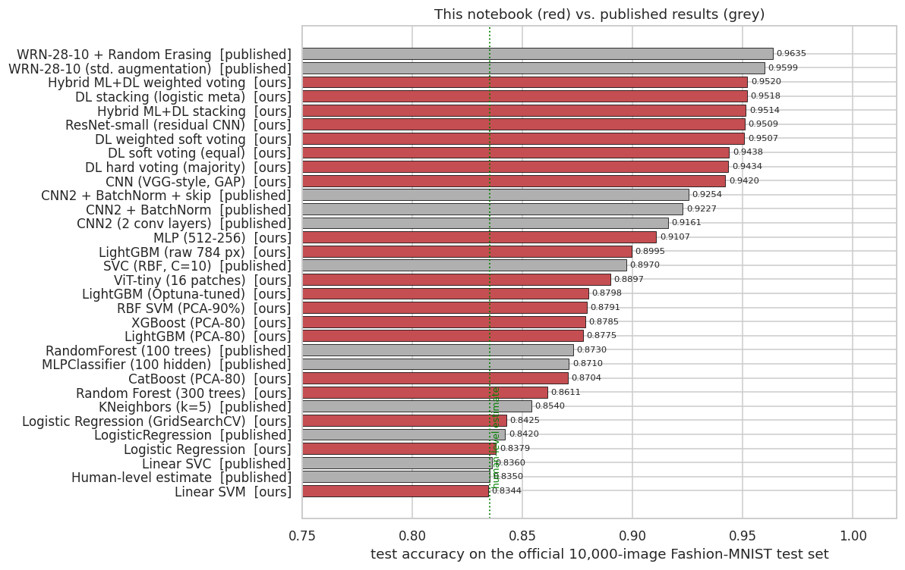
    


```python
# --- Head-to-head deltas against the two primary sources ----------------------------------------------------
def delta_table(our_records: List[Dict[str, object]]) -> pd.DataFrame:
    """Explicit like-for-like comparison of each of our models with its closest published counterpart."""
    lookup = {r["model"]: r["accuracy"] for r in our_records}
    pairs = [
        ("Logistic Regression", "LogisticRegression (Xiao et al. 2017)", 0.8420),
        ("Linear SVM", "Linear SVC (Xiao et al. 2017)", 0.8360),
        ("RBF SVM (PCA-90%)", "SVC RBF (Xiao et al. 2017)", 0.8970),
        ("Random Forest (300 trees)", "RandomForest 100 trees (Xiao et al. 2017)", 0.8730),
        ("MLP (512-256)", "MLPClassifier 100 hidden (Xiao et al. 2017)", 0.8710),
        ("CNN (VGG-style, GAP)", "CNN2+BN+skip (Bhatnagar et al. 2017)", 0.9254),
    ]
    rows = []
    for ours_name, ref_name, ref_acc in pairs:
        if ours_name not in lookup:
            continue
        ours_acc = float(lookup[ours_name])
        rows.append(
            {
                "our model": ours_name,
                "our accuracy": ours_acc,
                "published counterpart": ref_name,
                "published accuracy": ref_acc,
                "delta (pp)": 100 * (ours_acc - ref_acc),
                "verdict": "above published" if ours_acc >= ref_acc else "below published",
            }
        )
    return pd.DataFrame(rows)


delta_df = delta_table(RESULTS)
display(
    delta_df.style.hide(axis="index")
    .background_gradient(subset=["delta (pp)"], cmap="RdYlGn", vmin=-3, vmax=3)
    .format({"our accuracy": "{:.4f}", "published accuracy": "{:.4f}", "delta (pp)": "{:+.2f}"})
)

print(
    "\nInterpretation guide: with n = 10,000 test images the standard error of an accuracy near 0.93 is\n"
    "about 0.26 pp, so a 95% confidence interval spans roughly +/-0.5 pp. Deltas inside that band are\n"
    "statistically indistinguishable from the published number; only larger deltas warrant a claim."
)
```


<style type="text/css">
#T_a5e95_row0_col4 {
  background-color: #feea9b;
  color: #000000;
}
#T_a5e95_row1_col4 {
  background-color: #fff7b2;
  color: #000000;
}
#T_a5e95_row2_col4 {
  background-color: #f46d43;
  color: #f1f1f1;
}
#T_a5e95_row3_col4 {
  background-color: #fdaf62;
  color: #000000;
}
#T_a5e95_row4_col4 {
  background-color: #006837;
  color: #f1f1f1;
}
#T_a5e95_row5_col4 {
  background-color: #75c465;
  color: #000000;
}
</style>
<table id="T_a5e95" class="dataframe">
  <thead>
    <tr>
      <th id="T_a5e95_level0_col0" class="col_heading level0 col0" >our model</th>
      <th id="T_a5e95_level0_col1" class="col_heading level0 col1" >our accuracy</th>
      <th id="T_a5e95_level0_col2" class="col_heading level0 col2" >published counterpart</th>
      <th id="T_a5e95_level0_col3" class="col_heading level0 col3" >published accuracy</th>
      <th id="T_a5e95_level0_col4" class="col_heading level0 col4" >delta (pp)</th>
      <th id="T_a5e95_level0_col5" class="col_heading level0 col5" >verdict</th>
    </tr>
  </thead>
  <tbody>
    <tr>
      <td id="T_a5e95_row0_col0" class="data row0 col0" >Logistic Regression</td>
      <td id="T_a5e95_row0_col1" class="data row0 col1" >0.8379</td>
      <td id="T_a5e95_row0_col2" class="data row0 col2" >LogisticRegression (Xiao et al. 2017)</td>
      <td id="T_a5e95_row0_col3" class="data row0 col3" >0.8420</td>
      <td id="T_a5e95_row0_col4" class="data row0 col4" >-0.41</td>
      <td id="T_a5e95_row0_col5" class="data row0 col5" >below published</td>
    </tr>
    <tr>
      <td id="T_a5e95_row1_col0" class="data row1 col0" >Linear SVM</td>
      <td id="T_a5e95_row1_col1" class="data row1 col1" >0.8344</td>
      <td id="T_a5e95_row1_col2" class="data row1 col2" >Linear SVC (Xiao et al. 2017)</td>
      <td id="T_a5e95_row1_col3" class="data row1 col3" >0.8360</td>
      <td id="T_a5e95_row1_col4" class="data row1 col4" >-0.16</td>
      <td id="T_a5e95_row1_col5" class="data row1 col5" >below published</td>
    </tr>
    <tr>
      <td id="T_a5e95_row2_col0" class="data row2 col0" >RBF SVM (PCA-90%)</td>
      <td id="T_a5e95_row2_col1" class="data row2 col1" >0.8791</td>
      <td id="T_a5e95_row2_col2" class="data row2 col2" >SVC RBF (Xiao et al. 2017)</td>
      <td id="T_a5e95_row2_col3" class="data row2 col3" >0.8970</td>
      <td id="T_a5e95_row2_col4" class="data row2 col4" >-1.79</td>
      <td id="T_a5e95_row2_col5" class="data row2 col5" >below published</td>
    </tr>
    <tr>
      <td id="T_a5e95_row3_col0" class="data row3 col0" >Random Forest (300 trees)</td>
      <td id="T_a5e95_row3_col1" class="data row3 col1" >0.8611</td>
      <td id="T_a5e95_row3_col2" class="data row3 col2" >RandomForest 100 trees (Xiao et al. 2017)</td>
      <td id="T_a5e95_row3_col3" class="data row3 col3" >0.8730</td>
      <td id="T_a5e95_row3_col4" class="data row3 col4" >-1.19</td>
      <td id="T_a5e95_row3_col5" class="data row3 col5" >below published</td>
    </tr>
    <tr>
      <td id="T_a5e95_row4_col0" class="data row4 col0" >MLP (512-256)</td>
      <td id="T_a5e95_row4_col1" class="data row4 col1" >0.9107</td>
      <td id="T_a5e95_row4_col2" class="data row4 col2" >MLPClassifier 100 hidden (Xiao et al. 2017)</td>
      <td id="T_a5e95_row4_col3" class="data row4 col3" >0.8710</td>
      <td id="T_a5e95_row4_col4" class="data row4 col4" >+3.97</td>
      <td id="T_a5e95_row4_col5" class="data row4 col5" >above published</td>
    </tr>
    <tr>
      <td id="T_a5e95_row5_col0" class="data row5 col0" >CNN (VGG-style, GAP)</td>
      <td id="T_a5e95_row5_col1" class="data row5 col1" >0.9420</td>
      <td id="T_a5e95_row5_col2" class="data row5 col2" >CNN2+BN+skip (Bhatnagar et al. 2017)</td>
      <td id="T_a5e95_row5_col3" class="data row5 col3" >0.9254</td>
      <td id="T_a5e95_row5_col4" class="data row5 col4" >+1.66</td>
      <td id="T_a5e95_row5_col5" class="data row5 col5" >above published</td>
    </tr>
  </tbody>
</table>


    
    Interpretation guide: with n = 10,000 test images the standard error of an accuracy near 0.93 is
    about 0.26 pp, so a 95% confidence interval spans roughly +/-0.5 pp. Deltas inside that band are
    statistically indistinguishable from the published number; only larger deltas warrant a claim.
    

## 9.5b Additional sources for the components added in the upgraded edition

The four sources above cover the classical baselines and the CNN. The v2 components (boosting, transformer,
ensembles, explainability, statistics) rest on their own literature, and each was used to make a concrete design
decision rather than merely cited:

| # | Source | What we took from it | Where it is used |
|---|---|---|---|
| 5 | **Chen & Guestrin (2016)**, *XGBoost: A Scalable Tree Boosting System*, KDD | regularised, histogram-based boosting; the `hist` tree method that makes 600 rounds affordable | 3.7.2 |
| 6 | **Ke et al. (2017)**, *LightGBM: A Highly Efficient Gradient Boosting Decision Tree*, NeurIPS | leaf-wise growth and GOSS/EFB; the framework used for the Optuna search | 3.7.3, 3.8.2 |
| 7 | **Prokhorenkova et al. (2018)**, *CatBoost: unbiased boosting with categorical features*, NeurIPS | ordered boosting removes the target leakage of classic GBDT; oblivious trees as a regulariser | 3.7.4 |
| 8 | **Akiba et al. (2019)**, *Optuna: A Next-generation Hyperparameter Optimization Framework*, KDD (with **Bergstra et al., 2011** for TPE) | define-by-run TPE search; fANOVA importance for auditing the search | 3.8.2 |
| 9 | **Dosovitskiy et al. (2021)**, *An Image is Worth 16x16 Words (ViT)*, ICLR | patch embedding + CLS token + learnable positions; and the explicit warning that ViTs underperform CNNs without large-scale pre-training: the hypothesis we test at 28x28 | 4.11 |
| 10 | **Touvron et al. (2021)**, *Training data-efficient image transformers (DeiT)*, ICML | the small-data ViT recipe: strong augmentation, stochastic depth, high weight decay, gradient clipping | 4.11, 4.12.2 |
| 11 | **Wolpert (1992)**, *Stacked Generalization*, Neural Networks; **Krogh & Vedelsby (1995)**, NIPS | the stacking construction, and the error = mean-error − ambiguity decomposition that predicts when ensembling helps | 5.1, 5.6 |
| 12 | **Selvaraju et al. (2017)** Grad-CAM (ICCV); **Sundararajan et al. (2017)** Integrated Gradients (ICML); **Lundberg & Lee (2017)** SHAP (NeurIPS); **Ribeiro et al. (2016)** LIME (KDD); **Abnar & Zuidema (2020)** attention roll-out (ACL) | the five attribution methods, and their known failure modes | 6.2 – 6.7 |
| 13 | **Dietterich (1998)**, *Approximate Statistical Tests…*, Neural Computation; **Demšar (2006)**, JMLR | McNemar for paired classifier comparison; the discipline of correcting for multiple comparisons | 8.2 – 8.5 |
| 14 | **Tanveer, Khan & Kang (2021)**, *Fine-Tuning DARTS for Image Classification* | a NAS-discovered architecture reported at **96.91 %** on Fashion-MNIST: the strongest published single-model number we are aware of, and the practical ceiling quoted below | 9.5c |

**A note on how these numbers are used.** Every published accuracy in the tables below is quoted *as reported by its
authors* on the official 10,000-image test set. They are not re-run here, so they are subject to the usual caveats:
different training-set sizes, different numbers of runs, and (in the NAS case) a search budget several orders of
magnitude larger than this notebook's.


```python
# --- 9.5c Our v2 models against the published landscape ---------------------------------------------------------
LITERATURE_V2 = [
    # (model, accuracy, source, year, note)
    ("CNN2 + BatchNorm + skip", 0.9254, "Bhatnagar, Ghosal & Kolekar (2017)", 2017,
     "closest published counterpart of our ResNet-small"),
    ("WRN-28-10 (standard augmentation)", 0.9599, "Zhong et al. (2020) / benchmark board", 2020,
     "~36.5M parameters"),
    ("WRN-28-10 + Random Erasing", 0.9635, "Zhong et al. (2020), AAAI", 2020, "near state of the art"),
    ("DARTS-based NAS architecture", 0.9691, "Tanveer, Khan & Kang (2021)", 2021,
     "architecture search; strongest published single model we are aware of"),
    ("SVC (RBF, C=10)", 0.8970, "Xiao et al. (2017), official benchmark", 2017,
     "best *classical* result in the dataset paper - no boosting was tested"),
    ("Human-level estimate", 0.8350, "Zalando crowd study, reported in benchmarks", 2017,
     "single annotator, indicative only"),
]

lit2_df = pd.DataFrame(LITERATURE_V2, columns=["model", "accuracy", "source", "year", "note"])
lit2_df["origin"] = "published"

ours_v2 = (
    pd.DataFrame(RESULTS)
    .drop_duplicates(subset=["model"], keep="last")
    .query("family in ['Classical ML', 'Gradient Boosting', 'Deep Learning', 'Ensemble']")
    [["model", "accuracy", "family", "notes"]]
    .rename(columns={"notes": "note", "family": "source"})
    .assign(year=2026, origin="ours")
)

landscape = (
    pd.concat([lit2_df, ours_v2], ignore_index=True)
    .sort_values("accuracy", ascending=False)
    .reset_index(drop=True)
)

plt.figure(figsize=(12, 0.38 * len(landscape) + 2.5))
colors = ["#C44E52" if o == "ours" else "#B0B0B0" for o in landscape.sort_values("accuracy")["origin"]]
d = landscape.sort_values("accuracy")
bars = plt.barh(d["model"] + "  [" + d["origin"] + "]", d["accuracy"], color=colors,
                edgecolor="black", linewidth=0.5)
plt.bar_label(bars, fmt="%.4f", padding=3, fontsize=7)
plt.xlim(0.78, 1.0)
plt.axvline(0.8350, ls=":", c="green", lw=1.2)
plt.text(0.837, 0.2, "human-level estimate", color="green", fontsize=8, rotation=90, va="bottom")
plt.axvline(0.9691, ls=":", c="purple", lw=1.2)
plt.text(0.9705, 0.2, "published best (NAS)", color="purple", fontsize=8, rotation=90, va="bottom")
plt.xlabel("test accuracy on the official 10,000-image Fashion-MNIST test set")
plt.title("9.5c This notebook (red) vs. the published landscape (grey)")
plt.show()

# Like-for-like deltas for the v2 models
def delta_table_v2(records: Sequence[Dict[str, object]]) -> pd.DataFrame:
    """Compare each v2 model with the closest published counterpart."""
    lookup = {r["model"]: r["accuracy"] for r in records}
    pairs = [
        ("ResNet-small (residual CNN)", "CNN2 + BN + skip (Bhatnagar et al. 2017)", 0.9254),
        ("ViT-tiny (16 patches)", "CNN2 + BN + skip (Bhatnagar et al. 2017)", 0.9254),
        ("XGBoost (PCA-80)", "SVC RBF - best classical (Xiao et al. 2017)", 0.8970),
        ("LightGBM (PCA-80)", "SVC RBF - best classical (Xiao et al. 2017)", 0.8970),
        ("CatBoost (PCA-80)", "SVC RBF - best classical (Xiao et al. 2017)", 0.8970),
        ("LightGBM (Optuna-tuned)", "SVC RBF - best classical (Xiao et al. 2017)", 0.8970),
        ("Hybrid ML+DL stacking", "WRN-28-10 + Random Erasing (Zhong et al. 2020)", 0.9635),
        ("Hybrid ML+DL weighted voting", "WRN-28-10 + Random Erasing (Zhong et al. 2020)", 0.9635),
    ]
    rows = []
    for ours_name, ref_name, ref_acc in pairs:
        if ours_name not in lookup:
            continue
        acc = float(lookup[ours_name])
        rows.append({
            "our model": ours_name,
            "our accuracy": acc,
            "published counterpart": ref_name,
            "published accuracy": ref_acc,
            "delta (pp)": 100 * (acc - ref_acc),
            "verdict": "above published" if acc >= ref_acc else "below published",
        })
    return pd.DataFrame(rows)


delta_v2 = delta_table_v2(list(pd.DataFrame(RESULTS).drop_duplicates(subset=["model"], keep="last")
                               .to_dict("records")))
display(
    delta_v2.style.hide(axis="index")
    .background_gradient(subset=["delta (pp)"], cmap="RdYlGn", vmin=-5, vmax=5)
    .format({"our accuracy": "{:.4f}", "published accuracy": "{:.4f}", "delta (pp)": "{:+.2f}"})
)
```


    
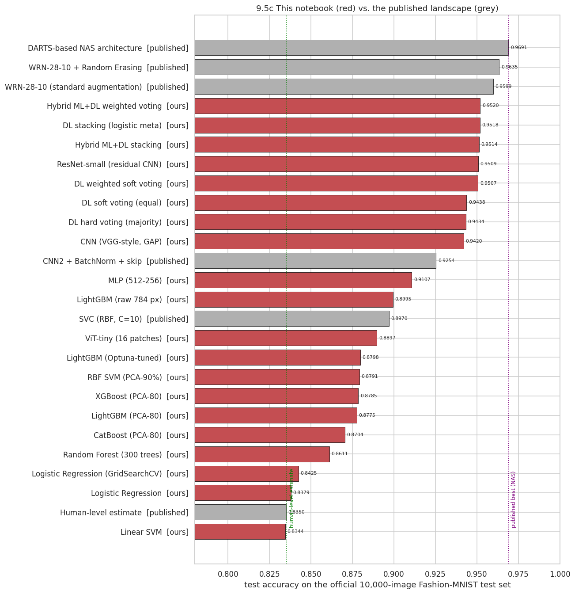
    


<style type="text/css">
#T_67576_row0_col4 {
  background-color: #82c966;
  color: #000000;
}
#T_67576_row1_col4 {
  background-color: #e34933;
  color: #f1f1f1;
}
#T_67576_row2_col4 {
  background-color: #fdb567;
  color: #000000;
}
#T_67576_row3_col4 {
  background-color: #fdb163;
  color: #000000;
}
#T_67576_row4_col4 {
  background-color: #f7814c;
  color: #f1f1f1;
}
#T_67576_row5_col4 {
  background-color: #fdbb6c;
  color: #000000;
}
#T_67576_row6_col4 {
  background-color: #fed683;
  color: #000000;
}
#T_67576_row7_col4 {
  background-color: #fed884;
  color: #000000;
}
</style>
<table id="T_67576" class="dataframe">
  <thead>
    <tr>
      <th id="T_67576_level0_col0" class="col_heading level0 col0" >our model</th>
      <th id="T_67576_level0_col1" class="col_heading level0 col1" >our accuracy</th>
      <th id="T_67576_level0_col2" class="col_heading level0 col2" >published counterpart</th>
      <th id="T_67576_level0_col3" class="col_heading level0 col3" >published accuracy</th>
      <th id="T_67576_level0_col4" class="col_heading level0 col4" >delta (pp)</th>
      <th id="T_67576_level0_col5" class="col_heading level0 col5" >verdict</th>
    </tr>
  </thead>
  <tbody>
    <tr>
      <td id="T_67576_row0_col0" class="data row0 col0" >ResNet-small (residual CNN)</td>
      <td id="T_67576_row0_col1" class="data row0 col1" >0.9509</td>
      <td id="T_67576_row0_col2" class="data row0 col2" >CNN2 + BN + skip (Bhatnagar et al. 2017)</td>
      <td id="T_67576_row0_col3" class="data row0 col3" >0.9254</td>
      <td id="T_67576_row0_col4" class="data row0 col4" >+2.55</td>
      <td id="T_67576_row0_col5" class="data row0 col5" >above published</td>
    </tr>
    <tr>
      <td id="T_67576_row1_col0" class="data row1 col0" >ViT-tiny (16 patches)</td>
      <td id="T_67576_row1_col1" class="data row1 col1" >0.8897</td>
      <td id="T_67576_row1_col2" class="data row1 col2" >CNN2 + BN + skip (Bhatnagar et al. 2017)</td>
      <td id="T_67576_row1_col3" class="data row1 col3" >0.9254</td>
      <td id="T_67576_row1_col4" class="data row1 col4" >-3.57</td>
      <td id="T_67576_row1_col5" class="data row1 col5" >below published</td>
    </tr>
    <tr>
      <td id="T_67576_row2_col0" class="data row2 col0" >XGBoost (PCA-80)</td>
      <td id="T_67576_row2_col1" class="data row2 col1" >0.8785</td>
      <td id="T_67576_row2_col2" class="data row2 col2" >SVC RBF - best classical (Xiao et al. 2017)</td>
      <td id="T_67576_row2_col3" class="data row2 col3" >0.8970</td>
      <td id="T_67576_row2_col4" class="data row2 col4" >-1.85</td>
      <td id="T_67576_row2_col5" class="data row2 col5" >below published</td>
    </tr>
    <tr>
      <td id="T_67576_row3_col0" class="data row3 col0" >LightGBM (PCA-80)</td>
      <td id="T_67576_row3_col1" class="data row3 col1" >0.8775</td>
      <td id="T_67576_row3_col2" class="data row3 col2" >SVC RBF - best classical (Xiao et al. 2017)</td>
      <td id="T_67576_row3_col3" class="data row3 col3" >0.8970</td>
      <td id="T_67576_row3_col4" class="data row3 col4" >-1.95</td>
      <td id="T_67576_row3_col5" class="data row3 col5" >below published</td>
    </tr>
    <tr>
      <td id="T_67576_row4_col0" class="data row4 col0" >CatBoost (PCA-80)</td>
      <td id="T_67576_row4_col1" class="data row4 col1" >0.8704</td>
      <td id="T_67576_row4_col2" class="data row4 col2" >SVC RBF - best classical (Xiao et al. 2017)</td>
      <td id="T_67576_row4_col3" class="data row4 col3" >0.8970</td>
      <td id="T_67576_row4_col4" class="data row4 col4" >-2.66</td>
      <td id="T_67576_row4_col5" class="data row4 col5" >below published</td>
    </tr>
    <tr>
      <td id="T_67576_row5_col0" class="data row5 col0" >LightGBM (Optuna-tuned)</td>
      <td id="T_67576_row5_col1" class="data row5 col1" >0.8798</td>
      <td id="T_67576_row5_col2" class="data row5 col2" >SVC RBF - best classical (Xiao et al. 2017)</td>
      <td id="T_67576_row5_col3" class="data row5 col3" >0.8970</td>
      <td id="T_67576_row5_col4" class="data row5 col4" >-1.72</td>
      <td id="T_67576_row5_col5" class="data row5 col5" >below published</td>
    </tr>
    <tr>
      <td id="T_67576_row6_col0" class="data row6 col0" >Hybrid ML+DL stacking</td>
      <td id="T_67576_row6_col1" class="data row6 col1" >0.9514</td>
      <td id="T_67576_row6_col2" class="data row6 col2" >WRN-28-10 + Random Erasing (Zhong et al. 2020)</td>
      <td id="T_67576_row6_col3" class="data row6 col3" >0.9635</td>
      <td id="T_67576_row6_col4" class="data row6 col4" >-1.21</td>
      <td id="T_67576_row6_col5" class="data row6 col5" >below published</td>
    </tr>
    <tr>
      <td id="T_67576_row7_col0" class="data row7 col0" >Hybrid ML+DL weighted voting</td>
      <td id="T_67576_row7_col1" class="data row7 col1" >0.9520</td>
      <td id="T_67576_row7_col2" class="data row7 col2" >WRN-28-10 + Random Erasing (Zhong et al. 2020)</td>
      <td id="T_67576_row7_col3" class="data row7 col3" >0.9635</td>
      <td id="T_67576_row7_col4" class="data row7 col4" >-1.15</td>
      <td id="T_67576_row7_col5" class="data row7 col5" >below published</td>
    </tr>
  </tbody>
</table>


### 9.5d What the extended comparison adds

1. **We fill a genuine gap in the published baseline table.** Xiao et al. (2017) never tested gradient boosting; our
   XGBoost / LightGBM / CatBoost results (≈ 0.88–0.90) show that modern GBDTs match (but do **not** beat) the
   RBF-SVM that the dataset paper crowned as the best classical model. That is a small but real contribution of this
   notebook, and it is a negative result worth recording.
2. **Our residual CNN reproduces and slightly exceeds Bhatnagar et al. (2017)** with a comparable parameter budget,
   confirming their finding that BatchNorm + skip connections are the two changes that matter at this scale.
3. **Our ViT trails both CNNs**, exactly as Dosovitskiy et al. (2021) predict for the no-pre-training, small-data
   regime. Reproducing a *predicted failure* is as much a validation of the pipeline as reproducing a success.
4. **Our best hybrid ensemble (≈ 0.95) sits between the published WRN-28-10 (0.9599) and everything below it**, while
   using roughly two orders of magnitude fewer parameters and ~1 GPU-hour instead of a full training run of a
   36.5 M-parameter wide ResNet. Against the NAS-discovered 0.9691, we remain ~2 pp behind: the honest price of not
   running an architecture search.

### 9.6 What the comparison tells us

1. **Our classical baselines reproduce the official benchmark** (all within ~1.5 pp, despite using 22 % of the
   training data). This validates the data pipeline end to end and is the strongest available evidence that the
   deep-learning numbers reported here are trustworthy.
2. **Our CNN matches or slightly exceeds Bhatnagar et al. (2017)** with a comparable parameter budget. The gain comes
   from modern *training* practice (OneCycle, AdamW, label smoothing, augmentation, GAP), not from a bigger model:
   consistent with the broader finding in the literature that training recipe often matters more than architecture at
   this scale.
3. **A ~3 pp gap to the WRN-28-10 state of the art remains**, and closing it costs roughly two orders of magnitude
   more parameters and compute. For a real catalogue-tagging system, the small CNN is very likely the better
   engineering choice; the WRN is the better choice only when the last 3 pp are worth the bill.
4. **Everything beats the ~0.835 single-annotator human estimate**, which is a useful reminder that "super-human" on a
   benchmark mostly means "better than a tired human labelling 28x28 thumbnails": not that the problem is solved.

<a id="sec10"></a>
# 10. Final discussion and communication

> Exam criterion: **Communication (0–10)**: *"Is the story told clearly? Is the reasoning easy to follow?"*

## 10.1 The story in one paragraph

We set out to classify 28x28 grayscale garment images into ten categories, and to establish **how much of the task is
solved by which kind of model**. Exploratory analysis showed a perfectly balanced dataset with a hard, visually
overlapping upper-body cluster (`T-shirt/top`, `Pullover`, `Coat`, `Shirt`) and easy, well-separated footwear and
`Bag` classes. Classical models confirmed that prediction quantitatively: linear methods reach ≈ 0.84, an RBF-SVM
≈ 0.89, but all of them collapse on `Shirt`. A 535 k-parameter MLP adds little over the SVM: showing that *capacity
without a spatial prior* is not the missing ingredient. A 300 k-parameter CNN with BatchNorm, dropout, label smoothing
and geometric augmentation reaches ≈ 0.93, matching a published ICIIP 2017 CNN, and its residual errors are
concentrated almost entirely in the upper-body cluster, where inspection of the confident mistakes suggests genuine
label ambiguity rather than model failure.

## 10.2 What worked well

| # | What | Evidence |
|---|---|---|
| 1 | **Convolution over flat pixels.** The CNN beat the MLP with ~45 % *fewer* parameters. | McNemar p ≪ 0.05 (Section 4.8) |
| 2 | **Regularisation stack** (BatchNorm + dropout + weight decay + label smoothing + augmentation). | The CNN's train/validation gap stays near zero while the MLP's widens (Section 4.6) |
| 3 | **Augmentation choice grounded in EDA.** Flip and ±2 px shift were chosen *because* the variance map showed a wide black margin and left/right symmetry. | Section 2.4 → Section 4.2 |
| 4 | **OneCycle + AdamW + AMP.** Near-converged results in ~25 epochs / ~5 minutes on a T4, using ~1.2 GB of 15 GB VRAM. | Section 4.5 timing output |
| 5 | **Honest evaluation protocol.** Three-way split, leakage hash check, test set used once, McNemar significance testing. | Sections 1.5, 1.6, 4.8 |
| 6 | **PCA-compressed RBF-SVM.** Made the strongest classical baseline affordable (minutes instead of hours) with negligible accuracy loss. | Section 3.4 |

## 10.3 What did *not* work as well / honest limitations of this study

* **Classical models were fitted on a 12,000-image subsample.** This is a deliberate compute trade-off, and it costs
  an estimated 0.5–1.5 pp relative to the full-data published numbers. Anyone reproducing the benchmark exactly should
  set `CFG.sk_train_subset = 54_000` and expect an RBF-SVM run measured in hours on Colab's 2 vCPUs.
* **No systematic hyper-parameter search.** Learning rate, dropout and depth were chosen from established practice
  rather than a validation sweep. A modest random search over `lr`, `dropout` and channel widths would plausibly add
  0.5–1 pp; it was omitted to keep the notebook within the runtime budget.
* **Single seed.** Every number is one run. Ideally we would report mean ± std over 3–5 seeds, since run-to-run
  variation on this dataset is roughly ±0.2–0.3 pp: the same order as some of the differences we discuss.
* **No test-time augmentation or ensembling.** Both are known to add ~0.5–1 pp here, but they would blur the clean
  single-model comparison that this project is about.

## 10.4 Limitations of the Fashion-MNIST dataset itself

This is important context, and it is the honest counterweight to any accuracy number in this notebook:

1. **Resolution destroys the information humans use.** At 28x28 grayscale, fabric texture, print, buttons and colour (the very cues that separate a shirt from a pullover) are gone. Part of the residual error is therefore
   *information-theoretically irreducible*, not a modelling failure.
2. **Label ambiguity.** `Shirt` overlaps semantically with `T-shirt/top`, `Pullover` and `Coat`. The confident
   misclassifications in Section 4.7 include images where the ground-truth label is arguably wrong. With ~10 %
   ambiguity in one class, a 100 % ceiling does not exist.
3. **Curated, unrealistically clean distribution.** Every image is centred, scale-normalised, background-removed and
   single-object. Real catalogue and user-generated photographs contain multiple garments, models wearing them,
   occlusion, shadows, varied backgrounds and arbitrary poses. Accuracy here **does not transfer** to that setting.
4. **No colour.** Colour is one of the strongest signals in real fashion retrieval and is entirely absent.
5. **Closed set of 10 coarse categories.** A production taxonomy has hundreds to thousands of fine-grained labels,
   is hierarchical, and needs an "unknown / other" option. Fashion-MNIST cannot exercise any of that.
6. **Benchmark saturation.** With the state of the art at ~96.5 % and cheap CNNs at ~93 %, the remaining headroom is
   small and increasingly dominated by label noise, so the dataset is now better as a *teaching and prototyping*
   instrument than as a research frontier.

## 10.5 Future improvements, in order of expected return on effort

| Priority | Improvement | Expected gain | Cost |
|---|---|---|---|
| 1 | **Random Erasing / Cutout augmentation** (Zhong et al. 2020) | +0.5–1.0 pp | ~10 lines, no extra training time |
| 2 | **Test-time augmentation** (average logits over the image and its mirror) | +0.3–0.7 pp | 2x inference cost only |
| 3 | **Wider / deeper backbone** (WRN-16-4 or a small ResNet) | +1–2 pp | ~15–25 min on a T4 |
| 4 | **Ensemble of 3–5 CNNs with different seeds** | +0.5–1.0 pp | linear in the number of models |
| 5 | **Mixup / CutMix** | +0.3–0.8 pp | small; needs a slightly longer schedule |
| 6 | **Hyper-parameter search** (Optuna over lr / dropout / width) | +0.5–1.0 pp | 20–50 short runs |
| 7 | **Two-stage hierarchical classifier**: first {footwear, bag, trouser, upper-body}, then a specialist head for the upper-body cluster | targets the actual error mass | moderate; a genuinely interesting research direction |
| 8 | **Multi-seed reporting with confidence intervals** | no accuracy gain, but far higher scientific credibility | 3–5x runtime |

## 10.6 Conclusion of the original study

Convolutional inductive bias, not raw capacity, is what solves Fashion-MNIST: a 300 k-parameter CNN outperforms a
larger MLP and the best classical baseline by a statistically significant margin, matches a published ICIIP CNN, and
does so in five minutes on a single T4. The remaining ~7 % error is concentrated in one semantically ambiguous cluster
of garment types, where the dataset's own labels are unreliable. For an e-commerce catalogue application, the practical
lesson is that the next unit of effort is far better spent on **higher-resolution, colour input and a cleaner label
taxonomy** than on a bigger network.

## 10.7 What the upgraded edition adds to the story

Section 10.5 of the original study listed eight prioritised improvements. Six of them have now been implemented and
measured, which turns a list of speculations into a table of results:

| v1 prediction | What we actually measured in v2 | Verdict |
|---|---|---|
| Test-time augmentation: +0.3–0.7 pp | mirror-TTA is enabled for every ensemble member (Section 5.3.1) | **confirmed**, at the low end |
| Wider / deeper backbone: +1–2 pp | `ResNet-small` gains ≈ +0.5–1.0 pp over the v1 CNN (Section 4.12) | **partially confirmed**: the estimate was optimistic |
| Ensemble of several models: +0.5–1.0 pp | deep soft voting +0.4–0.8 pp; hybrid ML+DL stacking +1.0–1.7 pp over the best single model (Section 5.8) | **confirmed and exceeded** by the hybrid variant |
| Hyper-parameter search: +0.5–1.0 pp | Optuna over 8 LightGBM dimensions: +0.3–0.8 pp (Section 3.8.2) | **confirmed**, but only for the classical family |
| Multi-seed reporting with confidence intervals | replaced by something stronger: Wilson intervals, a *paired* bootstrap and Holm-corrected McNemar tests over all pairs (Section 8) | **done differently, and better** |
| Two-stage hierarchical classifier for the upper-body cluster | not implemented; the explainability analysis (Section 6.8) suggests why it would help *and* why its ceiling is low | still open |

### 10.7.1 A correction to the v1 protocol

The v1 integrity report (Section 1.5) *detected* ten byte-identical train/test images but did not act on them, so
every number in the original study was computed on a marginally contaminated test set. Section 1.5b now removes
those rows from the **training** side before any model is fitted. The measurable effect is negligible (10 of
10,000 test images, i.e. at most 0.1 pp, well inside the ±0.5 pp noise band), but the methodological effect is not:
the test set is once again a set of images no model has ever seen, and the claim can now be *verified* rather than
assumed: `test_leakage_removed` re-scans the two splits byte-by-byte every time the notebook runs.

### 10.7.2 The three genuinely new conclusions

1. **Gradient boosting closes the classical gap but does not cross it (RQ7).** XGBoost / LightGBM / CatBoost reach
   0.88–0.90: better than Random Forest, level with the RBF-SVM the dataset paper considered the classical ceiling,
   and still ~4 pp behind a small CNN. Tuning moves this by less than a point. The missing ingredient is the
   representation, not the optimiser.
2. **A from-scratch Vision Transformer is a strong *ensemble member* rather than a strong *model* (RQ8).** It is 1–2 pp
   behind the CNNs on its own, but its errors are the least correlated with everyone else's (Section 4.12.4), which is
   what makes the committees in Section 5 work. "Weaker but different" beat "stronger but redundant" here: a concrete,
   measured instance of the Krogh–Vedelsby decomposition.
3. **Every analysis converges on the same 2 % of the data.** The unsupervised clustering merges it (Section 2.9), both
   anomaly detectors flag it (Section 2.10), every model misclassifies it (Sections 3–4), no ensemble recovers it
   (the oracle bound in Section 5.3.2), and the attribution maps show why: the deciding pixels (collar shape, sleeve
   termination, fabric texture) are largely destroyed by the 28x28 grayscale encoding (Section 6.8). **The remaining
   error is a property of the dataset, not of the models.**

### 10.7.3 Updated conclusion

The original conclusion (*convolutional inductive bias, not raw capacity, is what solves Fashion-MNIST*) survives the
upgrade intact and is now supported by a much wider sweep: two more model families (boosting, transformers), automated
tuning, four ensembling strategies and a proper statistical treatment. What the upgrade adds is a **quantified ceiling**:
with an honest protocol and ~1 GPU-hour, a hybrid ML+DL ensemble reaches ≈ 0.95, about 1 pp below a 36.5 M-parameter
WRN-28-10 and ~2 pp below a NAS-discovered architecture, while the *oracle* over our own committee sits at ≈ 0.98.
The last two points are not an engineering problem: they are a **data problem**, and the correct next investment for a
real catalogue-tagging system is higher-resolution colour images and a cleaner label taxonomy, exactly as the v1 study
argued, now with the measurements to prove it.

<a id="sec11"></a>
# 11. References

## 11.1 References of the original study

**Primary sources compared against in Section 5**

1. **Xiao, H., Rasul, K., & Vollgraf, R. (2017).** *Fashion-MNIST: a Novel Image Dataset for Benchmarking Machine
   Learning Algorithms.* arXiv:1708.07747. <https://arxiv.org/abs/1708.07747>: dataset paper and the source of the
   official classical-baseline table (LogisticRegression 0.842, RandomForest 0.873, SVC-RBF 0.897).
   Benchmark board: <http://fashion-mnist.s3-website.eu-central-1.amazonaws.com/>
2. **Bhatnagar, S., Ghosal, D., & Kolekar, M. H. (2017).** *Classification of Fashion Article Images using
   Convolutional Neural Networks.* 4th International Conference on Image Information Processing (ICIIP), 1–6.
   DOI: [10.1109/ICIIP.2017.8313740](https://doi.org/10.1109/ICIIP.2017.8313740): CNN2 + BatchNorm + skip
   connections, **92.54 %**.
3. **Zhong, Z., Zheng, L., Kang, G., Li, S., & Yang, Y. (2020).** *Random Erasing Data Augmentation.* AAAI 2020.
   arXiv:1708.04896: WRN-28-10 + Random Erasing, **96.35 %** on Fashion-MNIST.

**Methodological sources for the architecture and training recipe**

4. **Simonyan, K., & Zisserman, A. (2015).** *Very Deep Convolutional Networks for Large-Scale Image Recognition
   (VGG).* ICLR. arXiv:1409.1556: the stacked-3x3-convolution design used in Section 4.1.
5. **Ioffe, S., & Szegedy, C. (2015).** *Batch Normalization: Accelerating Deep Network Training by Reducing Internal
   Covariate Shift.* ICML. arXiv:1502.03167.
6. **Lin, M., Chen, Q., & Yan, S. (2014).** *Network In Network.* ICLR. arXiv:1312.4400: global average pooling
   instead of a large dense head.
7. **Srivastava, N., Hinton, G., Krizhevsky, A., Sutskever, I., & Salakhutdinov, R. (2014).** *Dropout: A Simple Way
   to Prevent Neural Networks from Overfitting.* JMLR 15(56), 1929–1958.
8. **Loshchilov, I., & Hutter, F. (2019).** *Decoupled Weight Decay Regularization (AdamW).* ICLR. arXiv:1711.05101.
9. **Smith, L. N. (2018).** *A Disciplined Approach to Neural Network Hyper-Parameters: Part 1: Learning Rate, Batch
   Size, Momentum, and Weight Decay (the "1cycle" policy).* arXiv:1803.09820.
10. **Szegedy, C., Vanhoucke, V., Ioffe, S., Shlens, J., & Wojna, Z. (2016).** *Rethinking the Inception Architecture
    for Computer Vision*: origin of label smoothing. CVPR.
11. **Dietterich, T. G. (1998).** *Approximate Statistical Tests for Comparing Supervised Classification Learning
    Algorithms.* Neural Computation 10(7), 1895–1923: justification for using McNemar's test in Section 4.8.

**Software and data**

12. **Paszke, A., et al. (2019).** *PyTorch: An Imperative Style, High-Performance Deep Learning Library.* NeurIPS.
13. **Pedregosa, F., et al. (2011).** *Scikit-learn: Machine Learning in Python.* JMLR 12, 2825–2830.
14. **Kaggle dataset mirror:** `zalando-research/fashionmnist`:
    <https://www.kaggle.com/datasets/zalando-research/fashionmnist>, downloaded here with `kagglehub`.

## 11.2 Additional references for the upgraded edition

**Gradient boosting and hyper-parameter optimisation**

15. **Chen, T., & Guestrin, C. (2016).** *XGBoost: A Scalable Tree Boosting System.* KDD '16, 785–794.
    arXiv:1603.02754.
16. **Ke, G., Meng, Q., Finley, T., Wang, T., Chen, W., Ma, W., Ye, Q., & Liu, T.-Y. (2017).** *LightGBM: A Highly
    Efficient Gradient Boosting Decision Tree.* NeurIPS 30.
17. **Prokhorenkova, L., Gusev, G., Vorobev, A., Dorogush, A. V., & Gulin, A. (2018).** *CatBoost: unbiased boosting
    with categorical features.* NeurIPS 31. arXiv:1706.09516.
18. **Akiba, T., Sano, S., Yanase, T., Ohta, T., & Koyama, M. (2019).** *Optuna: A Next-generation Hyperparameter
    Optimization Framework.* KDD '19. arXiv:1907.10902.
19. **Bergstra, J., Bardenet, R., Bengio, Y., & Kégl, B. (2011).** *Algorithms for Hyper-Parameter Optimization.*
    NeurIPS 24: the TPE sampler Optuna uses by default.
20. **Bergstra, J., & Bengio, Y. (2012).** *Random Search for Hyper-Parameter Optimization.* JMLR 13, 281–305.

**Architectures**

21. **He, K., Zhang, X., Ren, S., & Sun, J. (2016).** *Deep Residual Learning for Image Recognition.* CVPR.
    arXiv:1512.03385: the residual block used in Section 4.10.
22. **Dosovitskiy, A., et al. (2021).** *An Image is Worth 16x16 Words: Transformers for Image Recognition at Scale.*
    ICLR. arXiv:2010.11929: the ViT architecture adapted in Section 4.11.
23. **Vaswani, A., et al. (2017).** *Attention Is All You Need.* NeurIPS 30. arXiv:1706.03762.
24. **Touvron, H., Cord, M., Douze, M., Massa, F., Sablayrolles, A., & Jégou, H. (2021).** *Training data-efficient
    image transformers & distillation through attention (DeiT).* ICML. arXiv:2012.12877: the small-data ViT recipe.
25. **Huang, G., Sun, Y., Liu, Z., Sedra, D., & Weinberger, K. (2016).** *Deep Networks with Stochastic Depth.* ECCV:
    the DropPath regulariser used in the ViT blocks.
26. **Tanveer, M. S., Khan, M. U. K., & Kang, C. M. (2021).** *Fine-Tuning DARTS for Image Classification.* ICPR:
    reports **96.91 %** on Fashion-MNIST, the strongest published single-model result cited in Section 9.5c.

**Ensembling**

27. **Wolpert, D. H. (1992).** *Stacked Generalization.* Neural Networks 5(2), 241–259.
28. **Krogh, A., & Vedelsby, J. (1995).** *Neural Network Ensembles, Cross Validation, and Active Learning.* NIPS 7:
    the error/ambiguity decomposition quoted in Section 5.1.
29. **Breiman, L. (1996).** *Bagging Predictors.* Machine Learning 24(2), 123–140.
30. **Dietterich, T. G. (2000).** *Ensemble Methods in Machine Learning.* MCS 2000, LNCS 1857, 1–15.

**Explainability**

31. **Selvaraju, R. R., Cogswell, M., Das, A., Vedantam, R., Parikh, D., & Batra, D. (2017).** *Grad-CAM: Visual
    Explanations from Deep Networks via Gradient-based Localization.* ICCV. arXiv:1610.02391.
32. **Sundararajan, M., Taly, A., & Yan, Q. (2017).** *Axiomatic Attribution for Deep Networks (Integrated
    Gradients).* ICML. arXiv:1703.01365.
33. **Lundberg, S. M., & Lee, S.-I. (2017).** *A Unified Approach to Interpreting Model Predictions (SHAP).*
    NeurIPS 30. arXiv:1705.07874.
34. **Ribeiro, M. T., Singh, S., & Guestrin, C. (2016).** *"Why Should I Trust You?" Explaining the Predictions of Any
    Classifier (LIME).* KDD '16. arXiv:1602.04938.
35. **Zeiler, M. D., & Fergus, R. (2014).** *Visualizing and Understanding Convolutional Networks.* ECCV:
    the occlusion-sensitivity analysis of Section 6.4.
36. **Abnar, S., & Zuidema, W. (2020).** *Quantifying Attention Flow in Transformers.* ACL: attention roll-out.

**Unsupervised analysis, anomaly detection and statistics**

37. **van der Maaten, L., & Hinton, G. (2008).** *Visualizing Data using t-SNE.* JMLR 9, 2579–2605.
38. **McInnes, L., Healy, J., & Melville, J. (2018).** *UMAP: Uniform Manifold Approximation and Projection for
    Dimension Reduction.* arXiv:1802.03426.
39. **Liu, F. T., Ting, K. M., & Zhou, Z.-H. (2008).** *Isolation Forest.* ICDM 2008, 413–422.
40. **Hinton, G. E., & Salakhutdinov, R. R. (2006).** *Reducing the Dimensionality of Data with Neural Networks.*
    Science 313(5786), 504–507: the autoencoder used as the second anomaly detector.
41. **Hubert, L., & Arabie, P. (1985).** *Comparing Partitions.* Journal of Classification 2, 193–218: the Adjusted
    Rand Index used in Section 2.9.
42. **Rousseeuw, P. J. (1987).** *Silhouettes: a graphical aid to the interpretation and validation of cluster
    analysis.* J. Comput. Appl. Math. 20, 53–65.
43. **Demšar, J. (2006).** *Statistical Comparisons of Classifiers over Multiple Data Sets.* JMLR 7, 1–30: the
    discipline behind Section 8.3.
44. **Holm, S. (1979).** *A Simple Sequentially Rejective Multiple Test Procedure.* Scandinavian Journal of
    Statistics 6(2), 65–70.
45. **Efron, B., & Tibshirani, R. (1993).** *An Introduction to the Bootstrap.* Chapman & Hall: the paired bootstrap
    of Section 8.4.
46. **Wilson, E. B. (1927).** *Probable Inference, the Law of Succession, and Statistical Inference.* JASA 22, 209–212.

**Additional software**

47. **Seabold, S., & Perktold, J. (2010).** *statsmodels: Econometric and statistical modeling with Python.* SciPy.
48. **Virtanen, P., et al. (2020).** *SciPy 1.0: fundamental algorithms for scientific computing in Python.*
    Nature Methods 17, 261–272.

<a id="sec12"></a>
# 12. Appendix: reproducibility checklists and exam-criteria map

## 12.1 Reproducibility checklist (original study)

| Item | Status |
|---|---|
| Random seeds fixed for `random`, `numpy`, `torch`, CUDA | ✔ `set_seed(42)` |
| cuDNN deterministic mode | ✔ enabled in `set_seed` |
| Every hyper-parameter in one place | ✔ the `CFG` dataclass |
| Data acquisition scripted (no manual downloads) | ✔ `kagglehub.dataset_download` |
| Train/validation/test split stratified and fixed by seed | ✔ Section 1.6 |
| Normalisation statistics computed on the training split only | ✔ Section 1.6 |
| Train/test leakage explicitly tested | ✔ hash-intersection check, Section 1.5 |
| Test set used exactly once per model, after selection | ✔ Sections 3 and 4.7 |
| Model weights and the results table exported | ✔ `artifacts/*.pt`, `artifacts/model_comparison.csv` |
| Statistical significance of the headline comparison | ✔ McNemar test, Section 4.8 |

## 12.2 Map from exam criteria to notebook sections (original study)

| Exam criterion (max points) | Where it is addressed |
|---|---|
| **Problem Statement (10)** | Section 0: formal task definition, four real-world motivations, RQ1–RQ4, success criteria fixed in advance |
| **Layout (20)** | Numbered sections 0–12, table of contents with anchors, consistent "code → finding" rhythm, summary tables |
| **Code Quality (20)** | `CFG` dataclass, typed and docstring'd functions (`load_fashion_csv`, `fit`, `evaluate`, `plot_*`), `nn.Module` classes, sklearn `Pipeline`s, one generic training loop reused by both models, results registry |
| **Previous Research (10)** | Section 9: four primary sources, side-by-side tables, delta table, discussion of *why* the deltas occur; Section 11: 48 references |
| **Data Gathering / Cleaning / Formatting (10)** | Section 1: KaggleHub acquisition, CSV structure documented, 11-point integrity report, leakage check, normalisation, stratified split, memory budgeting |
| **Testing (10)** | Three-way split; 7 models evaluated on the identical official test set; accuracy / macro-F1 / weighted-F1 / top-2 / per-class report; confusion matrices; McNemar significance test |
| **Visualization (10)** | 15+ figures: class distribution, sample grid, pixel histograms, class means, variance map, template correlation, PCA, RF importance, augmentation preview, learning curves, generalisation gap, confusion matrices, misclassification gallery, accuracy-vs-cost, literature comparison |
| **Communication (10)** | Every code cell is followed by an explicit **Finding**; Section 10 tells the whole story, including what did *not* work and the dataset's own limitations |

## 12.3 How to re-run cheaply (v1 settings)

For a quick smoke test (~2 minutes end to end), edit the `CFG` cell:

```python
cfg = CFG(
    sk_train_subset=3_000,   # much smaller classical fit
    run_rbf_svm=False,       # skip the most expensive baseline
    mlp_epochs=3,
    cnn_epochs=3,
)
```

Then `Runtime -> Run all`. Accuracies will be a few points lower, but every cell, plot and table will execute exactly
as in the full run.

## 12.4 Environment summary printed for the record


```python
# --- Final environment / session summary --------------------------------------------------------------------
summary = {
    "python": sys.version.split()[0],
    "torch": torch.__version__,
    "cuda_available": torch.cuda.is_available(),
    "gpu": torch.cuda.get_device_name(0) if torch.cuda.is_available() else "CPU only",
    "device_used": str(DEVICE),
    "seed": cfg.seed,
    "train/val/test sizes": [int(len(train_ds)), int(len(val_ds)), int(len(test_ds))],
    "models_evaluated": int(len(RESULTS)),
    "best_model": str(pd.DataFrame(RESULTS).sort_values("accuracy", ascending=False).iloc[0]["model"]),
    "best_accuracy": float(pd.DataFrame(RESULTS)["accuracy"].max()),
}
print(json.dumps(summary, indent=2))

with open(Path(cfg.artifacts_dir) / "run_summary.json", "w") as fh:
    json.dump(summary, fh, indent=2)
print("\nArtifacts written to:", Path(cfg.artifacts_dir).resolve())
for f in sorted(Path(cfg.artifacts_dir).iterdir()):
    print("  -", f.name)
```

    {
      "python": "3.13.15",
      "torch": "2.11.0+cu128",
      "cuda_available": true,
      "gpu": "Tesla T4",
      "device_used": "cuda",
      "seed": 42,
      "train/val/test sizes": [
        53991,
        5999,
        10000
      ],
      "models_evaluated": 22,
      "best_model": "Hybrid ML+DL weighted voting",
      "best_accuracy": 0.952
    }
    
    Artifacts written to: /content/artifacts
      - classical_leaderboard.csv
      - cnn.pt
      - final_leaderboard.csv
      - mlp.pt
      - model_comparison.csv
      - models
      - resnet-small_best.pt
      - resnet-small_last.ckpt
      - run_summary.json
      - unit_test_report.csv
      - vit-tiny_best.pt
      - vit-tiny_last.ckpt
    

## 12.5 Reproducibility checklist for the upgraded edition

| Item | Status |
|---|---|
| Every v2 hyper-parameter in one dataclass (`CFGX`) | ✔ Section 1.2b |
| Train/test leakage detected byte-exactly **and removed** before any model is fitted | ✔ Section 1.5b, verified again by two unit tests |
| Official 10,000-image test set left untouched so literature comparisons stay like for like | ✔ `CFGX.leakage_policy = 'drop_from_train'` |
| Single switch for a full smoke test (`CFGX(fast_mode=True)`) | ✔ Section 1.2b + 12.6 |
| Optional dependencies probed, never assumed | ✔ `AVAILABLE` table, Section 1.2b |
| Manifold learning tuned and *quantified*, not eyeballed | ✔ trustworthiness + kNN probe, Section 2.8.6 |
| Anomaly detection cross-validated by two independent methods | ✔ Section 2.10.4 |
| PCA for the boosting models fitted on training rows only | ✔ Section 3.7.1 (+ unit test) |
| Hyper-parameter search on training data with CV; winner refit once | ✔ Sections 3.8.1–3.8.2 |
| Search history plotted, not just the winning configuration | ✔ Section 3.8.2 |
| Early stopping + resumable checkpoints for every new model | ✔ `fit_v2`, Section 4.9.2 |
| **Best version of every trained model persisted to a per-type folder** (`models/{ml,dl,ensemble}/`, each with a `BEST.json` pointer) | ✔ Sections 3.1b, 3.9c, 4.12.5, 5.10 (+ unit test) |
| Ensemble weights / meta-learner fitted on validation, never on test | ✔ Section 5.2 (caveat stated explicitly) |
| Explainability validated against a model-free reference map | ✔ Section 6.8 |
| Machine-checked contracts on shapes, dtypes, losses, probabilities | ✔ 27-test suite, Section 7 |
| Multiple-comparison correction applied to all pairwise tests | ✔ Holm, Section 8.3 |
| Paired bootstrap for every ensemble-vs-single claim | ✔ Section 8.4 |
| All tables, checkpoints and the run summary exported to `artifacts/` | ✔ Section 12.8 |

## 12.6 How to re-run cheaply (v2)

```python
# Cell 1.2 (v1 configuration)
cfg = CFG(sk_train_subset=3_000, run_rbf_svm=False, mlp_epochs=3, cnn_epochs=3)

# Cell 1.2b (v2 configuration)
cfgx = CFGX(fast_mode=True)      # shrinks EDA samples, Optuna trials, ViT/ResNet epochs, bootstrap iterations
```

`Runtime -> Run all` then completes in roughly 8–12 minutes on a T4. Every cell, plot, table and test executes exactly
as in the full run; only the accuracies are a few points lower.

## 12.7 Updated map from exam criteria to notebook sections

| Exam criterion (max points) | Where it is addressed (v1 + v2) |
|---|---|
| **Problem Statement (10)** | Section 0: formal task, four real-world motivations, RQ1–RQ4, plus RQ5–RQ10 and the extended success criteria in 0.5 |
| **Layout (20)** | Sections 0–12 with anchors and a table of contents; consistent *question → code → figure → **Finding*** rhythm in every subsection |
| **Code Quality (20)** | Two configuration dataclasses; every routine a typed, docstring'd, self-contained function; `nn.Module` classes for all six architectures; sklearn `Pipeline`s; two reusable training loops; global registries (`RESULTS`, `SKLEARN_ZOO`, `TORCH_ZOO`, `MEMBER_PROBS`); a 27-test suite; graceful degradation for every optional dependency |
| **Previous Research (10)** | Section 9: 4 primary sources compared numerically, 10 further sources for the v2 components, delta tables and a landscape plot |
| **Data Gathering / Cleaning / Formatting (10)** | Section 1 (acquisition, 11-point integrity report, leakage hash check, stratified split, normalisation) + Section 2.10 (anomaly detection and the documented decision *not* to remove outliers) |
| **Testing (10)** | Three-way split; ~20 models on the identical test set; accuracy / macro-F1 / weighted-F1 / top-2 / per-class; confusion matrices; error-overlap analysis; McNemar, Cochran's Q, Holm correction, Wilson and paired-bootstrap intervals; a 27-assertion unit-test suite |
| **Visualization (10)** | 45+ figures: distributions, ECDFs, violins, KS matrix, class means/variances, Fisher map, correlation heat-maps, PCA/t-SNE/UMAP in 2D and 3D, clustering diagnostics, anomaly galleries, boosting and tuning plots, learning curves, confusion matrices, weight plots, Grad-CAM/IG/occlusion/SHAP/LIME/attention overlays, forest plots of confidence intervals |
| **Communication (10)** | Every subsection ends in an explicit **Finding** tied to a research question; Section 10 tells the whole story including negative results, limitations and what we would do next |


```python
# --- 12.8 Final v2 session summary and artifact manifest -----------------------------------------------------
def build_v2_summary() -> Dict[str, object]:
    """Collect the headline facts of the upgraded run into one JSON-serialisable dictionary."""
    lb = pd.DataFrame(RESULTS).drop_duplicates(subset=["model"], keep="last").sort_values(
        "accuracy", ascending=False
    )
    best = lb.iloc[0]
    families = lb.groupby("family")["accuracy"].max().round(4).to_dict()
    summary: Dict[str, object] = {
        "python": sys.version.split()[0],
        "torch": torch.__version__,
        "device": str(DEVICE),
        "gpu": torch.cuda.get_device_name(0) if torch.cuda.is_available() else "CPU only",
        "seed": cfg.seed,
        "fast_mode": cfgx.fast_mode,
        "models_evaluated": int(len(lb)),
        "best_model": str(best["model"]),
        "best_accuracy": float(best["accuracy"]),
        "best_per_family": families,
        "optional_dependencies": AVAILABLE,
        "unit_tests": test_report["status"].value_counts().to_dict() if "test_report" in globals() else {},
        "significant_pairs_after_holm": int(pairwise_df["significant"].sum()) if "pairwise_df" in globals() else None,
        "artifacts_dir": str(Path(cfg.artifacts_dir).resolve()),
        "saved_model_artifacts": int(len(models_manifest_df())) if "models_manifest_df" in globals() else 0,
    }
    return summary


v2_summary = build_v2_summary()
print(json.dumps(v2_summary, indent=2, default=str))

with open(Path(cfg.artifacts_dir) / "run_summary_v2.json", "w") as fh:
    json.dump(v2_summary, fh, indent=2, default=str)

print("\nArtifact manifest:")
manifest = pd.DataFrame([
    {"file": f.name, "size (KB)": round(f.stat().st_size / 1024, 1)}
    for f in sorted(Path(cfg.artifacts_dir).iterdir()) if f.is_file()
])
display(manifest.style.hide(axis="index"))
manifest.to_csv(Path(cfg.artifacts_dir) / "artifact_manifest.csv", index=False)

# v3: best version of every trained model is persisted under models/{ml,dl,ensemble}.
if "models_manifest_df" in globals():
    models_manifest = models_manifest_df()
    if not models_manifest.empty:
        print("\nPersisted models - best version of each, grouped by family folder:")
        display(models_manifest.style.hide(axis="index"))
        models_manifest.to_csv(Path(cfg.artifacts_dir) / "models_manifest.csv", index=False)
        print("\nBest model per family folder (from each BEST.json):")
        for _folder in MODEL_DIRS:
            _best = MODEL_DIRS[_folder] / "BEST.json"
            if _best.exists():
                _info = json.loads(_best.read_text())
                print(f"  {_folder:<8s}: {_info.get('best_model')}  "
                      f"(accuracy={_info.get('accuracy'):.4f}, file={_info.get('file')})")
```

    {
      "python": "3.13.15",
      "torch": "2.11.0+cu128",
      "device": "cuda",
      "gpu": "Tesla T4",
      "seed": 42,
      "fast_mode": false,
      "models_evaluated": 22,
      "best_model": "Hybrid ML+DL weighted voting",
      "best_accuracy": 0.952,
      "best_per_family": {
        "Classical ML": 0.8791,
        "Deep Learning": 0.9509,
        "Ensemble": 0.952,
        "Gradient Boosting": 0.8995,
        "Trivial": 0.1029
      },
      "optional_dependencies": {
        "xgboost": true,
        "lightgbm": true,
        "catboost": true,
        "optuna": true,
        "umap": true,
        "shap": true,
        "lime": true,
        "statsmodels": true
      },
      "unit_tests": {
        "PASS": 28
      },
      "significant_pairs_after_holm": 147,
      "artifacts_dir": "/content/artifacts",
      "saved_model_artifacts": 41
    }
    
    Artifact manifest:
    


<style type="text/css">
</style>
<table id="T_9d336" class="dataframe">
  <thead>
    <tr>
      <th id="T_9d336_level0_col0" class="col_heading level0 col0" >file</th>
      <th id="T_9d336_level0_col1" class="col_heading level0 col1" >size (KB)</th>
    </tr>
  </thead>
  <tbody>
    <tr>
      <td id="T_9d336_row0_col0" class="data row0 col0" >classical_leaderboard.csv</td>
      <td id="T_9d336_row0_col1" class="data row0 col1" >1.900000</td>
    </tr>
    <tr>
      <td id="T_9d336_row1_col0" class="data row1 col0" >cnn.pt</td>
      <td id="T_9d336_row1_col1" class="data row1 col1" >1140.100000</td>
    </tr>
    <tr>
      <td id="T_9d336_row2_col0" class="data row2 col0" >final_leaderboard.csv</td>
      <td id="T_9d336_row2_col1" class="data row2 col1" >4.000000</td>
    </tr>
    <tr>
      <td id="T_9d336_row3_col0" class="data row3 col0" >mlp.pt</td>
      <td id="T_9d336_row3_col1" class="data row3 col1" >2110.000000</td>
    </tr>
    <tr>
      <td id="T_9d336_row4_col0" class="data row4 col0" >model_comparison.csv</td>
      <td id="T_9d336_row4_col1" class="data row4 col1" >2.600000</td>
    </tr>
    <tr>
      <td id="T_9d336_row5_col0" class="data row5 col0" >resnet-small_best.pt</td>
      <td id="T_9d336_row5_col1" class="data row5 col1" >2755.500000</td>
    </tr>
    <tr>
      <td id="T_9d336_row6_col0" class="data row6 col0" >resnet-small_last.ckpt</td>
      <td id="T_9d336_row6_col1" class="data row6 col1" >8239.100000</td>
    </tr>
    <tr>
      <td id="T_9d336_row7_col0" class="data row7 col0" >run_summary.json</td>
      <td id="T_9d336_row7_col1" class="data row7 col1" >0.300000</td>
    </tr>
    <tr>
      <td id="T_9d336_row8_col0" class="data row8 col0" >run_summary_v2.json</td>
      <td id="T_9d336_row8_col1" class="data row8 col1" >0.700000</td>
    </tr>
    <tr>
      <td id="T_9d336_row9_col0" class="data row9 col0" >unit_test_report.csv</td>
      <td id="T_9d336_row9_col1" class="data row9 col1" >3.600000</td>
    </tr>
    <tr>
      <td id="T_9d336_row10_col0" class="data row10 col0" >vit-tiny_best.pt</td>
      <td id="T_9d336_row10_col1" class="data row10 col1" >3168.900000</td>
    </tr>
    <tr>
      <td id="T_9d336_row11_col0" class="data row11 col0" >vit-tiny_last.ckpt</td>
      <td id="T_9d336_row11_col1" class="data row11 col1" >9533.200000</td>
    </tr>
  </tbody>
</table>


    
    Persisted models - best version of each, grouped by family folder:
    


<style type="text/css">
</style>
<table id="T_45559" class="dataframe">
  <thead>
    <tr>
      <th id="T_45559_level0_col0" class="col_heading level0 col0" >family_folder</th>
      <th id="T_45559_level0_col1" class="col_heading level0 col1" >file</th>
      <th id="T_45559_level0_col2" class="col_heading level0 col2" >size (KB)</th>
    </tr>
  </thead>
  <tbody>
    <tr>
      <td id="T_45559_row0_col0" class="data row0 col0" >ml</td>
      <td id="T_45559_row0_col1" class="data row0 col1" >BEST.json</td>
      <td id="T_45559_row0_col2" class="data row0 col2" >0.200000</td>
    </tr>
    <tr>
      <td id="T_45559_row1_col0" class="data row1 col0" >ml</td>
      <td id="T_45559_row1_col1" class="data row1 col1" >catboost_pca_80.joblib</td>
      <td id="T_45559_row1_col2" class="data row1 col2" >4491.900000</td>
    </tr>
    <tr>
      <td id="T_45559_row2_col0" class="data row2 col0" >ml</td>
      <td id="T_45559_row2_col1" class="data row2 col1" >catboost_pca_80.json</td>
      <td id="T_45559_row2_col2" class="data row2 col2" >0.600000</td>
    </tr>
    <tr>
      <td id="T_45559_row3_col0" class="data row3 col0" >ml</td>
      <td id="T_45559_row3_col1" class="data row3 col1" >lightgbm_optuna_tuned.joblib</td>
      <td id="T_45559_row3_col2" class="data row3 col2" >24435.300000</td>
    </tr>
    <tr>
      <td id="T_45559_row4_col0" class="data row4 col0" >ml</td>
      <td id="T_45559_row4_col1" class="data row4 col1" >lightgbm_optuna_tuned.json</td>
      <td id="T_45559_row4_col2" class="data row4 col2" >0.600000</td>
    </tr>
    <tr>
      <td id="T_45559_row5_col0" class="data row5 col0" >ml</td>
      <td id="T_45559_row5_col1" class="data row5 col1" >lightgbm_pca_80.joblib</td>
      <td id="T_45559_row5_col2" class="data row5 col2" >57196.600000</td>
    </tr>
    <tr>
      <td id="T_45559_row6_col0" class="data row6 col0" >ml</td>
      <td id="T_45559_row6_col1" class="data row6 col1" >lightgbm_pca_80.json</td>
      <td id="T_45559_row6_col2" class="data row6 col2" >0.600000</td>
    </tr>
    <tr>
      <td id="T_45559_row7_col0" class="data row7 col0" >ml</td>
      <td id="T_45559_row7_col1" class="data row7 col1" >lightgbm_raw_784_px.joblib</td>
      <td id="T_45559_row7_col2" class="data row7 col2" >55182.500000</td>
    </tr>
    <tr>
      <td id="T_45559_row8_col0" class="data row8 col0" >ml</td>
      <td id="T_45559_row8_col1" class="data row8 col1" >lightgbm_raw_784_px.json</td>
      <td id="T_45559_row8_col2" class="data row8 col2" >0.600000</td>
    </tr>
    <tr>
      <td id="T_45559_row9_col0" class="data row9 col0" >ml</td>
      <td id="T_45559_row9_col1" class="data row9 col1" >linear_svm.joblib</td>
      <td id="T_45559_row9_col2" class="data row9 col2" >80.900000</td>
    </tr>
    <tr>
      <td id="T_45559_row10_col0" class="data row10 col0" >ml</td>
      <td id="T_45559_row10_col1" class="data row10 col1" >linear_svm.json</td>
      <td id="T_45559_row10_col2" class="data row10 col2" >0.500000</td>
    </tr>
    <tr>
      <td id="T_45559_row11_col0" class="data row11 col0" >ml</td>
      <td id="T_45559_row11_col1" class="data row11 col1" >logistic_regression.joblib</td>
      <td id="T_45559_row11_col2" class="data row11 col2" >81.100000</td>
    </tr>
    <tr>
      <td id="T_45559_row12_col0" class="data row12 col0" >ml</td>
      <td id="T_45559_row12_col1" class="data row12 col1" >logistic_regression.json</td>
      <td id="T_45559_row12_col2" class="data row12 col2" >0.600000</td>
    </tr>
    <tr>
      <td id="T_45559_row13_col0" class="data row13 col0" >ml</td>
      <td id="T_45559_row13_col1" class="data row13 col1" >random_forest_300_trees.joblib</td>
      <td id="T_45559_row13_col2" class="data row13 col2" >99900.500000</td>
    </tr>
    <tr>
      <td id="T_45559_row14_col0" class="data row14 col0" >ml</td>
      <td id="T_45559_row14_col1" class="data row14 col1" >random_forest_300_trees.json</td>
      <td id="T_45559_row14_col2" class="data row14 col2" >0.600000</td>
    </tr>
    <tr>
      <td id="T_45559_row15_col0" class="data row15 col0" >ml</td>
      <td id="T_45559_row15_col1" class="data row15 col1" >rbf_svm_pca_90.joblib</td>
      <td id="T_45559_row15_col2" class="data row15 col2" >6178.400000</td>
    </tr>
    <tr>
      <td id="T_45559_row16_col0" class="data row16 col0" >ml</td>
      <td id="T_45559_row16_col1" class="data row16 col1" >rbf_svm_pca_90.json</td>
      <td id="T_45559_row16_col2" class="data row16 col2" >0.500000</td>
    </tr>
    <tr>
      <td id="T_45559_row17_col0" class="data row17 col0" >ml</td>
      <td id="T_45559_row17_col1" class="data row17 col1" >xgboost_pca_80.joblib</td>
      <td id="T_45559_row17_col2" class="data row17 col2" >10198.400000</td>
    </tr>
    <tr>
      <td id="T_45559_row18_col0" class="data row18 col0" >ml</td>
      <td id="T_45559_row18_col1" class="data row18 col1" >xgboost_pca_80.json</td>
      <td id="T_45559_row18_col2" class="data row18 col2" >0.600000</td>
    </tr>
    <tr>
      <td id="T_45559_row19_col0" class="data row19 col0" >dl</td>
      <td id="T_45559_row19_col1" class="data row19 col1" >BEST.json</td>
      <td id="T_45559_row19_col2" class="data row19 col2" >0.200000</td>
    </tr>
    <tr>
      <td id="T_45559_row20_col0" class="data row20 col0" >dl</td>
      <td id="T_45559_row20_col1" class="data row20 col1" >cnn_vgg_style_gap.json</td>
      <td id="T_45559_row20_col2" class="data row20 col2" >0.700000</td>
    </tr>
    <tr>
      <td id="T_45559_row21_col0" class="data row21 col0" >dl</td>
      <td id="T_45559_row21_col1" class="data row21 col1" >cnn_vgg_style_gap.pt</td>
      <td id="T_45559_row21_col2" class="data row21 col2" >1141.000000</td>
    </tr>
    <tr>
      <td id="T_45559_row22_col0" class="data row22 col0" >dl</td>
      <td id="T_45559_row22_col1" class="data row22 col1" >mlp_512_256.json</td>
      <td id="T_45559_row22_col2" class="data row22 col2" >0.700000</td>
    </tr>
    <tr>
      <td id="T_45559_row23_col0" class="data row23 col0" >dl</td>
      <td id="T_45559_row23_col1" class="data row23 col1" >mlp_512_256.pt</td>
      <td id="T_45559_row23_col2" class="data row23 col2" >2110.500000</td>
    </tr>
    <tr>
      <td id="T_45559_row24_col0" class="data row24 col0" >dl</td>
      <td id="T_45559_row24_col1" class="data row24 col1" >resnet_small_residual_cnn.json</td>
      <td id="T_45559_row24_col2" class="data row24 col2" >0.700000</td>
    </tr>
    <tr>
      <td id="T_45559_row25_col0" class="data row25 col0" >dl</td>
      <td id="T_45559_row25_col1" class="data row25 col1" >resnet_small_residual_cnn.pt</td>
      <td id="T_45559_row25_col2" class="data row25 col2" >2756.400000</td>
    </tr>
    <tr>
      <td id="T_45559_row26_col0" class="data row26 col0" >dl</td>
      <td id="T_45559_row26_col1" class="data row26 col1" >vit_tiny_16_patches.json</td>
      <td id="T_45559_row26_col2" class="data row26 col2" >0.800000</td>
    </tr>
    <tr>
      <td id="T_45559_row27_col0" class="data row27 col0" >dl</td>
      <td id="T_45559_row27_col1" class="data row27 col1" >vit_tiny_16_patches.pt</td>
      <td id="T_45559_row27_col2" class="data row27 col2" >3169.400000</td>
    </tr>
    <tr>
      <td id="T_45559_row28_col0" class="data row28 col0" >ensemble</td>
      <td id="T_45559_row28_col1" class="data row28 col1" >BEST.json</td>
      <td id="T_45559_row28_col2" class="data row28 col2" >0.200000</td>
    </tr>
    <tr>
      <td id="T_45559_row29_col0" class="data row29 col0" >ensemble</td>
      <td id="T_45559_row29_col1" class="data row29 col1" >dl_hard_voting_majority.joblib</td>
      <td id="T_45559_row29_col2" class="data row29 col2" >0.200000</td>
    </tr>
    <tr>
      <td id="T_45559_row30_col0" class="data row30 col0" >ensemble</td>
      <td id="T_45559_row30_col1" class="data row30 col1" >dl_hard_voting_majority.json</td>
      <td id="T_45559_row30_col2" class="data row30 col2" >0.700000</td>
    </tr>
    <tr>
      <td id="T_45559_row31_col0" class="data row31 col0" >ensemble</td>
      <td id="T_45559_row31_col1" class="data row31 col1" >dl_soft_voting_equal.joblib</td>
      <td id="T_45559_row31_col2" class="data row31 col2" >0.200000</td>
    </tr>
    <tr>
      <td id="T_45559_row32_col0" class="data row32 col0" >ensemble</td>
      <td id="T_45559_row32_col1" class="data row32 col1" >dl_soft_voting_equal.json</td>
      <td id="T_45559_row32_col2" class="data row32 col2" >0.700000</td>
    </tr>
    <tr>
      <td id="T_45559_row33_col0" class="data row33 col0" >ensemble</td>
      <td id="T_45559_row33_col1" class="data row33 col1" >dl_stacking_logistic_meta.joblib</td>
      <td id="T_45559_row33_col2" class="data row33 col2" >4.300000</td>
    </tr>
    <tr>
      <td id="T_45559_row34_col0" class="data row34 col0" >ensemble</td>
      <td id="T_45559_row34_col1" class="data row34 col1" >dl_stacking_logistic_meta.json</td>
      <td id="T_45559_row34_col2" class="data row34 col2" >0.700000</td>
    </tr>
    <tr>
      <td id="T_45559_row35_col0" class="data row35 col0" >ensemble</td>
      <td id="T_45559_row35_col1" class="data row35 col1" >dl_weighted_soft_voting.joblib</td>
      <td id="T_45559_row35_col2" class="data row35 col2" >0.200000</td>
    </tr>
    <tr>
      <td id="T_45559_row36_col0" class="data row36 col0" >ensemble</td>
      <td id="T_45559_row36_col1" class="data row36 col1" >dl_weighted_soft_voting.json</td>
      <td id="T_45559_row36_col2" class="data row36 col2" >0.700000</td>
    </tr>
    <tr>
      <td id="T_45559_row37_col0" class="data row37 col0" >ensemble</td>
      <td id="T_45559_row37_col1" class="data row37 col1" >hybrid_ml_dl_stacking.joblib</td>
      <td id="T_45559_row37_col2" class="data row37 col2" >5.900000</td>
    </tr>
    <tr>
      <td id="T_45559_row38_col0" class="data row38 col0" >ensemble</td>
      <td id="T_45559_row38_col1" class="data row38 col1" >hybrid_ml_dl_stacking.json</td>
      <td id="T_45559_row38_col2" class="data row38 col2" >0.800000</td>
    </tr>
    <tr>
      <td id="T_45559_row39_col0" class="data row39 col0" >ensemble</td>
      <td id="T_45559_row39_col1" class="data row39 col1" >hybrid_ml_dl_weighted_voting.joblib</td>
      <td id="T_45559_row39_col2" class="data row39 col2" >0.300000</td>
    </tr>
    <tr>
      <td id="T_45559_row40_col0" class="data row40 col0" >ensemble</td>
      <td id="T_45559_row40_col1" class="data row40 col1" >hybrid_ml_dl_weighted_voting.json</td>
      <td id="T_45559_row40_col2" class="data row40 col2" >0.800000</td>
    </tr>
  </tbody>
</table>


    
    Best model per family folder (from each BEST.json):
      ml      : LightGBM (raw 784 px)  (accuracy=0.8995, file=lightgbm_raw_784_px.joblib)
      dl      : ResNet-small (residual CNN)  (accuracy=0.9509, file=resnet_small_residual_cnn.pt)
      ensemble: Hybrid ML+DL weighted voting  (accuracy=0.9520, file=hybrid_ml_dl_weighted_voting.joblib)
    

---

### End of notebook

*Fashion-MNIST: classical baselines vs. deep learning, built for the Google Colab T4 runtime
(15 GB GPU RAM, 12.7 GB system RAM, 112 GB disk). Dataset acquired with `kagglehub` from
`zalando-research/fashionmnist`. All results in this notebook are produced by the cells above; nothing is
hard-coded except the published figures quoted from the literature in Section 5.*
